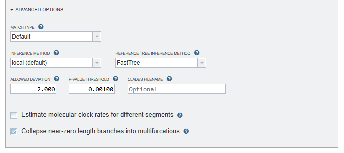
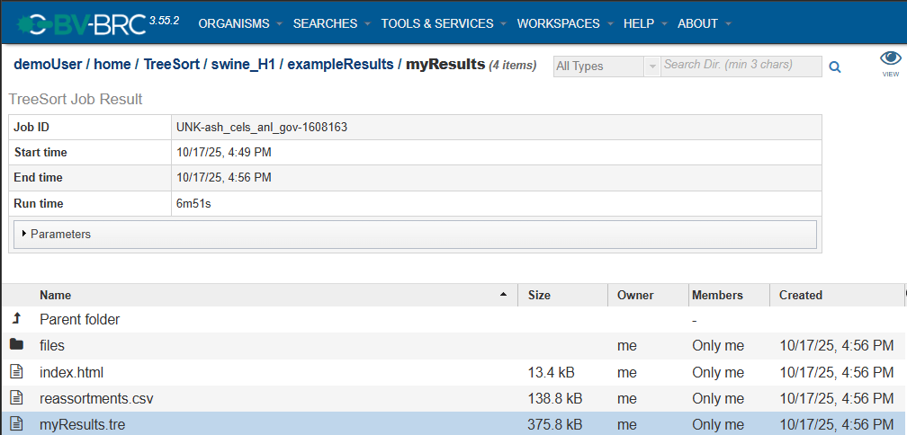

# TreeSort Service

## Overview

The idea behind TreeSort is the observation that *if there is no reassortment, then the evolutionary histories of different segments should be identical*. TreeSort then uses a phylogenetic tree for one segment (e.g., the HA influenza A virus segment) as an evolutionary hypothesis for another segment (e.g., the NA segment). We will refer to the first segment as the *reference* and the second segment as the *challenge*. By trying to fit the sequence alignment of the challenge segment to the reference tree, TreeSort identifies points on that tree, where this evolutionary hypothesis breaks. The "breaking" manifests in the mismatch between the divergence time on the reference tree (e.g., 1 year divergence between sister clades) and an unlikely high number of substitutions in the challenge segment that are required to explain the reference tree topology under the null hypothesis of no reassortment.

TreeSort has demonstrated very high accuracy in reassortment inference in simulations (manuscript in preparation). TreeSort can process datasets with tens of thousands of virus strains in just a few minutes and can scale to very large datasets with hundreds of thousands of strains. (This overview is from [https://github.com/flu-crew/TreeSort/blob/main/README.md](https://github.com/flu-crew/TreeSort/blob/main/README.md))

#### **NOTE**
The current version of TreeSort is meant to be used for Influenza viruses ONLY. We hope to provide an updated version in the near future that can be used with common segmented viruses.

## See Also
  * [TreeSort Service](https://www.bv-brc.org/app/TreeSort)
  * TreeSort Service Tutorial (TODO)

## Using the TreeSort Service
In the main menu, **TreeSort** is located under **TOOLS & SERVICES** and **Viral Tools**.

  * *Note: You must be logged into BV-BRC to use this service.*

## Parameters

## Input file
Select a FASTA file from your workspace. Note that the FASTA headers/deflines have very strict formatting requirements:
  1. The segment name and sample date must be formatted like the following example ("|segment|sample date" are in yellow):
  
  2. Only the following Influenza segment names are recognized: PB2, PB1, PA, HA, NP, NA, MP, and NS.

## Output folder
The directory in your workspace where a directory will be created for the TreeSort results.

## Output name
The name of the directory that will be created under "Output folder". This name will also be used for the primary results filename (*output name*.tre).

## Reference segment
Reassortment events are acquisitions of 1 or more novel segments relative to this (fixed) reference segment.

## Segments
Select at least 2 segments to include in the analysis.

## Advanced options

## Match type
   * **Strain**: Match the names (deflines in FASTAs) across the segments based on the strain name. E.g., "A/Texas/32/2021" or "A/swine/A0229832/Iowa/2021". Works for flu A, B, C, and D, and no pre-processing is needed to standardize the names before the analysis.
   * **EPI_ISL_XXX**: Segments are matched based on the "EPI_ISL_XXX" field (if present in deflines).
   * **RegEx**: Provide your own custom regular expression to match the segments across the alignments.

## Match RegEx
   When a match type of **RegEx** is selected, your custom regular expression will be entered in this field.

## Inference method
   * **local**: (default)
   * **mincut**: The mincut method:
     - Always determines the most parsimonious reassortment placement, even in ambiguous circumstances.
     - Uses the reassortment test to cut the reference phylogeny into the optimum (smallest) number of non-reassorting parts with theoretical guarantees on optimality.
     - Is more robust than the current "local" method in many instances, and does not result in "uncertain" reassortment inferences with the '?' annotation.

## Reference tree inference method
The tool that will be used to infer the reference tree:

* **FastTree**: (default)
  - Infers approximately-maximum-likelihood phylogenetic trees from alignments of nucleotide or protein sequences.
  - Can handle alignments with up to a million of sequences in a reasonable amount of time and memory.
  - [https://morgannprice.github.io/fasttree/](https://morgannprice.github.io/fasttree/)

* **IQ-Tree** (recommended for better accuracy)
  - A fast search algorithm ([Nguyen et al., 2015](https://academic.oup.com/mbe/article/32/1/268/2925592)) to infer phylogenetic trees by maximum likelihood.
  - [https://iqtree.github.io/](https://iqtree.github.io/)

## Allowed deviation
Maximum deviation from the estimated substitution rate within each segment. The default is 2: The substitution rate on a particular tree branch is allowed to be twice as high or twice as low as the estimated rate. The default value was estimated from the empirical influenza A data.

## P-value threshold
The cutoff p-value for the reassortment tests: the default is 0.001 (0.1 percent). You may want to decrease or increase this parameter depending on how stringent you want the analysis to be.

## Clades filename
The path to an output file where clades with evidence of reassortment will be saved.

## Estimate molecular clock rates for different segments
Estimate molecular clock rates for different segments, assuming equal rates.

## Collapse near-zero length branches into multifurcations
Collapse near-zero length branches into multifurcations (by default, TreeSort collapses all branches shorter than 1e-7 and then optimizes the multifurcations).

## Buttons

- **Reset:** Resets the input form to default values
- **Submit:** Launches the classification job. A message will appear below the box to indicate that the job is now in the queue.

## Output Results

Clicking the Jobs indicator at the bottom of the BV-BRC page opens the Jobs Status page, which displays all current and previous service jobs and their statuses.

Once the job has completed, you can view the results by double-clicking the job or clicking the "View" button on the green vertical Action Bar on the right-hand side of the page.

The Job Result page contains two sections:
* Details about the job including its ID, its start, end, and run times, and the parameters that were used when the job was submitted (click on the arrow next to "Parameters" to view the job description formatted as JSON).
* Result files generated by the TreeSort service and saved in your Workspace. The best place to start is the index.html page (see details below).

### Result files
* **index.html**: An overview of the analysis results with links to all files generated by TreeSort, descriptions of the file types, and guidance on how to interpret the result data. It can be accessed by clicking on the "view" icon (an eye) to the right of the Job Details, or by clicking directly on the page icon to the left of "index.html" in the list of result files.
* **reassortments.csv**: A spreadsheet of the analysis results for every strain that was included in the input FASTA file. For each strain, the "is_reassorted" column will contain a "Y" if reassortment is inferred, and the "is_uncertain" column indicates the uncertainty of the inference. The remaining columns represent the segments found in the input FASTA file, and if reassortment is inferred for that strain, the reassorted segment's column will contain the number of nucleotides that differ from the previous strain.
* **<*output name*>.tre**: An annotated tree file in Nexus format where *output name* is the text entered in the **Output name** field.
* The **files** folder contains segment-specific intermediate files generated by TreeSort before performing the analysis.

### Segment-specific files
These files are generated for every virus segment included in the analysis, where *segment name* is PB2, PB1, PA, HA, NP, NA, MP, or NS.
* **<*segment name*>-input.fasta.aln**
* **<*segment name*>-input.fasta.aln.dates.csv**
* **<*segment name*>-input.fasta.aln.rooted.tre**
* **<*segment name*>-input.fasta.tre**

* **<*segment name*>-input.fasta.aln.treetime** is a folder that contains the following files:
   * **outliers.tsv**
   * **root_to_tip_regression.pdf**
   * **rtt.csv**

## Action Buttons
After selecting one of the output files by clicking it, a set of options becomes available in the vertical green Action Bar on the right side of the table. These include:

* **Hide/Show:** Toggles (hides) the right-hand side Details Pane.
* **Guide** Link to the corresponding User Guide
* **Download:** Downloads the selected item.
* **View** Displays the content of the file, typically as plain text or rendered html, depending on filetype.
* **Delete** Deletes the file.
* **Rename** Allows renaming of the file.
* **Copy:** Copies the selected items to the clipboard.
* **Move** Allows moving of the file to another folder.
* **Edit Type** Allows changing of the type of the file in terms of how BV-BRC interprets the content and uses it in other services or parts of the website. Allowable types include unspecified, contigs, nwk, reads, differential expression input data, and differential expression input metadata.

More details are available in the [Action Buttons](https://bv-brc.org/docs/user_guides/action_buttons.html) user guide.

## References

1. Alexey Markin, Catherine A. Macken, Amy L. Baker, Tavis K. Anderson, "Revealing reassortment in influenza A viruses with TreeSort"
[bioRxiv 2024.11.15.623781](https://www.biorxiv.org/content/10.1101/2024.11.15.623781v1); doi: https://doi.org/10.1101/2024.11.15.623781

2. GitHub: [https://github.com/flu-crew/TreeSort](https://github.com/flu-crew/TreeSort)

