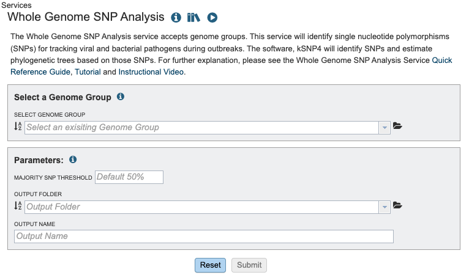

# Whole Genome SNP Analysis Service

## Overview
 Whole Genome Sequencing (WGS) is used in bacterial and viral  genomics to determine the order of all, or most, of the nucleotides in a genome. This approach provides valuable insights for applicants such as epidemiological typing, drugresistance profiling and phylogeneticf analysis. 

 A key type of genetic variation identified through WGS is Single Nucleotide Polymorphism (SNP) a difference in a single nucleotide position in the genome. SNPs are critical for distinguishing bacterial strains, assessing genetic diversity, conducting outbreak surveillance, and correlating genotypic variation with phenotypic traits.
 
 Unlike many eukaryotic genomes, bacterial and viral genomes often contain large insertions and deleitions (indels), inversions and transpositions of genomic segments.  These features make whole-genome multiple sequence alignment particularly challenging. To address this, the SNP analysis service uses kSNP4.1, a tool that identifies SNPs without the need for full genome alignment.

 This service takes a genome group as input and:
 - Identifies SNPs across all genomes using k-mer-based analysis.
 - Constructs phylogenetic trees based on SNP differences.
 - Generates output files including a multiple alignment of SNP positions and per-genome SNP details.

## See also
* [Whole Genome SNP Analysis Service](https://bv-brc.org/app/WholeGenomeSNPAnalysis)
* [Whole Genome SNP Analysis Service Tutorial](../../tutorial/whole_genome_snp_analysis/whole_genome_snp_analysis_service.html)

## Using the Whole Genome SNP Analysis Service
The **Whole Genome SNP Analysis** submenu option under the **Services** main menu (Phylogenomics category) opens the Whole Genome SNP Analysis Service input form (*shown below*). *Note: You must be logged into BV-BRC to use this service.*

## Options

## Select a Genome Group
For more information about creating a genome group please visit our [documentation](https://www.bv-brc.org/docs/quick_references/workspaces/groups.html) or our [video tutorial](https://www.youtube.com/watch?v=BDCUyhX9brA&t=36s).

## Parameters
The **Majority SNP Threshold** defines the portion of genomes that must contain the SNP in order to be included in the Majority SNP category. (see All SNPs, Core SNPs and Majority SNPs above).

### Output Folder
The workspace folder where results will be placed.

### Output Name
Name used to uniquely identify results.

## Buttons

**Reset:** Resets the input form to default values

**Submit:** Launches the Whole Genome SNP Analysis job

## Output Results

The Whole Genome SNP Analysis Service generates several files that are deposited in the designated Output Folder. These include:
1. The results are divided into sub directories, All SNPs, Core SNPs, Majority SNPs. Each  sub directory follows the same structure.
2. Intermediate Files are parsed and included in the report and other output files.
3. The VCFs directory contains a variant call format file for compatibility with other tools using the reference genome indicated in the file name.
4. A comprehensive report located within the "WholeGenomeSNP_Report.html" file, described in detail in the service tutorial.

Each subgroup contains the following files where SNPs_all would represent the subcategory:
* Cluster_Information - Files in this directory list each locus with a list for which a tree node or homoplastic group of sequences the locus is present in. Note: the Group numbers in these files correspond to the groups listed in the Homoplasy_groups files.
* Homplasy - Files in this directory give the number of SNPs in each homoplastic group of genomes. These files are similar to. The Node_SNP_counts files, except for the groups of genomes that share SNPs but that do not correspond nodes of the tree. They give a group identifier (e.g. “Group.25” which corresponds to the info reported in the ClusterInfo files), and the number of target sequences that make up this group and the number of SNP alleles that are shared by this group of genomes, followed by the genome identities that make up the group.
* SNPs_all.tsv - this file can be very large and may take a moment to load. It is tab separated will populate our TSV view and can also be opened with Excell.  This file shows the each alternative SNP, the SNP allele with the central base indicated by a dot. 
* SNPs_all_matrix.fasta this fasta file is formatted with the relaxed PHYLIP format of SNP alleles. The genome name followed by the SNP allele string. The SNP alleles for each genome are concatenated into a string whose length is the number of SNPs. Loci are concatenated in the same order as listed in the SNPs_all file. Missing SNPs are indicated by a dash.
* SNPs_all_matrix.txt this fasta file contains the same information as the SNPs_all_matrix.fasta. N indicates that the SNP is absent in that strain.
* Trees - This tool outputs many trees where nodes are annotated with data from the analysis. Tree files ending in "phyloxml" can map metadat to the tree. The newick files are the same trees in their on directory. These files can also be uploaded to extrenal tree viewers. For a detailed tutorial about the intreactive tree viewer visit this [tutorial](https://www.bv-brc.org/docs/quick_references/services/archaeopteryx.html).

It is possible to be missing a tree. This happens when a given tree method is unable to make a sensible tree

### Action buttons

After selecting one of the output files by clicking it, a set of options becomes available in the vertical green Action Bar on the right side of the table, listed below. To find out more about the different options for using these output files, see the [Whole Genome SNP Analysis Service Tutorial](https://bv-brc.org/docs/tutorial/whole_genome_snp_analysis/whole_genome_snp_analysis_service.html).

* **Hide/Show:** Toggles (hides) the right-hand side Details Pane.
* **Guide:** Link to the corresponding Quick Reference Guide
* **Download:**  Downloads the selected item.
* **View:** Displays the content of the file, typically as plain text or rendered html, depending on filetype. Only available for html, txt, and tsv file types.
* **Delete:** Deletes the file.
* **Rename:** Allows renaming of the file.
* **Copy:** Copies the selected items to the clipboard.
* **Move:** Allows moving of the file to another folder.
* **Edit Type:** Allows changing of the type of the file in terms of how BV-BRC interprets the content and uses it in other services or parts of the website.  Allowable types include unspecified, contigs, nwk, reads, differential expression input data, and differential expression input metadata.

More details are available in the [Action Bar](/quick_references/action_bar) Quick Reference Guide.

## References
1. Olson RD, Assaf R, Brettin T, Conrad N, Cucinell C, Davis JJ, Dempsey DM, Dickerman A, Dietrich EM, Kenyon RW, Kuscuoglu M, Lefkowitz EJ, Lu J, Machi D, Macken C, Mao C, Niewiadomska A, Nguyen M, Olsen GJ, Overbeek JC, Parrello B, Parrello V, Porter JS, Pusch GD, Shukla M, Singh I, Stewart L, Tan G, Thomas C, VanOeffelen M, Vonstein V, Wallace ZS, Warren AS, Wattam AR, Xia F, Yoo H, Zhang Y, Zmasek CM, Scheuermann RH, Stevens RL.
2. Hall, B. G., & Nisbet, J. (2023). Building phylogenetic trees from genome sequences with KSNP4. Molecular Biology and Evolution, 40(11). https://doi.org/10.1093/molbev/msad235
