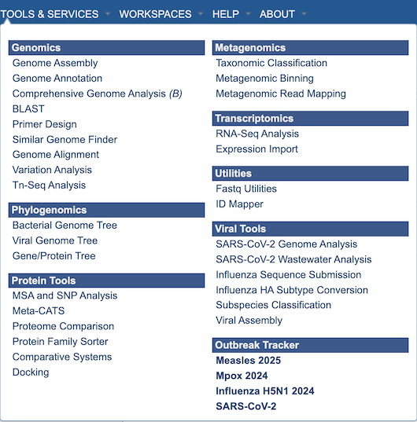

Tools & Services
================
The top-level Services Menu provides access to wide range of services and tools for analyzing data. The BV-BRC private Workspace (available via registration) provides a means for accessing and securely using the services with your own data, and then interacting with your data in the context of the full BV-BRC data and tools.

Clicking on one of the menu items will display an input form for the the corresponding analysis service, as described below. Note that registration and login is required for the analysis services. 

Services generally support both bacterial and viral data analysis.  However, some are limited to one type or the other, indicated by a (B) for baceria-only services, and a <V> for viral-only services.

Genomics Services
-----------------

.. toctree::
   :maxdepth: 1

   services/genome_assembly_service.md
   services/genome_annotation_service.md
   services/comprehensive_genome_analysis_service.md
   services/blast.md
   services/primer_design_service.md
   services/similar_genome_finder_service.md
   services/genome_alignment_service.md
   services/variation_analysis_service.md
   services/tn_seq_analysis_service.md

Phylogenomics Services
----------------------

.. toctree::
   :maxdepth: 1

   services/phylogenetic_tree_building_service.md
   services/genetree.md

Protein Tools Services
----------------------
.. toctree::
   :maxdepth: 1

   services/msa_snp_variation_service.md
   services/metacats.md
   services/proteome_comparison_service.md
   services/comparative_systems.md

Metagenomics Services
---------------------
.. toctree::
   :maxdepth: 1
   
   services/taxonomic_classification_service.md
   services/metagenomic_binning_service.md
   services/metagenomic_read_mapping_service.md

Transcriptomics Services
------------------------
.. toctree::
   :maxdepth: 1

   services/rna_seq_analysis_service.md
   services/expression_data_import_service.md

Utilities Services
------------------

.. toctree::
   :maxdepth: 1

   services/fastq_utilities_service.md
   services/id_mapper.md

Viral Services
--------------

.. toctree::
   :maxdepth: 1

   services/sars_cov_2_assembly_annotation_service.md
   services/sars_cov_2_wastewater_analysis_service.md
   services/sequence_submission_service.md
   services/ha_numbering_service.md
   services/subspecies_classification_service.md

Data Visualizations
-------------------

.. toctree::
   :maxdepth: 1

   organisms_genome/genome_browser.md
   organisms_genome/circular_genome_viewer.md
   organisms_gene/compare_region_viewer.md
   services/archaeopteryx.md
   other/msa_viewer.md
   other/protein_family_sorter.md
   other/pathway_comparison_tool.md
   other/subsystems_data.md
