# BLAST (Homology) Service

The **B**asic **L**ocal **A**lignment **S**earch **T**ool (BLAST)[1] is an algorithm and program for comparing primary biological sequence information, such as the amino-acid sequences of proteins or the nucleotides of DNA and/or RNA sequences. A BLAST search allows a researcher to compare a subject protein or nucleotide sequence (called a **query**) with a library or database of sequences, and identify database sequences that resemble the query sequence above a certain threshold.  An excellent resource on BLAST is provided by Madden[2].

## Creating a folder to hold the BLAST job and related data
Please refer to the [Assembly Service Tutorial](./genome_assembly/assembly.html) for instructions on creating a folder in the BV-BRC.

## Locating the BLAST Service App

1\. Click on the Services tab at the top of the page, and then click on BLAST. 

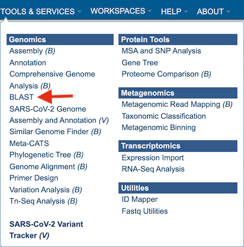

2\.	This will open the BLAST landing page where researchers can choose a specific program, insert or upload a specific fasta sequence, and select parameters to the service. 

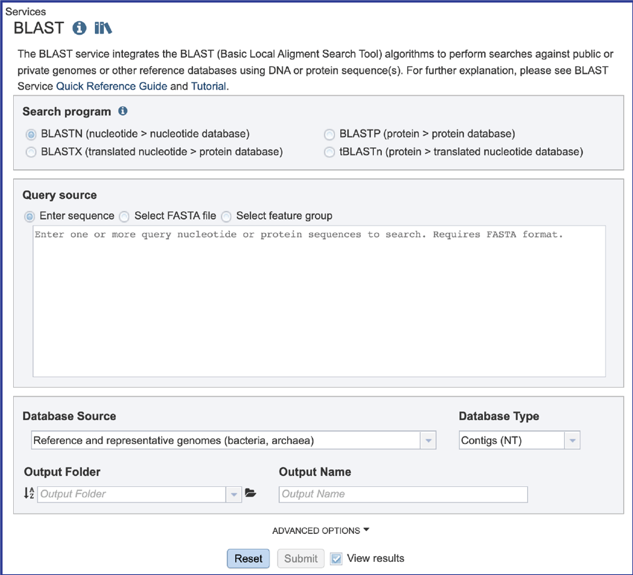

## Selecting the Search Program

There are four BLAST programs provided by BV-BRC, and each has a specific query sequence and database. Clicking on the radial button in front of the program name will select it and will also select the appropriate databases.
* BLASTN – The query sequence is DNA (nucleotide), and when enabled the program will search against DNA databases of contig or gene sequences.
* BLASTX – The query sequence is DNA (nucleotide), and when enabled the program will search against the protein sequence database.
* BLASTP – The query sequence is protein (amino acid), and when enabled the program will search against the protein sequence database.
* tBLASTn – The query sequence is protein (amino acid), and when enabled the program will search against DNA databases of contig or gene sequences. 

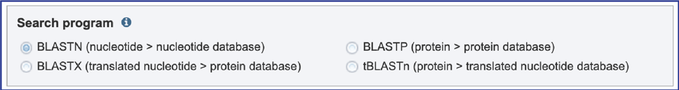

## Selecting the Query Source
1\.	There are three types of Query sources that are provided by BV-BRC.  Clicking on the radial button in front of the query type will select it and will also reformat the page to support that selection.  

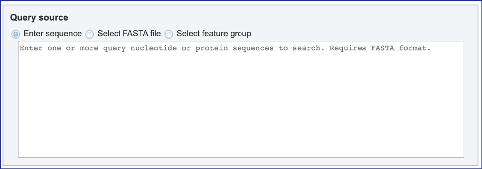

2\.	**Enter sequence.** When “Enter sequence” is selected a query sequence must be pasted into the text box. 

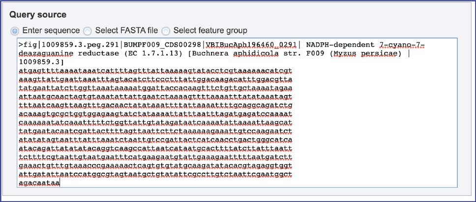

3\.	**Select FASTA file.**  When “Select FASTA file” is selected, a query sequence can be located in several ways.  Files that were recently uploaded can be seen and selected by clicking on the drop-down arrow that follows the text box.  Clicking on the correct sequence will fill the text box with that name.

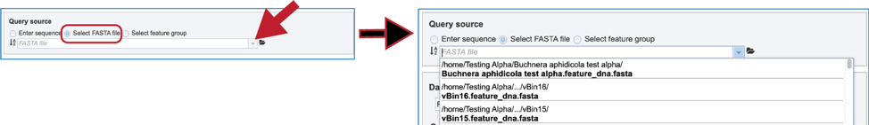

4\.	Another way to select a fasta file is to navigate to one that is in the workspace.  To do this, click on the folder icon at the end of the text box.  This will open a pop-up window that shows the workspace.  Scroll down to find the correct folder and then click on it. 

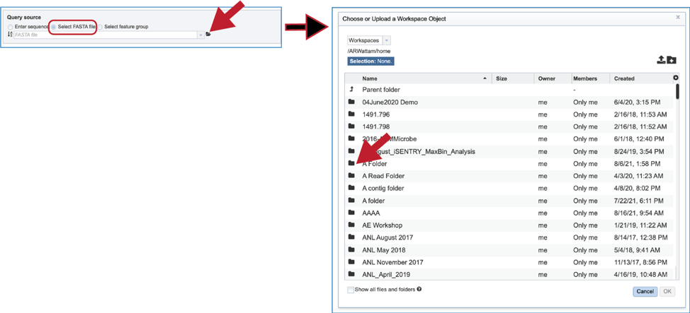

5\.	The pop-up window will then show the contents of that folder.  Click on the row that has the file of interest and then on the OK button at the lower right of the window.  The pop-up window will close, and the name of the selected file will appear in the Query source text box.  

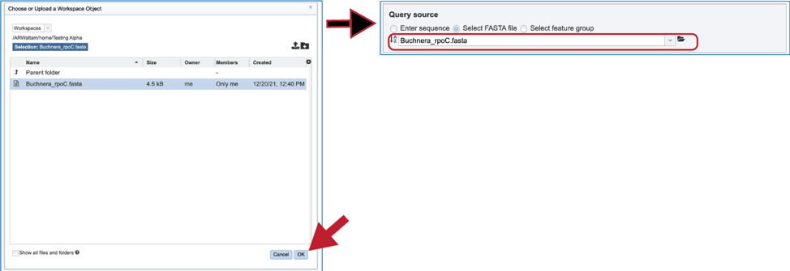

6\.	Fasta files can also be uploaded to the workspace.  From the pop-up window, clicking on the icon will open a window that starts the process for selecting a file from the computer.  Note that the window has the type of the file needed for the service pre-selected and when the computer interface opens, it will highlight files that meet the fasta requirement.  Moreover, those files that are uploaded will be tagged as DNA or Protein FASTA, depending upon the service that was originally selected the search program. Click on the Select File button in the middle of the page. 
 
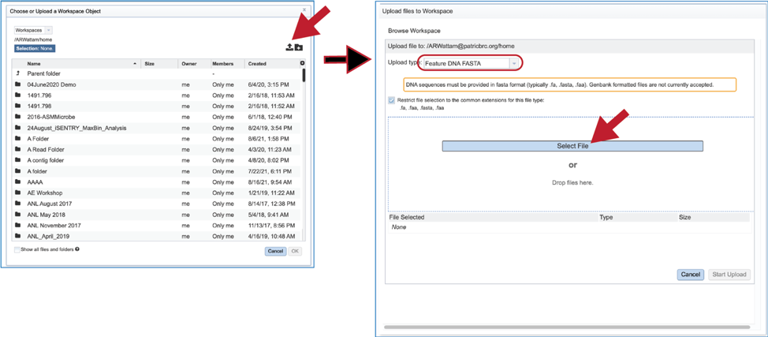

7\.	This will open an interface with the computer.  Navigate to the file of interest and click on the Open button.  The name will then appear below File Selected on the pop-up window.  Then click on the Start Upload button at the lower right of the window. 

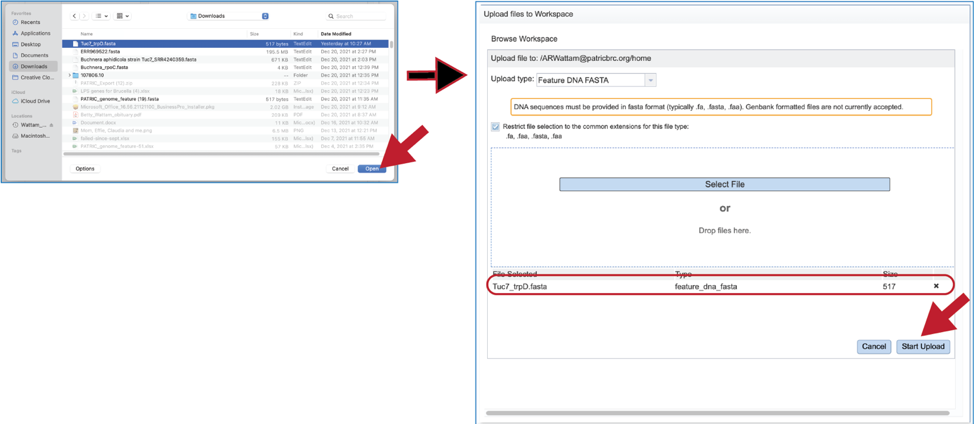

8\.	The pop-up window will close, and the name of the file will appear in the Query source text box. 

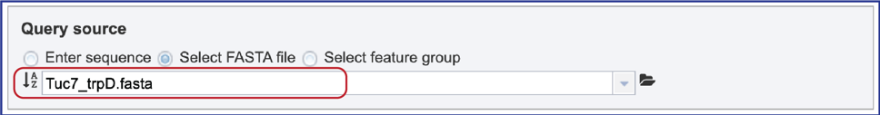

9\.	**Select Feature group.**  When “Select Feature group” is selected, a query sequence can be located in several ways as described above for Fasta files.  Text can be entered in the text box or located by clicking on the arrow at the end of box.  Clicking on the folder icon at the end of the text box will open a pop-up window with access to the workspace, where the group of interest can be located and selected. 

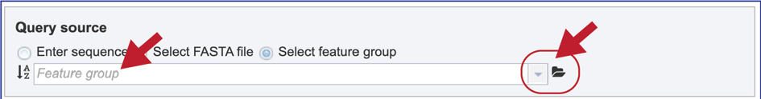

## Selecting the Database

1\.	BR-BRC has different databases to choose from.  To see the available choices, click on the down arrow at the end of the text box underneath Database Source.  There are six different choices to search within, each of which can be selected by clicking on the row that contains them: 
* Reference and representative genomes (bacteria, archaea)
* Reference and representative genomes (virus)
* Selected genome list
* Selected genome group
* Selected feature group
* Taxon
* Selected fasta file

**Reference and representative genomes.**  The reference and representative genomes, which are the default, are those designated by the National Center (https://www.ncbi.nlm.nih.gov/refseq/about/prokaryotes/). 

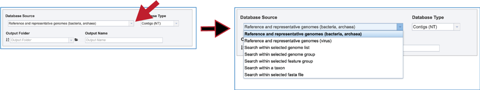

2\.	**Genome List.** Clicking on “Search within genome list” in the drop-down box will open a new source box where desired genomes can be added and searched against.   

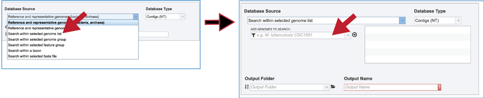

3\.	The name or ID of the desired genome is entered into the text box.  The name of the matching genome, which will occur below the text box, is clicked on, and then the name will appear in the text box.  To move it into the box for the selected genomes, click on the arrow at the end of the text box.  The name will move into the text box at the right.  Additional genomes can be added in this manner. 

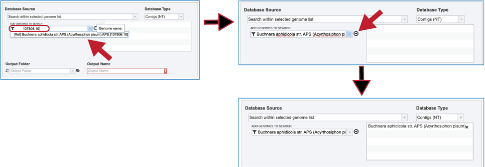

4\.	**Genome Group.**  Previously created groups of genomes can also be searched.  There are several ways to navigate to the group.  Clicking on the drop-down box will show genome groups, with the most recently created groups shown first. Clicking on the desired group will fill the box with that name. 

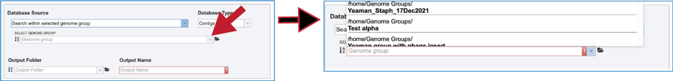

5\.	The text box can also be used by entering part of a name.  the drop-down box below will show all the genome groups that match that text.  Clicking on the desired group will fill the box with that name. 

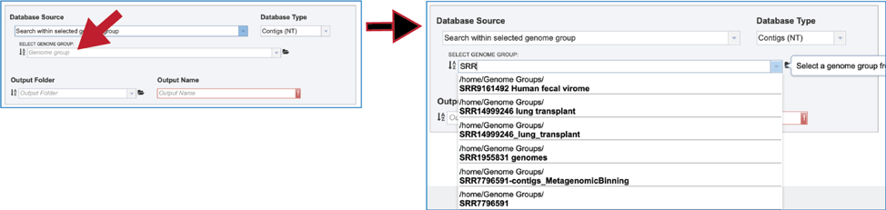

6\.	Another way to find a genome group of interest is to navigate to it in the workspace.  Clicking on the file icon to the immediate right of the text box will open a pop-up window that shows the workspace.  Navigate to the desired folder, click on the row that contains the desired group, and then click on the OK button at the lower right of that window.  The name of the selected group will appear in the text box. 

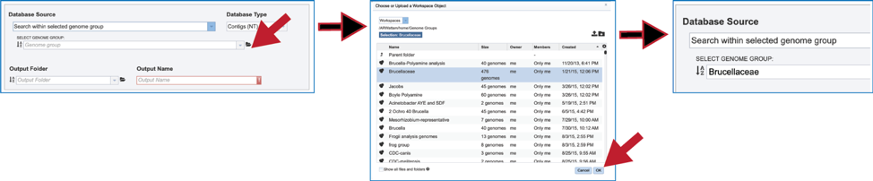

7\.	**Feature group.** Previously created groups of features (genes or proteins) can also be searched, with the methods like those described for genome groups above. 

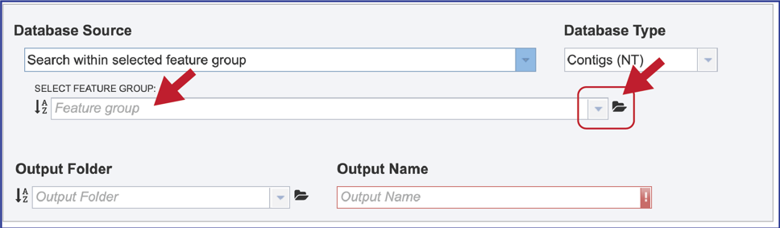

8\.	**Taxon.** A broader search across a taxon is also provided.  Entering the name of the taxon will open a drop-down box that shows the taxa that have similar text.  Clicking on the row that has the correct name will select the database, which will appear in the text box. 

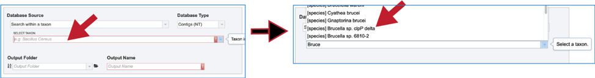

9\.	**Fasta file.**  Searching within a fasta file is also provided.  The file can be present in BV-BRC, which would be located by entering the name in the text box, clicking on the drop-down box, or navigating within the workspace.  

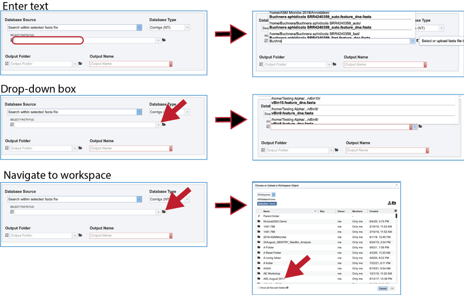

10\. It is also possible to upload a fasta file from outside BV-BRC. Clicking on the folder icon at the end to the text box opens a pop-up window. Click on the upload icon in the upper right corner of the window.  This will open the dialog box with the computer that has been described above. 

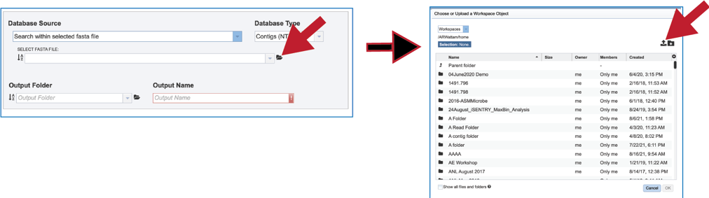

## Selecting the Database type

1\.	The available database will be determined by the query source.  When there is a nucleotide sequence with BLASTN or BLASTX selected, BV-BRC provides searches against a database of contigs or gene.  Clicking on the down arrow that follows “Contigs” will show both choices, and types.  Clicking on the desired row will select the database. 

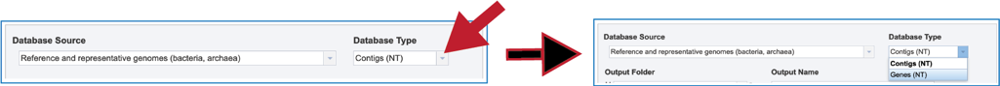

2\.	When an amino acid sequence with BLASTP or tBLASTn is selected, Proteins is the only type of database. 
 
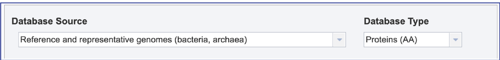

## Selecting an Output Folder

An output folder must be created or selected to hold the job.  Folder creation is described at the top of this tutorial.  Existing folders can be located by entering the name in the text box, clicking on the arrow at the end of that box, or clicking on the folder icon to navigate to the workspace. 

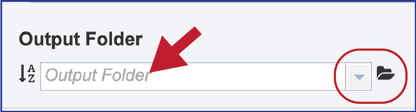

## Naming the BLAST job

1\.	Every job submitted to BV-BRC needs a name.  This is entered into the text box underneath the words Output name. 

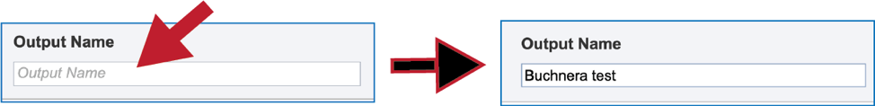

2\.	At this point, if the search program, the query source, the database source and type, the output folder and name have been selected, the Submit button will turn blue.  That means that the job is ready to be submitted. 

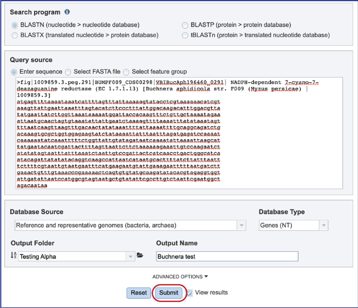

## Selecting Advanced Options

1\.	The number of hits returned can be selected, as can the E value.  To enable that selection, click on the down arrow following Advanced Options below the Database Source box.  This will open a box that shows the BLAST parameters. 

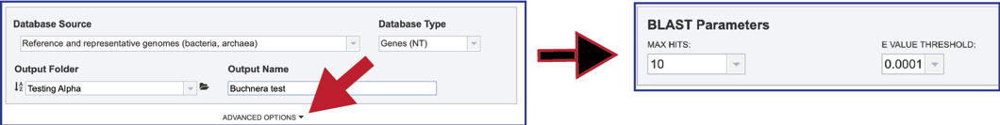

2\. Clicking on the down arrow at the end of the text box underneath Max Hits will show the number of hits that can be returned. Clicking on the desired number will autofill the text box with that selection.

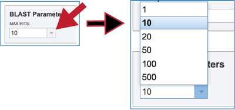

3\. Clicking on the down arrow at the end of the text box underneath E value threshold will show stringency of selection for the BLAST hits that are returned. Clicking on the desired threshold will autofill the text box with that selection. 

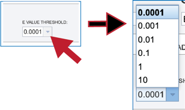

## Submitting the BLAST job

1\. The BLAST job can be submitted by clicking the blue Submit button.  When View Results is selected, the job will return in the same tab. 

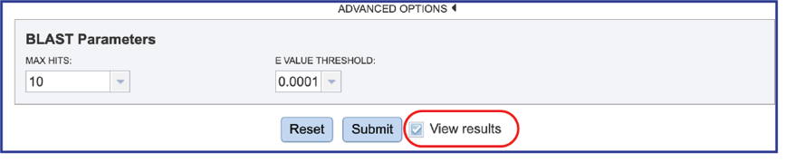

2\.	A message will appear following job selection that the job has been submitted and queued, and that it is a live job. 

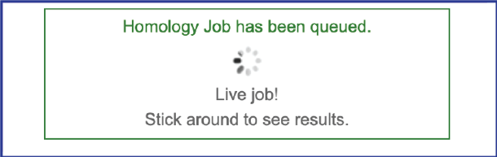

3\.	If the View results button was not clicked, the message will indicate that the job has been submitted and queued. 

## Viewing the BLAST job

1\.	A BLAST job that had the View results option selected will return results in the same page. 

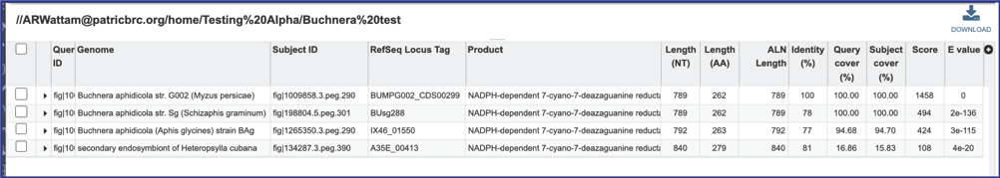

2\.	Even if the View results option had been selected, all BLAST jobs can also be found on the Jobs page.  Click on the Jobs box at the bottom right of any BV-BRC page. 

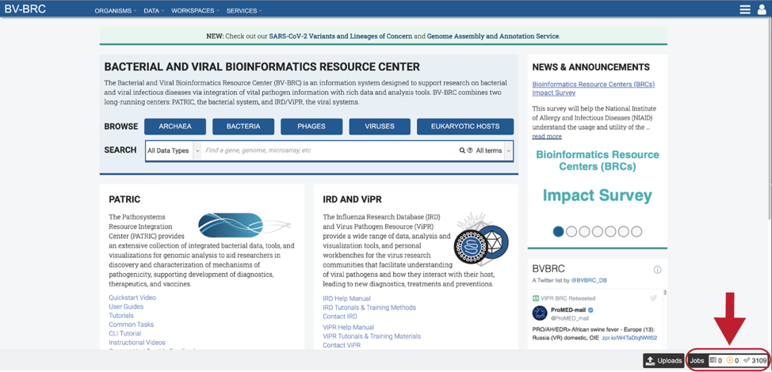

3\.	This will open the Jobs Landing page where the status of submitted jobs is displayed. 
 
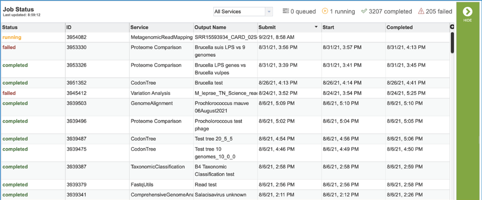

4\.	A job that has been successfully completed can be viewed by clicking on the row and then clicking on the View icon in the vertical green bar. 

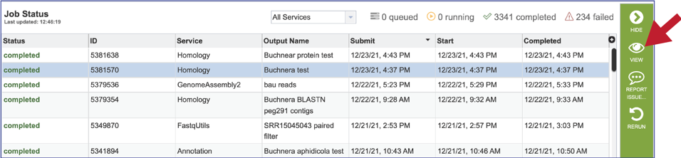

5\.	This will rewrite the page to show the information about the job, and all the files that are produced when the pipeline runs.  The information about the job submission can be seen in the table at the top of the results page.  To see all the parameters that were selected when the job was submitted, click on the Parameters row. 

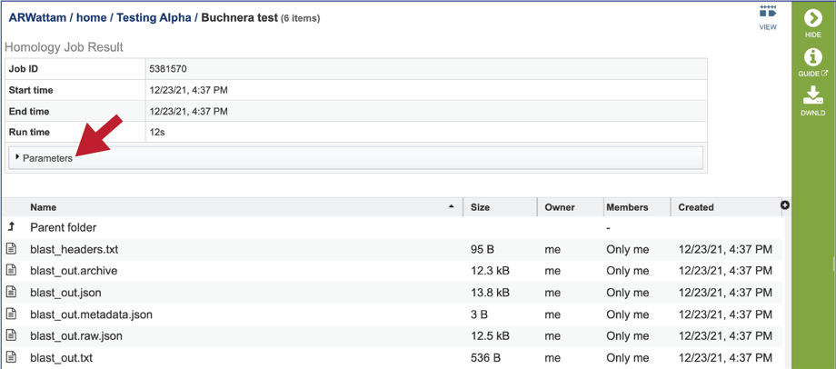

6\. This will show the information on what was selected when the job was originally submitted. 

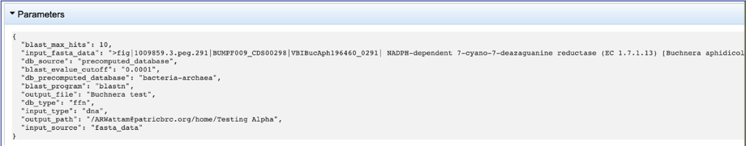

7\. The jobs page has several files for download or viewing.  The **blast_headers.txt** file shows the column headers that are provided with the BLAST results.  They are as follows:
* qseqid:  query or source (e.g., gene) sequence id
* sseqid:  subject or target (e.g., reference genome) sequence id
* pident:  percentage of identical matches
* length:  alignment length (sequence overlap)
* mismatch:  number of mismatches
* gapopen:  number of gap openings
* qstart:  start of alignment in query
* qend:  end of alignment in query
* sstart:  start of alignment in subject
* send:  end of alignment in subject
* evalue:  expect value
* bitscore:  bit score

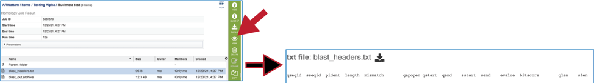

8\. The **blast_out.archive** file can be viewed by selecting the row and clicking on the View icon.  This will reload the page to show the archive file. This file is the entire file generated from a BLAST job, which BV-BRC uses to create the blast_out.json file used in the BV-BRC viewers. This file could be used in an alternate viewer outside of BV-BRC. 

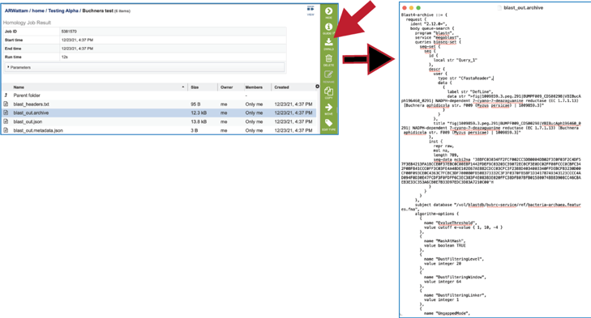

9\. The BLAST service also produces several json files (A JSON file is a file that stores simple data structures and objects in JavaScript Object Notation (JSON) format, which is a standard data interchange format. It is primarily used for transmitting data between a web application and a server). There is a **blast_out.json** file, which is formatted output created from the **blast_out.archive** file.  It can be viewed by selecting the row and clicking on the **View** icon.  This will reload the page to show the json file. 

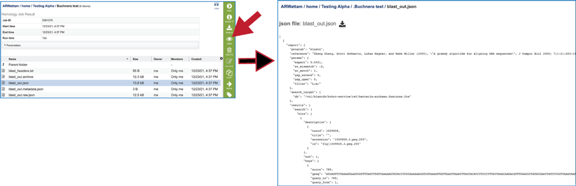

10\. The service also provides a **blast_out.metadata.json** file for the metadata associated with the BLAST job. This can be viewed by selecting the row and then clicking on the View icon. 

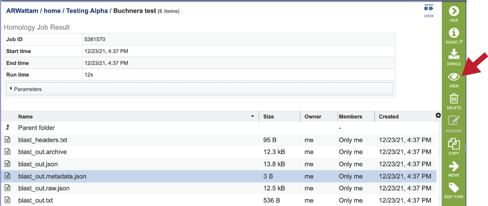

11\. The service also provides a **blast_out.raw.json** file. BLAST uses a list of BLAST identifiers that are not the same identifiers that we use at BV-BRC, so this file includes those identifiers.  It can be viewed by selecting the row and then clicking on the View icon.  This will rewrite the page to show the file. 

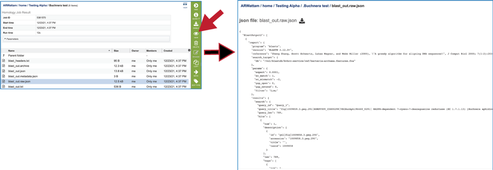

12\. Clicking on the row that contains the **blast_out.txt** file and then the View icon will rewrite the page to show the BLAST output without the column heads. These will show the query and target sequences, and the strength of the BLAST hits. 

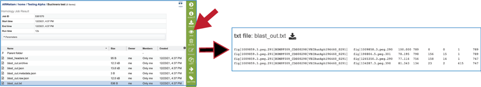

13\. BV-BRC also provides an interface that shows the BLAST hits and the alignments.  To see them, click on the **View** icon at the *upper right of the Jobs page*. 

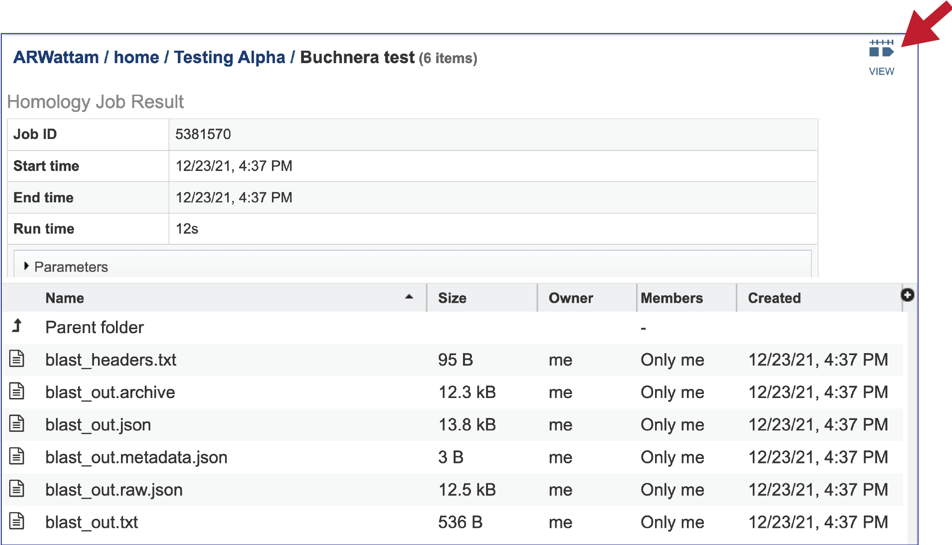

14\. This will rewrite the page to show the details of the BLAST job, including the query and subject IDs and the strength of the BLAST hits.  This table can be downloaded by clicking on the download icon at the top right of this table. 

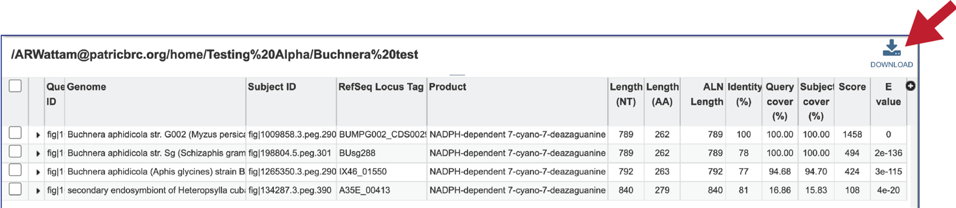

15\. The alignment between the query and subject sequences can be seen by clicking on the arrow icon in the second column. 

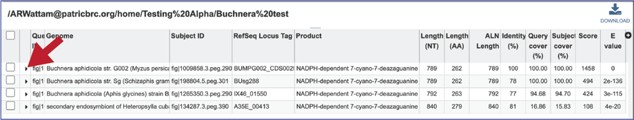

16\. This will show a drop-down view of the alignment. 

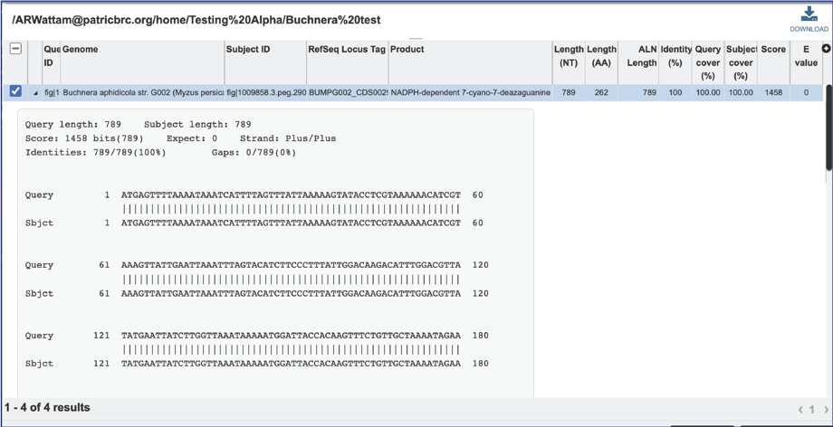

17\. Information about the subject sequence can be seen by clicking on the check box in the first column for each of the rows.  This will populate the vertical green bar to the right with different icons where different information can be viewed. 

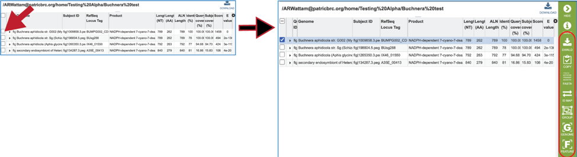

18\. Clicking on the **FASTA** icon will provide the option to view the nucleotide or amino acid sequence of the BLAST subject data, which is in the database. 

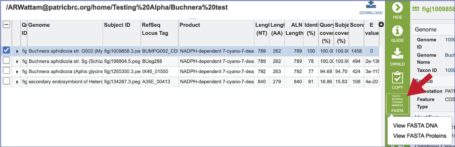

19\. Clicking on the **ID Mapping** icon will open a drop-down box that allows researcher to find other identifiers, either within or outside of the BV-BRC, that the subject data has. 
 
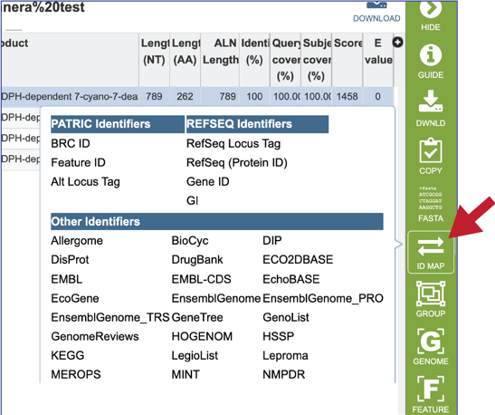

20\. Clicking on the **Group** icon will open a pop-up window where researchers can add the subject hit to a feature (gene or protein) or genome group.  The subject can be added to an existing group, or a new group can be created. 

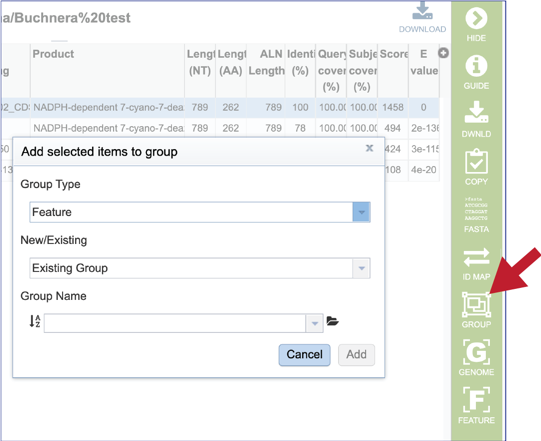

21\. Clicking on the Genome icon will open a new tab that shows the genome landing page of the genome that contains the subject sequence.  

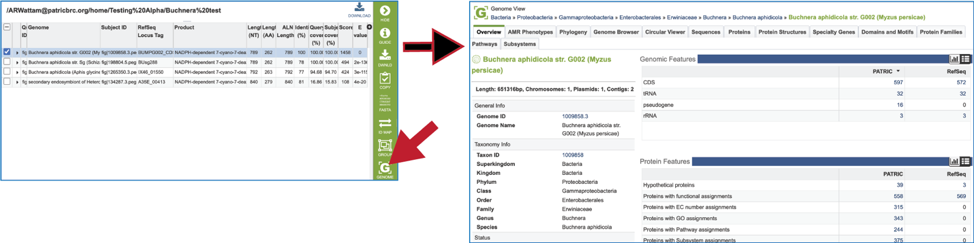

22\. Clicking on the Feature icon will open a new tab that shows the feature landing page of the gene/protein that contains the subject sequence. 

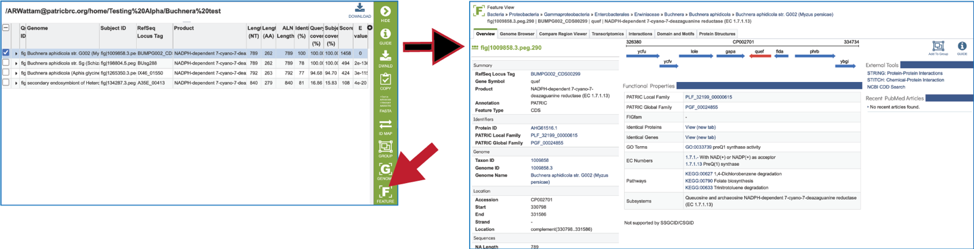

## References

1. Altschul, S. F. J. e. BLAST algorithm.  (2001).
2. Madden, T. The BLAST sequence analysis tool. The NCBI handbook 2, 425-436 (2013).

