# Comparative Systems

The new Comparative Systems service at BV-BRC combines two tools that were part of the PATRIC resource (Protein Family Sorter and Comparative Pathways Viewer) and also includes subsystems1,2, a set of functional roles that together implement a specific biological process or structural complex and can also be generalized as pathways.   Up to 500 genomes can be compared.  All of the three systems use the two protein families (PATtyFams3) that are assigned in the BV-BRC annotation process known as RASTtk4.  The global families, known as PGFams, can be used for cross genus comparisons.  The local families (PLFams) are for intra genus comparisons.

The Protein Family Sorter allows users to select a set of genomes of interest  and examine distribution of protein families across the genomes, commonly referred to as the “pan genome,” which in this case refers to the superset of proteins found in all selected genomes. This tool provides various filtering options to quickly locate protein families that are conserved across all the genomes (“core genome”), conserved only in a subset of the selected genomes (“accessory genome”) or that match a specified function. A tabular view shows protein families matching filtering criteria and an interactive heatmap viewer provides a bird’s-eye (“pan genome”) view of the distribution of the protein families across multiple genomes, with clustering and anchoring functions to show relative conservation of synteny and identify areas of possible horizontal transfer.

The Comparative Pathway tool is also based on the annotations. It allows researchers to identify a set of metabolic pathways based on taxonomy, EC number, pathway ID, pathway name and/or specific annotation type. The data are mapped to and summarized on pathway maps from the Kyoto Encyclopedia of Genes and Genomes, commonly known as KEGG5. This tool also provides a table of unique pathways that match the search criteria (i.e., the genomes or proteins chosen by the researcher, or at any taxonomic level) from which researchers can select specific pathways of interest and view a KEGG Map, or on a heatmap view that summarizes the data, including presence/absence of individual EC numbers within the selected genomes.

Subsystems are also included in the Comparative Systems service.  This part of the service includes a distribution pie chart that summarizes the functionality and genes across all genomes selected.  It also includes a table showing the individual subsystems available.  When a subsystem is selected, researchers can see a heatmap showing the genes that are included in it and the presence and absence of those genes across all the genomes in the selection. 

 
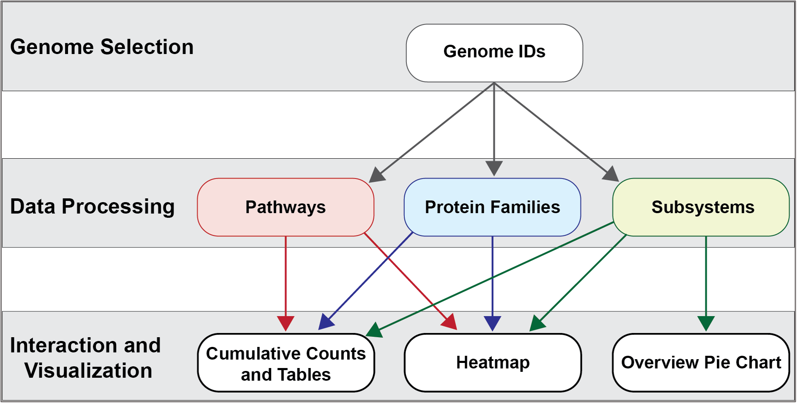

## Source code for algorithms 

The source code for the Comparative Systems service can be found at:  
[https://github.com/BV-BRC/comparative_systems_service](https://github.com/BV-BRC/comparative_systems_service)

## Creating a folder to hold the Comparative Systems job and related data
1.	It is always good practice to create a folder to keep the results from a particular experiment or project in order.  To create a new folder, go to the Workspaces tab and click on home.
 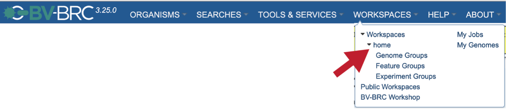

2.	This will open the home directory on your workspace.  To create a new folder, click on the Add Folder icon at the top right of the table.
 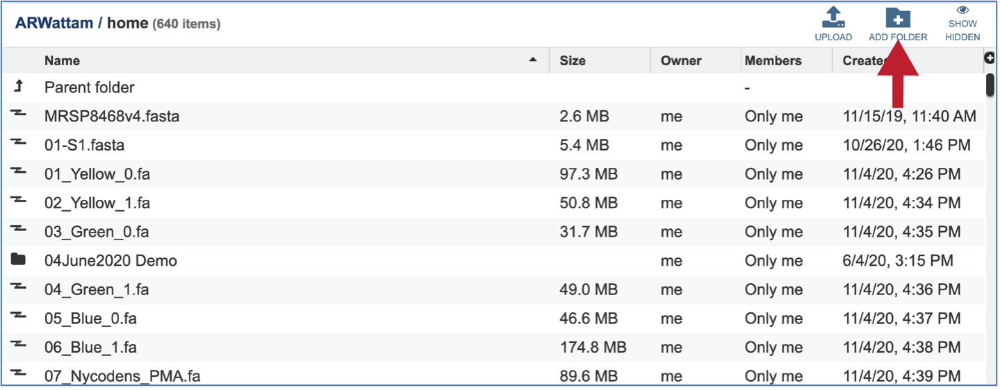

3.	This will open a pop-up window.  Note that the Create Folder button is greyed out.  Type the desired name in the text box.
 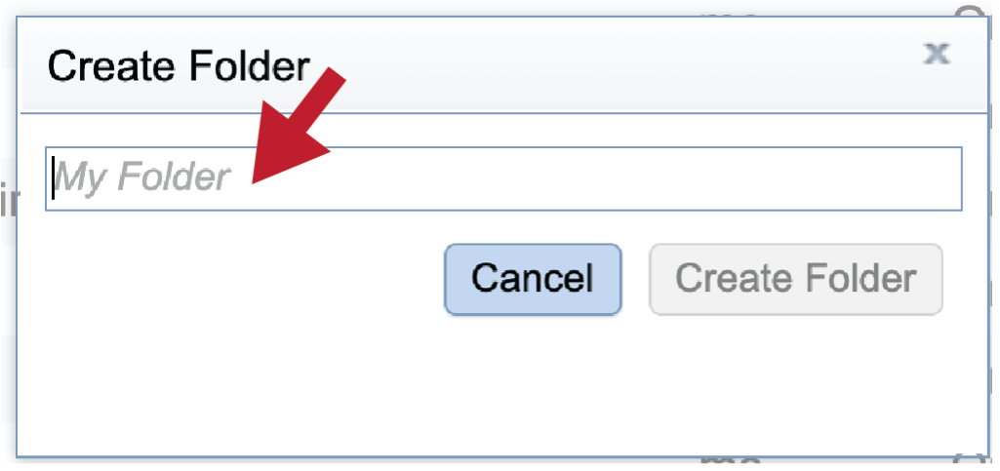 

4.	Once the name is entered, the Create Folder icon will turn blue.  To create the folder, click on that button.
 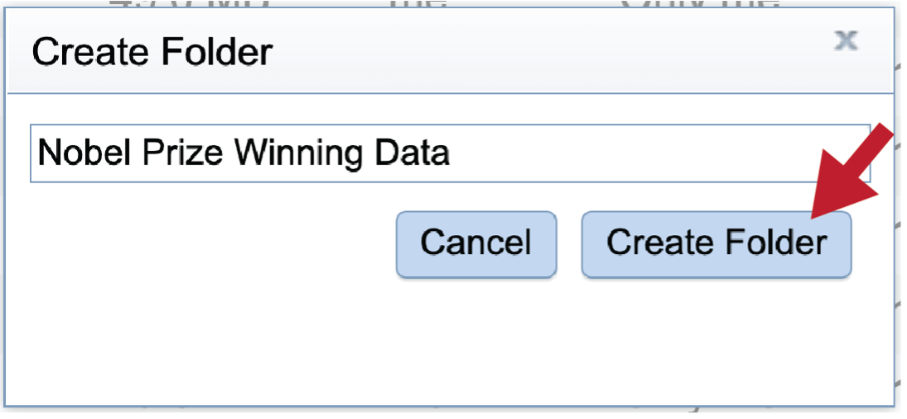 

5.	The pop-up window will disappear.  At the button left of the page you will see a temporal message indicating that the folder was successfully created.
 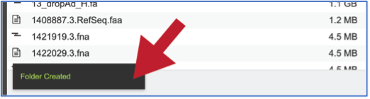 

## Locating the Comparative Systems App
1.	At the top of any BV-BRC page, find the Services tab
 

2.	In the drop-down box, underneath Genomics, click on Comparative Systems.
 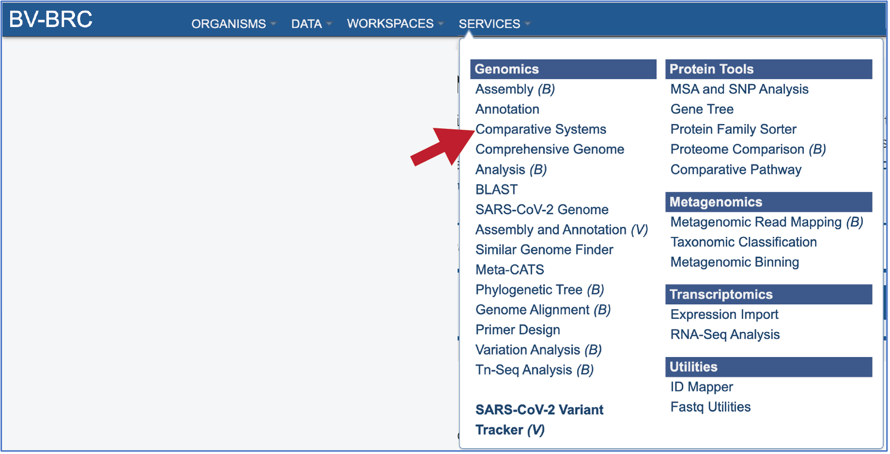

3.	This will open up the Comparative Systems landing page.  The default page shows starting with a read file.
 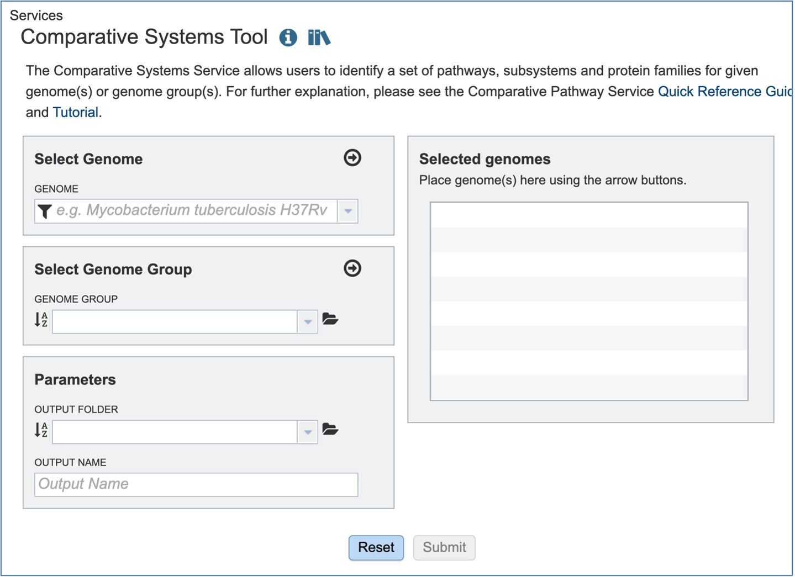

## Selecting Genomes
1.	To include any genome (reference, representative, other public, or private genomes), click on the filter button to narrow the selection and deselect the categories that are not of interest.
 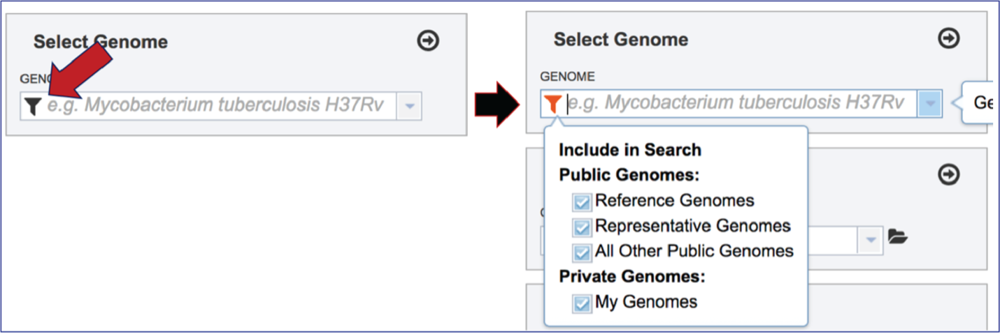

2.	Typing in the text box will show a list of the genomes available that contain that text. Private genomes are indicated by a Lock symbol. Once the genome of interest is located, clicking on it will fill the box.
 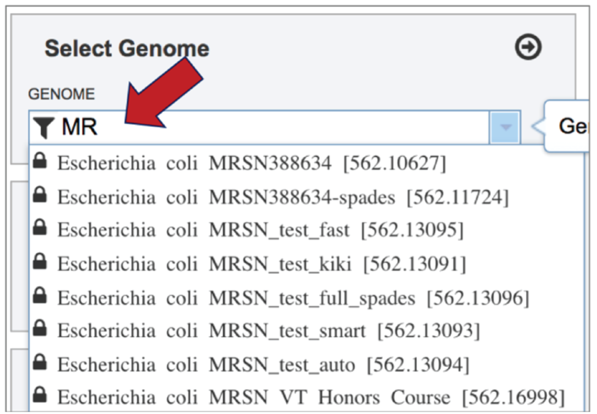
 

3.	The genome must be added to the genomes for comparison, a box in the Selected Genomes box. Click on the arrow at the upper right of the Select Genome box (and the name of the genome will appear in the Selected Genomes box.
 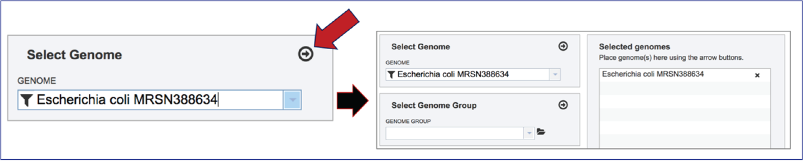
 
## Selecting Genome Groups
1.	To select a genome group, go to the Select Genome Group box and click on the down arrow that follows the text box. That will show a list of all the genome groups, with the most recently created appearing at the top of the list
 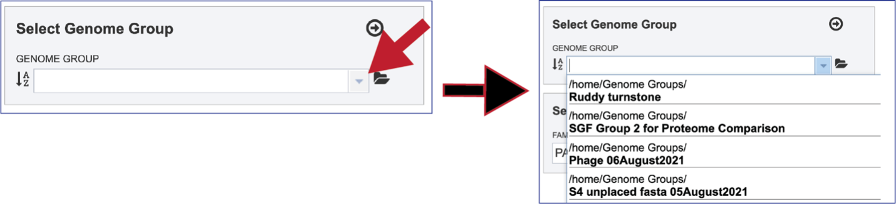
 
2.	Entering a name (or part of a name) in the text box will populate the drop-down box with possible groups that match that text.
 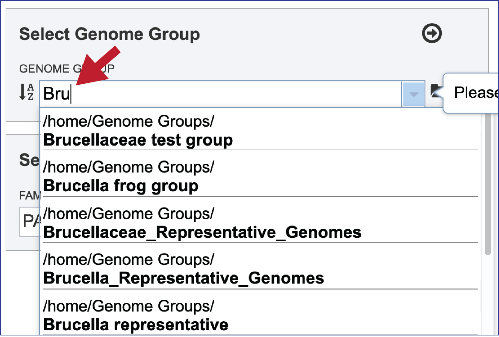

3.	Clicking on the genome group of interest will make the name appear in the text box.
 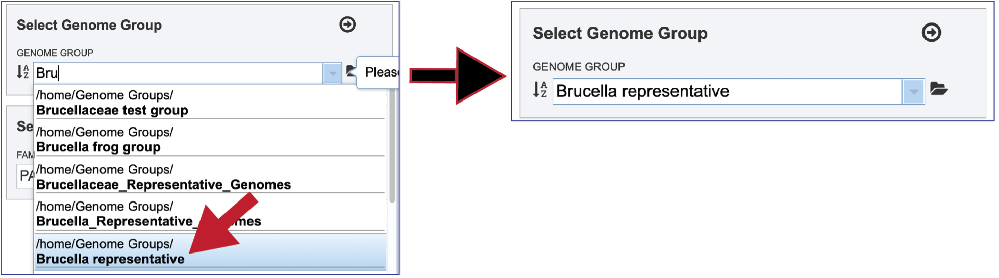

4.	The genome group must be added to the genomes for comparison, a box in the Select Genomes box. Click on the arrow at the upper right of the Select Genome box and the name of the genome will appear in the box. This can be repeated until all the genome groups or genomes of interest, have been added to the Selected Genomes box.
 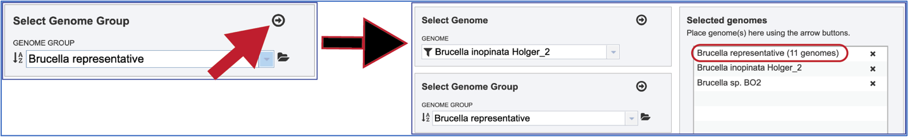

5.	Clicking on the X icon that follows the name of a genome or genome group in the Selected Input Genome Table will remove it from the selection.
 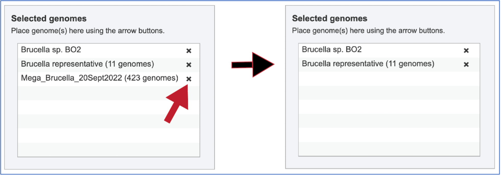

## Selecting parameters
1.	A folder must be selected to hold the Comparative Systems job.  Recently created folders can be viewed by clicking on the drop-down arrow at the end of the text box underneath OUTPUT FOLDER.  Clicking on the folder of interest will select it.
 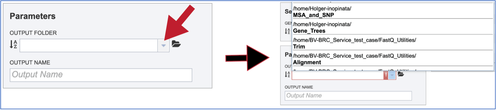

2.	Previously created folders can also be found by beginning to type the name in the text box.  A drop-down box below the box will show all available folders that match the text.
 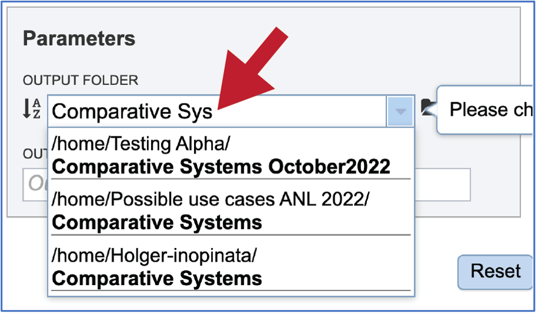

3.	Previously created folders can also be located by clicking on the folder icon that follows the text box.  That will open an interface to the workspace, where the correct folder can be selected by clicking on the row that contains its name, and then on the OK button at the lower right of the window.
 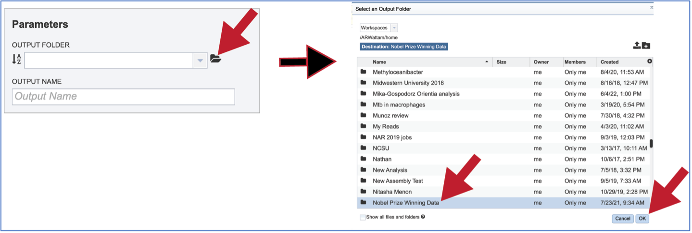

4.	A name must be selected for the Comparative Systems job.  Enter the name in the text box underneath the words OUTPUT NAME.  At this point the Submit button will turn blue.  The job can be submitted by clicking on that button.
 

5.	A message will appear above the submit button, indicating that the submission was successful.
 

## Monitoring progress on the Jobs page
1.	Click on the Jobs box at the bottom right of any BV-BRC page.
 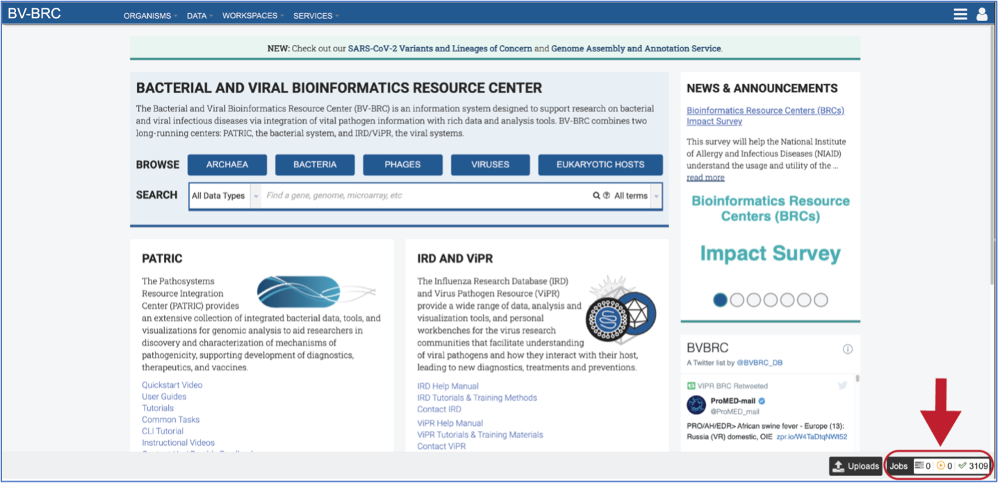

2.	This will open the Jobs Landing page where the status of submitted jobs is displayed.
 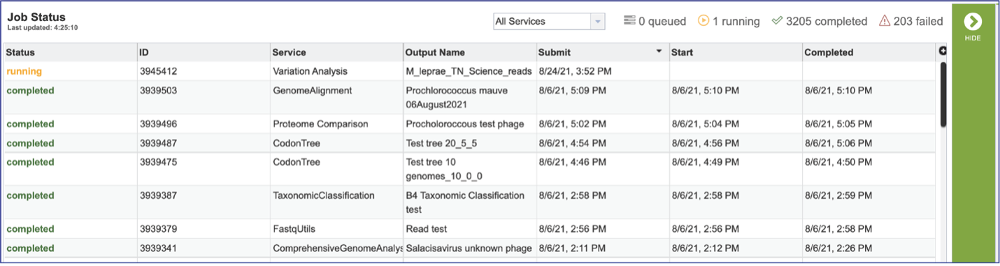

## Viewing the Comparative Systems job results
1.	To view a particular job, click on a row to select it. Once selected, the downstream processes available for the selection appear in the vertical green bar.  Clicking on the View icon will open the comparative systems job summary.
  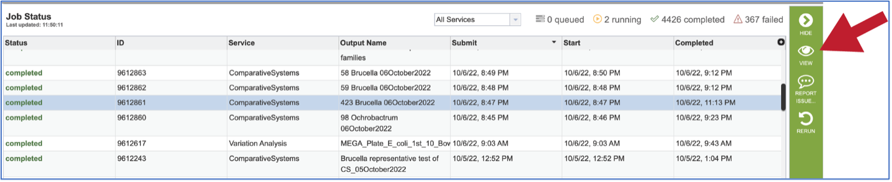

2.	This will rewrite the page to show the information about the comparative systems job, and all of the files that are produced when the pipeline runs.  
  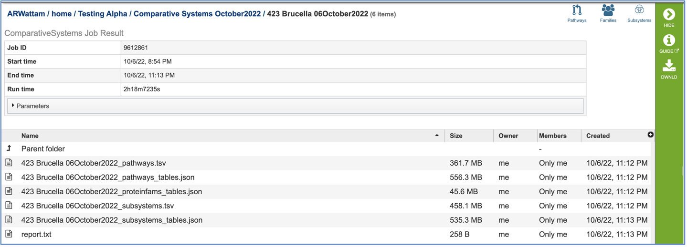

3.	The information about the job submission can be seen in the table at the top of the results page.  To see all the parameters that were selected when the job was submitted, click on the Parameters row.
  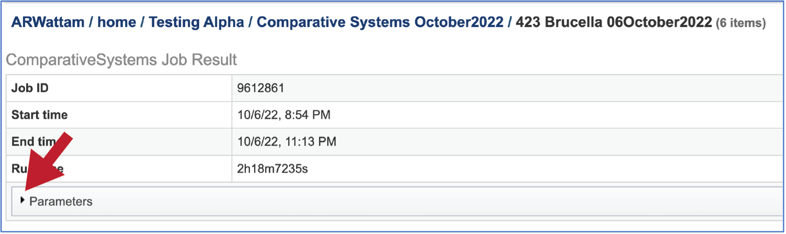

4.	This will show the information on what was selected when the job was originally submitted.
  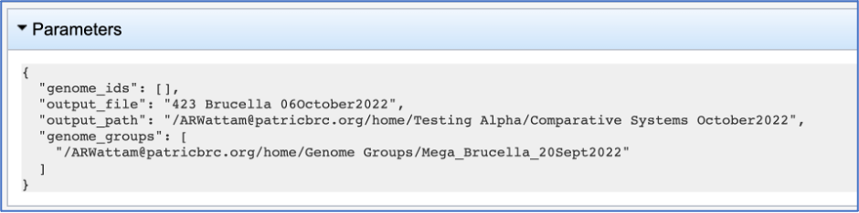

5.	Pathway.tsv: To view, or download, a tab separated value (tsv) file of all the pathways and genes found across all the genomes in the selection, click on the row that has the file and then click on the View, or Download icon in the vertical green bar.
  

6.	If the View icon was selected, a new tab will open showing the pathway table.
  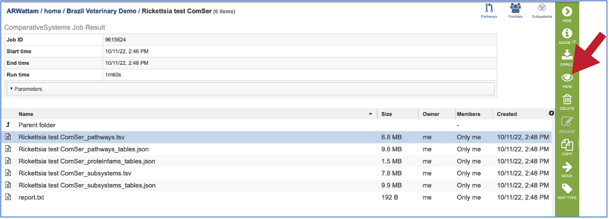

7.	Pathways_tables.json:  A JSON file is a file that stores simple data structures and objects in JavaScript Object Notation (JSON) format, which is a standard data interchange format. It is primarily used for transmitting data between a web application and a server.  The downloadable files from the Comparative Systems job includes a pathways_table json file that can be viewed by clicking on the View icon in the vertical green bar or downloaded.
  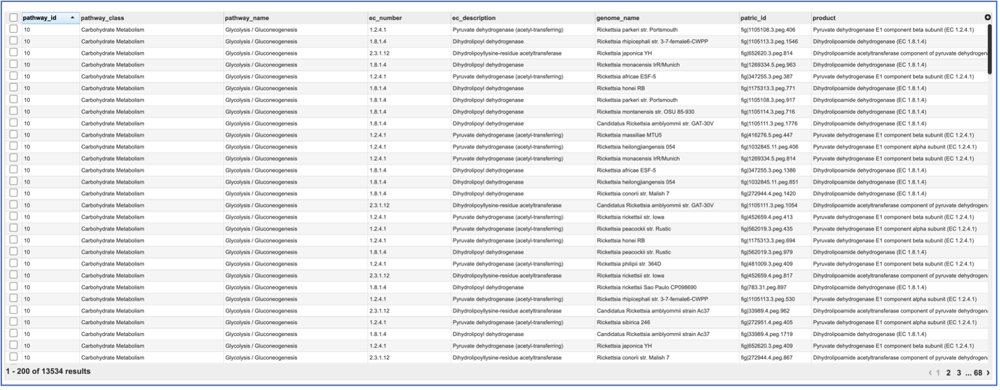

8.	Proteinfams_tables.json: The downloadable files from the Comparative Systems job includes a protein families table json file that can be viewed by clicking on the View icon in the vertical green bar, or downloaded
  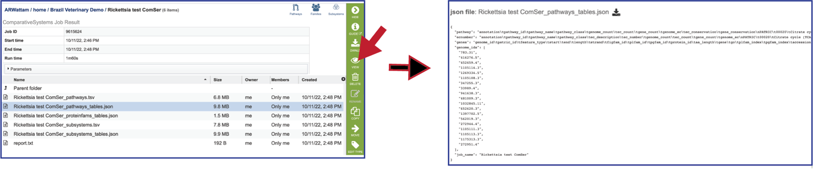

9.	Subsystems_tsv: A tsv file of all the subsystems and genes found across all the genomes in the selection is available for download or viewing.  To view the file, click on the row that has it and then click on the View, or Download icon in the vertical green bar.
  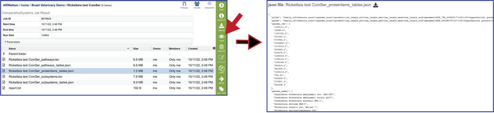

10.	 If the View icon was selected, a new tab will open showing all the subsystem information.
  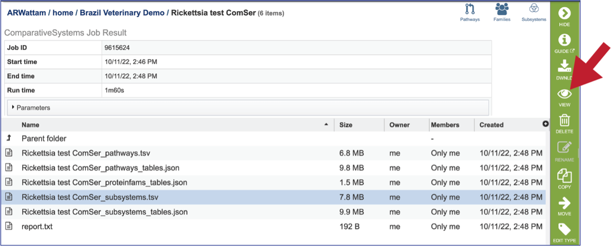

11.	Subsystems_tables-json: The downloadable files from the Comparative Systems job includes a subsystems table json file that can be viewed by clicking on the View icon in the vertical green bar, or downloaded
  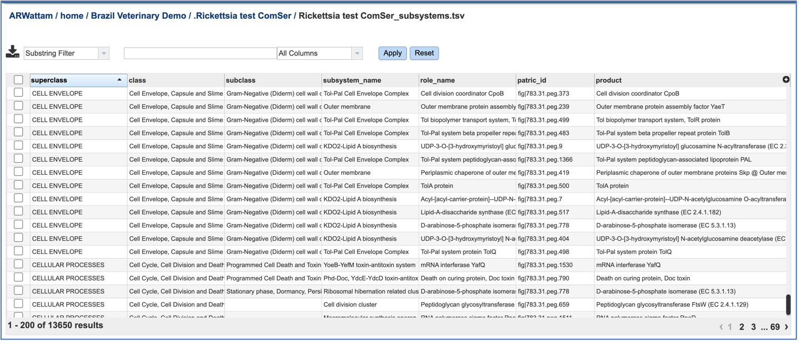

12.	Report_txt: The downloadable files also include a report.txt file that provides the number of pathways, protein families, and subsystems that were identified in the Comparative Systems job.  The file can be viewed or downloaded by clicking on the appropriate icons in the vertical green bar.
  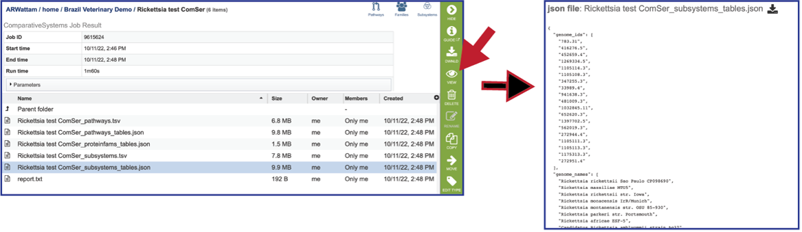

## Viewing Pathways
1.	The Comparative Systems job includes direct access to a page where pathways can be viewed and explored.  To reach that page, click on the Pathways icon at the upper right of the job page.
 

2.	This will open a landing page where all the pathways can be viewed.  The table includes the KEGG pathway ID, pathway class and Pathway name.  It shows the number of the genomes withing the selection that have genes in that pathway (Genome Count), and the proteins with EC numbers that are in that pathway (EC Number Count).  Gene Count shows the number of genes in the genomes that have those EC numbers. The Genome EC Count shows the sum of the EC numbers found across all the genomes that have genes in this pathway.  The EC Conservation (%) number gives the percent of unique EC numbers present in all selected genomes. 100% describes a situation in which all unique EC numbers are present in all selected genomes. Smaller numbers indicate that there is one or more genomes are missing some EC numbers.
 

3.	The EC Number tab is above the table.  
 

4.	Clicking on that tab will show the details of the EC numbers that are found across the selection of genomes for the individual pathway.  Each EC Number has its own row, and the Description column provides the function of the genes in that pathway.
 

5.	Clicking on the row or checkbox of a single row will populate the vertical green bar with possible downstream functions.  To view the details of an individual pathway, click on the Map icon.
 

6.	This will open the Pathway View, which includes an EC table and the corresponding KEGG pathway map.
 

7.	The EC table shows the EC Number, the number of genomes that have the gene with that number (Genome Count), the number of genes that have that EC number (Feature Count), the number of genomes in the selection that are missing that number (Genome Count Not Present), and the number of times that gene is shown in the pathway map (Occurrence).
 

8.	Clicking on an individual row in the EC table will color the corresponding box with that EC number red in the pathway table.  Clicking on the Legend icon in the upper right will open a drop-down box that shows the legend.  EC numbers that are not found within the collection of genomes are found in white boxes.  Lime green boxes indicate that all genomes in the collection have at least one gene with this EC number, and the olive color indicates an EC number that is found only in some, but not all of the genomes in the selection.  
 

9.	Above the EC table and pathway map are two tabs.  The KEGG Map view is the default.  Clicking on the Heatmap tab will show the presence and absence of the EC numbers across the selected genomes, as well as the number of genes that are annotated with that EC number across the selection of genomes.
 

10.	 The heatmap view opens to show the EC numbers and their functional description listed on the y axis, and the name of the genomes in the collection across the x axis.
 

11.	A filter can be found directly above the heatmap. 

12.	Researchers can flip the axis of the heatmap view if desired.
 

13.	Clicking on Save SVG will open a drop-down box.  Researchers can choose to download the visible portion of a large heatmap (Save snapshot) or the entire heatmap (Save entire chart).
 

14.	A text box filter will highlight columns that have text that matches the text entered into the box.  This is indicated by a blue box above the column.

 

15.	Mousing over individual cells in a column will open a pop-up window that shows the genome, the enzyme commission number and description, and the number of genes that the genome has in that family.
 

16.	Areas within the heatmap can be examined.  To so this, use the mouse to draw a box over the area of interest in a heatmap or by clicking on the gene name, which will select the entire row.  
 

17.	This will open a pop-up window that show the number of genomes in the selection, the number of EC numbers in the selection, and the number of genes/proteins (called Members) within the selection.
 

18.	Clicking on Show Proteins will open a new tab showing the Features (aka genes/proteins) that were part of that selection.
 

Protein Families – Tabular View
1.	The Comparative Systems job includes direct access to a page where protein families can be viewed and explored.  To reach that page, click on the Families icon at the upper right of the job page.
 

2.	The page will reload to show the Protein Family Table view.  This contains a dynamic filter on the left, and a table on the right that shows all the families based on the selections of the filter.
 

3.	The Protein Family Sorter loads showing all the protein families across all the genomes. This is the Pan Genome.
 
4.	The Core Genome can be seen by clicking on the box in the column head below Present in all families. This will select all the genomes in the list and will reload the table to show all the protein families that are in that selection.
 

5.	The Accessory Genome for a species can be seen by first clicking on the box in the column head below Absent in all families and then clicking on the text box in the Either/Mixed column in front of each genome of interest. This will select all the genomes in the list and will reload the table to show all the protein families that are in that selection.
 
6.	The Accessory Genome for a single genome can be seen by first clicking on the box in the column head below Absent in all families and then clicking on the text box in the Present column in front of the genome of interest. This will select all the genomes in the list and will reload the table to show all the protein families that are in that selection.
 

7.	The text filter box can be used to find protein families that contain specific names. Enter a name of interest and click the Filter button. This will re-filter the table to show the protein families that contain that text in the functional description.
 
8.	The text box filter can also be used to find protein family IDs, which is an excellent way to see presence and absence across a group of genomes.  Entering the IDs in the table and then clicking on the filter icon will reload the table to show the protein families that meet that criterion.
 
9.	There are additional filtering options below the text box.  This includes protein families meeting particular criteria.  One important filter is Perfect Families.  In BV-BRC, perfect families refer to those protein families where each of the genomes have a single protein that is part of the family.  This is an important default for the Phylogenetic Tree service, which could be used to see if a group of genomes are “tree able.”
 
10.	The “non-perfect” protein families can also be examined, both selecting the Non perfect Families button, or filtering by the Number of Proteins per Family.
 

11.	 The number of Genomes per Family can also be examined.
 

Protein Family Sorter – Heatmap
1.	The presence and/or absence of protein families can also be seen in a heatmap view. To see the heatmap, click on the Heatmap icon above the filter. This will reload the page to show the heatmap.
 
2.	A filter is directly above the heatmap.  
 

3.	A text box filter will highlight columns that have protein families that have text that matches the text entered into the box.  This is indicated by a blue box above the column.
 

4.	Expanding the slider at the top of the heatmap view will allow researchers to expand the view enough to see the protein family name.  Note that the text in the name that matches the filter criterion will be highlighted blue.  In addition, a blue line remains directly above the column.
 

5.	Researchers can flip the axis of the heatmap view if desired.
 

6.	The protein families can also be clustered.  This will rearrange the order of both the genomes and the protein families, depending on the clustering algorithm selected.
 

7.	Clicking on Advanced will show the different clustering options.
 

8.	BV-BRC allows researcher to cluster by either Protein Families, Genomes, or Both.  The default is set at Both.
 

9.	To see the Clustering algorithm choices, click on the down arrow that follows Pearson correlation, which is the default setting.
 

10.	BV-BRC offers four types of clustering.  To see the options, click on the down arrow underneath Clustering type that follows Pairwise average-linkage, which is the default setting.
 

11.	 Choosing different clustering options will change the heatmap.
 

12.	 The protein family sorter allows users to see the protein families in the order that they appear in any given genome. This process is called anchoring a genome. To re-order the protein families, click on the Anchor icon. This will open a pop-up window where you can select a genome.  If you click on the down arrow that follows the words, Select a genome.
 

13.	 This will open a drop-down box of all the genomes available in the group.  The heatmap will rearrange in the order of the selected genome, starting with the first gene annotate in that genome to the last.  Researchers will be able to see regions of the reference genome that are absent in some of the comparison genomes.
 

14.	Mousing over individual cells in a column will open a pop-up window that shows the genome, the protein family name and ID, and the number of genes that the genome has in that family.
 

15.	 Areas within the heatmap can be examined.  To so this, use the mouse to draw a box over the area of interest in a heatmap, which is indicated by the blue box in the figure below.  This will open a pop-up window that show the number of genomes in the selection, the number of families within it, and the number of genes/proteins (called Members) within the selection.
 

16.	 Clicking on Show Proteins will open a new tab showing the Features (aka genes/proteins) that were part of that selection.
 

12.	Clicking on Save will open a drop-down box.  Researchers can choose to download the visible portion of a large heatmap (Save snapshot) or the entire heatmap (Save entire chart).  The heatmap can also be saved to a tab separated value (Save chart to TSV) for json file (Save chart to JSON).
 

Viewing Subsystems
1.	The Comparative Systems job includes direct access to a page where subsystems can be viewed and explored.  To reach that page, click on the Subsystems icon at the upper right of the job page.
 

2.	This will open a new tab that shows the Subsystem Super Class distribution pie chart.
 

3.	Researchers can drill into the table on the right and see the Classes and Subclasses in each Super Class by clicking on the carrot in front of the name.  The number of subsystems are colored green, and the number of genes within those subsystems are colored yellow.
 

4.	To see a tabular view, click on the Subsystems tab at the top left of the page.
 

5.	This will open a new tab that shows all the Subsystems available across the selection of genomes.
 

6.	Clicking on the row or checkbox of a single row will populate the vertical green bar with possible downstream functions.  To view the details of an individual subsystem, click on the checkbox in the first column and then click on the Map icon.
 

7.	This will open a heatmap view of the selected subsystem, with the genomes listed on the x-axis and the proteins along the y-axis.  
 

8.	A filter is directly above the heatmap.  
 

9.	A text box filter will highlight columns that have protein families that have text that matches the text entered into the box.  This is indicated by a blue box above the column, and by blue text that matches what was entered in the textbox in the names of the genomes.
 

10.	Expanding the slider at the top of the heatmap view will allow researchers to expand the view enough to see the genome name.  Note that the text in the name that matches the filter criterion will be highlighted blue.  In addition, a blue line remains directly above the column.
 

11.	Researchers can flip the axis of the heatmap view if desired.
 

12.	The default subsystem view includes a number of reference genome to provide a sense of the genes used by other organisms to perform this function.  These genomes are to the right of the genomes that were initially selected for the Comparative Systems job.  The reference genomes will be eliminated from the view by clicking on the Reference Genomes icon.
 

13.	Clicking on the Cluster icon will cluster the genomes together.
 

14.	Mousing over individual cells in a column will open a pop-up window that shows the gene, the genome, and the number of genes that the genome with that annotation.
 

15.	A pop-up window summarizing the data selected will appear after clicking on a row or column head.  Researchers can download or show the proteins or add them to a group.
 

Generating a Multiple Sequence Alignment (MSA)
1.	 A MSA can be generated from any feature table, or from the features selected from a heatmap. Clicking on the check box at the top of the first column will select all the features in the table.  This will populate the vertical green bar with possible downstream functions.  Click on the MSA icon.
 

2.	This will open a drop-down box where the nucleotide or amino acid sequence alignment can be selected.  The resulting tab will show an alignment and the corresponding gene tree.
 

3.	Once the alignment has been generated, clicking on the Colors icon in the green bar will show a number of different choices that can be selected.  Each will change the color of the amino acids in the alignment to the left.
 

4.	The tips at the end of the branches in the gene tree can be changed by clicking on the ID Type icon.  If the data exists for the particular genome that contains the gene in the alignment, that will now populate the gene tree.
 

5.	Researchers can also click on the nodes within the tree.  The possible downstream functions will populate the green bar to the right, where you can create a group, generate a new alignment from the selection, and see the genes or the genomes.
 
## References

- 1	Overbeek, R. et al. The subsystems approach to genome annotation and its use in the project to annotate 1000 genomes. Nucleic acids research 33, 5691-5702 (2005).
- 2	Overbeek, R. et al. The SEED and the Rapid Annotation of microbial genomes using Subsystems Technology (RAST).  42, D206-D214 (2013).
- 3	Davis, J. J. et al. PATtyFams: Protein families for the microbial genomes in the PATRIC database.  7, 118 (2016).
- 4	Brettin, T. et al. RASTtk: a modular and extensible implementation of the RAST algorithm for building custom annotation pipelines and annotating batches of genomes. Scientific reports 5, 8365 (2015).
- 5	Kanehisa, M., Furumichi, M., Sato, Y., Kawashima, M. & Ishiguro-Watanabe, M. KEGG for taxonomy-based analysis of pathways and genomes. Nucleic Acids Research (2022).

