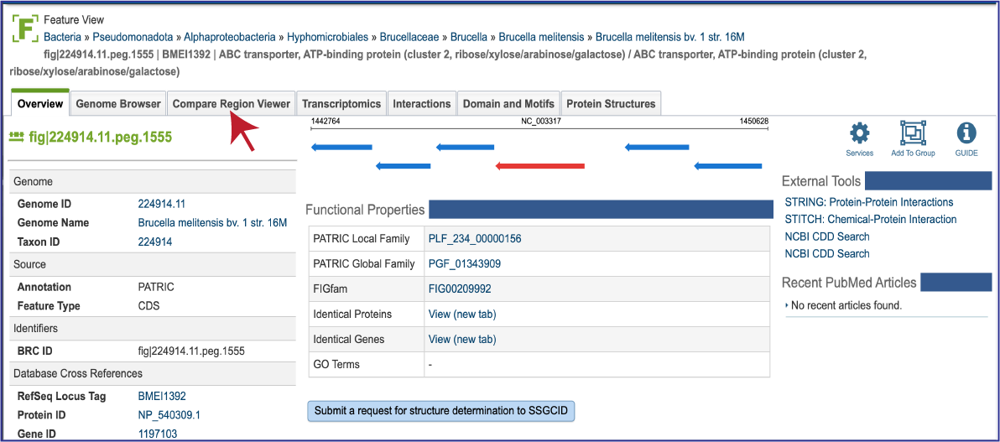
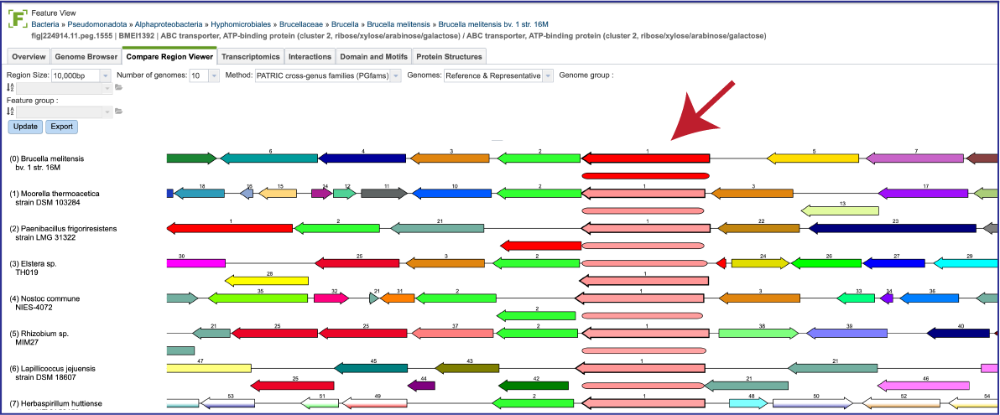
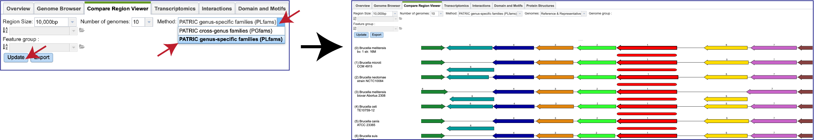

# Compare Region Viewer

The Compare Region Viewer was designed to show the genomic neighborhood of a protein-coding gene across a phylogenetic distance. Along with the ability to view the genes in a particular region and filter on reference, representative or all public genomes in the resource, this viewer also enables selecting the number of regions, size, and type of protein family[1, 2].

## Finding, viewing and manipulating the Compare Region Viewer
1.	From any protein encoding gene landing page, click on the **Compare Region Viewer** tab.

2.	This will open the tab that shows the neighborhood surrounding the gene of interest, which is a red arrow.  The default view shows the cross-genus protein families (PGFams[3]) in a region of 10,000 bp across 10 of the [RefSeq Reference and Representative genomes](https://www.ncbi.nlm.nih.gov/refseq/about/prokaryotes/).  The 10 genomes shown are selected based on the strength of the BLAST[4] hit for the selected gene, which is depicted in red. 

3.	If one is interested in looking at genomes within the same genus, the genus-specific protein families (PLFams) should be selected. Click on the down arrow at the end of the text box under Method.  This will open a drop-down box where the PLFams can be selected.  Click on that row, and then on the blue **Update** button at the lower left.  This will rewrite the tab to show genomes within the same genus, with the genome having the strongest BLAST hit to the reference gene at the top. 

