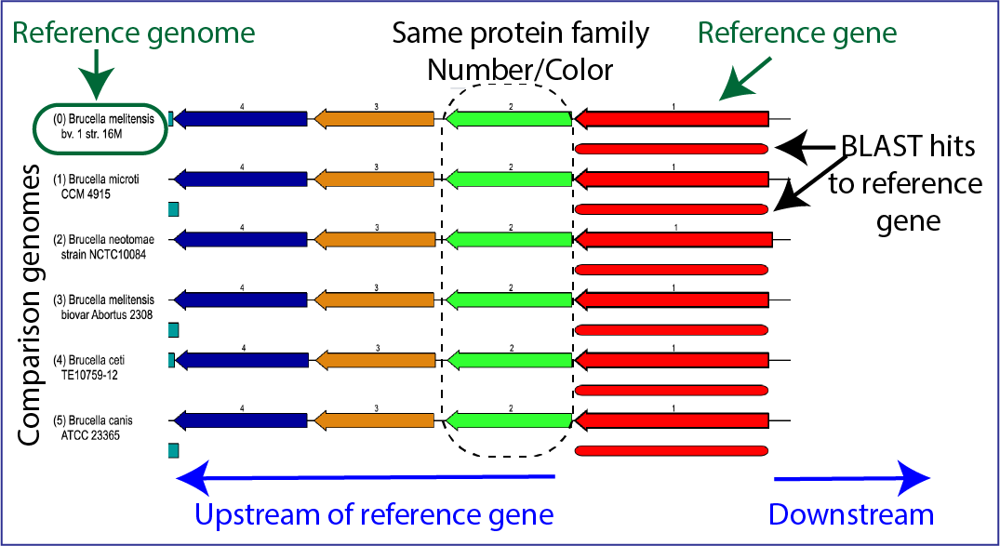
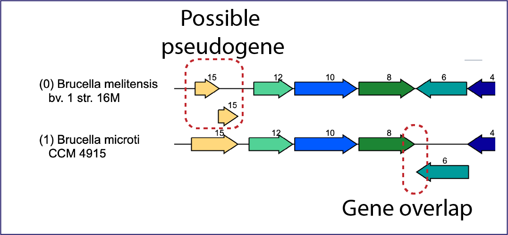
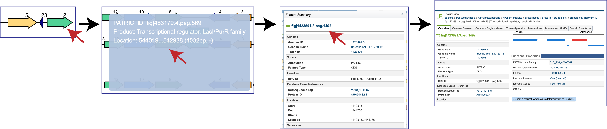
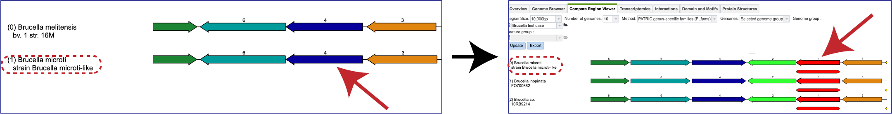
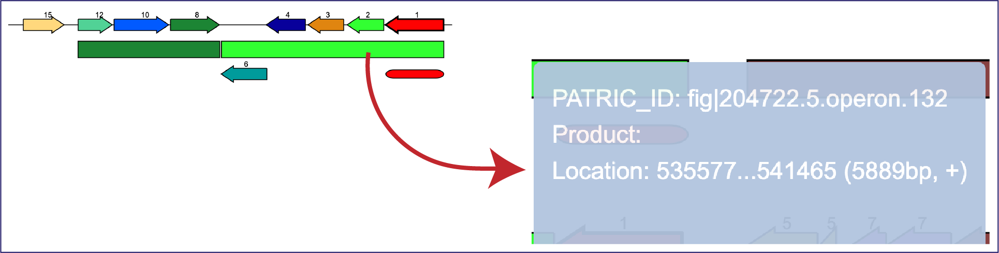
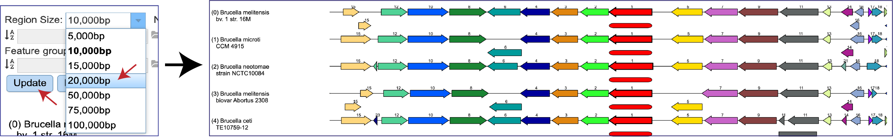
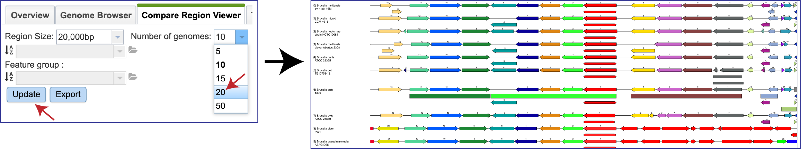
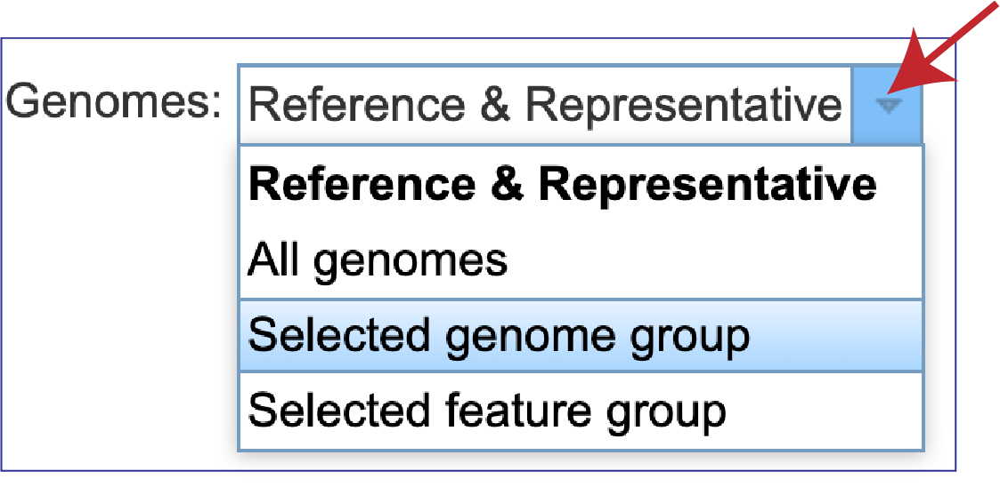

# Compare Region Viewer

The Compare Region Viewer was designed to show the genomic neighborhood of a protein-coding gene across a phylogenetic distance. Along with the ability to view the genes in a particular region and filter on reference, representative or all public genomes in the resource, this viewer also enables selecting the number of regions, size, and type of protein family[1, 2].

## Finding, viewing and manipulating the Compare Region Viewer
1.	From any protein encoding gene landing page, click on the **Compare Region Viewer** tab.

2.	This will open the tab that shows the neighborhood surrounding the gene of interest, which is a red arrow.  The default view shows the cross-genus protein families (PGFams[3]) in a region of 10,000 bp across 10 of the [RefSeq Reference and Representative genomes](https://www.ncbi.nlm.nih.gov/refseq/about/prokaryotes/).  The 10 genomes shown are selected based on the strength of the BLAST[4] hit for the selected gene, which is depicted in red. 

3.	If one is interested in looking at genomes within the same genus, the genus-specific protein families (PLFams) should be selected. Click on the down arrow at the end of the text box under Method.  This will open a drop-down box where the PLFams can be selected.  Click on that row, and then on the blue **Update** button at the lower left.  This will rewrite the tab to show genomes within the same genus, with the genome having the strongest BLAST hit to the reference gene at the top. 

4.	There is a distinct anatomy to the viewer.  The reference genome is the first row, and all subsequent rows are comparison genomes.  Every view has genes upstream and downstream of the reference gene, which is colored red.  The box directly underneath it is a visual representation of the strength and length of the BLAST hits, with dark red showing a stronger hit, and lesser shades of red indicating a weaker red color.  The genomes are place depending on the strength of the BLAST hit to the reference gene, with the strongest hit being in the genome directly underneath the reference.  If the BLAST hit is only to a part of the gene, the length of the BLAST hit will not extend the length of the gene.  Genes in the same protein family are indicated by a similar color, and they have a number over the arrow as a second way to indicate the same family.

5.	The viewer can also indicate possible pseudogenes.  Any gene above or below the other genes is an indication of an overlapping gene.

6.	Mousing over a gene will open a pop-up window that shows the unique identifier, the name/function of the gene, and its location in the genome.  Clicking on that pop-up window will open more details on another pop-up window about the gene, including other identifiers in different databases.  The unique gene ID at the top of this window is a hyperlink that, if clicked on, will rewrite the page to open the landing page for that gene.

7.	Double-clicking on a gene will redraw the display with the clicked-on gene being the new focus.

8.	Moreover, mousing over features that are not genes will also open a pop-up window with information on that feature.

9.	The **Region Size** depicted in the viewer can be adjusted by clicking on the down arrow at the end of the text box.  This will open a drop-down box where a different size will appear.  The **Update** button must be clicked before the view changes to show the different size.

10.	The **Number of genomes** displayed can also be changed by clicking on the down arrow at the end of the text box, and then clicking on 5, 10, 15, 20 or 50.  The **Update** button must be clicked before the view changes to show the selected number of genomes.

11. The view can also be changed to show the genomes visualized.  Clicking on the down arrow at the end of the text box after the word Genomes will open a drop-down box that contains the ability to look across all public genomes (**All genomes**), a **Selected genome group**, or a **Selected feature group**.

