# Comprehensive Genome Analysis (CGA) Service

*Revised: 1/26/2022*

One of the most common use cases for analysis of private genomes at BV-BRC is for researchers to assemble and then annotate their genome sequences using two separate services. The streamlined Comprehensive Genome Analysis ‘meta-service’ addresses this need by accepting sequencing reads, computing the assembly and annotation, and providing a user-friendly description of the genome. The output includes a genome quality assessment, AMR genes and phenotype predictions, specialty genes, subsystem overview, identification of the closest genome sequences, a phylogenetic tree and a list of features that distinguish the genome from its nearest neighbors. The Comprehensive Genome Analysis Service has quickly risen to be one of the most popular services[1].

Creating a folder to hold the assembly job and related data
Please refer to the [Genome Assembly Service Tutorial](/tutorial/genome_assembly/assembly) for instructions on creating a folder in the BV-BRC or PATRIC .

## Locating the Comprehensive Genome Analysis Service

1.	Click on the Services tab at the top of the page, and then click on Comprehensive Genome Analysis (CGA).
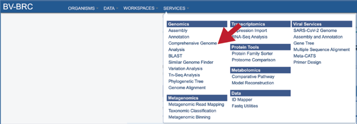

2.	This will open the landing page for the service. 
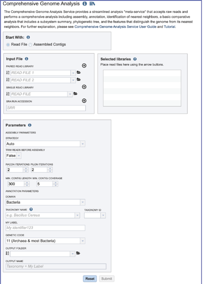

### Uploading paired end reads

Please refer to the [Genome Assembly Service Tutorial](/tutorial/genome_assembly/assembly) for instructions on uploading paired-end reads.

### Uploading single reads

Please refer to the [Genome Assembly Service Tutorial](/tutorial/genome_assembly/assembly) for instructions on uploading single-end reads.

### Submitting reads that are present at the Sequence Read Archive (SRA)

Please refer to the [Genome Assembly Service Tutorial](/tutorial/genome_assembly/assembly) for instructions on submitting reads from the SRA.

## Selecting a contig file interface for CGA

1.	To submit contigs for an annotation job, click on the check box in front of Assembled Contigs at the top of the service. 

2.	This will rewrite the page to select contigs instead of read files. 
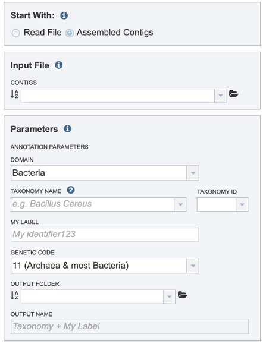

## Selecting a contig file interface for CGA

Please refer to the [Genome Annotation Service Tutorial](/tutorial/genome_annotation/genome_annotation) for instructions on selecting contigs for annotation.

## Setting Parameters for the Annotation part of the CGA

Please refer to the [Genome Annotation Service Tutorial](/tutorial/genome_annotation/genome_annotation) for instructions on selecting annotation parameters.

## Submitting the CGA job

1.	Once the input data and the parameters have been selected, the Submit button at the bottom of the page will turn blue.  The annotation job will be submitted once this button is clicked. Once submitted, the job will enter the queue.  You can check the status of your job by clicking on the Jobs monitor at the lower right. 
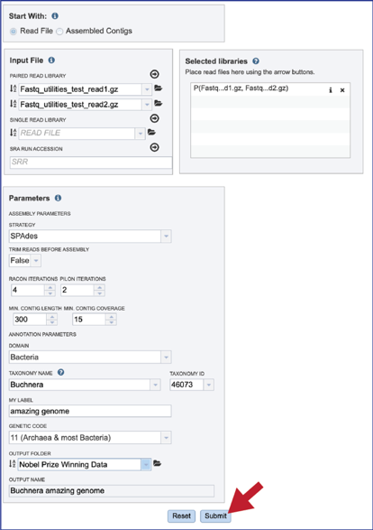

## Finding the CGA job

Please refer to the [Genome Annotation Service Tutorial](/tutorial/genome_annotation/genome_annotation) for instructions on finding completed jobs.

## CGA job results-Full Genome Report

1.	BV-BRC and PATRIC now provide a genome announcement style document for any genome annotated using the Comprehensive Genome Analysis service.  To see this document, select the row that contains the FullGenomeReport.html and click on the view or download icon in the vertical green bar.
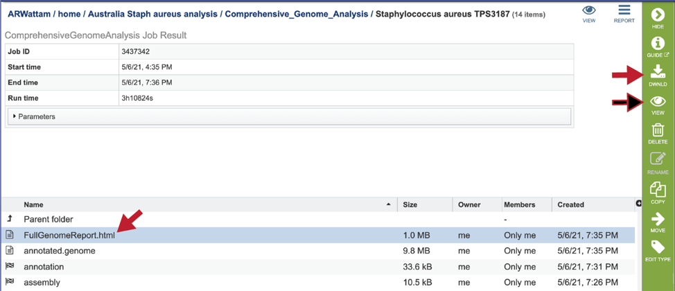

2.	The full genome report provides a detailed summary of the genome.  It begins with a summary of the genome quality, and then provides information for each step of the service, which includes assembly, annotation, and analysis of specialty genes and functional categories, and a phylogenetic tree of the new genome and its closest high-quality relatives. 
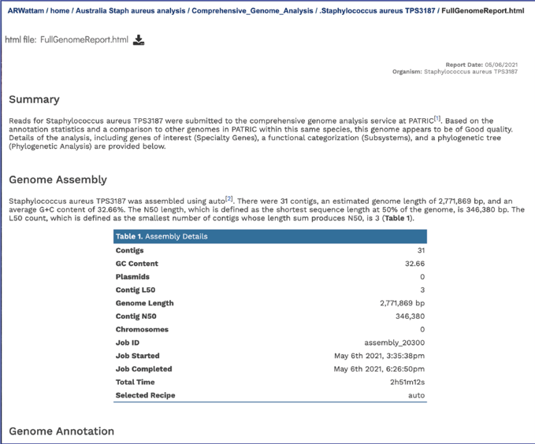

3.	The summary will indicate is the genome is of good or poor quality. 
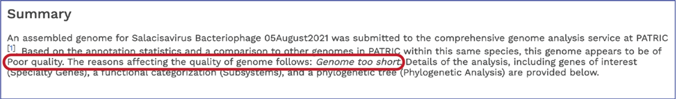

4.	Scrolling down to Genome Assembly will summarize the method selected for assembly and provide the statistics of interest.  These statistics are those commonly provided when a genome is submitted as part of a publication.
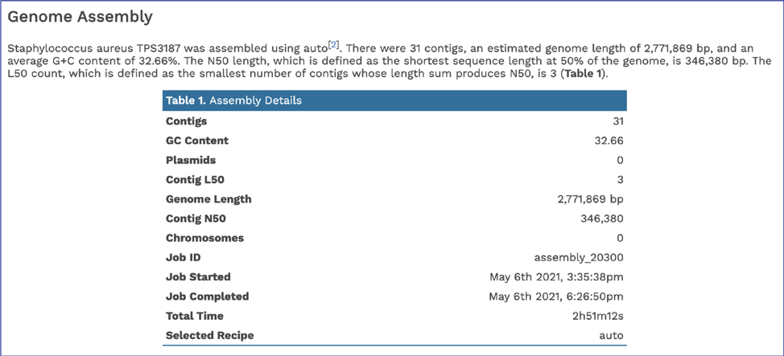

5.	The Genome Annotation section describes the taxonomy of the genome, and genes and their functional divisions. 
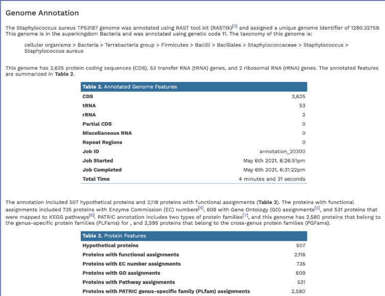

6.	The Genome Annotation section also includes a circular diagram of the genes, their orientation, homology to AMR genes and virulence factors, and GC content and skew.  Genes on the forward and reverse strands are colored based on the subsystem[2] that they belong to. A separate, downloadable svg or png of the circular graph image is available in the jobs list. 
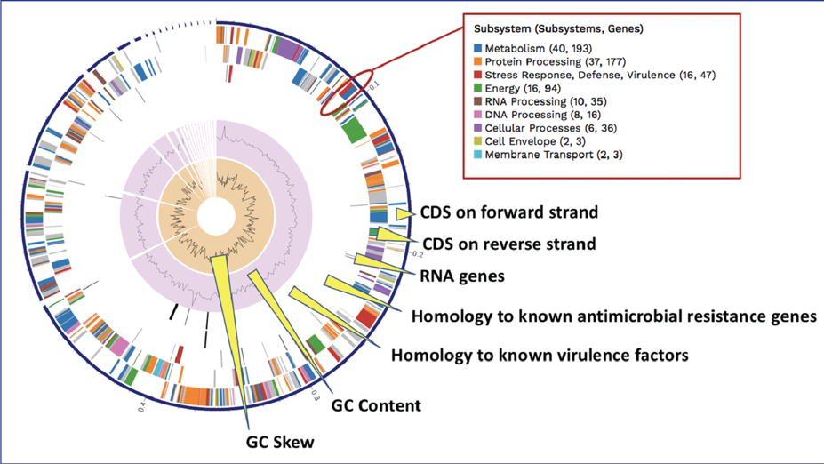

7.	BV-BRC BLATs[3] all genes in a new genome against specialty gene databases, including genes known to provide antibiotic resistance[4-6], virulence factors[7-9], transporters[10, 11], and known drug targets[12].  The CGA service shows the hits in the new genome that has homology to genes in those databases in a tabular form. 
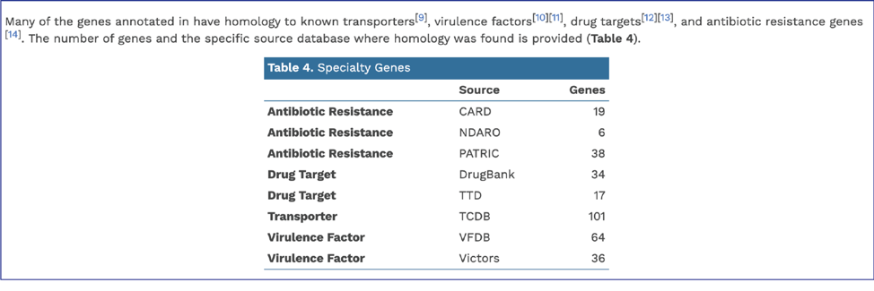

8.	BV-BRC provides AMR phenotype predictions using custom built AdaBoost (adaptive boosting) machine learning classifiers[13]. 
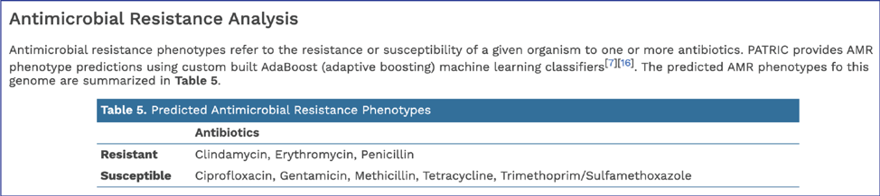

9.	In addition, BV-BRC provides a k-mer based detection method for antimicrobial resistance genes[6] and shows the number of genes that share these k-mers. 
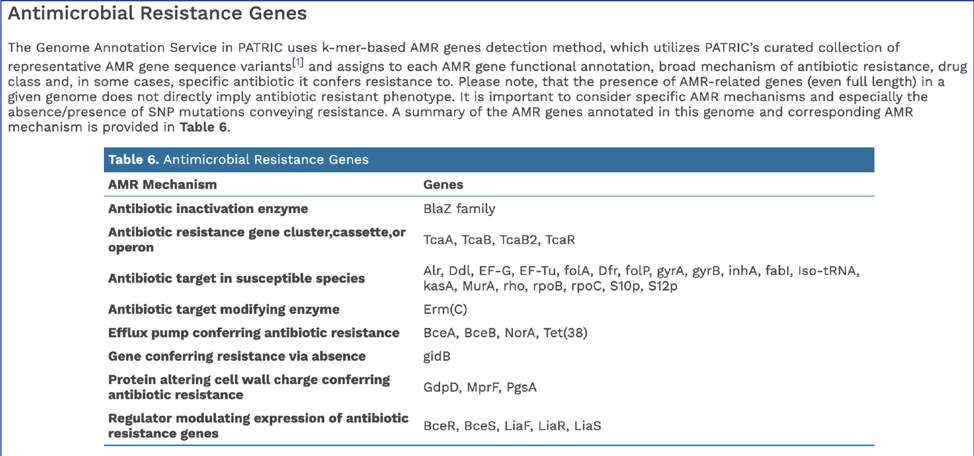

10.	BV-BRC’s subsystem analysis identifies genes based on specific biological processes that they are hypothesized to be active in.  The full genome report includes a pie chart showing the subsystems super classes[2], and an indication of the number of subsystems within that superclass (first number) and the number of annotated genes that are part of the superclass (second number).
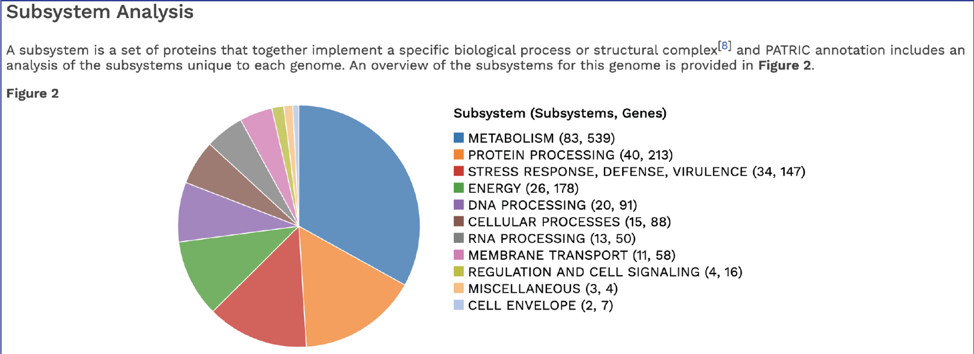

11.	The CGA service identifies the closest relatives to the selected genome. It picks the closest reference and representative genomes using Mash/MinHash[14], and then takes five of BV-BRC’s global protein families[15] that are shared across all the selected genomes to build a tree based on the amino acid and nucleotide alignments of those proteins, which are aligned using MUSCLE[16], and RaxML[17] is used to build the tree. The genome submitted to the CGA is in red. 
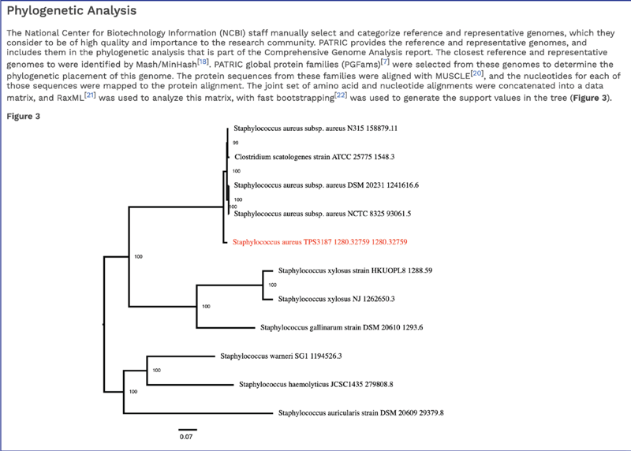

## Viewing the genome 

Private genomes that have been annotated in BV-BRC or PATRIC can be viewed directly from the annotation job, or through the workspace, or by using the Global Search function. Please refer to the [Genome Annotation Service Tutorial](/tutorial/genome_annotation/genome_annotation) for instructions on viewing the genome using the View, CDS or Browser icons.

## CGA job results-download files

1.	Any job run in the BV-BRC contains a number of files, as well as information about the submitted job.  To view the input parameters that were selected when the job was submitted, click on the arrow that precedes the word “**Parameters**.” 
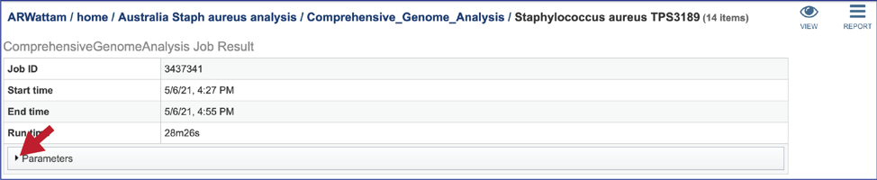

2.	This will open a drop-down box that shows the parameters.  This box can be closed by clicking on the same arrow. 
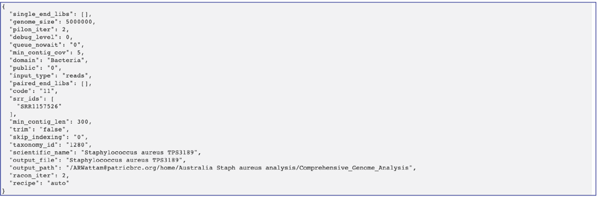

3.	The **genome** contains a special “Genome Typed Object (GTO)” JSON-format file that encapsulates all the data from the annotated genome.
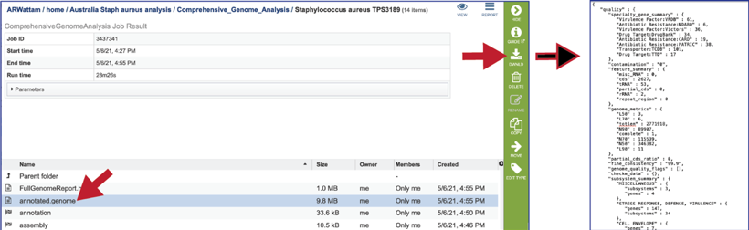

4.	BV-BRC provides a circular visualization of the genome that uses Circos[18], which can also be found in the Full Genome Report.  The download files include a portable graphics format (**circos.png**) and a scaled vector format (**circos.svg**).
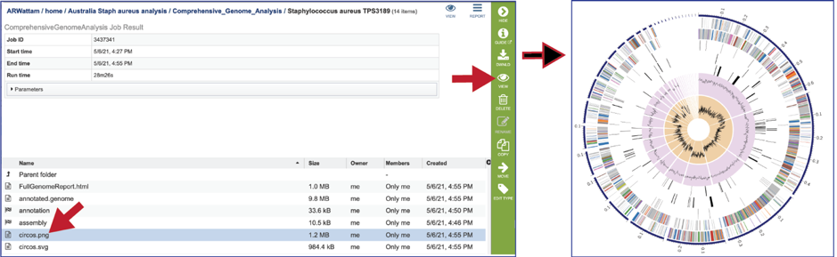

5.	The Full Genome Report contains a phylogenetic tree based on five shared protein families.  This is also available as a separate download in svg format (**codonTree.svg**).  The genome annotated is highlighted in red.
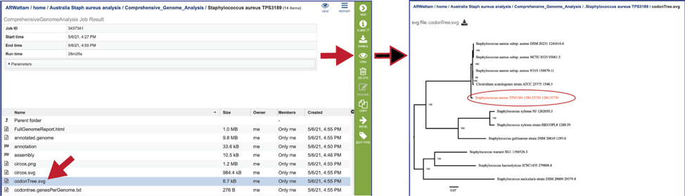

6.	A table of the genes and proteins used to generate the phylogenetic tree (**codontree.genesPerGenome.txt**) is also provided.  This table contains the genome ID, the number of genes annotated in that genome, the number of single copy genes in the genome, and the number of single copy genes used in to generate the phylogenetic tree. 
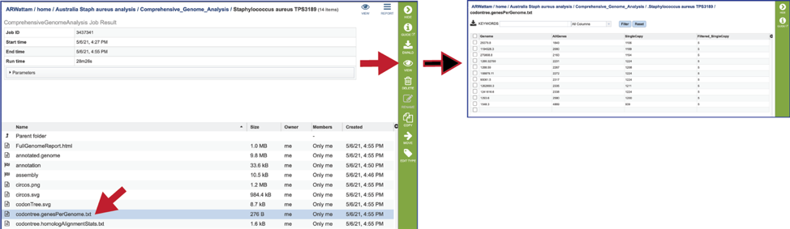

7.	The statistics for each of the genes/proteins considered for the phylogenetic tree are also provided (**codontree.homologAlignmentStats.txt**).  This file lists the PGFam IDs that were used, the number of gap characters in the alignment (-, the higher the number, the worse the alignment), the mean-squared frequency (the mean of the sum of the squared frequency of all the different letters in that column, and the higher the number, the better the alignment) the number of aligned positions (or the number of columns in the alignment), the number of sequences used, the gaps as a proportion of the total cells in the aligned matrix, the sum-squared frequency (the sum of that squared frequency across all positions.  This statistic is used to rank the gene families to select those to be used), and the families used in the analysis (this is determined by the sum-squared frequency, as it takes the top from that list). 
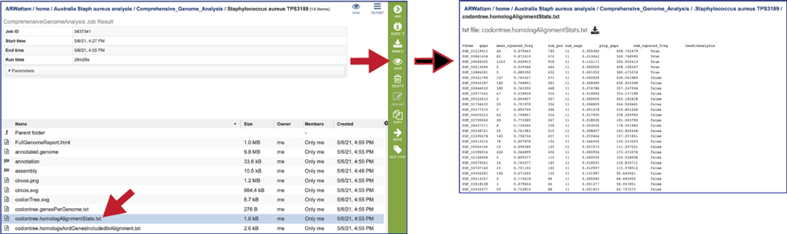

8.	The genes used from each of the protein families that the alignment was built on is also provided (**codontree.homologsAndGenesIncludedInAlignment.txt**).  
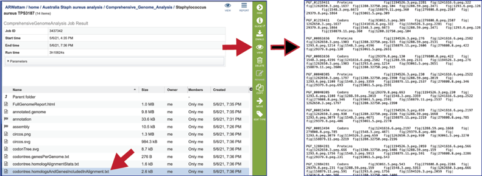

9.	The **codontree.nex** is the nexus-formatted file that is submitted to the FigTree program to generate the graphics in svg and pdf formats.  
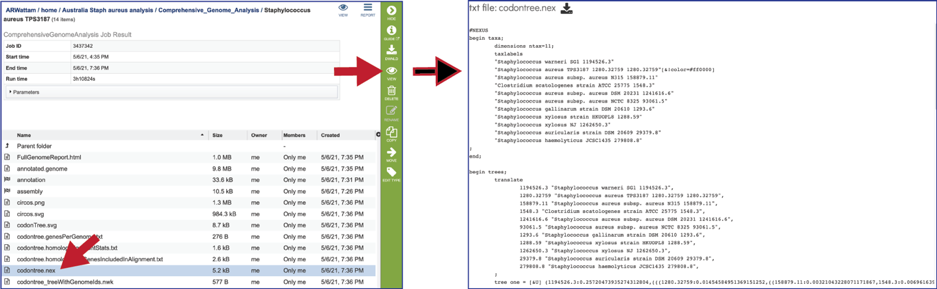

10.	The **codontree_treeWithGenomeIds.nwk** is the tree specified in the newick format and can be used in program like FigTree.   
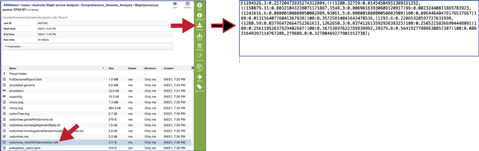

11.	The CGA service also produces a json file (A JSON file is a file that stores simple data structures and objects in JavaScript Object Notation (JSON) format, which is a standard data interchange format. It is primarily used for transmitting data between a web application and a server).  The subsystem_colors.json shows the codes for the colors used to generate the subsystem graph and the circular graph in the Full Genome Report. 
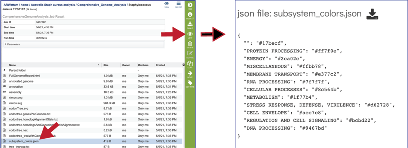

12.	The tree_ingroup.txt file shows the genome IDs of all the genomes shown in the tree provided in the Full Genome Report. 
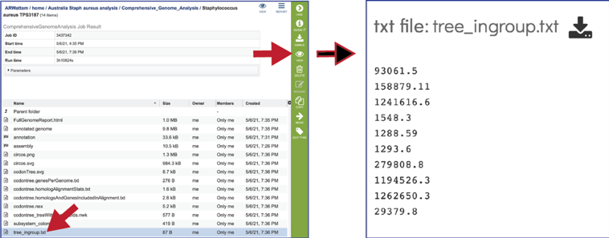

## CGA job results-Assembly job

The CGA service provides downloadable files and statistics for the assembly portion of the job.  

1.	To view those files, double click on the row that has a checkered flag followed by the word assembly.
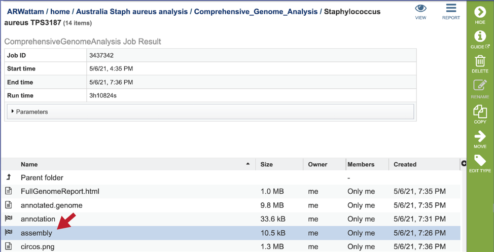

2.	Additional details on the assembly results are available under “Viewing the Assembly job results” in the [Genome Assembly Service Tutorial](/tutorial/genome_assembly/assembly).

## CGA job results-Annotation job

The CGA service provides downloadable files and statistics for the assembly portion of the job.  

1.	To view those files, double click on the row that has a checkered flag followed by the word **annotation**.
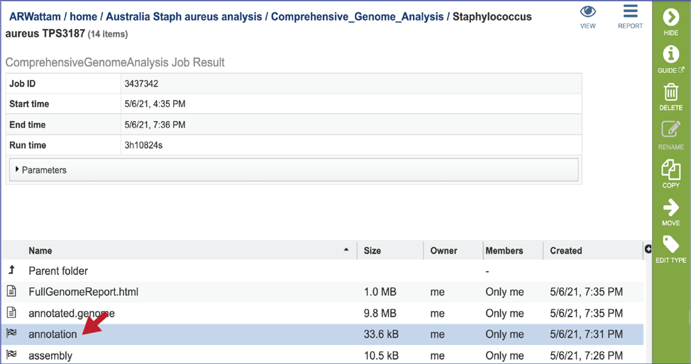

2.	Additional details on the annotation results are available under “Annotation job results” in the [Genome Annotation Service Tutorial](/tutorial/genome_annotation/genome_annotation).

## References

1.	Davis, J.J., et al., The PATRIC Bioinformatics Resource Center: expanding data and analysis capabilities. Nucleic acids research, 2020. 48(D1): p. D606-D612.
2.	Overbeek, R., et al., The SEED and the Rapid Annotation of microbial genomes using Subsystems Technology (RAST). Nucleic Acids Res, 2014. 42(Database issue): p. D206-14.
3.	Kent, W.J., BLAT—the BLAST-like alignment tool. Genome research, 2002. 12(4): p. 656-664.
4.	Alcock, B.P., et al., CARD 2020: antibiotic resistome surveillance with the comprehensive antibiotic resistance database. Nucleic acids research, 2020. 48(D1): p. D517-D525.
5.	Liu, B. and M. Pop, ARDB—antibiotic resistance genes database. Nucleic acids research, 2009. 37(suppl_1): p. D443-D447.
6.	Davis, J.J., et al., Antimicrobial resistance prediction in PATRIC and RAST. Scientific reports, 2016. 6: p. 27930.
7.	Liu, B., et al., VFDB 2019: a comparative pathogenomic platform with an interactive web interface. Nucleic acids research, 2019. 47(D1): p. D687-D692.
8.	Xiang, Z., et al., VIOLIN: vaccine investigation and online information network. Nucleic acids research, 2007. 36(suppl_1): p. D923-D928.
9.	Mao, C., et al., Curation, integration and visualization of bacterial virulence factors in PATRIC. Bioinformatics, 2015. 31(2): p. 252-258.
10.	Saier Jr, M.H., et al., The transporter classification database (TCDB): recent advances. Nucleic acids research, 2016. 44(D1): p. D372-D379.
11.	Chen, X., Z.L. Ji, and Y.Z. Chen, TTD: therapeutic target database. Nucleic acids research, 2002. 30(1): p. 412-415.
12.	Wishart, D.S., et al., DrugBank 5.0: a major update to the DrugBank database for 2018. Nucleic acids research, 2018. 46(D1): p. D1074-D1082.
13.	Long, S.W., et al., Population genomic analysis of 1,777 extended-spectrum beta-lactamase-producing Klebsiella pneumoniae isolates, Houston, Texas: unexpected abundance of clonal group 307. MBio, 2017. 8(3): p. e00489-17.
14.	Ondov, B.D., et al., Mash: fast genome and metagenome distance estimation using MinHash. Genome biology, 2016. 17(1): p. 132.
15.	Davis, J.J., et al., PATtyFams: Protein Families for the Microbial Genomes in the PATRIC Database. Front Microbiol, 2016. 7: p. 118.
16.	Edgar, R.C., MUSCLE: multiple sequence alignment with high accuracy and high throughput. Nucleic acids research, 2004. 32(5): p. 1792-1797.
17.	Stamatakis, A., RAxML version 8: a tool for phylogenetic analysis and post-analysis of large phylogenies. Bioinformatics, 2014. 30(9): p. 1312-1313.
18.	Krzywinski, M., et al., Circos: an information aesthetic for comparative genomics. Genome research, 2009. 19(9): p. 1639-1645.

