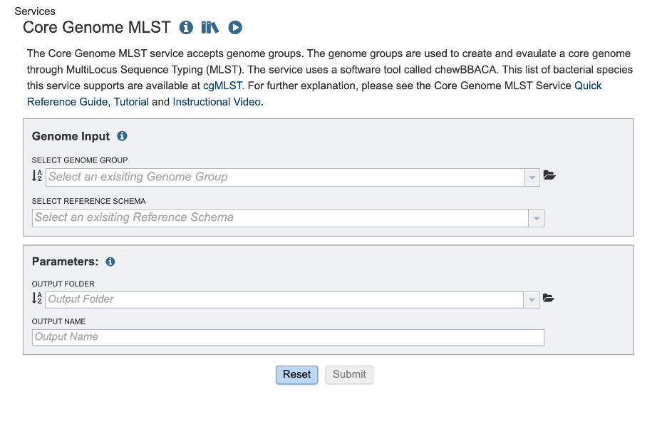

The Core Genome Multi-Locus Sequence Typing (MLST) pipeline allows you to characterize bacterial and viruses based on the presence and absence of specific loci. These loci are defined in a schema.  This service defines a schema as a list of locus names and collection of allele sequences.  There are 32 schemas for priority pathogen species curated by species experts at [Ridom]( https://www.ridom.de/seqsphere/cgmlst/) 
Typical MLST schemas used 5-7 genes that are conserved and essential for basic cellular functions and are expected to be present in all strains of a species even as they evolve.  This service uses schemas with predefined sets of species-specific loci including both core and accessory genes.  This allows for finger resolution of bacterial strain differences and consistent tracking across labs.

This service used Chewbbaca 3.3.10.  Elements of this tutorial are based on their documentation. The full documentation is available [here]( https://chewbbaca.readthedocs.io/en/latest/index.html) The pipeline begins with the alle call step which finds alleles in the genomes that are also listed in the schema. Thus identifying known and novel alleles in the input genomes. An allele is a specific sequence variant that occurs at a given locus.  The initial allele call can be considered as cgMLST including all alleles. Later, we will rerun this step to identify the core genome. The allele call uses the following tools:
  
  * Pyrodigal predicts the coding sequences (CDSs) and generates predicted protein-coding genes which are used for allele matches.
  
  * BLAST Score Ratio (BSR) screening for each locus in the schema.  The predicted CDSs are compared to the known alleles. A match is accepted if the BSR to a known allele is les than or greater than the global threshold of 0.6. The resulting alleles are classified according to the match. Scroll down to Reading "The Allele Call Classification Counts" section for definitions of each classification type.
Then the service runs chewBBACA’s remove genes command to remove paralogous loci (if any) identified in the initial allele call. This is followed by the extract cgMLST command which determines the set of loci that constitute the core genome loci from the allele call results. The following steps take place:
  
  *  Masking: Converts less stable allele calls, INF- (inferred) allele labels and special classifications to 0 to standardize the data.
  
  * Presence-absence matrix: Builds a loci presence-absence matrix and tracks missing/special calls per sample.
  
  * Core Loci Selection: Determines which loci are “core” based on how often they appear across the genomes – providing results for default thresholds 95%, 99% and 100%. 
This service uses 95% as the threshold. A second allele call is performed with the allelic profiles meeting the 95% threshold. Followed by the allele call evaluator. This generates an interactive report, called "allelecall_report.html" that provides summary statistics to evaluate results per sample and per loci. This is available in your job results. The report includes a presence-absence matrix heatmap, a distance matrix based on the allelic differences and a Neighbor-Joining (NJ) tree based on the multiple sequence alignment (MSA) of the core genome loci.

## Select a Genome Group
This service accepts assembled genomes that are collected into one Genome Group. For more information about creating a genome group please visit our [documentation](https://www.bv-brc.org/docs/quick_references/workspaces/groups.html) or our [video tutorial](https://www.youtube.com/watch?v=BDCUyhX9brA&t=36s)

## Select Reference Schema
The schemas are species-specific.  Selecting a schema built from a different species will not allow the service to correctly match your loci to the target genome. This could lead to inaccurate allele calls. 

## Parameters
In the parameters section you will select an output folder and output name.

  ## Finding the Core Genome MLST Results
1.	The job can be located from three places on any BV-BRC page. Clicking on the Workspace tab will reveal two of the places where the workspace or jobs folder can be located, and also from the Jobs monitor located at the lower right of any BV-BRC page.

2.	The landing page shows all the files produced by the job that was submitted. Note: the top portion gives details such as the run time and input parameters.

3.	Each job will return a report summarizing the results. To view the report click, allelecall_report.html. Note: this file must be in the same directory as its supporting actor, “report_bundle.js” or else it will not work.

4.	The report has sections that you can display or hide. Click the down arrow on the right-hand side of the heading to show or hide.

5.	The first section gives a report description to guide the reader through the report.

6.	The Results Summary Data provides a brief overview of the table.

7.	Next, click on the heading “Counts Per Sample” and “Counts per Locus” to view the classification counts. The character codes along the y axis represent the percent idenity match. A better match gives more confidence. The codes are defined (with examples) below in the section "Reading The Allele Call Classification Counts".

8.	Toggle between Sample stats (genome level) and Loci Stats (gene level) Note: the upper right-hand corner offers many ways to interact with this table including search, download as .CSV, view (and hide) columns, and filter. 

9.	Toggle between the results per sample and per locus to view panels with tables with detailed statistics.

The **Sample Stats** table includes the following columns:
*	**Sample**: The sample unique identifier.

*	**Total Contigs**: Total number of contigs in the sample FASTA file.

*	**Total CDSs**: Total number of CDSs identified in the sample.

*	**Proportion of Classified CDSs**: The proportion of CDSs identified in the sample that were classified.

*	**Identified Loci**: The number of schema loci identified in the sample.

*	**Proportion of Identified Loci**: The proportion of schema loci that were identified in the sample.

*	**Valid Classifications**: Total number of valid classifications (EXC and INF)

*	**Invalid Classifications**: Total number of invalid classifications (PLOT3, PLOT5, LOTSC, NIPH, NIPHEM, ALM, ASM and PAMA)

The Loci Stats table includes the following columns:

*	**Locus**: The locus unique identifier.

*	**Total CDSs**: Total number of CDSs classified for that locus.

*	**Valid Classifications**: Total number of valid classifications (EXC+INF)

*	**Invalid Classifications**: Total number of invalid classifications (PLOT3, PLOT5, LOTSC, NIPH, NIPHEM, ALM, ASM, PAMA.

*	**Proportion Samples**: The proportion of samples the locus was identified in.

The dropdown menu below the tables allows the selection of a single column to generate a histogram for the values in the selected column.

10.	the loci presence-absence heatmap representing the loci presence-absence matrix for all samples in the dataset. Blue cells (z=1) correspond to loci presence and grey cells (z=0) to loci absence. The **Select Sample** dropdown menu enables the selection of a single sample to display its heatmap on top of the main heatmap. The Select Locus dropdown menu enables the selection of a single locus to display its heatmap on the right of the main heatmap.

11.	The seventh component displays a heatmap representing the symmetric distance matrix. The distances are computed by determining the number of allelic differences from the set of core loci (shared by 100% of the samples) between each pair of samples. The **Select Sample** dropdown menu enables the selection of a single sample to display its heatmap on top of the main heatmap. The menu after the heatmap enables the selection of a single sample and of a distance threshold to display a table with the list of samples at a distance equal or smaller than the specified distance value.

12.	The last component displays a tree drawn with Phylocanvas.gl based on the Neighbor-Joining (NJ) tree computed by FastTree (with the options -fastest, -nosupport and -noml) The tree is computed based on the MSA for the set of loci that constitute the core-genome (The MSA for each core locus is determined with MAFFT, with the options --retree 1 and --maxiterate 0. The MSAs for all the core loci are concatenated to create the full MSA)

 13.	Click one directory level up on the path at the top of the page to view the rest of your job results.

 14.	The directory “extract_cg_mlst” houses the files determining the loci that constitute the core genome based on loci presence thresholds.  A cgMLST Schema is defined as the set of loci found in all or at least 95% of genomes analyzed.  The schemas this service uses offer a diverse and representative set of strains.  The number of strains differ depending on the species population structure (highly diverse, recombinogenic species may require more schemas). Any loci that are not found in at least 95% of the genomes analyzed are considered accessory genome (genes that are variably present in isolates from that population.

* cgMLST.html details the number of loci present at 100%, 99% and 95%.

* cgMLST100.tsv, cgMLST95.tsv, cgMLST99.tsv contains a matrix of allelic profiles for the cgMLST for each threshold.

* cgMLSTschema100.txt,  cgMLSTschema95.txt,  cgMLSTschema99.txt,  contains the list of loci that constitute the cgMLST schema. The filtered schema allele call uses the cgMLSTschema95.txt file to define the loci list to perform allele calling on. Compared to full schema allele call which uses all the loci listed in the schema. For more information please visit the [Chewbbaca documentation]( https://chewbbaca.readthedocs.io/en/latest/user/modules/ExtractCgMLST.html).

 15. The “filtered_schema_allele_call” and “full_schema_allele_call” contain the same contents and only differ on if the allele call used loci present in 95% of the genomes passed or the full schema of genes available (regardless of how many genomes they are present in). 
* allele_call_evaulator directory 

  * allelecall_report.html and report_bundle.js – The allelecall_report.html  is detailed above. The report_bundle.js must be kept in  the same directory as allelecall_report.html. 

  * cgMLST_MSA.fasta - contains the MSA of the core loci. For each locus in the core genome, the alleles found in all samples are translated and aligned with MAFFT. The alignment files are concatenated to generate the full core genome alignment.
		  
  * cgMLST_profiles.tsv  - contains the allelic profiles for the set of core loci.
		  
  * distance_matrix_symmetric.tsv contains the symmetric distance matrix. The matrix contains the pairwise allelic distances computed based on the set of core loci (shared by 100% of the samples).

  * masked_profiles.tsv - contains the masked allelic profiles (the profiles in the results_alleles.tsv file are masked to remove INF- prefixes and substitute all non-EXC and non-INF classification by 0).
		
  * presence_absence.tsv - contains the loci presence-absence matrix.

* cds_coordinates.tsv - contains the coordinates (genome unique identifier, contig identifier, start position, stop position, protein identifier attributed by chewBBACA, and coding strand chewBBACA>=3.3.0 assigns 1 and -1 to the forward and reverse strands,)) of the CDSs identified in each genome.

* invalid_cds.txt file contains the list of alleles predicted by Prodigal that were excluded based on the minimum sequence size value and presence of ambiguous bases.

* loci_summary_stats.tsv - contains the classification type counts (EXC, INF, PLOT3, PLOT5, LOTSC, NIPH, NIPHEM, ALM, ASM, PAMA, LNF) and the total number of classified CDSs (non-LNF) per locus.

* logging_info.txt - contains summary information about the allele calling process.

* missing_classes.fasta and missing_classes.tsv give insight into why the sequences were classified as non-EXC or non-INF.

* paralogous_counts.tsv - contains the list of paralogous loci and the number of times those loci matched a CDS that was also similar to other loci in the schema.

* paralogous_loci.tsv - contains the sets of paralogous loci identified per genome (genome identifier, identifiers of the paralogous loci and the coordinates of the CDS that is similar to the group of paralogous loci).

* results_alleles.tsv - contains the allelic profiles determined for the input samples. The first column has the identifiers of the genome assemblies. The remaining columns contain the allele identifiers or other classification labels for loci present in the schema, with the column headers being the locus identifiers.

* results_alleles_NoParalogs.tsv - details loci that were identified as possible paralogs. These loci should be removed from the schema due to the potential uncertainty in allele assignment. This is completed by the “RemoveGenes” command which is run prior to the filtered allele call.

* results_contigsInfo.tsv - contains the loci coordinates in the genomes analyzed. The first column contains the identifiers of the input genomes and the other columns (with loci names in the headers) the locus coordinate information or the classification attributed by chewBBACA if it was not an exact match or inferred allele.

* results_statistics.tsv  - contains the classification type counts (EXC, INF, PLOT3, PLOT5, LOTSC, NIPH, NIPHEM, ALM, ASM, PAMA, LNF), the total number of invalid CDSs, the total number of classified CDSs (non-LNF) and the total number of predicted CDSs per genome.

* unclassified_sequences.fasta – a FASTA file with the DNA sequences of the distinct CDSs that were not classified.

## Reading The Allele Call Classification Counts
Consider this like quality control. These codes represent the quality of the DNA identity match. A high number of PLOT3/PLOT5, LOTSC, NIPH/NIPHEM, PAMA, and ASM/ALM classifications assigned to a genome usually indicates that the genome is of poor quality (e.g. highly fragmented or contaminated)

* **EXC** - EXaCt match (100% DNA identity) with previously identified alleles.

* **INF** - INFerred new alleles that had no exact match in the schema but are highly similar to loci in the schema. In the allelic profiles (included in the results_alleles.tsv output file), the INF- prefix in the allele identifier indicates that the allele was newly inferred and the number following the prefix is the allele identifier attributed to the allele. Inferred alleles are added to the FASTA file of the locus they share high similarity with (unless the --no-inferred parameter is used)

* **LNF** - Locus Not Found. The number of schema loci for which it was not possible to identify a similar allele in the input genome. This means that, for those loci, there were no BLAST hits or they were not within the BSR threshold for allele assignment.

* **PLNF** - Probable Locus Not Found. Attributed when a locus is not found during execution modes 1, 2 and 3. Those modes do not perform the complete analysis, which is only performed in mode 4 (default), and the distinct classification indicates that a more thorough analysis may have found a match for the loci that were not found.

* **PLOT3/PLOT5** - Possible Locus On the Tip of a contig (see image below) A CDS is classified as PLOT5 or PLOT3 if it is close to the contig 5’- or 3’-end and if the unaligned portion of the matched representative allele exceeds the contig end. This could be an artifact caused by genome fragmentation resulting in the prediction of a shorter CDS. To avoid locus misclassification, loci in such situations are classified as PLOT.
 
* **LOTSC** - A CDS is classified as LOTSC if the matched representative allele is bigger than the contig containing the CDS.

* **NIPH/NIPHEM** - The NIPH and NIPHEM classifications are assigned when multiple CDSs from the same genome match the same schema locus. NIPH (Non-Informative Paralogous Hit) is assigned when multiple CDSs from the same genome match a single locus. NIPHEM (Non-Informative Paralogous Hit Exact Match) is assigned when multiple CDSs from the same genome are exact matches to alleles of a single locus. These classifications suggest that a locus can have paralogous (or orthologous) loci in the query genome and should be removed from the analysis due to the potential uncertainty in allele assignment (for example, due to the presence of multiple copies of the same mobile genetic element (MGE) or as a consequence of gene duplication followed by pseudogenization) A high number of these classifications may also indicate a poorly assembled genome due to a high number of smaller contigs which result in partial CDS predictions.

* **PAMA** - PAralogous MAtch. Attributed to CDSs that are highly similar to more than one locus. This type of classification allows the identification of groups of similar loci in the schema that are classified as paralogous loci and listed in the paralogous_counts.tsv and paralogous_loci.tsv output files.
 
* **ASM/ALM** - The ASM (Allele Smaller than Mode) and ALM (Allele Larger than Mode) classifications are assigned when the size of a CDS that matches a schema locus is below or above the locus size variation interval, respectively. The default behavior is to assign these classifications to alleles that are 20% shorter or longer than the locus allele size mode. It is important to remember that, although infrequently, the mode may change as more alleles for a given locus are called and added to a schema. The ALM and ASM classifications impose a limit on allele size variation since for the majority of loci the allele lengths are quite conserved. However, some loci can have larger variation in allele length and those should be manually curated.
