# FastQ Utilities Service

## Determining/Improving Read Quality

FASTQ is a text-based format for storing both a nucleotide sequence and its corresponding quality scores. Both the sequence letter and quality score are each encoded with a single ASCII character.

A FASTQ file normally uses four lines per sequence.
* Line 1 begins with a ‘@’ character and is followed by a sequence identifier and an optional description (like a FASTA title line).
* Line 2 is the raw sequence letters.
* Line 3 begins with a ‘+’ character and is optionally followed by the same sequence identifier (and any description) again.
* Line 4 encodes the quality values for the sequence in Line 2 and must contain the same number of symbols as letters in the sequence.

Understanding the quality of fastq reads that come from the sequencer is an essential first step to any of the BV-BRC services that uses them (Assembly, Comprehensive Genome Analysis, Taxonomic classification, Metagenomic read mapping, Metagenomic binning, Variation, RNA-Seq, TN-seq and Similar Genome Finder). The Fastq Utilities Service provides the capability for aligning, measuring base call quality, and trimming fastq read files to estimate quality. Researchers can submit fastq reads (paired-or single-end, long or short, zipped or not) to the service, as well as Sequence Read Archive accession numbers. The three components (trim, fastqc and align) can be used independently, or in any combination. The pipelines will be initiated in the order that they are selected.

## Creating a folder to hold the Fastq Utilities job and related data

Please refer to the Assembly Service tutorial for instructions on creating a folder in the BV-BRC (../genome_assembly/assembly.html).

## Locating The Fastq Utilities Service App

1.	Click on the Services tab at the top of the page, and then click on Fastq Utilities. 
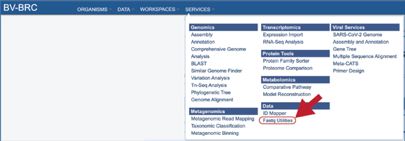

2.	This will open up the Fastq Utilities landing page where researchers can submit single or paired read files, an SRA run accession number to the service. 

## Parameters

1.	A folder must be selected for the Fastqc Utilities job. Clicking on the down arrow at the end of the text box underneath **Output Folder** will show recent folders that have been used. Clicking on the folder icon at the end of the text box will open a pop-up window where all folders can be viewed, or new folders created. Begin typing a name in the text box underneath **Output Folder** will show all folders that match that text.  Clicking on the desired folder will populate the text box with its name. 
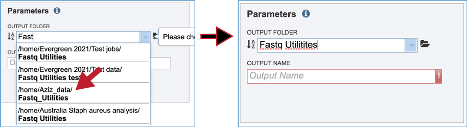

2.	A name for the job must be entered in the text box under **Output Name**. 
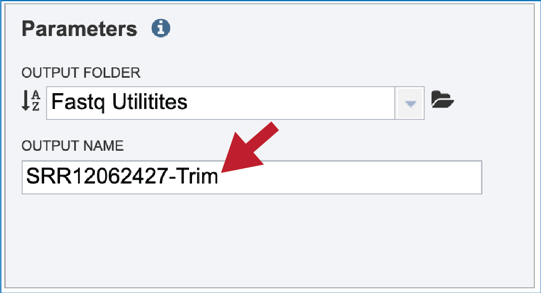

## Input Files

### Uploading paired end reads

Please refer to the Assembly service tutorial for instructions on uploading paired-end reads in the BV-BRC (../genome_assembly/assembly.html).

### Uploading single reads
Please refer to the Assembly service tutorial for instructions on uploading single-end reads in the BV-BRC (../genome_assembly/assembly.html).

### Submitting reads that are present at the Sequence Read Archive (SRA)
Please refer to the Assembly service tutorial for instructions on submitting reads from the Sequence Read Archive (../genome_assembly/assembly.html).

1.	Once read files have been uploaded or located, the files must be transferred prior to the job beginning.  Click on the icon of an arrow within a circle. This will move your file into the Selected libraries box. 
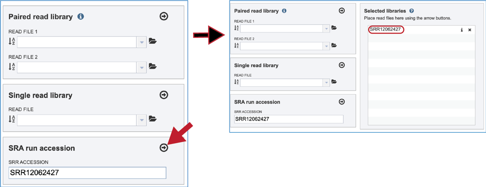

## Pipeline Options

1.	The Fastq Utilities service allows researchers to judge the quality of their reads, trim them, or align them to a reference genome. Each of these steps, which can be launched independently or in any combination, will be described below. To select the type of pipeline, click on the down-arrow at the end of the text box that says **Select Action**. This will open a drop-down box that shows the three available pipelines. 
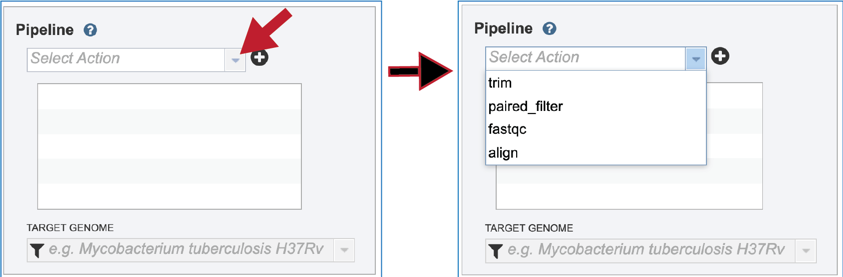

2.	Click on the name for the pipeline will fill the text box underneath **Pipeline**. 
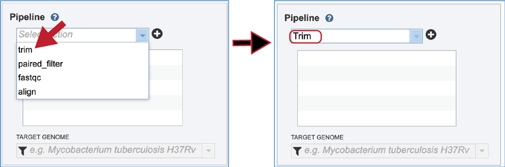

## Trimming

The lengths of individual nucleotide sequences (reads) output by second-generation sequencing machines have reached 35, 50, 100 bps and more. When DNA or RNA molecules are sequenced that are shorter than this length the machine sequences into the adapter ligated to the 3 end of each molecule during library preparation. Consequently, the reads contain the sequence of the molecule of interest and also the adapter sequence. An essential first task prior to analysis is to find the reads containing adapters and to remove those adapters, leaving the relevant part of the read for downstream analysis. In some cases, finding adapters is a sign of contamination, and the reads containing them must be discarded entirely. The Trim component of Fastq Utilities service uses Trim Galore[1], which is Perl wrapper around the Cutadapt[2] and FastQC[3] tools. The Trim Galore algorithm was downloaded from the following source: https://github.com/FelixKrueger/TrimGalore. 

### Submitting the Trimming job

1.	In order to run the trimming job, the Trim pipeline selection must be moved to the selected pipeline box.  Click on the + icon at the end of the text box that contains Trim.  This will move the pipeline choice into the selected pipeline box.  Note that any, or all pipeline options can be selected if desired. 
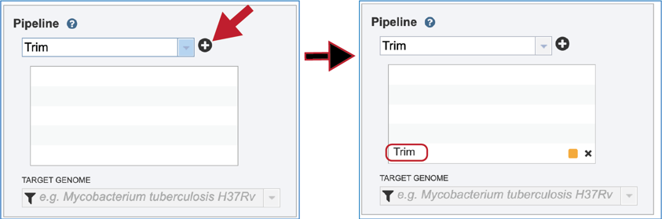

2.	After the parameters, reads and pipeline have been selected, the Submit button turns blue and the job will be submitted once clicked.  
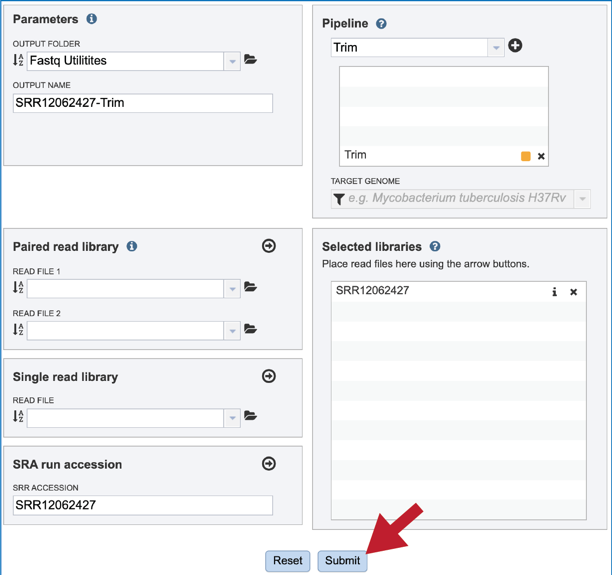

3.	A successful submission will generate a message indicating that the job has been queued. 

### Monitoring progress on the Jobs page

1.	Click on the Jobs box at the bottom right of any BV-BRC page. 
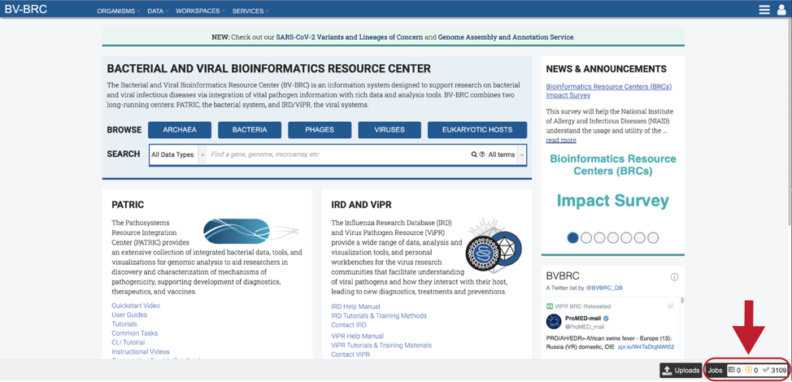

2.	This will open the Jobs Landing page where the status of submitted jobs is displayed. 
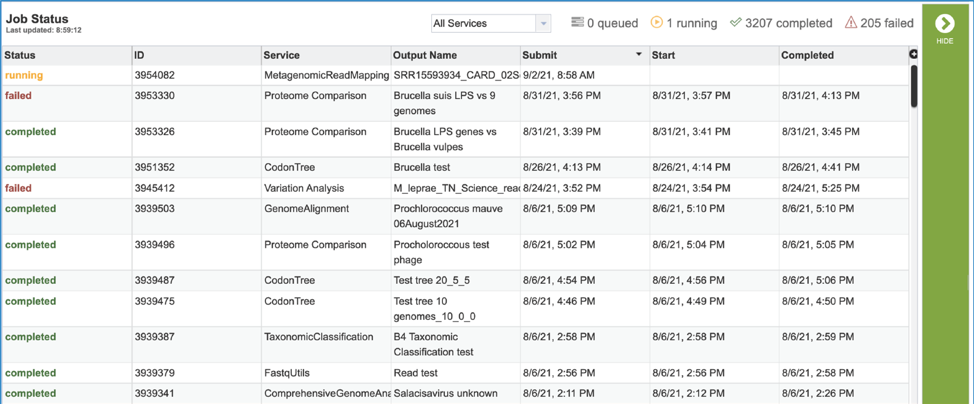

### Viewing the trimming job

1.	A job that has been successfully completed can be viewed by clicking on the row and then clicking on the View icon in the vertical green bar. 
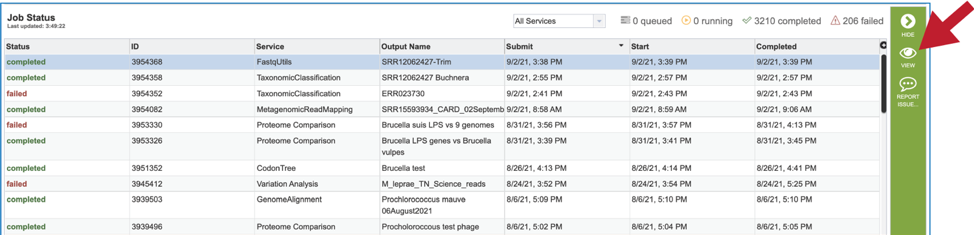

2.	This will rewrite the page to show the information about the job, and all of the files that are produced when the pipeline runs.  The information about the job submission can be seen in the table at the top of the results page.  To see all the parameters  that were selected when the job was submitted, click on the **Parameters** row. 
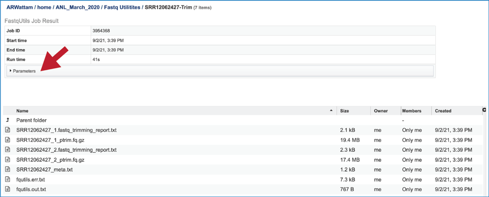

3.	This will show the information on what was selected when the job was originally submitted. 
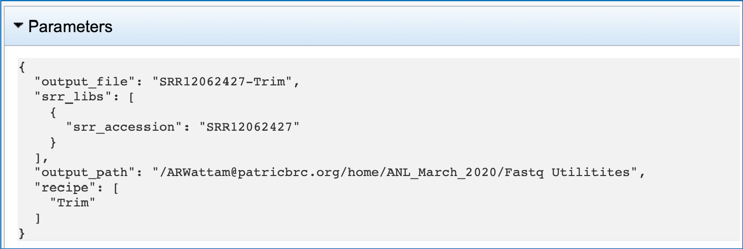

4.	The jobs page has several files for download or viewing.  The **fastq_trimming_report.txt** files include a summary of the pipeline parameters and the details on the reads that were processed. The number of these files will match the number of reads submitted. To view this file, click on the row then the View icon in the vertical green bar. 
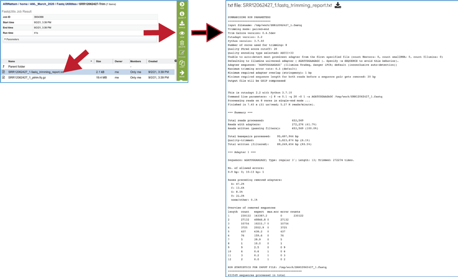

5.	The **fastq_trimming_report.txt** file contains details about the default parameters used in running the pipeline, including information about any adaptor sequences that were located. 
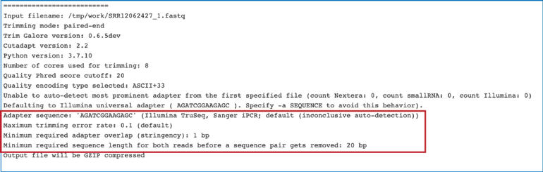

6.	The **fastq_trimming_report.txt** file provides information on the reads and base pairs processed. 
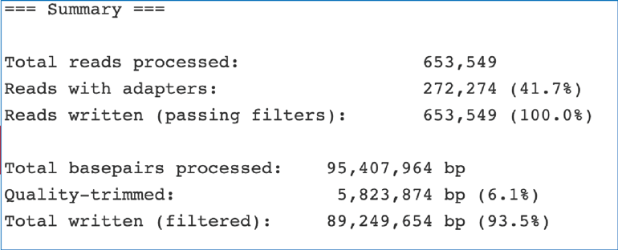

7.	The **fastq_trimming_report.txt** file provides information about any adaptors that it finds. 
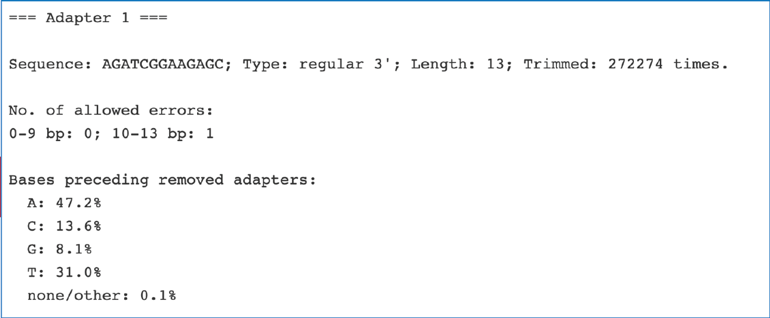

8.	The **fastq_trimming_report.txt** file contains an overview of removed sequences. 
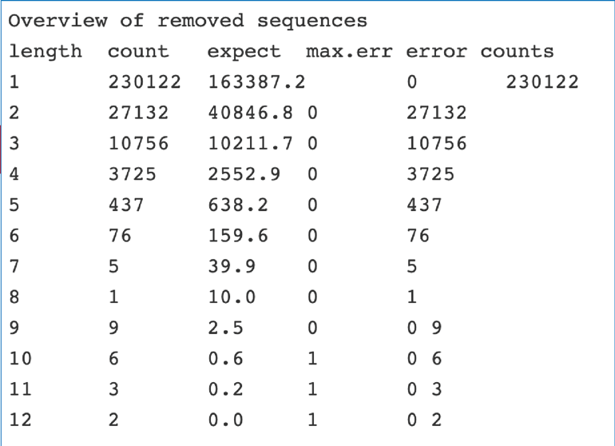

9.	The **fastq_trimming_report.txt** file also includes the run statistics for the input file, which includes the number of sequences that were removed. 
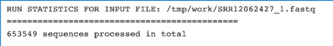

10.	The **ptrim.fq.gz** file contains the trimmed read file and should be used for downstream analyses.  The number of these files will match the number of reads submitted. 
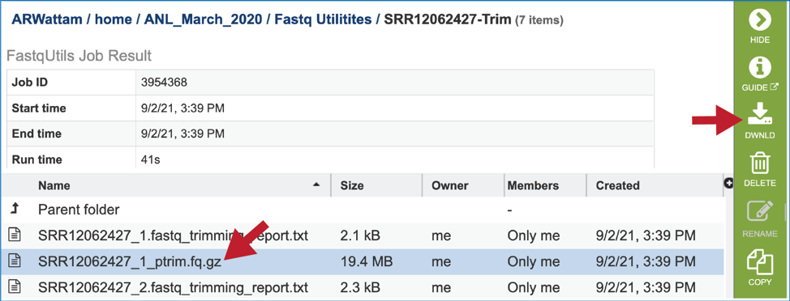

11.	The **meta.txt** file contains the information about the read files that were submitted. 
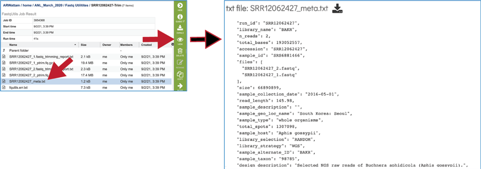

12.	The **fqutils.err.txt** file contains all the output from each program that was run. 
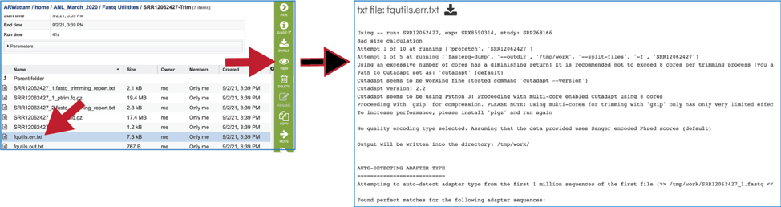

13.	The **fqutils.out.txt** file contains the executed commands. 
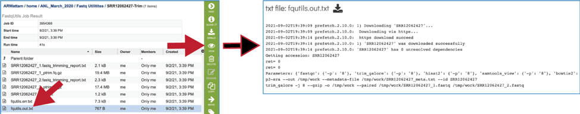

## Paired Filter

Paired end reads are usually provided as two fastq-format files, with each file representing one end of the read. Many commonly used downstream tools require that the sequence reads appear in each file in the same order and reads that do not have a pair in the corresponding file are placed in a separate file of singletons. Although most sequencing instruments capable of generating paired end reads produce files where each read has a corresponding mate, many downstream bioinformatics manipulations break the one-to-one correspondence between reads, and paired-end sequence files loose synchronicity, and contain either unordered sequences or sequences in one or other file without a mate. Assembly jobs often fail in the BV-BRC service due to the paired reads not being evenly matched, so the FASTQ Utilities service now offers a pipeline that ensures that all paired-end reads have a match.  The pipeline uses Fastq-Pair[4]. The code for Fastq-Pair is available here: https://github.com/linsalrob/fastq-pair.

### Submitting the Paired Filter job

1.	To select the Paired Filter option, it must first be selected from the drop-down box underneath **Pipeline**.  Clicking on that row will fill the text box with **paired_filter**. 
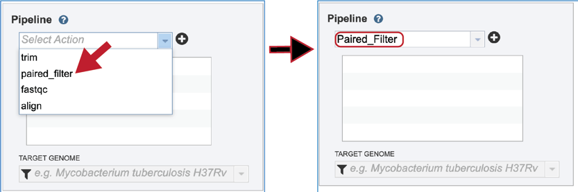

2.	Click on the plus icon (+) at the end of the text box to move that pipeline into the selected service box below. 
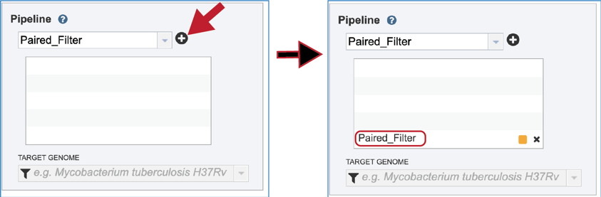

3.	Once the Parameters and Reads have been filled in or selected, the Submit button turns blue and the job will be submitted once clicked. 
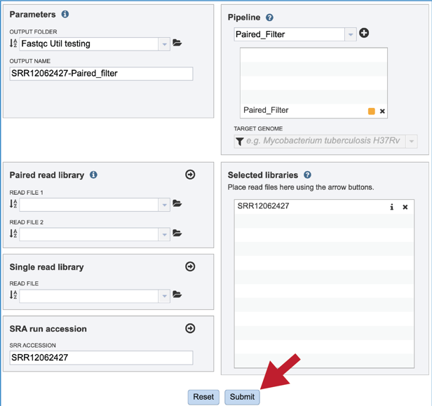

4.	A successful submission will generate a message indicating that the job has been queued. 

### Monitoring progress on the Jobs page

This process is the same as described above for Trimming.

### Viewing the Paired Filter job results

1.	On the jobs page, click on the row that has the job of interest.  This will populate the vertical green bar on the right with possible downstream steps, which include viewing the results of the job, or reporting an issue that was experienced (like a job failure).  Click on the **View** icon. 

2.	This will rewrite the page to show the information about the job, and all of the files that are produced when the pipeline runs.  The information about the job submission can be seen in the table at the top of the results page.  To see all the parameters that were selected when the job was submitted, click on the **Parameters** row. 
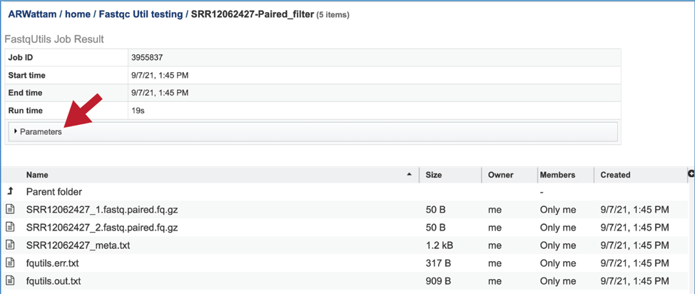

3.	This will show the information on what was selected when the job was originally submitted. 
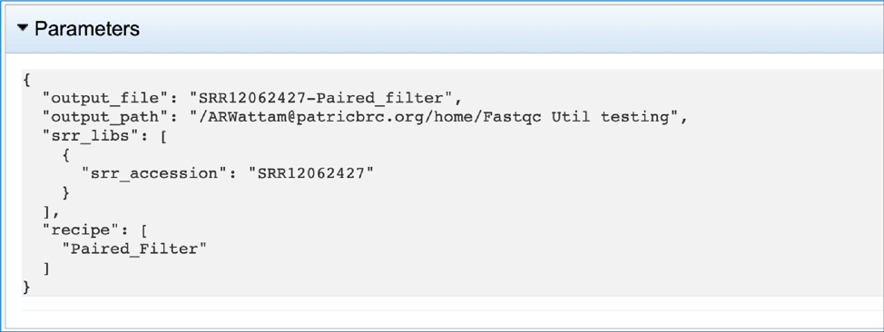

4.	The **fastq.paired.fq.gz** file contains the paired read file and should be used for downstream analyses.  It can be downloaded by clicking on the **Download** icon. 
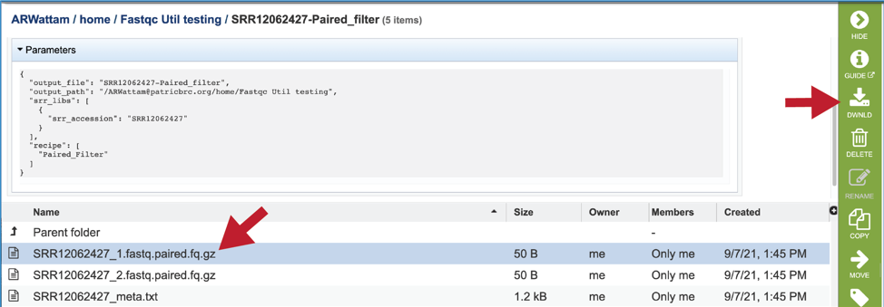

5.	The **meta.txt**, **fqutils.err.text** and **fqutils.out.txt** files are the same as those described in the Trimming job results above. 

## FastQC

FastQC[3] is a very popular tool used to provide an overview of basic quality control metrics for raw next generation sequencing data.  It provides a modular set of analyses that provide a quick impression of the data and indicate any problems that would impact further analysis. The FastQC algorithm was downloaded from Babraham Bioinformatics (http://www.bioinformatics.babraham.ac.uk/projects/fastqc/). An excellent tutorial on the FastQC report is provided by Michigan State University (https://rtsf.natsci.msu.edu/genomics/tech-notes/fastqc-tutorial-and-faq/), part of which is provided below.

The output from FastQC is an html file that may be viewed in your browser.  The report contains one result section for each FastQC module.  In addition to the graphical or list data provided by each module, a flag of “Passed”, “Warn” or “Fail” is assigned.  Researchers should be very cautious about relying on these flags when assessing sequence data. The thresholds used to assign these flags are based on a very specific set of assumptions that are applicable to a very specific type of sequence data. Specifically, they are tuned for good quality whole genome shotgun DNA sequencing. They are less reliable with other types of sequencing, for example mRNA-Seq, small RNA-Seq, methyl-seq, targeted sequence capture and targeted amplicon sequencing.  Therefore, a module result that has a “Warn” or “Fail” flag does not necessarily mean that the sequence run failed.  “Warn” and “Fail” flags mean that the researcher must stop and consider what the results mean in the context of that particular sample and the type of sequencing that was run.

### Submitting the FastQC job

1.	To select the FastQC option, it must first be selected from the drop-down box underneath Pipeline.  Clicking on that row will fill the text box with FastQC. 
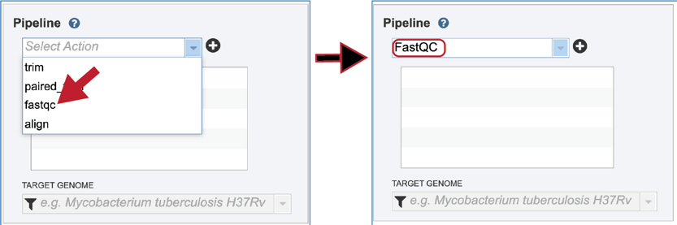

2.	Click on the plus icon (+) at the end of the text box to move that pipeline into the selected service box below. 
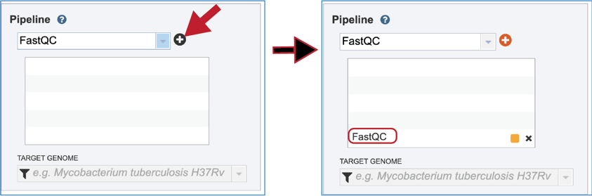

3.	Uploading paired-end, single-end or reads available at the Sequence Read Archive are described above. If the reads of interest were previously trimmed, those reads will appear in the drop-down box and are available for analysis.  Click on the down arrow that follows the text box underneath **Read File**.  If submitting paired end reads, make sure to select the pairs that match. 
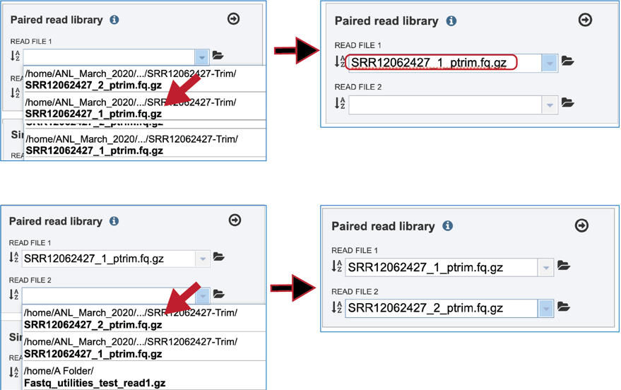

4.	The reads must be moved to the **Selected Libraries** box. 
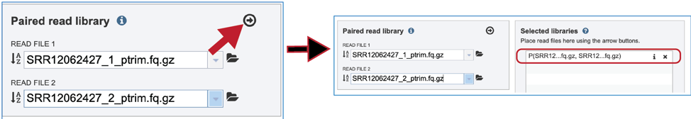

5.	Once the Parameters and Reads have been filled in or selected, the Submit button turns blue and the job will be submitted once clicked. 
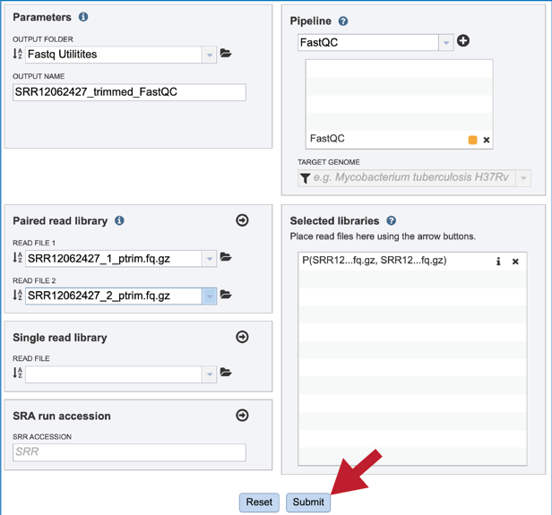

6.	A successful submission will generate a message indicating that the job has been queued. 

### Monitoring progress on the Jobs page
This process is the same as described above for Trimming.

 ### Viewing the FastQC job results

1.	On the jobs page, click on the row that has the job of interest.  This will populate the vertical green bar on the right with possible downstream steps, which include viewing the results of the job, or reporting an issue that was experienced (like a job failure).  Click on the **View** icon. 
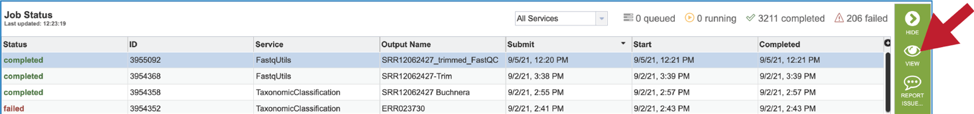

2.	This will rewrite the page to show the information about the FastQC job, and all of the files that are produced when the pipeline runs.  The information about the job submission can be seen in the table at the top of the results page.  To see all the parameters that were selected when the job was submitted, click on the **Parameters** row. 
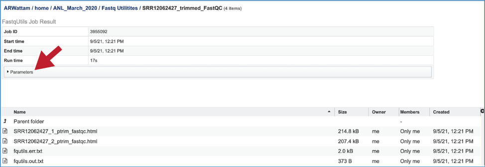

3.	This will show the information on what was selected when the job was originally submitted. 
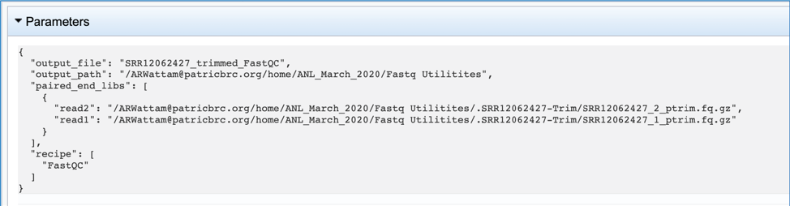

4.	The **meta.txt**, **fqutils.err.text** and **fqutils.out.txt** files are the same as those described in the Trimming job results above.

5.	The **fastqc.html** file shows the quality statistics.  The job page will have one file for each read set. There are a couple of good reviews of FastQC reports available (https://dnacore.missouri.edu/PDF/FastQC_Manual.pdf and https://rtsf.natsci.msu.edu/genomics/tech-notes/fastqc-tutorial-and-faq/). 
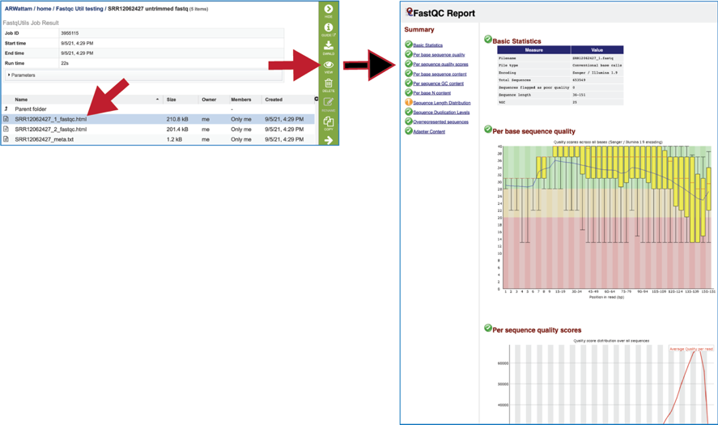

6.	The Basic Statistics module shows composition statistics for the file analyzed. 
    * **Filename** has the original name. 
    * **File type** says if the file had actual base calls or colorspace data that had to be converted to base calls.
    * **Total sequences** provides a count of the total number of sequences processed.
    * **Sequences flagged as poor quality** tells which sequences were flagged to be filtered and removed from all analyses.
    * **Sequence length** provides the length of the shortest and longest sequences in the set.  If all sequences are the same length, only one value is reported.
    * **%GC** shows the overall %GC of all bases in all sequences. 
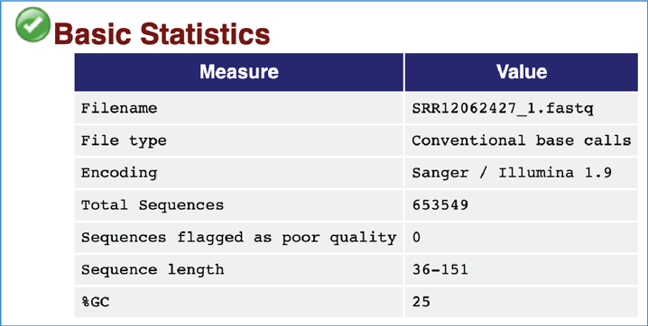

7.	The **Per Base Sequence Quality** shows an overview of the range of quality values across all bases at each position in the FastQ file.  For each position, a BoxWhisker type blot is drawn.  The y-axis shows the quality scores (the higher the score the better the base call), and the background divides it into good quality calls (green), calls of reasonable quality (orange) and calls of poor quality (red). A warning will be issued if the lower quartile for any base is less than 10, or the median for any base is less than 35.  A failure will be issued if the lower quartile for any base is less than 5 or if the median for any base is less than 20. Note that the X-axis is not uniform, it starts out with bases 1-10 being reported individually, after that, it will bin bases across a window a certain number of positions wide. The number of base positions binned together depends on the length of the read; for example, with 150bp reads the latter part of the plot will report aggregate statistics for 5bp windows. Shorter reads will have smaller windows and longer reads larger windows. The blue line is the mean quality score at each base position/window. The red line within each yellow box represents the median quality score at that position/window. The yellow box is the inner-quartile range for 25th to 75th percentile. The upper and lower whiskers represent the 10th and 90th percentile scores. It is normal with all Illumina sequencers for the median quality score to start out lower over the first 5-7 bases and to then rise. The average quality score will steadily drop over the length of the read. With paired end reads the average quality scores for read 1 will almost always be higher than for read 2. 
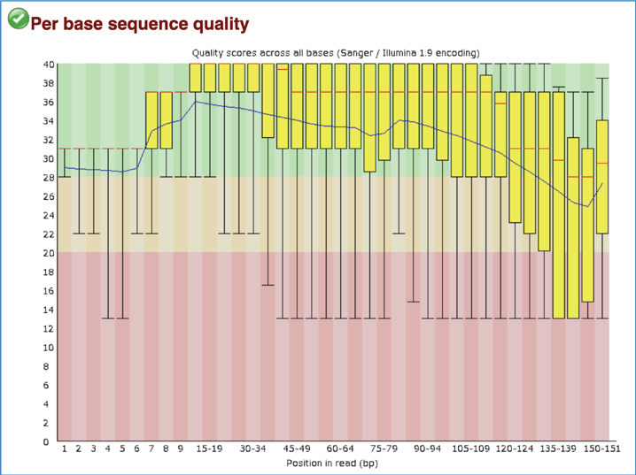

8.	**Per Sequence Quality Scores** shows the subset of sequences that have low quality values.  A warning is issued if the most frequently observed mean quality is below 27 (this equals a 0.2% error rate) and a failure is raised if the most frequently observed mean quality is below 20 (this equals a 1% error rate). 
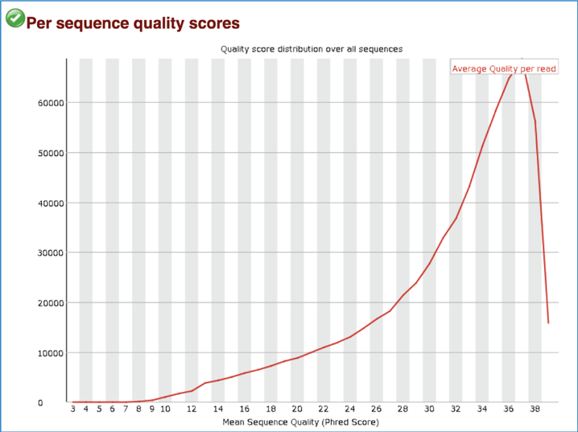

9.	**Per Base Sequence Content** plots out the proportion of each base position in a file for which each of the four normal DNA bases have been called. In a random library there would be little to no difference between the different bases of a sequence run, so the lines in this plot should run parallel with each other.  A warning is issued if the difference between A and T, or G and C is greater than 10% in any position.  A failure will be issued if the difference is greater than 20%. 
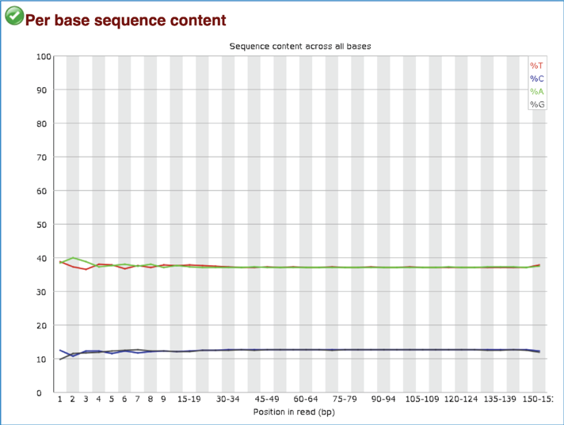

10.	The **Per sequence GC content** measures the GC content across the whole length of each sequence in a file and compares it to a modelled normal distribution of GC content. In a normal random library, one would expect to see a roughly normal distribution of GC content where the central peak corresponds to the overall GC content of the underlying genome. A warning is raised if the sum of the deviations from the normal distribution represents more than 15% of the reads, and a failure will be raised if the sum is more than 30%. 
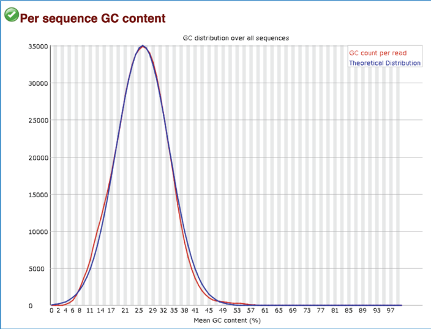

11. The **Per base N content** plots out the percentage of base calls at each position for which an N was called. A warning is raised if any position shows an N content of >5%, and a failure if any position shows an N content of >20%.
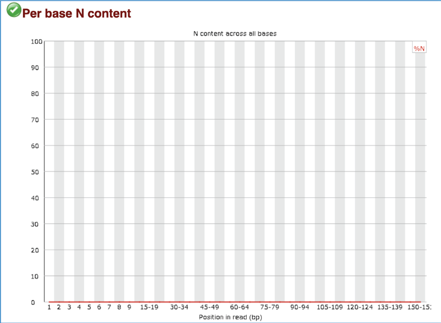

12. Some sequencers generate sequence fragments of uniform length, and some don’t. The **Sequence Length Distribution** generates a graph showing the distribution of fragment sizes in the file. A warning is raised if all sequences are not the same length, and a failure is issued if any of the sequences have 0 length. 
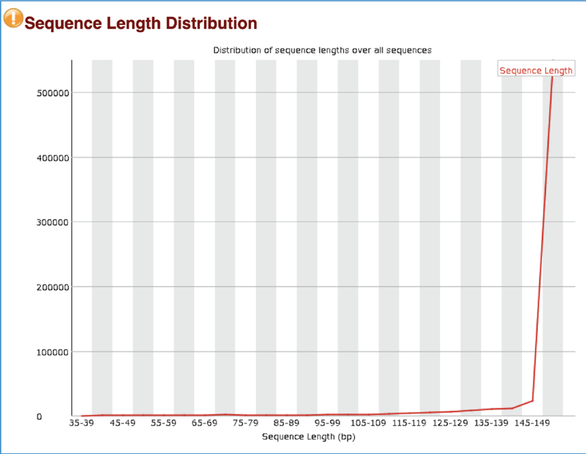

13. Most sequence will occur only once in the final set, but a low level of duplication may indicate a very high level of coverage of the target sequence.  A high level of duplication is more likely to indicate some kind of enrichment bias. The **Sequence Duplication Levels** module counts the degree of duplication for every sequence in the set and creates a plot showing the relative number of sequences with different degrees of duplication. This module issues a warning if non-unique sequences make up more than 20% of the total, and a failure is issued if they are more than 50%. 
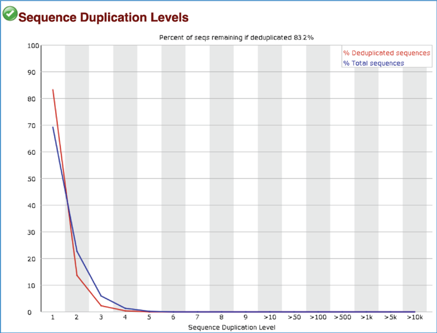

14. A normal high-throughput library will contain a diverse set of sequences, with no individual sequence making up a tiny fraction of the whole.  A single overrepresented sequence either means that it is highly biologically significant, or that the library is contaminated, or that the library is not as diverse as expected. The **Overrepresented sequences** module lists all of the sequence which make up more than 0.1% of the total.  A warning will be issued if any sequence is found to represent more than 0.1% of the total, and a failure if it is more than 1.0%. 
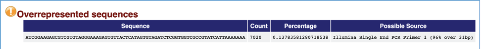

15.	The **Adapter Content** module shows the cumulative plot of the fraction of reads where the sequence library adapter sequence is identified at the indicated base position. Only adapters specific to the library type are searched. A warning is issued if any sequence is present in more than 5% of all reads, and a failure if more than 10%. 
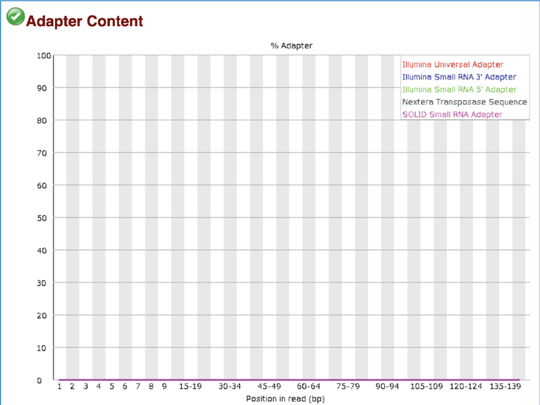

## Align

The Align function of the FastQC Utilities service aligns reads to genomes using Bowtie2[5]to generate BAM files, saving unmapped reads, and generating SamStat[6] reports of the amount and quality of alignments. The Bowtie2 algorithm was downloaded from https://github.com/BenLangmead/bowtie2, and the SamStat algorithm from https://github.com/TimoLassmann/samstat.

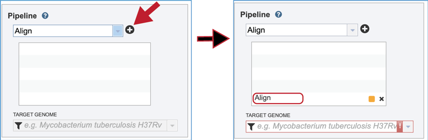

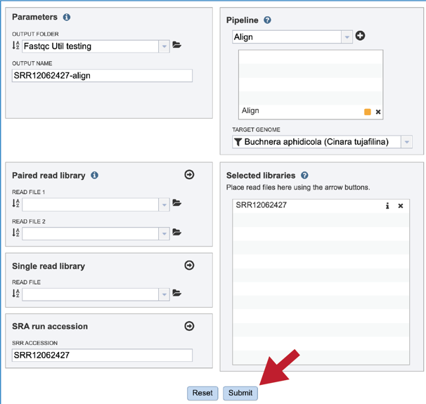


