# Building Phylogenetic Trees (Gene Trees) Tutorial

## Overview
The Phylogenetic Tree (Gene Tree) Building Service enables construction of custom phylogenetic trees built from user-selected genomes, genes or proteins. Trees can be built based on either nucleotide or protein input sequences. The "FastTree" option computes large minimum evolution trees with profiles instead of a distance matrix. [1,2]. We also offer two maximum likelihood tree building algorithms: PhyML [3] and RaxML [4]. User-defined settings are required for either. PhyML and RaxML infer a more evolutionarily-accurate phylogenetic topology by applying a substitution model to the nucleotide sequences. This algorithm is best applied to datasets containing: 
1) fewer than 100 very long sequences, and
2) between 100 and 1,000 small or medium length sequences.
The service returns a Newick file which can be rendered in the interactive Archaeopteryx Tree Viewer in the BV-BRC or downloaded and viewed in other software.   

### See also
* [Phylogenetic Gene Tree Service](https://beta.bv-brc.org/app/GeneTree)
* [Phylogenetic Gene Tree Service Quick Reference](../../quick_references/services/genetree.html)

## Locating the service

At the top of any BV-BRC page, find the **SERVICES** tab and then click on Gene Tree (Viral Services category). 
 

This will open the phylogenetic tree input form. Note: You must be logged into BV-BRC to use this service. 

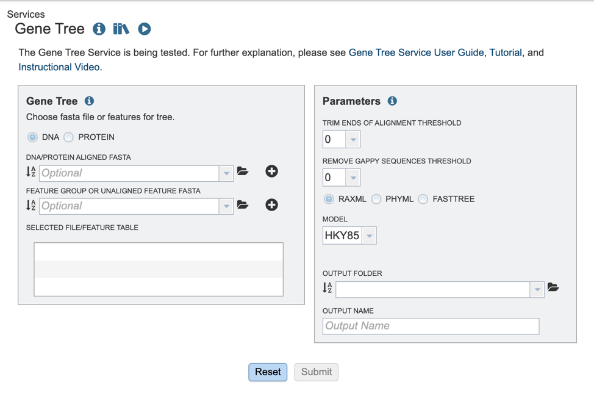

## Selecting input data
The BV-BRC offers several algorithms for tree building. Users may opt to build trees, using either aligned or unaligned nucleotide or protein sequences. We will describe the various input methods below.

1\.	To select the type of input sequence: nucleotide or protein, select the appropriate box. 

2\.	If you have previously aligned nucleotide or protein datasets using BV-BRC, these fasta files can be added from your workspace either by clicking on the folder icon and searching for it, or simply typing the file name in the appropriate box. 

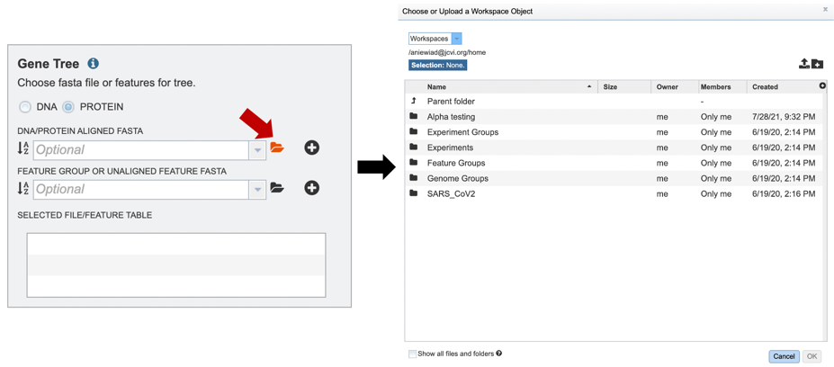

3\.	Once a file is chosen, click on the “add” button to add the file to the “Selected file/feature fasta”. 

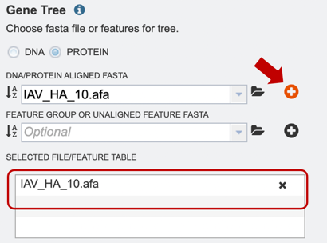

4\.	Alternatively, users can also upload a pre-selected feature group, or unaligned feature table input file, or select it from their workbench, by using the option shown below. 

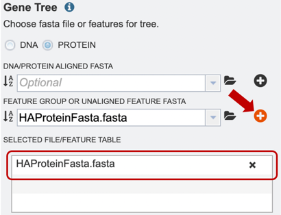

## Choosing an algorithm and parameters

1\.	Several parameters must be selected before the phylogenetic tree job can be submitted, allowing the “Submit” button to turn blue, and the job to be queued. 

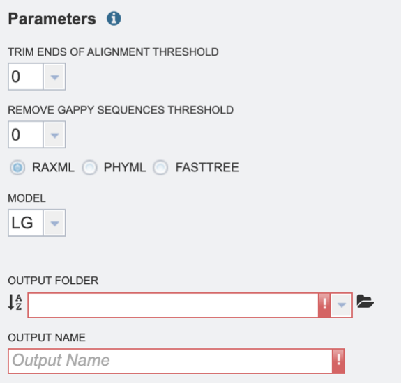

2\.	Select the “Trim ends of alignment threshold,” which allows the user to trim ends of the alignment. Values can be selected in percentages. If no value is selected, ends will not be trimmed. 

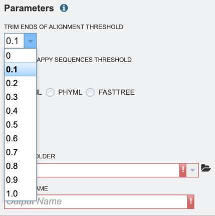

3\.	Select the “Remove gappy sequences threshold,” which allows the user to remove gappy positions from alignment extremities. Values can be selected in percentages. If no value is selected, no sequences will be removed. 

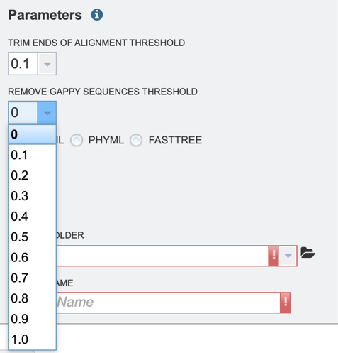

4\.	Select the desired tree algorithm. Users can choose from one of the following tree-building algorithms: RaxML, PhyML, or FastTree. 

5\.	Next select the evolutionary model. The appropriate evolutionary model options will change based on whether the user is aligning nucleotide or protein sequences (see options below). 
Nucleotide: HKY85, JC69, K80, F81, F84, TN93, GTR
Protein: LG, WAG, JTT, Blosum62, Dayhoff, HIVw, HIVb 

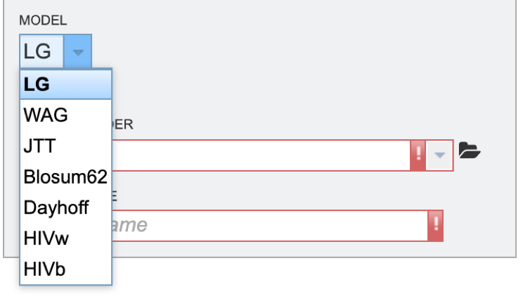

6\.	Finally, select the “Output folder” in the workspace where results will be placed, and choose an “Output name” for the job. This name will appear in the workspace when the annotation job is complete, and will be saved in the chosen workspace folder. 

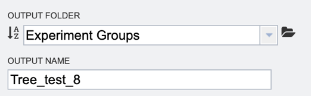

7\.	When all the parameters are entered, the codon tree job is ready to submit. Submit the job by clicking on the blue Submit button.

8\.	A message will appear below the box to indicate that the job is now in the queue. 

9\.	The bottom right corner of the BV-BRC page displays an indicator that shows the number of jobs that are queued, running or completed. Clicking on the word Jobs will rewrite the page to show the Job status. 

## Viewing completed results
1\.	Researchers can monitor the Jobs Status page to see the status of their job, which is indicated in the first column (Queued, Running, Complete, Failed).

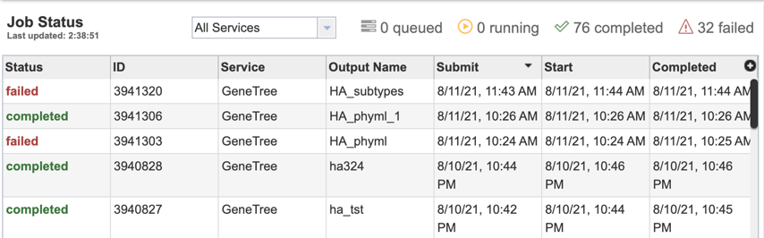

2\.	Clicking on the row that contains the job of interest will open two icons in the vertical green bar. If there is a problem with a particular job, the Report Issue icon should be clicked. 

3\.	This will open a pop-up window where issues with specific jobs can be reported. Users can add any additional information and click the submission button to generate a message to BV-BRC team members, notifying them that there has been a problem. 

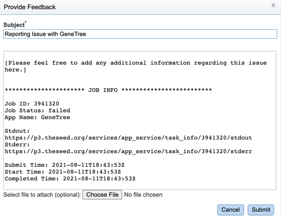

4\.	A job that has been successfully completed can be viewed by clicking on the row and then clicking on the View icon in the vertical green bar. 

5\.	This will open a results page, consisting of a header describing the job and a list of output files, as shown below. The top box has the job ID number and gives pertinent information about the time it took to complete and the selected parameters. The lower table has a number of output files.  

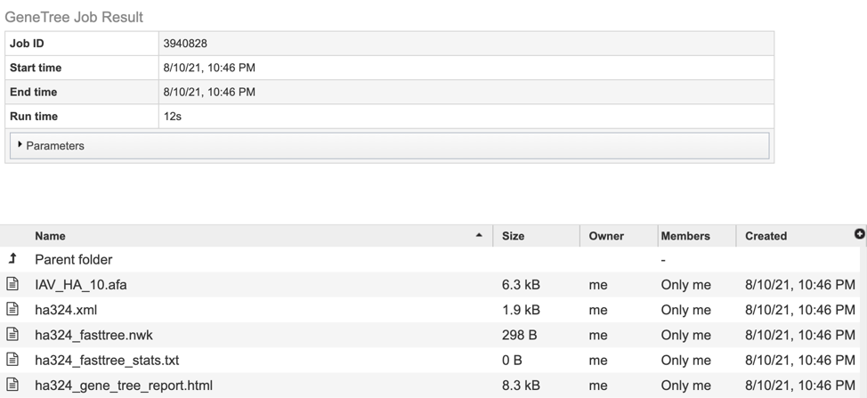

6\.	Click on the tree_report.html file. This will populate the vertical green bar with several icons for downloading the data, viewing it, deleting or renaming the file, copying or sharing with another BV-BRC user, moving it to a different directory, or changing the type tagged to the file. To examine the tree_report.html, click on the View icon. 

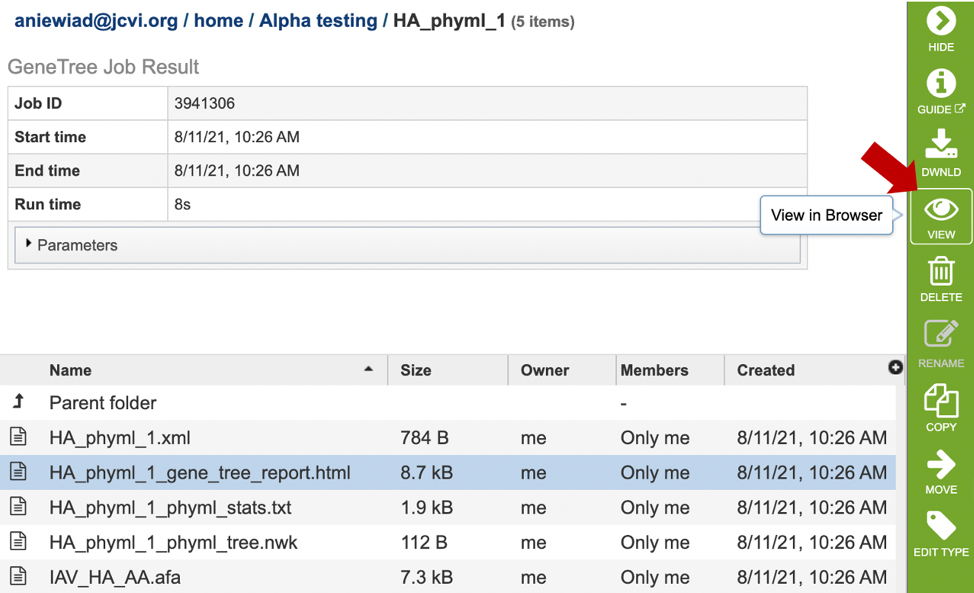

7\. This will re-write the page to show the html report, which can also be downloaded. The report shows the rendered tree at the top, followed by the tree statistics. 

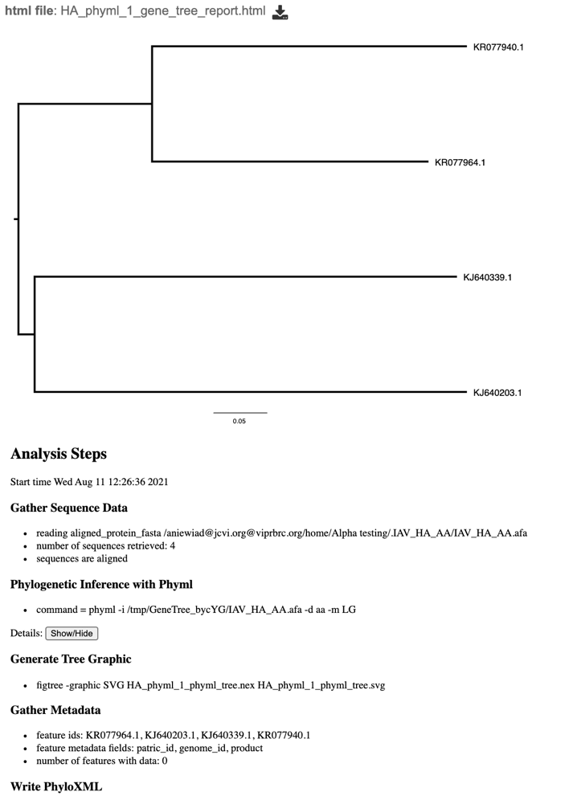

8\.	Click on the row that contains the “tree.nwk” file. This will populate the vertical green bar with several icons for downloading the tree, viewing it, as well as other options. Click on the “View” icon. 

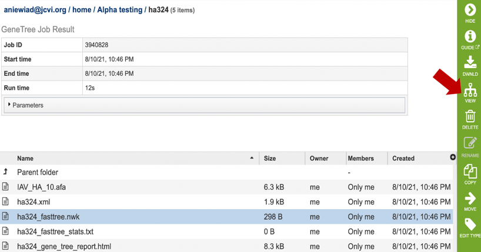

9\.	This will re-write the page to show the phylogenetic tree, which can also be downloaded. 

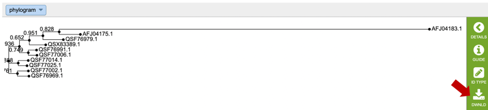

The service generates several files that are deposited in the Private Workspace in the designated Output Folder. These include:

* **.afa** – the alignment file in fasta format.
* **.xml** – PhyloXML tree format file with genome IDs as leaf nodes
* **.nwk** – Newick tree format file with genome IDs as leaf nodes.
* **stats.txt** – Text file containing the statistics on the tree. May include the number of genomes in the tree, the number of proteins aligned, the number of amino acids included in the alignment, the number of genes (CDS) in the alignment, and/or the number of nucleotides.
* **Tree_report.html** – Web viewable file displaying the rendered tree and tree statistics, including the number of genomes, proteins, and genes used in building the tree. This file will be created even if the tree cannot be built and will provide information to understand what went wrong. 

## References
1.	Price MN, Dehal PS, Arkin AP. FastTree: computing large minimum evolution trees with profiles instead of a distance matrix. Mol Biol Evol. 2009 Jul;26(7):1641-50. doi: 10.1093/molbev/msp077. Epub 2009 Apr 17. PMID: 19377059; PMCID: PMC2693737. 
2.	Price MN, Dehal PS, Arkin AP. FastTree 2--approximately maximum-likelihood trees for large alignments. PLoS One. 2010 Mar 10;5(3):e9490. doi: 10.1371/journal.pone.0009490. PMID: 20224823; PMCID: PMC2835736.
3.	Guindon, S. and Gascuel, O., (2003) Syst Biol. 52: 696-704  
4.	Stamatakis, A. et al. (2005) Bioinformatics 21: 456-463

