# Genome Alignment Service

DNA sequence alignment is a prerequisite to many comparative genomic analyses.
For longer genomic DNA, it helps to identify medium and large-scale rearrangements, as well as insertions and deletions. The BV-BRC Genome Alignment service uses progressiveMauve[1] which constructs positional homology multiple genome alignments to align regions conserved in subsets of the genomes.  The service uses genomes that are annotated within the BV-BRC resource (they can be private or public genomes), and up to 20 genomes can be compared.

The code used in the BV-BRC service can be found here:
https://github.com/PATRIC3/p3_mauve

## Submitting the Genome Alignment job

1.	Click on the Services tab at the top of the page, and then click on Fastq Utilities. 
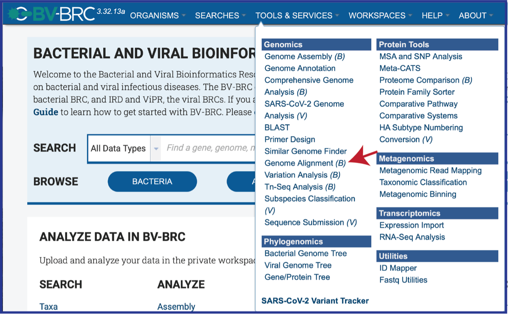

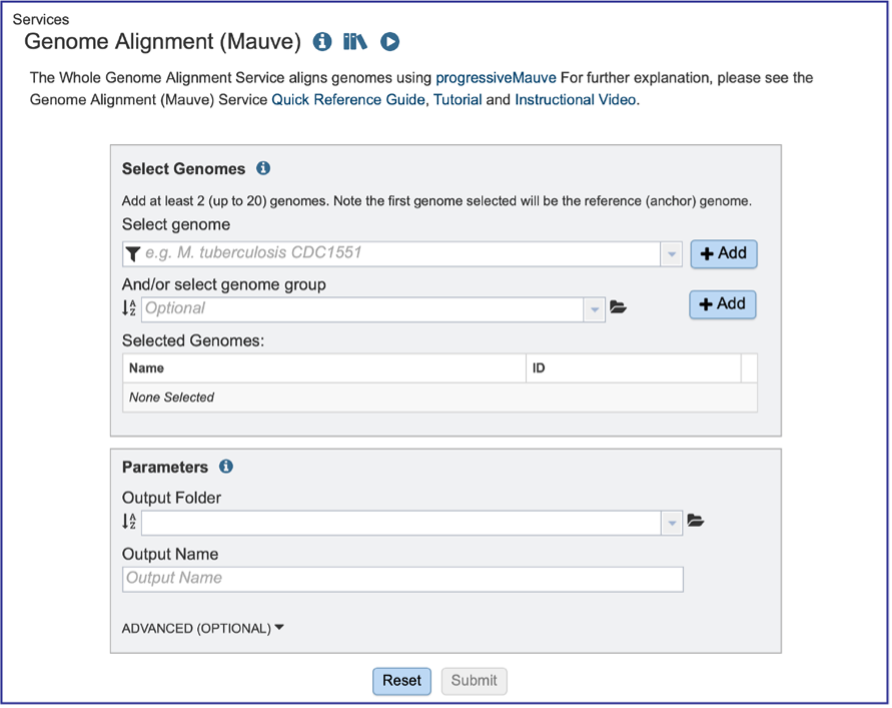

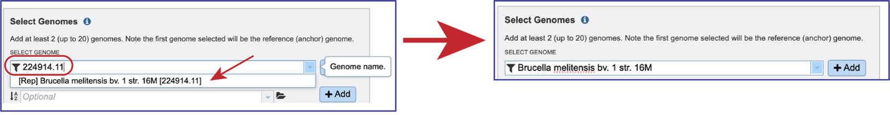

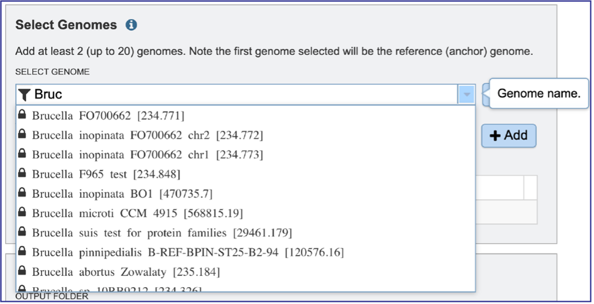

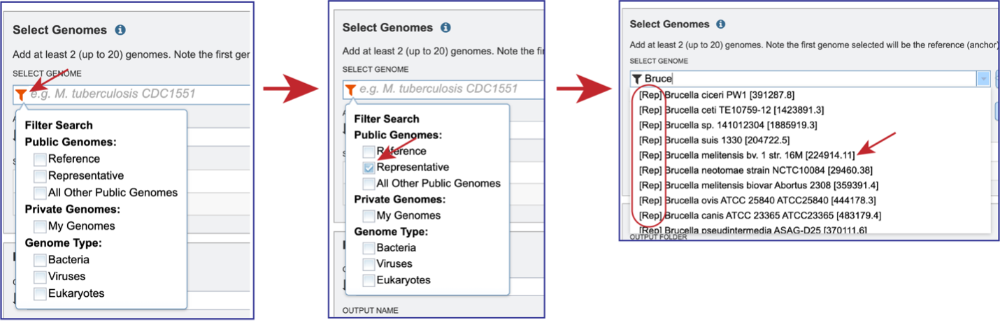

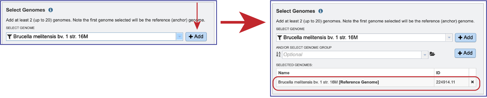

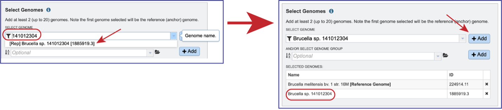

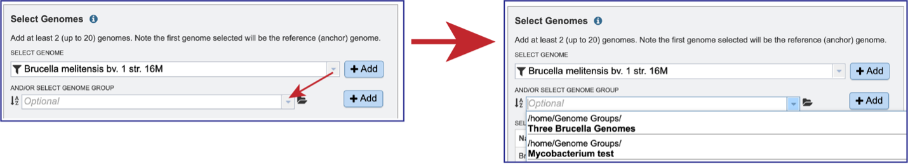

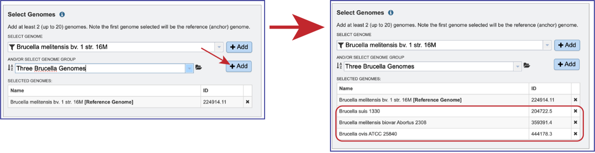

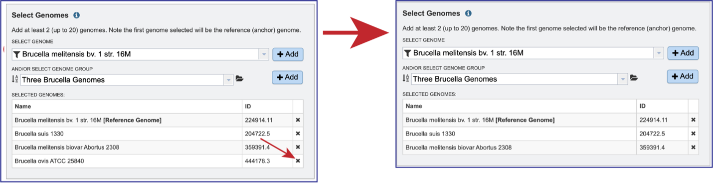

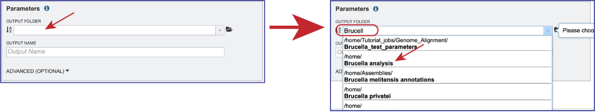

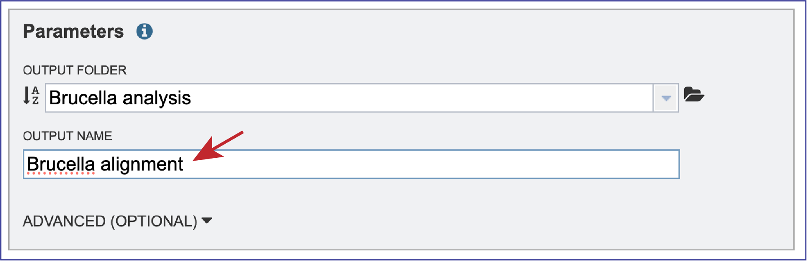

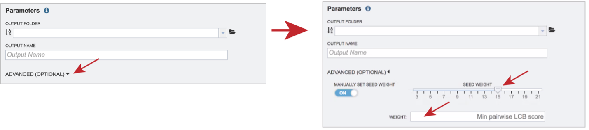

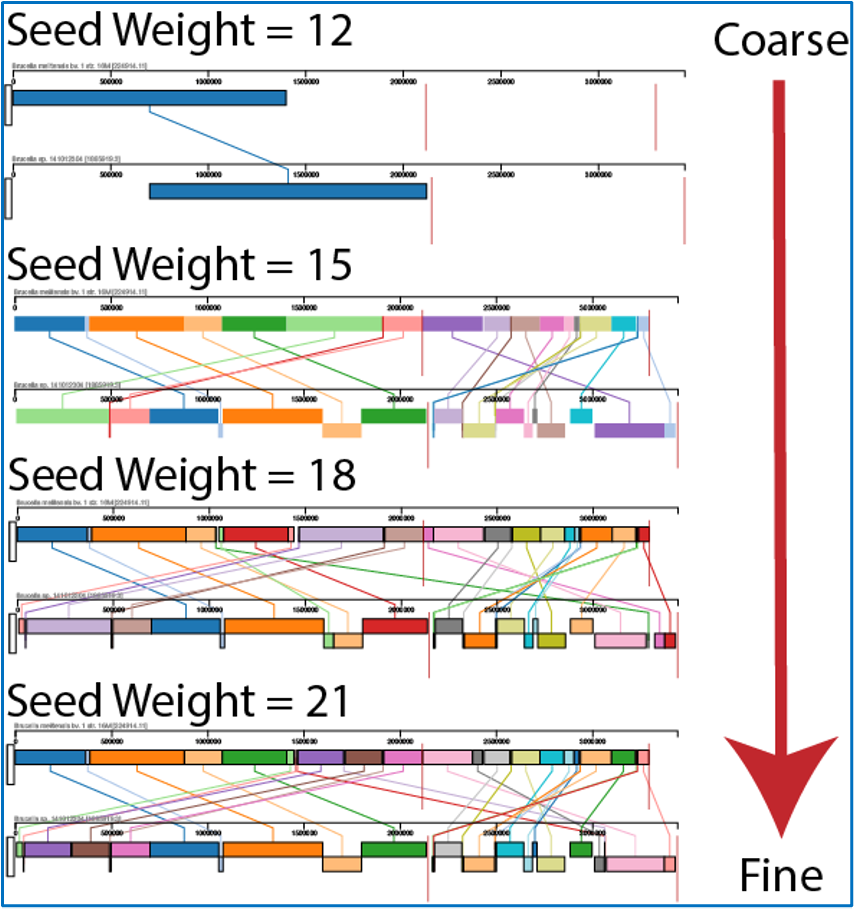

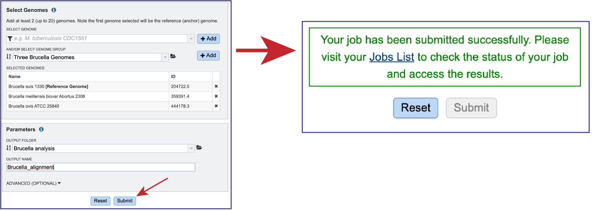

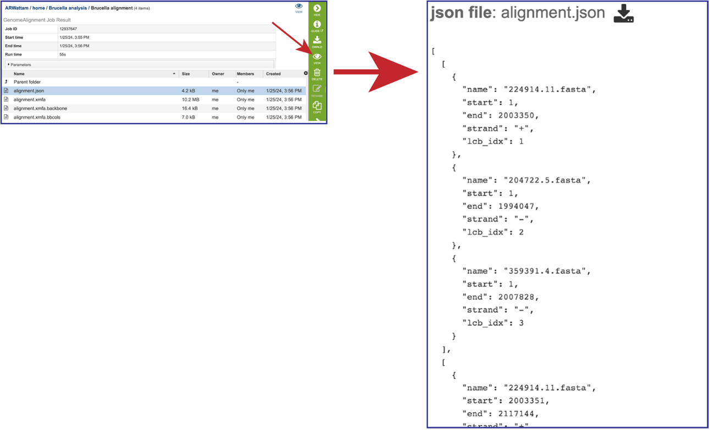

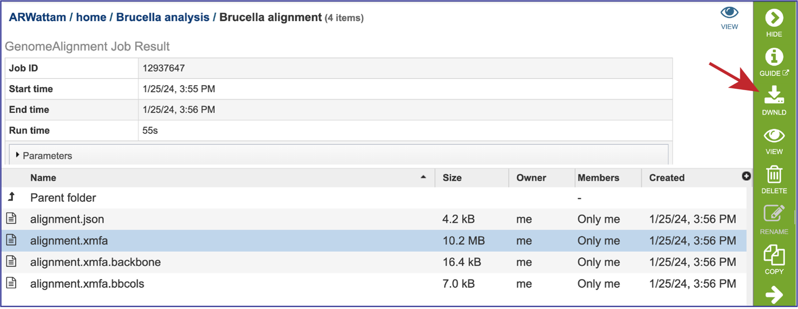

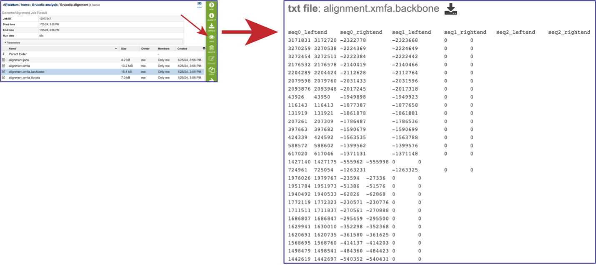

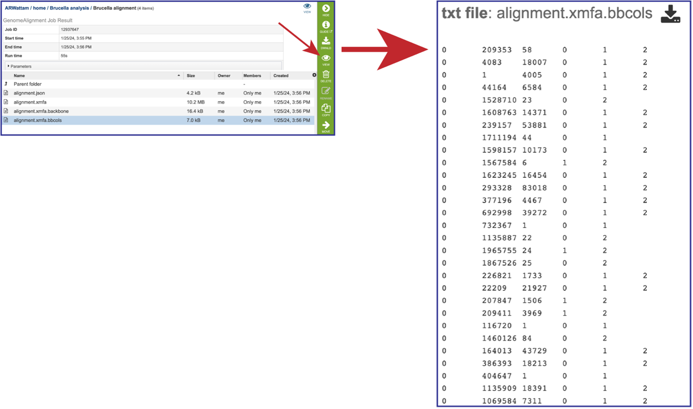

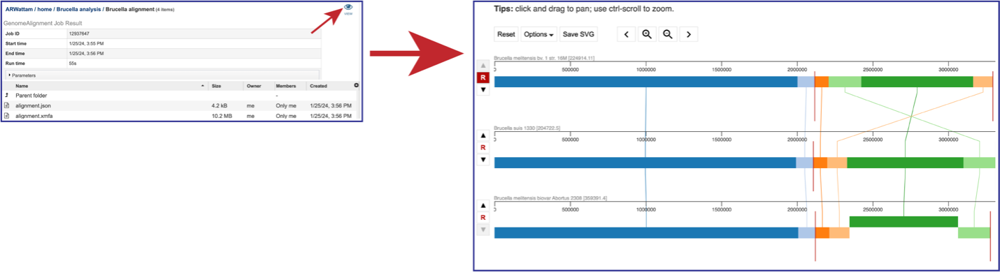

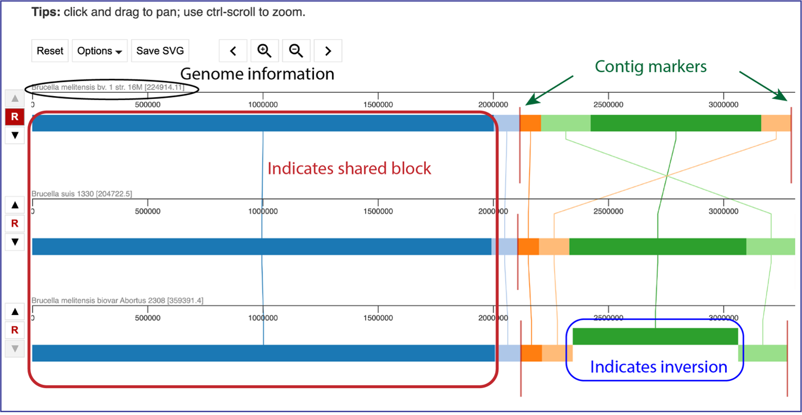

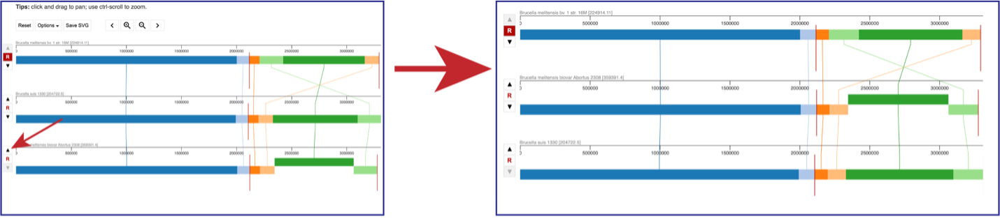

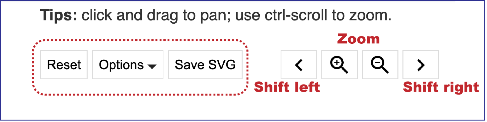

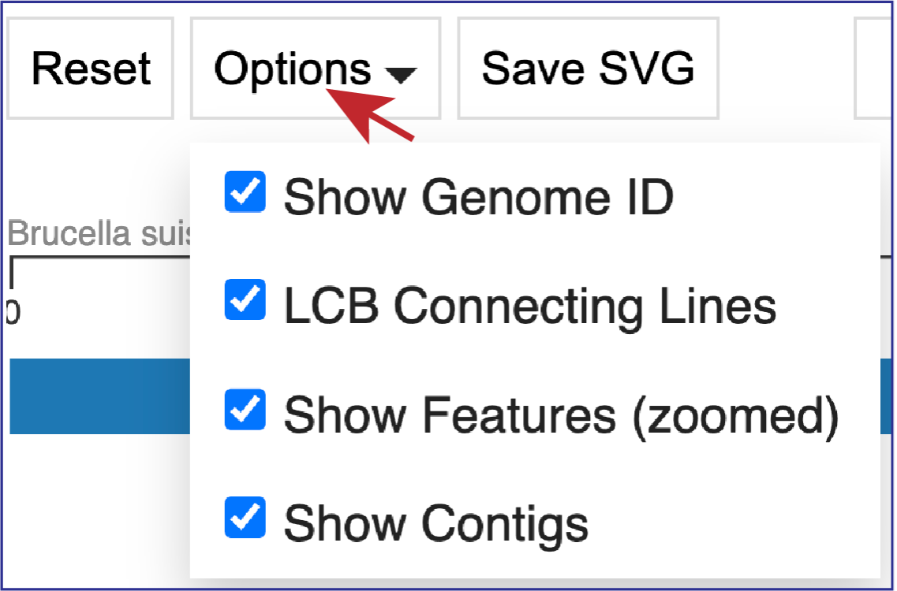

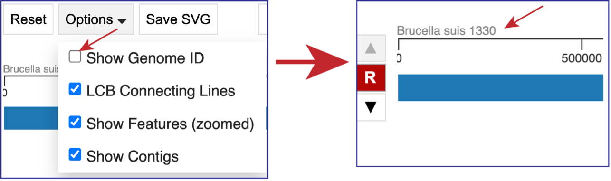

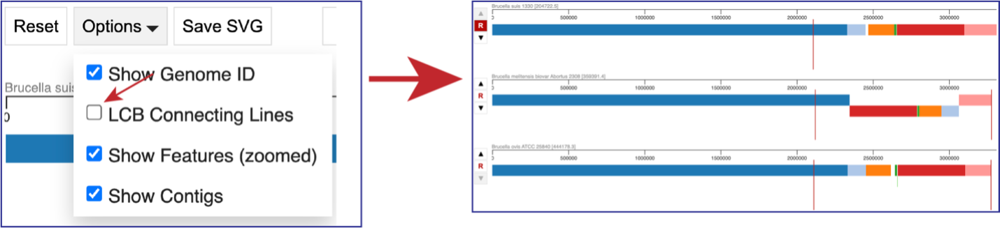

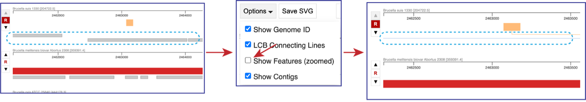

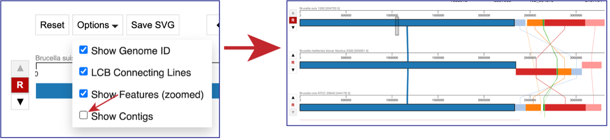

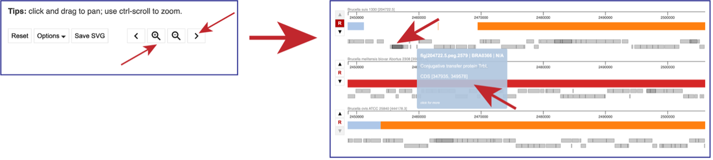

