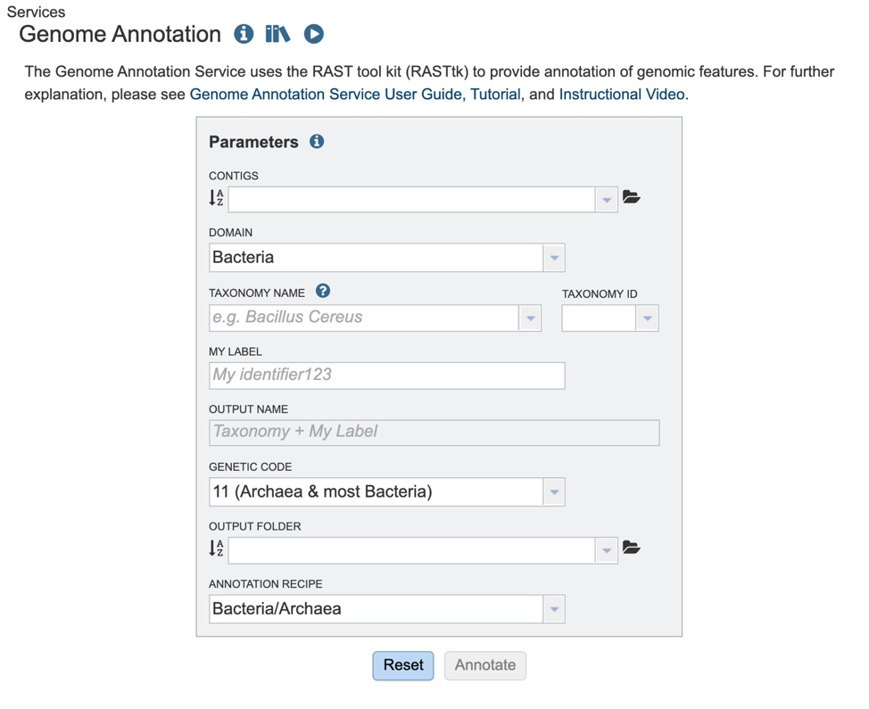
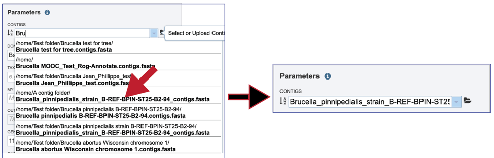
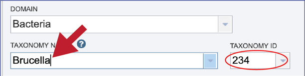
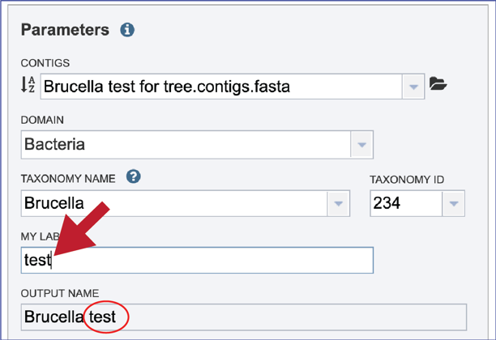
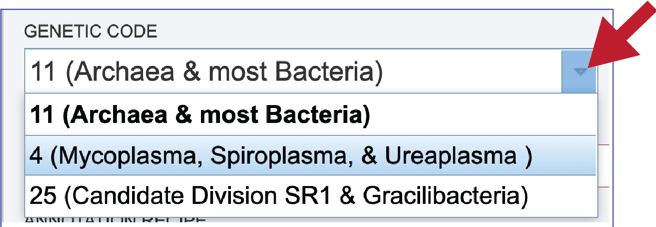
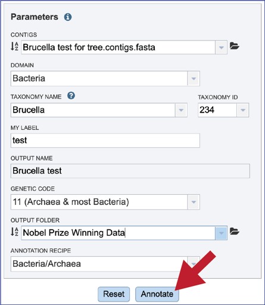

# Annotating a genome in BV-BRC

Genome annotation is the process of identifying functional elements along the sequence of a genome.  In 2008, the RAST server (Rapid Annotation using Subsystem Technology) was developed to annotate microbial genomes1. It works by projecting manually curated gene annotations from the SEED database onto newly submitted genomes2,3. The key to the consistency and accuracy of the RAST algorithm has been the carefully structured annotation data in the SEED, which are organized into subsystems (sets of logically related functional roles2). RAST has become one of the most popular sources for consistent and accurate annotations for microbial genomes. 

The annotation service available in PATRIC4 and BV-BRC uses a modular, updated version of RAST that is called the RAST toolkit (RASTtk)5, which is depicted above. It includes algorithms that were developed by the RAST team5 and some that were developed by others and incorporated into the overall pipeline (seen in red in the figure above). tRNAscan-SE6 is used to call the tRNA genes.  BLASTN7 is used to identify repeat regions within the genome, and tools by Croucher8 are used to identify Streptococcus repeat regions.  After repeat regions are identified, Prodigal9, followed by Glimmer10, are used to call coding sequences (CDS). Antimicrobial resistance is projected for a select group of genera based on a Adaboost machine learning11, followed by an initial protein annotation event that involves taking every protein called in a genome and using BLAT12 and BLASTP13 to identify CDSs that have homology to proteins in specialty databases.  Possible virulence factors are identified by blasting against a database containing proteins collected from the Virulence Factor Database14, Violins15, and a special curation effort by the PATRIC team6. Genes with homology to those identified as being involved in antimicrobial resistance are BLATed against proteins from the Comprehensive Antibiotic Resistance Database16, the National Database of Antibiotic Resistant Organisms (NDARO - https://www.ncbi.nlm.nih.gov/pathogens/antimicrobial-resistance/), the Antibiotic Resistance Database (ARDB)17 and a special curation of relevant proteins by PATRIC curators18.  Genes with homology to transporters are identified by searching against proteins from the Transporter Classification Database (TCDB)19, and those similar to genes that have been identified as potential drug targets by comparison to proteins from DrugBank20 and the Therapeutic Target Database (TTD)21.  Protein families22 are assigned, and then hypotheticals being identified.  All proteins are then mapped to subsystems2,3.  PubMLST (www.pubmlst.org) is used to assign sequence types, and then PhiSpy23 is used to find prophages in bacterial genomes.

Every bacterial or archaeal genome annotated in BV-BRC, either public or private, are annotated with this pipeline, and many of the other services (ex. Phylogenetic tree, Genome Alignment, Protein Family Sorter, Comparative Pathway Viewer, Similar Genome Finder) rely of these annotations. A recent update is the inclusion of bacteriophage genome annotation pipeline(PHANOTATE)24,25, which opens up the same tools to bacteriophage researchers.  The source code for RASTtk is available on Github (https://github.com/SEEDtk/RASTtk), as is the source code for PHANOTATE (https://github.com/deprekate/PHANOTATE). 

