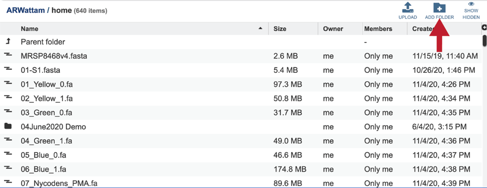
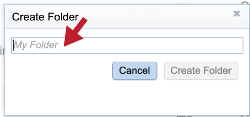
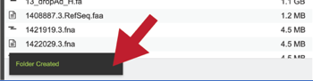
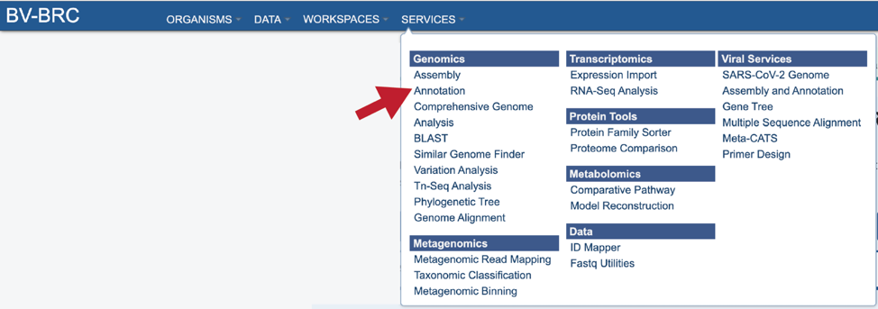
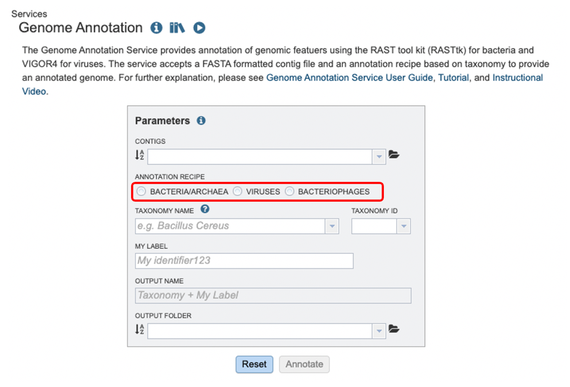
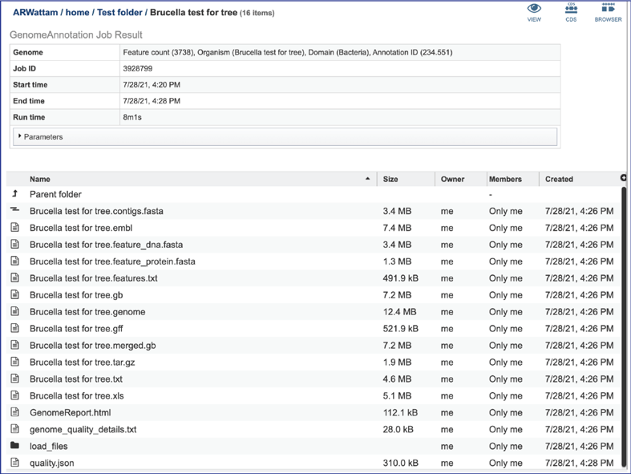

# Genome Annotation Service

Genome annotation is the process of identifying functional elements along the sequence of a genome.  The Genome Annotation Service in BV-BRC uses the RAST tool kit (RASTtk)[1] to annotate genomic features in bacteria, the Viral Genome ORF Reader (VIGOR4)[2] to annotate viruses, and PHANOTATE[3,4] to annotate bacteriophages. All public genomes in BV-BRC have been consistently annotated with these services. Researchers can also submit their own private genome to the annotation service, where it will be deposited into their private workspace for their perusal and comparison with other BV-BRC genomes using BV-BRC analysis tools and services, e.g., Phylogenetic Tree, Genome Alignment, Protein Family Sorter, Comparative Pathway Viewer, Similar Genome Finder. 

## RAST Annotation of Bacteria and Archaea
In 2008, the RAST server (Rapid Annotation using Subsystem Technology) was developed to annotate microbial genomes1. It works by projecting manually curated gene annotations from the SEED database onto newly submitted genomes[2,3]. The key to the consistency and accuracy of the RAST algorithm has been the carefully structured annotation data in the SEED, which are organized into subsystems (sets of logically related functional roles)[2]. RAST has become one of the most popular sources for consistent and accurate annotations for microbial genomes.  

*Figure 1. Steps in the Bacteria/Archaea annotation pipeline using RASTtk.*

The annotation service available in BV-BRC (and PATRIC[4])uses a modular, updated version of RAST that is called the RAST toolkit (RASTtk)[5], which is depicted above. It includes algorithms that were developed by the RAST team5 and some that were developed by others and incorporated into the overall pipeline (seen in red in the figure above). tRNAscan-SE[6] is used to call the tRNA genes.  BLASTN[7] is used to identify repeat regions within the genome, and tools by Croucher[8] are used to identify *Streptococcus* repeat regions.  After repeat regions are identified, Prodigal[9], followed by Glimmer[10], are used to call coding sequences (CDS). Antimicrobial resistance is projected for a select group of genera based on a Adaboost machine learning[11], followed by an initial protein annotation event that involves taking every protein called in a genome and using BLAT[12] and BLASTP[13] to identify CDSs that have homology to proteins in specialty databases.  Possible virulence factors are identified by blasting against a database containing proteins collected from the Virulence Factor Database[14], Violins[15], and a special curation effort by the BV-BRC team[6]. Genes with homology to those identified as being involved in antimicrobial resistance are BLATed against proteins from the Comprehensive Antibiotic Resistance Database (CARD)[16], the National Database of Antibiotic Resistant Organisms (NDARO - https://www.ncbi.nlm.nih.gov/pathogens/antimicrobial-resistance/), the Antibiotic Resistance Database (ARDB)[17] and a special curation of relevant proteins by PATRIC curators[18].  Genes with homology to transporters are identified by searching against proteins from the Transporter Classification Database (TCDB)[19], and those similar to genes that have been identified as potential drug targets by comparison to proteins from DrugBank[20] and the Therapeutic Target Database (TTD)[21].  Protein families[22] are assigned, and then hypotheticals being identified.  All proteins are then mapped to subsystems[2,3].  PubMLST (www.pubmlst.org) is used to assign sequence types, and then PhiSpy[23] is used to find prophages in bacterial genomes.

The source code for RASTtk is available on Github (https://github.com/SEEDtk/RASTtk). 

## VIGOR4 Annotation of Viruses
VIGOR4 (Viral Genome ORF Reader) is a Java application to predict protein sequences encoded in viral genomes developed by the J Craig Venter Institute (JCVI). VIGOR4 determines the protein coding sequences by sequence similarity searching against curated viral protein databases. VIGOR4 uses the VIGOR_DB project which currently has databases for the following viruses:
* Influenza (A & B for human, avian, and swine, and C for human)
* SARS-CoV-2
* West Nile Virus
* Zika Virus
* Chikungunya Virus
* Eastern Equine Encephalitis Virus
* Respiratory Syncytial Virus
* Rotavirus
* Enterovirus
* Lassa Mammarenavirus

For other viruses, the original GenBank annotations are propagated. The source code for VIGOR4 is available on GitHub (https://github.com/JCVenterInstitute/VIGOR4).

## PHANOTATE Annotation of Bacteriophages

BV-BRC also provides a bacteriophage genome annotation pipeline(PHANOTATE)[3,4], depicted below.  Use of this pipeline opens up the same tools to bacteriophage researchers that bacteria/archaea researchers can use. The source code for PHANOTATE is available on GitHub (https://github.com/deprekate/PHANOTATE). 

*Figure 1b. Steps in the bacteriophage annotation pipeline using PHANOTATE.*

## Creating a folder to hold the annotation job and related data

1. It is always good practice to create a folder to keep the results from a particular experiment or project in order.  To create a new folder, go to the Workspaces tab and click on home. 

2. This will open the home directory on your workspace.  To create a new folder, click on the Add Folder icon at the top right of the table. 

3. This will open a pop-up window.  Note that the Create Folder button is greyed out.  Type the desired name in the text box. 

4. Once the name is entered, the Create Folder icon will turn blue.  To create the folder, click on that button. 

5. The pop-up window will disappear.  At the button left of the page you will see a temporal message indicating that the folder was successfully created. 

## Locating the Annotation Service App

1.	At the top of any BV-BRC page, find the Services tab. 

2.	In the drop-down box, underneath Genomics, click on Annotation. 

3.	This will open up the Annotation Service landing page. 

*Note:* The annotation recipe is chosen based on the user’s choice of microorganism: Bacteria/Archaea, Viruses, or Bacteriophages. A selection for microorganism *must* be made, or the annotation job may fail.

## Selecting a contig file for annotation

The starting point for any annotation is an assembly, which produces contigs.  A contig (from the word "contiguous") is a series of overlapping DNA sequences used to make a physical map that reconstructs the original DNA sequence of a chromosome or a region of a chromosome. It is a stretch of DNA sequence encoded as A, G, C, T or N, typically ending in fasta of fa.  The first line of a contig file beings with “ >", followed by information on the contig.  The second and subsequent lines contain the sequences. 

Contigs  must be submitted to the annotation service. Submitting a read file will not work.  Researchers can upload a contig file that was generated in BV-BRC, or one that they have assembled independently.  

1. If an assembly was generated in BV-BRC (or previously in PATRIC), the contigs can be selected by clicking on the down arrow at the end of the text box.  This will show the contig files that are available. 

2. If the name is not easily seen, begin typing the name in the text box.  The search function will start looking for names that match the text that is entered. 

3. Clicking on the appropriate name will fill the text box.  

4. If an assembly has been generated outside of BV-BRC, click on the folder at the end of the text box. If you want to upload data directly to your home directory, click on the icon with the arrow pointing up. This opens up a pop-up window where the files for upload can be selected. Click on the icon with the arrow pointing up. 

5. This opens a new window where the file you want to upload can be selected. Click on the “Select File” in the blue bar. 

6. This will open a window that allows you to choose files that are stored on your computer. Select the file where you stored the contig file on your computer and click “Open”. 

7. Once selected, it will autofill the name of the file. Click on the Start Upload button. 

8. This will autofill the name of the document into the text box. This should be a quick process as contig files are generally small.  

9. Progress of the upload can be seen in the Uploads information bar at the bottom of every BV-BRC page.  The three columns show completed jobs (first column), jobs in progress (second), and the percent completion of the jobs in progress (third).  Wait until the upload is complete prior to submitting the job. 

10. You can also navigate to a desired folder. Use the scroll bar at the left of the pop-up window to see all the data in your directory.  When the desired folder is found, click on it. This will open that directory in the window, where you can use the upload icon to upload data directly to the selected folder. 

## Annotation Parameters

1. Annotation parameters must be selected next.  BV-BRC provides annotation for Bacteria, Archaea and Bacteriophages.  Bacteria and Archaea are annotated using the RASTtk [6] pipeline. Bacteriophage genomes are annotated using the PHANOTATE [26] pipeline. Viruses are annotated with VIGOR4 To select a particular annotation strategy from one of those taxa, click on the down arrow at the end of the text box. Bacteriophages must be annotated using the Virus selection. 

2. The taxonomic name must next be selected.  Begin typing in the lowest ranked taxonomic name known for the sequenced isolate.  For bacterial, try to get to Genus, if possible, so that the annotation will contain two types of protein families; global (cross-genus) and local (within genus) [23].  Once typing begins, a drop-down box will start showing taxonomic names that match the text entered.  

3. Click on the most appropriate name, which will autofill the text box and also the corresponding Taxonomy ID.  If the Taxonomy ID is known, that can be filled in first and the matching taxonomic name will be autofilled.  BV-BRC provides two different version of protein families, which are called  PATtyFams [23]. If a taxonomic level above Genus is selected, the annotation will only have global protein families (PGFams) assigned.  If a genus or species is selected, the annotation will include both PGFams, and the local protein families (PLFams), which are genus specific. 

4. Give the genome a unique name by entering text in the box underneath My Label.  The name that is entered will appear in the Output Name in the lowest text box. 

5. An output folder must be selected for the assembly job.  Typing the name of the folder in the text box underneath the words Output Folder will show a drop-down box that shows close hits to the name.  Clicking on the arrow at the end of the box will open a drop-down box that shows the most recently created folders.  To find a previously created folder that is not seen in the drop-down box, click on the folder icon at the end of the text box.  This will open a pop-up window that shows all the previously created folder, then follow the instructions at the top of this tutorial.  

6. Once the input data and the parameters have been selected, the Submit button at the bottom of the page will turn blue.  The annotation job will be submitted once this button is clicked. Once submitted, the job will enter the queue.  You can check the status of your job by clicking on the Jobs monitor at the lower right. 

## Finding the completed Annotation job 

1. There are two places to access a completed job in BV-BRC.  Clicking on the Jobs icon at the bottom right of any page will open the list of jobs that have been submitted. 

2. A complete list of all completed jobs will appear from most recent to the very first job ever submitted.  Clicking on any of the column heads will resort the page to show the results in that order. 

3. Clicking on an individual job or row will show possible downstream functions, which appear as icons, in the vertical green bar to the right of the list.  Clicking on the View icon will rewrite the page to show the results of the selected job. 

4. The files produced by the specific job will be shown on the Jobs results page.  As with the Jobs page, clicking on an individual row will populate the vertical green bar with possible action icons, like viewing or downloading the data. 

5. Completed jobs can also be access through the workspace, which you can access by clicking on the Workspaces tab, which is at the top of any BV-BRC page. 

6. This will open a drop-down box for the workspace.  To view the home workspace, click on “home.” 

7. This will rewrite the page to show the home directory. Scrolling down the page will show the files and folders in the workspace. 

8. If the job is in a particular folder, that can be opened by double clicking on the row that has the job. 

9. This rewrites the page to show the data in that particular folder.  Completed jobs are indicated by a checkered flag in the first column.   The completed job can be accessed by double clicking on that row. 

10.	This will rewrite the page to show the files produced by the completed job.  As with the Jobs page, clicking on an individual row will populate the vertical green bar with possible action icons, like viewing or downloading the data. 

## Annotation job results

1. Any job run in the BV-BRC contains a number of files, as well as information about the submitted job.  To view the input parameters that were selected when the job was submitted, click on the arrow that precedes the word “**Parameters**.” 

2. This will open a drop-down box that shows the parameters.  This box can be closed by clicking on the same arrow. 

3. The **contigs.fasta** contains the assembled contigs of the genome in DNA FASTA format. 

4. The file ending in **.embl** contains an EMBL dump of the annotated genome. 

5. The **feature_dna.fasta** file contains all the feature sequences of the genome in DNA FASTA format. 

6. The **feature_protein.fasta** contains all the protein sequences of the genome in protein FASTA format. 

7. The **features.txt** is a tab-delimited text file listing all the features of the genome. For each feature, it contains the BV-BRC ID, the location string, the feature type, the functional assignment, any alternated IDs found, and (for protein-coding genes) the protein MD5 [28] checksum. 

8. The **gb** file contains the annotated genome in GenBank format. 

9. The **genome** file contains a special “Genome Typed Object (GTO)” JSON-format file that encapsulates all the data from the annotated genome. 

10. The **gff** lists all the features of the genome in General Feature Format. 

11.	The **merged.gb** is a GenBank file where the individual contigs are each included as a GenBank fasta record under a single locus. 

12.	The **tar.gz** file is a zipped file that contains all the information about the annotation job. 

13.	The text, or **txt** file shows the nucleotide and protein sequence of all the annotated genes. 

14.	The *xls* is an excel file that shows the nucleotide and protein sequence of all the annotated genes. 

15.	The **genome_quality_details.txt** file shows some of the quality scores seen in the GenomeReport.html, and a list of the genes in both the newly annotated and reference genomes, and the number of copies of this gene in each. 

16.	The **Load** files folders contains all the json files related to the annotation job. 

17. The **quality.json** file has the same information in json format. 

## Genome Report

Genome quality analysis is automatically performed when using the BV-BRC Metagenomic Binning Service or Genome Annotation. The genome quality tools look at the functional roles present in an annotated genome to determine if the genome looks correct. Two separate mechanisms are used to predict the number of times each gene should be found in the genome. A role is good if it occurs the predicted number of times; otherwise it is problematic.

The first quality tool (EvalG) checks the completeness and contamination of the genome using a re-implementation of the CheckM [29] algorithm. EvalG identifies universal genes that are expected to occur exactly once in all genomes of a particular taxonomic grouping. Missing genes indicate the genome is less complete; extra genes indicate the genome may be contaminated.

The second quality tool (EvalCon) checks the consistency of the genome annotation. Over 1300 genes that have a predictable relationship to other genes were identified by a machine learning process. EvalCon determines how many instances of each gene are expected given the list of other genes in the genome. If a gene in the genome is unexpected, or an expected gene is missing, this is considered coarse inconsistency. If a gene occurs a different number of times than predicted, this is fine inconsistency.

The four numbers –completeness, contamination, coarse consistency, and fine consistency– express measures of the quality of the genome. EvalG and EvalCon tell us not only the numbers, but also identify the problematic genes that occur an unexpected number of times. The preceding are summarized in the Quality Report web page. The report is divided into three sections– the Summary Section that describes the genome itself, the Problematic Roles Report that lists the genes whose expected and actual occurrence numbers do not match, and the Contig Report that lists the contigs containing problematic roles.

1. To view the **GenomeReport.html**, click on its row and then on the View icon.  

2. This will reload the page to show the Genome Report. The top of the page is the summary section, which shows the scores achieved by the binned genome. 

3. A yellow color indicates a poor scoring value. 

4. The Problematic Roles Report lists the genes whose expected and actual occurrence numbers do not match.  It shows the gene, or role, what would be expected in a normal genome (**Predicted count**), the number of genes found in the binned genome (**Annotated count**), the link to those genes (**Feature link**), and more information about the genes (**Comment**). 

5. Clicking on the Feature link will open a new table that shows the problematic genes in the binned genome. 

6. To view the problematic gene, click on the gene ID in the Comment section.  This will open a new tab that takes you to the landing page of that particular gene.  This page has several tabs, but it open on the Compare Region View, which shows the neighborhood around the problematic gene (which will be colored red). 

7. The Comment section also contains a link to the contig that has the problematic gene.  Clicking on the contig ID will open a new tab that lists the genes on that contig. 

8. The final section is the Contig Report, which lists the contigs containing problematic genes. This table has four columns, including the **Contig Name**, the **Length** of the contig, the number of **Good Features** (or genes) on that contig, and link to a table with those problematic genes (**Feature link**). 

## Viewing the Annotated Genome

Private genomes that have been annotated in BV-BRC (or previously in PATRIC) can be viewed directly from the annotation job, or through the workspace, or by using the Global Search function.

### Viewing the genome from the job report

1. At the top right of the annotation job there are three icons that provide a direct link to information about the genome.  Clicking on the View icon will open a new tab that contains the Genome landing page, with all the information about the newly annotated genome. 

2. Clicking on the CDS icon will open a new tab that contains a table with all of the genes that have been annotated in the genome. 

3. Clicking on the ##Browser## icon will open a new tab that contains the genome browser, showing all the genes and their orientation in the genome. 

### Finding the genome using the workspace

1. Private genomes can be located through the workspace.  Click on the Workspace tab at the top of any page.  This will open a drop-down box.  Click on My Genomes at the upper right of this box. 

1. This will open a table that contains all of the genomes that you have annotated.  The top of the table contains a text box that can be used to filter the data.  Enter the name, or the unique genome ID into this box and then hit return on your keyboard. 

3. This will filter the genomes to show those that match the text entered.  Clicking on the row that contains the correct genome will highlight the vertical green bar to the right with possible downstream functions.  Clicking on the **Genome** icon will open a new tab that has the Genome landing page for that genome. 

### Finding the genome using Global Search

1. The Global Search can be used to locate public and private data.  The name of the genome can be entered into the box, which can be found on the home page, and also at the top right of any other page. 

2. Entering the Genome ID, if known, will provide a more direct access to an individual genome.  Click return after entering. 

3. This will re-write the page to show the results of the search.  Clicking on the name under Genomes will re-write the page to show the landing page for that genome. 

## References

1. Aziz, R. K. et al. The RAST Server: rapid annotations using subsystems technology. BMC genomics 9, 75 (2008).
2.	https://github.com/JCVenterInstitute/VIGOR4. 
3. 	McNair, K. et al. in Bacteriophages 231-238 (Springer, 2018).
4. 	McNair, K., Zhou, C., Dinsdale, E. A., Souza, B. & Edwards, R. A. PHANOTATE: a novel approach to gene identification in phage genomes. Bioinformatics 35, 4537-4542 (2019).
3. Overbeek, R. et al. The subsystems approach to genome annotation and its use in the project to annotate 1000 genomes. Nucleic acids research 33, 5691-5702 (2005).
4. Overbeek, R. et al. The SEED and the Rapid Annotation of microbial genomes using Subsystems Technology (RAST).  42, D206-D214 (2013).
5. Davis, J. J. et al. The PATRIC Bioinformatics Resource Center: expanding data and analysis capabilities. Nucleic acids research 48, D606-D612 (2020).
6. Brettin, T. et al. RASTtk: a modular and extensible implementation of the RAST algorithm for building custom annotation pipelines and annotating batches of genomes. Scientific reports 5, 8365 (2015).
7. Mao, C. et al. Curation, integration and visualization of bacterial virulence factors in PATRIC. Bioinformatics 31, 252-258 (2015).
8. Ye, J., McGinnis, S. & Madden, T. L. BLAST: improvements for better sequence analysis. Nucleic acids research 34, W6-W9 (2006).
9. Croucher, N. J., Vernikos, G. S., Parkhill, J. & Bentley, S. D. Identification, variation and transcription of pneumococcal repeat sequences. BMC genomics 12, 1-13 (2011).
10. Hyatt, D. et al. Prodigal: prokaryotic gene recognition and translation initiation site identification. BMC bioinformatics 11, 1-11 (2010).
11.	Delcher, A. L., Bratke, K. A., Powers, E. C. & Salzberg, S. L. Identifying bacterial genes and endosymbiont DNA with Glimmer. Bioinformatics 23, 673-679 (2007).
12. Davis, J. J. et al. Antimicrobial resistance prediction in PATRIC and RAST. Scientific reports 6, 27930 (2016).
13.	Kent, W. J. BLAT—the BLAST-like alignment tool. Genome research 12, 656-664 (2002).
14.	Johnson, M. et al. NCBI BLAST: a better web interface. Nucleic acids research 36, W5-W9 (2008).
15.	Liu, B., Zheng, D., Jin, Q., Chen, L. & Yang, J. VFDB 2019: a comparative pathogenomic platform with an interactive web interface. Nucleic acids research 47, D687-D692 (2019).
16.	Xiang, Z. et al. VIOLIN: vaccine investigation and online information network. Nucleic acids research 36, D923-D928 (2007).
17.	Alcock, B. P. et al. CARD 2020: antibiotic resistome surveillance with the comprehensive antibiotic resistance database. Nucleic acids research 48, D517-D525 (2020).
18.	Liu, B. & Pop, M. ARDB—antibiotic resistance genes database. Nucleic acids research 37, D443-D447 (2009).
19.	Antonopoulos, D. A. et al. PATRIC as a unique resource for studying antimicrobial resistance. Briefings in bioinformatics (2017).
20.	Saier Jr, M. H. et al. The transporter classification database (TCDB): recent advances. Nucleic acids research 44, D372-D379 (2016).
21.	Wishart, D. S. et al. DrugBank 5.0: a major update to the DrugBank database for 2018. Nucleic acids research 46, D1074-D1082 (2018).
22.	Chen, X., Ji, Z. L. & Chen, Y. Z. TTD: therapeutic target database. Nucleic acids research 30, 412-415 (2002).
23.	Davis, J. J. et al. PATtyFams: Protein families for the microbial genomes in the PATRIC database.  7, 118 (2016).
24.	Akhter, S., Aziz, R. K. & Edwards, R. A. PhiSpy: a novel algorithm for finding prophages in bacterial genomes that combines similarity-and composition-based strategies. Nucleic acids research 40, e126-e126 (2012).
25.	McNair, K. et al. in Bacteriophages     231-238 (Springer, 2018).
26.	McNair, K., Zhou, C., Dinsdale, E. A., Souza, B. & Edwards, R. A. PHANOTATE: a novel approach to gene identification in phage genomes. Bioinformatics 35, 4537-4542 (2019).
27.	Osawa, S., Jukes, T. H., Watanabe, K. & Muto, A. Recent evidence for evolution of the genetic code. Microbiological reviews 56, 229-264 (1992).
28.	Rivest, R. & Dusse, S. (MIT Laboratory for Computer Science Cambridge, 1992).
29.	Parks, D. H., Imelfort, M., Skennerton, C. T., Hugenholtz, P. & Tyson, G. W. CheckM: assessing the quality of microbial genomes recovered from isolates, single cells, and metagenomes. Genome research 25, 1043-1055 (2015).