# Genome Annotation Service

*Revised 04 December 2024*

Genome annotation is the process of identifying functional elements along the sequence of a genome. The Genome Annotation Service in BV-BRC uses the RAST tool kit (RASTtk)[1] to annotate genomic features in bacteria and archael genomes, the Viral Genome ORF Reader (VIGOR4)[2,3] or Mat_peptide[4] to annotate viral genomes, and PHANOTATE[5,6] to annotate bacteriophage genomes. All public genomes in BV-BRC have been consistently annotated with these services. Researchers can also submit their own private genome to the annotation service, where it will be deposited into their private workspace for their perusal and comparison with other BV-BRC genomes using BV-BRC analysis tools and services, e.g., Phylogenetic Tree, Genome Alignment, Comparative Systems, Similar Genome Finder and others.

## RASTtk Annotation of Bacteria and Archaea
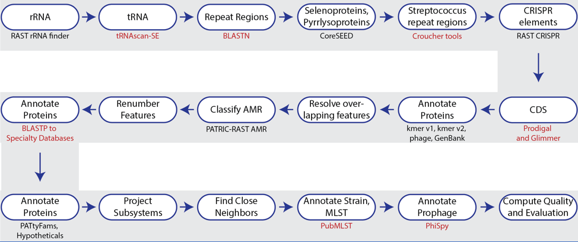

The bacterial and archaeal annotation service available in BV-BRC uses a modular, updated version of RAST[7]  called the RAST toolkit (RASTtk)[1]. It includes algorithms that were developed by the RAST team and some that were developed by others and incorporated into the overall pipeline (seen in red in the figure above). tRNAscan-SE[8] is used to call the tRNA genes. BLASTN[9] is used to identify repeat regions within the genome, and tools by Croucher[10] are used to identify *Streptococcus* repeat regions. After repeat regions are identified, Prodigal[11], followed by Glimmer[12], are used to call coding sequences (CDS). Antimicrobial resistance is projected for a select group of genera based on a Adaboost machine learning[13], followed by an initial protein annotation event that involves taking every protein called in a genome and using BLAT[14] and BLASTP[15] to identify CDSs that have homology to proteins in specialty databases. Possible virulence factors are identified by blasting against a database containing proteins collected from the Virulence Factor Database[15], Violins[17], and a special curation effort by the BV-BRC team[18]. Genes with homology to those identified as being involved in antimicrobial resistance are
BLATed against proteins from the Comprehensive Antibiotic Resistance Database (CARD)[19], the National Database of Antibiotic Resistant Organisms (NDARO https://www.ncbi.nlm.nih.gov/pathogens/antimicrobial-resistance/) and a special curation of relevant proteins by BV-BRC curators[20]. Genes with homology to transporters are identifed by searching against proteins from the Transporter Classification Database (TCDB)[21], and those similar to genes that have been identified as potential drug targets by comparison to proteins from DrugBank[22] and the Therapeutic Target Database (TTD)[23]. Protein families[24] are assigned, and then hypothetical proteins are identified. All proteins are then mapped to subsystems[25,26] when possible.  PubMLST[27] is used to assign sequence types, and then PhiSpy[28] is used to find prophages in bacterial genomes.

The source code for RASTtk is available on Github (https://github.com/SEEDtk/RASTtk). 

## VIGOR4 Annotation of Viruses
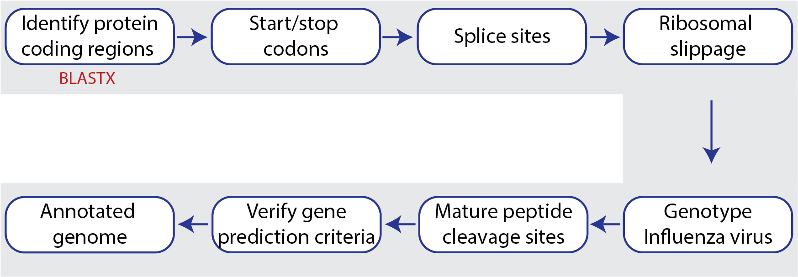

The Viral Genome ORF Reader, known as VIGOR4[2,3], is a Java application to predict protein sequences encoded in viral genomes.  The protein coding sequences are determined by sequence similarity searching against curated viral protein databases. VIGOR4 uses the VIGOR_DB project which currently has databases for the following viruses:
* Influenza (A & B for human, avian, and swine, and C for human)
* SARS-CoV-2, Sarbecovirus, Nobecovirus, Hibecovirus, Embecovirus, Merbecovirus, Wuhivirus
* West Nile Virus Lineage I/II, Zika Virus, Dengue Virus
* Chikungunya Virus
* Alphaviruses: Eastern Equine Encephalitis Virus, Venezuelan Equine Encephalitis Virus
* Respiratory Syncytial Virus
* Rotavirus A/B/C/F/G
* Enterovirus, Entovirus, Goukovirus, Horwuvirus, Hudivirus, Hudovirus, Ixovirus, Laulavirus, Lentinuvirus, Mobuvirus, Phasivirus, Pidchovirus, Rubodvirus, Tenuivirus, Uukuvirus, Wenrivirus
* Lassa Mammarenavirus, Antennavirus, Bandavirus, Reptarenavirus
* Hantaviridae, Nairoviridae, Peribunyaviridae, Phlebovirus
* Sapovirus
* Monkeypox Virus
* Beidivirus
* Feravirus, Hartmanivirus, Inshuvirus, Jonvirus, Sawastrivirus
* Coguvirus, Cicadellivirus, Orthophasmavirus

The source code for VIGOR4 is available on GitHub (https://github.com/JCVenterInstitute/VIGOR4).

## Mat_peptide Annotation of Viruses
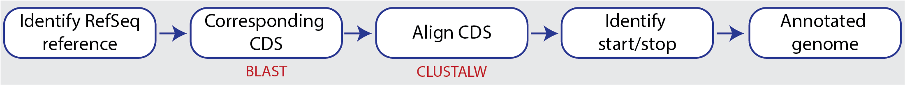

The Mat_peptide[4] pipeline is used to annotate 121 different species that are part of eight viral families (Arenaviridae, Caliciviridae, Coronaviridae, Flaviviridae, Hantaviridae, Phenuiviridae, Picornaviridae, Togaviridae) using pairwise alignment with reference sequences.  Mat_peptide calculates and transfers curated mature protein annotation positions from a reference to a target sequence,  This pipeline is deployed when an appropriate viral taxon that cannot be annotated by Vigor4 is submitted to the BV-BRC Annotation service.
The source code for Mat_peptide is available on GitHub (software at https://github.com/VirusBRC/vipr_mat_peptide).

## PHANOTATE Annotation of Bacteriophages
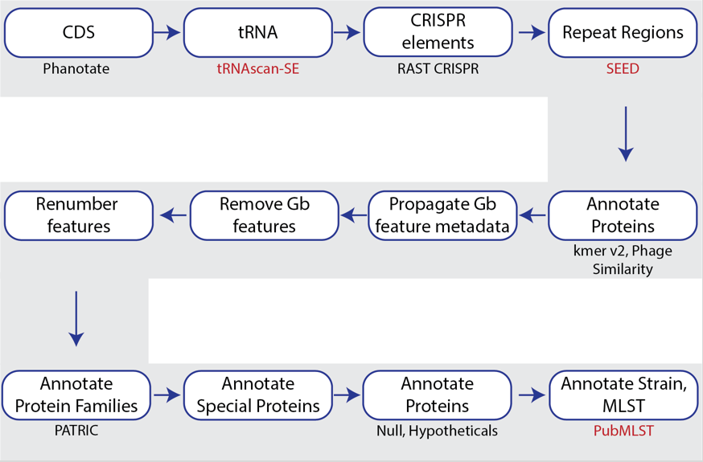

PHANOTATE is a bacteriophage genome annotation pipeline [5,6] that identifies open-reading frames and then performs sequence similarity searches to annotate proteins.
The source code for PHANOTATE is available on GitHub (https://github.com/deprekate/PHANOTATE).

## Locating the Annotation Service App
1.	At the top of any BV-BRC page, find the **Services** tab. 

2.	In the drop-down box, underneath **Genomics**, click on **Genome Annotation**. 
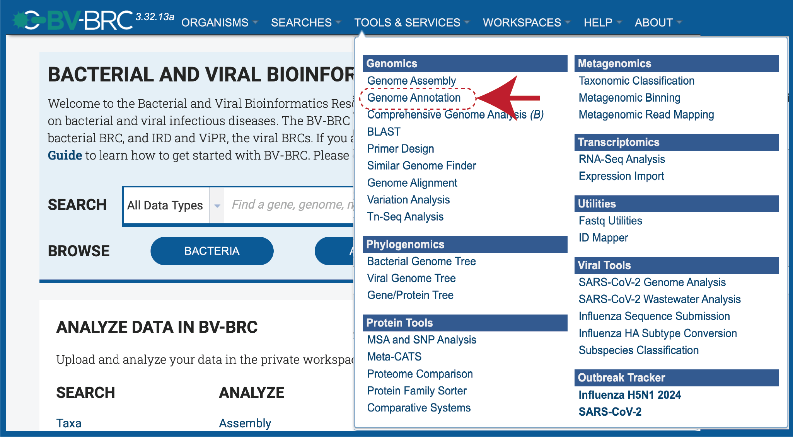

3.	This will open up the Annotation Service landing page. 
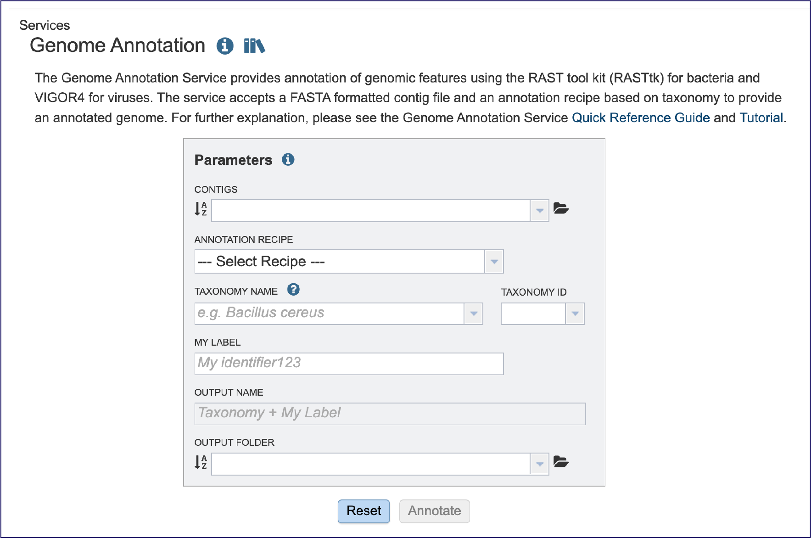

## Selecting a contig file for annotation
The starting point for any annotation is an assembly, which produces contigs.  A contig (from the word "contiguous") is a series of overlapping DNA sequences used to make a physical map that reconstructs the original DNA sequence of a chromosome or a region of a chromosome. It is a stretch of DNA sequence encoded as A, G, C, T or N, typically ending in fasta of fa.  The first line of a contig file beings with “ >", followed by information on the contig.  The second and subsequent line(s) contain the sequences. 
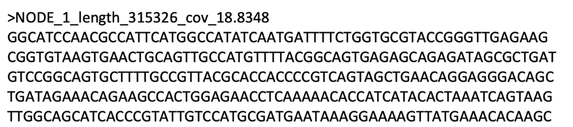

Contigs  must be submitted to the annotation service. **Submitting a read file will not work.**  Researchers can upload a contig file that was generated in BV-BRC, or one that they have assembled independently.  

1. If an assembly was generated in BV-BRC the contigs can be selected by clicking on the down arrow at the end of the text box.  This will show the contig files that are available. 
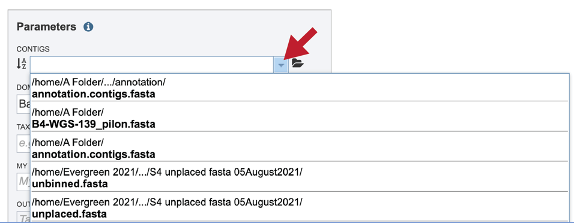

2. If the name is not easily seen, begin typing the name in the text box.  The search function will start looking for names that match the text that is entered.

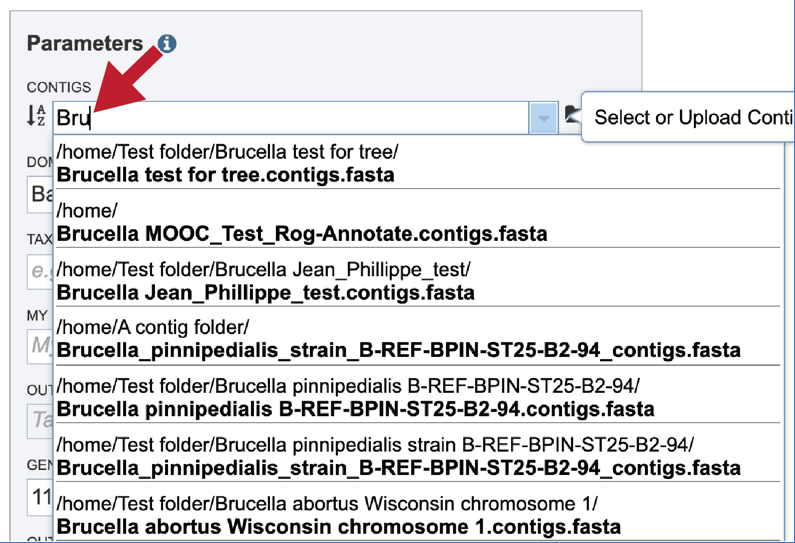

3. Clicking on the appropriate name will fill the text box.  
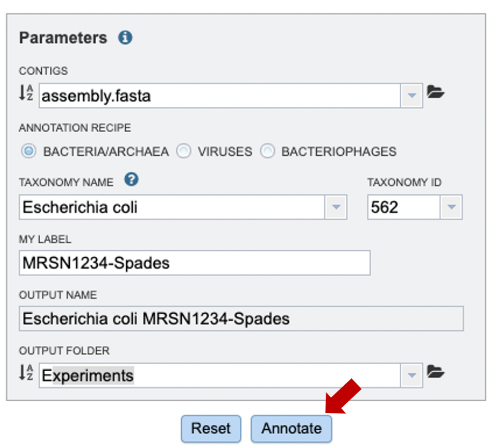

4. If an assembly has been generated outside of BV-BRC, click on the **Folder** at the end of the text box. If you want to upload data directly to your home directory, click on the icon with the arrow pointing up. This opens up a pop-up window where the files for upload can be selected. Click on the icon with the **arrow pointing up**. 
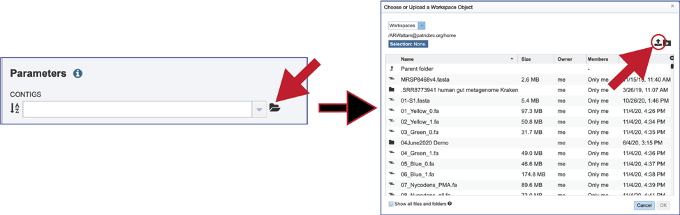

5. This opens a new window where the file you want to upload can be selected. Click on the **Select File** in the blue bar. 
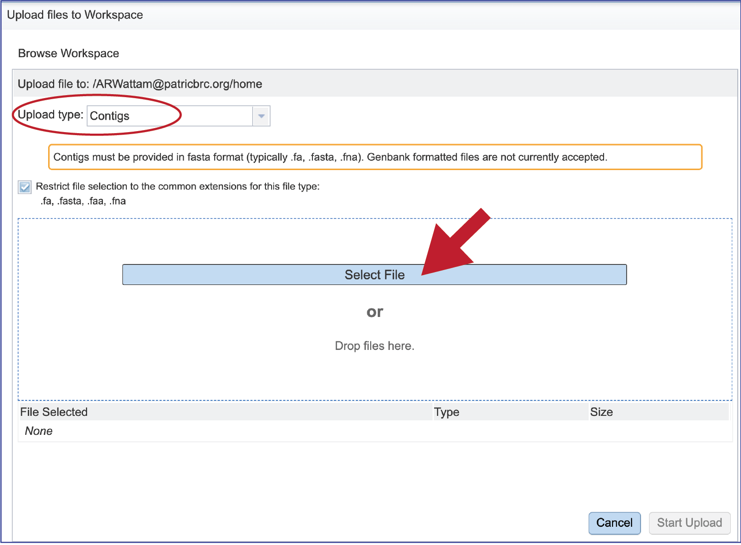

6. This will open a window that allows you to choose files that are stored on your computer. Select the file where you stored the contig file on your computer and click **Open**. 
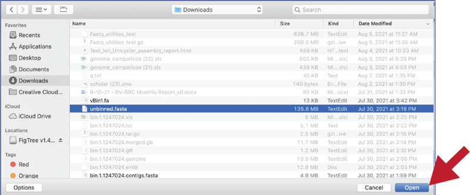

7. Once selected, it will autofill the name of the file. Click on the **Start Upload** button. 
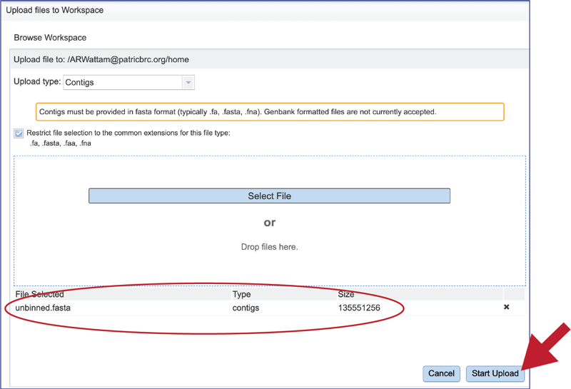

8. This will autofill the name of the document into the text box. This should be a quick process as contig files are generally small.

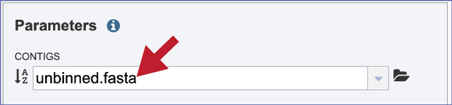

9. Progress of the upload can be seen in the **Uploads** information bar at the bottom of every BV-BRC page.  The three columns show completed jobs (first column), jobs in progress (second), and the percent completion of the jobs in progress (third).  Wait until the upload is complete prior to submitting the job. 

10. You can also navigate to a desired folder. Use the scroll bar at the left of the pop-up window to see all the data in your directory.  When the desired folder is found, click on it. This will open that directory in the window, where you can use the upload icon to upload data directly to the selected folder. 
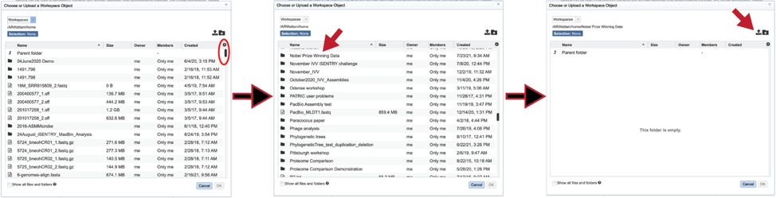

## Annotation Parameters
1.	Annotation parameters must be selected next. BV-BRC provides annotation for Bacteria, Archaea and Bacteriophages. Bacteria and Archaea are annotated using the RASTtk pipeline. Bacteriophage genomes are annotated using the PHANOTATE pipeline. Viruses are annotated with VIGOR4 or Mat_peptide.   To select a particular annotation strategy from one of those taxa, click on the check box preceding the correct strategy.

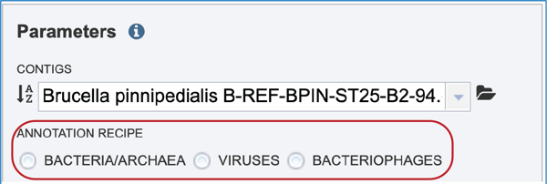

2. The taxonomic name must next be selected.  Begin typing in the lowest ranked taxonomic name known for the sequenced isolate.  For bacteria/archaea, try to get to Genus, if possible, so that the annotation will contain two types of protein families; global (cross-genus) and local (within genus)[24].  Once typing begins, a drop-down box will start showing taxonomic names that match the text entered.  
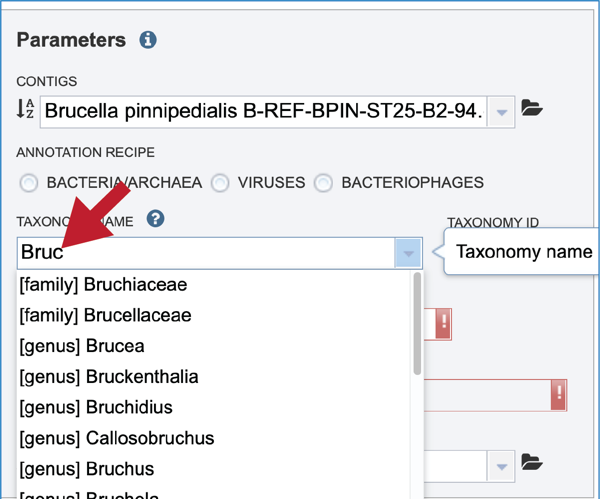

3. Click on the most appropriate name, which will autofill the text box and also the corresponding Taxonomy ID.  If the Taxonomy ID is known, that can be filled in first and the matching taxonomic name will be autofilled.  BV-BRC provides two different version of protein families, which are called  PATtyFams [24]. If a taxonomic level above Genus is selected, the annotation will only have global protein families (PGFams) assigned.  If a genus or species is selected, the annotation will include both PGFams, and the local protein families (PLFams), which are genus specific. 

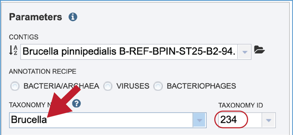

4. Give the genome a unique name by entering text in the box underneath **My Label**.  The name that is entered will appear in the **Output Name** in the lowest text box. 

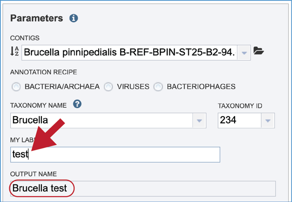

5. An output folder must be selected for the assembly job.  Typing the name of the folder in the text box underneath the words **Output Folder** will show a drop-down box that shows close hits to the name.  Clicking on the arrow at the end of the box will open a drop-down box that shows the most recently created folders.  To find a previously created folder that is not seen in the drop-down box, click on the folder icon at the end of the text box.  This will open a pop-up window that shows all the previously created folder, then follow the instructions at the top of this tutorial.  

6. Once the input data and the parameters have been selected, the **Submit** button at the bottom of the page will turn blue.  The annotation job will be submitted once this button is clicked. Once submitted, the job will enter the queue.  You can check the status of your job by clicking on the **Jobs** monitor at the lower right. 

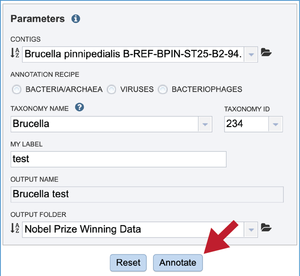

## Finding the completed Annotation job 
1. There are two places to access a completed job in BV-BRC.  Clicking on the **Jobs** icon at the bottom right of any page will open the list of jobs that have been submitted. 

2. A complete list of all completed jobs will appear from most recent to the very first job ever submitted.  Clicking on any of the column heads will resort the page to show the results in that order. 

3. Clicking on an individual job or row will show possible downstream functions, which appear as icons, in the vertical green bar to the right of the list.  Clicking on the View icon will rewrite the page to show the results of the selected job. 
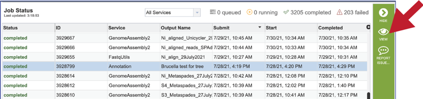

4. The files produced by the specific job will be shown on the Jobs results page.  As with the Jobs page, clicking on an individual row will populate the vertical green bar with possible action icons, like viewing or downloading the data. 

5. Completed jobs can also be access through the workspace, which you can access by clicking on the **Workspaces** tab, which is at the top of any BV-BRC page. 
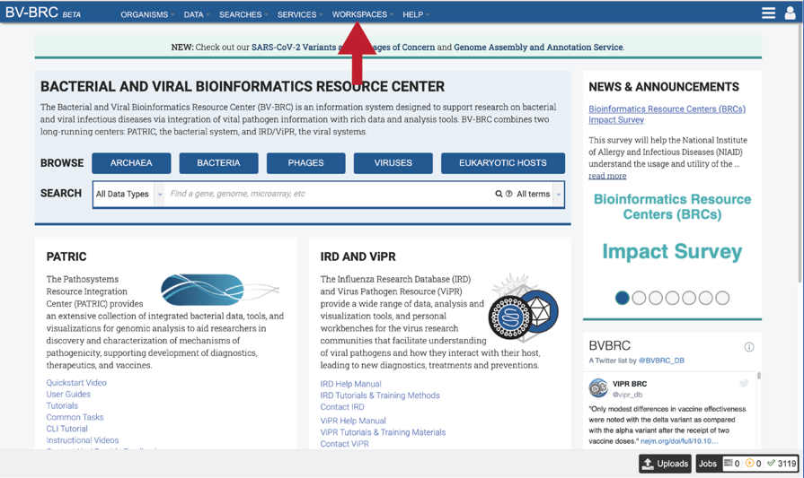

6. This will open a drop-down box for the workspace.  To view the home workspace, click on **home**. 
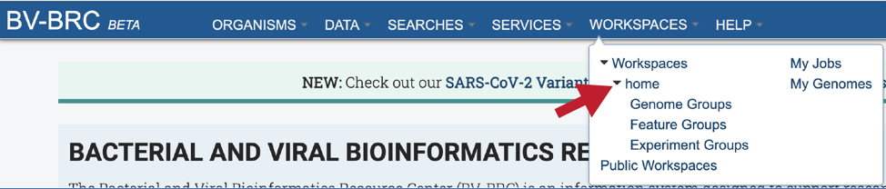

7. This will rewrite the page to show the home directory. Scrolling down the page will show the files and folders in the workspace. 

8. If the job is in a particular folder, that can be opened by double clicking on the row that has the job. 
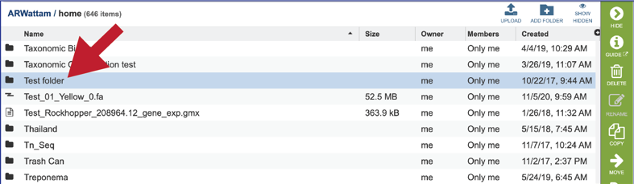

9. This rewrites the page to show the data in that particular folder.  Completed jobs are indicated by a checkered flag in the first column.   The completed job can be accessed by double clicking on that row. 
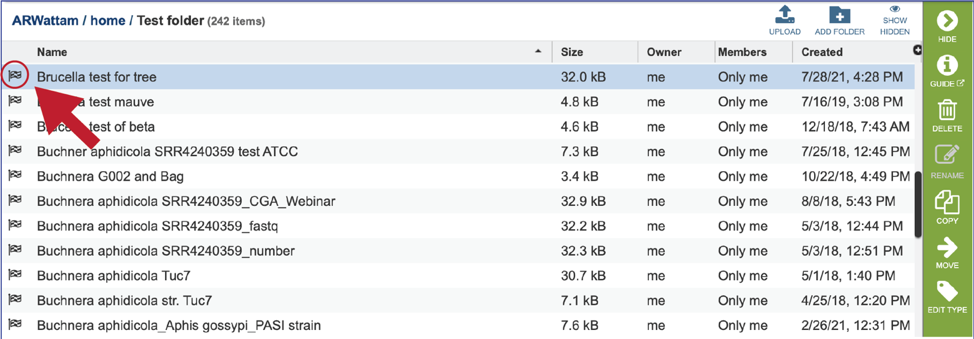

10. This will rewrite the page to show the files produced by the completed job. Clicking on an individual row will populate the vertical green bar with possible action icons, like viewing or downloading the data. Every annotation job (bacterial, bacteriophage and viral) includes **contigs.fasta**, **embl**, **feature_dna.fasta**, **feature_protein.fasta**, **features.txt**, **gb**, **genome**, **gff**, **merged.gb**, **tar.gz**, **txt**, **xls** and **quality.json** files, as well as a **load_files** folder.

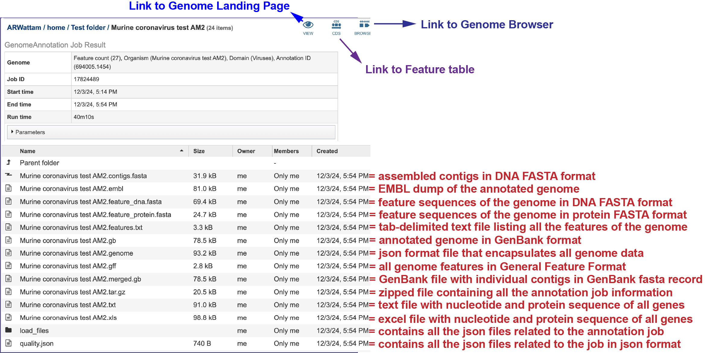

## Annotation job results
1. Any annotation job run in the BV-BRC contains a number of files, as well as information about the submitted job.  To view the input parameters that were selected when the job was submitted, click on the arrow that precedes the word **Parameters**.
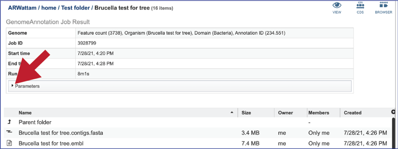

2. This will open a drop-down box that shows the parameters.  This box can be closed by clicking on the same arrow. 
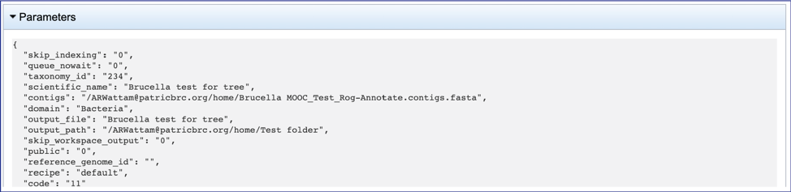

3. The **contigs.fasta** contains the assembled contigs of the genome in DNA FASTA format. 
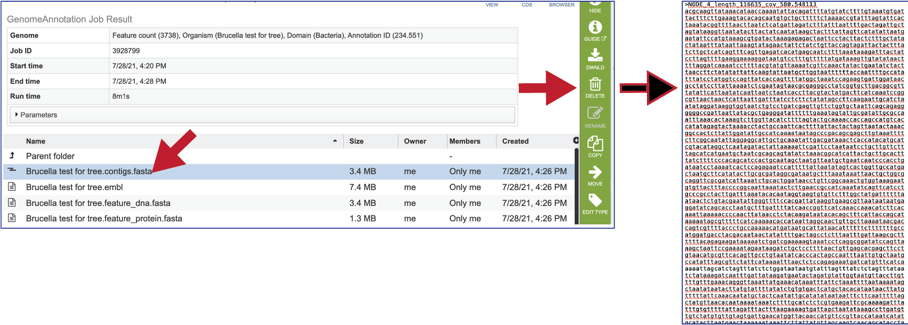

4. The file ending in **.embl** contains an EMBL dump of the annotated genome. 
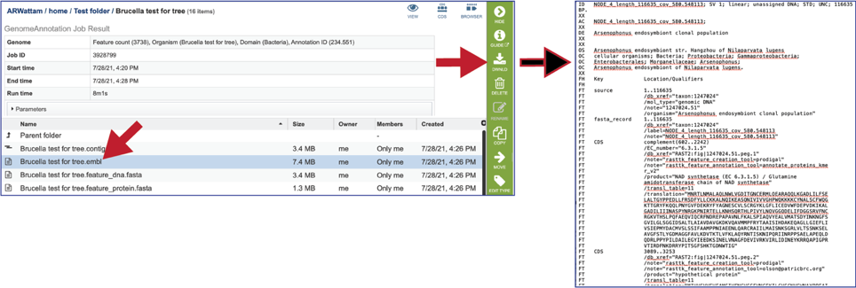

5. The **feature_dna.fasta** file contains all the feature sequences of the genome in DNA FASTA format. 
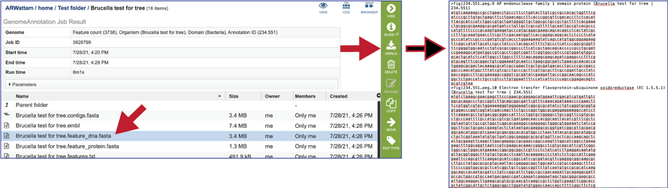

6. The **feature_protein.fasta** contains all the protein sequences of the genome in protein FASTA format. 
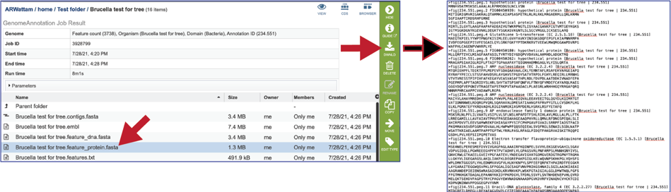

7. The **features.txt** is a tab-delimited text file listing all the features of the genome. For each feature, it contains the BV-BRC ID, the location string, the feature type, the functional assignment, any alternated IDs found, and (for protein-coding genes) the protein MD5 [29] checksum. 
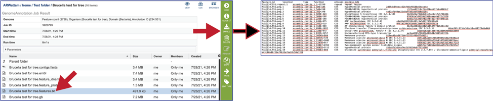

8. The **gb** file contains the annotated genome in GenBank format. 
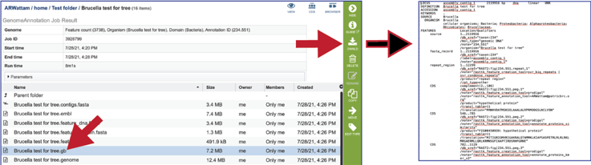

9. The **genome** file contains a special “Genome Typed Object (GTO)” JSON-format file that encapsulates all the data from the annotated genome. 

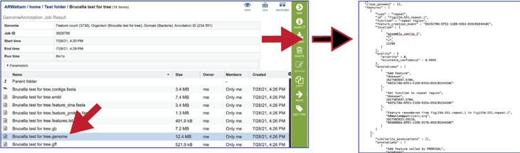

10. The **gff** lists all the features of the genome in General Feature Format. 
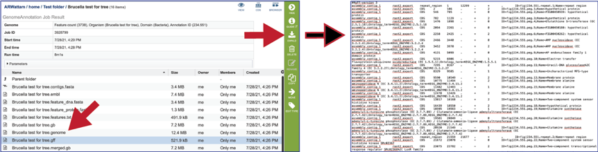

11.	The **merged.gb** is a GenBank file where the individual contigs are each included as a GenBank fasta record under a single locus. 
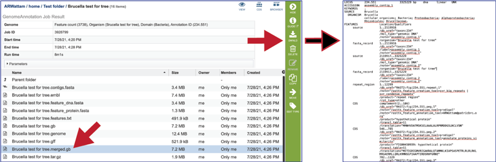

12.	The **tar.gz** file is a zipped file that contains all the information about the annotation job. 
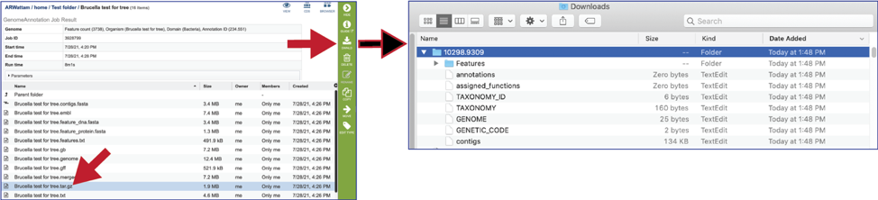

13.	The text, or **txt** file shows the nucleotide and protein sequence of all the annotated genes. 
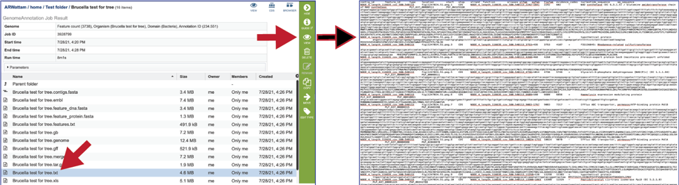

14.	The **.xls** is an excel file that shows the nucleotide and protein sequence of all the annotated genes. 
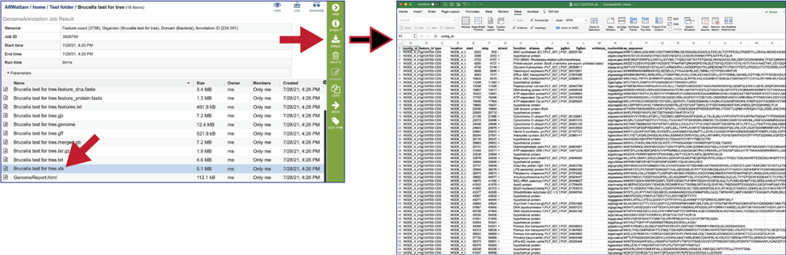

15.	The **genome_quality_details.txt** file is only produced when the **Bacteria/Archaea** recipe was selected.  It shows some of the quality scores seen in the **GenomeReport.html**, and a list of the genes in both the newly annotated and reference genomes, and the number of copies of this gene in each. 

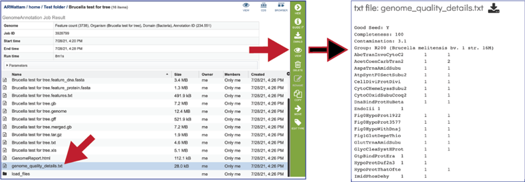

16.	The **Load** files folders contains all the json files related to the annotation job. 
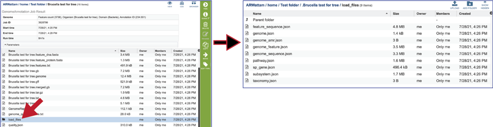

17. The **quality.json** file has the same information in json format. 
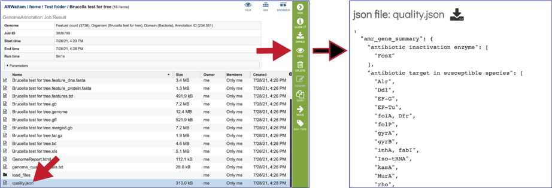

18. Genomes annotated by VIGOR4, will include additional files in the results folder, as seen below.
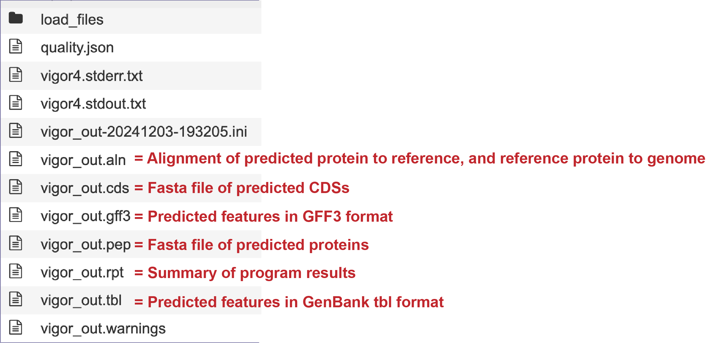

## Genome Report
Genome quality analysis is automatically performed when using the Genome Annotation (Metagenomic Binning Service ) for bacterial and archaeal genomes. The genome quality tools look at the functional roles (or genes) present in an annotated genome to determine if the genome looks correct. Two separate mechanisms are used to predict the number of times each gene should be found in the genome. A role is good if it occurs the predicted number of times; otherwise it is problematic.

The first quality tool (EvalG) checks the completeness and contamination of the genome using a re-implementation of the CheckM [30] algorithm. EvalG identifies universal genes that are expected to occur exactly once in all genomes of a particular taxonomic grouping. Missing genes indicate the genome is less complete; extra genes indicate the genome may be contaminated.

The second quality tool (EvalCon) [31] checks the consistency of the genome annotation. Over 1300 genes that have a predictable relationship to other genes were identified by a machine learning process. EvalCon determines how many instances of each gene are expected given the list of other genes in the genome. If a gene in the genome is unexpected, or an expected gene is missing, this is considered coarse inconsistency. If a gene occurs a different number of times than predicted, this is fine inconsistency.

The four numbers –completeness, contamination, coarse consistency, and fine consistency– express measures of the quality of the genome. EvalG and EvalCon relay not only the numbers, but also identify the problematic genes that occur an unexpected number of times. These are summarized in the Quality Report web page. The report is divided into three sections– the Summary Section that describes the genome itself, the Problematic Roles Report that lists the genes whose expected and actual occurrence numbers do not match, and the Contig Report that lists the contigs containing problematic roles.

1. To view the **GenomeReport.html**, click on its row and then on the View icon.  
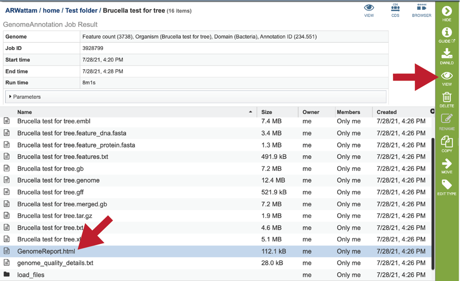

2. This will reload the page to show the **Genome Report**. The top of the page is the summary section, which shows the scores achieved by the binned genome. 

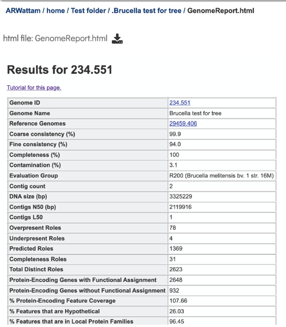

3. A yellow color indicates a poor scoring value. 

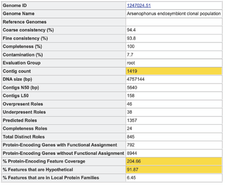

4. The **Potentially Problematic Roles** report lists the genes whose expected and actual occurrence numbers do not match.  It shows the gene (role) that would be expected in a normal genome (**Predicted count**), the number of genes found in the binned genome (**Annotated count**), the link to those genes (**Feature link**), and more information about the genes (**Comment**). 

5. Clicking on the **Feature link** will open a new table that shows the problematic genes in the binned genome. 
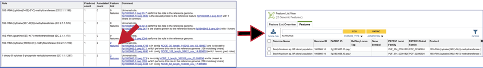

6. To view the problematic gene, click on the gene ID in the **Comment** section.  This will open a new tab that takes you to the landing page of that particular gene.  This page has several tabs, but it opens the Compare Region View, which shows the neighborhood around the problematic gene (which will be colored red). 

7. The **Comment** section also contains a link to the contig that has the problematic gene.  Clicking on the contig ID will open a new tab that lists the genes on that contig. 
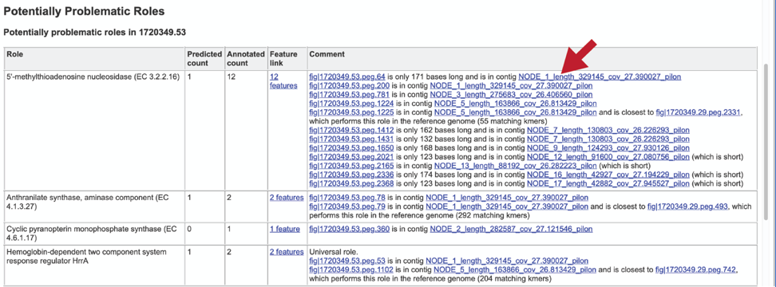

8. The final section is the Contig Report, which lists the contigs containing problematic genes. This table has four columns, including the **Contig Name**, the **Length** of the contig, the number of **Good Features** (or genes) on that contig, and link to a table with those problematic genes (**Feature link**). 

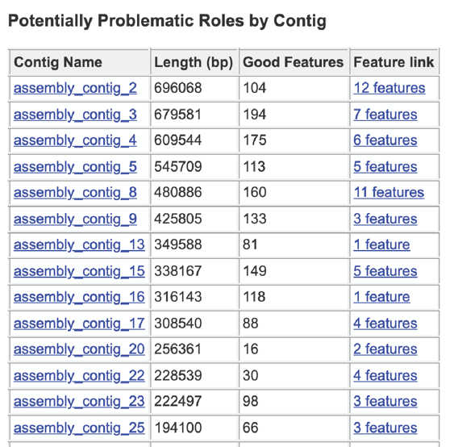

## Viewing the Annotated Genome
Private genomes that have been annotated in BV-BRC can be viewed directly from the annotation job, or through the workspace, or by using the Global Search function.

### Viewing the genome from the job report
1. At the top right of the annotation job there are three icons that provide a direct link to information about the genome.  Clicking on the **View** icon will open a new tab that contains the Genome landing page, with all the information about the newly annotated genome. 
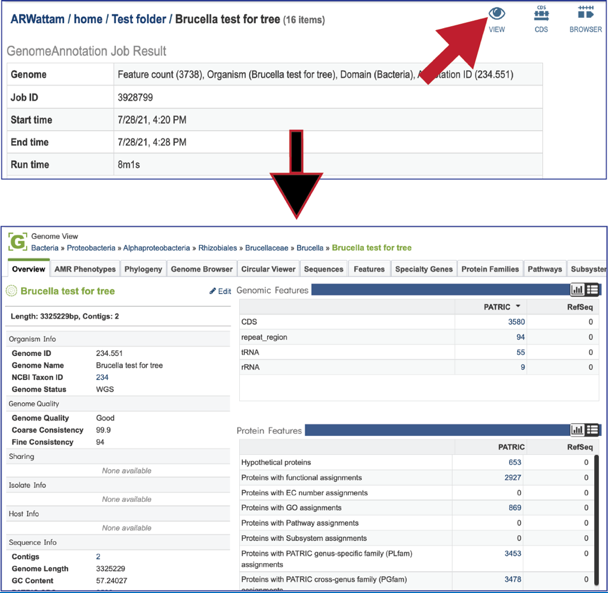

2. Clicking on the **CDS** icon will open a new tab that contains a table with all of the genes that have been annotated in the genome. 
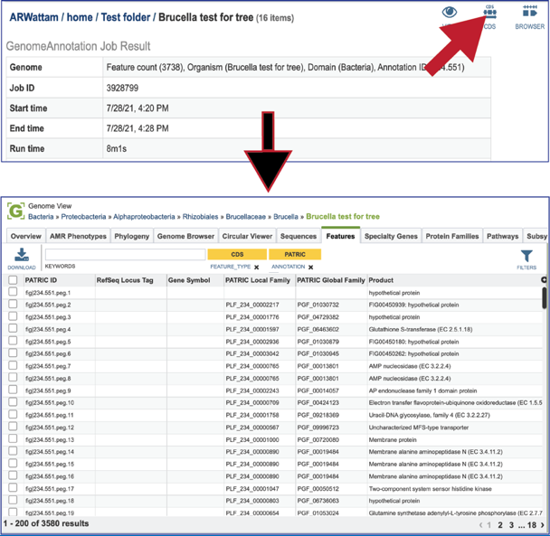

3. Clicking on the **Browser** icon will open a new tab that contains the genome browser, showing all the genes and their orientation in the genome. 

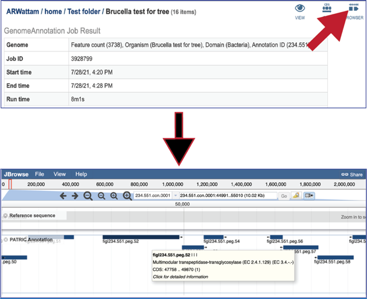

### Finding the genome using the workspace
1. Private genomes can be located through the workspace.  Click on the **Workspaces** tab at the top of any page.  This will open a drop-down box.  Click on **My Genomes** at the upper right of this box. 
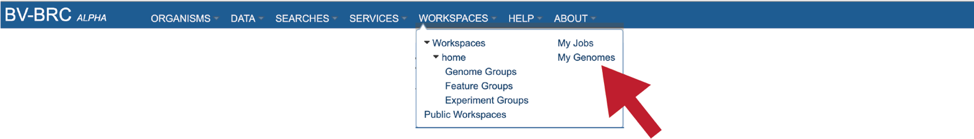

1. This will open a table that contains all of the genomes that you have annotated.  The top of the table contains a text box that can be used to filter the data.  Enter the name, or the unique genome ID into this box and then hit return on your keyboard. 
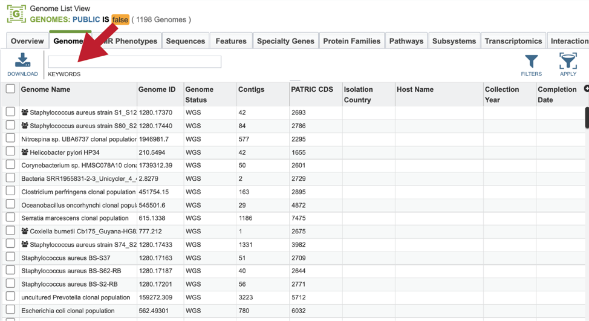

3. This will filter the genomes to show those that match the text entered.  Clicking on the row that contains the correct genome will highlight the vertical green bar to the right with possible downstream functions.  Clicking on the **Genome** icon will open a new tab that has the Genome landing page for that genome. 
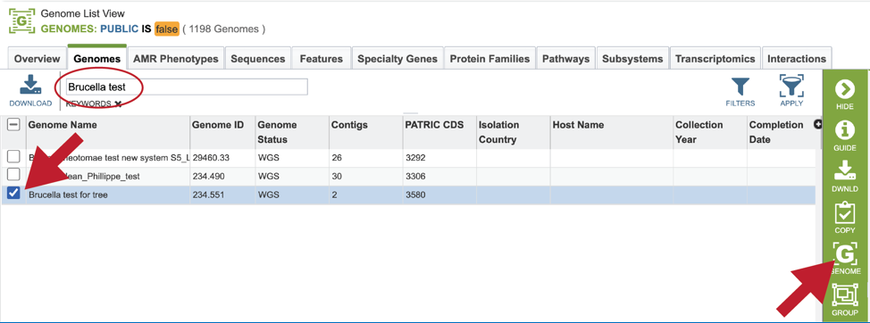

### Finding the genome using Global Search
1. The Global Search can be used to locate public and private data.  The name of the genome can be entered into the box, which can be found on the home page, and also at the top right of any other page. 
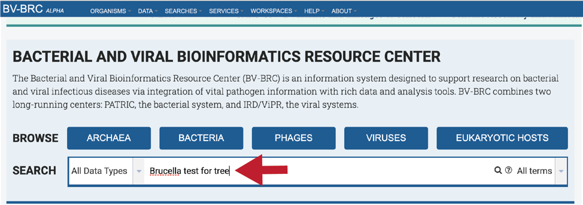

2. Entering the Genome ID, if known, will provide a more direct access to an individual genome.  Click return after entering. 
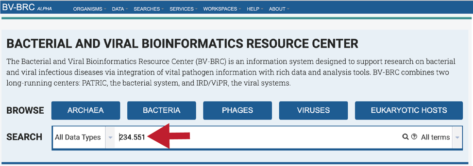

3. This will re-write the page to show the results of the search.  Clicking on the name under Genomes will re-write the page to show the landing page for that genome. 
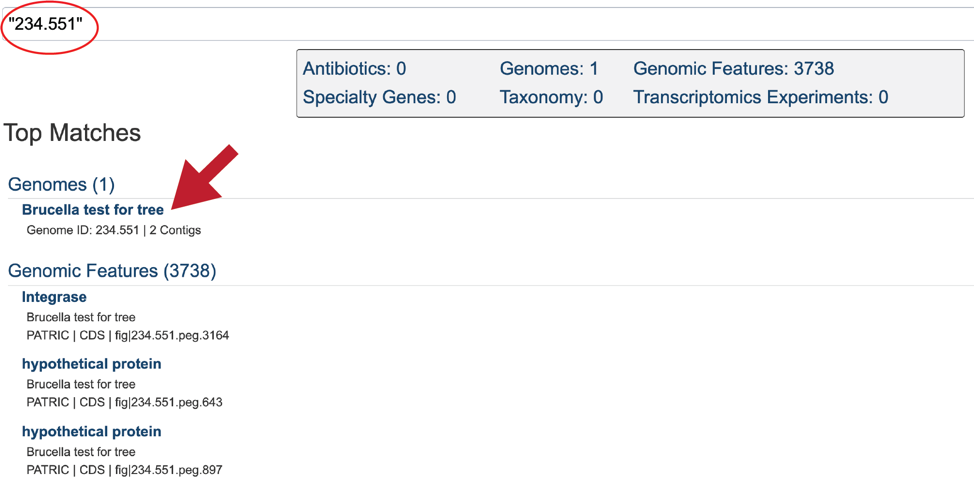

## References
1.	Brettin, T. et al. RASTtk: A modular and extensible implementation of the RAST algorithm for building custom annotation pipelines and annotating batches of genomes. Sci Rep 5: 8365 (2015).
2.	Wang, A. et al. VIGOR, an annotation program for small viral genomes. BMC Bioinformatics 11:451 (2010).
3.	Wang, A. et al. VIGOR extended to annotate genomes for additional 12 different viruses. Nucleic Acids Res 40:W186-92 (2012).
4.	Larsen, C.N. et al. Mat_peptide: comprehensive annotation of mature peptides from polyproteins in five virus families. Bioinformatics 36(5):1627-1628 (2020).
5.	McNair, K. et al. Phage Genome Annotation Using the RAST Pipeline. Methods Mol Biol: 1681:231-238 (2018).
6.	McNair, K. et al. PHANOTATE: a novel approach to gene identification in phage genomes. Bioinformatics 35, 4537-4542 (2019).
7.	Aziz, R. K. et al. The RAST Server: rapid annotations using subsystems technology. BMC genomics 9, 75 (2008).
8.	Chan, P.P. et al. tRNAscan-SE 2.0: improved detection and functional classification of transfer RNA genes. Nucleic Acids Res 49:9077–9096 (2021).
9.	Altschul, S.F. et al. Basic local alignment search tool. J. Mol. Biol. 215:403-410 (1990).
10.	Croucher, N.J. et al. Identification, variation and transcription of pneumococcal repeat sequences. BMC genomics 12, 1-13 (2011).
11.	Hyatt, D. et al.  Prodigal: prokaryotic gene recognition and translation initiation site identification. BMC Bioinformatics: 11:119 (2010).
12.	Delcher, A. L. et al. Identifying bacterial genes and endosymbiont DNA with Glimmer. Bioinformatics 23: 673-679 (2007).
13.	Schapire R.E. Explaining adaboost. In: Empirical inference. Springer; 2013. p. 37–52.
14.	Kent, W. J. BLAT—the BLAST-like alignment tool. Genome research 12, 656-664 (2002).
15.	Johnson, M. et al. NCBI BLAST: a better web interface. Nucleic acids research 36, W5-W9 (2008).
16.	Liu, B. et al. VFDB 2022: a general classification scheme for bacterial virulence factors.  Nucleic Acids Res. 50(D1):D912-D917 (2022).
17.	He Y, et al.  Updates on the web-based VIOLIN vaccine database and analysis system.  Nucleic Acids Res. 42(Database issue):D1124-32 (2014).
18.	Mao, C. et al. Curation, integration and visualization of bacterial virulence factors in PATRIC.
Bioinformatics 31, 252-258 (2015).
19.	Alcock, B.P. et al. CARD 2020: antibiotic resistome surveillance with the comprehensive antibiotic resistance database.  Nucleic Acids Res 48(D1):D517-D525 (2020).
20.	Davis, J.J. et al.  Antimicrobial resistance prediction in PATRIC and RAST. Scientific reports 6, 27930 (2016).
21.	Saier, M.H. et al. The Transporter Classification Database (TCDB): 2021 update. Nucleic Acids Res 49(D1):D461-D467 (2021).
22.	Knox, C.,et al. DrugBank 6.0: the DrugBank Knowledgebase for 2024. Nucleic Acids Res. 52(D1):D1265-D1275 (2024).
23.	Zhou Y. et al. TTD: Therapeutic Target Database describing target druggability information. Nucleic Acids Res 52(D1):D1465-D1477 (2024).
24.	Davis, J. J. et al. PATtyFams: Protein families for the microbial genomes in the PATRIC database. 7, 118 (2016).
25.	Overbeek, R. et al. The subsystems approach to genome annotation and its use in the project to annotate 1000 genomes. Nucleic acids research 33, 5691-5702 (2005).
26.	Overbeek, R. et al. The SEED and the Rapid Annotation of microbial genomes using Subsystems Technology (RAST). 42, D206-D214 (2013).
27.	Jolley, K.A. et al. Open-access bacterial population genomics: BIGSdb software, the PubMLST.org website and their applications. Wellcome Open Res 3:124 (2018).
28.	Akhter, S. et al. PhiSpy: a novel algorithm for finding prophages in bacterial genomes that combines similarity-and composition-based strategies. Nucleic acids research 40: e126e126 (2012).
29.	Rivest, R. RFC1321: The MD5 message-digest algorithm (1992).
30.	Parks, D. H. et al. CheckM: assessing the quality of microbial genomes recovered from isolates, single cells, and metagenomes. Genome research 25, 1043-1055 (2015).
31.	Parrello, B. et al. A machine learning-based service for estimating quality of genomes using PATRIC. BMC Bioinformatics 20(1):486 (2019).
