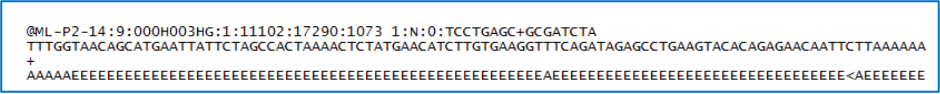

# Genome Assembly Service

A genome assembly is the sequence produced after chromosomes from the organism have been fragmented, those fragments have been sequenced, and the resulting sequences have been put back together. This is currently needed as DNA sequencing technology cannot read whole genomes in one go, but rather can read small pieces of between 20 and 30,000 bases, depending on the technology used. Typically, the short fragments, called reads, result from shotgun (random) sequencing of genomic DNA.

De novo sequence assemblers are a type of program that assembles short nucleotide sequences into longer ones without the use of a reference genome. These are commonly used in bioinformatic studies to assemble genomes or transcriptomes.

Different assemblers are designed for different type of read technologies. Second generation sequencing technologies like Illumina (called “short-read” technologies) produce short reads on the order of 50-200 base pairs and have low error rates of around 0.5-2%, with the errors chiefly being substitution errors. Third generation technologies like PacBio and fourth generation technologies like Oxford Nanopore (called “long-read” technologies) provide read lengths in the thousands or tens of thousands but have much higher error rates of around 10-20%, with errors being chiefly insertions and deletions. These differences necessitate different algorithms for assembly from short and long read technologies.

What follows is a tutorial showing how to submit reads of various types for assembly and selecting parameters for the assembly algorithm.  Note that reads from different sequencing platforms of the same organism can be submitted in one job. If PacBio and Illumina reads are available, both would be combined to generate the best assembly.

## Files accepted by BV-BRC Assembly Service

The assembly service accepts read files in either fastq, fasta, fastq.gz, or fasta.gz format. 

**FASTQ** is a text-based format for storing both a nucleotide sequence and its corresponding quality scores. Both the sequence letter and quality score are each encoded with a single ASCII character.  A FASTQ file normally uses four lines per sequence:
* Line 1 begins with a ‘@’ character and is followed by a sequence identifier and an optional description (like a FASTA title line).
* Line 2 is the raw sequence letters.
* Line 3 begins with a ‘+’ character and is optionally followed by the same sequence identifier (and any description) again.
* Line 4 encodes the quality values for the sequence in Line 2 and must contain the same number of symbols as letters in the sequence.

**FASTA** is a text-based format for representing either nucleotide sequences or amino acid (protein) sequences using single-letter codes. The format allows for sequence names and comments to precede the sequences. A **FASTA read file** has two parts: 
* Line 1 begins with a ‘>’.  Everything from the beginning ‘>’ to the first whitespace is considered the sequence identifier. Everything after that is considered the sequence description (this can be metadata, machine serial number, read orientation, etc.), all in a single line.
* Line 2 has the sequence, which can span multiple lines depending on the length.

What follows below is a tutorial showing how to submit reads of various types for assembly and selecting parameters for the assembly algorithm.  Note that reads from different sequencing platforms of the same organism can be submitted in one job.  If long and short reads are available for the same isolate, both could be combined to generate the best assembly using Unicycler, Canu or Flye.

## Creating a folder to hold the assembly job and related data

1.	It is always good practice to create a folder to keep the results from a particular experiment or project in order.  To create a new folder, go to the Workspaces tab and click on home.

2.	This will open the home directory on your workspace.  To create a new folder, click on the Add Folder icon at the top right of the table.

3.	This will open a pop-up window.  Note that the Create Folder button is greyed out.  Type the desired name in the text box.

4.	Once the name is entered, the Create Folder icon will turn blue.  To create the folder, click on that button.

5.	The pop-up window will disappear.  At the button left of the page you will see a temporal message indicating that the folder was successfully created.

## Locating the Assembly Service App

1.	At the top of any BV-BRC page, find the Tools & Services tab and click on it.

2.	In the drop-down box, underneath Genomics, click on Assembly.

3.	This will open up the Assembly landing page where researchers can submit single or paired read files, a combination of the two, and/or an SRA run accession number to the service.

### Uploading paired end reads

1.	To upload a fastq file that contains paired reads, locate the box called “Paired read library.” 

2.	The reads must be located in the workspace. To initiate the upload, first click on the folder icon. 

3.	This opens up a window where the files for upload can be selected. Click on the icon with the arrow pointing up. 

4.	This opens a new window where the file you want to upload can be selected. Click on the “Select File” in the blue bar. 

5.	This will open a window that allows you to choose files that are stored on your computer. Select the file where you stored the fastq file on your computer and click “Open”.  

6.	Once selected, it will autofill the name of the file. Click on the Start Upload button. 

7.	This will auto-fill the name of the document into the text box. 

8.	Pay attention to the upload monitor in the lower right corner of the BV-BRC page. It will show the progress of the upload. Do not submit the job until the upload is 100% complete.

9.	Repeat to upload the second pair of reads.

10.	To finish the upload, click on the icon of an arrow within a circle. This will move your file into the Selected libraries box.

### Uploading single reads

1.	To upload a fastq file that contains single reads, locate the text box called “Single read library.” If the reads have previously been uploaded, click the down arrow next to the text box below Read File. 

