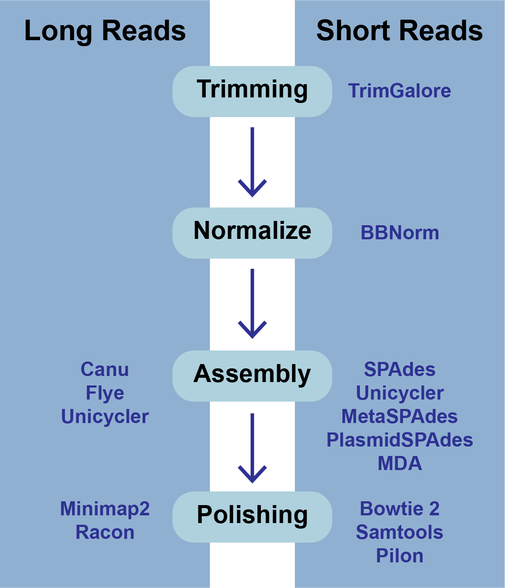

# Genome Assembly Service

*Revised: 16 November 2024*

A genome assembly is the sequence produced after chromosomes from the organism have been fragmented, those fragments have been sequenced, and the resulting sequences have been put back together. This is currently needed as DNA sequencing technology cannot read whole genomes in one go, but rather can read small pieces of between 20 and 30,000 bases, depending on the technology used. Typically, the short fragments, called reads, result from shotgun (random) sequencing of genomic DNA.

De novo sequence assemblers are a type of program that assembles short nucleotide sequences into longer ones without the use of a reference genome. These are commonly used in bioinformatic studies to assemble genomes or transcriptomes.

Different assemblers are designed for different type of read technologies. Second generation sequencing technologies like Illumina (called “short-read” technologies) produce short reads on the order of 50-200 base pairs and have low error rates of around 0.5-2%, with the errors chiefly being substitution errors. Third generation technologies like PacBio and fourth generation technologies like Oxford Nanopore (called “long-read” technologies) provide read lengths in the thousands or tens of thousands but have much higher error rates of around 10-20%, with errors being chiefly insertions and deletions. These differences necessitate different algorithms for assembly from short and long read technologies.

What follows is a tutorial showing how to submit reads of various types for assembly and selecting parameters for the assembly algorithm.  Note that reads from different sequencing platforms of the same organism can be submitted in one job. If PacBio and Illumina reads are available, both would be combined to generate the best assembly. This is called a hybrid assembly.

The BV-BRC Genome Assembly service uses a number of open source, third-part bioinformatics programs that are depicted below.

## Files accepted by BV-BRC Assembly Service

The assembly service accepts read files in either fastq, fasta, fastq.gz, or fasta.gz format. 

**FASTQ** is a text-based format for storing both a nucleotide sequence and its corresponding quality scores. Both the sequence letter and quality score are each encoded with a single ASCII character.  A FASTQ file normally uses four lines per sequence:
* Line 1 begins with a ‘@’ character and is followed by a sequence identifier and an optional description (like a FASTA title line).
* Line 2 is the raw sequence letters.
* Line 3 begins with a ‘+’ character and is optionally followed by the same sequence identifier (and any description) again.
* Line 4 encodes the quality values for the sequence in Line 2 and must contain the same number of symbols as letters in the sequence.

**FASTA** is a text-based format for representing either nucleotide sequences or amino acid (protein) sequences using single-letter codes. The format allows for sequence names and comments to precede the sequences. A **FASTA read file** has two parts: 
* Line 1 begins with a ‘>’.  Everything from the beginning ‘>’ to the first whitespace is considered the sequence identifier. Everything after that is considered the sequence description (this can be metadata, machine serial number, read orientation, etc.), all in a single line.
* Line 2 has the sequence, which can span multiple lines depending on the length.

What follows below is a tutorial showing how to submit reads of various types for assembly and selecting parameters for the assembly algorithm.  Note that reads from different sequencing platforms of the same organism can be submitted in one job.  If long and short reads are available for the same isolate, both could be combined to generate the best assembly using Unicycler, Canu or Flye.

## Creating a folder to hold the assembly job and related data

1.	It is always good practice to create a folder to keep the results from a particular experiment or project in order.  To create a new folder, go to the **Workspaces** tab and click on **home**.

2.	This will open the home directory on your workspace.  To create a new folder, click on the **Add Folder** icon at the top right of the table.

3.	This will open a pop-up window.  Note that the **Create Folder** button is greyed out.  Type the desired name in the text box.

4.	Once the name is entered, the **Create Folder** icon will turn blue.  To create the folder, click on that button.

5.	The pop-up window will disappear.  At the button left of the page you will see a temporal message indicating that the folder was successfully created.

## Locating the Assembly Service App

1.	At the top of any BV-BRC page, find the **Tools & Services** tab and click on it.

2.	In the drop-down box, underneath **Genomics**, click on **Genome Assembly (B)**.

3.	This will open up the Assembly landing page where researchers can submit single or paired read files, a combination of the two, and/or an SRA run accession number to the service.

### Uploading paired end reads

1.	To upload a fastq file that contains paired reads, locate the box called **Paired read library**. 

2.	The reads must be located in the workspace. To initiate the upload, first click on the **Folder** icon. 

3.	This opens up a window where the files for upload can be selected. Click on the icon with the **Arrow** pointing up. 

4.	This opens a new window where the file you want to upload can be selected. Click on the **Select File** in the blue bar. 

5.	This will open a window that allows you to choose files that are stored on your computer. Select the file where you stored the fastq file on your computer and click **Open**.  

6.	Once selected, it will autofill the name of the file. Click on the **Start Upload** button. 

7.	This will auto-fill the name of the document into the text box.  

8.	Pay attention to the **Upload Monitor** in the lower right corner of the BV-BRC page. It will show the progress of the upload. Do not submit the job until the upload is 100% complete.
   

9.	Repeat to upload the second pair of reads.

10.	To finish the upload, click on the icon of an **Arrow within a circle**. This will move your file into the **Selected libraries** box. You can submit more than one set of paired reads if appropriate.

### Uploading single reads

1.	To upload a fastq file that contains single reads, locate the text box called **Single read library**. If the reads have previously been uploaded, click the down arrow next to the text box below **Read File**. 

2.	This opens up a drop-down box that shows the all the reads that have been previously uploaded into the workspace. Click on the name of the reads of interest.

3.	This will auto-fill the name of the file into the text box.

4.	To finish the upload, click on the icon of an **Arrow within a circle**. This will move the file into the **Selected libraries** box. You can submit more than one set of long reads if appropriate.  You can submit both short and long reads to generate a hybrid assembly.

### Submitting reads that are present at the Sequence Read Archive (SRA)

1.	BV-BRC also supports analysis of existing datasets from SRA. To submit this type of data, locate the **Run Accession number** that you will find at SRA and copy it.

2.	Paste the copied accession number in the text box underneath **SRA Run Accession**, then click on the icon of an **Arrow within a circle**.  This will move the file into the **Selected libraries** box. You can submit more than one SRA run number if appropriate.

## Setting Parameters

1.	The assembly strategy for the reads must be selected.  Clicking on the down arrow that follows the text box under Assembly Strategy will open a drop-down box that shows all the strategies that BV-BRC offers.  A description of each strategy is listed below. Clicking on one of the strategies will autofill the text box with that selection: 

* **Unicycler** [1] is an assembly pipeline that can assemble Illumina-only read sets where it functions as a SPAdes-optimizer. It can also be used to assembly long read sets (PacBio or Nanopore), as long as short reads are included.  This is a hybrid assembly.  Unicycler builds an initial assembly graph from short reads using the *de novo* assembler and then uses a novel semi-global aligner to align long reads to it. The latest version of Unicycler is available here (https://github.com/rrwick/Unicycler).

* **SPAdes** [2] is an assembler that is designed to assemble small genomes, such as those from bacteria, and uses a multi-sized De Bruijn graph to guide assembly. The latest version of the SPAdes toolkit is available here (http://cab.spbu.ru/software/spades/).

* **Canu**[3] is a long-read assembler which works on both third and fourth generation reads. It is a successor of the old Celera Assembler that is specifically designed for noisy single-molecule sequences. It supports nanopore and PacBio sequences. If long- and short-reads are included, it can generate a hybrid assembly  The algorithm for Canu is available here (https://github.com/marbl/canu).

* **The metaSPAdes** [4] software combines new algorithmic ideas with proven solutions from the SPAdes toolkit to address various challenges of metagenomic assembly.  **metaSPAdes** will only run on paired Illumina reads.The latest version of the SPAdes toolkit that includes metaSPAdes is available here (http://cab.spbu.ru/software/spades/).

* The **plasmidSPAdes** [5] algorithm and software tool for assembling plasmids from whole genome sequencing data and benchmark its performance on a diverse set of bacterial genomes. Plasmids are stably maintained extra-chromosomal genetic elements that replicate independently from the host cell's chromosomes. **plasmidSPAdes** will only run on Illumina reads.
The latest version of the SPAdes toolkit that includes plasmidSPAdes is available here (http://cab.spbu.ru/software/spades/).

* **Single-cell SPAdes** [2] is a new assembler for both single-cell and standard (multicell) assembly, and it improves on the recently released E+V−SC assembler (specialized for single-cell data). The latest version of the SPAdes toolkit that includes the assembly algorithm for reads from single cell is available here (http://cab.spbu.ru/software/spades/).

* **Flye** [6] is a long-read assembler.  Kolmogorov et al. say that “Flye initially generates disjointigs that represent concatenations of multiple disjoint genomic segments, concatenates all error-prone disjointigs into a single string (in an arbitrary order), constructs an accurate assembly graph from the resulting concatenate, uses reads to untangle this graph, and resolves bridged repeats (which are bridged by some reads in the repeat graph). Afterwards, it uses the repeat graph to resolve unbridged repeats (which are not bridged by any reads) using small differences between repeat copies and then outputs accurate contigs formed by paths in this graph.” [6] The algorithm is available here (http://github.com/fenderglass/Flye).

* Selecting **Auto** will use Flye if only long reads are submitted. If long and short reads, as or short reads alone are submitted, **Unicycler** is selected. 

2.	An output folder must be selected for the assembly job.  Typing the name of the folder in the text box underneath the words **Output Folder** will show a drop-down box that shows close hits to the name, and clicking on the arrow at the end of the box will open a drop-down box that shows the most recently created folders.  To find a previously created folder, or to create a new one, click on the **Folder** icon at the end of the text box.  This will open a pop-up window that shows all the previously created folders.

3.	Click on the desired folder, and then click the **OK** button in the lower right corner of the window.

4.	A name for the job must be included prior to submitting the job.  Enter the name in the text box underneath the words **Output Name**.

5.	The BV-BRC assembly service also has options to trim the reads using TrimGalore[7]. The assembly pipeline also has an option for nomalizing the reads.  It uses BBNorm to normalize coverage by down-sampling reads over high-depth areas of a genome, to result in a flat coverage distribution (http://sourceforge.net/projects/bbmap/). Assembly errors can be improved (or “polished) using Racon[8] and/or Pilon[9].  The servicealso provides the ability to change the minimum contig length and coverage.  Adjusting these parameters can be accomplished by clicking on the down arrow next to the word **Advanced** in the **Parameters** box.

Polishing requires some explanation.  If there is a position in an assembly where the reads disagree, it indicates that the assembly is wrong.  Pilon and Racon will look at the locations of the discrepancies, and, if the majority and quality indicate, they will correct the call of the base pair. Polishing the long reads reuires Minimap2[10] to map the reads to the assembly, and then Racon is used to correct the assembly.  Polishing short reads first uses Bowtie2[11],which generates a SAM file.  SAMtools [12] creates a BAM file from the SAM file, as this is a requirement of Pilon prior to read correction.

Once the assembly has been corrected (polished) with the reads, it is still possible to do another iteration to further improve the assembly, but each one takes time. BV-BRC allows for 0 to 4 racon or pilon iterations, with the default being 2 iterations.

## Submitting the Assembly Job

1.	Once reads are in the Selected libraries and all the parameters have been selected, the Assemble button at the bottom of the page will turn blue.  The assembly will be submitted once this button is clicked.

2.	A message will appear at the bottom of the page, indicating that the submitted job has entered the BV-BRC queue.

### Monitoring progress on the Jobs page
1.	Clicking on the Jobs box at the bottom right of any BV-BRC page/

2.	This will open the Jobs Landing page where the status of submitted jobs is displayed.

## Viewing and Interpreting the Assembly Job Results
1.	On the jobs page, click on the row that has the assembly of interest. This will populate the vertical green bar on the right with possible downstream steps, which include viewing the results of the job, or reporting an issue that was experienced (like a job failure).  Click on the View icon.

2.	This will rewrite the page to show the information about the assembly job, and all of the files that are produced when the pipeline runs.  

3.	The information about the job submission can be seen in the table at the top of the results page.  To see all the parameters that were selected when the job was submitted, click on the Parameters row.

4.	This will show the information on what was selected when the job was originally submitted.

### Genome Assembly Report

1.	The Genome Assembly report contains valuable information about the assembly, including the number of contigs. Clicking on the row that contains the number of contigs, depth and coverage.  **AssemblyReport.html** will highlight it in blue and populate the action bar with possible downstream steps.  Click on the View icon.

2.	This will open the report, which opens with a graph of the assembly called a Bioinformatics Application for Navigating De novo Assembly Graphs Easily, or **Bandage plot**[13], a tool for visualizing assembly graphs with connections.  

3.	Scrolling down in the report will show more information, including the assembly algorithms.  These details will be important to include in any publication using these data.

4.	Scrolling down will reveal a **Quast report** [14], which is also included in the Genome Assembly report. Quast is a quality assessment tool for evaluating and comparing genome assemblies, and shows statistics of the contigs generated in the assembly.  

5.	The end of the Assembly Report gives information about the read files and summarizes the tools their versions used in generating the assembly.  These details are important to include if you publish this data.

### Contig file

1.	The whole point of the assembly service is the generation of a contig file from the submitted reads.  The contig file can be used in downstream services.  Note that the file, which can be clicked on from the Jobs page, has the type matched as “contigs” in the information panel beyond the green bar.  The contig file can be used as is in BV-BRC or downloaded for use in other resources or pipelines.

2.	Once the contig file is downloaded, it can be opened for viewing in a text file on the computer.

3.	Opening the contigs file will show the contigs, each of which begin with a “>” and includes the length, coverage and normalized coverage statistics on the first row. Coverage means the average number of original reads that align to each position of the contig. The normalized coverage has a mean of 1.0 and helps identify contigs of unusually high or low coverage.  When both long and short reads are combined in a “hybrid assembly”, separate coverage statistics are provided for the two read categories. The sequence for the contig starts on the second row. 

### Other Assembly job report files
1.	There are additional files that are generated by the assembly pipeline, and these can be viewed by clicking on the **details** folder.  This will rewrite the page to show additional files.

2.	The **“Graphical Fragment Assembly” (GFA)** is an emerging format for the representation of sequence assembly graphs, which can be adopted by both de Bruijn graph- and string graph-based assemblers.  This file can be viewed or downloaded, but it is not meant to be human readable.  It is used to generate the assembly plot graph (see below).  Clicking on the **View** icon will rewrite the page to show this file.

3.	**Assembly Graph Plot** - A graph of the assembly is provided as part of the standard output.  Bandage (a Bioinformatics Application for Navigating De novo Assembly Graphs Easily)[10], a tool for visualizing assembly graphs with connections is used.  To see the Bandage plot, click on the row that has the **plot.svg** file and then click on the **View** icon in the vertical green bar.  The page that opens the Bandage plot, which visualizes both nodes and edges. This llustrates the complexity of the assembly that is missing from the simple linear contigs.  Areas that show crosses in the Bandage plot usually show regions where there are multiple solutions in the assembly, like areas with repeat regions.  Repeat regions are often longer than a short read length, so hybrid assemblies will often resolve these difficult areas.

4.	The assembly also generates a standard output file that the pipeline produces while running.  Clicking on the row that ends in **stdout.txt** and then the view icon will open this file.

5.	While the Quast[14] report is included in the Genome Assembly report, a separate, downloadable format is provided as an html.  When the **quast_report.html** is downloaded and opened, details on the assembly including the Cumulative length per contig is provided. The cumulative length plot shows the number of bases in the first x contigs, as x varies from zero to the number of contigs.

6.	Clicking on **Nx** shows the percentage of bases on each of the contigs.

7.	Clicking on **GC content** shows the total number of G and C nucleotides in the assembly, divided by the total length of the assembly.

8.	This Quast report is also available as a text file.  To view this, click on the line that has the **quast_report.txt** and then on the **View** icon in the vertical green bar. This will open the text format of the that report.

9.	A **JSON** file is a file that stores simple data structures and objects in JavaScript Object Notation (JSON) format, which is a standard data interchange format. It is primarily used for transmitting data between a web application and a server.  While it is not recommended for viewing (it is a computer-readable file), the file is both downloadable and viewable.

10.	The assembly pipeline also generates a file of all the contigs that did not meet the thresholds that were set when the job was submitted (**contigs_below_length_coverage_threshold.fasta**). This file can be downloaded and then opened as a text file.  It can be used in other programs (like BLAST) to see if the data is valuable.

## References

1.	Wick, R.R., et al., Unicycler: resolving bacterial genome assemblies from short and long sequencing reads. PLoS computational biology, 2017. 13(6): p. e1005595.
2.	Bankevich, A., et al., SPAdes: a new genome assembly algorithm and its applications to single-cell sequencing. Journal of computational biology, 2012. 19(5): p. 455-477.
3.	Koren, S., et al., Canu: scalable and accurate long-read assembly via adaptive k-mer weighting and repeat separation. Genome research, 2017. 27(5): p. 722-736.
4.	Nurk, S., et al., metaSPAdes: a new versatile metagenomic assembler. Genome research, 2017. 27(5): p. 824-834.
5.	Antipov, D., et al., plasmidSPAdes: assembling plasmids from whole genome sequencing data. bioRxiv, 2016: p. 048942.
6.	Kolmogorov, M., et al., Assembly of long, error-prone reads using repeat graphs. Nature biotechnology, 2019. 37(5): p. 540-546.
7.	Krueger, F., Trim Galore: a wrapper tool around Cutadapt and FastQC to consistently apply quality and adapter trimming to FastQ files, with some extra functionality for MspI-digested RRBS-type (Reduced Representation Bisufite-Seq) libraries. URL http://www. bioinformatics. babraham. ac. uk/projects/trim_galore/.(Date of access: 28/04/2016), 2012.
8.	Vaser, R., et al., Fast and accurate de novo genome assembly from long uncorrected reads. Genome research, 2017. 27(5): p. 737-746.
9.	Walker, B.J., et al., Pilon: an integrated tool for comprehensive microbial variant detection and genome assembly improvement. PloS one, 2014. 9(11): p. e112963.
10.	Li, H.,  Minimap2: pairwise alignment for nucleotide sequences. Bioinformatics, 2018 34(18): 3094-3100
11.	 Langmead, B. and Salzberg, SL. Fast gapped-read alignment with Bowtie 2. Nat Methods, 2012 9(4):357-359.
12.	 12.	Danecek P., et al. Twelve years of SAMtools and BCFtools. Gigascience, 2021 10(2):giab008. doi: 10.1093/gigascience/giab008.
13.	Wick, R.R., et al., Bandage: interactive visualization of de novo genome assemblies. Bioinformatics, 2015. 31(20): p. 3350-3352.
14.	Gurevich, A., et al., QUAST: quality assessment tool for genome assemblies. Bioinformatics, 2013. 29(8): p. 1072-1075.
