# HA Subtype Numbering Conversion Service

## Overview

The HA Subtype Numbering Conversion tool takes influenza HA protein sequence(s) and converts their existing HA position numbering to a different HA numbering scheme using David Burke and Derek Smith’s method that uses both sequence and structure information to propose positions of functional equivalence across different HA subtypes. The analysis starts with the user inputting protein sequence(s). The sequence(s) are BLASTed against the Burke Reference sequences, which will determine the best reference subtype to use in the HA numbering pipeline. The HA numbering pipeline will generate a pairwise multiple sequence alignment using the reference protein sequence selected and the user inputted protein sequence(s). This alignment will generate a mapping between the user input sequence(s) and the BLAST reference sequence. Then this mapping is used to align the input sequence(s) to the selected HA subtype positions.

### Burke Reference Sequences

| Subtype Common Name | Strain Name        |
| ------------------- | ------------------ |
| H1_PR34             | A/Puerto/Rico/8/34 |
| H1_1993             | A/United/Kingdom/1/1933 |
| H1post1995          | A/NewCaledonia/20/1999 |
| H1pdm | A/California/04/2009 |
| H2	| A/Singapore/1/1957 |
| H5mEA-nonGsGD	| A/mallard/Italy/3401/2005 (LPAI) |
| H5	| A/Vietnam/1203/04 (HPAI) |
| H5c221	| A/chicken/Egypt/0915-NLQP/2009 (HPAI) |
| H6	| A/chicken/Taiwan/0705/99 |
| H8	| A/turkey/Ontario/6118/1968 |
| H9	| A/Swine/HK/9/98 |
| H11	| A/duck/England/1/1956 |
| H12	| A/Duck/Alberta/60/1976 |
| H13	| A/gull/Maryland/704/1977 |
| H16	| A/black-headedgull/Turkmenistan/13/76 |
| B/Hong Kong/8/73	| B/HONGKONG/8/73 |
| B/Florida/4/2006	| B/FLORIDA/4/2006 |
| B/Human/Brisbane/60/2008	| B/HUMAN/BRISBANE/60/2008 |
| H3	| A/AICHI/2/68 |
| H14	| A/mallard/Astrakhan/263/1982 |
| H15	| A/duck/Australia/341/1983 |
| H10	| A/mallard/bavaria/3/2006 |
| H4	| A/swine/Ontario/01911-1/99 |
| H7N3	| A/Turkey/Italy/220158/02/H7N3 |
| H7N7	| A/Netherlands/219/03/H7N7 |
| H17	| A/little-yellowshoulderedbat/Guatemala/060/2010 |
| H18	| A/flat-faced/bat/Peru/033/2010 |

### See Also
  * [HA Subtype Numbering Conversion Service](https://www.bv-brc.org/app/HASubtypeNumberingConversion)
  * [HA Subtype Numbering Conversion Quick Reference](../../quick_references/ha_numbering/ha_numbering.html)

## Locating the service

The HA Subtype Numbering Conversion submenu option under the **TOOLS & SERVICES** main menu (Protein tools category) opens the HA Subtype Numbering Conversion input form. *Note: You must be logged into BV-BRC to use this service.*
 
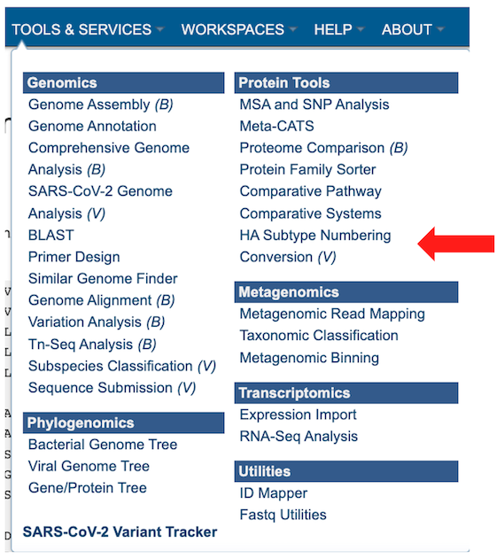

This will open up the HA Subtype Numbering Conversion job landing page.

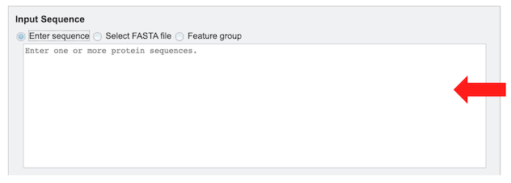

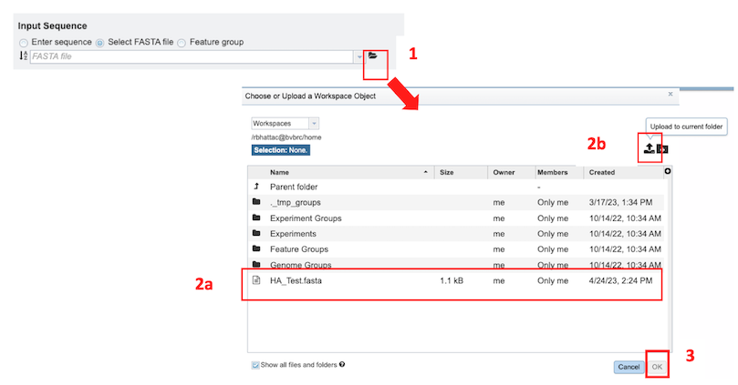

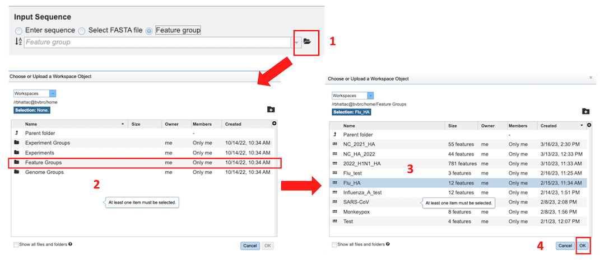

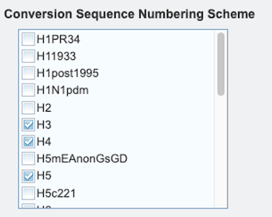

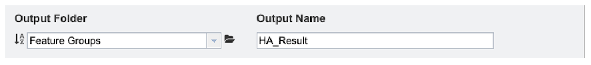

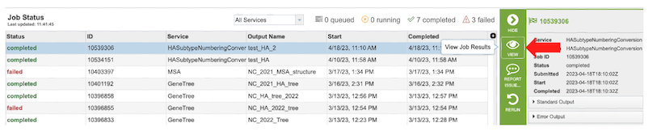

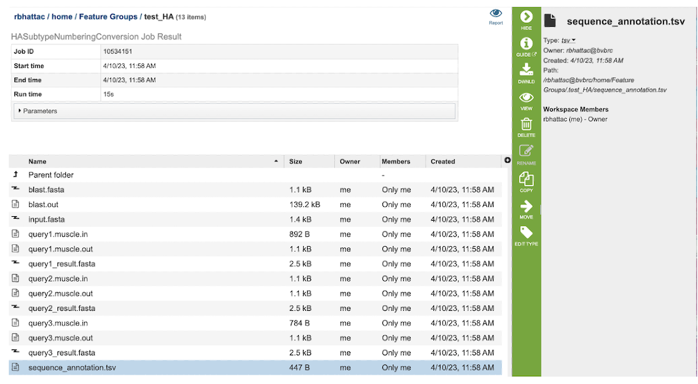

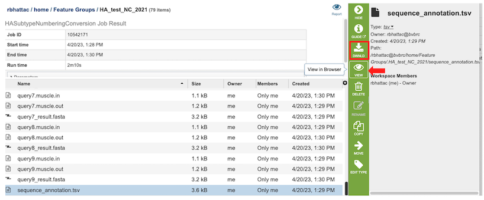

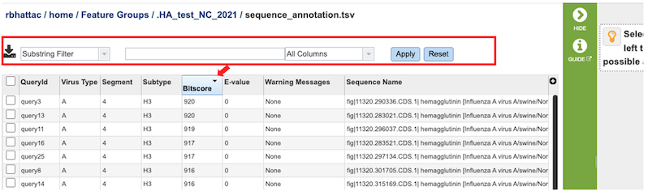

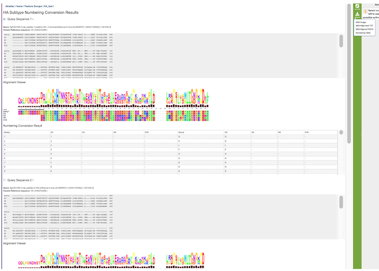

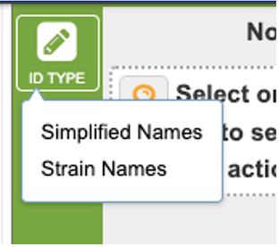

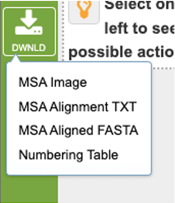

