# Metadata-driven Comparative Analysis Tool (Meta-CATS)

*Revised: 11/25/2022*

## Overview
The Meta-CATS tool provides the capability to perform customized comparative genomics analyses with minimal manual manipulation. You can perform a statistical analysis on sequences assigned to up to 10 different groups to determine which residues significantly correlate with one or more metadata fields. The meta-CATS tool looks for positions that significantly differ between user-defined groups of sequences. However, biological biases due to covariation, codon biases, and differences in genotype, geography, time of isolation, or others may affect the robustness of the underlying statistical assumptions. Open-source code for meta-CATS can be found [here](https://github.com/JCVenterInstitute/Meta-CATS). 

### Keywords:
metadata, variation analysis, comparative analysis. 

### See also
* [Meta-CATS Analysis Service](https://bv-brc.org/app/MetaCATS)
* [Meta-CATS Analysis Service Quick Reference Guide](/quick_references/services/metacats)

## Locating the meta-CATS App

At the top of any BV-BRC page, find the **SERVICES** tab and then click on Meta-CATS in the Genomics group. 
 
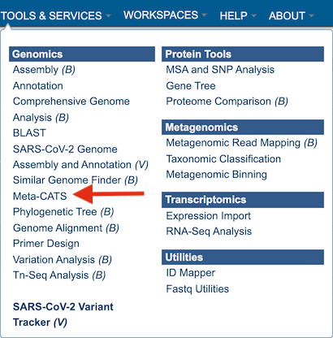

This will open up the **Meta-CATS** landing page. 

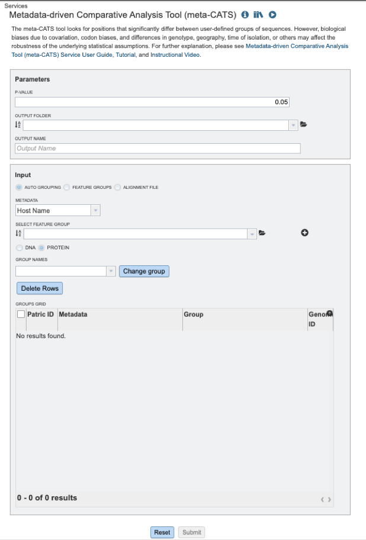

## Specifying meta-CATS parameters

1\. Users will need to specify the required P-value (calculated during the chi-square test of independence). If none is selected, the default p-value will be 0.05, ie: if the resulting p-value from any column > 0.05, then that column will not be displayed in the results. 

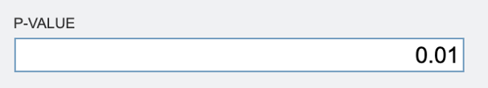

2\.	To specify output parameters, users will need to select an output folder in their workbench or create one if an appropriate folder is not available (red arrow). Users will also be prompted to specify an “Output Name” (red box) for the job result, before the job can be submitted. 

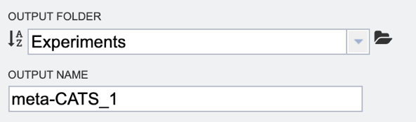

3\.	Next users will need to select their desired input files. There are three ways to select input files: 

   * Use “Auto Grouping” to sort sequences in saved feature groups. Users can select one or more feature groups (working sets) from the  workspace (workbench). Users can then select the desired metadata field to group sequences by host, country, year, virus type, etc. 

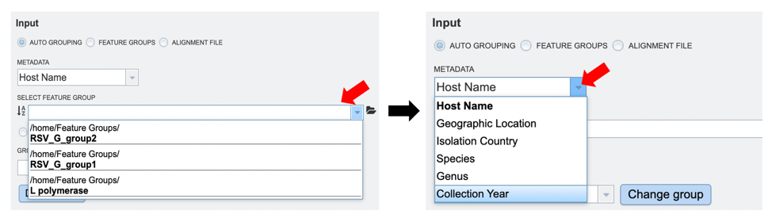

   * User specified feature groups. Users can select their own previously customized  feature groups from data saved or uploaded to their workspace, by selecting “Feature Groups” and clicking on the folder icon next to the “Select Feature Group” input box, as shown below. 

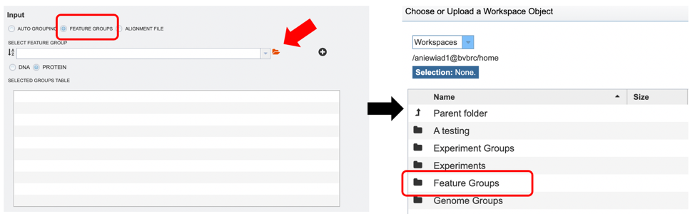

After selecting the desired files, users can add them to the “Selected Groups Table” by clicking the “+” icon as shown in the image below (red arrow).  

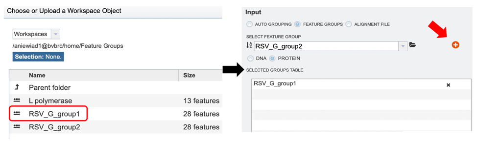

   * User specified multiple sequence alignment (MSA) file with associated metadata. Users can select their own previously aligned files from data saved or uploaded to their workspace, by selecting “Alignment File”  (red box) and clicking on the folder icon next to the “Alignment File” input box. Users will then need to upload their own metadata file associated with the sequences in the MSA input file in the “Group File” box as shown below (red arrow). 

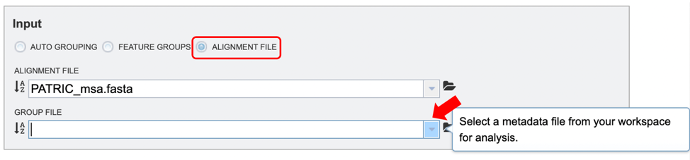

4\.	When the user has completed parameter and input file selection, the “Submit” button will become available.  

A message will appear below the box to indicate that the job is now in the queue. 

## Checking the status of the job

1\.	Click on the Jobs indicator at the bottom of the BV-BRC page. 

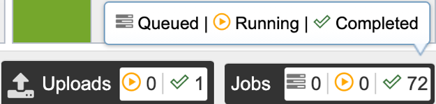

2\.	This will open the Jobs Status page where researchers can see the status of their annotation job. The statuses of all the service jobs that have been submitted to BV-BRC are also available. 

3\.	Once the job is completed, you can select the job by clicking on it and click the “View” button on the right-hand bar to see the results. 

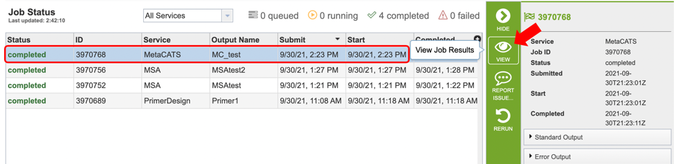

4\.	The results page will consist of a header describing the job and a list of output files, as shown below. 

5\.	The Meta-CATS Service generates several files that are deposited in the Private Workspace in the designated Output Folder. These include: 

   * **chisqTable.tsv** – a tab-separated value file with results for a “Chi-square Goodness” of fit test result: ie: positions that have significant non-random distribution between the specified groups
   * **mcTable.tsv** – a tab separated value file with results for adjusted  p-values for multiple comparisons.
   * **Mafft.log** – an output log file produced by the Mafft aligner. 

 ## Viewing meta-CATS results

1\.	After selecting the chisqTable.tsv or mcTable.tsv file, users can choose to either download (red box below) or view (red arrow) their results by selecting the appropriate button (Download or View respectively) on the green vertical Action Bar on the right-hand side of the page. 

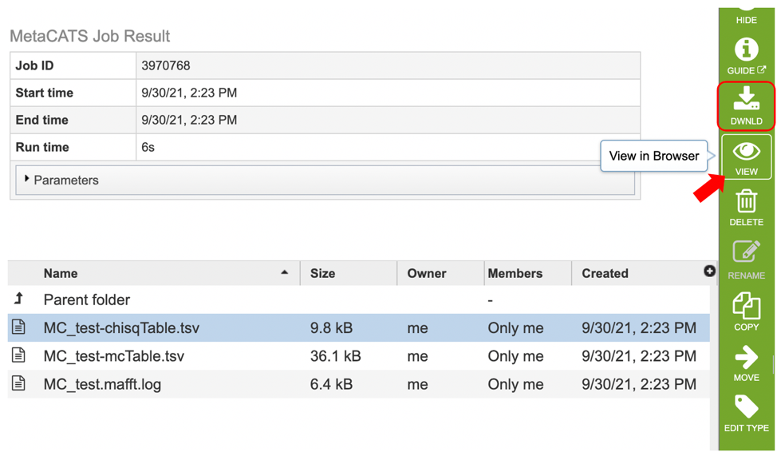

2\.	After selecting the view button, results will be displayed in tabular format as shown below. Table columns for the Chi-square table include: “Chi-square value”, “Position”, “P-value”, “Significant”, “Degrees of freedom”, “Fewer_5”, as well as columns displaying user specified groups. 

Users can sort results by increasing or decreasing values by clicking on the desired column as shown below (red arrow) , and further filter results by selecting appropriate keywords and the desired column to search from the dropdown menu pictured below (red box). 

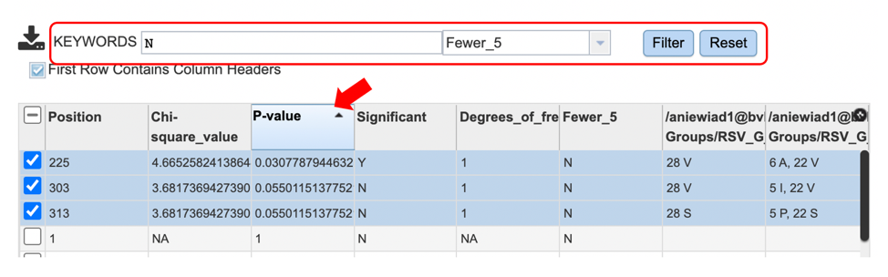

3\.	Table columns for the mc table include: 
“Position”, “Multiple_comparison_p-value”, “Significant” and “Groups.” Users can further sort and filter results as described above. Eg: Select Y (yes) for the “Significant” column to identify all positions with significant p values. 

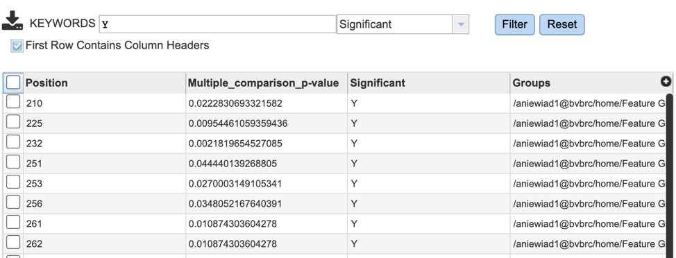