# Metagenomic Binning Service

*Revised: 14 November 2024*

The BV-BRC metagenomic binning service utilizes the BV-BRC database to furnish a large, diverse set of reference genomes. This is a service for supervised extraction and annotation of high-quality, near-complete genomes from reads or metagenomically-derived contigs [1]. Reads are assembled using either MetaSPAdes [2] or MEGAHIT [3].  Each set of binned contigs represents a draft genome that will be annotated by RASTtk [4] for bacteria, or with VIGOR4 [5,6] or  Mat_Peptide [7] for viruses. A structured-language binning report is provided containing quality measurements and taxonomic information about the contig bins. The BV-BRC metagenome binning service emphasizes extraction of high-quality genomes for downstream analysis using other BV-BRC tools and services.

Metagenomic binning jobs that include assembly take, on average, take an hour to complete.  However, the BV-BRC assembly service is quite popular, and there is often a long queue resulting in jobs taking 24 hours to complete.  If the size of the read file is large (Gb) or the queue is long, results could take several days.  

The code for the binning script is located at:
[https://github.com/SEEDtk/p3_code/blob/master/scripts/p3x-process-checkv.pl](https://github.com/SEEDtk/p3_code/blob/master/scripts/p3x-process-checkv.pl)

The code for the RASTtk pipeline is located at:
[https://github.com/SEEDtk/p3_code/blob/master/scripts/p3x-process-bins_generate.pl](https://github.com/SEEDtk/p3_code/blob/master/scripts/p3x-process-bins_generate.pl)

## Locating the Metagenomic Binning Service App  

1.	At the top of any BV-BRC page, clicking on the **Tools & Services** tab.  Click on **Metagenomic Binning** in the drop-down box, underneath **Metagenomics**.
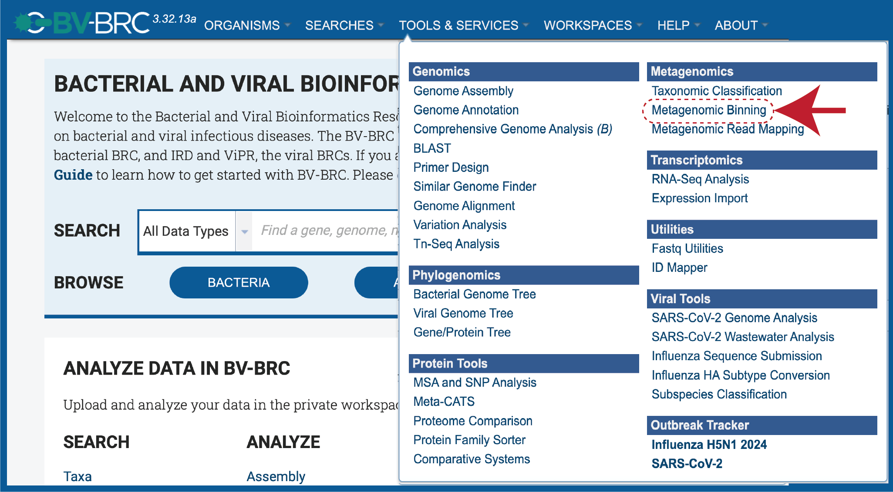

3.	This will open up the Metagenomic Binning Service landing page.  The default page shows starting with a read file.  
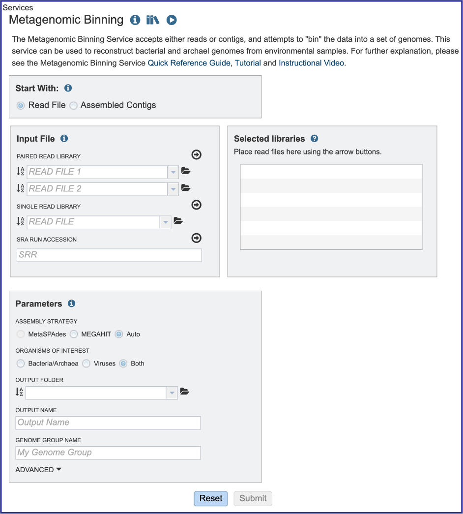

## Starting with reads or contigs  

1.	Researchers can assemble and annotate a genome, or they can submit contigs to just do an annotation.  The default setting has **Read File** selected in the **Start With** box.
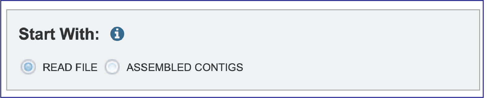

##  Submitting sequencing reads (single or paired)
The service accepts both single and paired reads.  Paired read libraries are usually given as file pairs, with each file containing the forward or reverse half of each read pair. Paired read files are expected to be sorted in such a way that each read in a pair occurs in the same Nth position as its mate in their respective files. These files are specified as READ FILE 1 and READ FILE 2. For a given file pair, the selection of which file is READ 1 or READ 2 does not matter.

Reads must first be uploaded to the BV-BRC workspace, and once there, they can be selected in several ways.
1.	Navigate to the workspace by clicking on the **Folder** icon at the end of the text box.  This will open a pop-up window.  Located the row that has the correct reads, and then click on that.  This will highlight the row.  Click on **OK** at the bottom of the pop-up box to select the reads. 

2.	Clicking on the **down arrow** at the end of the text box will open a drop-down box that shows the reads that have been selected most recently (top of list) to less frequently (down).  Clicking on the row that has the correct read will select those reads.
 
3.	Beginning to type the name of the read in the text box will open a drop-down box that shows reads ching that text.  Clicking on the row that has the correct read will select those reads.

4.	Multiple read pairs or single reads can be analyzed, but they must first be moved to the **Selected Libraries** box. Click on the **arrow** to the right of the selected reads.  This will move the file into the **Selected Libraries** box. 
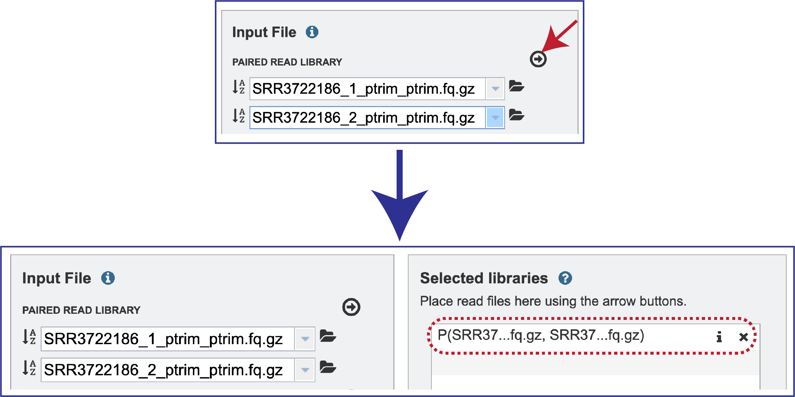

5.	Clicking on the inforion icon (**i**) will open a pop-up window that shows the reads selected, as well as where they are located in the workspace.
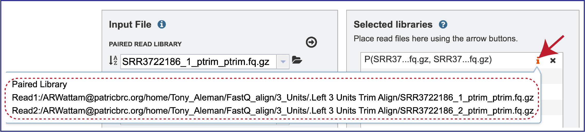

6.	Note that there is an **S** or **P** preceding the reads designates if they are single or paired.  Reads can be removed by clicking on the **X** at the end of the row where they are listed.

### Submitting reads that are present at the Sequence Read Archive (SRA)  

BV-BRC also supports analysis of existing datasets from SRA. If users submit SRA values, the BV-BRC will input the corresponding FASTQ files to the service. 

1.	To submit data from the SRA, locate the Run Accession number and copy it.  
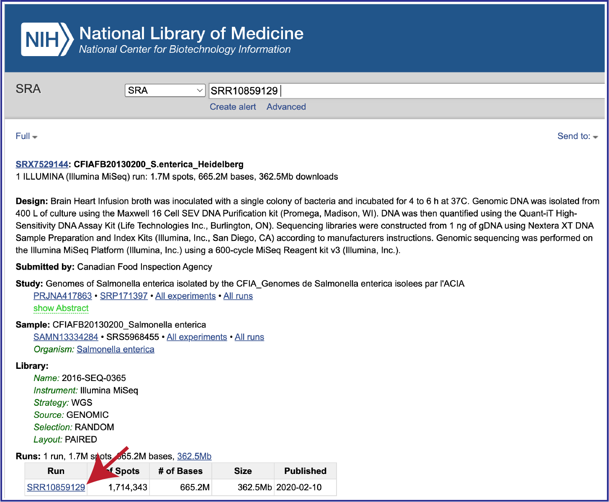

2.	Paste the copied accession number in the text box underneath SRA Run Accession, then click on the icon of an **arrow within a circle**. This will generate a dialog box above the text box that indicates that the service is validating the run number with SRA.  Once the verification is complete, the number will appear in the **Selected Libraries** box.

### Starting with contigs  

1. BV-BRC also supports analysis of contigs that have been assembled in or outside of the resource.  To submit contigs, you need to click on the **Assembled Contigs** button.  
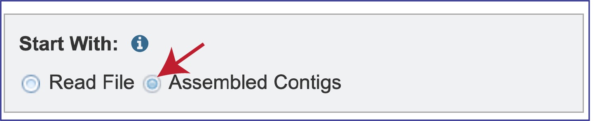

2.	This will reload the page to show contigs only as the **Input file**.  Selecting contig files are similar to what has been described for the read files above.  
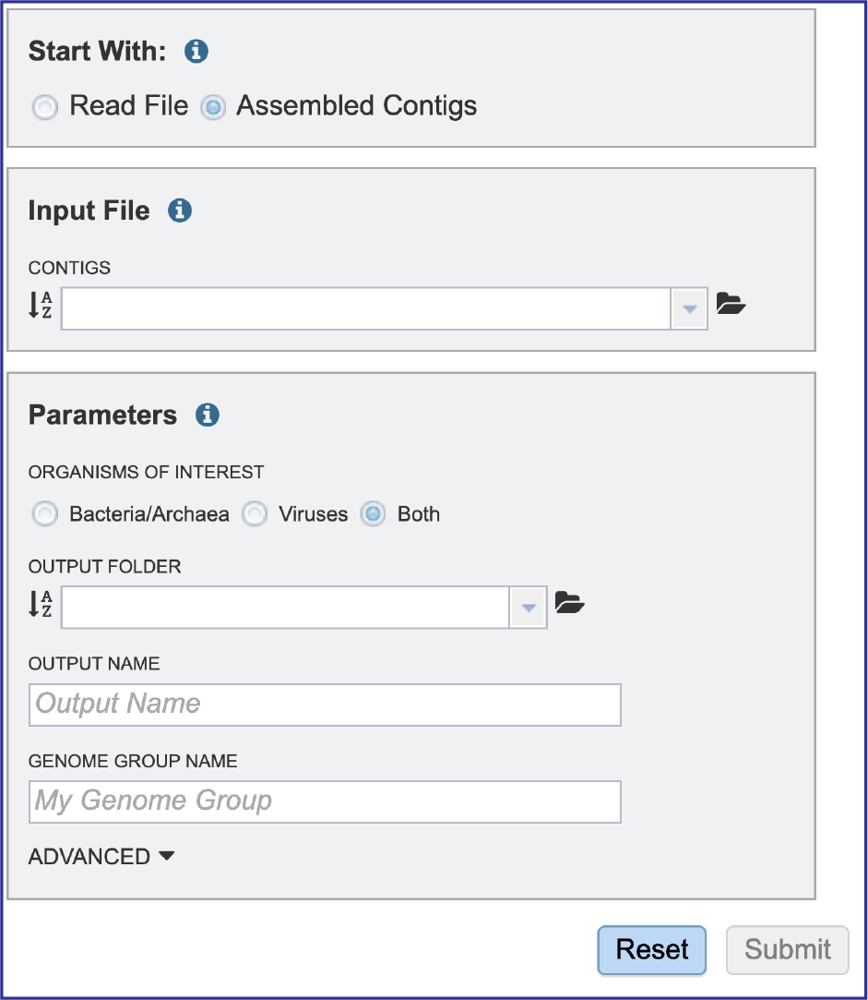

## Setting Parameters when reads are the input  

Parameters must be selected prior to the submission of the Metagenomic Binning job in BV-BRC.  The **Parameters** box changes slightly if one began with reads, or with contigs.

### Assembly Strategy  

1.	**Assembly Strategy**.  If reads had been selected in the **Start With** box, an assembly strategy must be selected.  Clicking on the down arrow that follows the text box under Assembly Strategy will open a drop-down box that shows all the strategies that BV-BRC offers.  A description of each strategy is listed below. 
 
    * The **MetaSPAdes**[2] software is part of the SPAdes toolkit, and requires paired reads. The latest version of the SPAdes toolkit that includes metaSPAdes is available here (http://cab.spbu.ru/software/spades/).
    * **MEGAHIT**[3] is a *de novo* assembler that can assemble either paired or single reads. The MEGAHIT software is available here: https://github.com/voutcn/megahit).  
    * If **Auto** is selected, MetaSPAdes will run if paired reads are submitted, and MEGAHIT  will run if single reads have been submitted. 

2.	**Organisms of Interest** must be selected.  Clicking on **Bacteria/Archaea** will only show those results, clicking on **Viruses** will only show those, and clicking on **Both** will show all of those results.  
    * If **Bacteria/Archaea** are selected, the RASTtk[4] annotation pipeline will be used. The code for the RASTtk pipeline is located at https://github.com/SEEDtk/p3_code/blob/master/scripts/p3x-process-bins_generate.pl
    * Selection of **Viruses** will use one of two annotation pipelines. The first pipeline is VIGOR4[5,6].  (The software for the VIGOR pipeline is located at: https://github.com/JCVenterInstitute/VIGOR4). If VIGOR4 does not find a virus match, the MatPeptide[7] pipeline is used. (The software for the Mat_peptide pipeline is available at:  https://github.com/VirusBRC/vipr_mat_peptide)

    * When selecting **Both** the bacterial/archaeal and viral pipelines will both be run.  The workflow for this strategy is available at the top of this tutorial.

3.	**Output Folder**. An output folder must be selected for the metagenomic binning job.  Typing the name of the folder in the text box underneath the words **Output Folder** will show a drop-down box that shows close hits to the name.  

4.	Clicking on the arrow at the end of the box will open a drop-down box that shows the most recently created folders.  

5.	To find a previously created folder, or to create a new one, click on the folder icon at the end of the text box.  This will open a pop-up window that shows all the previously created folder.  

6.	Click on the folder of interest, and then click the **OK** button in the lower right corner of the window.  

7.	**Output Name**. A name for the job must be included prior to submitting the job.  Enter the name in the text box underneath the words Output Name.  

8. **Genome Group Name**.	The metagenome binning service currently creates a series of single-bin annotations and a genome group which supports some rudimentary multi-genome functionality, e.g. protein family heatmaps.  A name for the genome group that will be generated must be included prior to submitting the job.  Enter the name in the text box underneath the words **Genome Group Name**.  

9. **ADVANCED**.  Clicking on the down arrow following **ADVANCED** will extend the **Parameters** box.
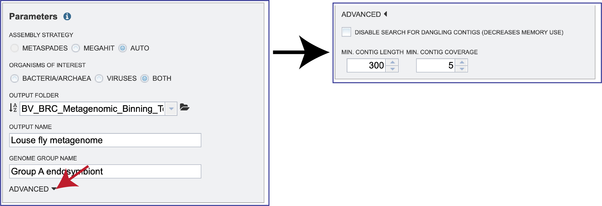

10.  A checkbox in front of **Disable search for dangling contigs (Decreases memory use)**.  This deserves some explanation.  After contigs are binned using kmers, there is a second step that looks for large DNA segments (generally 50 or more base pairs) that the contigs have in common; in particular, sequences near the end of one contig that are also found in another contig (hence the “dangling” reference).  It generally finds a small number of contigs, and it is very memory intensive.  If the sample causes an out-of-memory error during binning (as opposed to the normal case in assembly), you can uncheck that box and will generally get a successful run.

11. **Min Contig Length** and **Min Contig Coverage** can be adjusted by clicking on the up and down arrows at the end of the text boxes.

## Submitting the Metagenomic binning job  
1.	Once the input data and the parameters have been selected, the Submit button at the bottom of the page will turn blue.  The metagenomic binning job will be submitted once this button is clicked. Once submitted, the job will enter the queue.  You can check the status of your job by clicking on the Jobs monitor at the lower right.  

## Finding the completed Metagenomic binning job  

1.	There are two places to access a completed job in BV-BRC.  Clicking on the **Workspaces** tab, and then on **My Jobs** in the drop-down box.  Researchers can also click on the **Jobs** icon at the bottom right of any page.  Either of those actions will open the list of jobs that have been submitted.
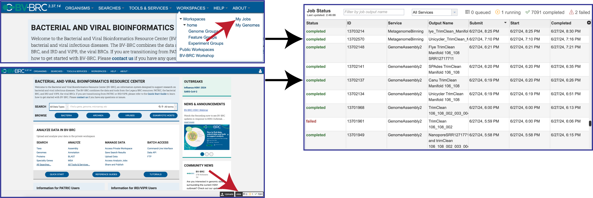

2.	Once located, the job can be viewed by first clicking on the row that has the name, and then clicking on the **View** icon in the green action bar.  

## Metagenomic binning job results 
The Metagenomic Binning service returns a number of files when the job is completed.  Every job returns one or two **Binning Reports**, depending upon the selection of **Bacteria/Archaea**, **Viruses** or **Both** in the **Organisms of Interest**.  If the job was able to assemble or annotate genomes, a **bin** (demarked by a checkered flag) will be present, and these have additional files within them.  There will also be **.fa** files for each genome, bacterial or viral, that are returned.  These are the contig files.  Finally, there are other files returned (**bins.json**, **bins.stats.txt**,**coverage.stat.txt** and others).  Details on each of those files are described below.
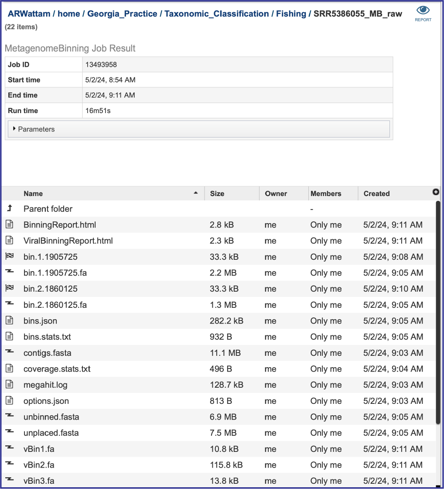

*Binning Reports*
1.	If **Both** was selected under **Organisms of interest**, there will be two binning reports of slightly different formats.
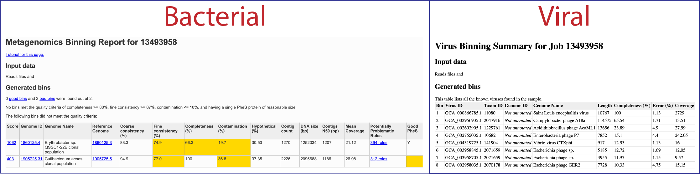

3.	To view the Viral Binning report, click on the row that contains **ViralBinningReport.html**  and then on the **View** icon in the green action bar.  This will rewrite the page to show the binning report. The top part of the page shows the input data, and the lower part shows information on the generated bins.  Each of the columns contains specific information:
*	**Bin**: The number of the particular viral bin.  The table will show all the bins that were generated.
*	**Virus ID**: This is the GenBank accession number for the reference used for this binned genome.
*	**Taxon ID**:  This is the taxonomy ID for the reference used for this binned genome.
*	**Genome ID**: The ID number assigned to the genome in BV-BRC that represents the bin. Clicking on this number takes you to the genome.  If the viral genome is not one that BV-BRC currently annotated, this cell will say Not annotated.
*	**Genome Name**:  The name given to the bin. This is usually the species of the closest reference genome.
*	**Length**: The number of DNA base pairs in the bin.
*	**Completeness (%)**: CheckV[8] is used to estimates genome completeness.  It bases this score on comparison with a large database of complete viral genomes derived from NCBI GenBank and environmental samples and reports a confidence level for the estimate.
*	**Error (%)**: CheckV reports a confidence level for each AAI-based estimate according to the expected relative unsigned error rate: high confidence (0–5% error), medium confidence (5–10% error) or low confidence (>10% error).
*	**Coverage (%)**: The average coverage for contigs in the bin. 
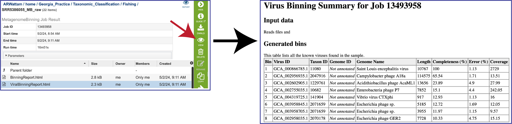

3.	To view the Bacterial Binning report, click on the row that contains **BinningReport.html**  and then on the **View** icon in the green action bar.
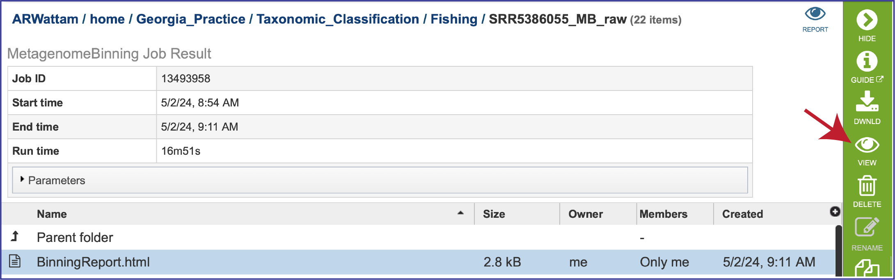

4.	This will rewrite the page to show the bacterial binning report. The top part of the page shows information about the binning job. Immediately below is a brief description of the results. The binning report shows all of the bins found by the BV-BRC metagenomic processor. The bins are divided into two categories– those of high quality (good) and those of questionable quality (bad).  Each of the columns contains specific information:
*	**Score**: A weighted sum of the completeness and consistency scores, less the contamination score. The contamination is weighted very heavily, so a highly contaminated bin may have a negative score. The maximum score is 2090 and the minimum score is -5000. The bins are sorted from the highest score to the lowest. Clicking on this number takes you to the detail report on the bin.
*	**Genome ID**: The ID number assigned to the genome in BV-BRC that represents the bin. Clicking on this number takes you to the genome.
*	**Genome Name**: The name given to the bin. This is usually the species of the closest reference genome followed by the phrase clonal population.
*	**Reference Genome**: The ID of the reference genomes used to create the bin. There is usually only one. Sometimes there are two, indicating that the bin represents multiple strains that could not be easily distinguished during the binning. 
*	**Coarse Consistency**: The percent of predictable roles whose presence or absence matches the computations of the consistency tool. A high coarse consistency indicates the bin is either a single genome or a cluster of very close strains.
*	**Fine Consistency**: The percent of predictable roles whose number of occurrences matches the computations of the consistency tool. This number is always lower than the coarse consistency. A high fine consistency indicates a bin that can be treated like a functioning genome. A fine consistency of 87% is the minimum required for a bin to be considered a good genome.
*	**Completeness** and **Contamination**: Two internal BV-BRC tools are used– EvalG[9], which computes completeness and contamination using marker roles, and EvalCon[9], which determines whether the proteins found in the genome make sense together. A genome that is sufficiently complete (80%), with sufficiently low contamination (10%), and sufficiently consistent proteins (87%) is considered good and is shown in the first table.  
*	**Hypothetical**: The percent of the annotated proteins in the genome that are named “Hypothetical.” A high percental of hypothetical proteins is an indication of a poor-quality genome.
*	**Contig count**:  The number of contigs from the assembled sample that were placed in the bin.
*	**DNA size (bp)**:  The number of DNA base pairs in the bin.
*	**Contigs N50 (bp)**: A statistical measure of the relative contig sizes: a higher number indicates a better assembly. This is the size of the longest contig such that half of the base pairs are in contig this size or larger.
*	**Mean coverage**:  The average coverage for contigs in the bin. If no coverage information was provided, this will be 50 for every bin.
*	**Potentially Problematic Roles**:  The number of roles that failed the consistency or completeness/contamination checks. Clicking on the numbers in this column takes you to the bin’s detail report, which includes a list of the roles in question.
*	**Good PheS**:  A Yes, or “Y” here indicates that the bin contains a single PheS protein of reasonable size, otherwise it is left blank. Because the PheS is used to identify the reference genomes of the bin, a questionable PheS protein is considered a serious problem with the bin.
*	A **yellow cell** indicates a score that is problematic for the quality of the bin.
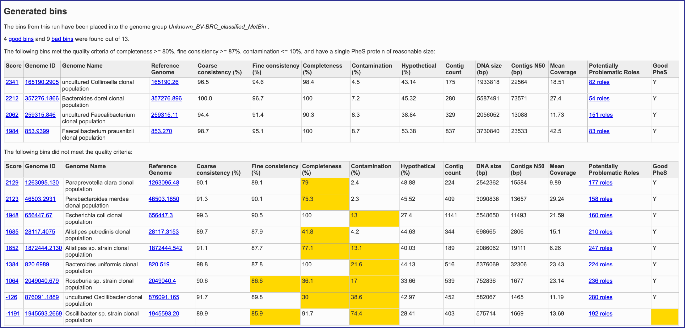

5.	Several of the cells in the binning report are hyperlinks.  The number underneath **Score** is a hyperlink that opens the **GenomeReport**.  The one underneath **GenomeID** is actually the unique identifier assigned to that particular genome.  If clicked, the landing page for that private genome will open.  Underneath **Reference Genome** is the unique identifier for the genome that served as a reference for this particular annotation job, and clicking on it will open the landing page for that genome.  Finally, **Potentially Problematic Roles** is on top of a number that describes the number of annotated genes that have potential problems.  Clicking on it will open the **GenomeReport**, where you can scroll down and see the number of problematic genes in the newly annotated genome.
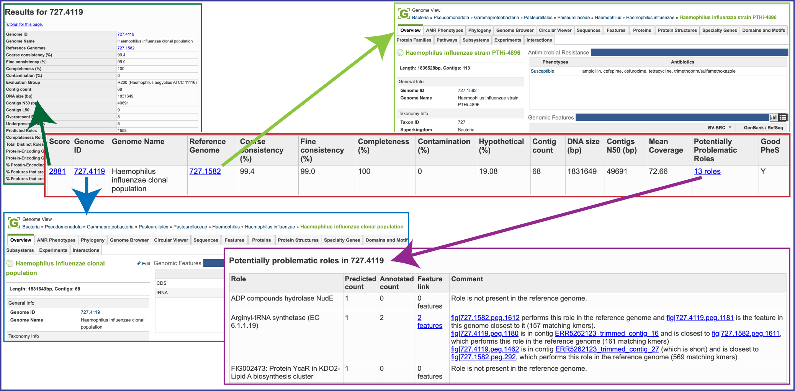

7.	When a binned virus can be annotated by the BV-BRC viral annotation pipeline, the viral binning report will provide a hyperlink to the genome landing page for that virus.
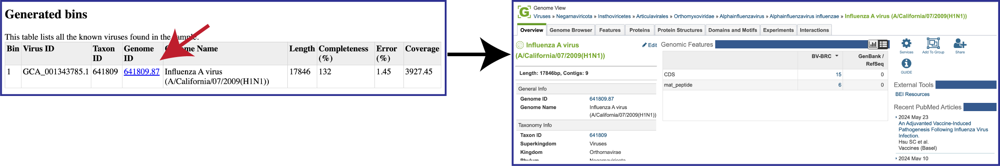

*Bins and contig files*
1.	The metagenomic binning job will return a bin for each genome that has been annotated by the pipeline.  The bacterial bins start with **bin** and have a checkered flag before the name, and the viral bins that can be annotated by BV-BRC begins with **vBin**.  Viruses that cannot be annotated at this time do not have a binning job with a checkered flag.  Bacterial contigs are found in the rows that being with **bin** and end with **.fa**.  The viral contigs begin with **vBin** and also end with **.fa**. 
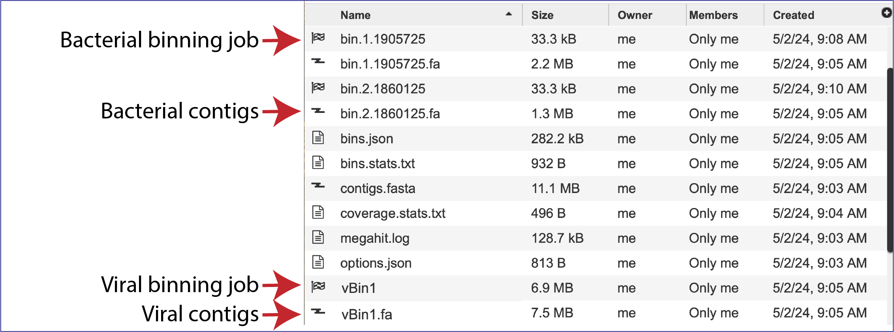

2.	The details in both bacterial and viral binning jobs can be accessed by double clicking on the row that has the checkered flag. Details on the files returned by the annotation jobs that produce these bins can be found in the Annotation Tutorial (https://www.bv-brc.org/docs/tutorial/genome_annotation/genome_annotation.html).
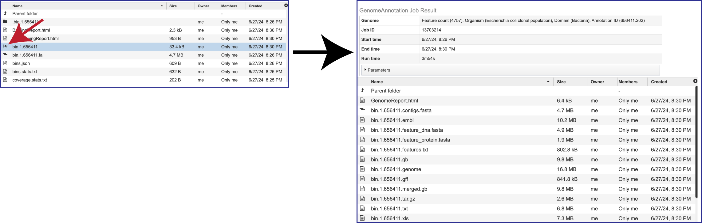

3.	The pipeline produces additional contig files.  One of these is the data that cannot be mapped to the selected organisms.  The file that contains these contigs is called **unbinned.fasta**.
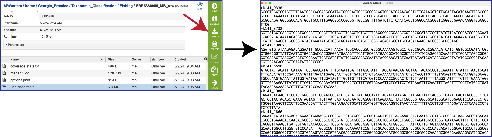

4.	The **unplaced.fasta** file includes the contigs actually the “Unmatched 12-mer contigs” that can be seen in the diagram at the top of this tutorial.  
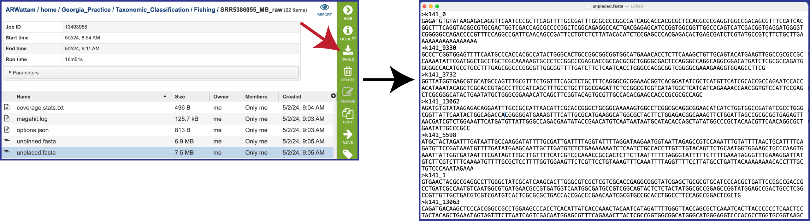

*Other Job Result Files*
1.	The pipeline also produces a json file.  A JSON file which stores simple data structures and objects in JavaScript Object Notation (JSON) format. It is primarily used for transmitting data between a web application and a server.  If you want to see what it looks like, you can select the row that contains the **bins.json**, and then click the **View** icon in the vertical green bar to the right. This will open a view of the json file.
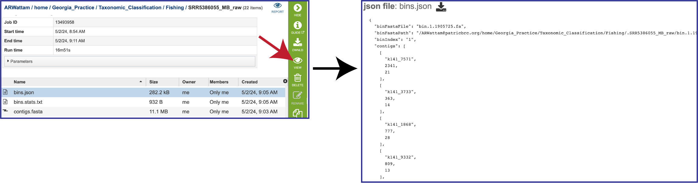

2.	The pipeline also produces a file on the statistics of the bacterial bins found in the **bins.stats.txt**file.  As mentioned above, selecting the row that contains this file will highlight the vertical green bar to the right with possible downstream functions.  To view it, click on the **View** icon. The file will appear in the view.  It shows the data associated with the bins.

3.	The pipeline also produces a file on the coverage statistics of the bacterial bins.  To view that, click on the row that contains the **coverage.stats.txt** file and then on the **View** icon. This will open the file, which shows the assembly statistics associated with the bacterial bins.  **contigLen**  shows the number of contigs that the pipeline produced that match that particular size in base pairs (> 1000 bp = 0000K).  **contigOut**  shows the number of contigs called by the assembly pipeline and written to the output.  **contigFound** shows the number of contigs read in from the FASTA file. Coverage statistics are also provided. The **coverageOut**  shows the contigs that have coverage data, and the **cov** rows show the number of contigs with that particular coverage (.1% =0X).  If the contig is too short or its coverage is too low, it won’t be written out. The **dataLineFound** is an input fasta line that contains sequence data rather than an ID and comment. **letters** is the total number of DNA letters. **fastaLineIn** is any input line from a FASTA file.

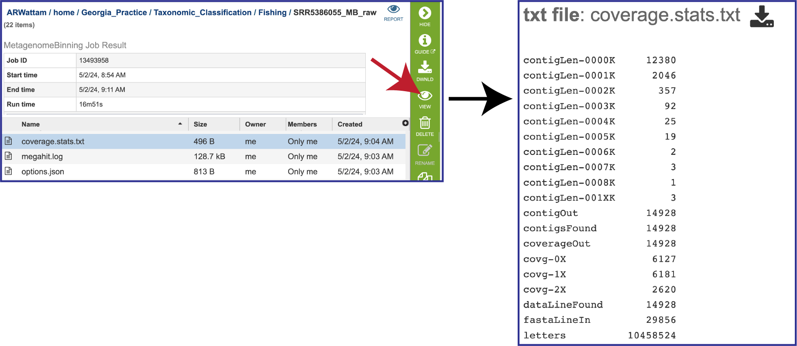

4.	The **megahit.log** file is generated if MEGAHIT was used to assemble the contigs.  The log file shows the steps that that the assembler took to generate the contigs.
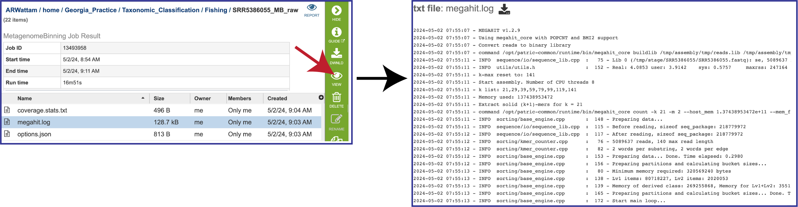

5.	The **options.json** file is generated if MEGAHIT was the used to assemble the contigs.  It shows the assembler megahit options, including the default values that were not explicitly selected.
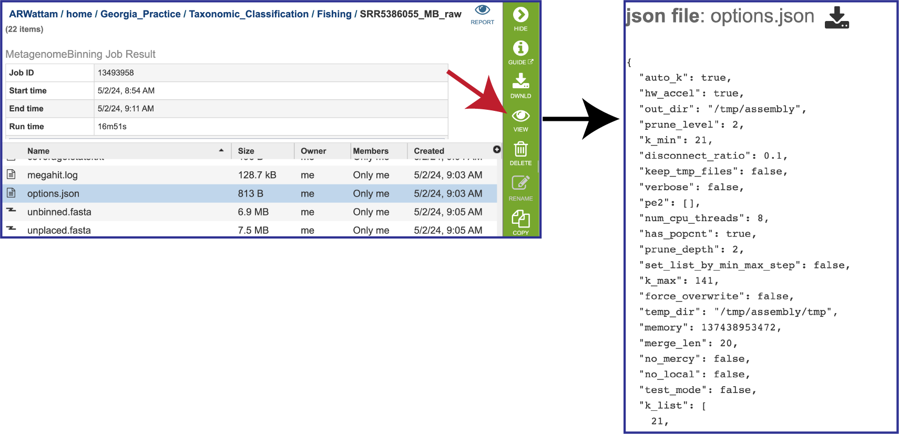

6.	If MetaSPAdes was used to assemble the contigs, the **spades.log** file shows the steps that that the assembler took to generate the contigs.
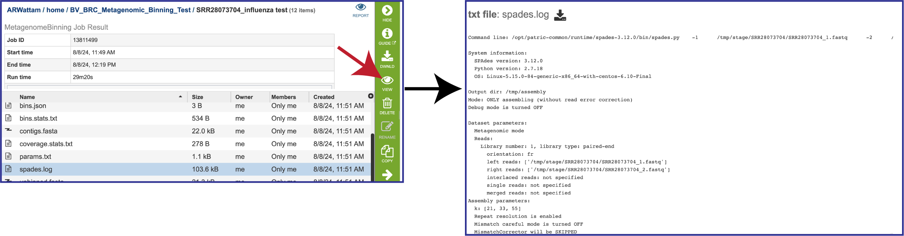

7.	The **params.txt** file is generated if MetaSPAdes was the used to assemble the contigs.  It shows the assembler SPAdes options, including the default values that were not explicitly selected.
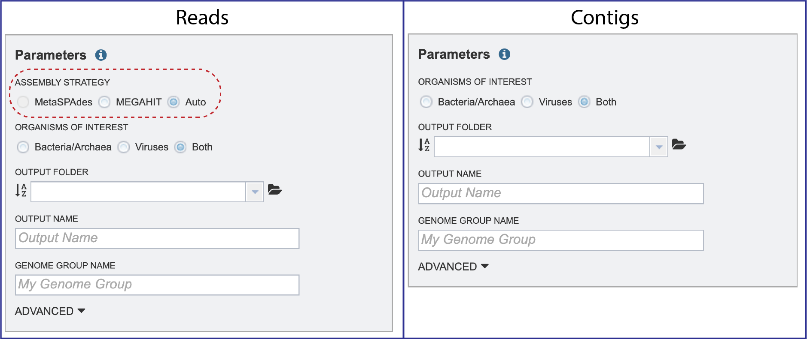

## References  
1. Parrello, B., Butler, R., Chlenski, P., Pusch, G. D. & Overbeek, R. Supervised extraction of near-complete genomes from metagenomic samples: A new service in PATRIC. Plos one 16, e0250092 (2021).
2. Nurk, S., Meleshko, D., Korobeynikov, A. & Pevzner, P. A. metaSPAdes: a new versatile metagenomic assembler. Genome research 27, 824-834 (2017)
3. Li, D. et al. MEGAHIT v1. 0: a fast and scalable metagenome assembler driven by advanced methodologies and community practices. Methods 102, 3-11 (2016).
4. Brettin, T. et al. RASTtk: a modular and extensible implementation of the RAST algorithm for building custom annotation pipelines and annotating batches of genomes. Scientific reports 5, 8365 (2015).
5. Wang, S., Sundaram, J. P. & Spiro, D. VIGOR, an annotation program for small viral genomes. BMC bioinformatics 11, 1-10 (2010).
6. Wang, S., Sundaram, J. P. & Stockwell, T. B. VIGOR extended to annotate genomes for additional 12 different viruses. Nucleic acids research 40, W186-W192 (2012).
7. Larsen, C. N. et al. Mat_peptide: comprehensive annotation of mature peptides from polyproteins in five virus families. Bioinformatics 36, 1627-1628 (2020).
8.Nayfach, S. et al. CheckV assesses the quality and completeness of metagenome-assembled viral genomes. Nature biotechnology 39, 578-585 (2021).
9. Parrello, B. et al. A machine learning-based service for estimating quality of genomes using PATRIC. BMC bioinformatics 20, 1-9 (2019).

