# Metagenomic Binning

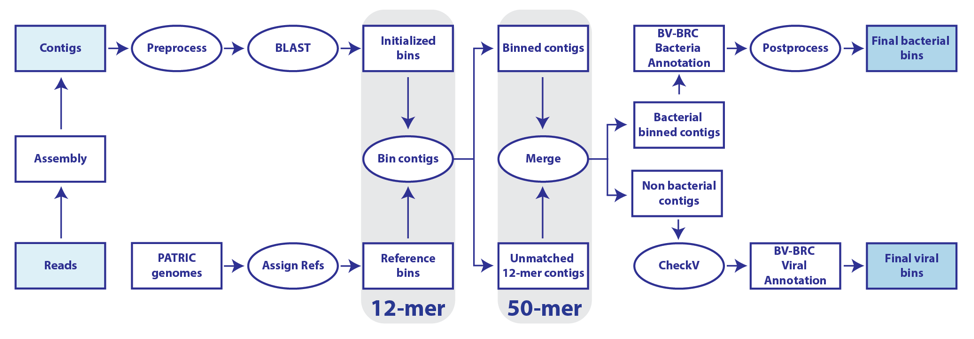

The BV-BRC metagenomic binning service utilizes the BV-BRC database to furnish a large, diverse set of reference genomes. This is a service for supervised extraction and annotation of high-quality, near-complete genomes from reads or metagenomically-derived contigs. Reads are assembled using either MetaSPAdes1 or MEGAHIT2.  Each set of binned contigs represents a draft genome that will be annotated by RASTtk3 for bacteria, or with VIGOR44,5 or  Mat_Peptide6 for viruses. A structured-language binning report is provided containing quality measurements and taxonomic information about the contig bins. The BV-BRC metagenome binning service emphasizes extraction of high-quality genomes for downstream analysis using other BV-BRC tools and services.

Metagenomic binning jobs that include assembly that, on average, take an hour to complete.  However, the BV-BRC assembly service is quite popular, and there is often a long queue resulting in jobs taking 24 hours to complete.  If the size of the read file is large (Gb) or the queue is long, results could take several days.  

The code for the binning script is located at:
https://github.com/SEEDtk/p3_code/blob/master/scripts/p3x-process-checkv.pl

The code for the RASTtk pipeline is located at:
https://github.com/SEEDtk/p3_code/blob/master/scripts/p3x-process-bins_generate.pl

## Creating a folder to hold the metagenomic binning job and related data

1. It is always good practice to create a folder to keep the results from a particular experiment or project in order. To create a new folder, go to the Workspaces tab and click on home.  
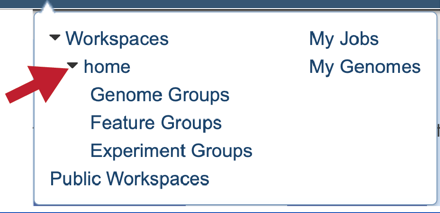

2. This will open the home directory on your workspace. To create a new folder, click on the Add Folder icon at the top right of the table.  

3. This will open a pop-up window. Note that the Create Folder button is greyed out.  Type the desired name in the text box.  

4. Once the name is entered, the Create Folder icon will turn blue. To create the folder, click on that button.  
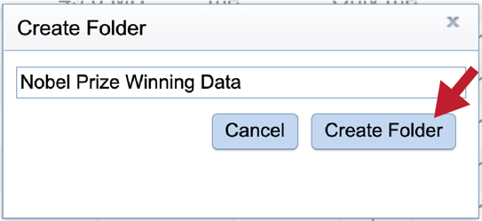

5. The pop-up window will disappear. At the button left of the page you will see a temporal message indicating that the folder was successfully created.  

## Locating the Metagenomic Binning Service App  

1.	At the top of any BV-BRC page, find the Services tab  

2.	In the drop-down box, underneath Genomics, click on Annotation.  
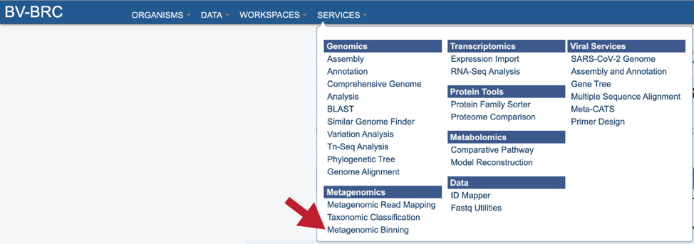

3.	This will open up the Metagenomic Binning Service landing page.  The default page shows starting with a read file.  
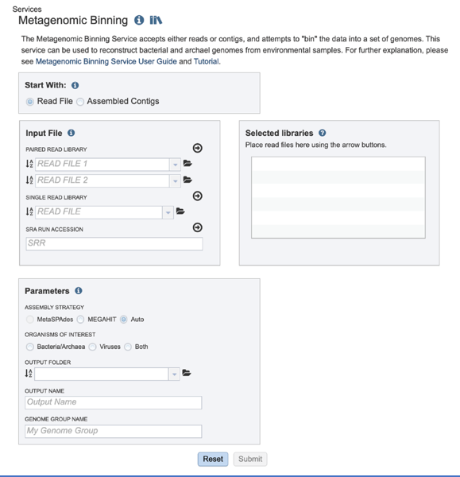

## Selecting a read file for metagenomic binning  

### Uploading paired end reads  

1.	To upload a fastq file that contains paired reads, locate the box called “Paired read library.”  
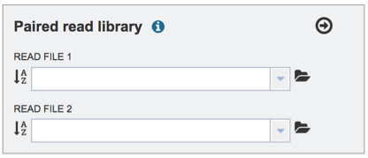

2.	The reads must be located in the workspace. To initiate the upload, first click on the folder icon.  
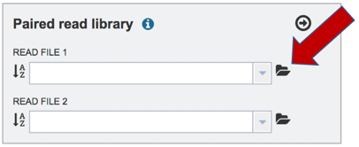

3.	This opens up a window where the files for upload can be selected. If you want to upload data directly to your home directory, click on the icon with the arrow pointing up.  
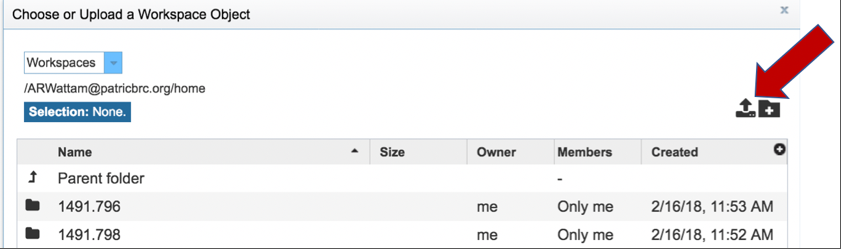

4.	You can also navigate to a desired folder. Use the scroll bar at the left of the pop-up window to see all the data in your directory.  When the desired folder is found, click on it. This will open that directory in the window, where you can use the upload icon to upload data directly to the selected folder.  

5.	This opens a new window where the file you want to upload can be selected. Note that as you entered through a specific service and file format (Metagenomic Binning, selecting read files), the upload type is set to Reads.  Not only will it look for read files in your computer interface, but it will also tag the uploaded files that way.  This is important for BV-BRC services, as any service that uses reads can “see” these files.  Click on the “Select File” in the blue bar.  
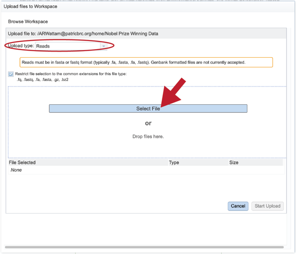

6.	This will open a window that allows you to choose files that are stored on your computer. Select the file where you stored the fastq file on your computer and click “Open”.  
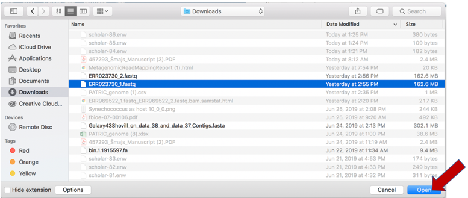

7.	Once selected, it will autofill the name of the file. Click on the Start Upload button.  
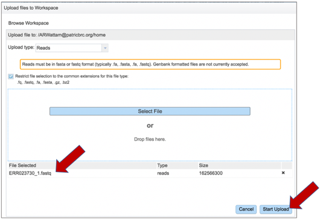

8.	This will auto-fill the name of the document into the text box.  
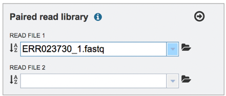

9.	Pay attention to the upload monitor in the lower right corner of the BV-BRC page. It will show the progress of the upload. Do not submit the job until the upload is 100% complete.  

10.	Repeat to upload the second pair of reads.  
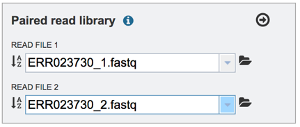

11.	To finish the upload, click on the icon of an arrow within a circle. This will move your file into the Selected libraries box.  
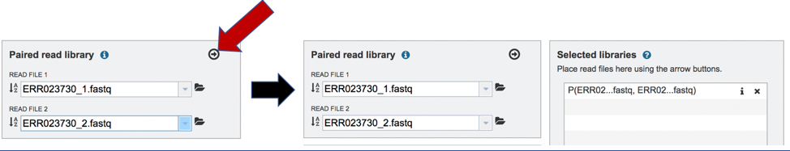

### Uploading single reads

1.	To upload a fastq file that contains single reads, locate the text box called “Single read library.” If the reads have previously been uploaded, click the down arrow next to the text box below Read File.  
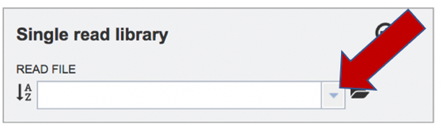

2.	This opens up a drop-down box that shows the all the reads that have been previously uploaded into the user account. Click on the name of the reads of interest.  
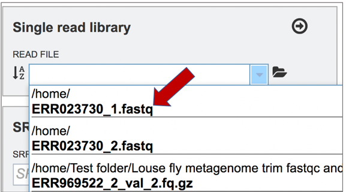

3.	This will auto-fill the name of the file into the text box.  
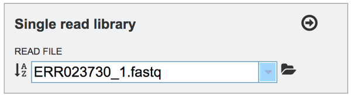

4.	To finish the upload, click on the icon of an arrow within a circle. This will move the file into the Selected libraries box.  
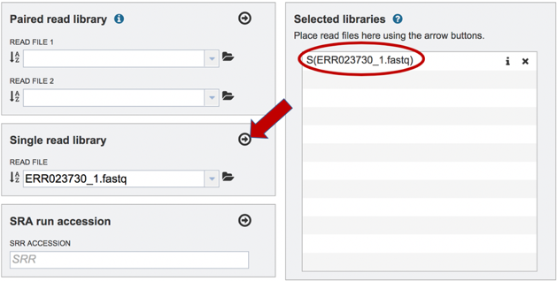

### Submitting reads that are present at the Sequence Read Archive (SRA)  

1.	BV-BRC also supports analysis of existing datasets from SRA. To submit this type of data, locate the Run Accession number that you will find at SRA and copy it.  
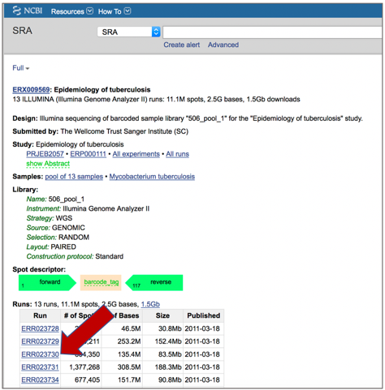

2.	Paste the copied accession number in the text box underneath SRA Run Accession, then click on the icon of an arrow within a circle.  This will move the file into the Selected libraries box.  
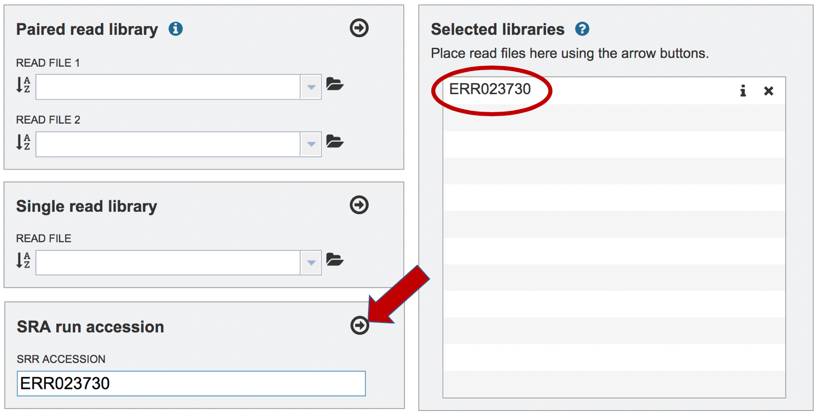

### Submitting contigs  

1.	BV-BRC also supports analysis of contigs that have been assembled in or outside of the resource.  To submit contigs, you need to click on the Assembled Contigs button.  
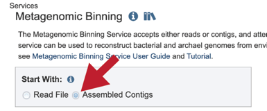

2.	This will reload the page to show contigs only as the Input file.  Uploading files are similar to what has been described for the read files above.  
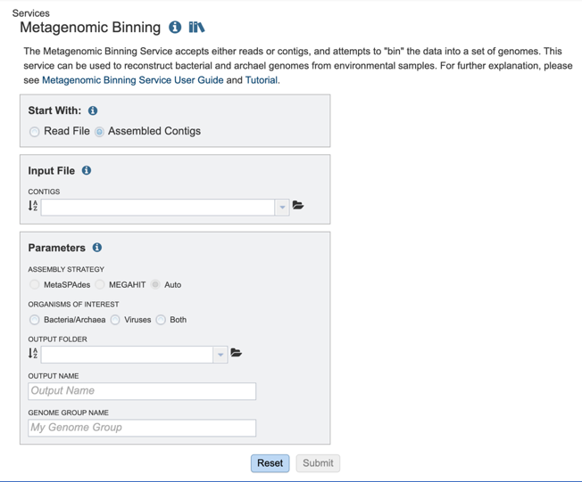

## Setting Parameters when reads are the input  

Parameters must be selected prior to the submission of the Metagenomic Binning job in BV-BRC.  
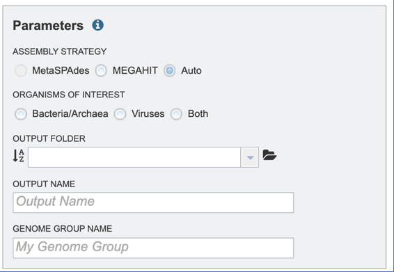

### Assembly Strategy  

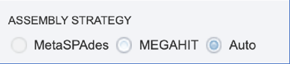

1.	The assembly strategy for the reads must be selected.  Clicking on the down arrow that follows the text box under Assembly Strategy will open a drop-down box that shows all the strategies that BV-BRC offers.  A description of each strategy is listed below.  
    * The metaSPAdes(1) software is part of the SPAdes toolkit, developed to address the various challenges of metagenomic assembly.  The latest version of the SPAdes toolkit that includes metaSPAdes is available here (http://cab.spbu.ru/software/spades/).

    * MEGAHIT is a de novo assembler for assembling large and complex metagenomics data(2). The MegaHit software is available here: https://github.com/voutcn/megahit.  MEGAHIT assembles the data as a whole (i.e., no preprocessing like partitioning and normalization).

### Organisms of Interest  

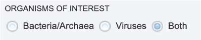

1.	Organisms of interest must be selected.  Clicking on Bacteria/Archaea will only show those results,  clicking on Viruses will only show those, and clicking on Both will show all of those results.  
    * If **Bacteria/Archaea** are selected, the RASTtk3 annotation pipeline will be used. The code for the RASTtk pipeline is located at https://github.com/SEEDtk/p3_code/blob/master/scripts/p3x-process-bins_generate.pl

    * Selecting **Viruses** will use one of two annotation pipelines. Other viruses are first run through the VIGOR4(4,5) pipeline.  (The software for the VIGOR pipeline is located at: https://github.com/JCVenterInstitute/VIGOR4). If that does not find a virus match, the Mat Peptide6 pipeline is used.

    * When selecting **Both** the bacterial/archaeal and viral pipelines will be run.  The workflow for this strategy is available at the top of this tutorial.

### Output Folder

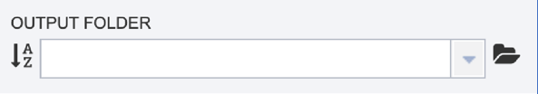

1.	An output folder must be selected for the metagenomic binning job.  Typing the name of the folder in the text box underneath the words Output Folder will show a drop-down box that shows close hits to the name.  
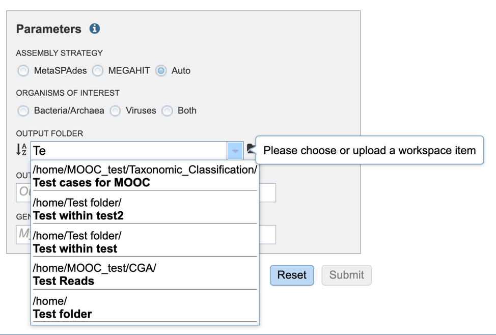

2.	Clicking on the arrow at the end of the box will open a drop-down box that shows the most recently created folders.  
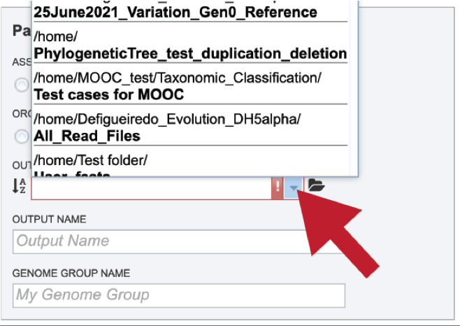

3.	To find a previously created folder, or to create a new one, click on the folder icon at the end of the text box.  This will open a pop-up window that shows all the previously created folder.  
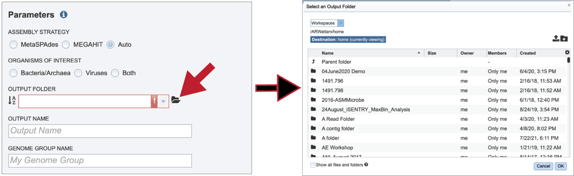

4.	Click on the folder of interest, and then click the OK button in the lower right corner of the window.  
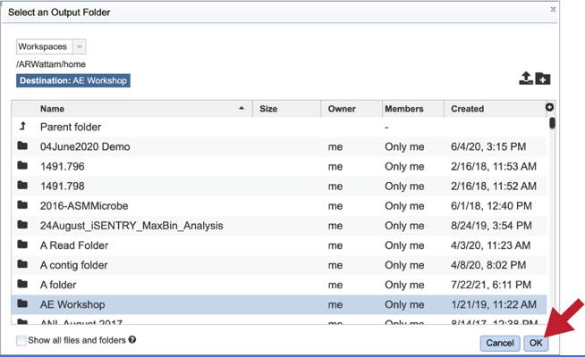

### Output Name  

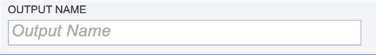

1.	A name for the job must be included prior to submitting the job.  Enter the name in the text box underneath the words Output Name.  

### Genome Group Name  

1.	The metagenome binning service currently creates a series of single-bin annotations and a genome group which supports some rudimentary multi-genome functionality, e.g. protein family heatmaps.  A name for the genome group that will be generated must be included prior to submitting the job.  Enter the name in the text box underneath the words Genome Group Name.  

## Submitting the Metagenomic binning job  
1.	Once the input data and the parameters have been selected, the Submit button at the bottom of the page will turn blue.  The metagenomic binning job will be submitted once this button is clicked. Once submitted, the job will enter the queue.  You can check the status of your job by clicking on the Jobs monitor at the lower right.  
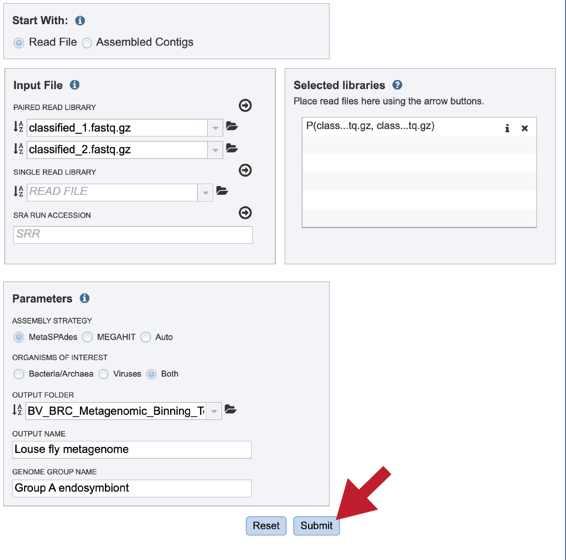

## Finding the completed Metagenomic binning job  

1.	There are two places to access a completed job in BV-BRC or PATRIC.  Clicking on the Jobs icon at the bottom right of any page will open the list of jobs that have been submitted.  
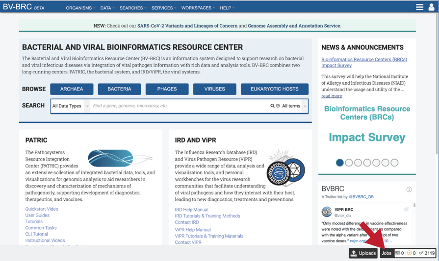

2.	A complete list of all completed jobs will appear from most recent to first job.  Clicking on any of the column heads will resort the page to sow the results in that order.  
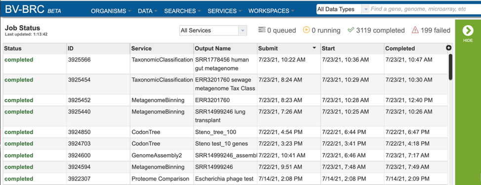

3.	Clicking on an individual job or row will show possible downstream functions, which appear as icons, in the vertical green bar to the right of the list.  Clicking on the View icon will rewrite the page to show the results of the selected job.  
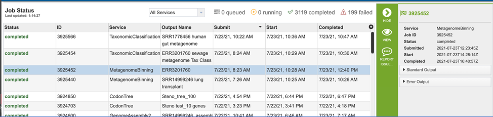

4.	The files produced by the specific job will be shown on the Jobs results page.  As with the Jobs page, clicking on an individual row will populate the vertical green bar with possible action icons, like viewing or downloading the data.  
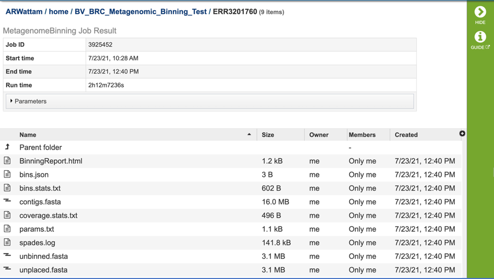

5.	Completed jobs can also be access through the workspace, which you can access by clicking on the Workspaces tab, which is at the top of any BV-BRC page.  
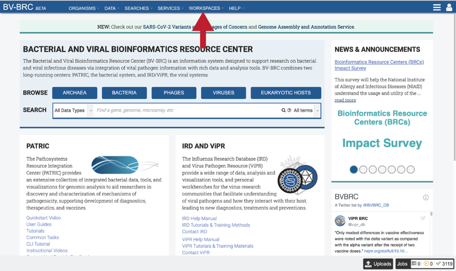

6.	This will open a drop-down box for the workspace.  To view the home workspace, click on “home”.  

7.	This will rewrite the page to show the home directory. Scrolling down the page will show the files and folders in the workspace  
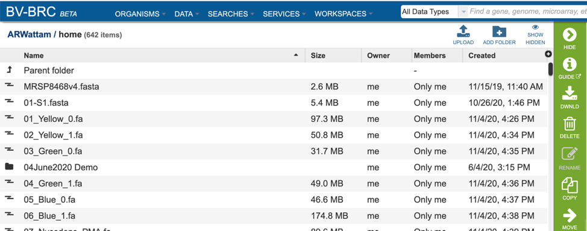

8.	If the job is in a particular folder, that can be opened by double clicking on the row that has the job.  
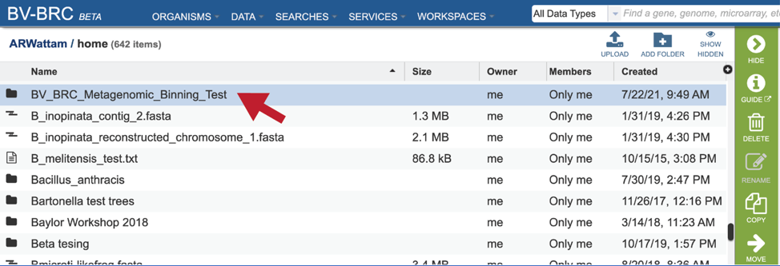

9.	This rewrites the page to show the data in that particular folder.  Completed jobs are indicated by a checkered flag in the first column.   The completed job can be accessed by double clicking on that row.  
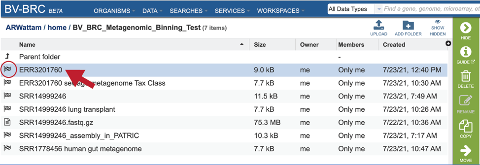

10.	This will rewrite the page to show the files produced by the completed job.  As with the Jobs page, clicking on an individual row will populate the vertical green bar with possible action icons, like viewing or downloading the data.  
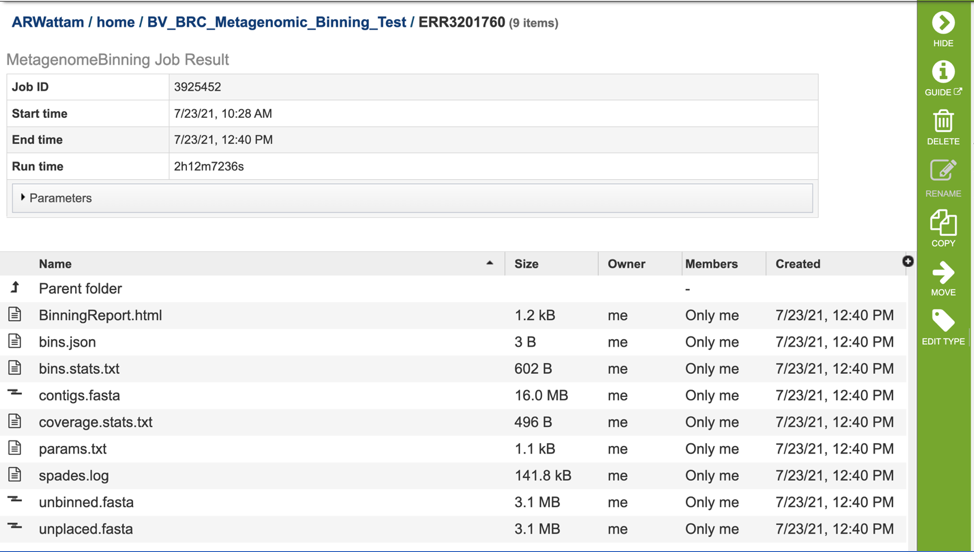

## Metagenomic binning job results

1.	Any job run in the BV-BRC contains a number of files, as well as information about the submitted job.  To view the input parameters that were selected when the job was submitted, click on the arrow that precedes the word “Parameters.”  
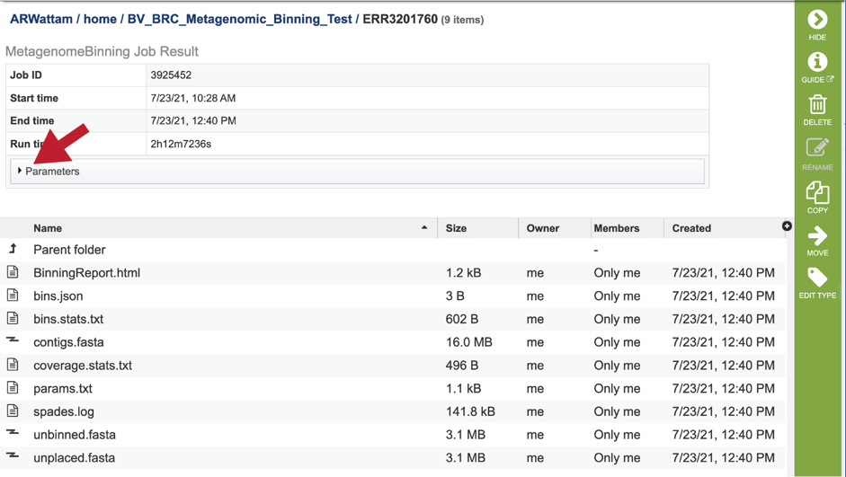

2.	This will open a drop-down box that shows the parameters.  This box can be closed by clicking on the same arrow.  
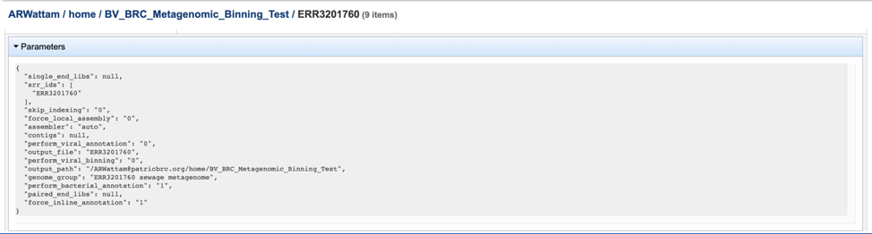

3.	The **BinningReport.html** is among the files produced by the Metagenomic Binning service, but only when Bacteria/Archaea was included or selected under Organisms of Interest when the job was submitted.  This is the binning report for the bacterial or archaeal organisms found in the submitted data.  To view this document, click on the row that contains it, and then click the View icon in the vertical green bar to the right.  
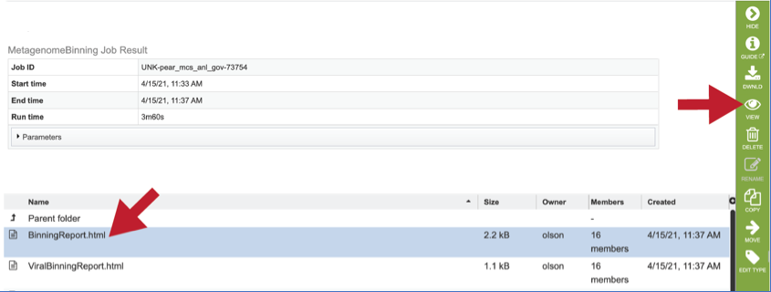

4.	This will show the binning report. The top part of the page shows information about the binning job. Immediately below is a brief description of the results. The binning report shows all of the bins found by the PATRIC metagenomic processor. The bins are divided into two categories– those of high quality (good) and those of questionable quality (bad).  Each of the columns contains specific information:  

    * **Score**: A weighted sum of the completeness and consistency scores, less the contamination score. The contamination is weighted very heavily, so a highly contaminated bin may have a negative score. The maximum score is 2090 and the minimum score is -5000. The bins are sorted from the highest score to the lowest. Clicking on this number takes you to the detail report on the bin.
    * **Genome ID**: The ID number assigned to the genome in BV-BRC that represents the bin. Clicking on this number takes you to the genome.
    * **Genome Name**: The name given to the bin. This is usually the species of the closest reference genome followed by the phrase clonal population.
    * **Reference Genome**: The ID of the reference genomes used to create the bin. There is usually only one. Sometimes there are two, indicating that the bin represents multiple strains that could not be easily distinguished during the binning. 
    * **Coarse Consistency**: The percent of predictable roles whose presence or absence matches the computations of the consistency tool. A high coarse consistency indicates the bin is either a single genome or a cluster of very close strains.
    * **Fine Consistency**: The percent of predictable roles whose number of occurrences matches the computations of the consistency tool. This number is always lower than the coarse consistency. A high fine consistency indicates a bin that can be treated like a functioning genome. A fine consistency of 87% is the minimum required for a bin to be considered a good genome.
    * **Completeness and Contamination**: Two internal BV-BRC tools are used– EvalG7, which computes completeness and contamination using marker roles, and EvalCon7, which determines whether the proteins found in the genome make sense together. A genome that is sufficiently complete (80%), with sufficiently low contamination (10%), and sufficiently consistent proteins (87%) is considered good and is shown in the first table.  
    * **Hypothetical**: The percent of the annotated proteins in the genome that are named “Hypothetical.” A high percental of hypothetical proteins is an indication of a poor-quality genome.
    * **Contig count**:  The number of contigs from the assembled sample that were placed in the bin.
    * **DNA size (bp)**:  The number of DNA base pairs in the bin.
    * **Contigs N50 (bp)**: A statistical measure of the relative contig sizes: a higher number indicates a better assembly. This is the size of the longest contig such that half of the base pairs are in contig this size or larger.
    * **Mean coverage**:  The average coverage for contigs in the bin. If no coverage information was provided, this will be 50 for every bin.
    * **Potentially Problematic Roles**:  The number of roles that failed the consistency or completeness/contamination checks. Clicking on the numbers in this column takes you to the bin’s detail report, which includes a list of the roles in question.
    * **Good PheS**:  A Yes, or “Y” here indicates that the bin contains a single PheS protein of reasonable size, otherwise it is left blank. Because the PheS is used to identify the reference genomes of the bin, a questionable PheS protein is considered a serious problem with the bin.
    * **A yellow cell** indicates a score that is problematic for the quality of the bin.
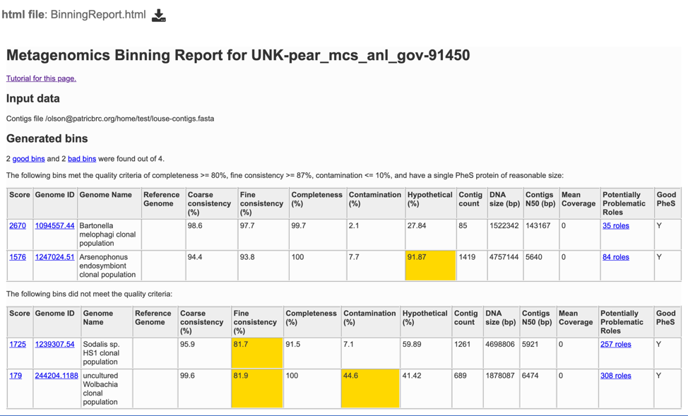

5.	Each bin occupies a single row in its respective table. The first, second, and last columns are hyperlinked. The links in the first and last column  allow you to view the detail report on the bin.  
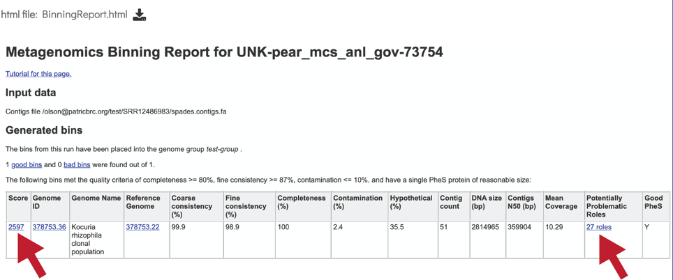

6.	Clicking on that link will go to the Genome Report for this bin.  Details on the Genome Report will be provided below.  
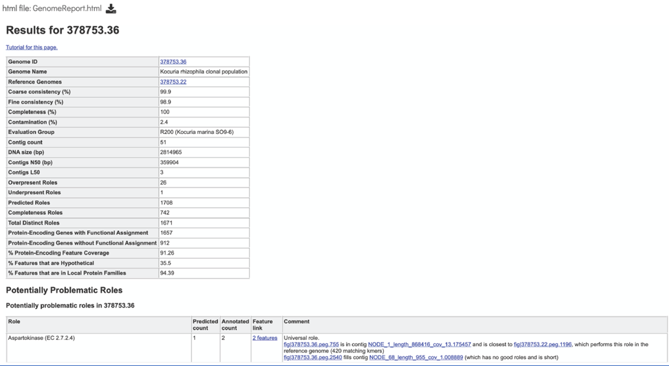

7.	The second column is the Genome ID, or unique identifier for the genome found in this bin.  It is also a link that allows you to view the bin as a genome in BV-BRC.  
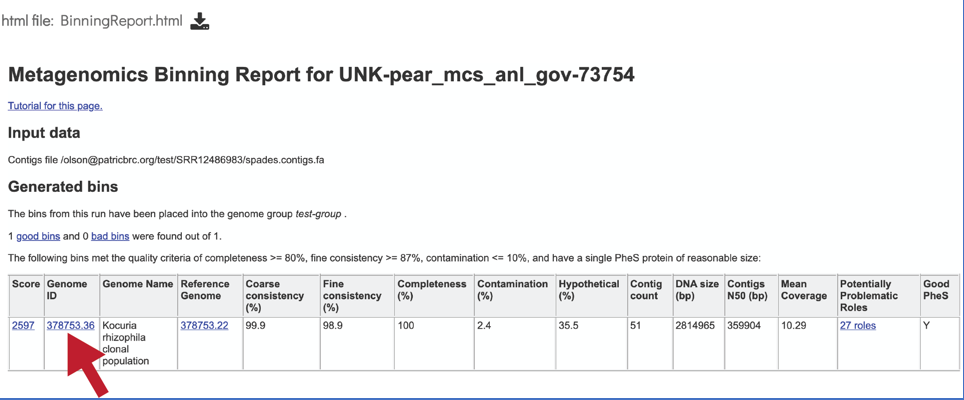

8.	Clicking on the Genome ID will open a new tab that has the information for that genome.  
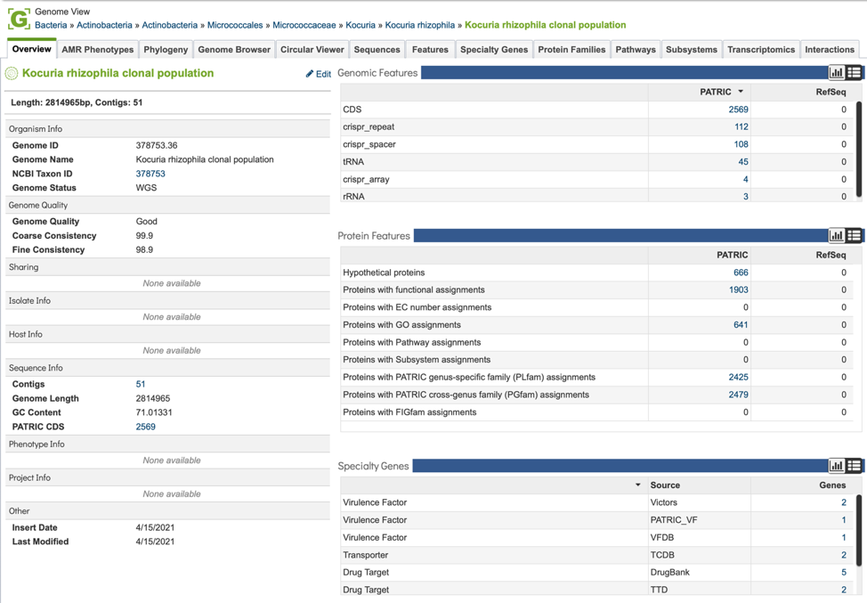

9.	Clicking on a reference genome ID takes you to its display page in BV-BRC. The reference genomes are always publicly available BV-BRC genomes.  
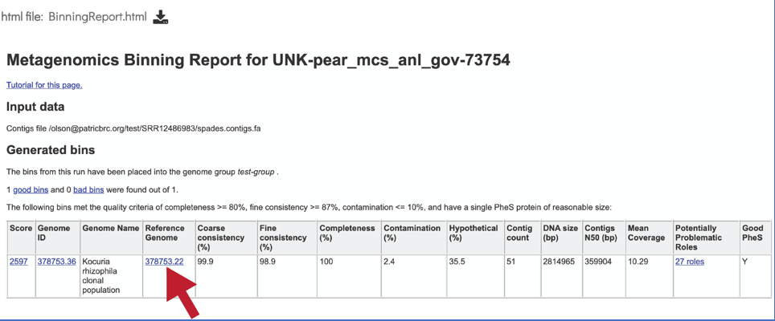

10. This will take you to the genome landing page for the reference genome used for the particular bin.  

11.	The pipeline also produces a json file.  A JSON file is a file that stores simple data structures and objects in JavaScript Object Notation (JSON) format, which is a standard data interchange format. It is primarily used for transmitting data between a web application and a server.  If you want to see what it looks like, you can select the row that contains the **bins.json**, and then click the View icon in the vertical green bar to the right. This will open a view of the json file.  
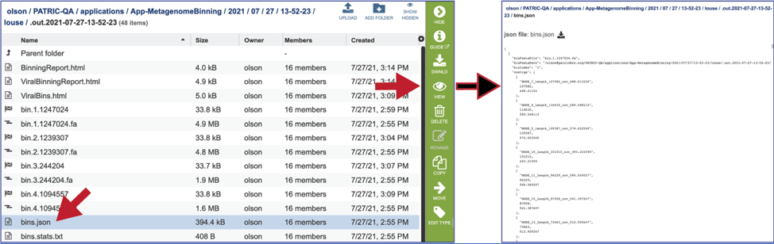

12. The pipeline also produces a file on the statistics of the bacterial bins found in the **bins.stats.txt** file.  As mentioned above, selecting the row that contains this file will highlight the vertical green bar to the right with possible downstream functions.  To view it, click on the View icon. The file will appear in the view.  It shows the data associated with the bins.  
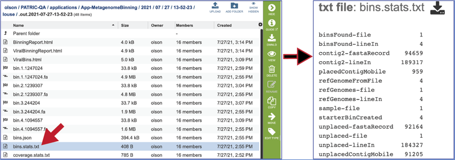

13. The pipeline also produces a file on the coverage statistics of the bacterial bins.  To view that, click on the row that contains the **coverage.stats.txt** file and then on the View icon. This will open the file, which shows the assembly statistics associated with the bacterial bins.  
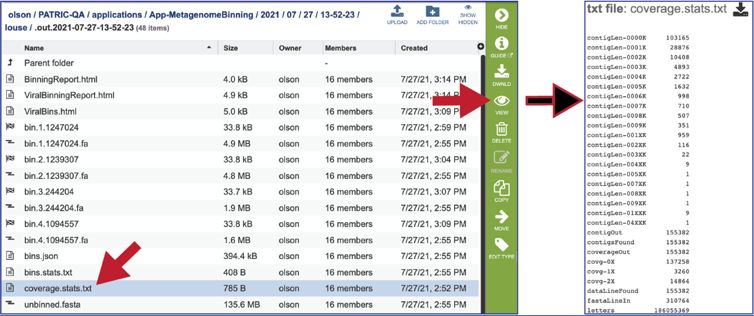

14.	The pipeline also produces data that could not be mapped to the selected organisms.  The file that contains these contigs is called **unbinned.fasta**.  

15.	The **unplaced.fasta** file includes the contigs actually the “Unmatched 12-mer contigs” that can be seen in the diagram at the top of this tutorial.  
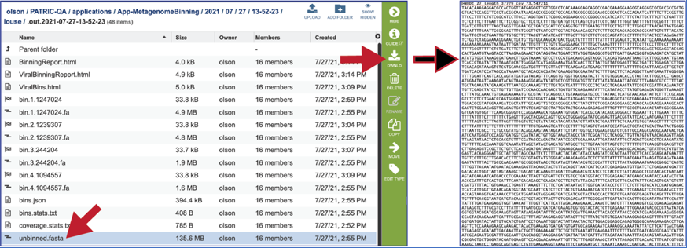

16.	The completed job contains contig files for each of the bins.  Note that the file type is listed at the far right.  These files are available for download, or for further analysis.  
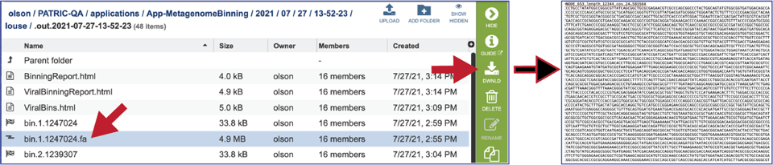

17.	The **ViralBinningReport.html** is among the files produced by the Metagenomic Binning service, but only when Viruses was included or selected under Organisms of Interest when the job was submitted.  This is the binning report for the virus organisms found in the submitted data.  To view this document, click on the row that contains it, and then click the View icon in the vertical green bar to the right.  
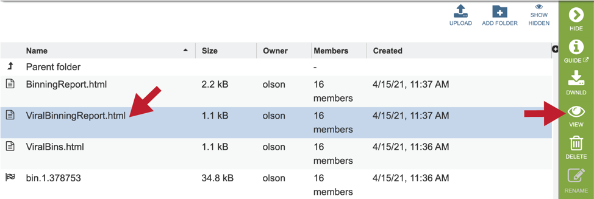

18.	This will show the binning report. The top part of the page shows the input data, and the lower part shows information on the generated bins.  Each of the columns contains specific information:
    * **Bins**: The number of the particular viral bin.  The table will show all the bins that were generated.
    * **Virus ID**: This is the GenBank accession number for the reference used for this binned genome.
    * **Taxon ID**:  This is the taxonomy ID for the reference used for this binned genome.
    * **Genome ID**: The ID number assigned to the genome in BV-BRC that represents the bin. Clicking on this number takes you to the genome.
    * **Genome Name**:  The name given to the bin. This is usually the species of the closest reference genome.
    * **Length**: The number of DNA base pairs in the bin.
    * **Completeness**: CheckV8 is used to estimates genome completeness.  It bases this score on comparison with a large database of complete viral genomes derived from NCBI GenBank and environmental samples and reports a confidence level for the estimate.
    * **Error**: CheckV reports a confidence level for each AAI-based estimate according to the expected relative unsigned error rate: high confidence (0–5% error), medium confidence (5–10% error) or low confidence (>10% error).
    * **Coverage**: The average coverage for contigs in the bin.

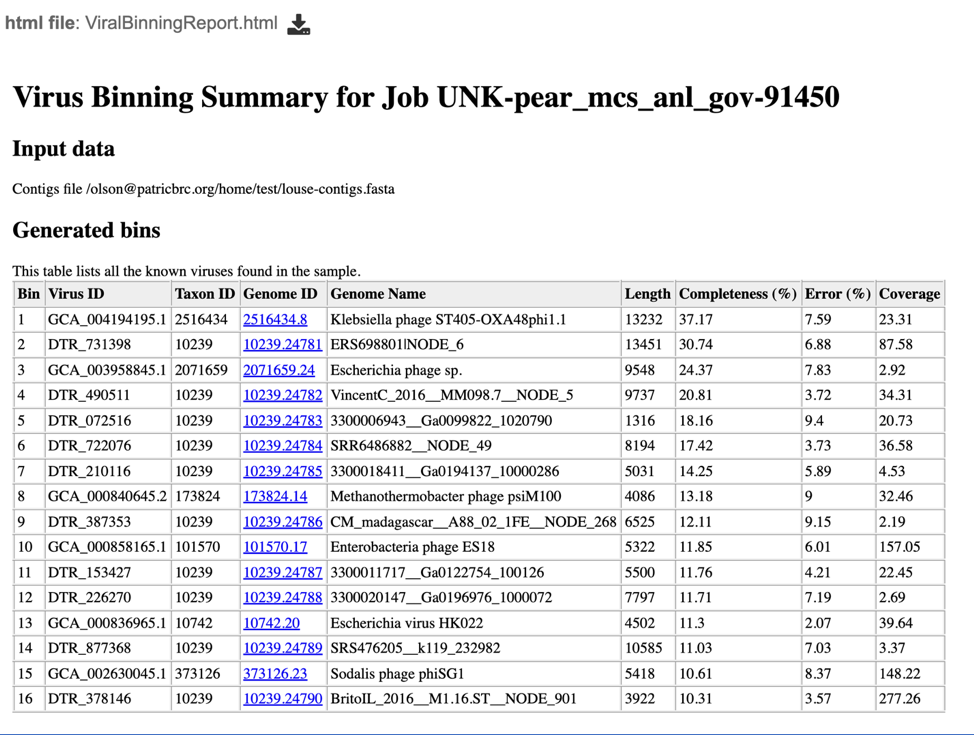

19.	Clicking on the Genome ID for the binned genome will show more information.  
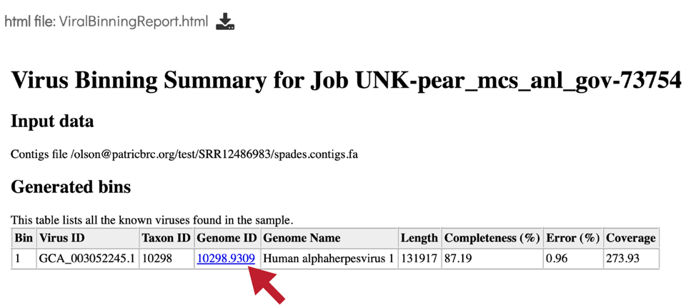

20. A new tab will open that shows the landing page for the binned genome in BV-BRC.  
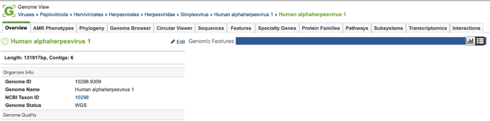

## Bacterial bin annotation job  

If “Bacteria/Archaea” or “Both” were selected under “Organisms of Interest” when the job was created, a bacterial binning job will be generated, even if it did not produce any bins.  Each successful bin has its own “job” that is indicated by a checkered flag.  “bin” is a bacterial bin.  

1.	Double clicking on the row that contains the bin will open a new tab.  
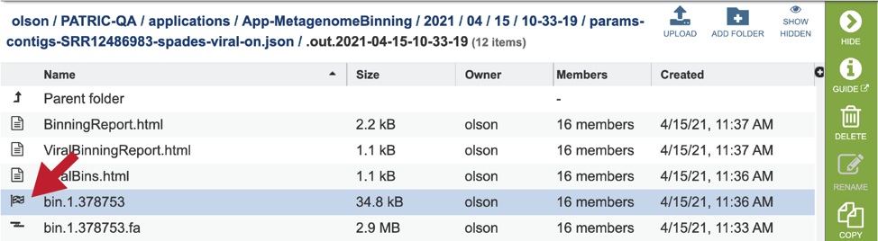

2.	The new tab contains the information and files for the job that completed.  
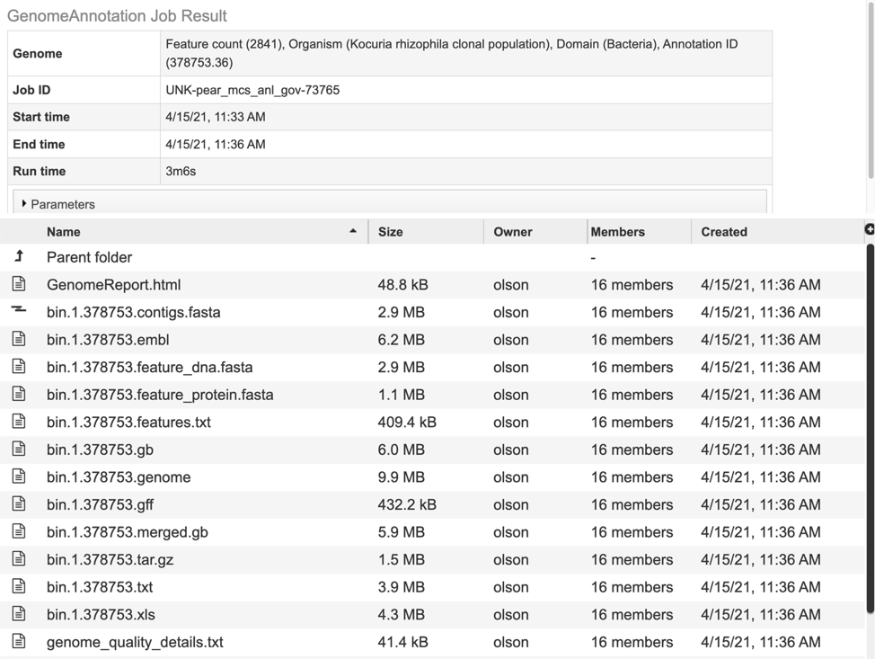

3.	The **contigs.fasta** contains the assembled contigs of the genome in DNA FASTA format.  
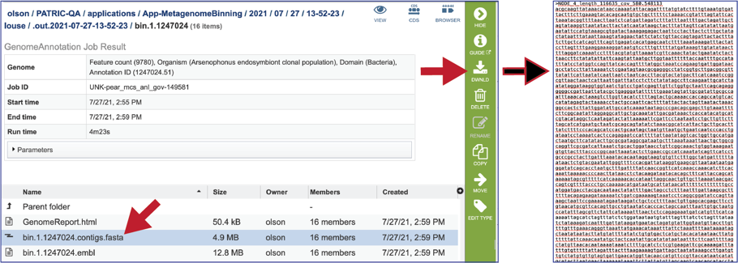

4.	The file ending in **.embl** contains an EMBL dump of the annotated genome.  
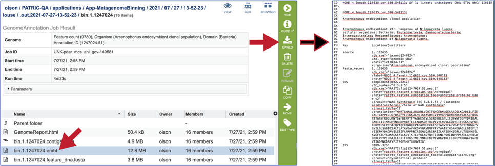

5. The **feature_dna.fasta** contains all the feature sequences of the genome in DNA FASTA format  
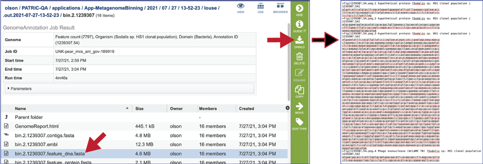

6.	The **feature_protein.fasta** contains all the protein sequences of the genome in protein FASTA format  
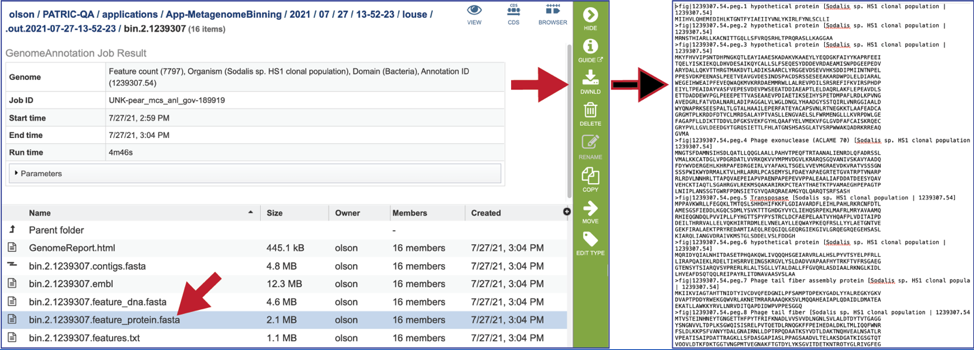

7.	The **features.txt** is a tab-delimited text file listing all the features of the genome. For each feature, it contains the BV-BRC ID, the location string, the feature type, the functional assignment, any alternated IDs found, and (for protein-coding genes) the protein MD59 checksum.  
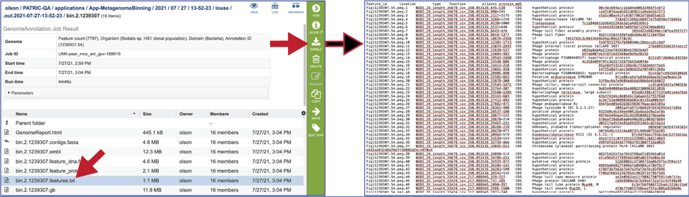

8.	The **gb** file contains the annotated genome in GenBank format.  
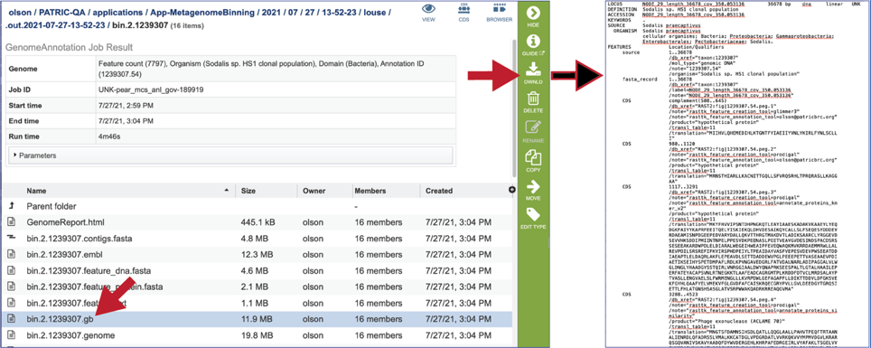

9.	The **genome** file contains a special “Genome Typed Object (GTO)” JSON-format file that encapsulates all the data from the annotated genome.  
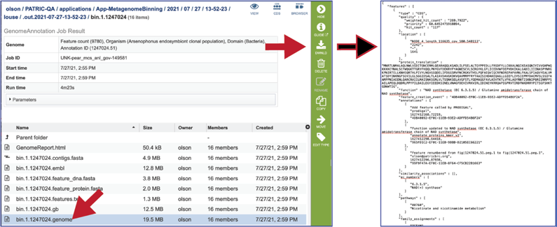

10.	The **gff** lists all the features of the genome in General Feature Format.  
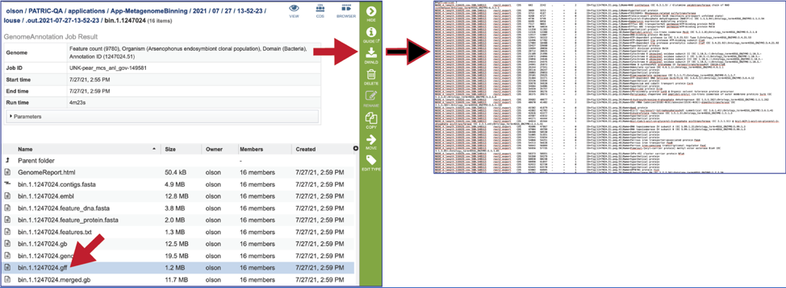

11.	The **merged.gb** is a GenBank file where the individual contigs are each included as a GenBank fasta record under a single locus.  
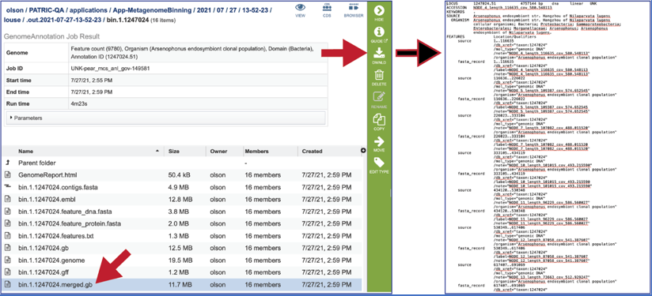

12.	The **tar.gz** file is a zipped file that contains all the information about the annotation job.  
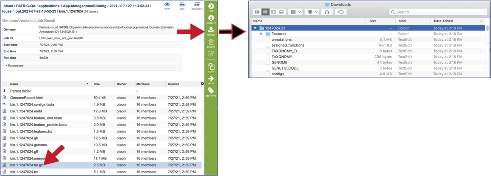

13.	The text, or **txt** file shows the nucleotide and protein sequence of all the annotated genes.  
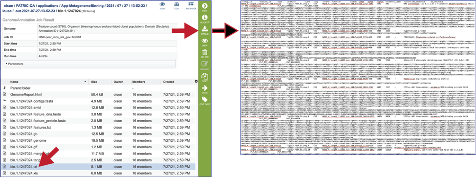

14.	The xls is an excel file that shows the nucleotide and protein sequence of all the annotated genes.  
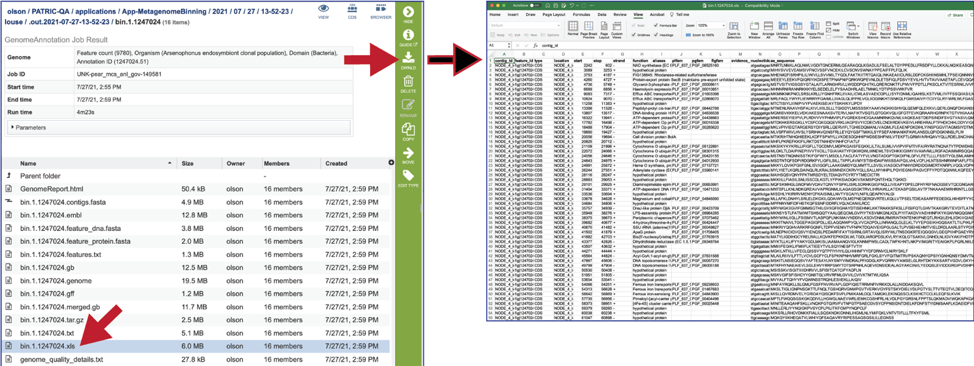

15.	The **genome_quality_details.txt** file shows some of the quality scores seen in the GenomeReport.html, and a list of the genes in both the binned and reference genomes and the number of copies in each.  
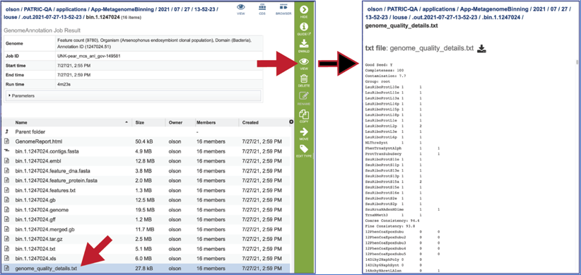

16.	The **Load files** folders contains all the json files related to the annotation job.  
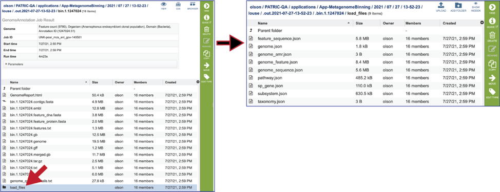

17. The **quality.json** file has the same information in json format.  
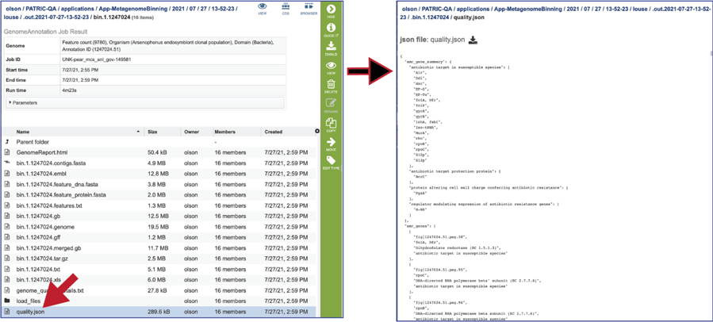

18.	If “Viruses” or “Both” were selected under “Organisms of Interest” when the job was submitted, and if viral bins were created, a file containing the contigs for each of those bins (vBin1…vBinX) will be generated.  

## Viral Binning annotation jobs  

If  “Viruses” or “Both” were selected under “Organisms of Interest” when the job was submitted a viral binning job will be generated, even if it did not produce any bins.  Each successful bin has its own “job” that is indicated by a checkered flag and followed by   “vBin”.  

1.	Double clicking on the row that contains the bin will open a new tab.  
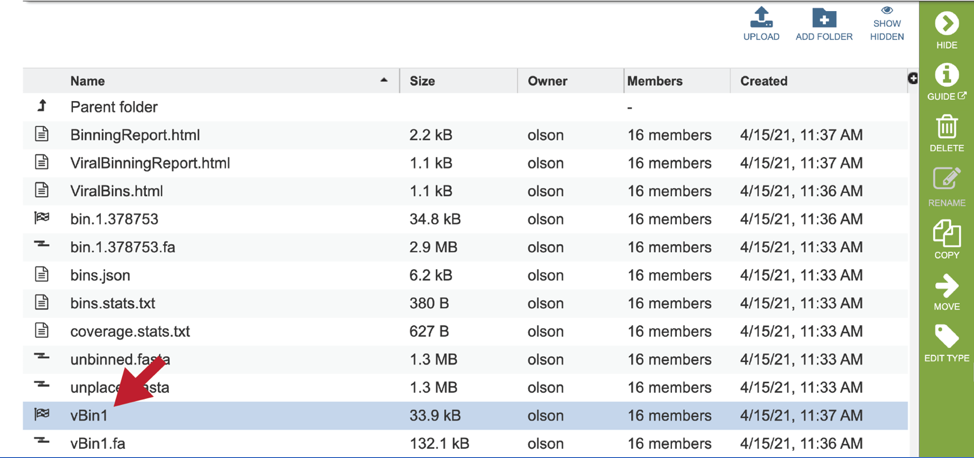

2. The new tab contains the information and files for the viral annotation job that completed.  
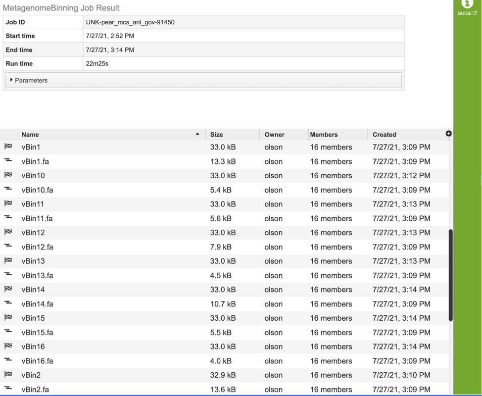

3.	This will rewrite the page to show the results from that particular viral bin.  Note that there are hyperlink icons at the top right of the page that will take you to the Genome Landing pate (View), the feature table with the list of genes (CDS) and the genome browser (Browser).  
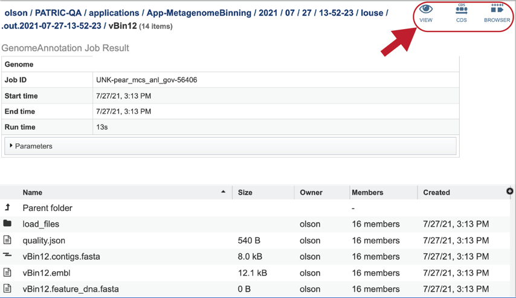

4. The viral bin will include a **quality.json** file.  To view that file, click on the row that contains it, and then the View icon.  This will rewrite the page to show the file.  
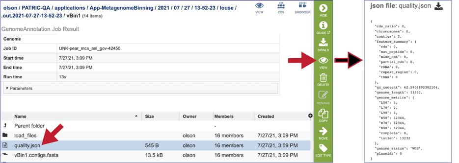

5.	The **contigs.fasta** contains the assembled contigs of the genome in DNA FASTA format.  
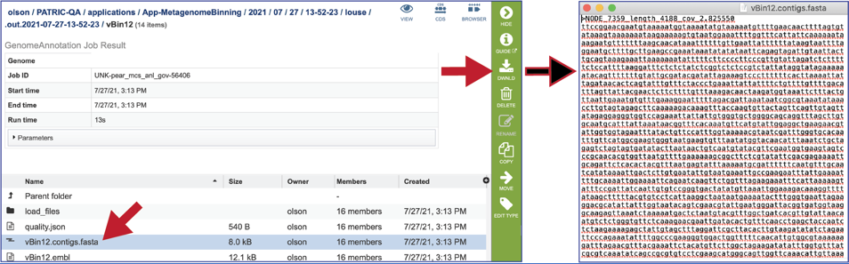

6.	The file ending in **.embl** contains an EMBL dump of the annotated genome.  

7.	The **feature_dna.fasta** contains all the feature sequences of the genome in DNA FASTA format.  If the file size is 0, that means that VIGOR4 could not annotate genes for this particular viral family.  
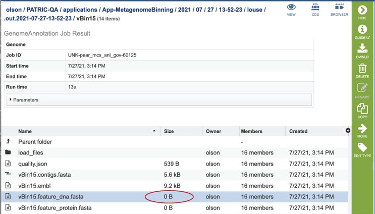

8.	The **feature_protein.fasta** contains all the protein sequences of the genome in protein FASTA format. If the file size is 0, that means that VIGOR4 could not annotate proteins for this particular viral family.  
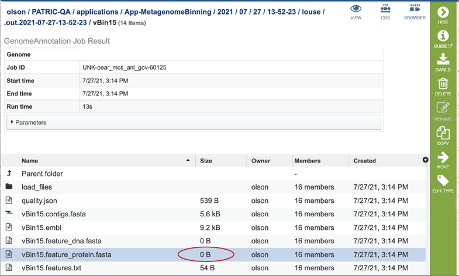

9.	The **features.txt** is a tab-delimited text file listing all the features of the genome. For each feature, it contains the BV-BRC ID, the location string, the feature type, the functional assignment, any alternated IDs found, and (for protein-coding genes) the protein MD5(9) checksum.  If the file size is small, it is an indication that VIGOR4 could not annotate any features in this particular viral family.  Opening the file will only show the column headers.  
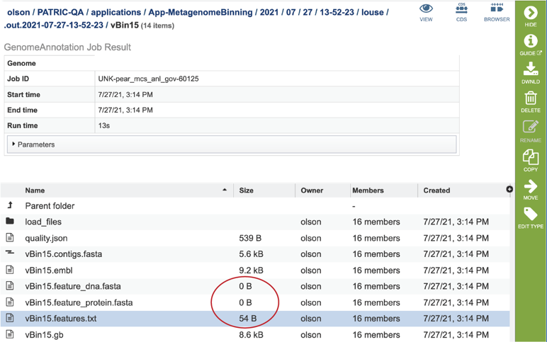

10.	The **gb** file contains the annotated genome in GenBank format.  

11.	The **genome** file contains a special “Genome Typed Object (GTO)” JSON-format file that encapsulates all the data from the annotated genome.  
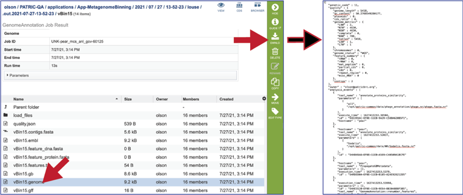

12.	The **gff** lists all the features of the genome in General Feature Format.  
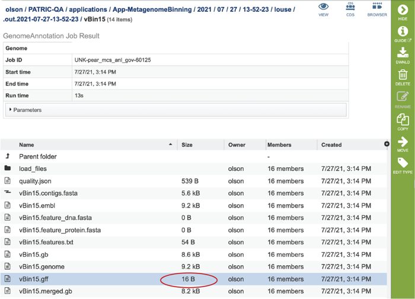

13.	The **merged.gb** is a GenBank file where the individual contigs are each included as a GenBank fasta record under a single locus.  
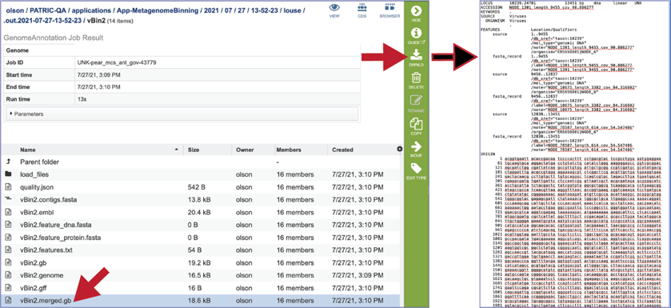

14.	The **tar.gz** file is a zipped file that contains all the information about the annotation job.  
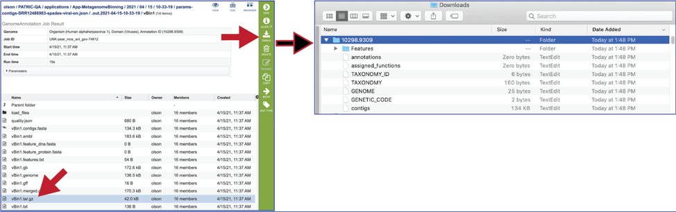

## Genome Report  

Genome quality analysis is automatically performed when Using the BV-BRC Metagenomic Binning Service or Genome Annotation. The genome quality tools look at the functional roles present in an annotated genome to determine if the genome looks correct. Two separate mechanisms are used to predict the number of times each gene should be found in the genome. A role is good if it occurs the predicted number of times; otherwise it is problematic.  

The first quality tool (EvalG) checks the completeness and contamination of the genome using a re-implementation of the CheckM(10) algorithm. EvalG identifies universal genes that are expected to occur exactly once in all genomes of a particular taxonomic grouping. Missing genes indicate the genome is less complete; extra genes indicate the genome may be contaminated.  

The second quality tool (EvalCon) checks the consistency of the genome annotation. Over 1300 genes that have a predictable relationship to other genes were identified by a machine learning process. EvalCon determines how many instances of each gene are expected given the list of other genes in the genome. If a gene in the genome is unexpected, or an expected gene is missing, this is considered coarse inconsistency. If a gene occurs a different number of times than predicted, this is fine inconsistency.  

The four numbers– completeness, contamination, coarse consistency, and fine consistency– express measures of the quality of the genome. EvalG and EvalCon tell us not only the numbers, but also identify the problematic genes that occur an unexpected number of times. The preceding are summarized in the Quality Report web page. The report is divided into three sections– the Summary Section that describes the genome itself, the Problematic Roles Report that lists the genes whose expected and actual occurrence numbers do not match, and the Contig Report that lists the contigs containing problematic roles.  

1.	To view the GenomeReport.html, click on its row and then on the View icon.  
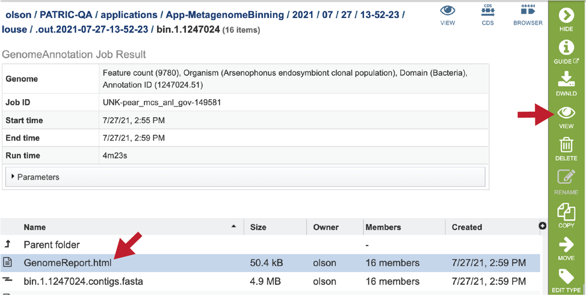

2.	This will reload the page to show the Genome Report. The top of the page is the summary section, which shows the scores achieved by the binned genome.  
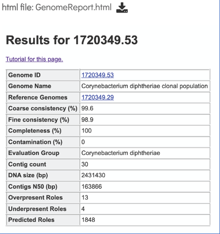

3.	A yellow color indicates a poor scoring value.  

4.	The Problematic Roles Report lists the genes whose expected and actual occurrence numbers do not match.  It shows the gene, or role, what would be expected in a normal genome (**Predicted count**), the number of genes found in the binned genome (**Annotated count**), the link to those genes (**Feature link**), and more information about the genes (**Comment**).  
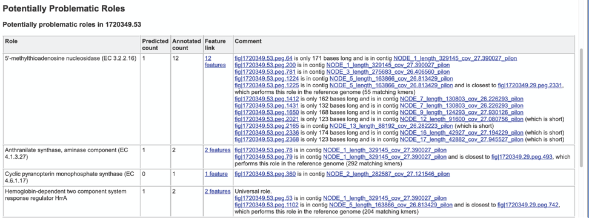

5.	Click on the Feature link will open a new table that shows the problematic genes in the binned genome.  

6.	To view the problematic gene, click on the gene ID in the Comment section.  This will open a new tab that takes you to the landing page of that particular gene.  This page has several tabs, but it open on the Compare Region View, which shows the neighborhood around the problematic gene (which will be colored red).  
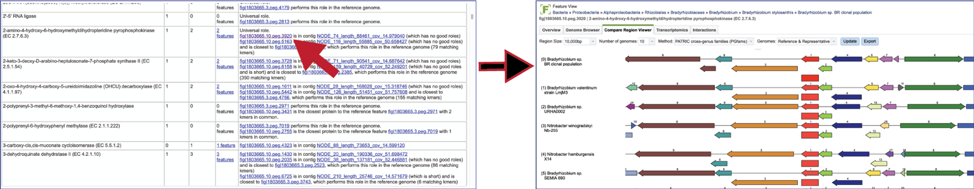

7.	The Comment section also contains a link to the contig that has the problematic gene.  Clicking on the contig ID will open a new tab that lists the genes on that contig.  

8.	The final section is the Contig Report, which lists the contigs containing problematic genes. This table has four columns, including the **Contig Name**, the **Length** of the contig, the number of **Good Features** (or genes) on that contig, and link to a table with those problematic genes (**Feature link**).  

## References  

1. Nurk, S., Meleshko, D., Korobeynikov, A. & Pevzner, P. A. metaSPAdes: a new versatile metagenomic assembler. Genome research 27, 824-834 (2017).
2. Li, D. et al. MEGAHIT v1. 0: a fast and scalable metagenome assembler driven by advanced methodologies and community practices. Methods 102, 3-11 (2016).
3. Brettin, T. et al. RASTtk: a modular and extensible implementation of the RAST algorithm for building custom annotation pipelines and annotating batches of genomes. Scientific reports 5, 8365 (2015).
4. Wang, S., Sundaram, J. P. & Spiro, D. VIGOR, an annotation program for small viral genomes. BMC bioinformatics 11, 1-10 (2010).
5. Wang, S., Sundaram, J. P. & Stockwell, T. B. VIGOR extended to annotate genomes for additional 12 different viruses. Nucleic acids research 40, W186-W192 (2012).
6. Larsen, C. N. et al. Mat_peptide: comprehensive annotation of mature peptides from polyproteins in five virus families. Bioinformatics 36, 1627-1628 (2020).
7. Parrello, B. et al. A machine learning-based service for estimating quality of genomes using PATRIC. BMC bioinformatics 20, 1-9 (2019).
8. Nayfach, S. et al. CheckV assesses the quality and completeness of metagenome-assembled viral genomes. Nature biotechnology 39, 578-585 (2021).
9. Rivest, R. & Dusse, S.     (MIT Laboratory for Computer Science Cambridge, 1992).
10. Parks, D. H., Imelfort, M., Skennerton, C. T., Hugenholtz, P. & Tyson, G. W. CheckM: assessing the quality of microbial genomes recovered from isolates, single cells, and metagenomes. Genome research 25, 1043-1055 (2015).

