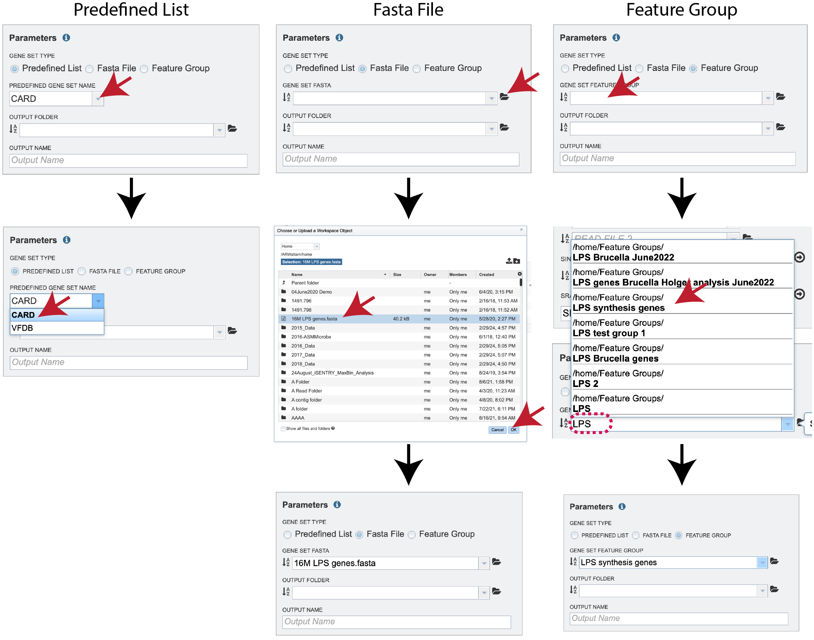
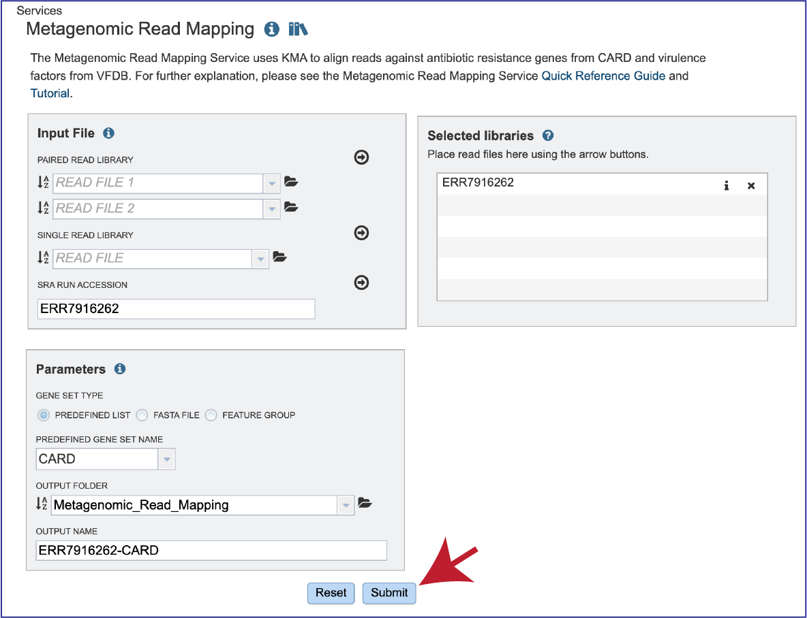

# Metagenomic Read Mapping

*Revised: 20 October 2024*

The Metagenomic Read Mapping Service uses KMA (k-mer alignment[1]), to align reads against antibiotic resistance genes or virulence factors. KMA maps raw reads directly against these databases and uses k-mer seeding to speed up mapping and the Needleman-Wunsch algorithm to accurately align extensions from k-mer seeds. Software for KMA was downloaded at the following location: https://bitbucket.org/genomicepidemiology/kma.

## Creating a folder to hold the Metagenomic Read Mapping job and related data

Please refer to the [Genome Assembly Service tutorial](/tutorial/genome_assembly/assembly) for instructions on creating a folder in the workspace.

## Locating the Metagenomic Read Mapping App

1.	Click on the Services tab at the top of the page, and then click on Metagenomic Read Mapping. 

2.	This will open the landing page for the service. 

## Input File

**Uploading paired end reads**
Please refer to the [Genome Assembly Service tutorial](/tutorial/genome_assembly/assembly) for instructions on uploading paired-end reads. 

**Uploading single reads**
Please refer to the [Genome Assembly Service tutorial](/tutorial/genome_assembly/assembly) for instructions on uploading single reads. 

**Submitting reads that are present at the Sequence Read Archive (SRA)**
Please refer to the [Genome Assembly Service tutorial](/tutorial/genome_assembly/assembly) for instructions on submitting reads from the Sequence Read Archive. 

1.	Once read files have been uploaded or located, the files must be transferred prior to the job beginning.  Click on the icon of an arrow within a circle. This will move your file into the **Selected libraries** box. 

## Parameters

1.	The default radio dial position is **Predefined List**.  New improvements include the ability to compare to a **Fasta File** or a **Feature Group**, which can be selected by clicking on the radial button in front of the type.

2.	If **Predefined List** is selected, clicking on the down arrow at the end of the text box underneath **Predefined Gene Set Name** allows a selection of  antimicrobial resistance genes or virulence factors.  The Comprehensive Antibiotic Resistance Database (**CARD**)[2] is the current gold standard for antimicrobial resistance genes. It is a manually curated resource containing high quality reference data on the molecular basis of antimicrobial resistance (AMR) that emphasizes genes, proteins and mutations that are involved in AMR. The Virulence Factor Database (**VFDB**)[3] is the current gold standard reference source for virulence factors, providing up-to-date knowledge of virulence factors from various bacterial pathogens. Select either CARD or VFDB as the gene set. If **Fasta File** or **Feature Group** was selected, one can navigate to the workspace and make a selection or type the name of the file or group in the text box to find the preferred dataset.

3.	Next, an **Output Folder** must be selected, either by navigating to it in the workspace, or starting to type the name to see  all the folders that have matching text. Clicking on the desired folder will populate the text box with its name.

  
4.	A name for the job must be entered in the text box under **Output Name**. 

## Submitting the Metagenomic Read Mapping job

1.	After the reads and parameters have been selected, the **Submit** button turns blue and the job will be submitted once clicked. 

2.	A successful submission will generate a message indicating that the job has been queued. 

## Monitoring progress on the Jobs page

1.	Click on the Jobs box at the bottom right of any BV-BRC page. 

2.	This will open the Jobs Landing page where the status of submitted jobs is displayed. 

## Viewing the Metagenomic Read Mapping job results

1.	On the jobs page, click on the row that has the job of interest.  This will populate the vertical green bar on the right with possible downstream steps, which include viewing the results of the job, or reporting an issue that was experienced (like a job failure).  Click on the **View** icon. 

2.	This will rewrite the page to show the information about the metagenomic read mapping job, and all of the files that are produced when the pipeline runs.  The information about the job submission can be seen in the table at the top of the results page.  To see all the parameters that were selected when the job was submitted, click on the **Parameters** row. 

3.	This will show the information on what was selected when the job was originally submitted. 

4.	To examine the **MetagenomicReadMappingReport.html**, click on the **View** icon. 

5.	This page shows KMA’s standard sample report format. The fields of the output, from left-to-right, are as follows:
   * **Template**: Identifier of the template (reference gene) sequence that match the query reads
   * **Function**: Template gene function that is assigned by either the CARD or VFDB databases, or in the Feature Group or Fasta file submitted.
   * **Genome**: The genome that contains template gene.  The name is a hyperlink, and clicking on it will open its Genome Landing page in BV-BRC.
   * **Score**: Global alignment score of the template.  This is the ConClave score (accumulated alignment score)[1], from all reads that were accepted to match this template.
   * **Expected**: Expected alignment score if all mapping reads were were normally distributed over the entire database.
   * **Template_length**: Template gene length in nucleotides.
   * **Template_Identity**: The number of bases in the consensus sequence that are identical to the template sequence divided by the template length.
   * **Template_Coverage**: The percentage of bases in the template that is covered by the consensus sequence. A template coverage above 100% indicates the presence of more insertions than deletions.
   * **Query_Identity**: Percent identity between the query and template sequence, over the length of the matching query sequence. .  It is the number of bases in the template sequence that are identical to the consensus sequence divided by the length of the consensus.
   * **Query_Coverage**: Length of the matching query sequence divided by the template length. A query coverage above 100% indicates the presence of more deletions than insertions.
   * **Depth**: Number of times the template has been covered by the query.
   * **q_value**: Quantile from McNemars test, to test whether the current template is a significant hit.
   * **p_value**: p-value corresponding to the obtained q_value 

6.	Clicking on any of the template identifiers in the first column, called **#Template**, will open a Specialty Gene List View that shows all the genes in the BV-BRC that have BLAT[4] hits to the same template gene. 

7.	Clicking on the name in the **Genome** column will open a new tab that shows the Genome List view, which shows all the genomes in the BV-BRC that fall under the same taxonomy of the selected name. 

8.	To see an alignment details, click on the **kma.aln** row and then on the **View** icon.  This will open a text file that shows the alignment between the template and the submitted query sequence. 

9.	The **kma.frag.gz** file should be downloaded. It has mapping information on each mapped read, and the columns found in the download are as follows: read, number of equally well mapping templates, mapping score, start position, end position (with respect to the template), the chosen template. 

10.	The KMA consensus fasta file (**kma.fsa**) can be viewed in the workspace. Select the row and click on the **View** icon.  It shows the consensus sequence drawn from the alignment. 

11.	The KMA results (**kma.res**) file can be downloaded or viewed in the workspace. Click on the row and click on the **View** icon.  This is the text file that matches the **MetagenomicReadMapping.html** file. 

## References 

1.	Clausen, P.T., F.M. Aarestrup, and O. Lund, Rapid and precise alignment of raw reads against redundant databases with KMA. BMC bioinformatics, 2018. 19(1): p. 307.
2.	Alcock, B.P., et al., CARD 2020: antibiotic resistome surveillance with the comprehensive antibiotic resistance database. Nucleic acids research, 2020. 48(D1): p. D517-D525.
3.	Liu, B., et al., VFDB 2019: a comparative pathogenomic platform with an interactive web interface. Nucleic acids research, 2019. 47(D1): p. D687-D692.
4.	Kent, W.J., BLAT—the BLAST-like alignment tool. Genome research, 2002. 12(4): p. 656-664.
