# MSA and SNP/Variation Analysis Service

## Overview
The Multiple Sequence Alignment (MSA) and Single Nucleotide Polymorphism (SNP)/Variation Analysis Service allows users to choose an alignment algorithm to align sequences selected from: a search result, a FASTA file saved to the workspace, or through simply cutting and pasting. The service can also be used for variation and SNP analysis with feature groups, FASTA files, aligned FASTA files, and user input FASTA records. If a single alignment file is given, then only the variation analysis is run. If multiple inputs are given, the program concatenates all sequence records and aligns them. If a mixture of protein and nucleotides are given, then nucleotides are converted to proteins. 

### Keywords:
MSA, multiple sequence alignment, mafft, muscle, progressiveMauve, SNP, variation

### See also
* [MSA and SNP/Variation Analysis Service](https://bv-brc.org/app/MSA)
* [MSA and SNP/Variation Analysis Service Quick Reference Guide](../../quick_references/services/msa_snp_variation_service.html)
* [MSA Viewer](../../quick_references/other/msa_viewer.html)

## Locating the MSA and Variation Analysis App

1.	At the top of any BV-BRC page, find the SERVICES tab and then click on Multiple Sequence Alignment. 
 
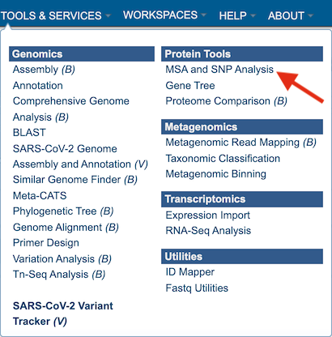

2.	This will open up the Multiple Sequence Alignment and SNP/Variation Analysis landing page.

## Specifying alignment parameters

1.	Users will need to first select which alignment algorithm they wish to use. Options include Mafft [1,2], MUSCLE [3,4], and progressiveMauve [5]. If not specified by the user, the default aligner used will be Mafft. 

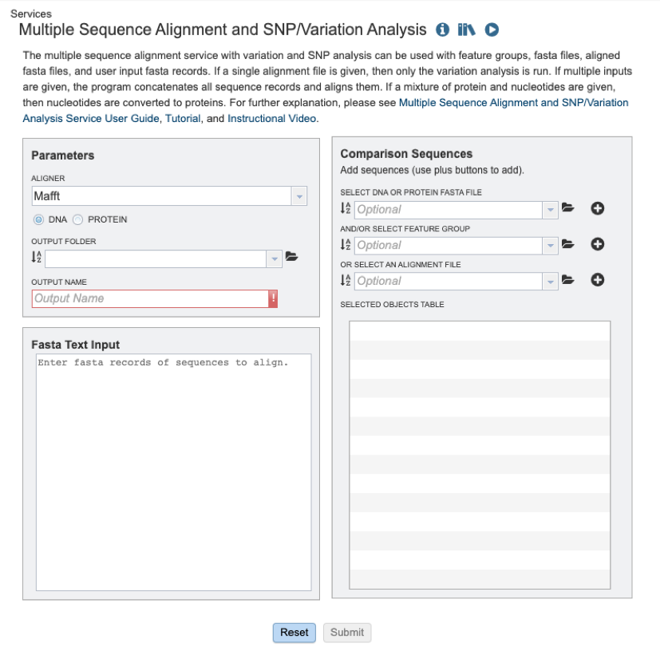

2.	Users will then need to specify whether they require the alignment of a nucleic acid or protein sequence data (see below). 

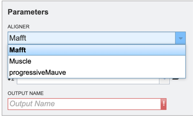

3.	To specify output parameters, users will need to select an output folder in their workbench or create one if an appropriate folder is not available (red arrow). Users will also be prompted to specify an “Output Name” (red box) for the job result, before the job can be submitted. 

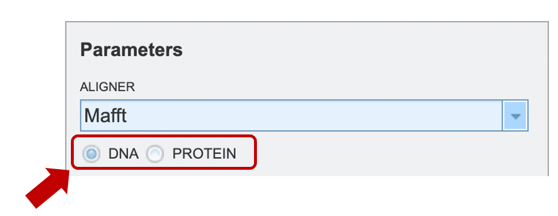

Input sequence options
Users may submit data or datasets for alignment and/or variation analysis to the service using one of several input methods: 1) cutting and pasting sequences in FASTA text format; 2) Selecting a FASTA formatted file after having uploaded it to their workspace; 3) Selecting a feature group (eg: CDS, tRNA etc.) previously saved to their workspace; 4) Selecting a previously aligned dataset (MSA) file in FASTA format; 5) any combination of the previously described options. 

*Option 1:* To align a block of FASTA formatted text sequences, you may simply paste them into the “Fasta Text Input” box shown below. 

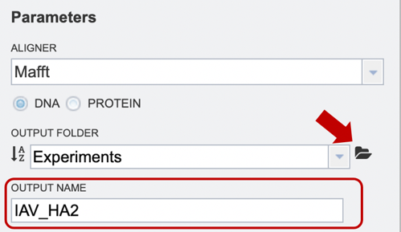

*Option 2:* Users may upload their own files here (red arrow), or use a previously saved file from their workspace. After the appropriate file has been selected, users can select the “plus” button (red box) to add the file to the selected object table for alignment.   

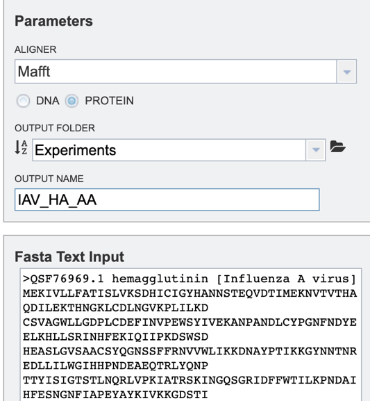

*Option 3:* Users may select a previously saved “Feature Group” file from their workspace (for more information, see “Searching for Genes & Proteins” documentation). After the appropriate file has been selected, users can select the “plus” button (red box) to add the file to the selected object table for alignment. 

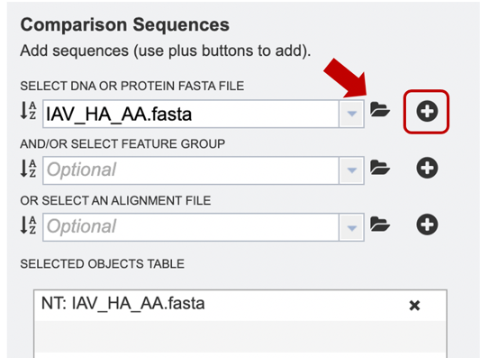

*Option 4:* If users have previously aligned their data using another service to which they would like to add further sequences for alignment, they may choose to upload an alignment file from their workspace or upload their own. After the appropriate file has been selected, users can select the “plus” button (red box) to add the file to the selected object table for alignment.  

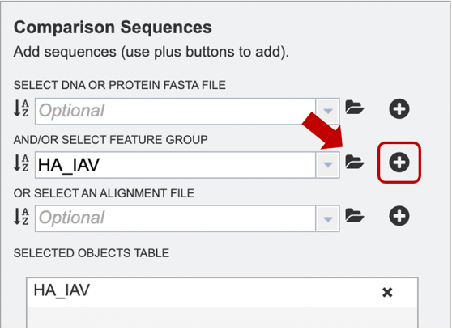

*Option 5:* Alternatively, users may wish to combine several files using one or more of the methods described above, e.g., combining personal data with reference data from the database. 

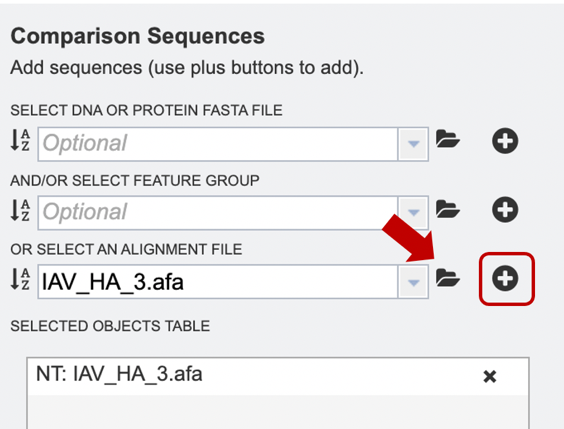

## Submitting a job for MSA
When the user has completed parameter and input file selection, the “Submit” button will become available. 

A message will appear below the box to indicate that the job is now in the queue. 

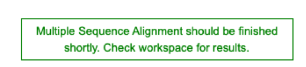

## Checking the status of the job

1.	Click on the Jobs indicator at the bottom of the BV-BRC page. 

2.	This will open the Jobs Status page where researchers can see the status of their annotation job. The statuses of all the service jobs that have been submitted to BV-BRC are also available. 

3.	Once the job is completed, you can select the job by clicking on it and click the “View” button on the right-hand bar to see the results. 

4.	The results page will consist of a header describing the job and a list of output files, as shown below. 

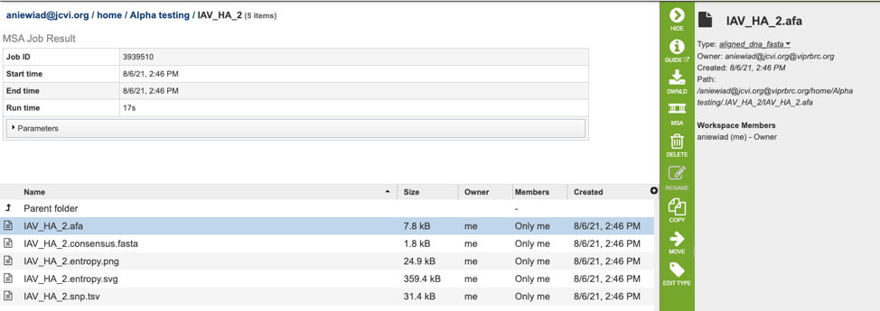

5.	The MSA Service generates several files that are deposited in the Private Workspace in the designated Output Folder. These include:

   * **.afa** – the alignment file in fasta format.
   * **.consensus.fasta** – A consensus sequence, ie: the calculated order of most frequent residues (nucleotide or amino acid) in a sequence alignment.
   * **.entropy.png** –  a PNG (portable network graphics) image file showing the entropy score plotted against the sequence position. 
   * **.entropy.svg** – a SVG (scalable vector graphics) image file showing the entropy score plotted against the sequence position.
   * **.snp.tsv** – A tab separated value file allowing users a tabular view of all nucleotide or amino acid variations found within their MSA. 

## Viewing MSA in the BV-BRC 

1.	After selecting the alignment (.afa) file (red box), users can download or view the alignment by selecting the appropriate button (Download or MSA respectively) on the green vertical Action Bar on the right-hand side of the page displays the results files (red arrow). 

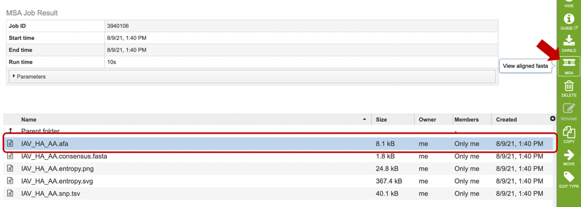

2.	If users select to view their file, a MSA viewer application will be opened in a new window (see below). To learn more about the MSA viewer options, please see [MSA Viewer](../../other/msa_viewer.html) documentation. 

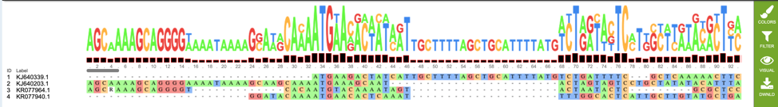

3.	If users wish to download or view the consensus sequence generated from their MSA, they may select the “consensus.fasta” file (red box), then select the appropriate button (Download or View respectively) on the green vertical Action Bar on the right-hand side of the page displays the results files (red arrow).

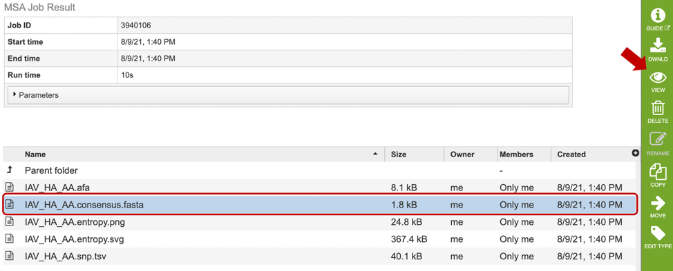

4.	Similarly, if users wish to view or download the entropy score for each site within the alignment, they may select either the “entropy.png” or “entropy.svg” file, then select the view or download buttons on the green vertical Action Bar, as described above. Entropy plots will be displayed as shown below. 

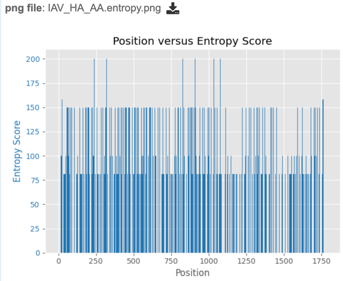

## Analyzing Sequence Variation 

After a MSA is completed, a consensus sequence is created by "majority rule". At each position, the consensus is the allele with frequency greater than 50%, regardless of coverage. If no allele exceeds 50%, N (for nucleotide) or Xaa (for amino acid) indicates ambiguity. Sequences in the alignment are then compared to the consensus to identify polymorphism.  

To score polymorphism at each position, a formula modified from the one cited in Crooks et al. [6] is used. 
S = -100 * Sum (Pi * log2Pi) where Pi is the frequency of the *ith* allele. 

The score is the normalized entropy of the observed allele distribution. For nucleotides, scores can range from 0 (no polymorphism) to 232 (4 alleles and an indel, 20% frequency each).

1.	If users are interested in the nucleotide or amino acid variation within their MSA, they can find a summary table by selecting the “snp.tsv” file, then selecting the appropriate button in the green vertical action bar as described above. 

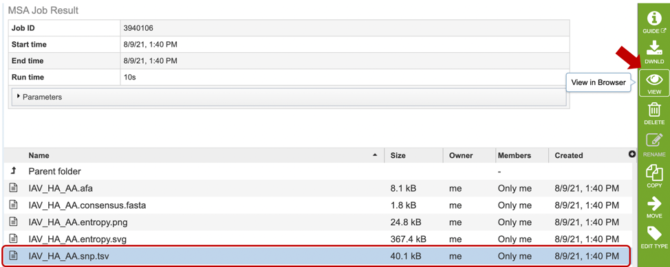

2.	Variation results will be displayed in tabular format as shown below. Table columns include:  Position, Score, Consensus nucleotide or AA, as well as the number of sequences that contain each variant. 

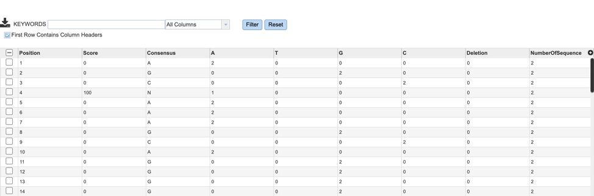

## References

1.	 Katoh K., Misawa K., Kuma K., Miyata T. MAFFT: a novel method for rapid multiple sequence alignment based on fast Fourier transform. Nucleic Acids Res. 2002;30:3059–3066. 
2.	Katoh K, Rozewicki J, Yamada KD. MAFFT online service: multiple sequence alignment, interactive sequence choice and visualization. Brief Bioinform. 2019 Jul 19;20(4):1160-1166. doi: 10.1093/bib/bbx108. PMID: 28968734; PMCID: PMC6781576.
3.	Edgar, Robert C. (2004), MUSCLE: multiple sequence alignment with high accuracy and high throughput, Nucleic Acids Research 32(5), 1792-97. 
4.	Edgar, Robert C (2004), MUSCLE: a multiple sequence alignment method with reduced time and space complexity. BMC Bioinformatics, 5(1):113.
5.	Darling AE, Mau B, Perna NT (2010) progressiveMauve: Multiple Genome Alignment with Gene Gain, Loss and Rearrangement. PLoS ONE 5(6): e11147. https://doi.org/10.1371/journal.pone.0011147
6.	Crooks GE, Hon G, Chandonia JM, Brenner SE. WebLogo: a sequence logo generator. Genome Res. 2004 Jun;14(6):1188-90.

