*Revised: 27 August 2024*

# Bacterial Phylogenetic Tree Service 
A phylogenetic tree or evolutionary tree is a branching diagram or “tree” showing the evolutionary relationships among various biological species or other entities. The Bacterial Phylogenetic Tree service in BV-BRC[1] allows researchers to build trees that contain private and public genomes, adjusting for the number of genes that will be used to generate the tree. 

The Codon Tree pipeline generates the bacterial phylogenetic trees for BV-BRC. It uses the amino acid and nucleotide sequences from a defined number of the BV-BRC Global Protein Families (PGFams)[2], which are picked randomly, to build an alignment, and then generate a tree based on the differences within those selected sequences. Both the protein (amino acid) and gene (nucleotide) sequences are used for each of the selected genes from the PGFams. Protein sequences are aligned using MUSCLE[3], and the nucleotide coding gene sequences are aligned using the Codon_align function of BioPython[4]. A concatenated alignment of all proteins and nucleotides were written to a PHYLIP formatted file, and then a partitions file for RaxML[5] is generated, describing the alignment in terms of the proteins and then the first, second and third codon positions. Support values are generated using 100 rounds of the “Rapid” bootstrapping option[6] of RaxML. The resulting newick file can be viewed in BV-BRC using the Archaeopteryx viewer (https://www.bv-brc.org/docs/quick_references/services/archaeopteryx.html).

Source code for algorithms
* The source code for RaxML can be found at: https://github.com/stamatak/standard-RAxML
* The source code for MUSCLE can be found at: https://www.drive5.com/muscle/downloads.htm
* The source code for BioPython can be found at: https://github.com/biopython/biopython

## Locating the Bacterial Phylogenetic Tree App

1.	1.	At the top of any BV-BRC page, click on the **Tools & Services**.  In the drop-down box, click on **Bacterial Genome Tree** underneath **Phylogenomics**.
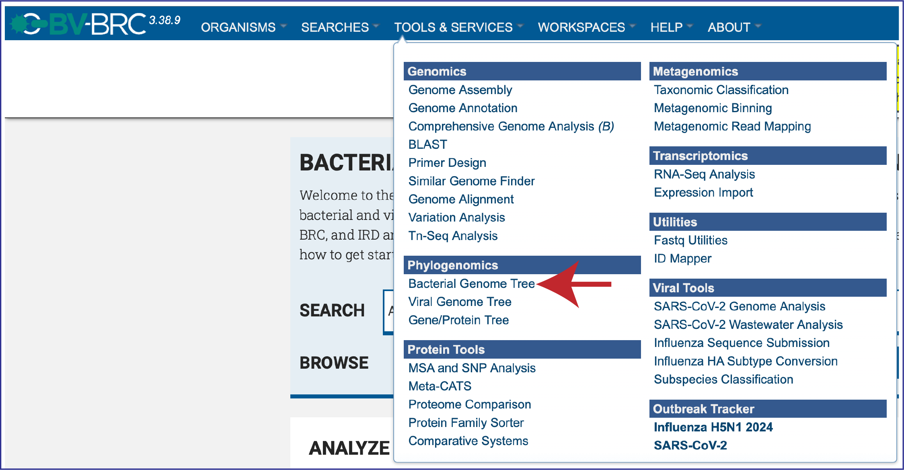

2.	This will open up the landing page for that service. 
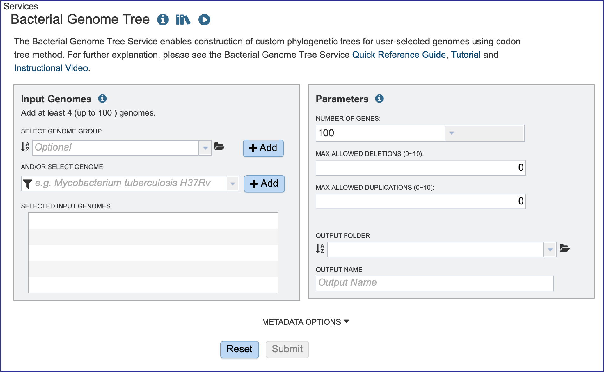

## Selecting Genomes 
The service will generate trees from between 4-100 bacterial genomes.  These can be selected individually, or in genome groups.

1.	Genome groups can be selected by beginning to enter the name of the group in the text box underneath **Select Genome Group** and selecting the correct group in the drop-down box or clicking on the arrow at the end to open that box, or by clicking on the folder icon to navigate to the group in the workspace.

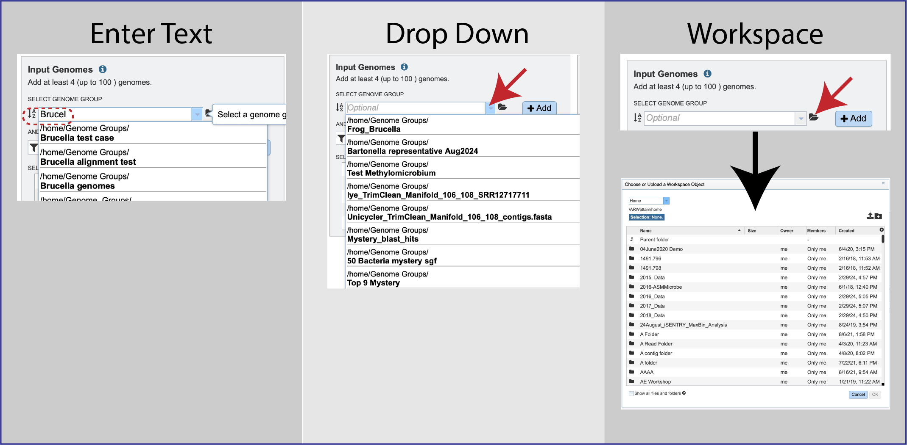

3.	Clicking on the group of interest will autofill the text box  with the group.  Click on the ***+ Add** button at the end of the text box, and this will add the group to the **Selected Input Genomes** box.
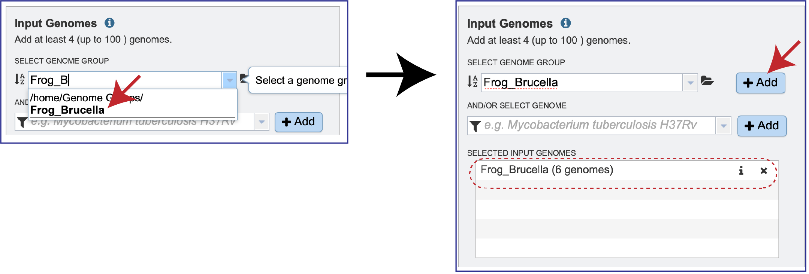

4.	Public or private genomes that are in the BV-BRC database can be used to build a phylogenetic tree. Up to 100 genomes can be used in this service. To add a private genome, click on the **Filter** icon at the beginning of the text box underneath **Select Genome**. This will open a drop-down box with a list of the types of genomes that can be filtered on. Click on **My Genomes**, which is underneath **Private Genomes**.
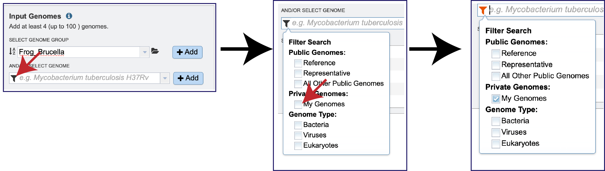

5.	The genome of interest can be found either by starting to enter text into the box underneath **And/Or Select Genome** or clicking on the down arrow at the end of the box.  This will open a drop-down box where the genome can be selected. 
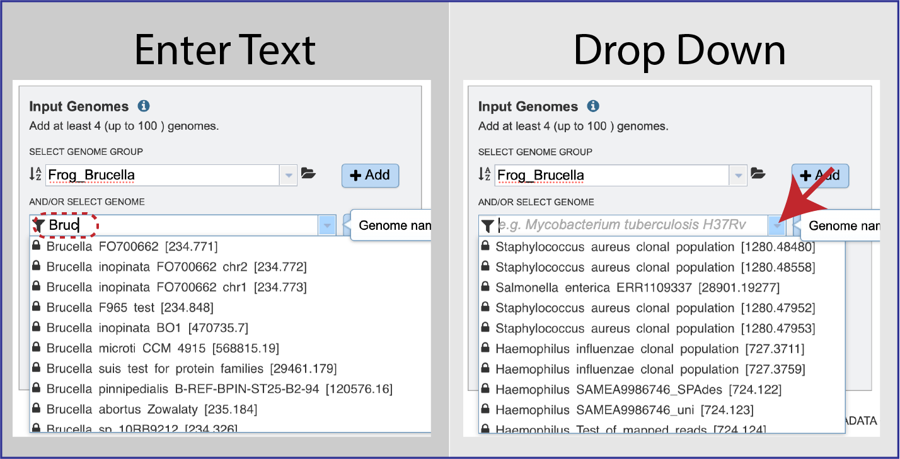

6.	Once selected, the genome needs to be added into the **Selected Input Genome** table. Click the **+ Add** button at the end of the text box, and the genome will appear in the table.
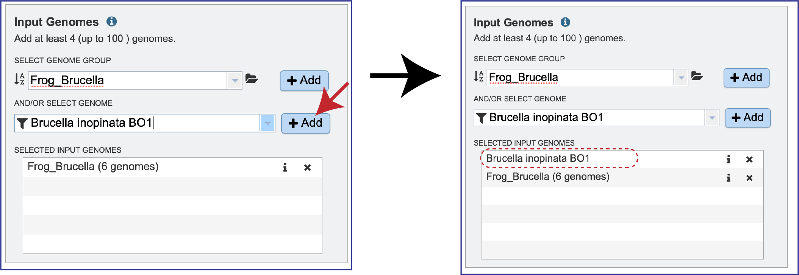

7.	Clicking on the Information icon (**i**) following the name will show the **Genome ID**s of the genomes within a selected group.
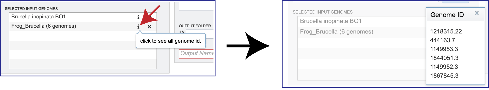

8.	Clicking on the **X** icon that follows the name of a genome or genome group in the **Selected Input Genome** table will remove it.
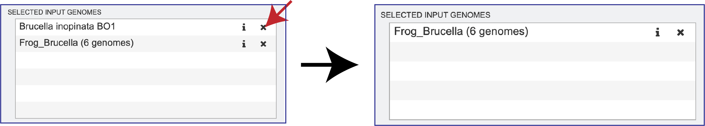

## Setting Parameters

1.	Several parameters must be addressed before the bacterial phylogenetic tree job can be submitted.  The number of genes that will provide the nucleotide and amino acid sequences must first be selected.  The number of single-copy PGFams is set as the default is 100. This will include 100 amino acid and nucleotide sequences for the alignment and the tree but will depend on the number of single copy genes found in all of the genomes selected. For example, if one genome has only 10 single copy genes, then the tree will be built on the protein and gene sequences for those 10 genes, even if all the other genomes have 100 single copy genes. This can be adjusted (see below for Max Allowed Deletions and Duplications). A different number can be selected by clicking on the down arrow at the end of the text box underneath **Number of Genes**, and the range is 10 to 1000 genes. Genomes that are in widely different taxa might be resolved with as few as 10 genes, but closely related genomes (same species or even strain) might require up to 1000 genes selected to separate them on a phylogenetic tree. **The more genes selected, the longer the tree job will run**. Clicking on the desired number will fill the text box.

2.	The selection of “single-copy” genes can be made more lenient by allowing one or more instances of genomes missing a member of a particular homology group (**Max Allowed Deletions**). If the number is set at 1, 9 genomes would have a gene in a particular PGFam, and the 10th would be missing it. Likewise, if the number is set at 2, 8 genomes would have the PGFam and the last 2 would be missing it. **This would only be used if there are not enough PGFams meet the single copy criterion**. The number of deletions allowed can be set between 0 and 10 in the text box underneath Max Allowed Deletions (0-10). 

3.	The selection of “single-copy” genes can also be made more lenient by allowing for PGFams that might have more than one copy of a single gene within a single genome. If the number is set at 1, then. Nine genomes have one gene in a particular PGFam, and the 10th has two. If the number is set at 2, 8 genomes will have one gene in a particular PGFam and the other two have 2. When there are two copies of a gene, the algorithm will pick the gene that is the most similar to the other genes found in the other selected genomes. **This would only be used if there are not enough PGFams meet the single copy criterion**. This number of can be set between 0 and 10 in the text box underneath **Max Allowed Duplications** (0-10). 

4.	An **Output Folder** must also be designated, wither by clicking on the drop-down box, clicking on the folder to navigate to the folder in the workspace, or typing the name of the folder and clicking on it in the drop-down box.
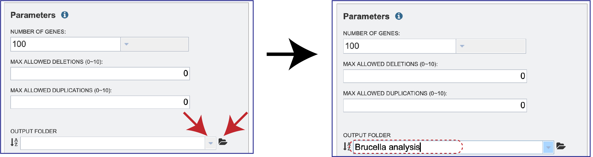

5.	A name for the job must also be assigned and entered in the text box underneath **Output Name**.
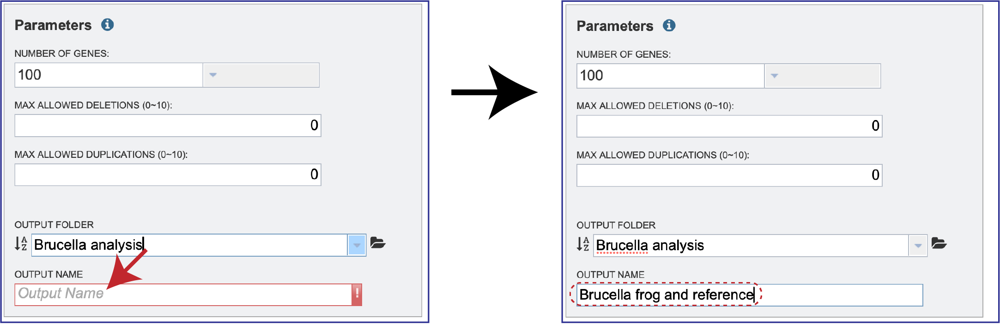

*Metadata Options*
Once the genomes and the parameters have been selected, researchers can select metadata that can be used to color the resulting tree.
1.	Click on the down arrow that follows **Metadata Options**.  This will open the **Metadata Options** box that includes a **Metadata Table**.
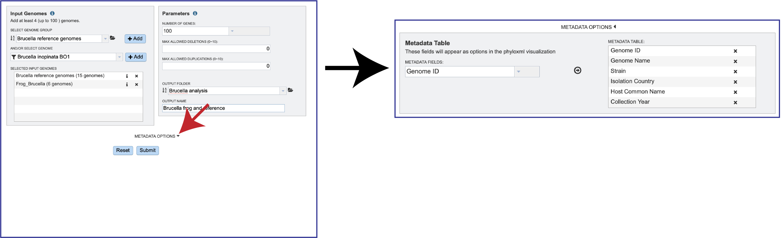

2.	Researchers can remove metadata facets that they don’t want to see on the tree by clicking on the X In the **Metadata Table** on the right side.  This will remove that data.
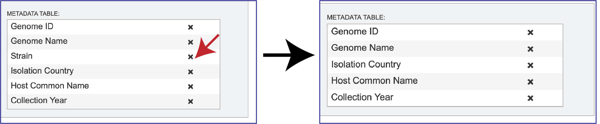

3.	To add additional metadata, click on the down arrow at the end of the text box underneath **Metadata Fields**. This will open a box that shows some of the additional metadata that can be added, and then viewed on the resulting tree.
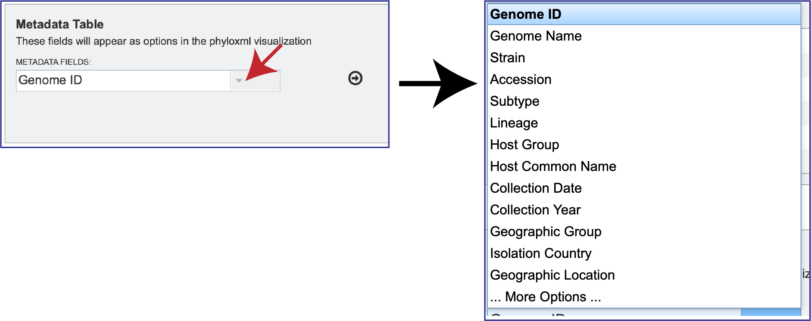

4.	To select one of the additional facets, click on it.  This will fill the text box with it, and then click on the **Arrow** icon at the end of the text box.  This will add the new faced to the **Metadata Table**.
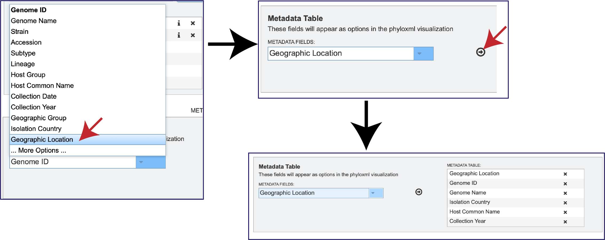

5.	But wait!  There is a lot more metadata facets that can be selected. There are a total 87 different metadata attributes that can be selected.  To view the entire list, click on **More Options** at the bottom of the box.  This will expand the box to show all of the available facets.  Note that not all facets have the selected metadata available for all genomes.  
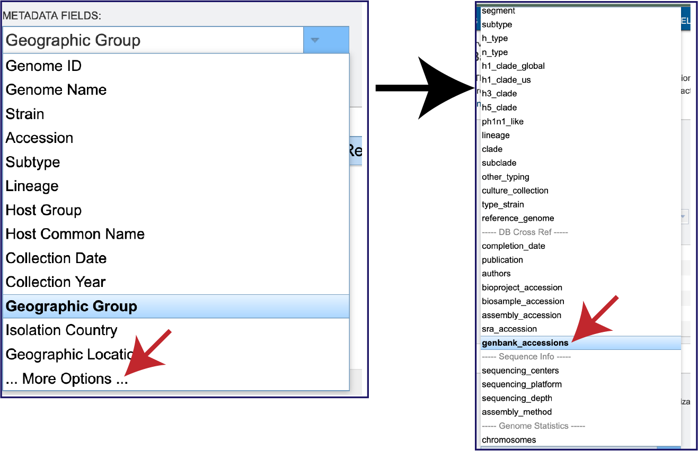

6.	Once the genomes have been selected, the parameters have been defined, and the metadata selected, click on the **Submit** button at the bottom of the page.
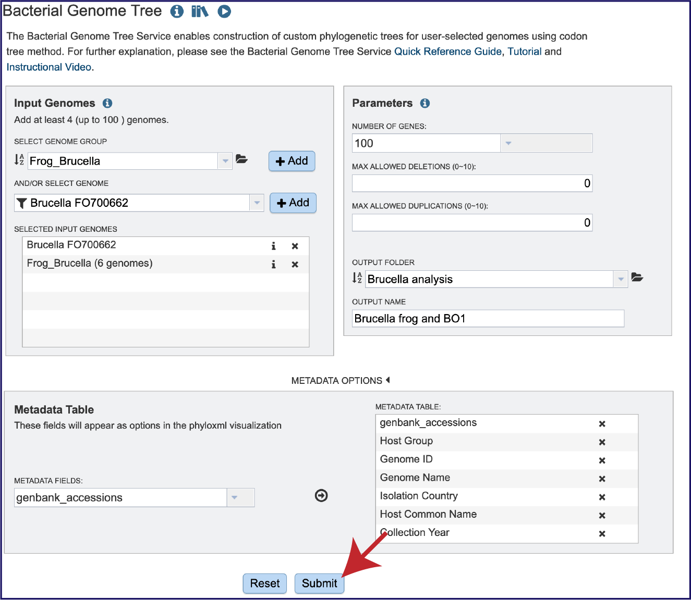

7.	A message will appear above the submit button, indicating that the submission was successful. 

## Monitoring progress on the Jobs page

1.	Click on the Jobs box at the bottom right of any BV-BRC page. 

2.	This will open the Jobs Landing page where the status of submitted jobs is displayed. 

## Viewing the Bacterial Phylogenetic tree job results

1.	To view a particular job, click on a row to select it. Once selected, the downstream processes available for the selection appear in the vertical green bar.  Clicking on the **View** icon will open the phylogenetic tree job summary.
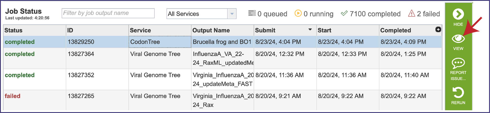

2.	This will rewrite the page to show the information about the phylogenetic tree job, and all of the files that are produced when the pipeline runs.  The **VIEW** icon at the top right of the page (to the left of the green bar) and the **report.html** file will be discussed in separate sections below.
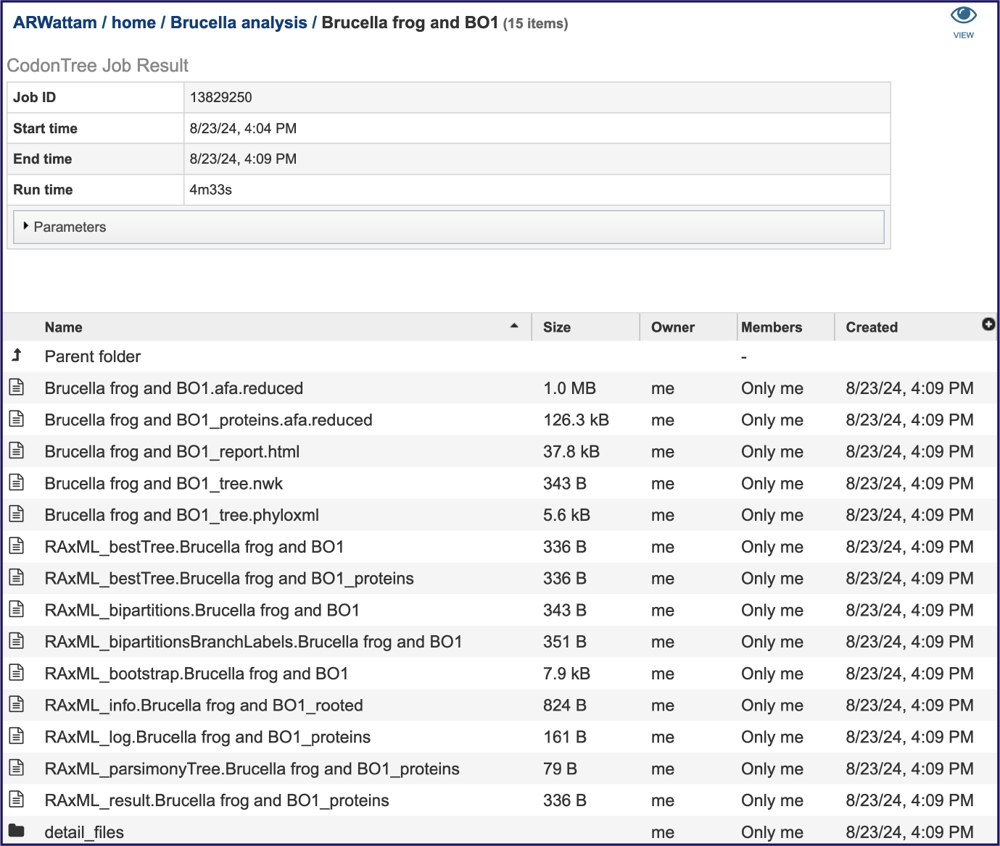

3.	The information about the job submission can be seen in the table at the top of the results page.  To see all the parameters that were selected when the job was submitted, click on the Parameters row. 

4.	This will show the information on what was selected when the job was originally submitted. 

5.	The "**afa.reduced**" files are versions of the alignment files omitting entries (genomes) that have exactly the same aligned sequence. These are likely not useful for the researcher but can be downloaded by clicking on the **Download **icon in the green action bar.
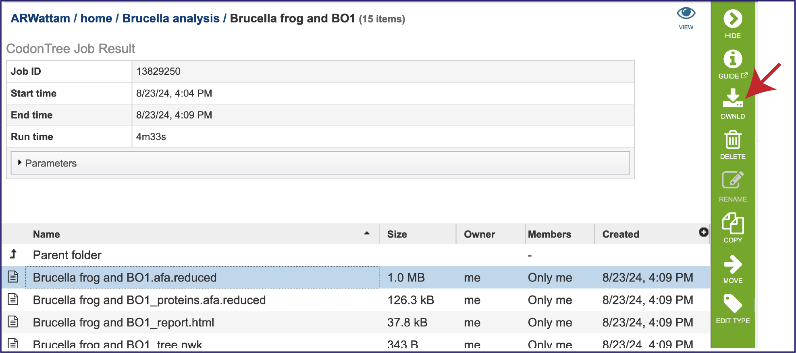

6.	An important step in tree inference is estimating the optimal protein substitution model. This is done by analyzing a subset of the data containing 10% of the aligned amino acids from each protein family using the PROTCATAUTO function of RAxML. This can be found in the **proteins.afa.reduced** file, which probably will not be that useful for the researcher but is available for download by clicking on the **Download** icon in the green action bar.

7.	A newick tree format is a way of representing graph-theoretical trees with edge lengths using parentheses and commas. These  are the instructions for drawing the tree, and they can be downloaded and used in other tree viewing software.  The **tree.nwk** file can also be viewed by selecting the row, and then clicking on the **View** icon in the green action bar.   This will open the Archaeopteryx vewer, showing the genome IDs instead of the names.
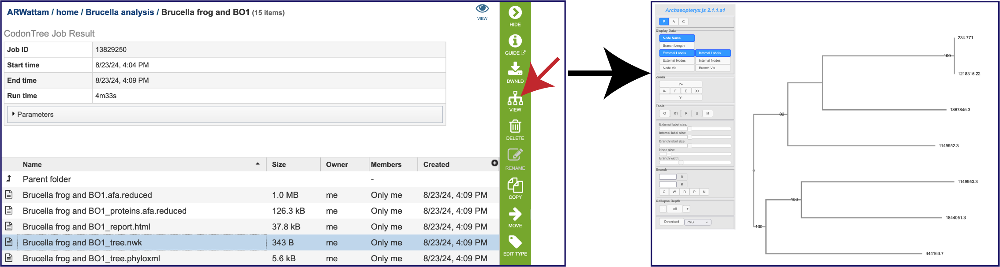

8.	The RAxML pipeline produces a number of different newick files, all of which are provided.  These different iterations may  not be valuable for researchers but are provided for those interested.
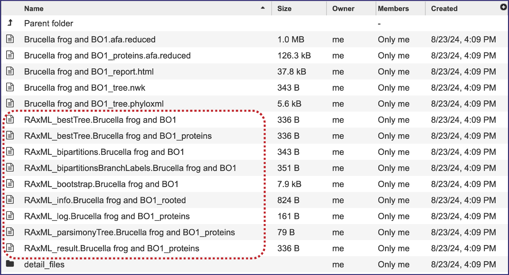

9.	PhyloXML is an XML language designed to describe phylogenetic trees (or networks) and associated data.  This pipeline includes a **tree.phyloxml** file that can be downloaded.  It can also be viewed by clicking on the **View** icon in the green action bar.
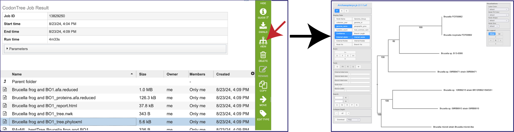

10.	If one didn’t think there were enough files, there are more in the **Details** folder.  This can be accessed by clicking on that row.  This will rewrite the page to show all the additional files produced by this pipeline.
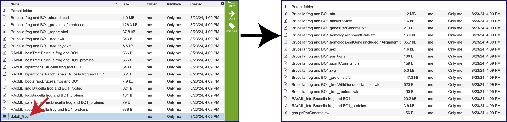

11.	Within the **Details** folder, the **treeWithGenomeNames.nwk** file is perhaps the best one to download and use in other viewers as it has the names of the genomes. This can be viewed in the Archaeopteryx viewer by clicking on the row, and then on the **View** icon in the green action bar.
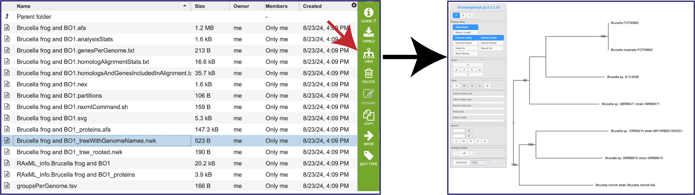

13.	The **analysisStats** file gives the statistics for the Codon Tree job, including the number of genomes, protein alignments, aligned amino acids, gene (CGS) alignments, aligned nucleotides and a list of the protein families used.  This information is also available in the html file and can be downloaded. 

14.	The **genesPerGenome.txt** file shows the Genome IDs, the number of genes in that genome, the number of those genes that were single copy, and the number of genes viewed.  The file can be downloaded or viewed by clicking the **View** icon. This information is also available in the html file. 

15.	The **homologAlignmentStats.txt** file shows the statistics for each of the protein families used in the Codon Tree job.  The information includes the protein family ID, the number of gaps, the mean squared frequency (This calculates the frequency of each letter per column and then sum the square for each column, which would be 1.0 if all had the same letter), the number of positions in the alignment for that family, the number of sequency from all the genomes, the proportion of the alignment that consists of gap characters, the sum squared frequency (The sum of all the mean squared frequencies in the alignment, which is used to select the best alignment.) and the an indication if the protein family was used in the analysis.  The file can be downloaded or viewed in the page by clicking the **View** icon. 

16.	The **homologsAndGenesIncludedInAlignment.txt** file gives a list of the protein families and the unique identifier for each protein/gene used in the alignment. The file can be downloaded or viewed in the page by clicking the **View** icon. 

17.	The **nex** file is used to generate the graphics in a program like FigTree.  It contains parameters that tells the graphics file how to draw it.  It can be downloaded by clicking the **Download** icon. 

18.	The **partitions** file tells RaxML which alignment columns are first, second or third codon position nucleotides, or amino acids. It can be downloaded by clicking the **Download** icon. 

19.	The **raxmlcommand.sh** provides the command script to run the pipeline for the tree that was generated.  It can be run on your personal computer, can be downloaded by clicking the **Download** icon. 

## Phylogenetic Tree Report (report.html)

1.	The **report.html** file provides a detailed report on the phylogenetic tree.  The report brings together many of the files available in the details folder.  To view the report, click on the row that has the **report.html** file, and then click on the View icon in the vertical green bar. 

2.	This will rewrite the page to show the report, the top of which contains the midpoint rooted phylogenetic tree. **Files with more details at the bottom** of the page is hyperlink to the **Details** folder (discussed above).
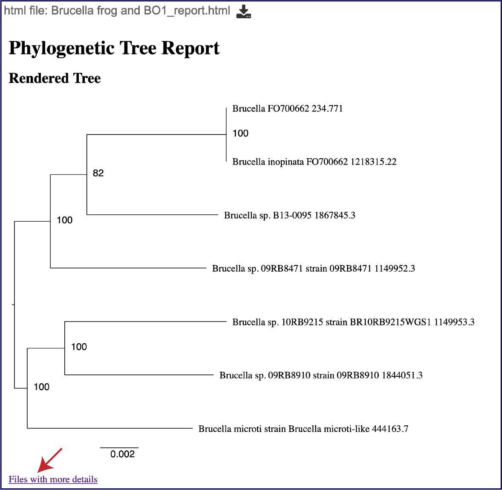

3.	Scrolling down the report will show the will show the statistics associated with the tree. 

4.	Scrolling further down the report will show the RaxML command line that was run to generate the tree. 

5.	Scrolling down further will show the partitions information, and the genome statistics. 

6.	This is followed by the Gene Family Statistics. 

7.	If the phylogenetic tree did not contain the number of genes originally selected, the report will include a section on strategies to increase the number of genes.  It will give the list of genome IDs that could be removed from the tree, and the number of genes that would be included in the tree if they were omitted. 

## Viewing the Phylogenetic tree

1.	BV-BRC also allows researchers to view the tree in the workspace, and link to other parts of the resource from the tree.  Click on the **VIEW** icon in the upper right corner. 
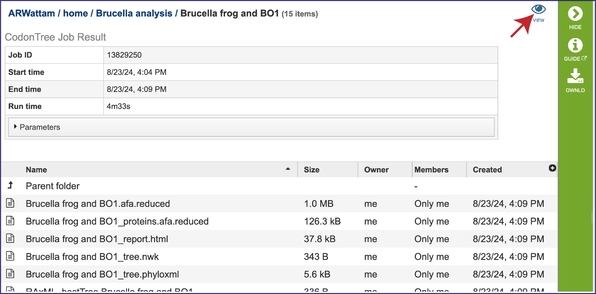

2.	This will open the Archaeopteryx interactive viewer in BV-BRC.
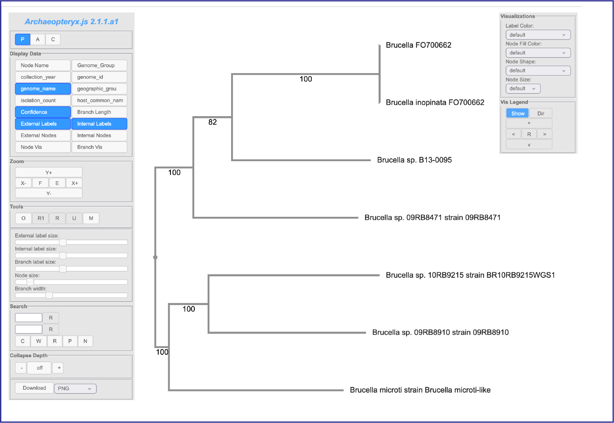

3.	This viewer has two panels that allow you to change not only the tree and its leaves, but also allow researchers to color the tree based on metadata.  More details on changing and annotating the tree are available at https://www.bv-brc.org/docs/quick_references/services/archaeopteryx.html .
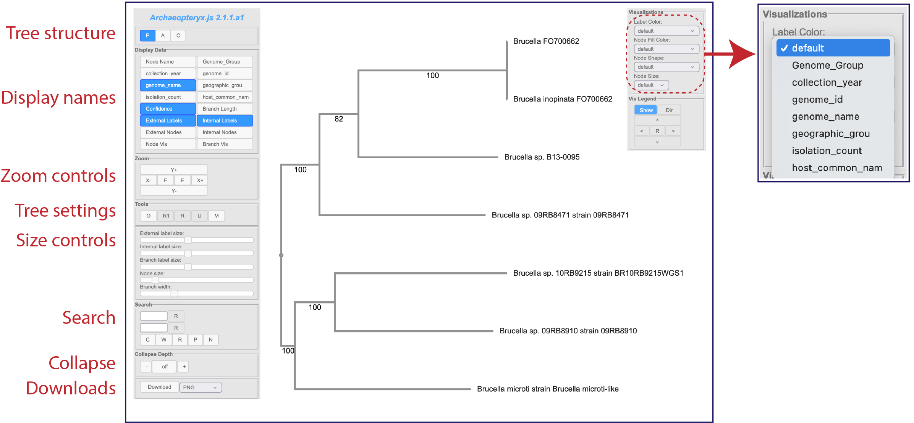

## References

1.  Olson, R.D., et al., *Introducing the Bacterial and Viral Bioinformatics Resource Center (BV-BRC): a resource combining PATRIC, IRD and ViPR*. Nucleic acids research, 2023. 51(D1): p. D678-D689.
2.	Davis, J.J., et al., *PATtyFams: Protein families for the microbial genomes in the PATRIC database*. 2016. 7: p. 118.
3.	Edgar, R.C.J.N.a.r., *MUSCLE: multiple sequence alignment with high accuracy and high throughput*. 2004. 32(5): p. 1792-1797.
4.	Cock, P.J., et al., *Biopython: freely available Python tools for computational molecular biology and bioinformatics*. 2009. 25(11): p. 1422-1423.
5.	Stamatakis, A., *RAxML version 8: a tool for phylogenetic analysis and post-analysis of large phylogenies*. Bioinformatics, 2014. 30(9): p. 1312-1313.
6.	Stamatakis, A., P. Hoover, and J. Rougemont, *A rapid bootstrap algorithm for the RAxML web servers*. Systematic biology, 2008. 57(5): p. 758-771.
