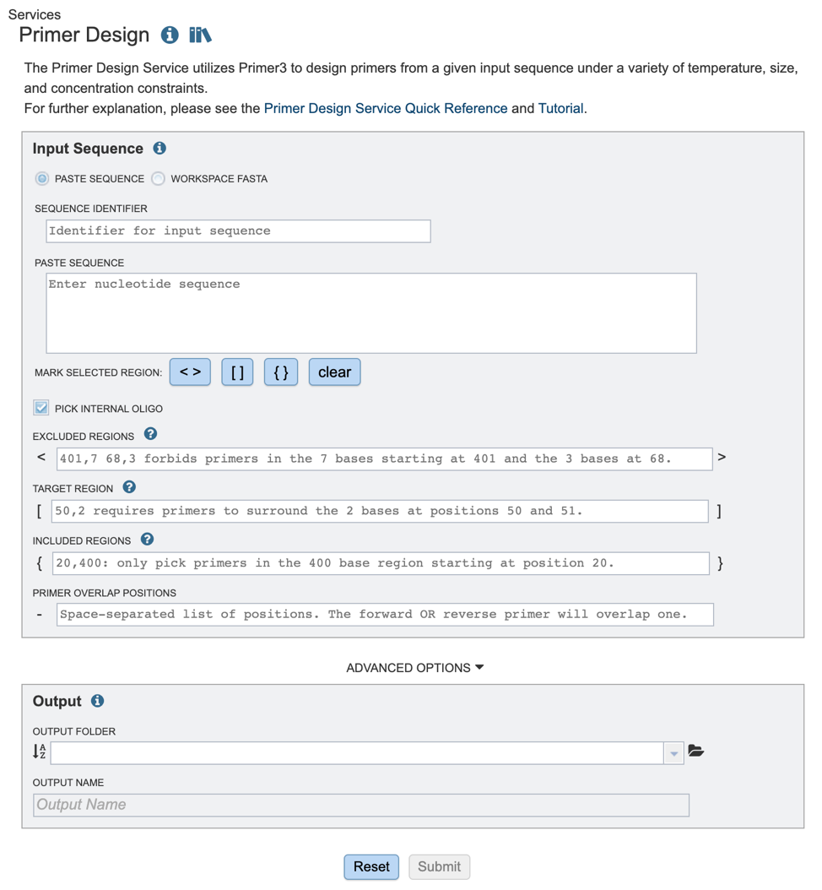
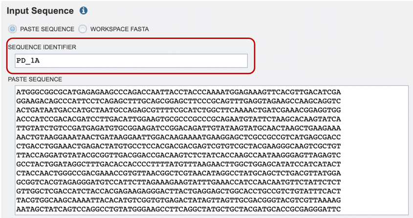
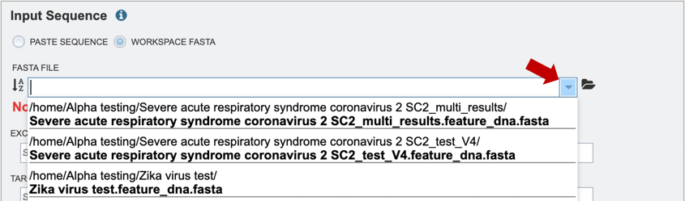
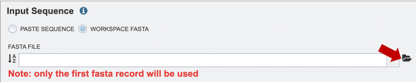
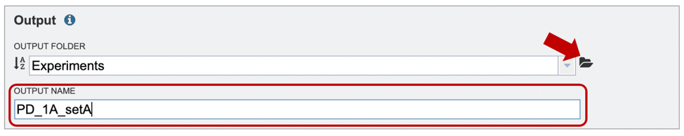
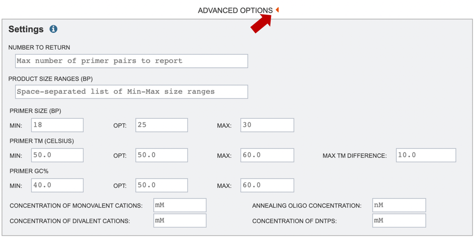
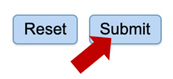
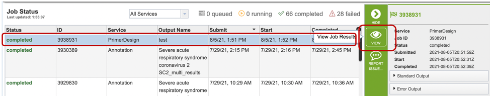
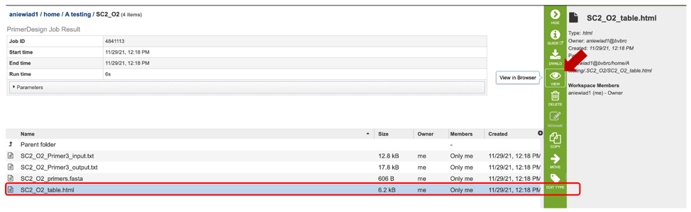
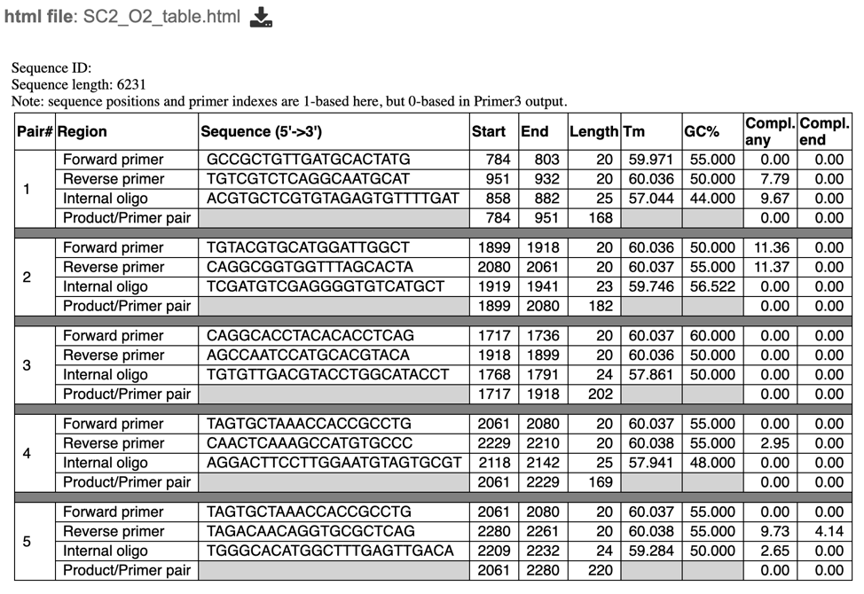

# Primer Design Tutorial

## Overview

The Primer Design Service in the Bacterial and Viral Bioinformatics Resource Center uses the Primer3 tool [1-4] to provide users with the ability to design primers from a given input sequence under a variety of temperature, size, and concentration constraints. Primer3 can be used to design primers for several uses including, PCR primers (PCR = "Polymerase Chain Reaction"), hybridization probes and sequencing primers. 

**Keywords:** Primers, probes, oligo, oligomers, virus, bacteria, phage.
 
### See also
* [Primer Design Service](https://beta.bv-brc.org/app/PrimerDesign)
* [Primer Design Service Quick Reference](../../quick_references/services/primer_design.html)

## Locating the service

1\. At the top of any BV-BRC page, find the **SERVICES** tab and then click on **Primer Design**. 
 

2\. This will open up the Primer Design landing page. 

## Input sequence options

Users have the option to input files either through pasting in a relevant nucleic acid sequence or using a fasta file from their workspace. These methods are described below

1\. If users are pasting in their own sequence, they will need to select the **"Paste Sequence"** option and provide an appropriate sequence identifier, as shown below (red box). 

2\. Alternatively, if users would like to choose a file from their workspace, they can select the **"Workspace FASTA"** option, and either type in the name of their file or browse for it by expanding the list of available workspace files (red arrow below). 

If users would like to upload a file to their workspace, they can select the **“Workspace FASTA”** option, and click on the file folder icon to select their file for upload (red arrow below). For more information on how to upload files, please see the [Uploading Data](../quick_references/workspaces/data_upload.html) documentation. 

## Specifying parameters for primer design

1\. Once the appropriate target sequence for primer design has been uploaded, users will need to define specific regions where they wish to design primers. Selections can either be denoted by highlighting the desired regions and clicking the appropriate buttons (red box), or by manually typing in a list of coordinates in the appropriate boxes below. 

2\.	If you would like to design a hybridization probe to detect the PCR product after amplification (real-time PCR applications) you may select the “PICK INTERNAL OLIGO” option as shown above. 

* **Excluded Regions:** Values should be one or a space-separated list of start, length pairs. Primers will not overlap these regions. These values will be denoted with “< >” symbols.
* **Targets:** Values should be one or a space-separated list of start, length pairs. Primers will flank one or more regions. These values will be denoted with “[ ]” symbols.
* **Included Regions:** Values should be a single start, length pair. Primers will be picked within this range. These values will be denoted with “{ }” symbols.
* **Primer Overlap Positions:** Values should be space separated lists of positions. The forward OR reverse primer will overlap one of these positions. These values will be denoted with “-” symbol. 

3\.	After specifying an appropriate Output Folder by clicking on the folder icon (red arrow), users will be prompted to name their output file (red box). 

4\.	If users would like to further specify primer characteristics such as melting temperature, GC content or other settings, they may do so by selecting “Advanced Options” (red arrow). If no specific settings are selected, default parameters will be used, as shown below. 

* **Number to Return:** number of primers/primer pairs to return. 
* **Product Size Ranges:** desired product size range. 
* **Primer Size:** desired primer length. 
* **Primer TM:** melting temperature (Celsius) for a primer oligo.  
* **Primer GC%:** percentage of Gs (guanines) and Cs (cytosine) desired in primers.
* **Concentration of Monovalent Cations:** The millimolar (mM) concentration of monovalent salt cations (usually KCl) in the PCR. Primer3 uses this argument to calculate oligo and primer melting temperatures.
* **Concentration of Divalent Cations:** The millimolar concentration of divalent salt cations (usually MgCl^(2+)) in the PCR
* **Annealing Oligo Concentration:** A value to use as nanomolar (nM) concentration of each annealing oligo over the course the PCR.
* **Concentration of DNTPs:** The millimolar concentration of the sum of all deoxyribonucleotide triphosphates.

*More details on primer3 settings can be found on the [Primer3 Manual page [5]](https://primer3.org/manual.html#PRIMER_DNA_CONC).*

5\.	Start the primer design job by clicking on the Submit button (Red arrow). 

6\.	A message will appear below the box to indicate that the job is now in the queue. 

## Checking the status of the annotation job

1\.	Click on the Jobs indicator at the bottom of the BV-BRC page.

2\.	This will open the Jobs Status page where researchers can see the status of their annotation job. The statuses of all the service jobs that have been submitted to BV-BRC are also available. 

3\.	Once the job is completed, you can select the job by clicking on it, then click the “View” button on the right-hand bar to see the results. 

4\.	The results page will consist of a header describing the job and a list of output files, as shown below. 

5\.	The Primer Design Service generates several files that are deposited in the Private Workspace in the designated Output Folder. These include:
* **Primer3_input.txt** – a text file specifying the input sequences and the parameters used to specify the primer properties. If none are specified, default parameters will be used/listed. 
* **Primer3_output.txt** – a text file containing a list of primers and probe (if selected) candidates designed, as well as their corresponding properties. 
* **primers.fasta file** – a file containing a list of candidate primers and probes designed. Can be opened as a text or fasta file. 
* **table.html** – a HyperText Markup Language file displaying a table of output primer pairs and probes, as well as their properties, statistics, and location in the input sequence (see below). 

6\. After selecting the primer report (html file), users can view the specific details of primer pair statistics in a table as shown below. Users can also select a specific primer pair to view where in their sequence their primer set falls. 

## References

1.	Rozen S, Skaletsky H (2000) Primer3 on the WWW for general users and for biologist programmers. Methods Mol Biol 132(3):365–386
2.	Untergasser A, Nijveen H, Rao X, Bisseling T, Geurts R, Leunissen JA (2007) Primer3Plus, an enhanced web interface to Primer3. Nucleic Acids Res 35(Web Server issue):71–74
3.	You FM, Huo N, Gu YQ, Luo MC, Ma Y, Hane D, Lazo GR, Dvorak J, Anderson OD (2008) BatchPrimer3: a high throughput web application for PCR and sequencing primer design. BMC Bioinformatics 9:253
4.	https://github.com/primer3-org
5.	https://primer3.org/manual.html#PRIMER_DNA_CONC
