# Protein Family Sorter Tool

The Protein Family Sorter tool enables researchers to examine the distribution of specific protein families across different genomes.  The tool uses PATtyFams[1], the protein families that are assigned in the BV-BRC annotation process.  There are two types of PATtyFams.  The global families, known as **PGFams**, can be used for cross genus comparisons.  The local families (**PLFams**) are for intra-genus comparisons.

## Locating the Protein Family Sorter App

1.	At the top of any BV-BRC page, find the Services tab and click on Protein Family Sorter. 

2.	This will open up the Protein family Sorter landing page. 
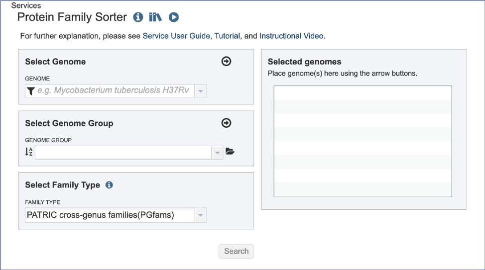

## Selecting Genomes

1.	To include any genome (reference, representative, other public, or private genomes), click on the filter button to narrow the selection and deselect the categories that are not of interest. 

2.	Typing in the text box will show a list of the genomes available that contain that text. Private genomes are indicated by a **Lock** icon. Once the genome of interest is located, clicking on it will fill the box. 

3.	The genome must be added to the genomes for comparison, a box in the Selected Genomes box. Click on the arrow at the upper right of the Select Genome box (and the name of the genome will appear in the Selected Genomes box. 

## Selecting Genome Groups

1.	To select a genome group, go to the Select Genome Group box and click on the down arrow that follows the text box. That will show a list of all the genome groups, with the most recently created appearing at the top of the list. 
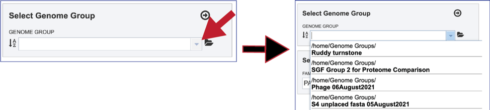

2.	Entering a name (or part of a name) in the text box will populate the drop-down box with possible groups that match that text. 
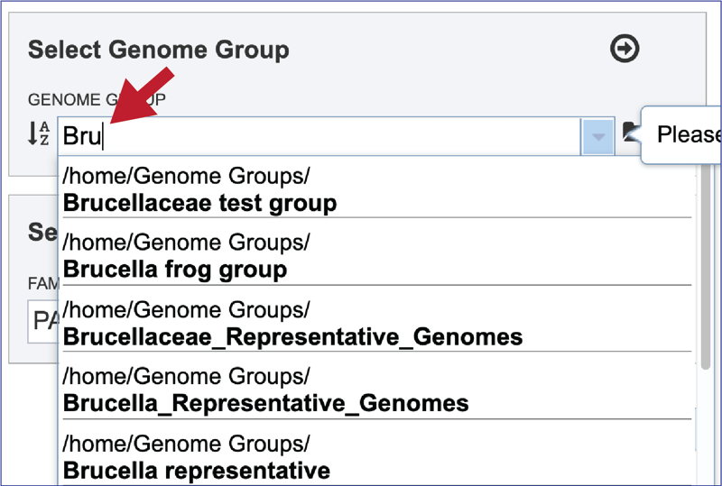

3.	Clicking on the genome group of interest will make the name appear in the text box. 

4.	The genome group must be added to the genomes for comparison, a box in the **Select Genomes** box. Click on the arrow at the upper right of the **Select Genome** box and the name of the genome will appear in the box. This can be repeated until all the genome groups or genomes of interest, have been added to the Selected Genomes box. 

## Selecting Protein Family Type

1.	BV-BRC offers three types of protein families. The default, PGFams, are protein families that cross the genus boundary. PLFams are protein families across a genus. FigFams[2] are an older protein family that is not updated, where the protein families are united by function. Clicking on the down arrow at the end of the text box under Family Type will show the two types of protein families. Clicking on one will select it for the analysis.

## Submitting the Protein Family Sorter job

1.	Once the genomes, genome groups, and type of protein families are selected, the job will be initiated by clicking the submit button. The selected data will begin loading. 
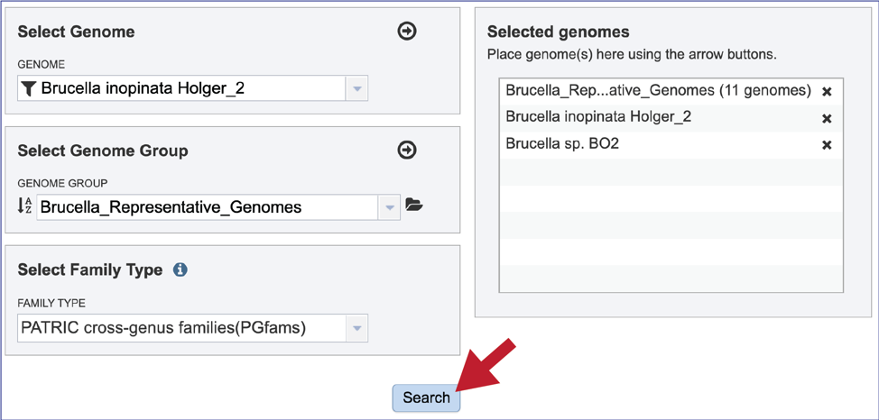

2.	This will rewrite the page, which may take some time to load depending upon the number and size of the selected genomes. 
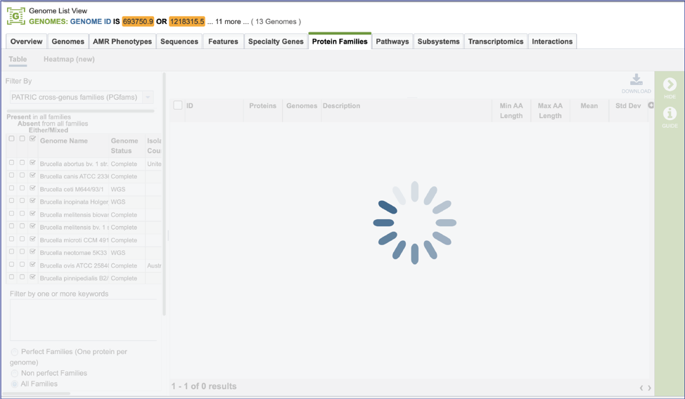

## Filtering the Protein Family Table

1.	The page will reload to show the Protein Family Table view.  This contains a dynamic filter on the left, and a table on the right that shows all the families based on the selections of the filter. 
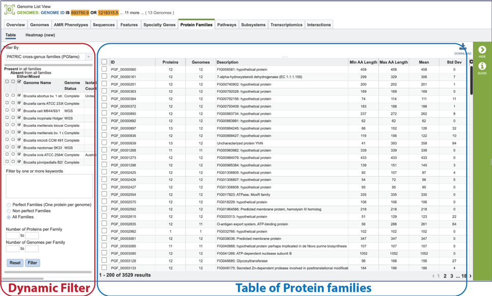

2.	The Protein Family Sorter loads showing all the protein families across all the genomes. This is the **Pan Genome**. 

3.	The Core Genome can be seen by clicking on the box in the column head below Present in all families. This will select all the genomes in the list and will reload the table to show all the protein families that are in that selection. 
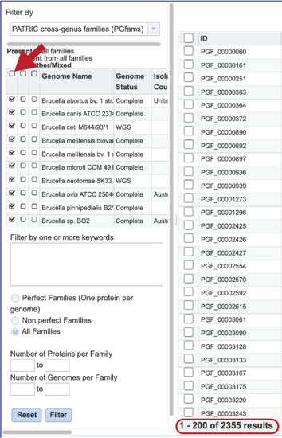

4.	The **Accessory Genome** for a species can be seen by first clicking on the box in the column head below **Absent** in all families and then clicking on the text box in the **Either/Mixed** column in front of each genome of interest. This will select all the genomes in the list and will reload the table to show all the protein families that are in that selection. 
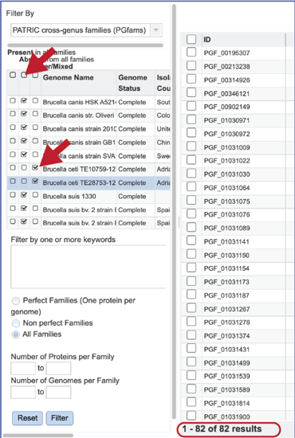

5.	The **Accessory Genome** for a single genome can be seen by first clicking on the box in the column head below **Absent** in all families and then clicking on the text box in the **Present** column in front of the genome of interest. This will select all the genomes in the list and will reload the table to show all the protein families that are in that selection. 

6.	The text filter box can be used to find protein families that contain specific names. Enter a name of interest and click the filter button. This will re-filter the table to show the protein families that contain that text in the functional description. 
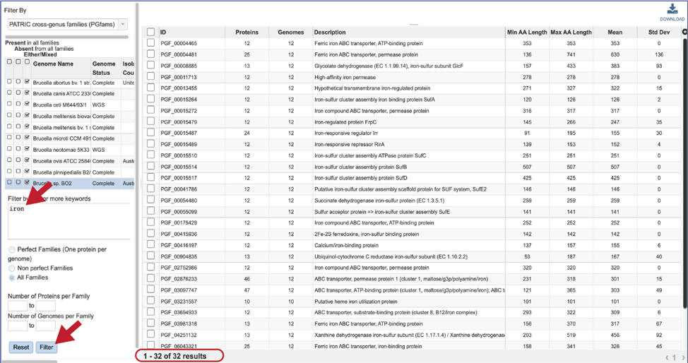

7.	The text box filter can also be used to find protein family IDs, which is an excellent way to see presence and absence across a group of genomes.  Entering the IDs in the table and then clicking on the filter icon will reload the table to show the protein families that meet that criterion. 
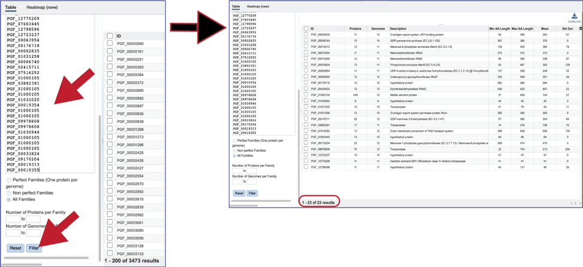

8.	There are additional filtering options below the text box.  This includes protein families meeting particular criteria.  One important filter is Perfect Families.  In BV-BRC, perfect families refer to those protein families where each of the genomes have a single protein that is part of the family.  This is an important default for the **Phylogenetic Tree Service**, which could be used to see if a group of genomes are “tree-able.” 

9.	The “non-perfect” protein families can also be examined, both selecting the **Non perfect Families** button, or filtering by the **Number of Proteins per Family**. 
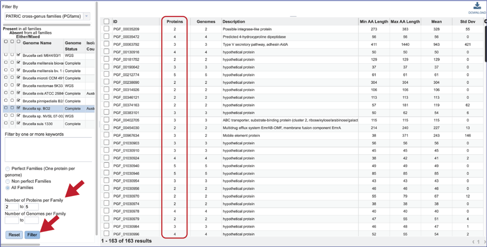

10. The number of **Genomes per Family** can also be examined. 
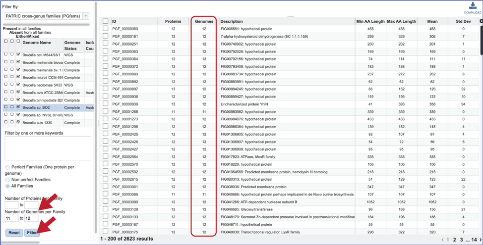

## Protein Family Sorter – Heatmap

1.	The presence and/or absence of protein families can also be seen in a heatmap view. To see the heatmap, click on the Heatmap icon above the filter. This will reload the page to show the heatmap. 

2.	A filter is directly above the heatmap.  

3.	A text box filter will highlight columns that have protein families that have text that matches the text entered into the box.  This is indicated by a blue box above the column. 
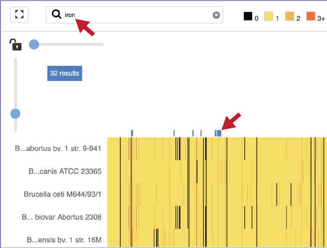

4.	Expanding the slider at the top of the heatmap view will allow researchers to expand the view enough to see the protein family name.  Note that the text in the name that matches the filter criterion will be highlighted blue.  In addition, a blue line remains directly above the column. 
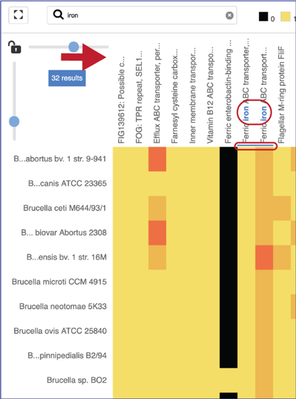

5.	Researchers can flip the axis of the heatmap view if desired. 
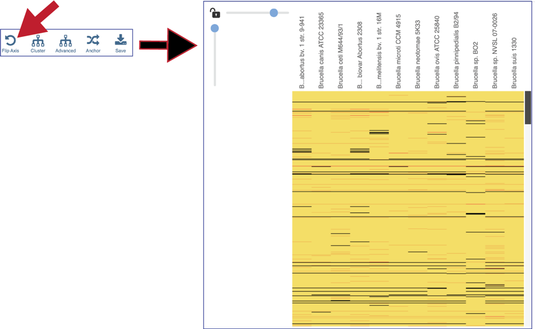

6.	The protein families can also be clustered.  This will rearrange the order of both the genomes and the protein families, depending on the clustering algorithm selected. 

7.	Clicking on **Advanced** will show the different clustering options. 
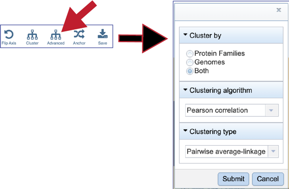

8.	BV-BRC allows researcher to cluster by either **Protein Families**, **Genomes**, or **Both**.  The default is set to Both. 
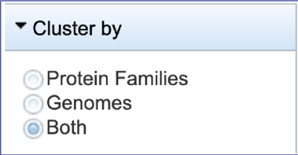

9.	To see the **Clustering algorithm** choices, click on the down arrow that follows **Pearson correlation**, which is the default setting. 

10.	Four types of clustering are available.  To see the options, click on the down arrow underneath **Clustering type** that follows **Pairwise average-linkage**, which is the default setting. 

11.	 Choosing different clustering options will change the heatmap. 
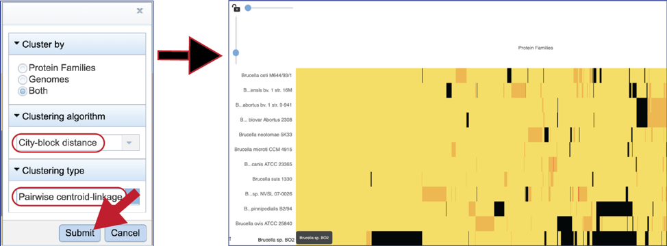

12. The protein family sorter allows users to see the protein families in the order that they appear in any given genome. This process is called anchoring a genome. To re-order the protein families, click on the **Anchor** icon. This will open a pop-up window where you can select a genome.  If you click on the down arrow that follows the words, **Select a genome**. 
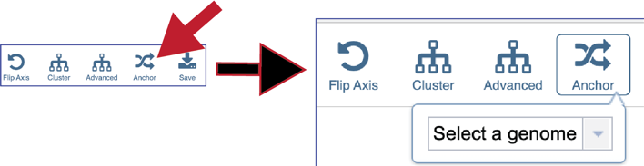

13. This will open a drop-down box of all the genomes available in the group.  The heatmap will rearrange in the order of the selected genome, starting with the first gene annotate in that genome to the last.  Researchers will be able to see regions of the reference genome that are absent in some of the comparison genomes. 

14.	Mousing over individual cells in a column will open a pop-up window that shows the genome, the protein family name and ID, and the number of genes that the genome has in that family. 

15. Areas within the heatmap can be examined.  To so this, use the mouse to draw a box over the area of interest in a heatmap, which is indicated by the blue box in the figure below.  This will open a pop-up window that show the number of genomes in the selection, the number of families within it, and the number of genes/proteins (called **Members**) within the selection. 

16. Clicking on Show Proteins will open a new tab showing the Features (aka genes/proteins) that were part of that selection. 
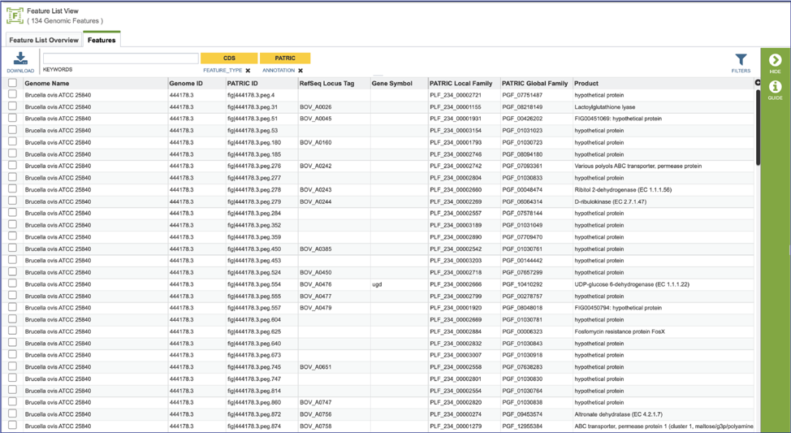

## References

1.	Davis, J.J., et al., PATtyFams: Protein families for the microbial genomes in the PATRIC database. 2016. 7: p. 118.
2.	Meyer, F., R. Overbeek, and A. Rodriguez, FIGfams: yet another set of protein families. Nucleic acids research, 2009. 37(20): p. 6643-6654.
