# SARS-CoV-2 Genome Assembly and Annotation Service

The SARS-CoV-2 Genome Assembly and Annotation Service provides a streamlined "meta- service" that accepts raw reads and performs genome assembly, annotation, and variation analysis.

A genome assembly is the sequence produced after chromosomes from the organism have been fragmented, those fragments have been sequenced, and the resulting sequences have been put back together. This is currently needed as DNA sequencing technology cannot read whole genomes in one go, but rather can read small pieces of between 20 and 30,000 bases, depending on the technology used. Typically, the short fragments, called reads, result from shotgun (random) sequencing of genomic DNA. In some cases, microbes such as certain virus species with RNA genomes may first have to be reverse transcribed into DNA before they can be sequenced.

The protocol used for assembly and the downstream quality measures is provided by the Centers for Disease Control (CDC). This protocol was developed, tuned and validated by the Viral Discovery laboratory at CDC/NCIRD, where it was used to generate the first 16 SARS- CoV-2 genome sequences from the United States. In practice, it has been used for situations with a relatively low or predictable volume of samples and is often used in conjunction with Sanger-based tiling to resolve any potential sequencing or assembly issues. This is a reference-based assembly, which uses the genome Severe acute respiratory syndrome coronavirus 2 (Taxonomy ID: 2697049, refseq ID: NC_045512.2, Severe acute respiratory syndrome coronavirus 2 isolate Wuhan-Hu-1). Additional information and the code can be found here: https://github.com/CDCgov/SARS-CoV-2_Sequencing. 

A summary diagram of the workflow based on the sequencing platform can be found below.

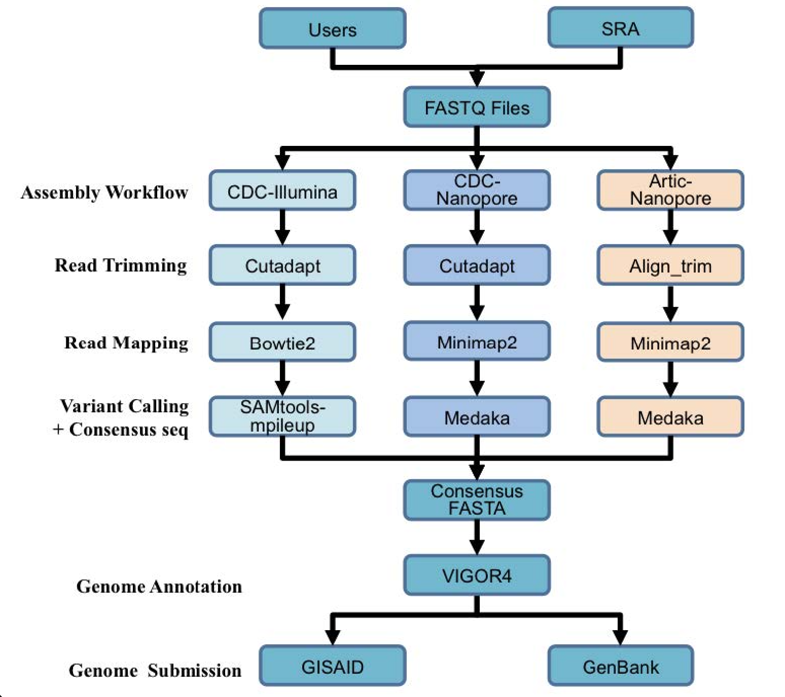

Genome annotation uses the Viral Genome ORF Reader pipeline (VIGOR4), which was developed at the J. Craig Venter Institute. VIGOR 4 predicts protein sequences encoded in a viral genome by sequence similarity searching against curated viral protein databases. The code for VIGOR4 can be found at https://github.com/VirusBRC/VIGOR4. A schematic of the VIGOR4 program workflow can be found below.
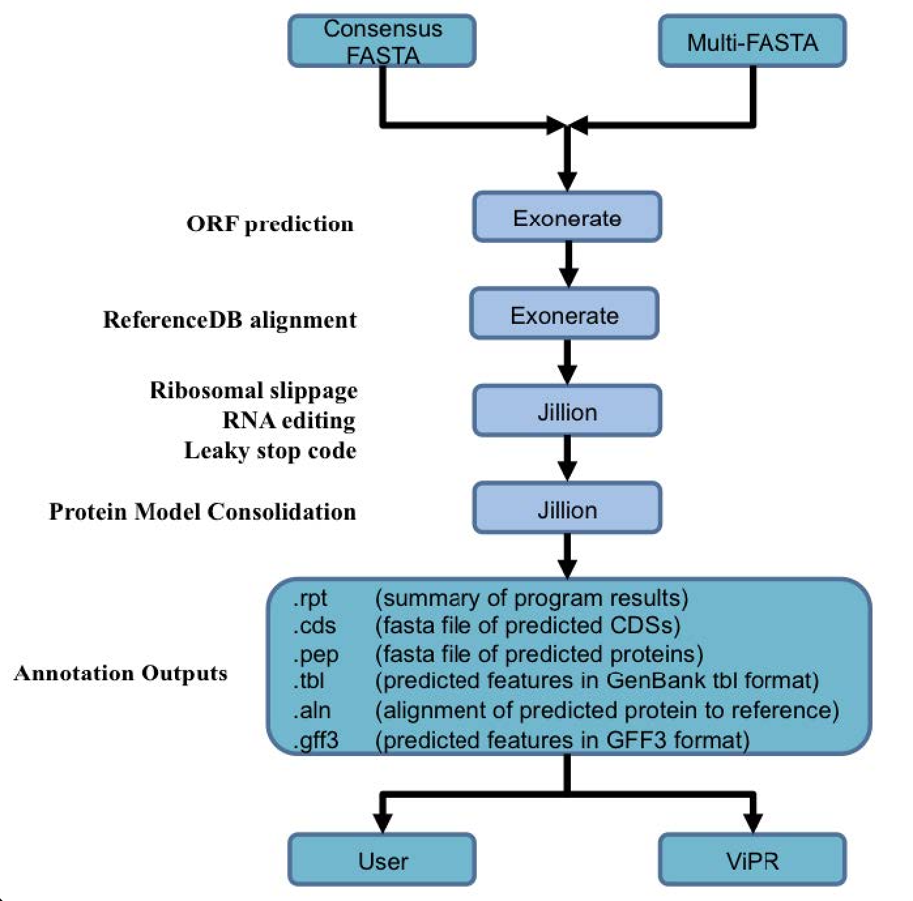

## Accessing the SARS-CoV-2 genome assembly and annotation service

You can find the genome assembly and annotation service under the Services menu at the top of the any BV-BRC page. 

Click the link to launch the service.
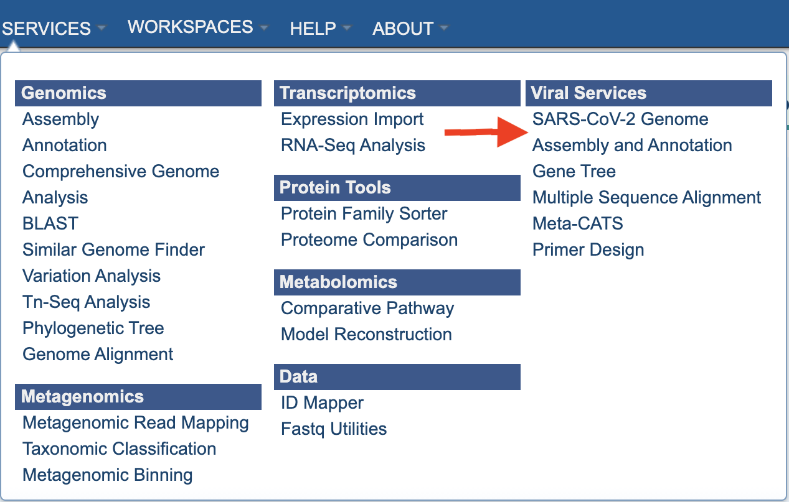

The landing page for the SARS-CoV-2 genome assembly and annotation service has three parts. You can start with reads or contigs, select the files that you would like to analyze, and then select the parameters.
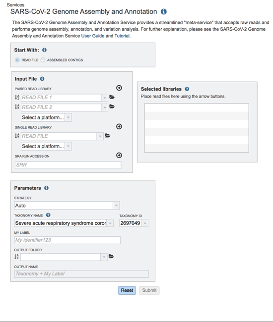

## Submitting Reads to the Service

1. Submitting paired read libraries. To assemble paired or single read libraries, or a read file from the Sequence Read Archive (SRA), click on Read File.
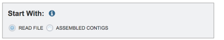

2. Read files must be uploaded into the workspace. To upload paired read files, click on the folder icon at the end of the text box underneath the words Paired Read Library.

3. This will open a pop-up window where you can select files. Whatever is uploaded in this process will be tagged as read files. To select the first file, click on the blue “Select File” bar in the center of the window.
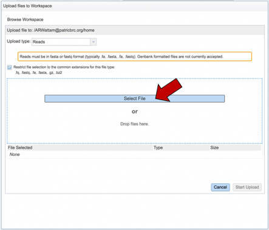

4. This will open a window that allows you to choose files that are stored on your computer. Select the file where you stored the fastq file on your computer and click “Open”.
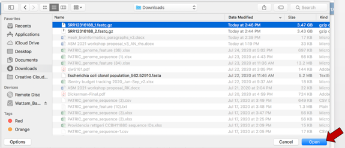

5. Once selected, it will autofill the name of the file. Click on the Start Upload button.

6. This will auto-fill the name of the document into the text box.
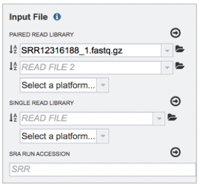

7. Pay attention to the upload monitor in the lower right corner of the PATRIC page. It will show the progress of the upload.
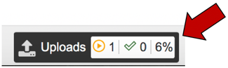

8. Repeat to upload the second pair of reads.
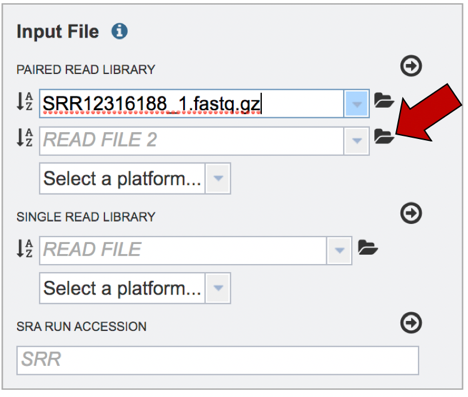

9. Do not submit the job until the upload is 100% complete.
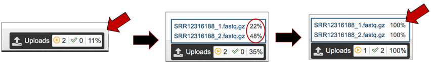

10.	Click on the arrow that follows the “Select a platform” box below the paired reads.
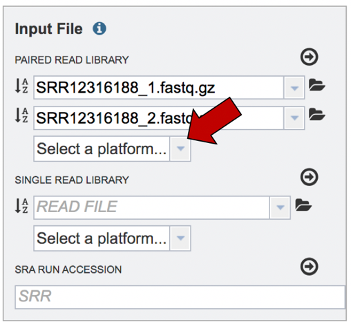

11.	The Assembly service will assemble Illumina or Ion Torrent reads. Click on the platform used to sequence the genome or click on Infer Platform to allow the service to determine the reads.
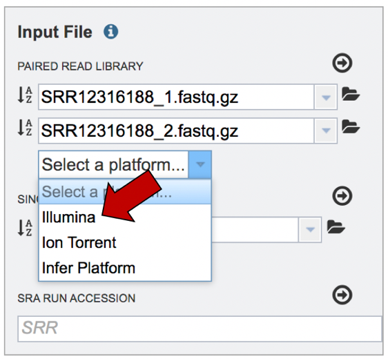

12.	The reads must be moved to the Selected libraries box. Click on the arrow right above the text box.
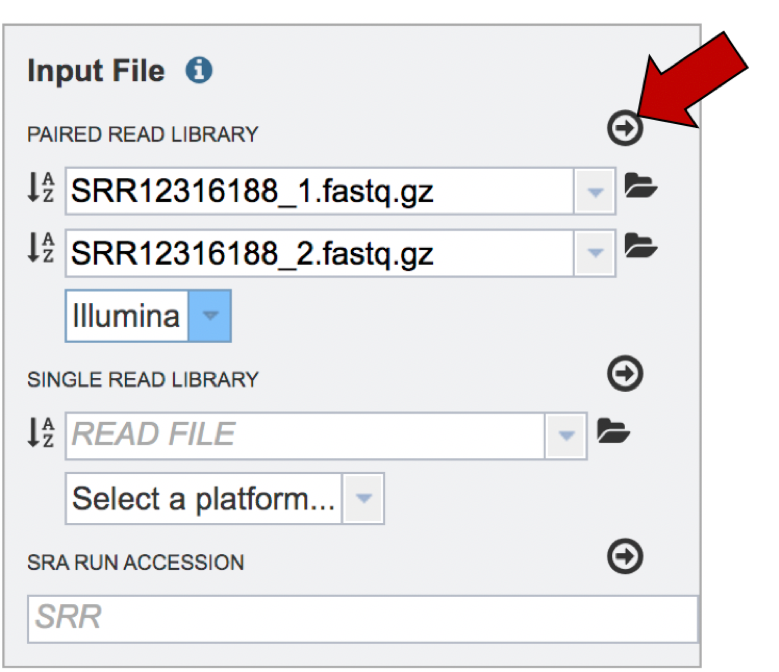

13.	This moves the paired reads to the Selected libraries box. Clicking on the “x” will remove the reads from this box and clicking on the “I” will show the reads that were submitted in each individual row.
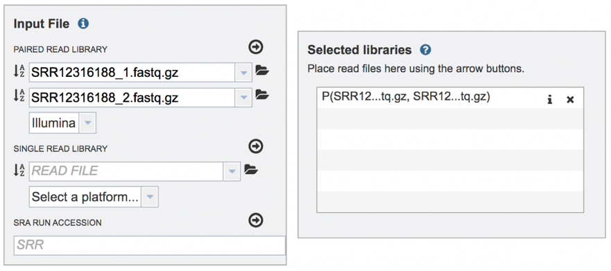

14.	**Submitting single read libraries**. To submit single read libraries, you can upload files as described above. However, if you have previously uploaded the data to your workspace, you can access your workspace by clicking on the folder icon at the end of the text box underneath the words Single Read Library.
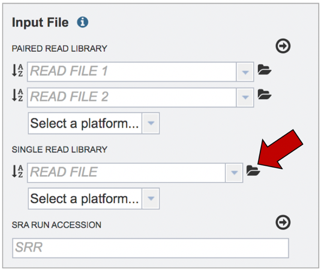

15.	This will open a pop-up window where you can see the files in your workspace. Scroll to the files of interest. If your data is in a particular folder, find the folder and double click on it.
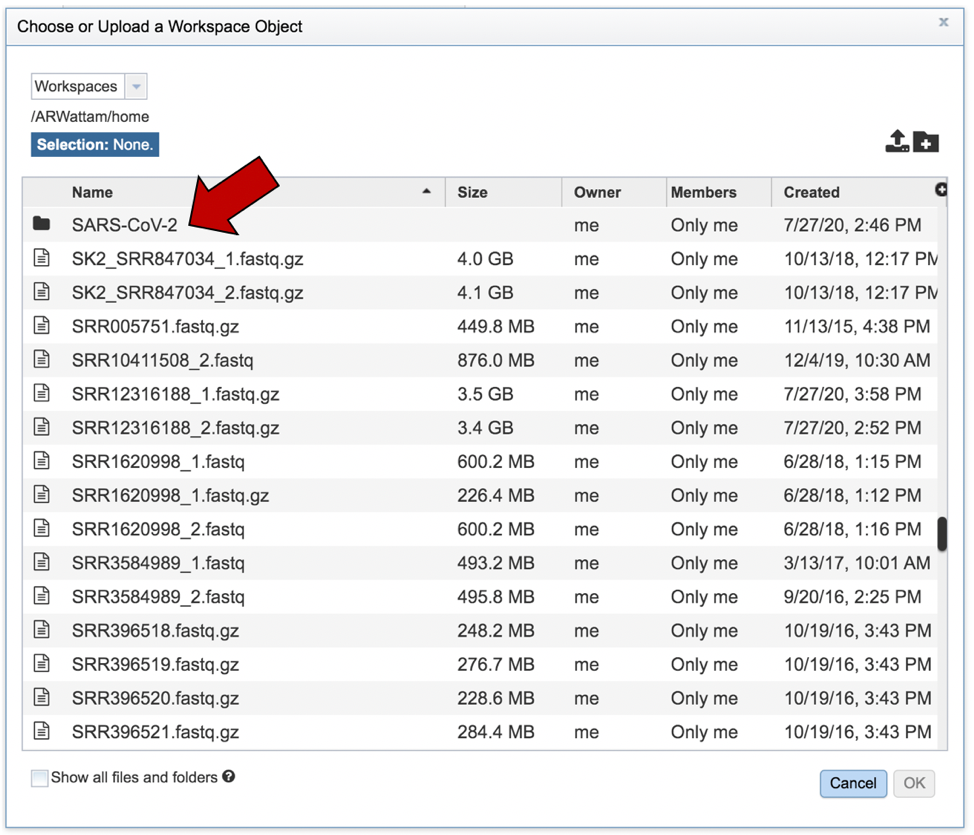

16.	This will open that folder. Clicking on the row that has the read files will highlight the row blue. Once that row is selected, click on the OK button at the bottom right corner.
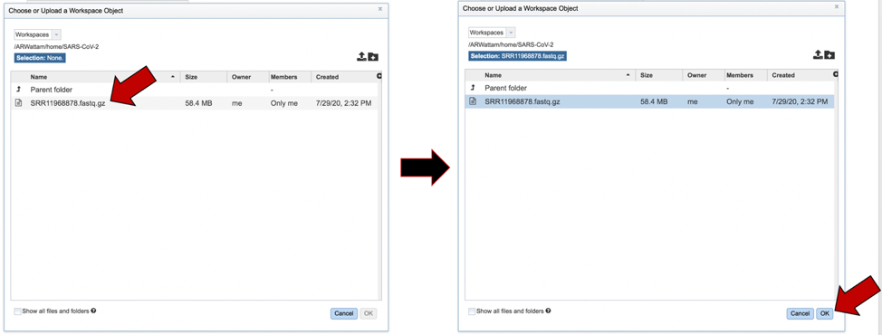

17.	The name of the file will appear in the text box. To select the sequencing platform associated with the file, click on the down arrow in the text box underneath the name.
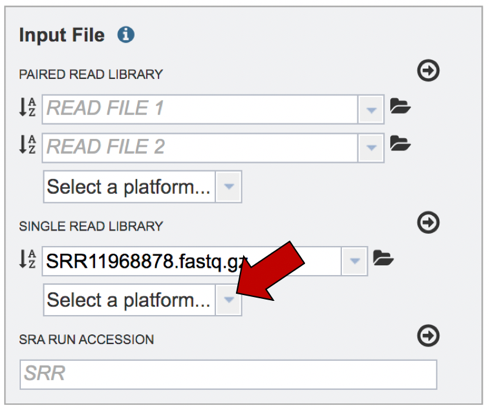

18.	If the sequencing platform is known, click on the appropriate row. If the sequencing platform is unknown, or not shown in the drop-down, click on Infer Platform.
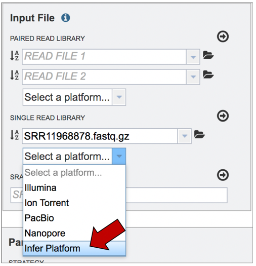

19.	The read files must be moved into the Selected libraries box to the right. Click on the arrow to the right of the words SINGLE READ LIBRARY to transfer them.
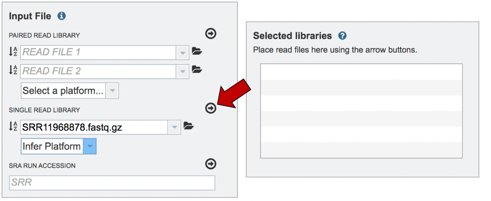

20. This moves the paired reads to the Selected libraries box. Clicking on the “x” will remove the reads from this box, and clicking on the “I” will show the reads that were submitted in each individual row.

21.	**Submitting reads from the Sequence Read Archive (SRA)**. BV-BRC also allows researchers to submit reads that are available in the SRA. Enter the SRA run accession number in the text box.
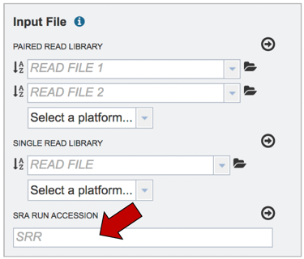

22.	After the accession number is entered, the reads must be moved into the Selected libraries box to the right. Click on the arrow to the right of the words SRA RUN ACCESSION LIBRARY to transfer them.
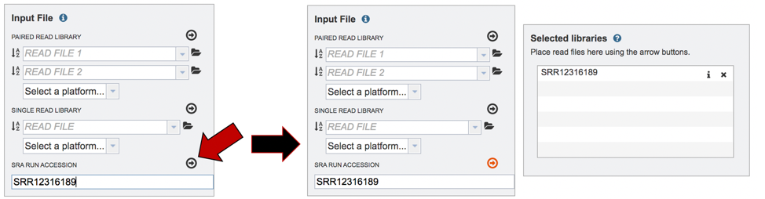

## Selecting Parameters

1. **Assembly strategy**. BV-BRC provides several assembly strategies. Click on the down arrow in the text box under STRATEGY to see the possibilities.

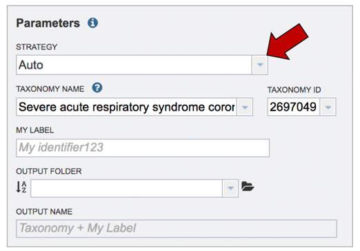

2. This opens a drop-down box that shows the three assembly strategies that are offered.
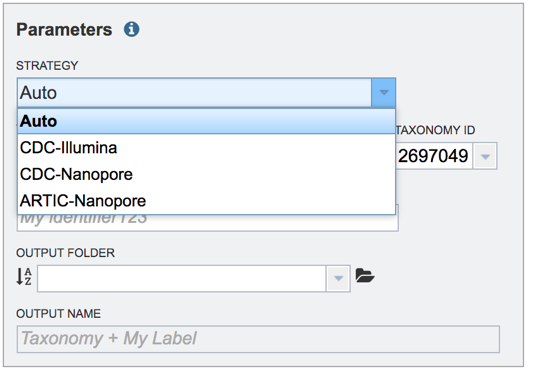

3. The three strategies can be seen in the diagram below. The CDC-Illumina assembly strategy uses Cutadapt[1] for trimming, Bowtie2[2] for read mapping, and SAMtools- mpileup[3] for variant calling and generating a consensus sequence. The CDC Nanopore strategy uses Cutadapt for trimming, Minimap2[4] for read mapping, and Medaka (https://nanoporetech.github.io/medaka/) for variant calling and generating a consensus sequence. More information about the CDC strategies can be found here: https://github.com/CDCgov/SARS-CoV-2_Sequencing/blob/master/protocols/CDC-Comprehensive/CDC_SARS-CoV-2_Sequencing_200325-2.pdf

The Artic-Nanopore strategy uses Align_trim for trimming, Minimap2 for read mapping, and Medaka for variant calling and generating a consensus sequence. More information on the Artic-Nanopore strategy can be found here: https://artic.network/ncov-2019/ncov2019- bioinformatics-sop.html

Clicking on Auto will allow the service to select the appropriate strategy.
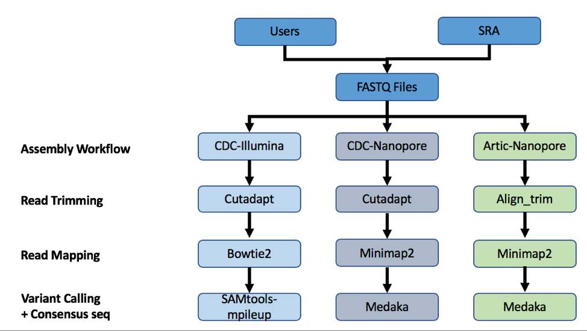

4. **Job name**. Once the appropriate strategy is selected, a unique identifier must be entered for this job. Enter the name in the text box under the words MY LABEL. Note that as you enter the text, you will see it appended to the name for the reference genome in the OUTPUT NAME box.
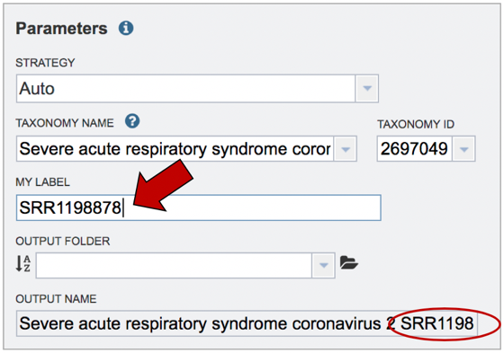

5. **Creating new folder**. The job will be placed in your private workspace. It is best to have a folder to hold the relevant information. To create a new folder, click on the folder icon at the end of the text box underneath the words OUTPUT FOLDER.
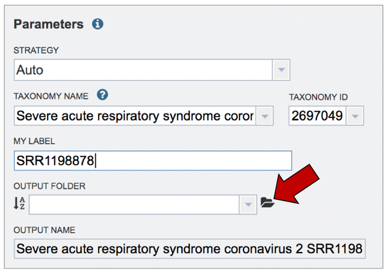

6. This will open a pop-up window to your workspace. To create a new folder, click on the Folder icon at the upper right (you could also scroll through your workspace to find an appropriate folder).
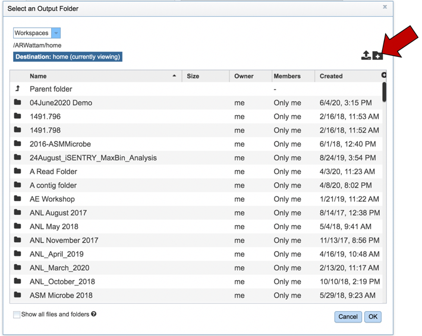

7. Clicking on the folder icon will open a pop-up window where you can name the new folder. Enter the new name in the text box.
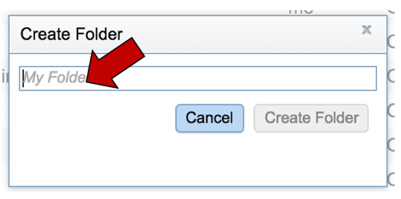

8. Click the Create Folder button to create the new folder.

9. In the workspace window, scroll until you find the newly named folder and select the row. It will turn the row blue. When that row is highlighted, click on the OK button at the lower right of the window.
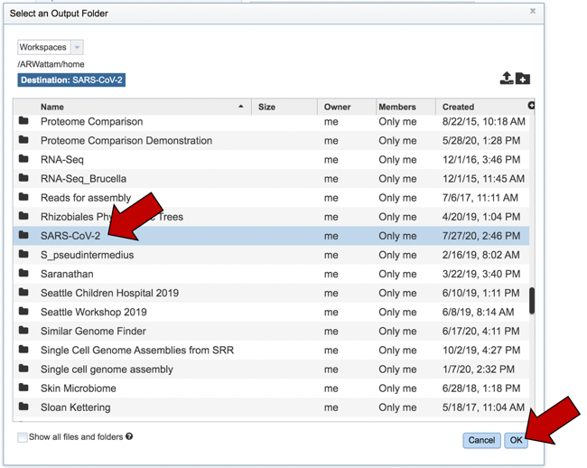

10.	**Using an existing folder**. Additionally, if a folder of interest has been recently created, you can click on the down arrow at the end of the text box.
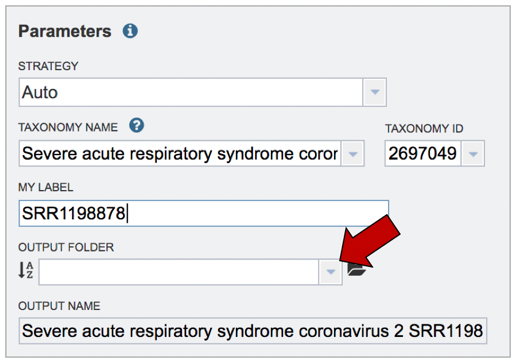

11.	This will open a drop-down box that shows the folders you have created, with the most recently named one at the top of the list. Click on the row that contains the folder you want to use.
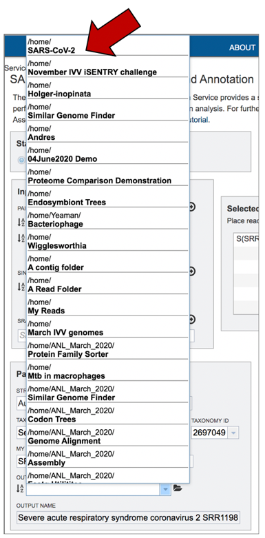

12.	The name of the folder will appear in the text box.
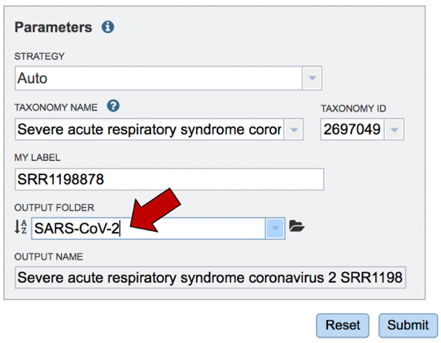

13.	**Submitting the job**. The job is now ready to be submitted. Click on the Submit button at the bottom right.
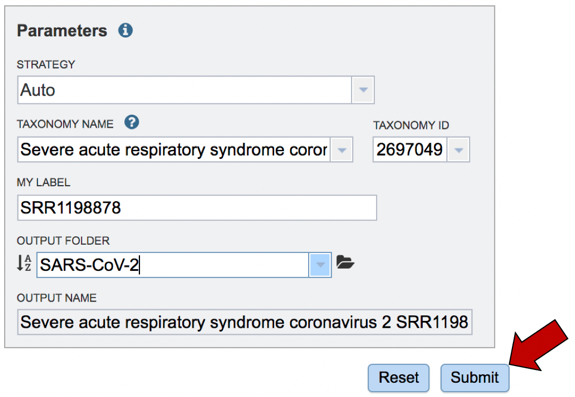

14. A message will appear telling you that the job was successfully submitted.
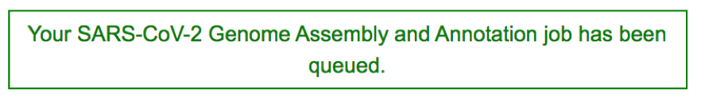

15.	Note that assembly jobs also include genome annotation using VIGOR4.
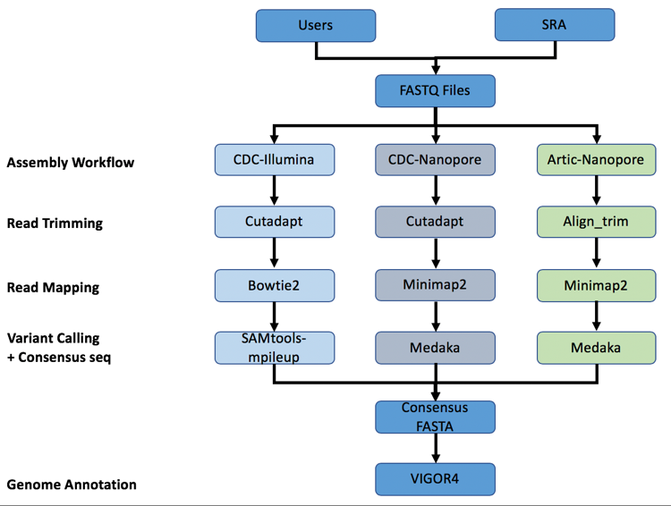

## Submitting contigs to the service

1.	To submit a contig file, click on Assembled Contigs in the upper box.
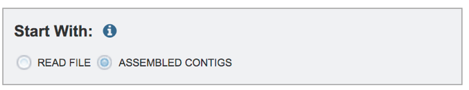

2. To upload a contig file, or to access a file that is already in your workspace, click on the folder icon at the end of the text box underneath CONTIGS. You can also enter the name of the contig file in the text box if this is known.
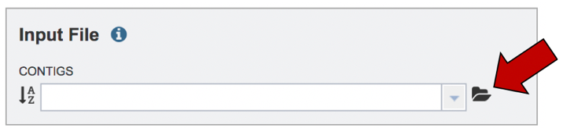

3. This will open a pop-up window that shows you your workspace and the data that is present in it. If the file is in the workspace, you can scroll until you find it, select it, and then click on the OK button at the bottom right of the pop-up window. To upload new data, click on the upload icon that you can see at the upper right of the window.
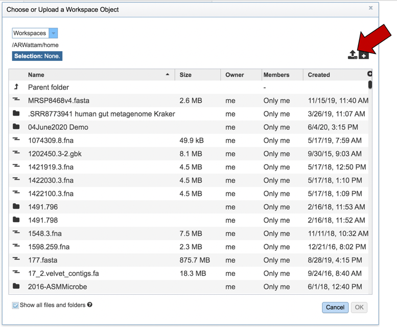

4. This will open a pop-up window that will link to your computer. Notice that it is pre-selected for contig files. Click on the blue Select File bar in the center of the window.
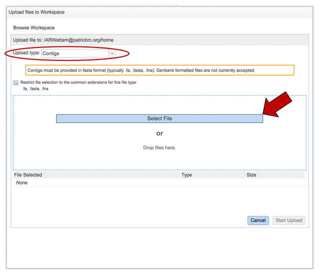

5. This will open a dialog box with your computer. Navigate to the file of interest, select the row, and then click on the Open button at the bottom right of the window.
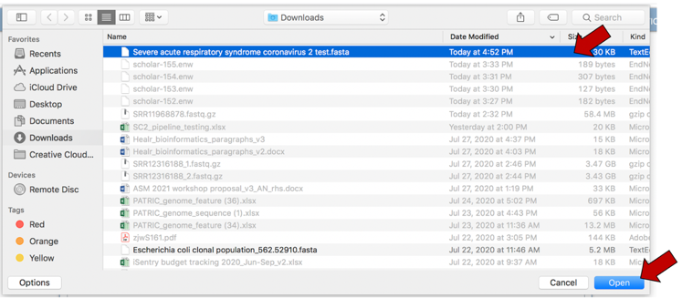

6.	The name of the file will appear below the words File Selected. Click on the Start Upload button at the lower right of the page.
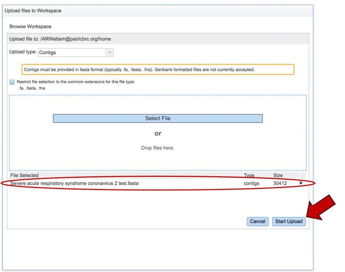

7. The name of the selected contig file will appear in the text box below the word CONTIGS.
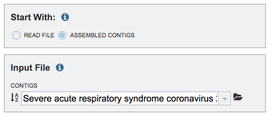

8. Assign the genome a name. As you type the name in the text box under MY LABEL you will see it appended to the taxonomy name in the box below OUTPUT NAME.
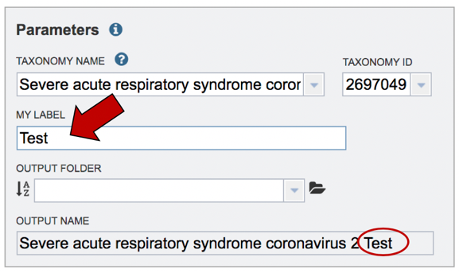

9.	The job must be placed in a folder. If you have a folder within your workspace that you would like to use, you can begin entering the name in the text box underneath the words OUTPUT FOLDER. This will open a drop-down box that shows available folders that have a name matching the text that you have entered. Click on the folder of interest.

10.	To submit the job, click on the Submit button below the Parameters box. The button will be colored blue.

11. A message will appear below the Parameters box, indicating that your job has been successfully submitted and is now queued.
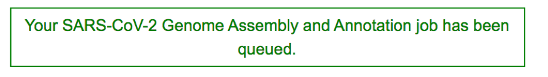

## Finding the SARS-CoV2 job submitted to BV-BRC

1.	The SARS-CoV2 job can be located from three places on any BV-BRC page. Clicking on the Workspace tab will reveal two of the places where the workspace or jobs folder can be located, and also from the Jobs monitor located at the lower right of any BV-BRC page.
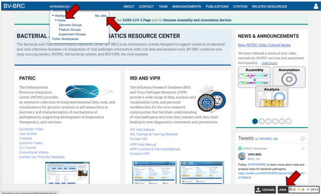

2. **Access the job though the workspace**. Click on the Workspace tab, and then on the “home” in the drop-down box.
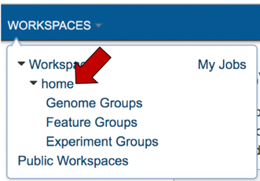

3. This will rewrite the page to show the home workspace. Scroll down until you find the folder where you stored the job, and then click on that.
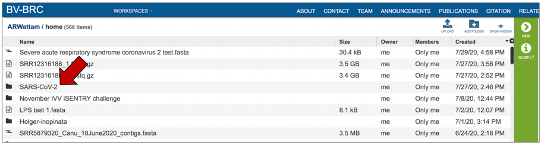

4. This will rewrite the page to show the contents of that folder. Completed jobs are indicated by a checkered flag in the first column. Clicking on the row, or the flag, that contains the job, will rewrite the page.
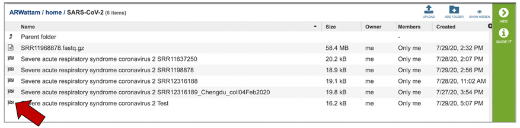

5. The new page will show all the files produced by the job that was submitted.
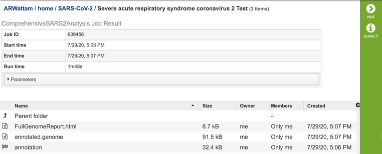

6. **Accessing the job though My Jobs, or Jobs monitor**. Click on the Workspaces tab and then on My Jobs or click on the Jobs monitor at the lower right of the page.
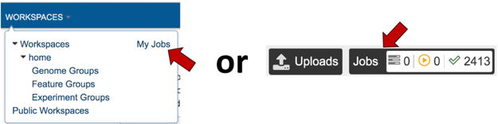

7. This will rewrite the page to show all jobs that have been submitted by the researcher. Locate the job of interest and click on that row.
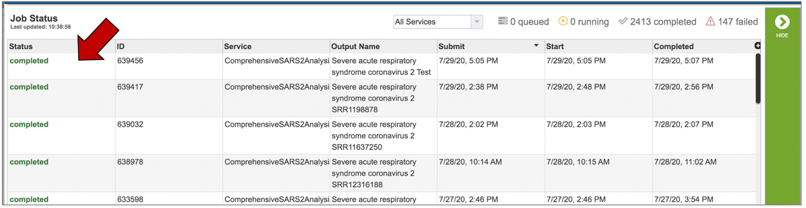

8. This will highlight the row and populate the vertical green bar to the right with possible downstream functions. To see the completed job, click on the View icon in that bar.
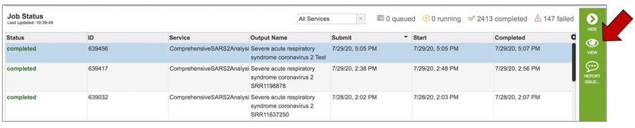

9. This will rewrite the page to show all the files produced by the job that was submitted.
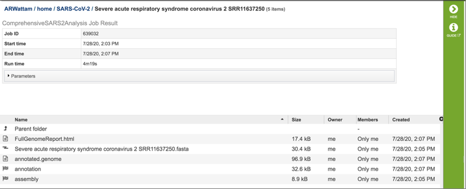

## Viewing the Full Genome.html report

1. Each job submitted to the SARS-CoV2 assembly and annotation service will return a report that summarizes the results. To view this report, click on the row that contains the words “FullGenomeReport.html”.
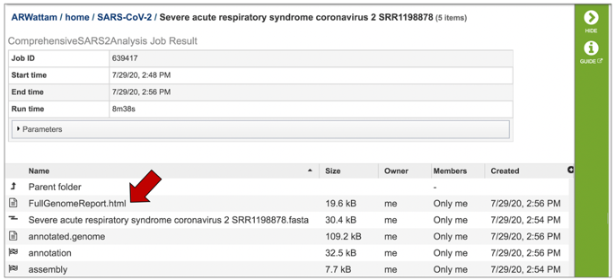

2. This will highlight the row and populate the vertical green bar with possible downstream actions. At this point, you could click on the Download icon to download the job. To view the job within the BV-BRC page, click on the View icon.
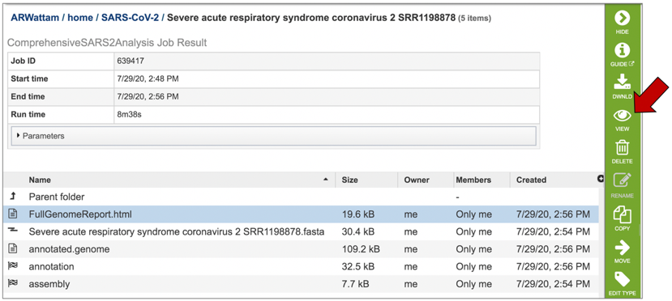

3. This will rewrite the page to show the report.

4. The report begins with a table showing the assembly statistics (if an assembly was part of the submission) that include the time that the assembly took, the recipe used, the platform and laboratory type, the assembly strategy, the number of N’s found in the assembly, and the number of N blocks in the assembly.
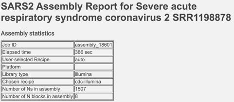

5. The report also includes a graph that shows the coverage depth for the assembly at the specific positions in the genome.
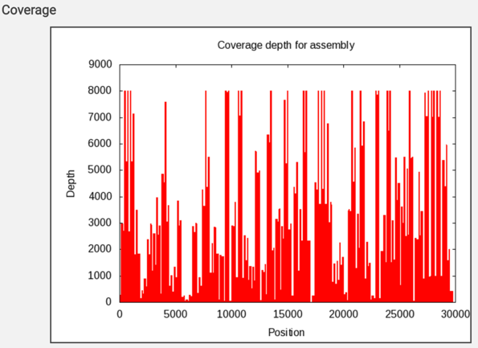

6. The report next shows the variation data according to the Variant Call Format specification (https://samtools.github.io/hts-specs/VCFv4.2.pdf). It includes the contig, the position of the snp, the nucleotide called in the reference genome, and the nucleotide called in the submitted genome.
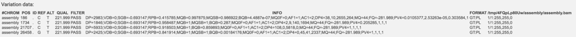

7. This is followed by the annotation report, with a box showing the time that the annotation took.
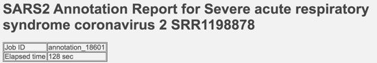

8. This is followed by a table showing the features called on the genome. This table includes the feature id, the start position of that feature on that assembly, the strand, the length, and the function of that feature.
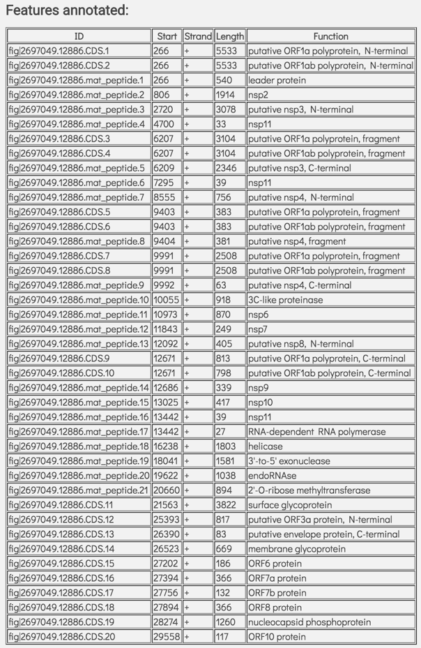

## Viewing other files generated by the SARS-CoV2 assembly and annotation job

1. Submitting a job to the assembly or annotation services generate a number of files that are available for download. These files can be seen when the job is selected either via the workspace, or through the Jobs monitor.
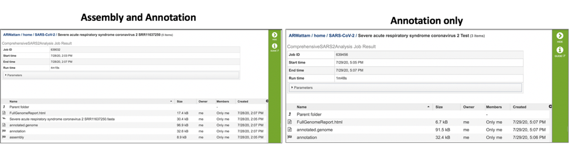

## Downloadable files available with annotation and assembly jobs.

1. Both assembly and annotation jobs share downloadable files. The annotated.genome file contains a special “Genome Typed Object (GTO)” JSON-format file that encapsulates all the data from the annotated genome. To download this file, highlight the row that contains it and click on the Download icon in the vertical green bar.
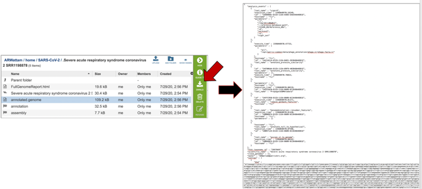

2. Both annotation and assembly jobs have a separate page with downloadable files associated with the annotation portion of the service. This page can be accessed by double clicking on the row that has the word “annotation” and the checkered flag, which indicates a completed job.
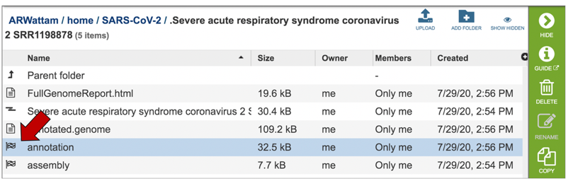

3. This will rewrite the page to all the files generated by the annotation service.
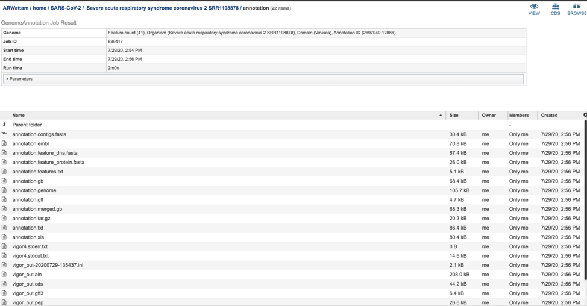

4. The _annotation.feature_dna.fasta_ file contains the DNA sequence for each feature called by the annotation pipeline. To download this file, highlight the row that contains it and click on the Download icon in the vertical green bar.
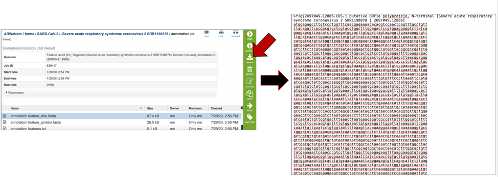

5. The _annotation.feature_protein.fasta_ file contains the amino sequence for each gene called by the annotation pipeline. To download this file, highlight the row that contains it and click on the Download icon in the vertical green bar.
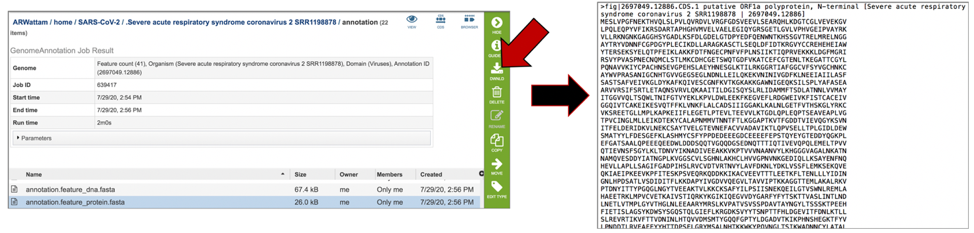

6. The _annotation.features_ file contains a list of the features, where they are located on the contig, their type, their function, any known alias, and (for protein-coding genes) the protein MD5 checksum. To download this file, highlight the row that contains it and click on the Download icon in the vertical green bar.
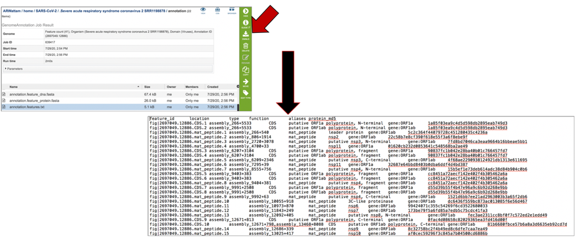

7. The _annotation.gb_ file contains the annotation in GenBank format. To download this file, highlight the row that contains it and click on the Download icon in the vertical green bar.
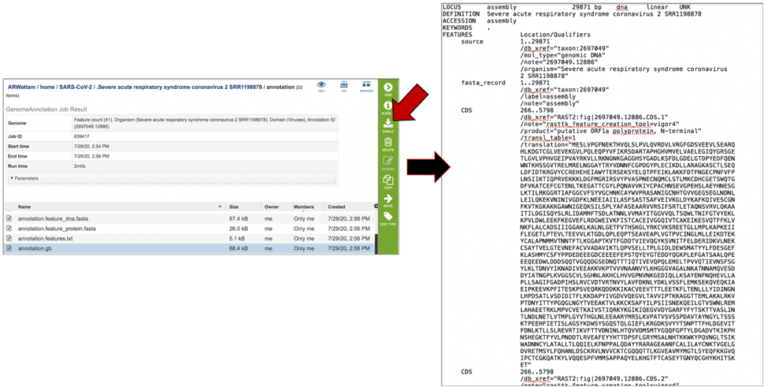

8. The _annotation.gff_ lists all the features of the genome in a General Feature Format. To download this file, highlight the row that contains it and click on the Download icon in the vertical green bar.
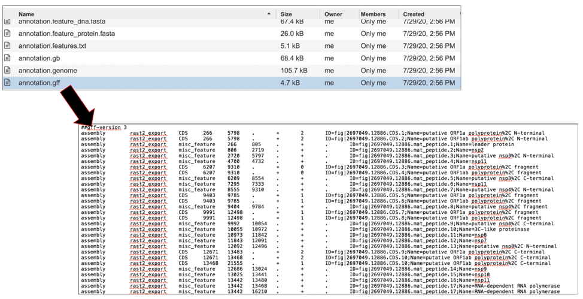

9. The _merged.gb_ has all of the contigs merged into a single locus instead of being separate locus objects. The _merged.gb_ can be used in artemis. The _annotation.gff_ lists all the features of the genome in a General Feature Format. To download this file, highlight the row that contains it and click on the Download icon in the vertical green bar.
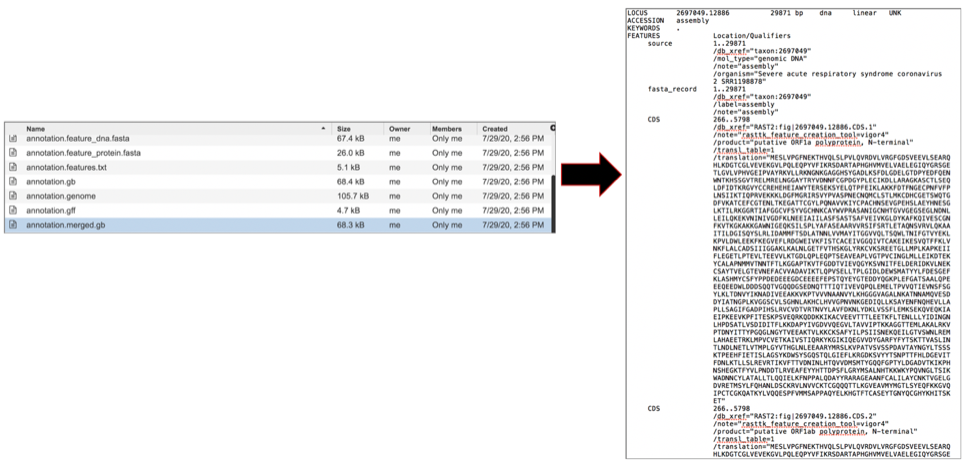

10.	The _annotation.tar.gz_ is a tar ball file where all of files are wrapped up in one single file for easy storage. To download this file, highlight the row that contains it and click on the Download icon in the vertical green bar.
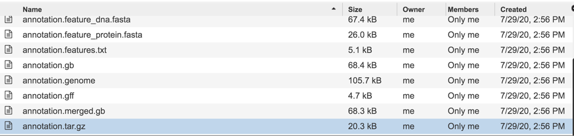

11.	The _annotation.txt_ file contains all the information on the called features, including the nucleotide and amino acid sequences. To download this file, highlight the row that contains it and click on the Download icon in the vertical green bar.
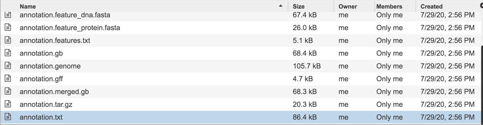

12. Like _annotation.txt_, the _annotation.xls_ file contains all the information on the called features, including the nucleotide and amino acid sequences, but in excel format. To download this file, highlight the row that contains it and click on the Download icon in the vertical green bar.
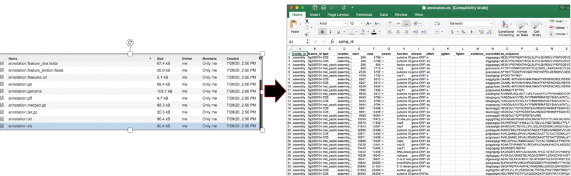

13.	The _vigor4.stderr.txt_ file shows any standard errors that result from the VIGOR4 annotation pipeline. To see the contents of this file, highlight the row that contains the file and then click on the View icon in the vertical green bar.

14.	The _vigor4.stdout.txt_ file shows the output of the VIGOR4 annotation pipeline at each step in the process. To see the contents of this file, highlight the row that contains the file and then click on the View icon in the vertical green bar.
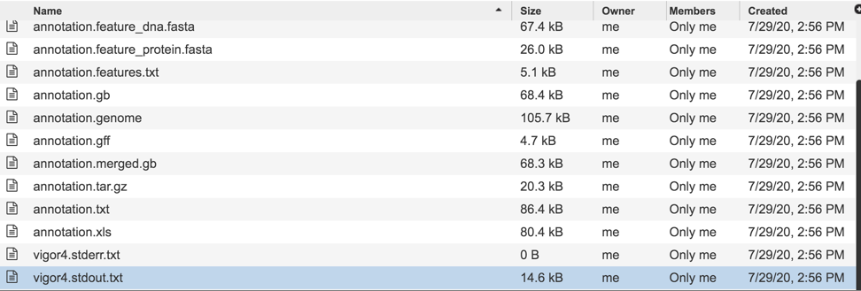

15.	The _vigor_out-20200729-135437.ini_ file contains the set of VIGOR4 settings that were used to compute that annotation. To download this file, highlight the row that contains it and click on the Download icon in the vertical green bar.
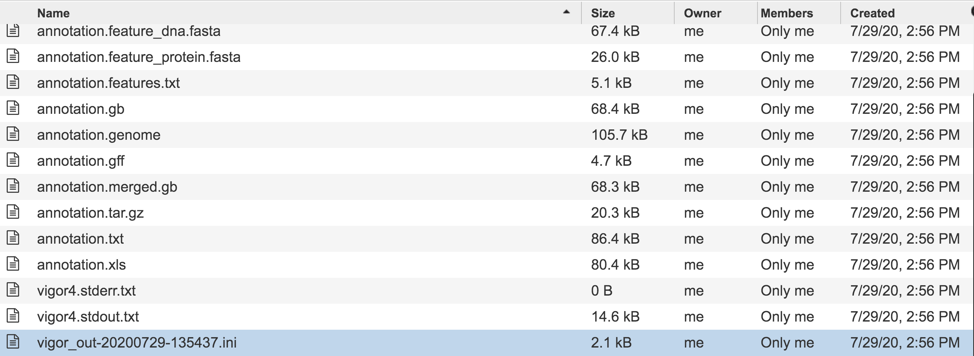

16.	The _vigor.out.aln_ file contains alignment of predicted protein to reference, and from the reference protein to genome. To download this file, highlight the row that contains it and click on the Download icon in the vertical green bar.
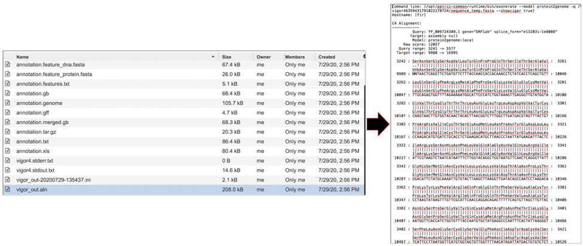

17. The _vigor_out.cds_ file is a fasta file of predicted CDSs. To download this file, highlight the row that contains it and click on the Download icon in the vertical green bar.
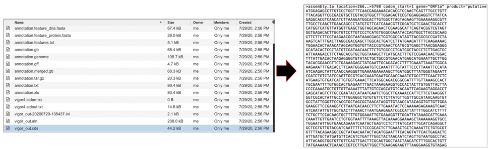

18. The _vigor_out.gff3_ file shows the predicted features in GFF3 format. To download this file, highlight the row that contains it and click on the Download icon in the vertical green bar.
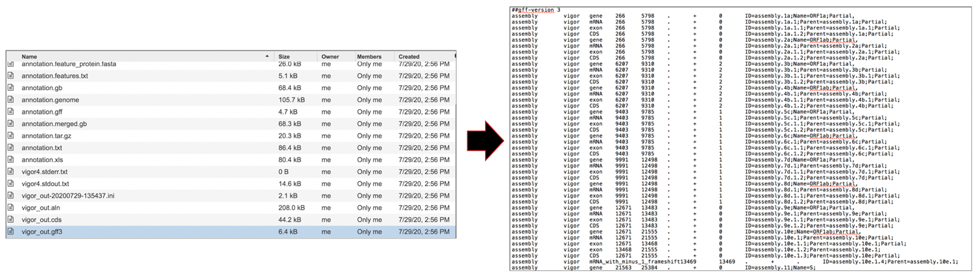

19.	The _vigor_out.rpt_ file shows the summary results from the annotation program. To download this file, highlight the row that contains it and click on the Download icon in the vertical green bar.
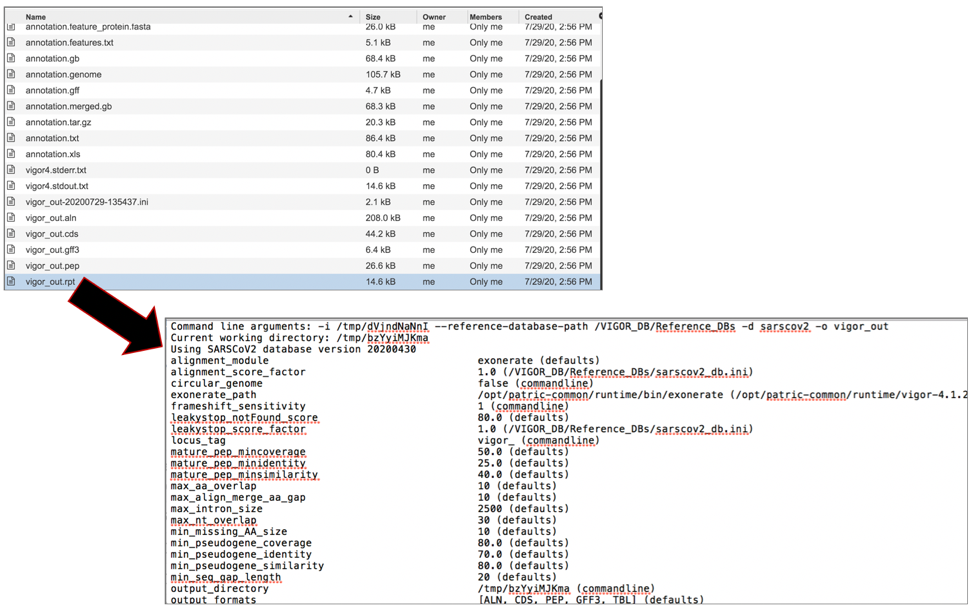

20. The _vigor_out.pep_ file shows the fata file of the predicted proteins. To download this file, highlight the row that contains it and click on the Download icon in the vertical green bar.
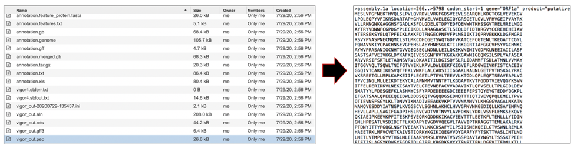

21.	The _vigor_out.tbl_ file shows the predicted features in GenBank table format. To download this file, highlight the row that contains it and click on the Download icon in the vertical green bar.
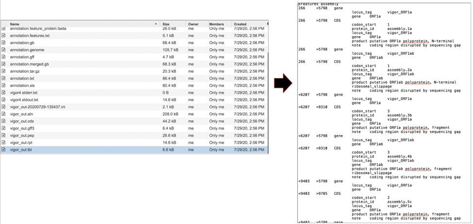

22.	The _vigor_out.warnings_ file shows any warning produced by the VIGOR4 pipeline when it generated the annotation. To download this file, highlight the row that contains it and click on the Download icon in the vertical green bar.
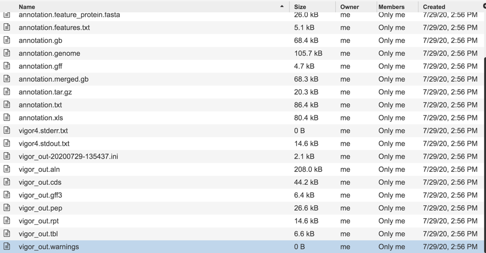

## Downloadable files available with assembly jobs

1. A number of downloadable files are generated with the assembly job. To find those files, double click on the row that has the word “assembly” and the checkered flag, indicating a completed job.
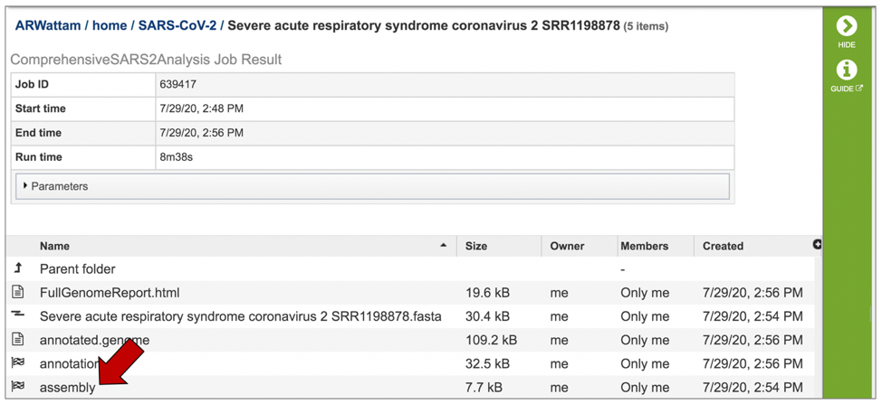

2. This will re-write the page to show the files generated by the assembly job.
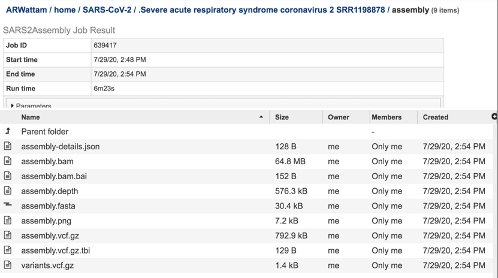

3. The _assembly-details.json_ file is a JSON file. This type of file that stores simple data structures and objects in JavaScript Object Notation (JSON) format, which is a standard data interchange format. It is primarily used for transmitting data between a web application and a server. While it is not recommended for viewing (it is a computer-readable file), the file is both downloadable and viewable. To see the contents of this file, highlight the row that contains the file and then click on the View icon in the vertical green bar
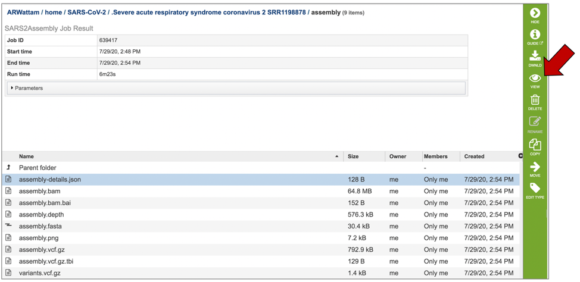

4. This will open the details file.
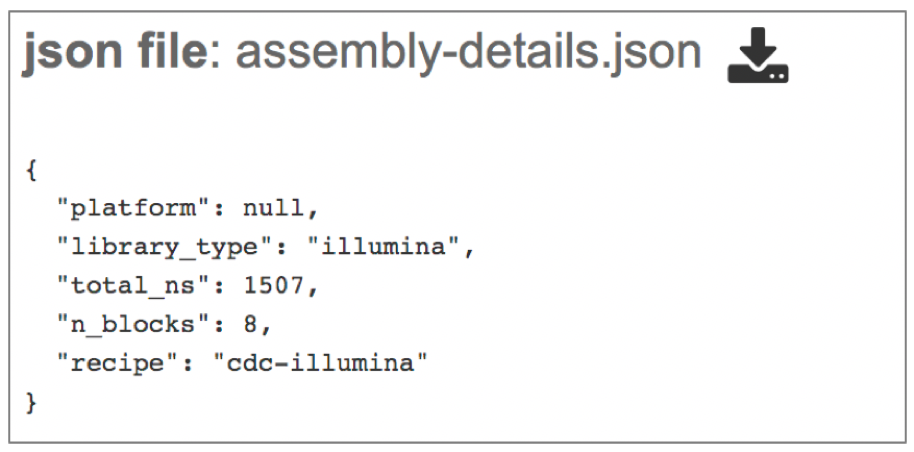

5. The _assembly.bam_ file is a Binary Alignment Map (BAM), which is the comprehensive raw data of genome sequencing. It consists of the lossless (class of data compression algorithms that allows the original data to be perfectly reconstructed from the compressed data), compressed binary representation of the Sequence Alignment Map-files. BAM is the compressed binary representation of SAM (Sequence Alignment Map). BAM is in compressed BGZF format. To download this file, highlight the row that contains it and click on the Download icon in the vertical green bar.
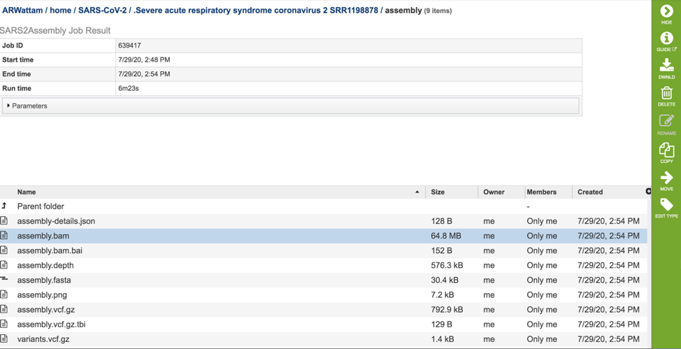

6. The _assembly.bam.bai_ is a bam index file. To download this file, highlight the row that contains it and click on the Download icon in the vertical green bar.
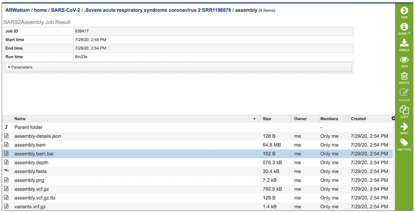

7. The _assembly.depth_ file shows the depth of support based on the reads at each position in the assembly. To view this file, click on the row that has the file name and click on the View icon in the vertical green bar.

8. This will open the file, showing the position and the coverage depth.
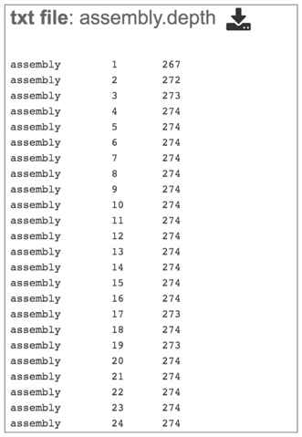

9. The _assembly.fasta_ file shows the nucleotide sequence of contig. This file must be downloaded to view. To download this file, highlight the row that contains it and click on the Download icon in the vertical green bar.
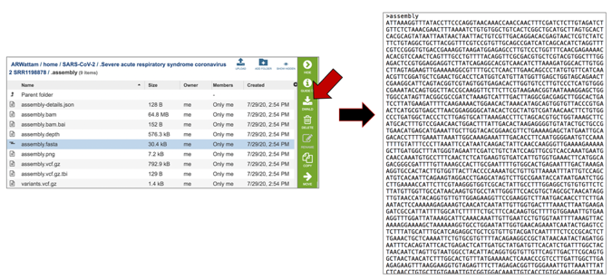

10.	The _assembly.png_ is a graph that shows the coverage depth for the assembly at the specific positions in the genome, which can also be seen in the Full Genome Report. To view this file, click on the row that has the file name and click on the View icon in the vertical green bar.
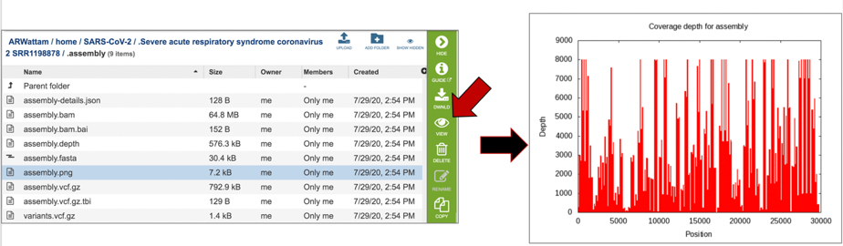

11.	The _vc.gz_ and _vcfgz.tbi_ files. The assembly service offers three types of VCF files. The Variant Call Format specification (VCF, https://samtools.github.io/hts-specs/VCFv4.2.pdf) is a text file format (usually stored in a compressed manner). It contains meta-information lines, a header line, and then data lines each containing information about a position in the genome. The format also has the ability to contain genotype information on samples for each position. When a VCF file is compressed and indexed using tabix, and made web- accessible, the Genome Browser is able to fetch only the portions of the file necessary to display items in the viewed region. These files are all available for download.
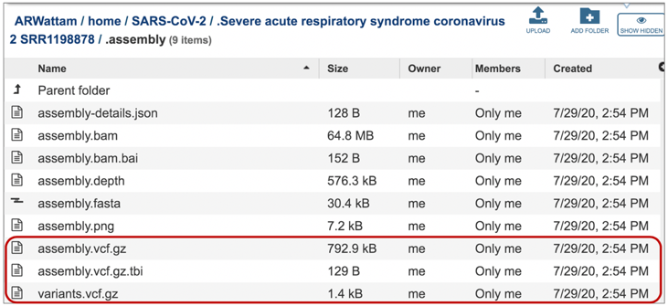

12.	The _contig_ file is also available at the higher level in the assembly page. It is identifiable by the icon indicating contigs in the first column. To download this file, highlight the row that contains it and click on the Download icon in the vertical green bar.

## References

1. Martin, M., Cutadapt removes adapter sequences from high-throughput sequencing reads. EMBnet. journal, 2011. 17(1): p. 10-12.
2. Langmead, B. and S. Salzberg, Langmead. 2013. Bowtie2. Nature Methods, 2013. 9: p. 357-359.
3. Etherington, G.J., R.H. Ramirez-Gonzalez, and D. MacLean, bio-samtools 2: a package for analysis and visualization of sequence and alignment data with SAMtools in Ruby. Bioinformatics, 2015. 31(15): p. 2565-2567.
4. Li, H., Minimap2: pairwise alignment for nucleotide sequences. Bioinformatics, 2018.
34(18): p. 3094-3100.

