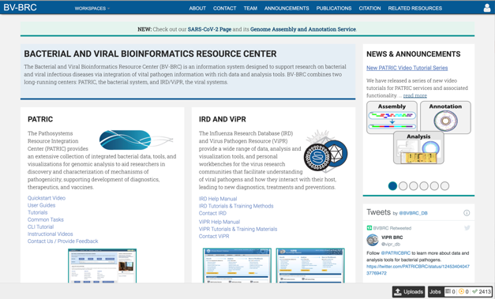

# SARS-CoV-2 Genome Assembly and Annotation Service

The SARS-CoV-2 Genome Assembly and Annotation Service provides a streamlined "meta- service" that accepts raw reads and performs genome assembly, annotation, and variation analysis.

A genome assembly is the sequence produced after chromosomes from the organism have been fragmented, those fragments have been sequenced, and the resulting sequences have been put back together. This is currently needed as DNA sequencing technology cannot read whole genomes in one go, but rather can read small pieces of between 20 and 30,000 bases, depending on the technology used. Typically, the short fragments, called reads, result from shotgun (random) sequencing of genomic DNA.

The protocol used for assembly and the downstream quality measures are provided by the Centers for Disease Control (CDC). This protocol was developed, tuned and validated by the Viral Discovery laboratory at CDC/NCIRD, where it was used to generate the first 16 SARS- CoV-2 genome sequences from the United States. In practice, it has been used for situations with a relatively low or predictable volume of samples and is often used in conjunction with Sanger-based tiling to resolve any potential sequencing or assembly issues. This is a reference-based assembly, which uses the genome Severe acute respiratory syndrome coronavirus 2 (Taxonomy ID: 2697049, refseq ID: NC_045512.2, Severe acute respiratory syndrome coronavirus 2 isolate Wuhan-Hu-1). Additional information and the code can be found here: https://github.com/CDCgov/SARS-CoV-2_Sequencing. 

A summary diagram of the workflow based on the sequencing platform can be found below.

Genome annotation uses the Viral Genome ORF Reader pipeline (VIGOR4), which was developed at the J. Craig Venter Institute. VIGOR 4 predicts protein sequences encoded in a viral genome by sequence similarity searching against curated viral protein databases. The code for VIGOR4 can be found at https://github.com/VirusBRC/VIGOR4. A schematic of the VIGOR4 program workflow can be found below.

## Accessing the SARS-CoV-2 genome assembly and annotation service

You can find the genome assembly and annotation service under the Services menu at the top of the any BV-BRC page. 

Click the link to launch the service.

The landing page for the SARS-CoV-2 genome assembly and annotation service has three parts. You can start with reads or contigs, select the files that you would like to analyze, and then select the parameters.

## Submitting Reads to the Service

1. Submitting paired read libraries. To assemble paired or single read libraries, or a read file from the Sequence Read Archive (SRA), click on Read File.

2. Read files must be uploaded into the workspace. To upload paired read files, click on the folder icon at the end of the text box underneath the words Paired Read Library.

3. This will open a pop-up window where you can select files. Whatever is uploaded in this process will be tagged as read files. To select the first file, click on the blue “Select File” bar in the center of the window.

4. This will open a window that allows you to choose files that are stored on your computer. Select the file where you stored the fastq file on your computer and click “Open”.

5. Once selected, it will autofill the name of the file. Click on the Start Upload button.

6. This will auto-fill the name of the document into the text box.

7. Pay attention to the upload monitor in the lower right corner of the PATRIC page. It will show the progress of the upload.

8. Repeat to upload the second pair of reads.

9. Do not submit the job until the upload is 100% complete.

10.	Click on the arrow that follows the “Select a platform” box below the paired reads.

11.	The Assembly service will assemble Illumina or Ion Torrent reads. Click on the platform used to sequence the genome or click on Infer Platform to allow the service to determine the reads.

12.	The reads must be moved to the Selected libraries box. Click on the arrow right above the text box.

13.	This moves the paired reads to the Selected libraries box. Clicking on the “x” will remove the reads from this box and clicking on the “I” will show the reads that were submitted in each individual row.

14.	_Submitting single read libraries_. To submit single read libraries, you can upload files as described above. However, if you have previously uploaded the data to your workspace, you can access your workspace by clicking on the folder icon at the end of the text box underneath the words Single Read Library.

15.	This will open a pop-up window where you can see the files in your workspace. Scroll to the files of interest. If your data is in a particular folder, find the folder and double click on it.

16.	This will open that folder. Clicking on the row that has the read files will highlight the row blue. Once that row is selected, click on the OK button at the bottom right corner.

17.	The name of the file will appear in the text box. To select the sequencing platform associated with the file, click on the down arrow in the text box underneath the name.

18.	If the sequencing platform is known, click on the appropriate row. If the sequencing platform is unknown, or not shown in the drop-down, click on Infer Platform.

19.	The read files must be moved into the Selected libraries box to the right. Click on the arrow to the right of the words SINGLE READ LIBRARY to transfer them.

20. This moves the paired reads to the Selected libraries box. Clicking on the “x” will remove the reads from this box, and clicking on the “I” will show the reads that were submitted in each individual row.

21.	_Submitting reads from the Sequence Read Archive (SRA)_. BV-BRC also allows researchers to submit reads that are available in the SRA. Enter the SRA run accession number in the text box.

22.	After the accession number is entered, the reads must be moved into the Selected libraries box to the right. Click on the arrow to the right of the words SRA RUN ACCESSION LIBRARY to transfer them.

## Selecting Parameters

1. _Assembly strategy_. BV-BRC provides several assembly strategies. Click on the down arrow in the text box under STRATEGY to see the possibilities.

2. This opens a drop-down box that shows the three assembly strategies that are offered.

3. The three strategies can be seen in the diagram below. The CDC-Illumina assembly strategy uses Cutadapt[1] for trimming, Bowtie2[2] for read mapping, and SAMtools- mpileup[3] for variant calling and generating a consensus sequence. The CDC Nanopore strategy uses Cutadapt for trimming, Minimap2[4] for read mapping, and Medaka (https://nanoporetech.github.io/medaka/) for variant calling and generating a consensus sequence. More information about the CDC strategies can be found here: https://github.com/CDCgov/SARS-CoV-2_Sequencing/blob/master/protocols/CDC-Comprehensive/CDC_SARS-CoV-2_Sequencing_200325-2.pdf

The Artic-Nanopore strategy uses Align_trim for trimming, Minimap2 for read mapping, and Medaka for variant calling and generating a consensus sequence. More information on the Artic-Nanopore strategy can be found here: https://artic.network/ncov-2019/ncov2019- bioinformatics-sop.html

Clicking on Auto will allow the service to select the appropriate strategy.

4. _Job name_. Once the appropriate strategy is selected, a unique identifier must be entered for this job. Enter the name in the text box under the words MY LABEL. Note that as you enter the text, you will see it appended to the name for the reference genome in the OUTPUT NAME box.

5. _Creating new folder_. The job will be placed in your private workspace. It is best to have a folder to hold the relevant information. To create a new folder, click on the folder icon at the end of the text box underneath the words OUTPUT FOLDER.

6. This will open a pop-up window to your workspace. To create a new folder, click on the Folder icon at the upper right (you could also scroll through your workspace to find an appropriate folder).

7. Clicking on the folder icon will open a pop-up window where you can name the new folder. Enter the new name in the text box.

8. Click the Create Folder button to create the new folder.

9. In the workspace window, scroll until you find the newly named folder and select the row. It will turn the row blue. When that row is highlighted, click on the OK button at the lower right of the window.

10.	_Using an existing folder_. Additionally, if a folder of interest has been recently created, you can click on the down arrow at the end of the text box.

