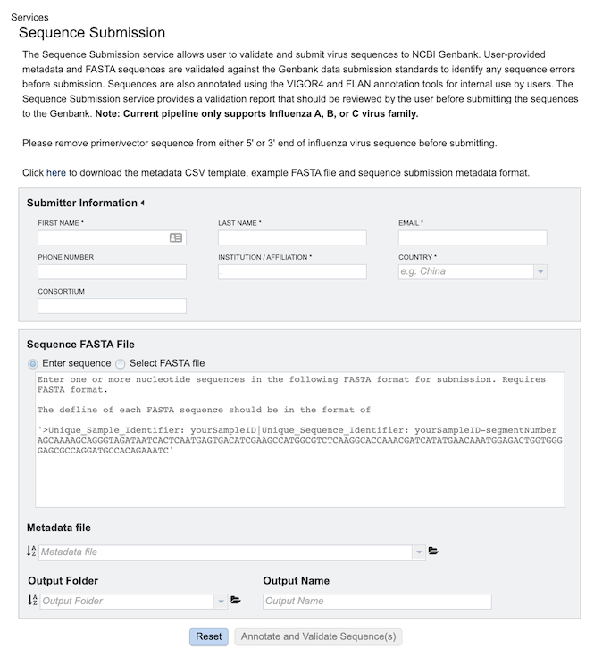
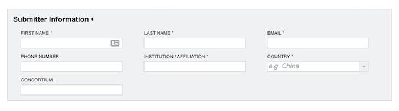
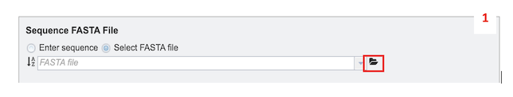
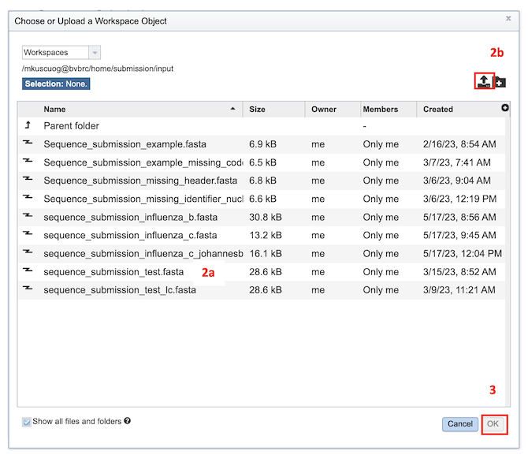
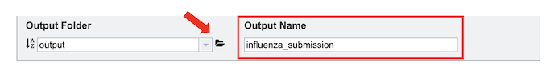
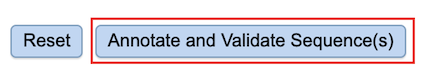
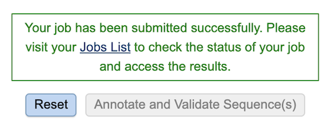
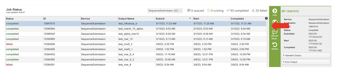
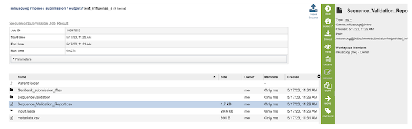

# Sequence Submission Service
The Sequence Submission service allows user to validate and submit virus sequences to NCBI Genbank. User-provided metadata and FASTA sequences are validated against the Genbank data submission standards to identify any sequence errors before submission. Sequences are also annotated using the VIGOR4 and FLAN annotation tools for internal use by users. The Sequence Submission service provides a validation report that should be reviewed by the user before submitting the sequences to the Genbank. 

Note: Current pipeline only supports Influenza A, B, or C virus family.

## Locating the Sequence Submission Service

1\. At the top of any BV-BRC page, find the Tools & Services tab and click on it.
 

2\. In the drop-down box, underneath Genomics, click on Sequence Submission.

3\. This will open the Sequence Submission landing page for entering submitter information, sequence data or FASTA file, and a metadata file.

## Specifying Sequence Submission Parameters

1\. Provide submitter information. All fields marked with asterisks are required.

2\. Select the desired input files/sequences in FASTA format. FASTA definition line must begin with a carat (“>”), followed by a unique sample identifier (Unique_Sample_Identifier) and a unique sequence identifier (Unique_Sequence_Identifier) separated by a pipe (“|”). 
Example defline: “>Unique_Sample_Identifier: yourSampleID| Unique_Sequence_Identifier: yourSampleID-segmentNumber”

There are two ways to select input sequences for analysis: 
* Use the Enter Sequence option to paste one or more protein sequence in FASTA format.

* Select FASTA File: This option allows selection of custom sequence(s) file in a FASTA format. Also, you can select FASTA files which are already uploaded in the workspace [2a] or upload your own [2b].

3\. Provide a metadata file in CSV format. The metadata template, field definitions, data types and formats are available [here](https://www.bv-brc.org/workspace/mkuscuog@bvbrc/BV-BRC Templates/).

4\. To specify output parameters, select an output folder in their workbench or create one if an appropriate folder is not available (red arrow). You will also be prompted to specify an “Output Name” (red box) for the job result, before the job can be submitted.

## Submitting a job for Sequence Submission

After the parameters and input file selections have been made, the “Annotate and Validate Sequence(s)” button will become available.

After clicking the button, a message will appear below the box to indicate that the job is now in the queue.

If there is a problem with the An error message will appear below the box to indicate that the validation has failed. The details of the validation error(s) can be accessed by [1] by either downloading the error report [2a] or viewing on the browser [2b].

## Checking the status of the job

1\. Click on the Jobs indicator at the bottom of the BV-BRC page.

2\.	This will open the Jobs Status page which displays the status of the job. The status of all the service jobs that have been submitted to BV-BRC are also available.

3\.	Once the job is completed, you can select the job by clicking on it and click the “View” button on the right-hand bar to see the results.

4\.	The results page will consist of a header describing the job and a list of output files.

5\. The Sequence Submission Service generates several files that are deposited in the Private Workspace in the designated Output Folder. These include the following:

* **input.fasta** - The fasta file that was submitted
* **metadata.csv** - A comma-separated file containing the metadata about the fasta
* **Sequence_Validation_Report.csv** - A comma separated value file of validation results for all the sequences allowing users to review segment, serotype, status and messages determined by VIGOR4 and FLAN for each sequence identifier
* **submission.xml** – an xml file for identifying the submission  
* **submission.zip** – a compressed file that includes all the required submission files 
* **submit.ready** - a submission ready flag for GenBank
* **.aln** - alignment of predicted protein(s) to reference, and reference protein to genome
* **.cds** - fasta file of predicted CDSs
* **.gff3** - lists all the features of the genome in General Feature Format (GFF3 is the most recent version of GFF)
* **.pep** - a fasta file of predicted proteins
* **.rpt** - a summary file of program results
* **.tbl** - predicted features in GenBank tbl format
* **.report** – a report file generated by FLAN

## Viewing the Sequence Submission results

After selecting the files, you can choose to either download (red box below) or view (red arrow) the results by selecting the appropriate button (Download or View respectively) on the green vertical Action Bar on the right-hand side of the page.

* Selecting view button for “Sequence_Validation_Report.csv” file, comma-separated summary of validation results for all the sequences to be reviewed by the user before submitting the sequences to the GenBank. The columns contain information regarding: 
  * **Unique_Sequence_Identifier** – Query identifier
  * **Segment** – Segment result using VIGOR4 and FLAN annotation tools. Annotation tool is specified if the result from tools is different.
  * **Serotype** – Segment result using VIGOR4 and FLAN annotation tools. Annotation tool is specified if the result from tools is different.
  * **Status** – VALID if there is no WARNING or ERROR. 
  * **Messages** – Any ERROR or WARNING messages generated by FLAN annotation tool.

* You can sort results by increasing or decreasing values by clicking on the desired column as shown below (red arrow) , and further filter results by selecting appropriate keywords and the desired column to search from the dropdown menu pictured below (red box).

## Notifying the BV-BRC team for the Submission 

**Submit Sequence** - On the right-hand side of header in the results page there is a “Submit Sequence” (red box) button which notifies the BV-BRC team that the submission is ready for GenBank submission.

A BV-BRC team member will reach out to you via email once the GenBank submission is completed.
