# Similar Genome Finder Service

When a researcher has a new genome sequence, one of the first things they want to identify is the closest relatives of their genome. PATRIC provides a new service that allows researchers to do this using Mash/MinHash[1]. Mash reduces large sequences and sequence-sets to small, representative sketches, from which global mutation distances can be rapidly estimated. The MinHash dimensionality-reduction technique to include a pairwise mutation distance and P value significance test, enabling the efficient clustering and search of massive sequence collections.

1.	At the top of any BV-BRC page, find the Services tab. Click on Similar Genome Finder. 

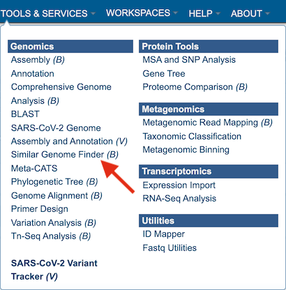

2.	This will open up the Similar Genome Finder landing page.

## Loading a BV-BRC genome 

1.	To load a genome that has been privately annotated in PATRIC, click on the filter icon that is at the left side of the text box under **Search By Genome Name Or Genome ID**.

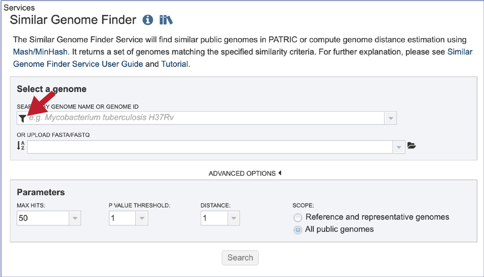

2.	This will open a box that allows a researcher to search across all of the public genomes available in PATRIC, or across the genomes that they have annotated and that are stored in their private workspace. To select private genomes, deselect the Public Genomes box. This will leave the Private Genomes box selected. The filter can be used to narrow the search for each of the categories.

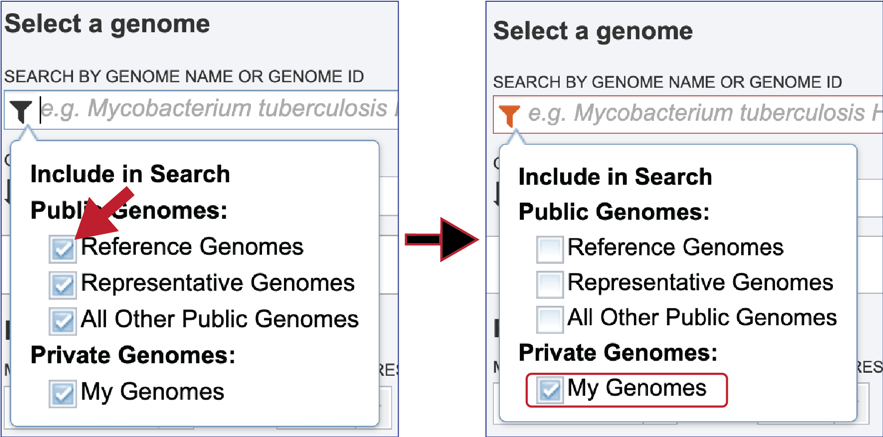

3.	Click the down arrow at the right of the text box under **Search By Genome Name Or Genome ID**. This will open a drop-down box that shows all of the researcher’s private genomes, which have a lock icon in front of them.  To select a specific genome, scroll down and find the genome of interest, and then click on it.

4.	This will autofill the name of the genome in the text box. To see options that can be adjusted, click on the down arrow to the right of Advanced Options.

5.	Alternatively, it is not necessary to use the filters for different types of public genomes, or the private genomes.  Entering the name, or the genome ID in the text box will open a drop-down box that shows possible matches.  Note that reference genomes are denoted with a **[Ref]** in front of the name.  Representative genomes would have a **[Rep]** and private genomes have the lockbox icon seen above.  All of the other public genomes have no indicator in front of the name.  Clicking on the genome of interest will autofill the box as seen above.

## Loading a genome that is not in BV-BRC

1.	The Similar Genome Finder tool is one of the few places in BV-BRC, outside of the Assembly and Annotation pipelines, where genomes that have not been annotated in BV-BRC can be explored. To do this, click on the folder icon that is at the end of the text box underneath **Or Upload FASTA/FASTQ**. 

2.	This will open a pop-up window that has a direct link to the workspace.  To upload a new file, click on the **Upload** icon at the top right of that window.

3.	This will open a new pop-up window.  Note that it is pre-selected for **Contigs**, but if reads are desired, the type will need to be changed.  To interface with your computer, click on the Select File button.

4.	An interface with your computer will open.  Note that fasta files will be highlighted if Contigs were selected.   If read files were selected, fastq files would be highlighted.  Click on the desired file, and then click on the **Open** button at the lower right of the window.

5.	This will go back to the pop-up window where the name of the selected file is listed below the words **File Selected**.  Click on the **Start Upload** button at the lower right.

6.	The progress of the upload can be seen on the upload monitor at the lower right of the page.  Contig files generally load quickly.  Read files, which are often quite large, can take more time.

7.	Once the upload is complete the name of the file will appear below the words **Or Upload FASTA/FASTQ**.

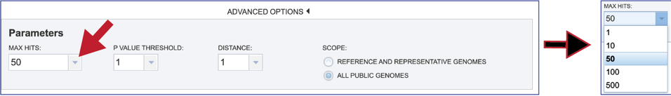

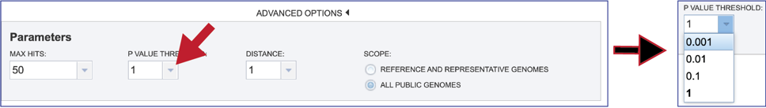

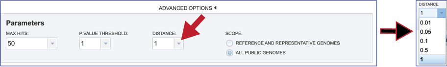

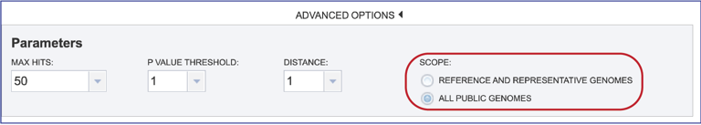

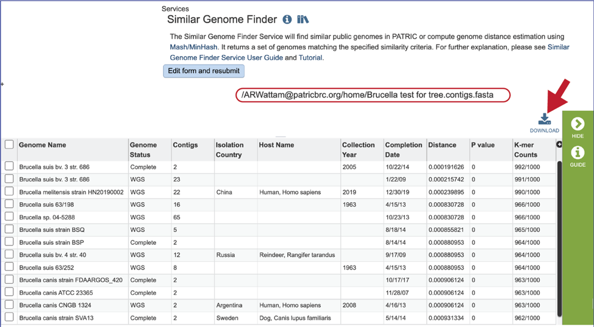

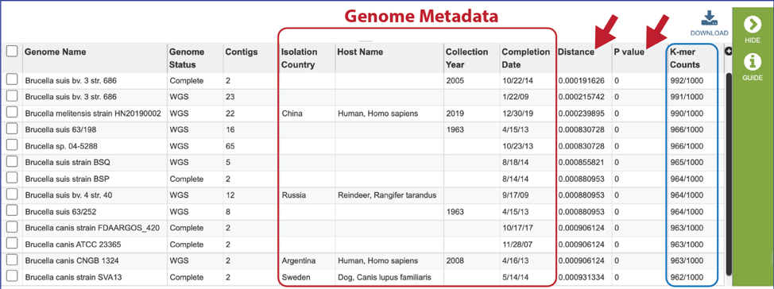

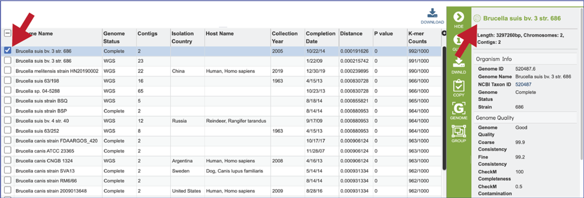

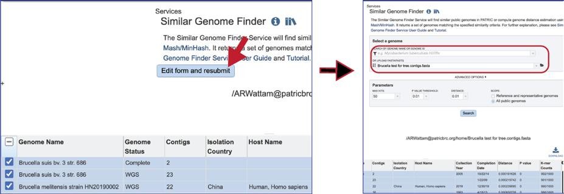

