# Similar Genome Finder Service

*Revised: 05 August 2024*

When a researcher has a new genome sequence, one of the first things they want to identify is the closest relatives of their genome. BV-BRC[1] provides a new service that allows researchers to do this using Mash/MinHash[2]. Mash reduces large sequences and sequence-sets to small, representative sketches, from which global mutation distances can be rapidly estimated. The MinHash dimensionality-reduction technique to include a pairwise mutation distance and P value significance test, enabling the efficient clustering and search of massive sequence collections.

1.	At the top of any BV-BRC page, find the Services tab. Click on Similar Genome Finder. 
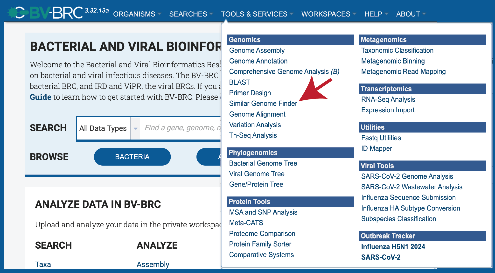 

2.	This will open up the Similar Genome Finder landing page.
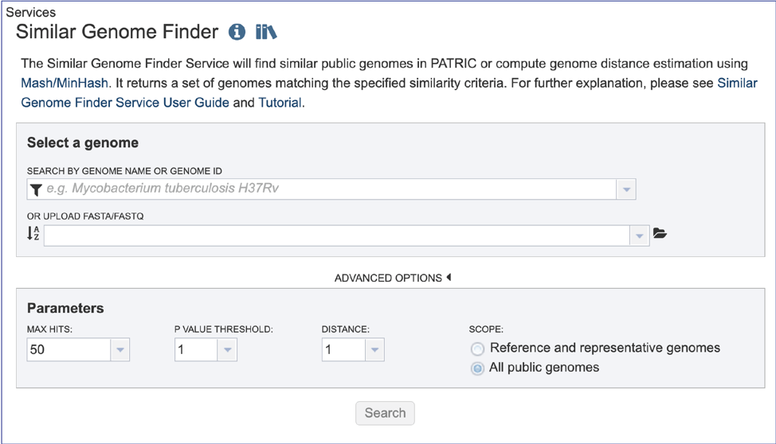 

3.	**Filter to Locate Genomes of Interest.**  Click on the **Filter** icon that is at the left side of the text box under **Search By Genome Name Or Genome ID**.  This will open a box that allows a researcher to search across all of the **Public Genomes** available in BV-BRC or across the **Private Genomes** that they have annotated and are stored in their private workspace. The search can be further refined to search to a **Genome Type** which includes **Bacteria**, **Viruses** or **Eukaryotes**. To select private genomes, click on the checkbox in front of **My Genomes** underneath **Private Genomes**. 
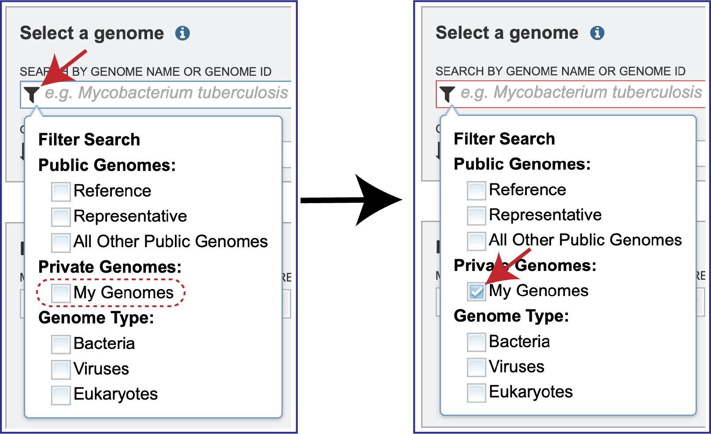 

4.	Click the down arrow at the right of the text box under **Search By Genome Name Or Genome ID**. This will open a drop-down box that shows all of the researcher’s private genomes, which have a **Lock** icon in front of them.  To select a specific genome, scroll down and find the genome of interest, and then click on it.
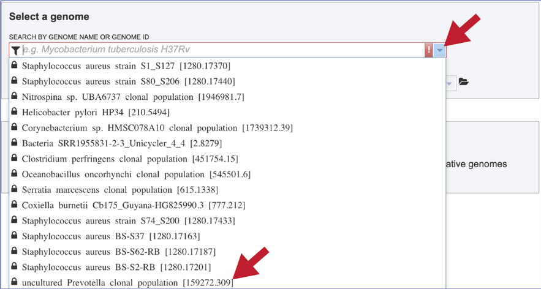

5.	This will autofill the name of the genome in the text box. 
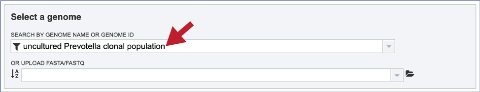 

6.	Alternatively, it is not necessary to use the filters for different types of public genomes, or the private genomes.  Entering the name, or the genome ID in the text box will open a drop-down box that shows possible matches.  Note that reference genomes are denoted with a **[Ref]** in front of the name.  Representative genomes would have a **[Rep]** and private genomes have the lockbox icon seen above.  All of the other public genomes have no indicator in front of the name.  Clicking on the genome of interest will autofill the box as seen above.
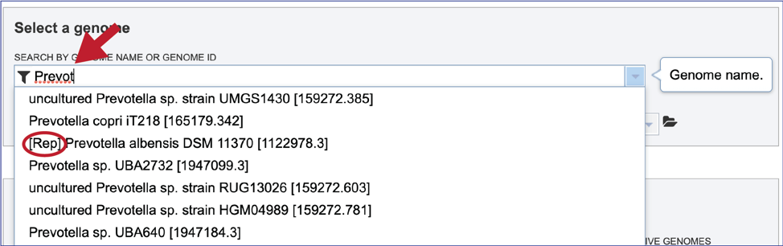 

## Loading a genome that is not in BV-BRC

1\.	The Similar Genome Finder tool is one of the few places in BV-BRC, outside of the Assembly and Annotation pipelines, where genomes that have not been annotated in BV-BRC can be explored. To do this, click on the folder icon that is at the end of the text box underneath **Or Upload FASTA/FASTQ**. 
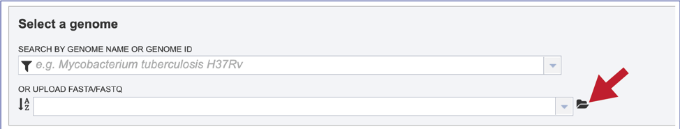 

2\.	This will open a pop-up window that has a direct link to the workspace.  To upload a new file, click on the **Upload** icon at the top right of that window.

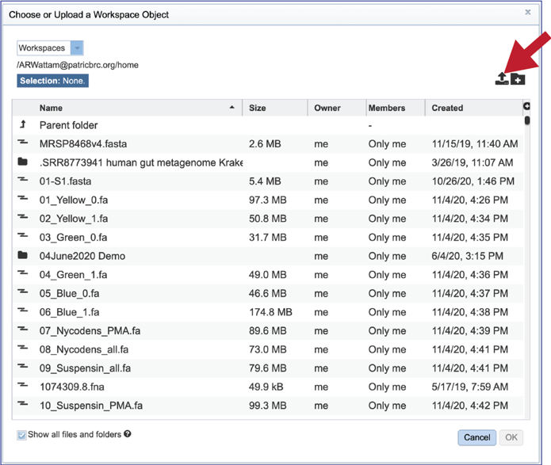 

3\.	This will open a new pop-up window.  Note that it is pre-selected for **Contigs**, but if reads are desired, the type will need to be changed.  To interface with your computer, click on the Select File button.
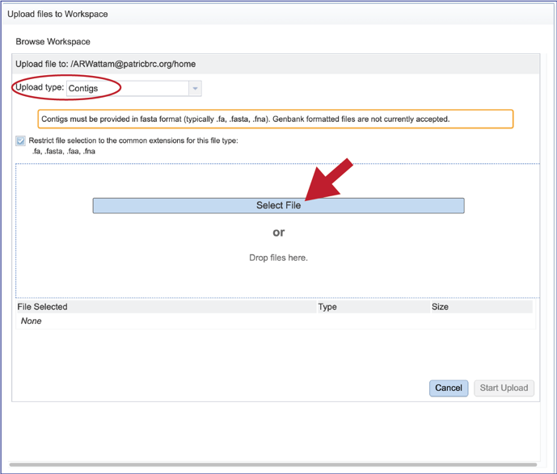 

4\.	An interface with your computer will open.  Note that fasta files will be highlighted if Contigs were selected.   If read files were selected, fastq files would be highlighted.  Click on the desired file, and then click on the **Open** button at the lower right of the window.
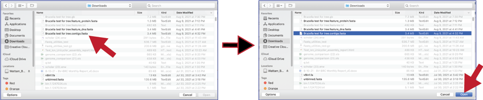 

5\.	This will go back to the pop-up window where the name of the selected file is listed below the words **File Selected**.  Click on the **Start Upload** button at the lower right.

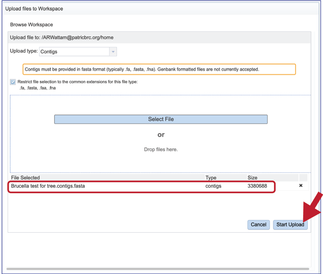 

6\.	The progress of the upload can be seen on the upload monitor at the lower right of the page.  Contig files generally load quickly.  Read files, which are often quite large, can take more time.

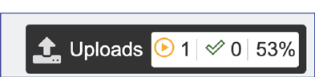 

7\.	Once the upload is complete the name of the file will appear below the words **Or Upload FASTA/FASTQ**.
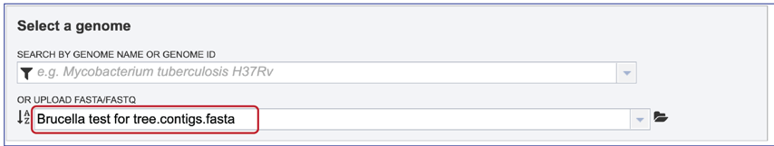 

## Parameters

1\.	Researchers can adjust the number of hits that they want to see.  You can select 1, 10, 50, 100 or 500 hits to be returned by clicking on the down arrow next to the **Max Hits** box.
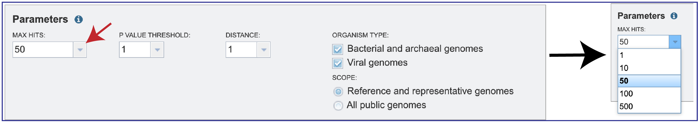

2\.	Since MinHash distances are probabilistic estimates, it is important to consider the probability of seeing a given distance by chance.  Mash provides p-values with distance estimations. Lower p-values correspond to more confident distance estimations and will often be rounded down to 0 due to floating point limits. If p-values are high (above, say, 0.01), the 𝑘-mer size is probably too small for the size of the genomes being compared.  You can select the **P-Value** threshold by clicking on the down arrow that follows the text box.
 

3\. Mash reduces large sequences and sequence-sets to small, representative sketches, from which global mutation distances can be rapidly estimated. The Mash distance approximates the mutation rate.  You can select the distance by clicking on the down arrow that follows the text box under **Distance**. Smaller numbers indicate a closer relationship. Additional information on how distance is calculated for Mash is available here: https://mash.readthedocs.io/en/latest/distances.html.
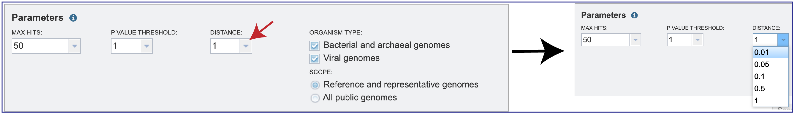 

4\.	Searches can be narrowed by **Organism Type**, selecting between **Bacterial and archaeal genomes**, **Viral genomes**, or both. The **Scope** can also be selected with filters for **All public genomes** or the **Reference and representative genomes**. The NCBI reference and representative genome dataset (https://www.ncbi.nlm.nih.gov/refseq/about/prokaryotes/) is used for the reference set.
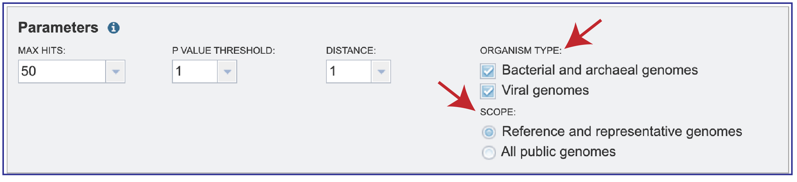 

## Submitting the job

1\.	Once the parameters of interest have been selected, click the **Search** button at the bottom of the page.
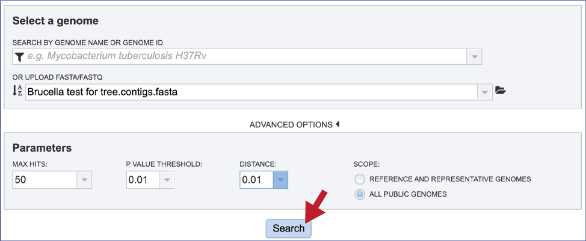 

## Job Results

1\.	The tool will return the top hits to the selected genome.  The page will include a reference to the data that was submitted for analysis, as well as the table.  The entire table can be downloaded by clicking on the **Download** icon at the top upper right of the table.
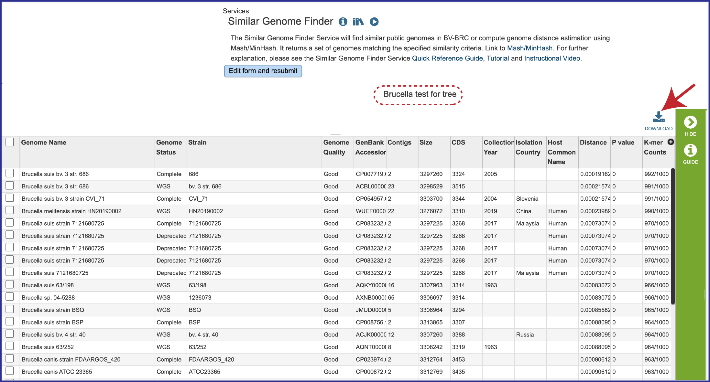 

2\.	The table also includes the metadata for the genomes, which includes the country of isolation, any host that the genome was isolated from, the year the strain was collected, and the data that it was completed.  Also included are the **Distance** and **P values**, and the number of **K-mer Counts** (number out of 1000 total) that the genome shared with the submitted genome.
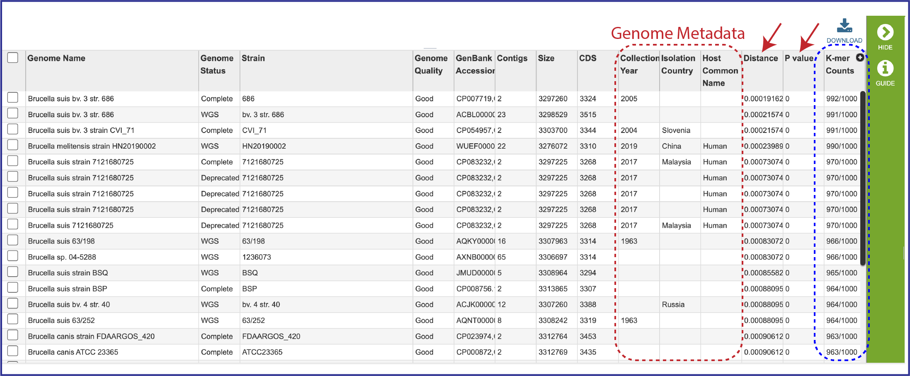 

3\.	To see information on an individual genome, click on the check box preceding it in the first column.  This will populate the box to the right of the vertical green bar with the information that BV-BRC has on that particular genome.
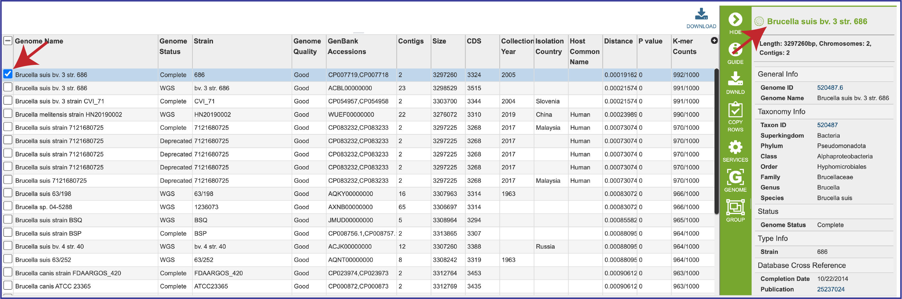 

4\.	The genomes can also be grouped together, and this group can be used in other BV-BRC tools like the Phylogenetic Tree service, the Protein Family Sorter, or the Proteome Comparison service.  Click on the check boxes for the desired genomes, and then click on the **Group** icon in the vertical green bar.
 

5\.	This will open a pop-up box.  To create a new group, click on the down arrow at the end of the text box that has the words Existing Group.  Click on New Group, and then name it in the text box under Group Name.  Once this has been completed, click on the **Add** button at the bottom right of the box. This will successfully create a new group, which will be available in the workspace, and also when a tool using genome groups is launched.
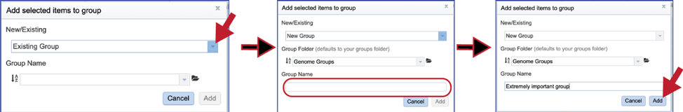 

## Submit a new job

1\.	A new job can be submitted by clicking on the **Edit form and resubmit** button above the table.  This will reload the page, showing the previously submitted data. New data can be uploaded, and the parameters can also be adjusted.  
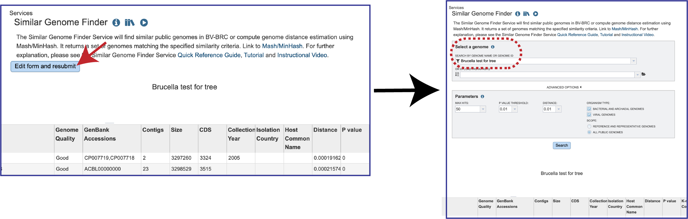 

## References

1.  Olson, R.D., et al., Introducing the Bacterial and Viral Bioinformatics Resource Center (BV-BRC): a resource combining PATRIC, IRD and ViPR. Nucleic acids research, 2023. 51(D1): p. D678-D689.
2.	Ondov, B.D., et al., Mash: fast genome and metagenome distance estimation using MinHash. Genome biology, 2016. 17(1): p. 1-14.

