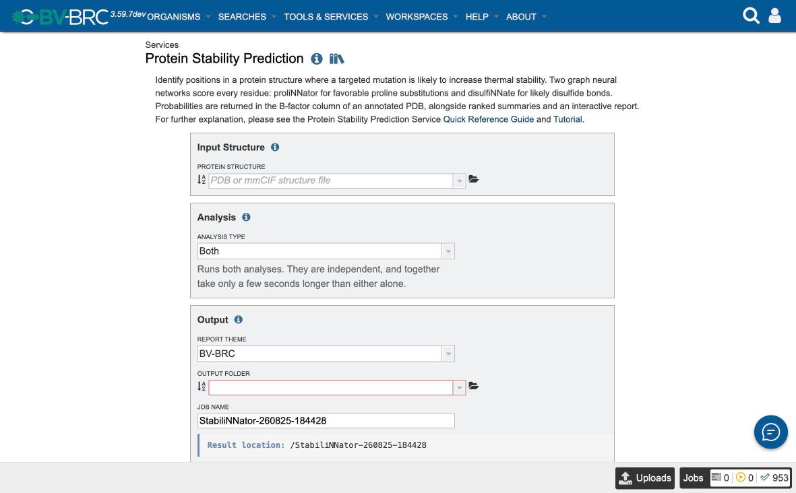
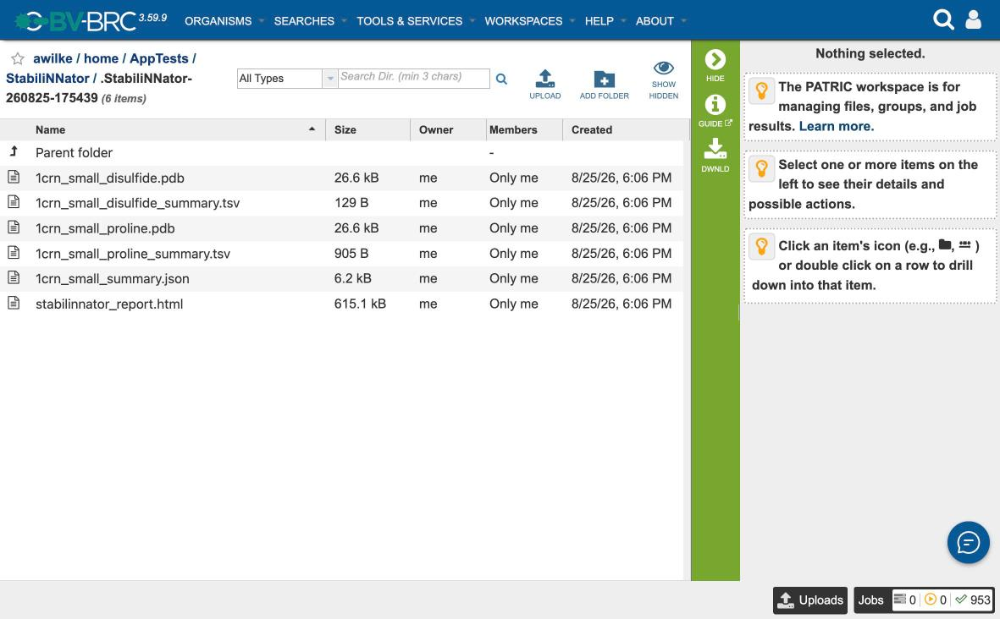
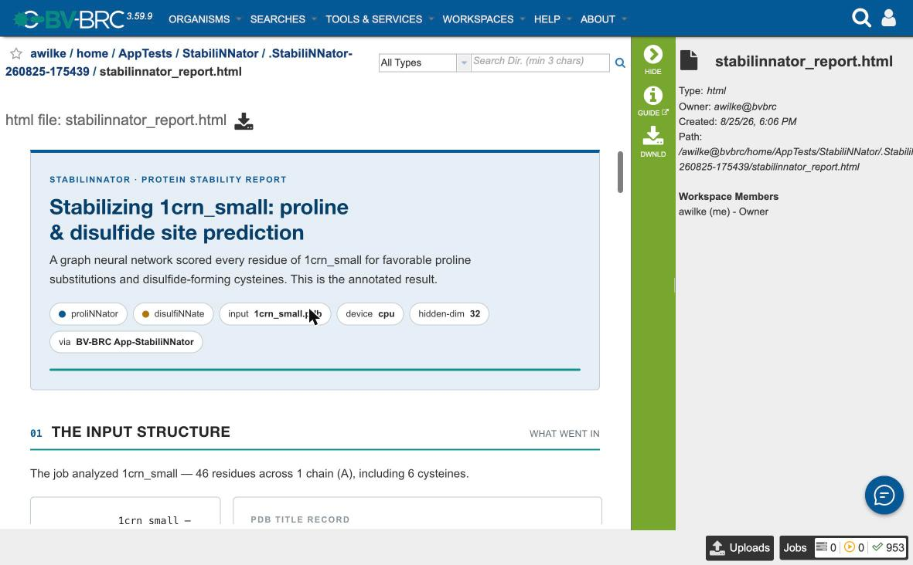
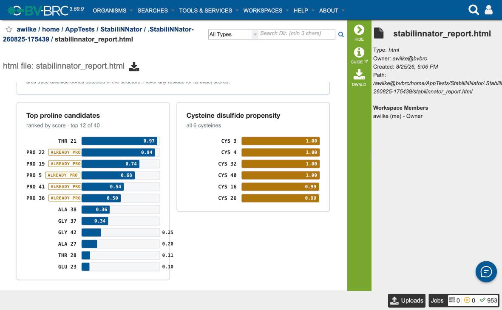

# Protein Stability Prediction Tutorial

This tutorial walks you through scoring a protein structure for stabilizing mutations using the BV-BRC Protein Stability Prediction Service. We'll use **crambin** — a 46-amino-acid plant seed protein, and one of the classic small test structures in computational biology. It has 6 cysteines and 3 disulfide bonds, which makes it a good example for both analyses the service runs.

## What you'll do

1. Sign in to BV-BRC.
2. Put a PDB structure in your workspace.
3. Submit a stability prediction job.
4. Open the result and read the ranked candidate sites.

## Prerequisites

- A free BV-BRC account ([register here](https://www.bv-brc.org/register/))
- A web browser

You do **not** need a GPU or any local software. The models run on BV-BRC servers, on CPU.

## Background — what we're predicting

Two of the most reliable ways to rigidify a protein are substituting a residue with **proline** (which restricts backbone flexibility) and introducing a **disulfide bond** between two cysteines (which covalently staples two parts of the chain together). Both are standard moves in protein engineering — stabilizing a viral glycoprotein in its prefusion conformation for vaccine design is a well-known application.

The hard part is choosing *where*. This service scores every position with a graph neural network so you can spend wet-lab effort on the most promising handful:

- **proliNNator** scores each residue for how favorable a proline substitution would be.
- **disulfiNNate** scores each cysteine for how likely it is to form a disulfide bond.

Scores are probabilities from 0 to 1, written into the **B-factor column** of an annotated PDB so any structure viewer can color by them.

> **Important:** these are *rankings*, not free-energy predictions. A score orders candidates relative to each other. Treat the top of the list as a shortlist to test, not as a predicted ΔΔG.

## Step 1 — Sign in

Click **Sign In** at the top right of any BV-BRC page. The service will not accept a job while you are signed out; the form shows a sign-in panel instead.

## Step 2 — Get a structure into your workspace

The service takes a **PDB or mmCIF structure**, not a sequence. You have two options:

- **Upload one.** Go to **Workspaces → My Workspace**, click **Upload** in the green Action Bar, choose the file, and click **Start Upload**.
- **Use a predicted structure.** If you don't have an experimental structure, run the [Protein Structure Prediction Service](/quick_references/services/predict_structure_service) first and use its top-ranked PDB here. Chaining the two services this way — fold, then score for stabilizing mutations — is the common workflow.

For this tutorial we use a PDB file of crambin (PDB entry 1CRN).

## Step 3 — Open the service

From the **Services** menu, under **Protein Tools**, choose **Protein Stability Prediction**.

The form has three sections, and only one field is genuinely required of you.

## Step 4 — Fill in the form

### Input Structure

Click the **Protein Structure** selector and pick your PDB file. The selector lists structure files from your workspace.

If your file is an NMR ensemble with multiple models, only the first model is scored — you don't need to strip it yourself. Multi-chain structures are fine; results identify each residue by chain and position.

### Analysis

Leave **Analysis Type** on **Both**. The two analyses are independent and together take only a few seconds longer than either alone. The helper text under the selector changes to describe whichever option you pick.

### Output

- **Report Theme** — leave on **BV-BRC**. This affects only the styling of the HTML report.
- **Output Folder** — the workspace folder to put results in.
- **Job Name** — pre-filled with `StabiliNNator-<yymmdd>-<hhmmss>`, which is already unique. Replace it with something descriptive (e.g. `crambin-stability`) if you prefer.

The **Result location** bar shows exactly where results will land as you type.

## Step 5 — Submit

Click **Submit**. The button stays greyed out until an input structure, an output folder, and a job name are all set, so if it looks inactive check those three.

A green confirmation appears with a link to your **Jobs List**.

## Step 6 — Wait

The analysis itself is fast — in a verified run the service script took **8.8 seconds**. Total time to results is usually longer than that and is dominated by two things outside the prediction: how long the job waits in the queue, and whether the analysis container is already staged on the node it lands on. A job can sit as *queued* for a while before it runs.

Watch progress in the **Jobs** indicator at the bottom right, or in the Jobs List.

## Step 7 — Open the result

When the job completes, open your output folder in **Workspaces**. Inside you'll find your job, and inside that, six files:

| File | What it is |
|---|---|
| `stabilinnator_report.html` | Interactive report — **start here** |
| `<input>_proline.pdb` | Structure with proline probability in the B-factor column |
| `<input>_disulfide.pdb` | Structure with disulfide probability in the B-factor column |
| `<input>_proline_summary.tsv` | Full proline ranking, highest first |
| `<input>_disulfide_summary.tsv` | Cysteines only, ranked |
| `<input>_summary.json` | Combined machine-readable summary |

Select `stabilinnator_report.html` and click **View** in the Action Bar.

The report opens with what went into the job — the input, the two models, the device, and the exact commands that were run — so a result is reproducible from the report alone.

For crambin it reports: **46 residues across 1 chain (A), including 6 cysteines.**

## Reading the results

Scroll to **Results at a glance** and then to the ranked charts.

### Proline candidates

For crambin, the top proline site is **THR 21 at 0.97** — a threonine, so this is an actionable T21P suggestion.

Notice the entries flagged **ALREADY PRO**: PRO 22 (0.94), PRO 19 (0.74), PRO 5 (0.68), PRO 41 (0.54), PRO 36 (0.50). These score highly because the model recognizes a proline-compatible environment — and it is right, there is already a proline there. **They are not mutations you can make.** Skip them and read down to the next non-proline entry.

This is the single most common way to misread the output, which is why the report and the TSV both flag it.

Cysteines are excluded from proline candidates, which is why crambin's 46 residues yield **40 scored proline sites**.

### Cysteine disulfide propensity

All 6 crambin cysteines score at or near the ceiling — CYS 3, 4, 32 and 40 at **1.00**, CYS 16 and 26 at **0.99** — and the report notes **3 disulfide bonds detected** geometrically in the structure. That is the expected answer: crambin's cysteines are all already paired, and the model recognizes it.

That illustrates what a high disulfide score means. It says "this cysteine sits in an environment where a disulfide is favorable" — which is true both for cysteines already in a bond and for ones that could form a new one. Cross-check a high scorer against the bonds the report detected before treating it as a new-bond candidate.

> Also note: the annotated `_disulfide.pdb` carries a B-factor on *every* residue, but only cysteines are meaningful. The ranked TSV is filtered to cysteines for exactly this reason.

## Visualizing scores on the structure

Because the probabilities live in the B-factor column, any structure viewer can color by them. Download `<input>_proline.pdb` and color by B-factor — in PyMOL, `spectrum b`. The highest-scoring positions light up directly on the fold, which is often the fastest way to see whether a candidate sits somewhere structurally sensible, like a loop rather than mid-helix.

## What to try next

- Run the same structure with **Analysis Type = Proline sites** or **Disulfide sites** if you only care about one.
- Fold a sequence with the [Protein Structure Prediction Service](/quick_references/services/predict_structure_service) and score the result here.
- Pull `<input>_summary.json` into a script — it carries the top 25 sites per analysis with chain, position, residue and probability.

## Troubleshooting

### Submit stays greyed out

Three fields gate submission: an input structure, an output folder, and a job name. A structure typed by hand that doesn't match a workspace file shows the field in red with *"The value entered is not valid"* — pick from the dropdown instead of typing a path.

### `output_file is required.`

The job needs a name to create its result folder. Leave the pre-filled Job Name in place, or type your own.

### `Input file does not appear to be in PDB or mmCIF format.`

The service checks that the file really contains structure records — `ATOM`/`HETATM` for PDB, or a `data_` block with `_atom_site.` records for mmCIF. A FASTA sequence file will fail this check. Fold it first, then score the structure.

### `GPU requested but CUDA is not available`

Only reachable through the API, where `accelerator` can be set to `gpu`. Leave it at the default `cpu` — for models this small, CPU is faster once CUDA initialization is counted.

### Every proline suggestion is already a proline

Not an error — see [Reading the results](#reading-the-results). Read past the `ALREADY PRO` rows.

## See also

- [Protein Stability Prediction Quick Reference](/quick_references/services/stabilinnator_service) — every form field documented
- [Protein Stability Prediction API Reference](/quick_references/services/stabilinnator_api) — submitting programmatically
- [Protein Structure Prediction Service](/quick_references/services/predict_structure_service) — generating structures to score
