# Subspecies Classification Service

*Revised: 11/7/2022*

## Overview

## Locating the Subspecies Classification Service

1\. At the top of any BV-BRC page, find the **SERVICES** tab and then click on **Subspecies Classification Service**.
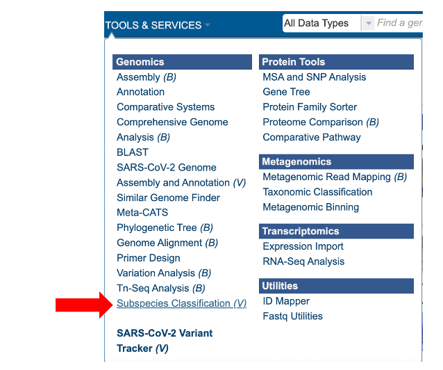 

2\. This will open the subspecies classification landing page.
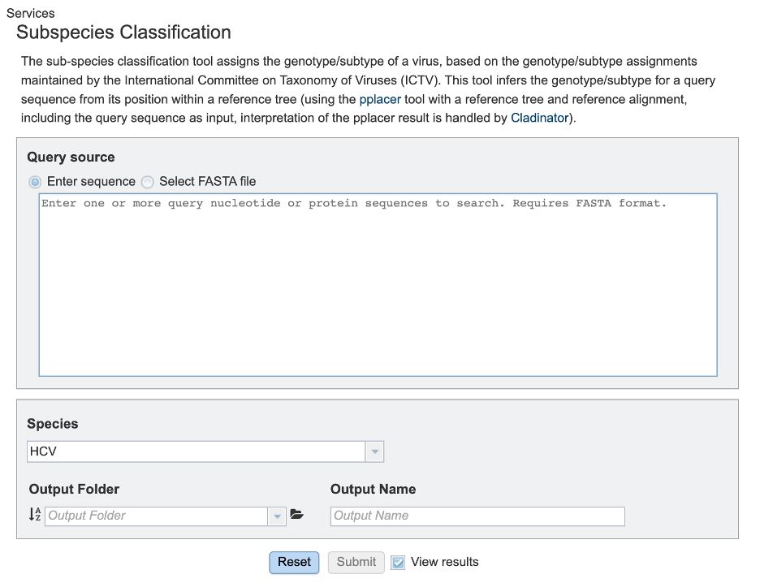 

## Specifying classification parameters

1\. Users will need to first select the input file method for the classification service. If “Enter sequence” is selected, users can paste in their sequence(s) (FASTA format).
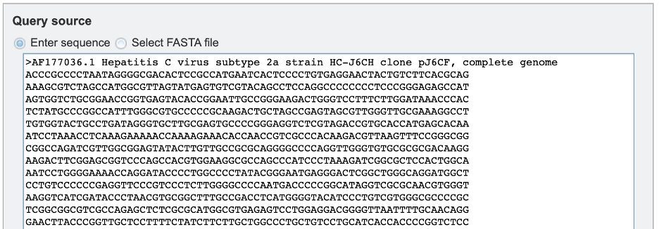 

If the “Select FASTA file” option is checked, users will need to either select a saved FASTA file from their workbench or upload their own file.
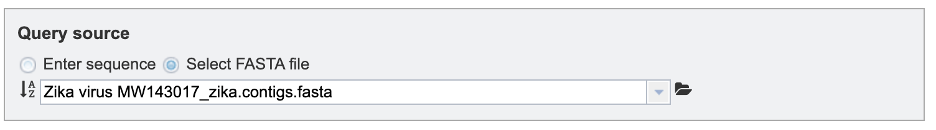

2\. Users can then specify the viral species of interest for subspecies classification from the dropdown menu, as shown below. (*note: list shown below is not exhaustive*).
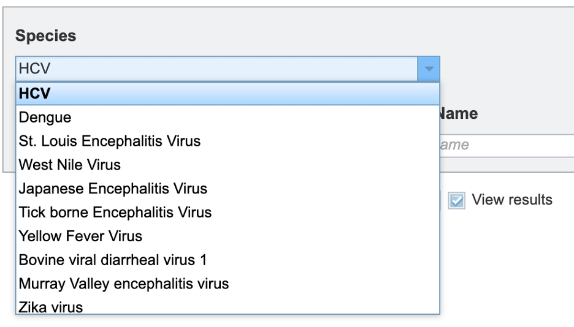

3\. To specify output parameters, users will need to select an output folder in their workbench or create one if an appropriate folder is not available (red arrow). Users will also be prompted to specify an “Output Name” (red box) for the job result, before the job can be submitted.
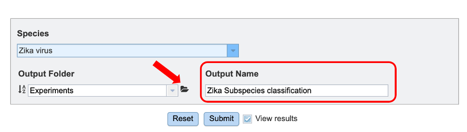

## Submitting a job for classification

When the user has completed parameter and input file selection, the “Submit” button (red box) will become available.

After clicking “submit”, a message will appear below the box to indicate that the job is now in the queue.

## Checking the status of a job

1\. Click on the Jobs indicator at the bottom of the BV-BRC page.
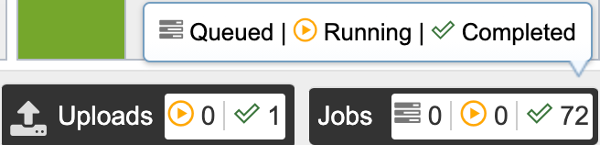

2\. This will open the Jobs Status page where researchers can see the status of their annotation job. The statuses of all the service jobs that have been submitted to BV-BRC are also available.

3\. Once the job is completed, you can select the job by clicking on it and click the “View” button on the right-hand bar to see the results.
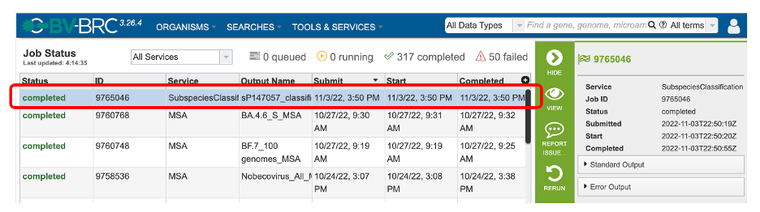

4\. The results page will consist of a header describing the job and a list of output files, as shown below. Results can be viewed either by clicking on the “View” icon at the top right corner of the page (red arrow), by double clicking on the “classification_report.html” file or selecting the desired file and clicking on the “View” icon in the green action bar (red boxes).
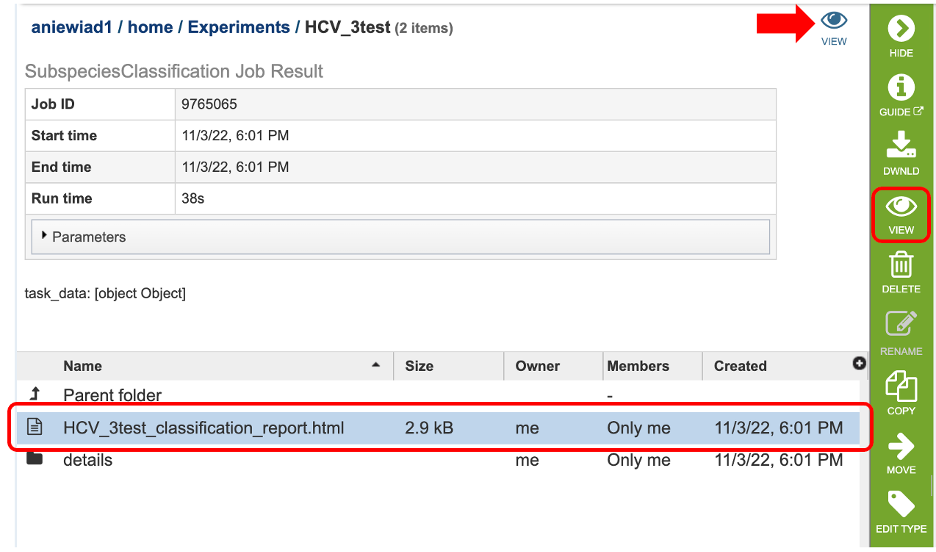

5\. This will open an html report showing a table with three columns specifying: the query identifier for input sequences, the clade classification for each and “tree link”. Clicking on “View Tree” link (red arrow) will allow users to view their sequence of interest within a representative tree for the species of interest.
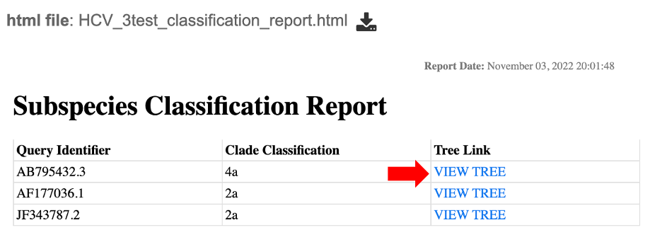

6\. This will open up a new page where users can view their query sequence (red dot) within the BV-BRC representative tree for that species. For more information on the Archaeopteryx tree viewer service, please see the [quick reference guide](https://www.bv-brc.org/docs/quick_references/services/archaeopteryx.html).
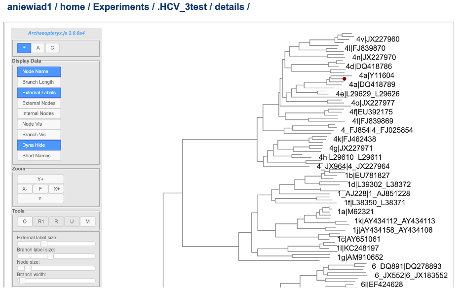

7\. The classification service generates several additional files that are deposited in the “Details”  folder. These include:

* **.tre** – the tree files in Newick format.
* **.txt:** a text file containing raw results output from “Caldinator”.
*	**input.fasta:** the user input sequences in FASTA format.
*	**out.json:** JavaScript Object Notation output from “pplacer” .
*	**out.sing.tre:** tree file in Newick format for output. 
*	**ref_MSA_with_query_seqs.fasta:** a multiple sequence alignment file in FASTA format created from the alignment of representative sub-species as well as user input query sequences. 
*	**results.tsv:** a tab separated value file allowing users a tabular view of their clade classification results. 

## References
1.  Pplacer
    [https://matsen.fhcrc.org/pplacer/](https://matsen.fhcrc.org/pplacer/)

2.  Cladinator
    [https://github.com/cmzmasek/forester/blob/master/forester/java/src/org/forester/application/cladinator.java](https://github.com/cmzmasek/forester/blob/master/forester/java/src/org/forester/application/cladinator.java)