# Taxonomic Classification
Metagenomics is the study of genomic sequences obtained directly from an environment. For many metagenomic samples, the species, genera and even phyla present in the sample are largely unknown at the time of sequencing, and the goal of sequencing is to determine the microbial composition as precisely as possible. The BV-BRC Taxonomic Classification service can be used to identify the microbial composition of metagenomic samples. Researchers can submit their metagenomic samples that are reads (paired-or single-end, long or short, zipped or not) or contigs to the service, as well as the Sequence Read Archive accession numbers. This service uses Kraken 21. Kraken, first released in 2014, has been shown to provide exceptionally fast and accurate classification for shotgun metagenomics sequencing projects. Kraken 2, which matches the accuracy and speed of Kraken 1, supports 16S rRNA databases.  Kraken uses exact-match database queries of k-mers, rather than inexact alignment of sequences.  Sequences are classified by querying the database for each k-mer in a sequence, and then using the resulting set of lowest common ancestor (LCA) taxa to determine an appropriate label for the sequence.

## I. Locating the Taxonomic Classification Service App

1. At the top of any BV-BRC page, find the Services tab.
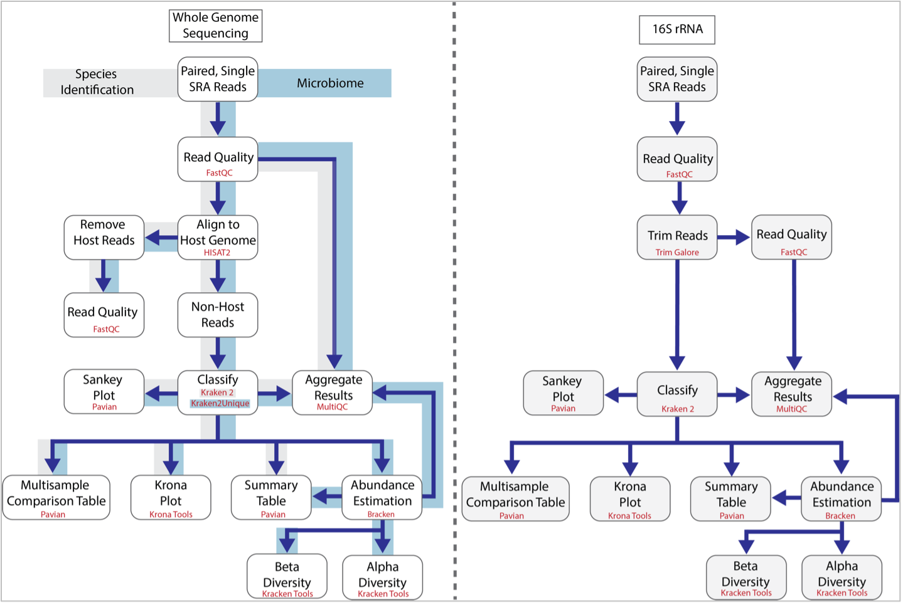

2. Click on Taxonomic Classification.

3. This will open up the Taxonomic Classification landing page where researchers can submit long reads, single or paired read files, an SRA run accession number, or assembled contigs to the service.
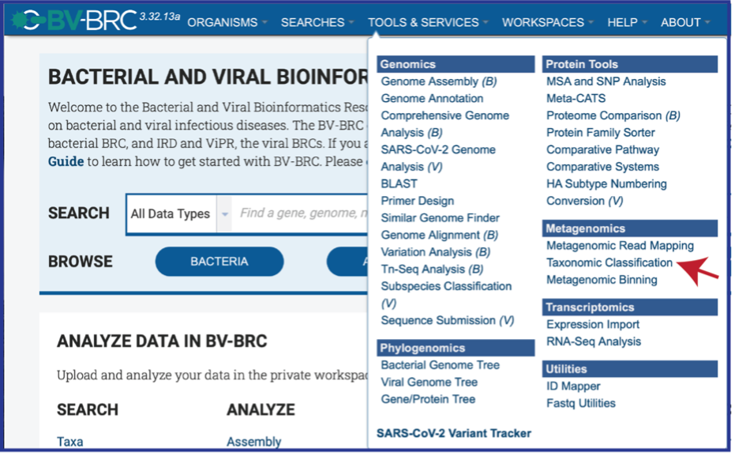

## II. Uploading paired end reads

Paired read libraries are usually given as file pairs, with each file containing the forward or reverse half of each read pair. Paired read files are expected to be sorted in such a way that each read in a pair occurs in the same Nth position as its mate in their respective files. These files are specified as READ FILE 1 and READ FILE 2. For a given file pair, the selection of which file is READ 1 or READ 2 does not matter.

1.	To upload a fastq file that contains paired reads, locate the box called “Paired read library.”
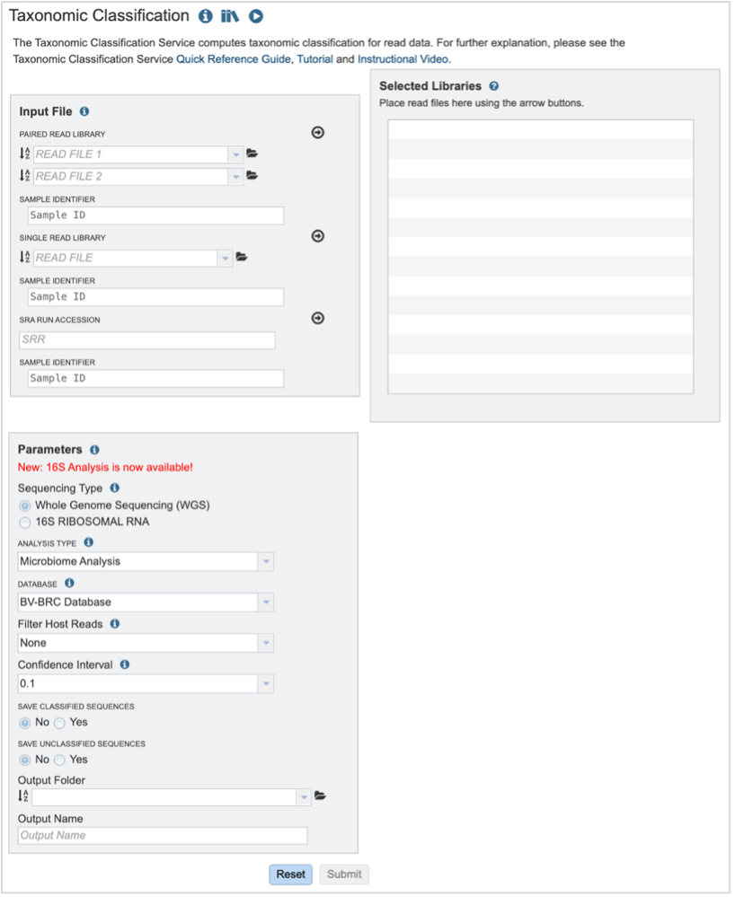

2.	The reads must be located in the workspace to submit them to a BV-BRC service.  To initiate the upload, first click on the folder icon.
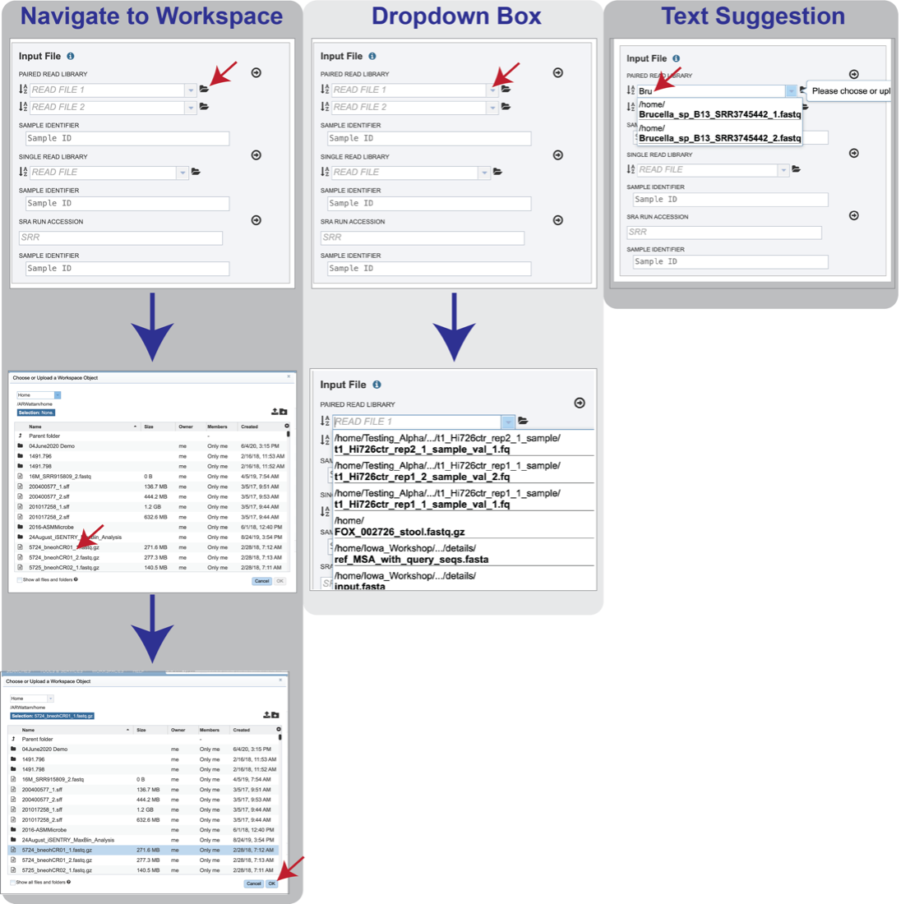

3.	This opens up a pop-up window where the files for upload can be selected.  Click on the icon with the arrow pointing up.
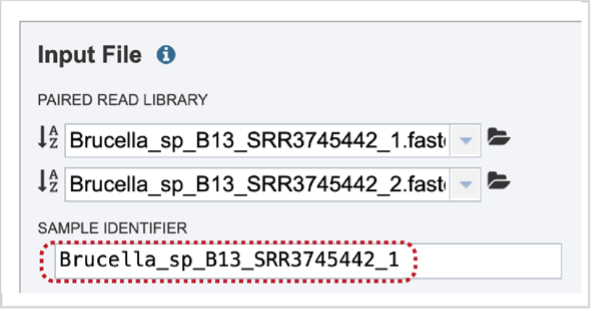

4.	This opens a new pop-up window where the file can be selected.  Click on the “Select File” in the blue bar.
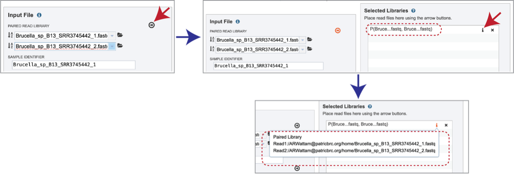

5.	This will open a window that allows you to choose files that are stored on your computer.  Select the file where you stored the fastq file and click “Open”.
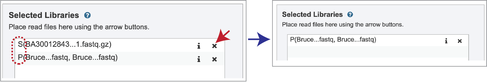

6.	Once selected, it will autofill the name of the file. You can see it in the screenshot below. Click on the Start Upload button.
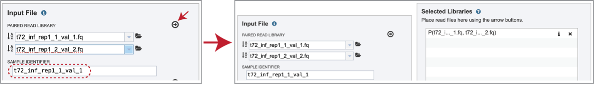

7.	This will auto-fill the name of the document into the text box as seen below.
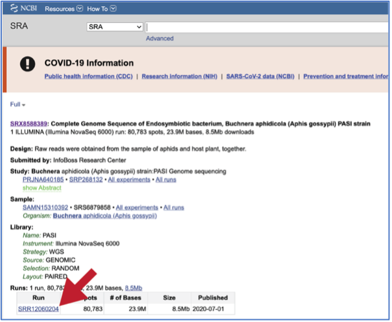

8.	Pay attention to the upload monitor in the lower right corner of the BV-BRC page. It will show the progress of the upload. Do not submit the job until the upload is 100% complete.
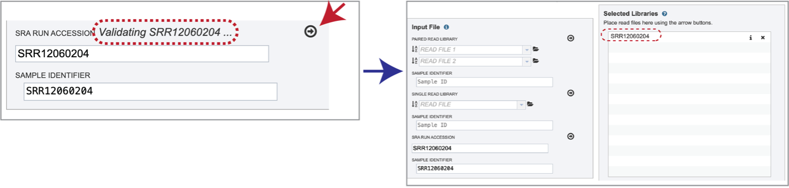

9.	Repeat steps 2-5 to upload the second pair of reads.
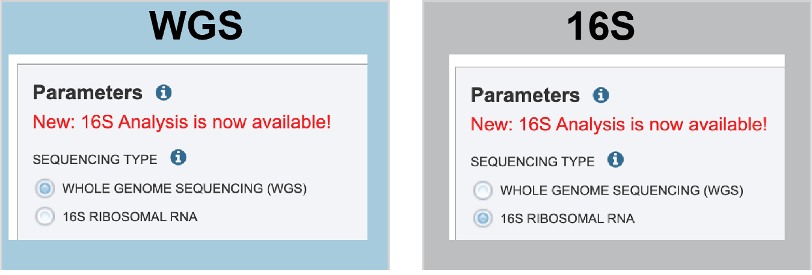

10.	To finish the upload, click on the icon of an arrow within a circle. This will move your file into the Selected libraries box.
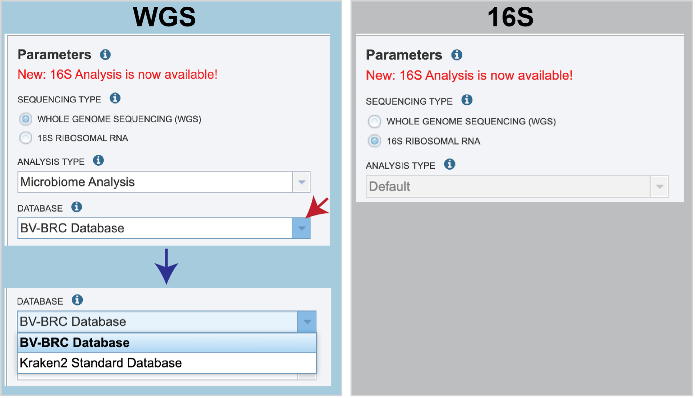

## III. Uploading single reads

1.	To upload a fastq file that contains single reads, locate the text box called “Single read library.”
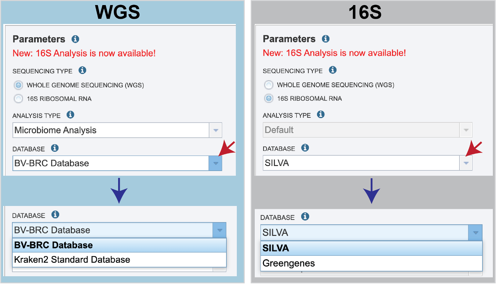

2.	If the reads have previously been uploaded, click the down arrow next to the text box below Read File.
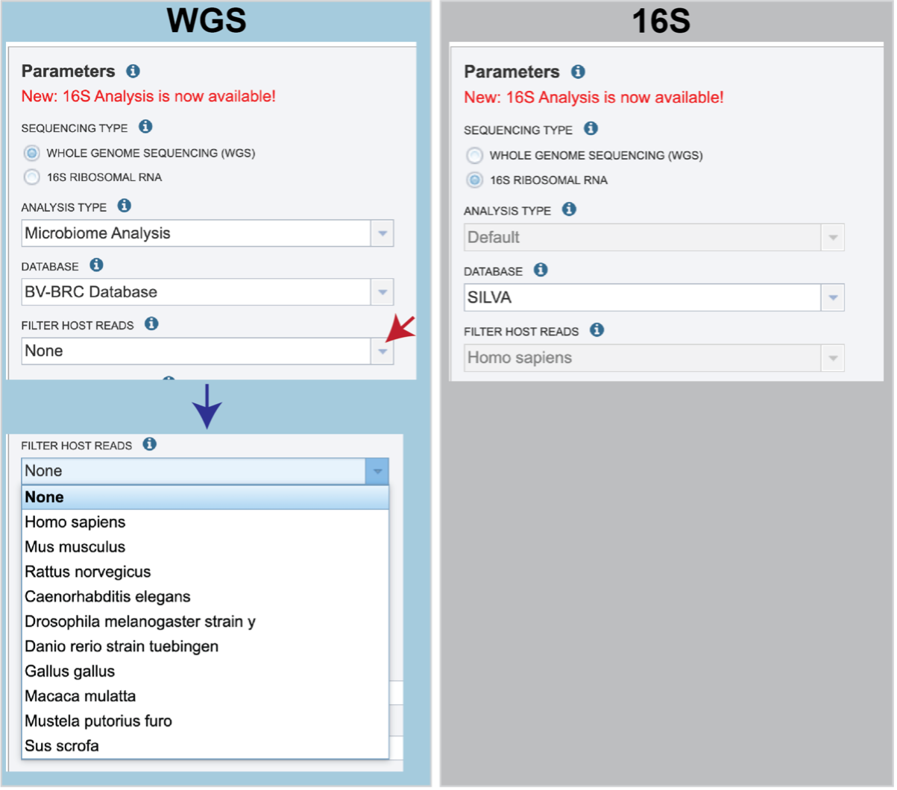

3.	This opens up a drop-down box that shows the all the reads that have been previously uploaded into the user account. Click on the name of the reads of interest.
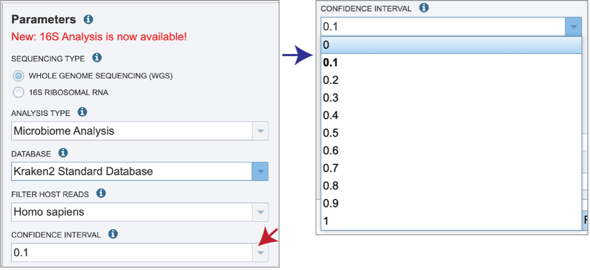

4.	This will auto-fill the name of the document into the text box as seen below.
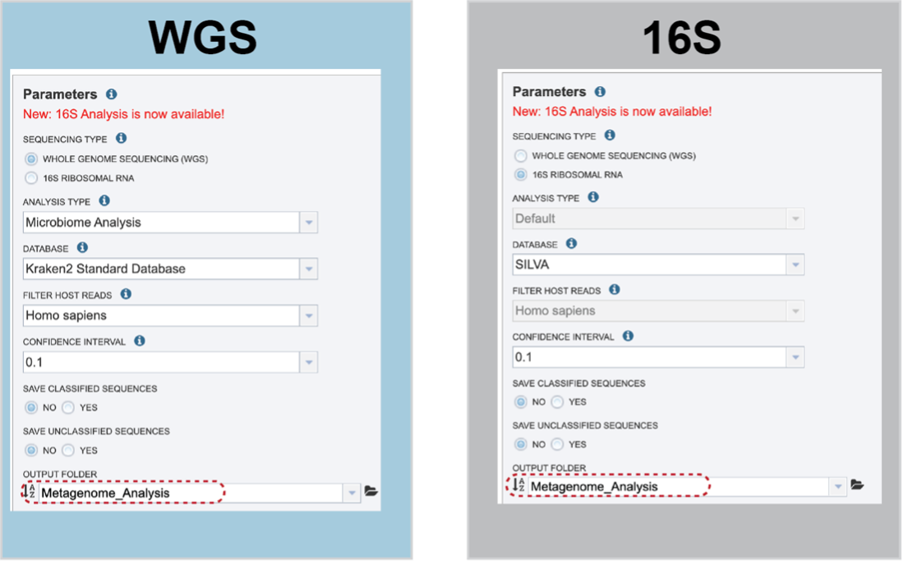

5.	To finish the upload, click on the icon of an arrow within a circle. This will move your file into the Selected libraries box.
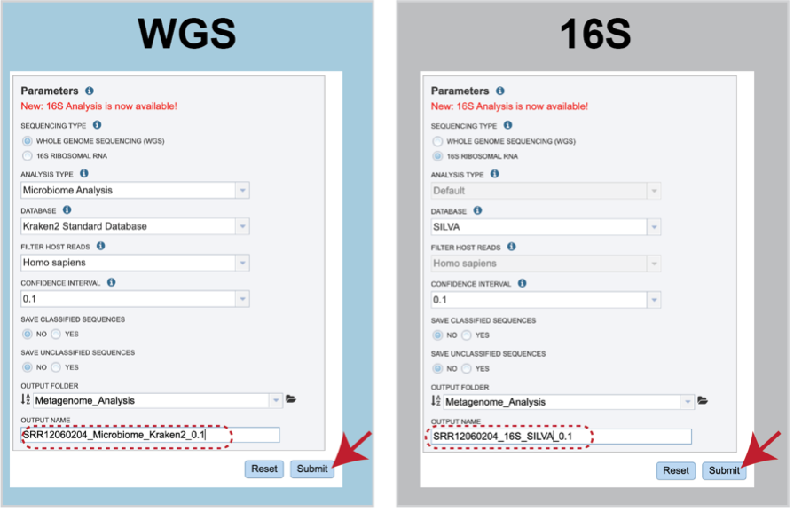

## IV. Submitting reads that are present at the Sequence Read Archive (SRA)
1.	BV-BRC also supports analysis of existing datasets from SRA. To submit this type of data, locate the Run Accession number and copy it.

2.	Paste the copied accession number in the text box underneath SRA Run Accession, then click on the icon of an arrow within a circle.
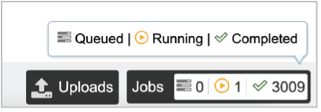

3.	This will move the file into the Selected libraries box.
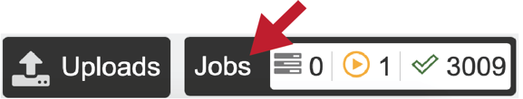

## V. Submitting assembled contigs

## VI. Selecting parameters

## References
1. Lu, J. & Salzberg, S. L. Ultrafast and accurate 16S rRNA microbial community analysis using Kraken 2. Microbiome 8, 1-11 (2020).
2. Ondov, B. D., Bergman, N. H. & Phillippy, A. M. Interactive metagenomic visualization in a Web browser. BMC bioinformatics 12, 385 (2011).

