# Taxonomic Classification Service
Metagenomics is the study of genomic sequences obtained directly from an environment. For many metagenomic samples, the species, genera and even phyla present in the sample are largely unknown at the time of sequencing, and the goal of sequencing is to determine the microbial composition as precisely as possible. The BV-BRC Taxonomic Classification service can be used to identify the microbial composition of metagenomic samples. Researchers can submit metagenomic samples that are short reads (paired end or single end) as well as submissions to the Sequence Read Archive via accession numbers. This service follows the analyses outlined in [Lu et al., 2022](https://doi.org/10.1038/s41596-022-00738-y) for metagenomic analysis with the Kraken software suite.  There are two pipelines, one is a standard approach called species identification. The other is called microbiome analysis which includes additional steps specifically for microbiome samples. Kraken [1], first released in 2014, has been shown to provide exceptionally fast and accurate classification for shotgun metagenomics sequencing projects. Kraken 2, which matches the accuracy and speed of Kraken 1, supports 16S rRNA databases.  Kraken2 uses exact-match database queries of k-mers, rather than inexact alignment of sequences.  Sequences are classified by querying the database for each k-mer in a sequence, and then using the resulting set of lowest common ancestor (LCA) taxa to determine an appropriate label for the sequence. The service uses a [Snakemake](https://snakemake.readthedocs.io/en/stable/) to manage the pipeline.
 

This is an overview of the FASTQ processing steps. Each sample (either a single read or paired read files) is run through the pipeline. Then the kraken2 results for each sample are compared against each other.

The steps of the pipeline are as follows:
1\. User input: If users submit Sequence Read Archive values (SRAs) and the BV-BRC will input the corresponding FASTQ files to the service.  Users can also submit short reads (paired or single end) to the service. Users can input multiple read files in the same job. If only one sample is submitted to the job any multisample comparison outputs will not be available.  The pipeline begins with FASTQ processing. The single and paired samples are run separately but go though the same steps. 
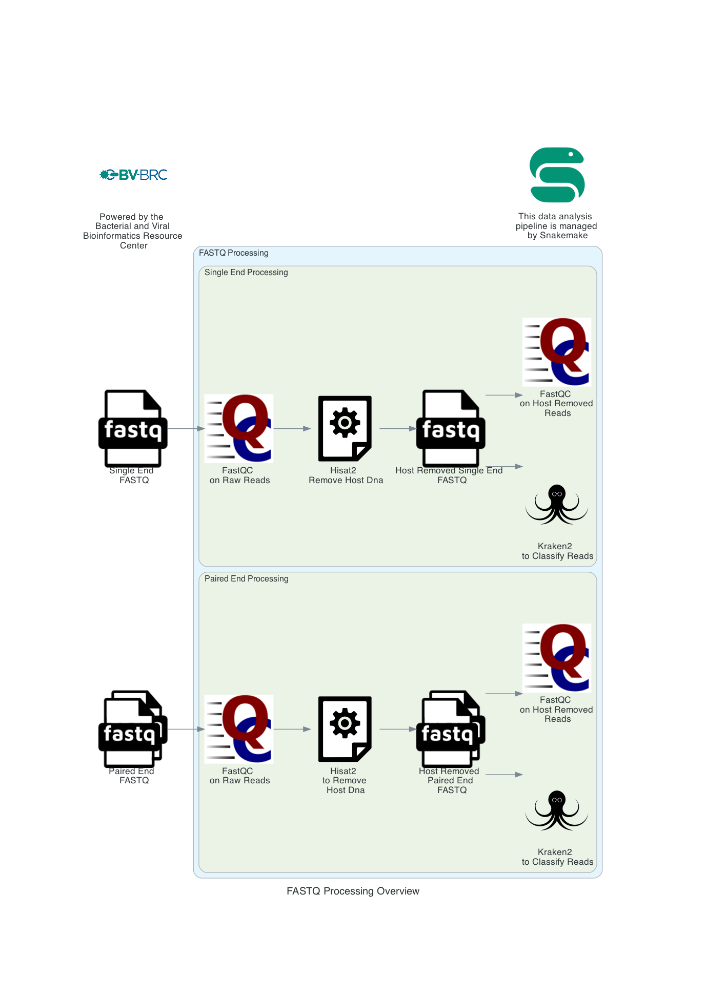 

2\. The aim of this step is to align reads to the host genome and remove them from the sample [Hisat2](http://daehwankimlab.github.io/hisat2/) is a fast and sensitive alignment program for mapping next-generation sequencing reads.

3\. FastQC is run on both the raw files and host removed files. These results are available in the output directory, in each sample directory under FastQC_results. These results are also available in the multiQC.HTML report in landing output directory.

4\. The reads are classified with Kraken2. The minimum hit groups threshold is set to 3. The confidence interval is set to 0.1. We also use the 16 threads.  This requires that overlapping k-mers share a common minimizer before a sequence is classified. Kraken 2 uses minimizers to compress the input genomic sequences, thereby reducing storage memory needed and run time [3]. This is the last step in FASTQ processing. 

5\. The Kraken results for all samples, regardless of single and paired input files are analyzed in the remainder of the pipeline. Users can either select pathogen or microbiome. The microbiome pipeline includes the steps of the species identification pipeline with additional microbiome specific steps (Bracken abundance, alpha diversity and beta diversity). 

6\. Sunburst plots displaying every taxa level are created using [kreport2krona](https://github.com/jenniferlu717/KrakenTools/blob/master/kreport2krona.py) and [Krona](https://github.com/marbl/Krona/wiki). A plot containing all samples in your analysis is available in the output directory. Individual plots are available in each sample directory.

7\. Sankey plots are created for each sample using functions from [Pavian](https://rdrr.io/github/fbreitwieser/pavian/).

8\. If multiple samples are submitted, functions from [Pavian](https://rdrr.io/github/fbreitwieser/pavian/) create an interactive mutisample comparison table.

9\. Results are compiled into a [MultiQC](https://multiqc.info/docs/) report.

10\. If microbiome analysis is selected, a companion program to Kraken2 and the other tools in the Kraken suite, [Bracken](https://github.com/jenniferlu717/Bracken).  Bracken recreates the report file using the new Bracken numbers. This is available in the user input sample id subdirectory under bracken_output. Any levels whose reads were below the threshold of 10 are not included. Percentages will be re-calculated for the remaining levels. Unclassified reads are not included in the report.

11\. Bracken functions calculate alpha and beta diversity. The statstics displayed with plotly in .HTML files as well as for downstream analysis as .CSV.

## I. Locating the Taxonomic Classification Service App

1\. At the top of any BV-BRC page, find the Services tab. 
 

2\. Click on Taxonomic Classification in the Metagenomics group. 
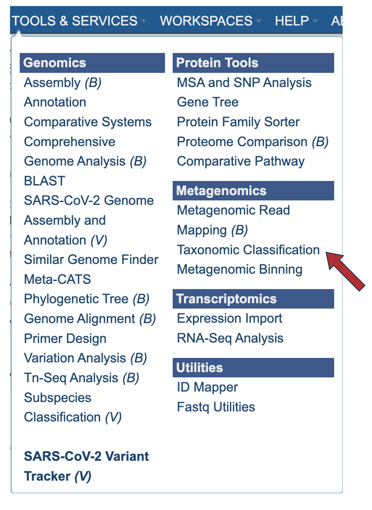 

3\. This will open the Taxonomic Classification landing page where researchers can submit single or paired short read files, an SRA run accession number to the service. 
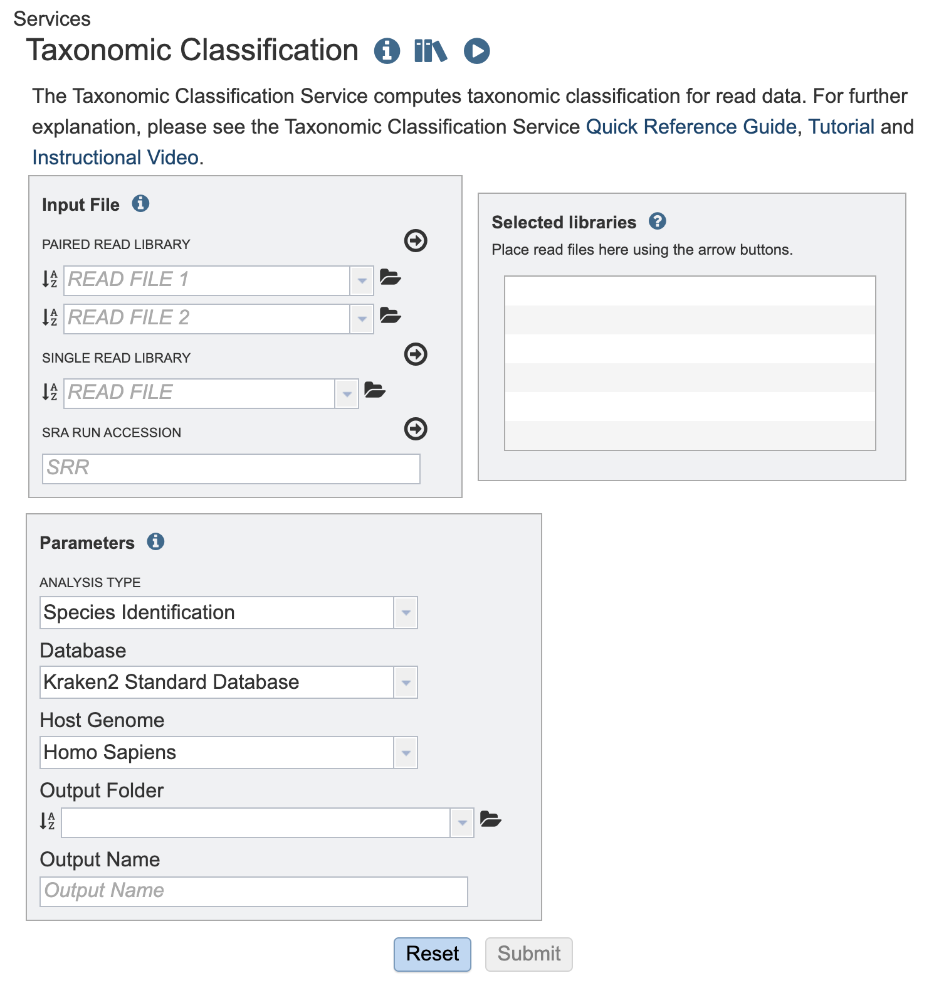 

## II. Uploading paired end reads

Paired read libraries are usually given as file pairs, with each file containing the forward or reverse half of each read pair. Paired read files are expected to be sorted in such a way that each read in a pair occurs in the same Nth position as its mate in their respective files. These files are specified as READ FILE 1 and READ FILE 2. For a given file pair, the selection of which file is READ 1 or READ 2 does not matter.

1\. To upload a FASTQ file that contains paired reads, locate the box called “Paired read library.” 
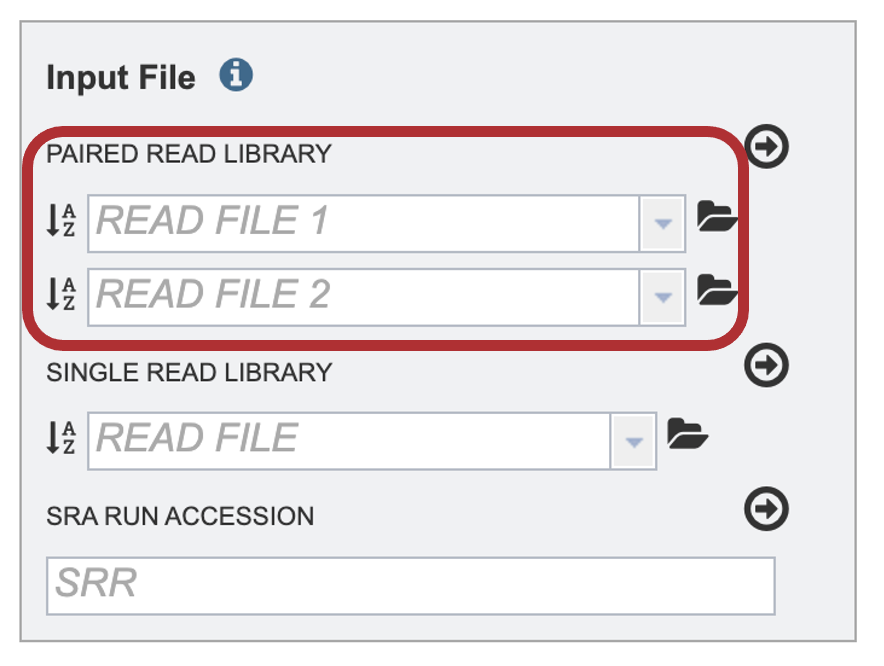 

2\. The reads must be saved in the workspace as file type reads to submit them to a BV-BRC service.
To initiate the upload, first click on the folder icon. 
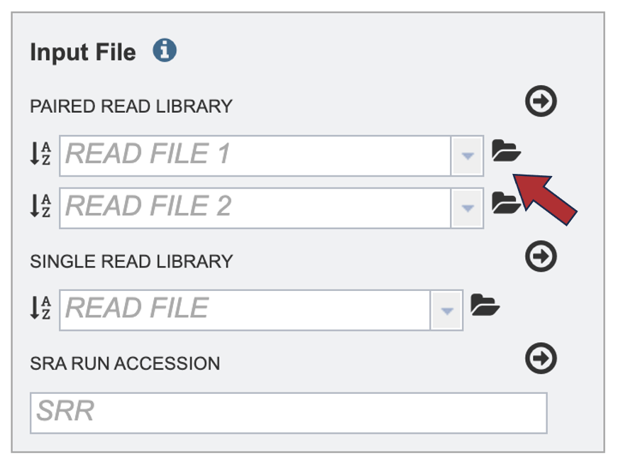 

3\. This opens a pop-up window where the files for upload can be selected.  Click on the icon with the arrow pointing up.  
 

4\. This opens a new pop-up window where the file can be selected.  Click on the “Select File” in the blue bar.
 

5\. This will open a window that allows you to choose files that are stored on your computer.  Select the file where you stored the FASTQ file and click “Open”.
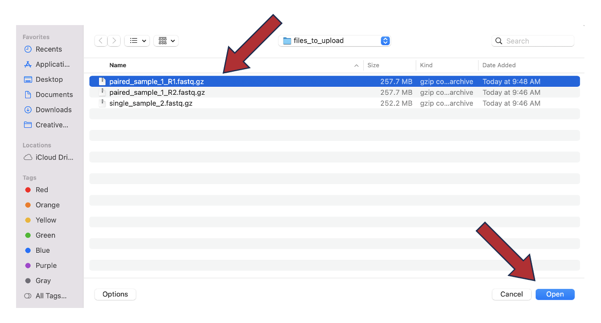 

6\. Once selected, it will autofill the name of the file. You can see it in the screenshot below. Click on the Start Upload button.
 

7\. This will auto-fill the name of the document into the text box as seen below.
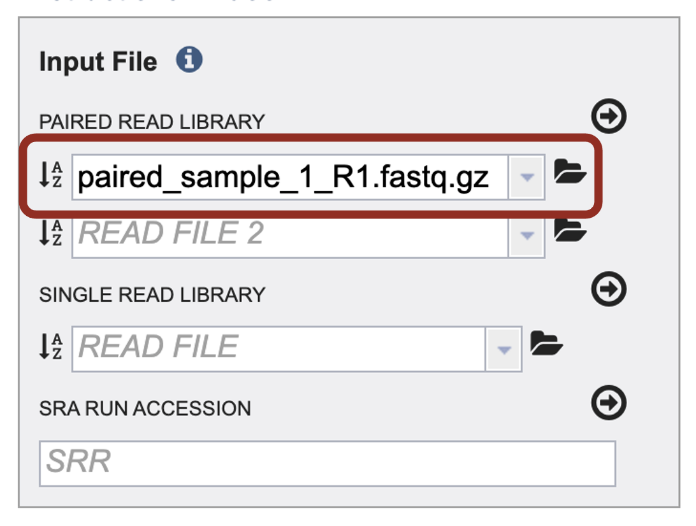 

8\. Pay attention to the upload monitor in the lower right corner of the BV-BRC page. It will show the progress of the upload. Do not submit the job until the upload is 100% complete. 

 

9\. Repeat steps 2-5 to upload the second pair of reads.
 

10\. The SAMPLE IDENTIFER Field will auto populate with the file name. Edit the field by clicking into the text box. The text entered to this text box will be used throughout the output files for the service. This documentation refers to this field as a sample id.

11\. To finish the upload, click on the icon of an arrow within a circle. This will move your file into the Selected libraries box.
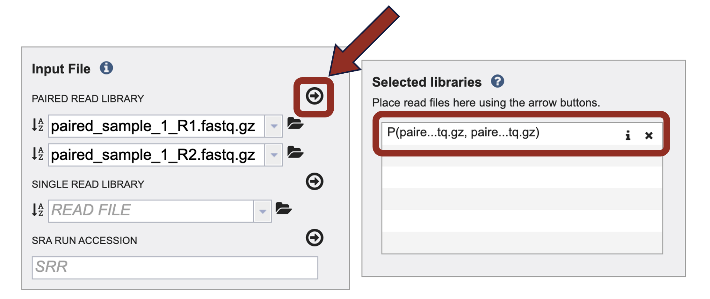 

## III. Uploading single reads

1\. To upload a FASTQ file that contains single reads, locate the text box called “Single read library.”
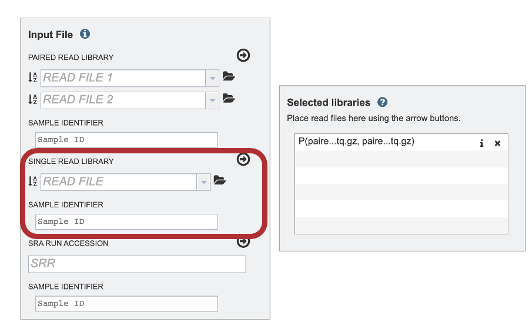 

2\. If the reads have previously been uploaded, click the down arrow next to the text box below Read File.
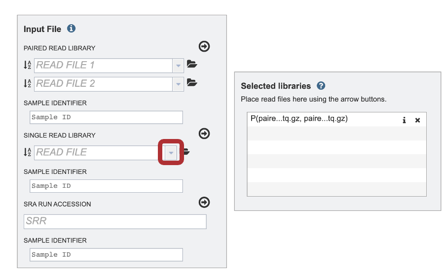 

3\. This opens up a drop-down box that shows the all the reads that have been previously uploaded into the user account. Click on the name of the reads of interest.
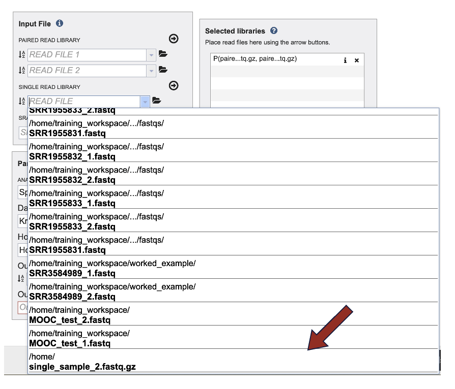 

4\. This will auto-fill the name of the document into the text box as seen below.
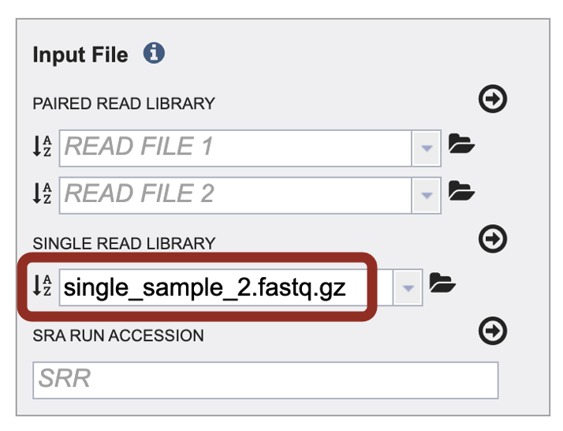 

5\. The SAMPLE IDENTIFER Field will auto populate with the file name. Edit the field by clicking into the text box. The text entered to this text box will be used throughout the output files for the service. This documentation refers to this field as a sample id.

6\. To finish the upload, click on the icon of an arrow within a circle. This will move your file into the Selected libraries box.
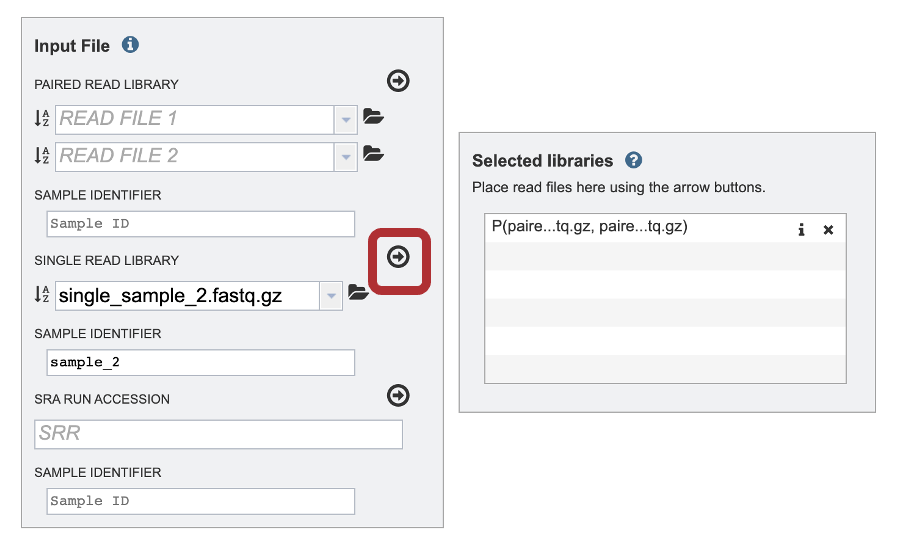 

## IV. Submitting reads that are present at the Sequence Read Archive (SRA)
1\. BV-BRC also supports analysis of existing datasets from SRA. To submit this type of data, locate the Run Accession number and copy it.
 

2\. Paste the copied accession number in the text box underneath SRA Run Accession, then click on the icon of an arrow within a circle.
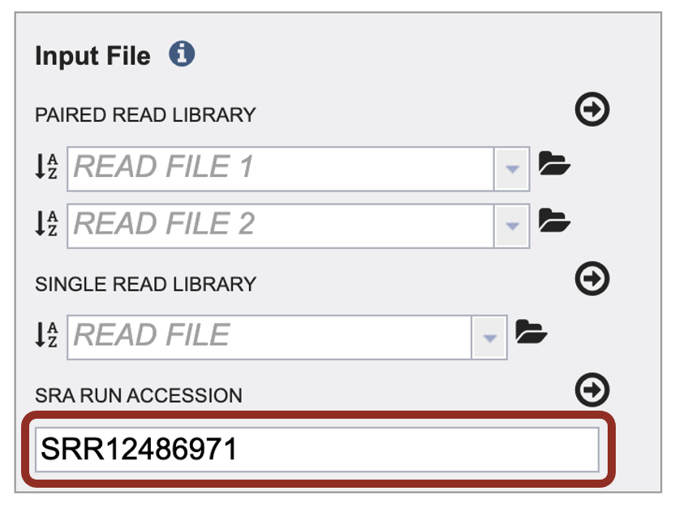 

3\. The SAMPLE IDENTIFER Field will auto populate with the SRA value. Edit the field by clicking into the text box. The text entered to this text box will be used throughout the output files for the service. This documentation refers to this field as a sample id.

4\. This will move the file into the Selected libraries box.
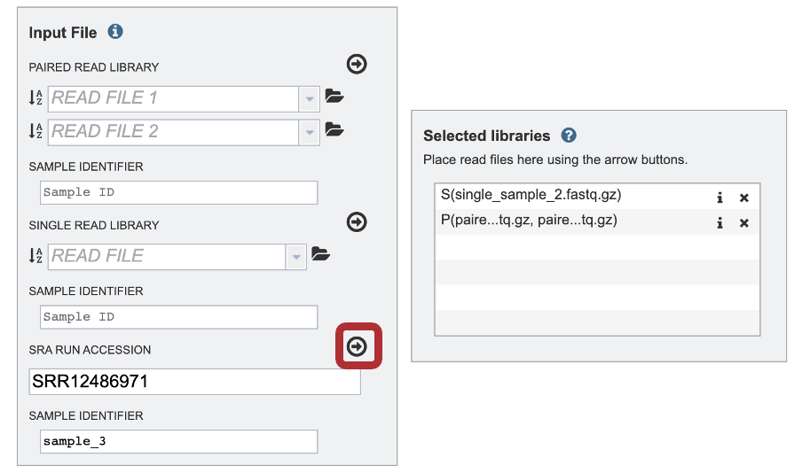 

## IV. Selecting parameters

Parameters must be selected prior to job submission. The algorithm used for Taxonomic Classification is Kraken2, which uses exact alignment of k-mers for classification accuracy. The Kraken2 software package was downloaded from the developer source: https://ccb.jhu.edu/software/kraken2/
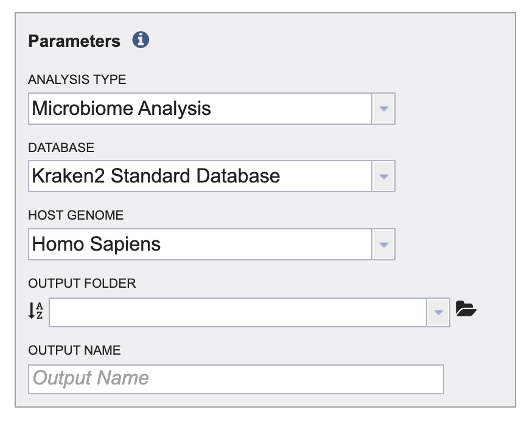  

1\. An analysis type must be selected for the Taxonomic Classification job. Click on the Analysis Type drop down arrow to choose between Species Identification or Microbiome Analysis. For a detailed description of both outlines please review the [quick reference guide](https://www.bv-brc.org/docs/quick_references/services/taxonomic_classification_service.html).

2\. A reference database must be selected for the Taxonomic Classification job.  Click on the Database dropdown arrow to choose between Kraken2 Standard Database and the BV-BRC Database. For a detailed description of both the databases please review the [quick reference guide](https://www.bv-brc.org/docs/quick_references/services/taxonomic_classification_service.html).

3\. Choose the host genome that will be removed from the reads. Click on the Host Genome dropdown arrow to and click on the host genome for your samples. For metagenomic samples, homo sapiens is the most common host genome.
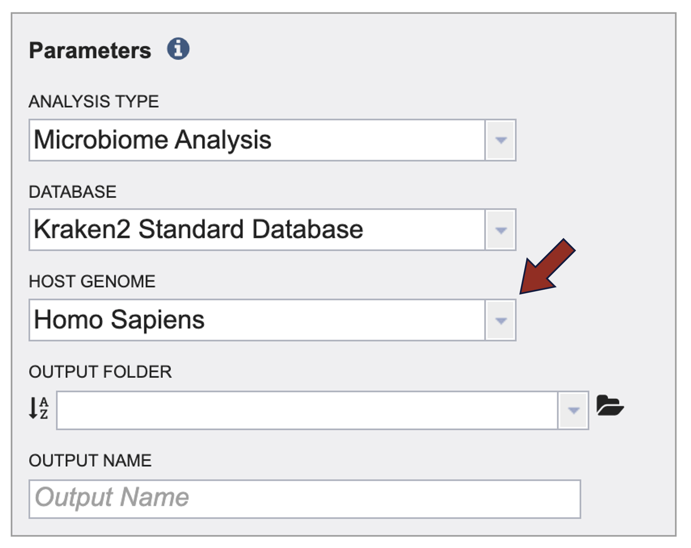 

2\. An output folder must be selected for the Taxonomic Classification job. Clicking on the down arrow at the end of the text box underneath Output Folder will show recent folders that have been used. Clicking on the folder icon at the end of the text box will open a pop-up window where all folders can be viewed, or new folders created. You can also start typing the name of a folder in the text box.  A drop-down box will appear that shows folders that match what you entered.
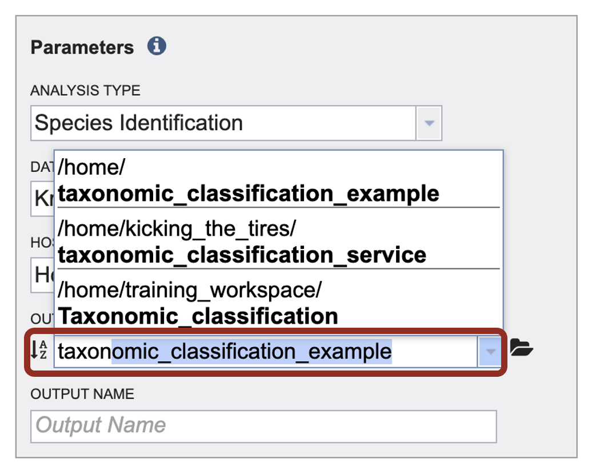 

3\. Click on the desired folder.
 

4\. The name of the folder will now appear in the box.  
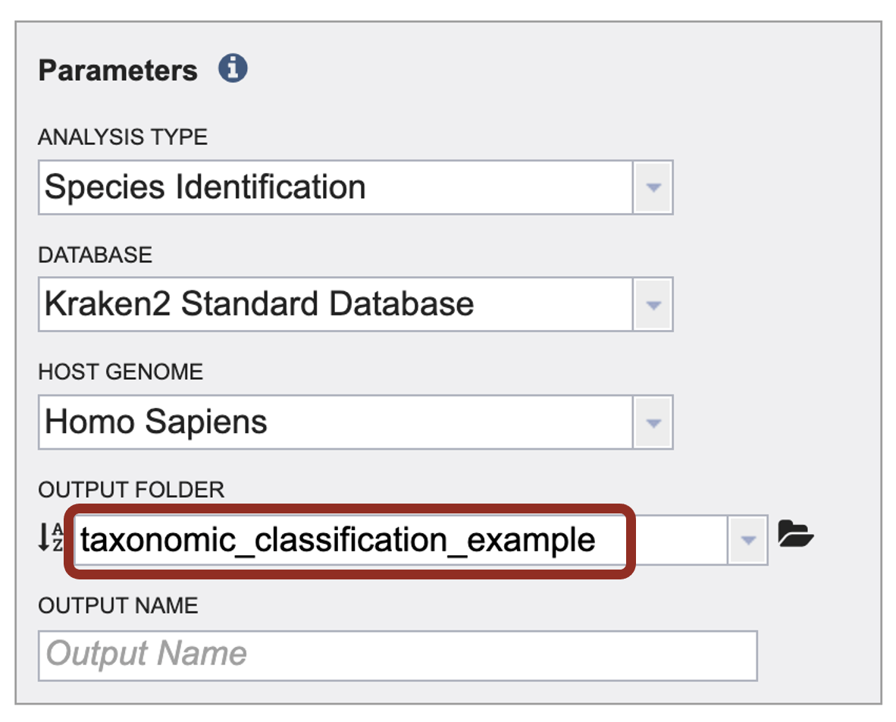 

5\. A name for the job must be entered in the text box under Output Name. At this point, the Submit button turns blue and the job will be submitted once clicked.  
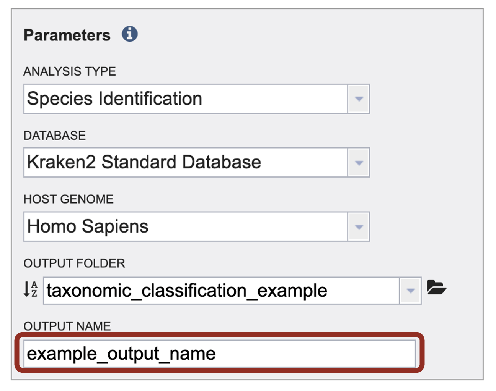 

6\. After clicking the submit button, your job will be launched.  A successful submission will generate a message indicating that the job has been queued.  
 

The bottom of each BV-BRC page has an indicator that shows the number of jobs that are queued, running or completed. Clicking on the word Jobs will rewrite the page to show the Job status. Researchers can monitor the Jobs Status page to see the status of their job, which is indicated in the first column (Queued, Running, Complete, Failed).
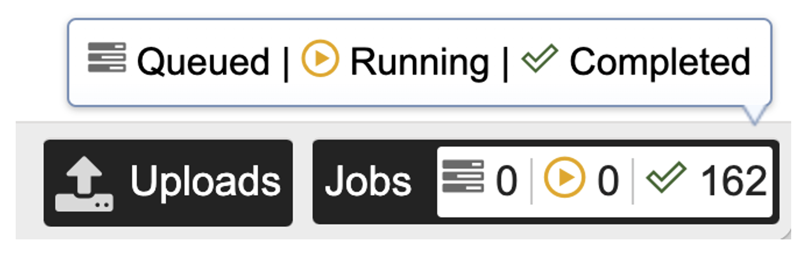 

## V. Viewing the Taxonomic Classification job – Output files

1\. To access your job, you can click on the Jobs part of your Jobs monitor.
 

2\. This will open your Jobs page.
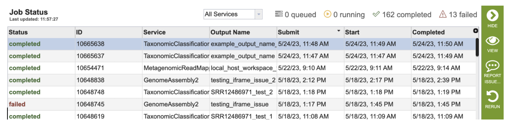 

3\. Clicking on the row that contains the job of interest will open two icons in the vertical green bar.  To report an issue with a job, click on the Report Issue icon.
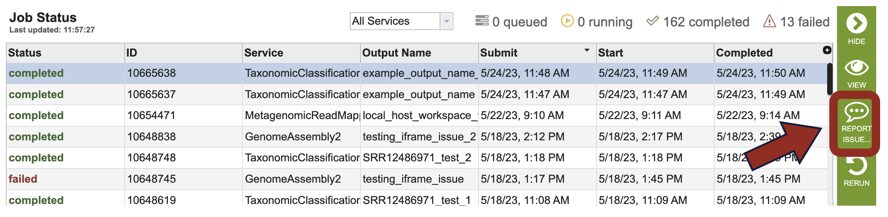 

4\. This will open a pop-up window where jobs can be reported. Please provide a detailed description of the problem.  Clicking the submission button will generate a message to BV-BRC team members, notifying them that there is a problem. We encourage researchers to report all failed jobs, or those that have confusing results. In addition, researchers should report long waits that they are experiencing in the queue.
 

5\. A job that has been successfully completed can be viewed by clicking on the row (which will turn the row blue) and then clicking on the View icon in the vertical green bar.
 

6\. This will open a page for the selected job. The top box has the job ID number and gives pertinent information about the time it took to complete and the selected parameters. The lower table has five output files, but if the classified an/or unclassified reads are selected when the job was submitted, it will have one or two additional rows.
 

# Nicole start of changes
7\. The landing directory will have files and sub directories for each sample. A summary_table.csv provides a summary for the Kraken2 results. The MultiQC report contains the FastQC, Kraken The sample_key.csv displays the user input file names and the sample ids. A Sankey diagram for each sample.  Click on the sample_key.csv. 

A subdirectory is available for each sample. The contents are described below.

For *microbiome analyses* alpha diversity results for each sample are collated as .CSV and .HTML. 
*If multiple samples were run* the beta diversity results as .CSV and .HTML.

8\. multiqc_report.html will display a compilation of sample results from various analyses into one place. If you are new to MultiQC, an introductory video walkthrough is available above General Statistics. ## Insert screen capture. Use the toolbox to interact with the contents of the report. 

9\. multisample_comparison.html *This file is only generated if multiple samples are submitted with this job* Click to view a table of the taxa compared across samples according to z-score Note: this information is also available in multisample_comparison.csv for convient use in downstream analysis and visualzation.

10\. multisample_krona.html *This file is only generated if multiple samples are submitted with this job* Click to view krona plots of each sample included in your analysis. Toggle between all the samples included in your analysis by clicking on the sample names or up and down arrows in the upper left hand corner of the report underneath the Krona logo. For more details about interacting with the Krona chart please view the sample level details at number 20 in this list.

11\. summary_table.csv *This file is only generated if multiple samples are submitted with this job* Click to view a summary of kraken results across all the samples submitted in this job.

12\. summary_table.csv *This file is only generated if multiple samples are submitted with this job* Click to view a summary of kraken results across all the samples submitted in this job.

13\. Click into a sample specific subdirectory. Each sample directory is formatted the same way and contains files for an individual sample.

14\.	Click FASTQC_results directory. This directory contains two subdirectories, host_removed_reads and raw_reads. Click into a subdirectory to view here is FastQC reports and directory with related files for each sample.  If you are unfamiliar with reviewing FastQC report review this [detailed video walkthrough](https://www.youtube.com/watch?v=bz93ReOv87Y) from the creators of FastQC at [Babraham Bioinformatics](https://www.bioinformatics.babraham.ac.uk/).  Note: These results are also available in the MultiQC report which contains these files for every sample included in this job. The files that support the FastQC report are available zipped into fastqc.zip for the specific FASTQ (or both read one and read two FASTQs). Click the up arrow next to *parent folder* to return to the sample specific subdirectory.

15\. Click the Hisat2_results subdirectory to view the contents. This folder contains the host removed FASTQ read files. A SAM file with the aligned reads is also located in this directory.Click the up arrow next to *parent folder* once to return to the sample specific subdirectory.

16\. Click kraken_output directory to find the standard Kraken2 result report and output files. These are text files that can be viewed by clicking on them. Click the up arrow next to *parent folder* once to return to the sample specific subdirectory.
 

17\. Sankey diagram This is another view of the taxa across every domain level at the same time.

18\. 

19\. 

20\. Click the [*analysis sample name*]_krona.html to view an interactive display of the taxa and their domain level.

21\. This view has a search box at the top left of the page.  Entering any text will search the graph results for text that matches the entry.
 

22\. At the top of the view, there are several controls that can be used to change the visualization or download the data.
  

23\. The image can be downloaded by clicking on the Download icon at the top of this page.
 

24\. The phylogeny level, represented by each circle shown in the graph can be changed by increasing the number (+) or decreasing the number (-) using the Max depth function.
 

25\. The font size in the visualization can be changed by using the buttons to decrease (-) or increase (+) it in front of the words Font size.
 

26\. Change the chart size.
 

27\. You can see the taxonomy spectrum by clicking on a region of interest in the Krona chart.  This will rewrite the view to show how the data mapped within the selected taxon.
 

28\. Following any changes, a snapshot of the new image can be downloaded by clicking on Snapshot.
 

29\. A shareable link will also be generated if Link is clicked.
 

30\. A link to the Krona documentation can be viewed by clicking on the question mark (?) icon.
 

31\. Click the back arrow at the top of the page to return to the sample specific subdirectory.

32\. Click the [*user sample id*]_sankey.html to view a Sankey diagram of the taxa. If features are overlapping, click and drag bars up and down. Specifically, the archaea feature may populate over the sample name. Simply click and drag down to view. 

## References
1. Lu, J. & Salzberg, S. L. Ultrafast and accurate 16S rRNA microbial community analysis using Kraken 2. Microbiome 8, 1-11 (2020).
2. Ondov, B. D., Bergman, N. H. & Phillippy, A. M. Interactive metagenomic visualization in a Web browser. BMC bioinformatics 12, 385 (2011).
3. Lu, J., Rincon, N., Wood, D. E., Breitwieser, F. P., Pockrandt, C., Langmead, B., Salzberg, S. L., &amp; Steinegger, M. (2022). Metagenome analysis using the Kraken Software Suite. Nature Protocols, 17(12), 2815–2839. https://doi.org/10.1038/s41596-022-00738-y
