# Taxonomic Classification Service

*Revision: 02/29/2024*

Metagenomics is the study of genomic sequences obtained directly from an environment. For many metagenomic samples, the species, genera and even phyla present in the sample are largely unknown at the time of sequencing, and the goal of sequencing is to determine the microbial composition as precisely as possible. The BV-BRC Taxonomic Classification service can be used to identify the microbial composition of metagenomic samples, but it can also be used to verify the purity of an isolated sample. **Researchers can submit metagenomic samples that are short reads (paired end or single end) as well as submissions to the Sequence Read Archive via accession run numbers.** 

The BV-BRC Taxonomic Classification service can be used to identify species (Species Identification) and metagenomes (Microbiome) using whole genome sequencing reads.  It has also been recently updated to classify 16S ribosomal RNA reads.  The first step of the service estimates the quality of the reads using FastQC [1].  After this it follows the pipeline established by Lu, et al. [2].  If desired, a researcher can separate the host reads from the microbial ones using HiSAT2 [3],  but if this is not enabled, all reads are classified using Kraken2 [4].  This is the central feature of the pipeline and uses exact-match database queries of k-mers, rather than inexact alignment of sequences. Sequences are classified by querying the database for each k-mer in a sequence, and then using the resulting set of lowest common ancestor (LCA) taxa to determine an appropriate label for the sequence.  The results from Karken2 are used to generate a Krona [5] plot, are used by Pavian [6] to generate a Sankey plot as well as Summary and Interactive Multi-sample Comparison tables.  The 16S rRNA and microbiome pipelines also include Bracken [7] where abundances of reads mapping to different taxa are estimated.  The abundance estimates from Bracken are combined with the Kraken2 and FastQC results to aggregate results using MultiQC [8], and also to provide alpha and beta estimates of diversity.  The MultiQC report is not included in the Species Identification pipeline.

The BV-BRC service recently expanded to include analysis of reads from 16S ribosomal RNA. The workflow is similar, but does not include read mapping using HiSAT2 and instead, trims the submitted reads using TrimGalore [9].

## Locating the Taxonomic Classification Service
1.	At the top of any BV-BRC page, find the Services tab.

2.	Click on Taxonomic Classification, which is under the Metagenomics heading.

3.	This will open up the **Taxonomic Classification** landing page where researchers can submit long reads, single or paired read files, an SRA run accession number, or assembled contigs to the service.

## Submitting sequencing reads (single or paired)
The service accepts both single and paired reads.  Paired read libraries are usually given as file pairs, with each file containing the forward or reverse half of each read pair. Paired read files are expected to be sorted in such a way that each read in a pair occurs in the same Nth position as its mate in their respective files. These files are specified as READ FILE 1 and READ FILE 2. For a given file pair, the selection of which file is READ 1 or READ 2 does not matter.

Reads must first be uploaded to the BV-BRC workspace, and once there, they can be selected in several ways.

1.	Navigate to the workspace by clicking on the **Folder** icon at the end of the text box.  This will open a pop-up window.  Located the row that has the correct reads, and then click on that.  This will highlight the row.  Click on OK at the bottom of the pop-up box to select the reads.

2.	Clicking on the **down arrow** at the end of the text box will open a drop-down box that shows the reads that have been selected most recently (top of list) to less frequently (down).  Clicking on the row that has the correct read will select those reads.
3.	Beginning to type the name of the read in the text box will open a drop-down box that shows reads matching that text.  Clicking on the row that has the correct read will select those reads.
4.	Note that once reads are selected, a **SAMPLE ID** field will auto populate with the file name in the box immediately below the selected reads. Edit the field by clicking into the text box. The text entered to this text box will be used to identify this sample throughout the output files for the service. 

5.	Multiple read pairs or single reads can be analyzed, but they must first be moved to the **Selected Libraries** box. Click on the **arrow** to the right of the selected reads.  This will move the file into the **Selected Libraries** box. Clicking on the information icon (i) will open a pop-up window that shows the reads selected, as well as where they are located in the workspace.

6.	Note that there is an **S** or **P** preceding the reads designates if they are single or paired.  Reads can be removed by clicking on the **X** at the end of the row where they are listed.

## Submitting reads from the Sequence Read Archive (SRA)
BV-BRC also supports analysis of existing datasets from SRA. If users submit SRA values, the BV-BRC will input the corresponding FASTQ files to the service. 
1.	To submit this type of data, locate the Run Accession number and copy it.

2.	Paste the copied accession number in the text box underneath SRA Run Accession, then click on the icon of an **arrow within a circle**. This will generate a dialog box above the text box that indicates that the service is validating the run number with SRA.  Once the verification is complete, the number will appear in the **Selected Libraries** box.

## Parameters
Parameters must be selected prior to submission of the Taxonomic Classification job.  The algorithm used is Kraken 2, which uses exact alignment of k-mers for classification accuracy.

1.	**Sequencing Type** must first be selected by clicking on the radio button before either **Whole Genome Sequencing (WGS)** or **16S Ribosomal RNA**.

2.	**Analysis Type** is the next parameter to be selected.  If **WGS** was selected originally, clicking on the down arrow at the end of the text box will open a drop-down box that shows the two options.  The **Species identification** is an end-to-end pipeline that runs Kraken2Uniq to identify taxa at the species level. The Kraken results are used in the analysis results. The **Microbiome Analysis** includes the steps of the species identification pipeline with additional microbiome specific steps (Bracken abundance, alpha diversity, and beta diversity). This pipeline uses Kraken2 to identify taxa the species level. However, this pipeline uses a companion program to Kraken2 and the other tools in the Kraken suite, Bracken. Bracken is run at the species level with the flag ‘-S’. Bracken recreates the report file using the values from the Bracken recalculation. This is available in the user input sample id subdirectory under bracken_output. Any levels whose reads were below the threshold of 10 are not included. Percentages will be re-calculated for the remaining levels.

There are no **Analysis Type** options available if **16S** was originally selected. The 16S pipeline uses Bracken at the genus level ”G”.

3.	**Database** is the next parameter.  If **WGS** was selected originally, there are two database options. The **Kraken2 Standard Database** contains distinct 31-mers, based on completed microbial genomes from NCBI. The **BV-BRC Database** includes the RefSeq [10] complete genomes and protein/nucleotide sequences for archaea, bacteria, plasmids, viruses, human GRCh38, fungi, plants, protozoa and UniVec (the NCBI-supplied database of vector, adapter, linker, and primer sequences that may be contaminating sequencing projects and/or assemblies).

If **16S** was originally selected, the two database selections are SILVA [11] (16S rRNA genes sequences from bacteria, archaea, and eukaryotes) or Greengenes [12] (16S rRNA gene sequences from bacteria and archaea). These databases do not provide NCBI taxonomy IDs.

4.	If **WGS** was selected, a host can be selected in the **Filter Host Reads** dropdown, HiSAT2 will align the reads to one of ten available host genomes, then remove any aligned reads that aligned to that host genome from the sample. FastQC will run on the host removed reads. The remaining, non-host reads are then classified by Kraken 2.

5.	**Confidence Interval** selection is the same for all sequence types.  The default confidence interval is 0.1. The classifier then will adjust labels up the tree until the label’s score meets or exceeds that threshold.

6.	The Taxonomic Classification service also provides the ability to save the reads that were classified by Kraken, or those that were not classified, in separate files for possible downstream analyses. If either (or both) of those options are selected, the files will be available in the output folder when the job is completed.
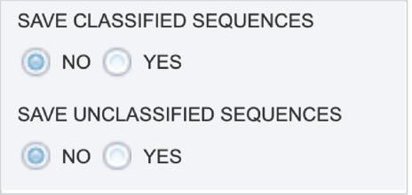

7.	An **Output Folder** must be designated to hold the job results.

8.	Once an **Output Name** is selected, the job can be submitted. At this point, the Submit button turns blue and the job will be submitted once clicked.

9.	After clicking the submit button, your job will be launched.  A successful submission will generate a message indicating that the job has been queued.  

10.	 The bottom of each BV-BRC page has an indicator that shows the number of jobs that are queued, running or completed. Clicking on the word Jobs will rewrite the page to show the Job status. Researchers can monitor the Jobs Status page to see the status of their job, which is indicated in the first column (Queued, Running, Complete, Failed).

## Locating the Taxonomic Classification job – Output files
1.	To access your job, you can click on the Jobs part of your Jobs monitor.

2.	This will open your Jobs page.
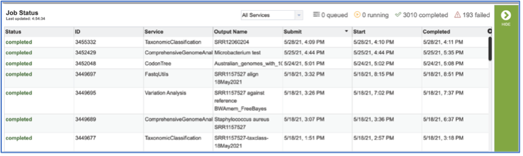

3.	Clicking on the row that contains the job of interest will open two icons in the vertical green bar.  To view the job, click on the **View** icon.
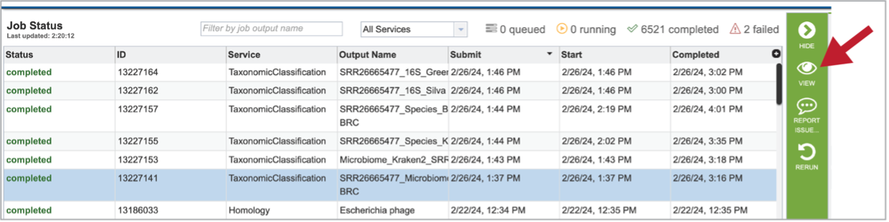

4.	This will open a page for the selected job. The results are divided into several sections that include the job information, the results for each individual file that was submitted, diversity statistics, multisample reports and information about the samples, including a key and a table.
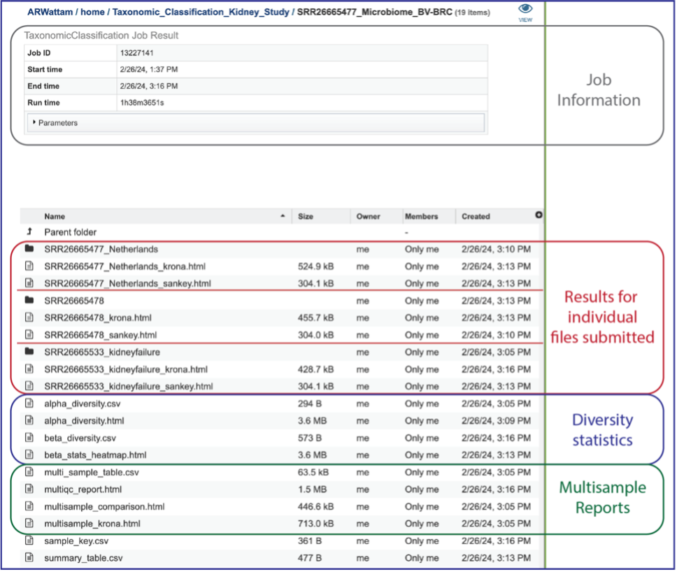

5.	Information about the job, including the job ID, the running time, and the information of the data submitted can be viewed in the uppermost box.  Clicking on **Parameters** will open a drop-down box that contains information about the samples submitted.
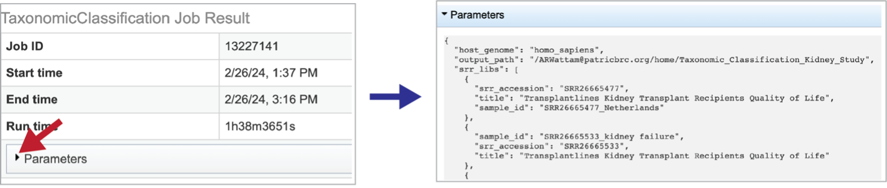

## Results for Individual Files Submitted
1.	A Krona image is created for each individual file that has been submitted.  Selecting the row that contains the **krona.html** file, and then on the **View** icon, will open this image.  Manipulation of Krona image described in Krona images below.

1.	At the top of the view, there are several controls that can be used to change the visualization or download the data.
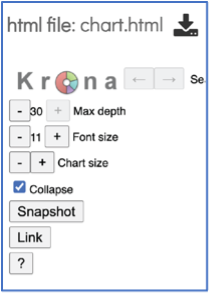

2.	The number of circles shown in the graph can be changed by increasing the number (+) or decreasing the number (-) using the Max depth function.
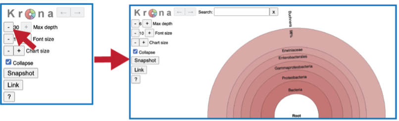

3.	A text box at the top of the page enables a search for specific names.
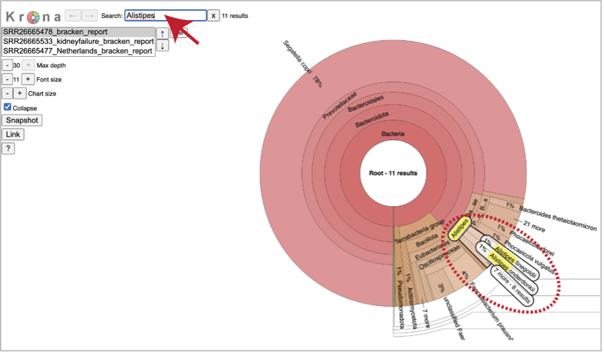

4.	You can see the taxonomy spectrum by clicking on a region of interest in the Krona chart.  This will rewrite the view to show how the data mapped within the particular taxon selected.

5.	Sankey plots (**sankey.html**) are created for each sample using functions from Pavian. To see the Sankey plot, click on its row and then on the **View** icon in the green action bar. 
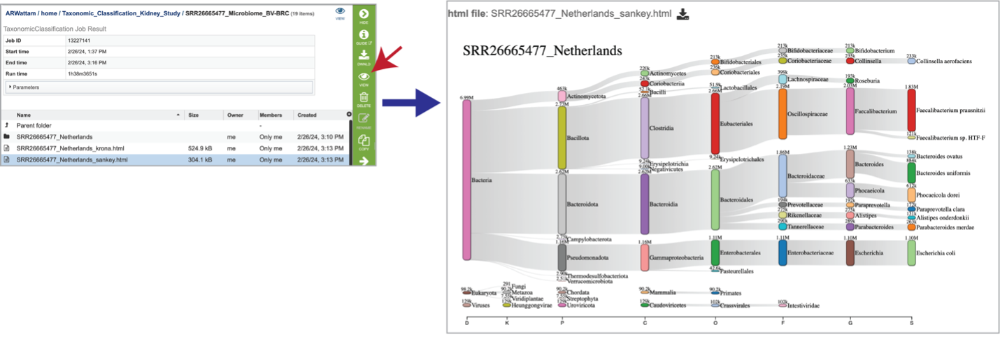

6.	Click into a sample specific subdirectory. Each sample directory is formatted the same way and contains files for an individual sample.
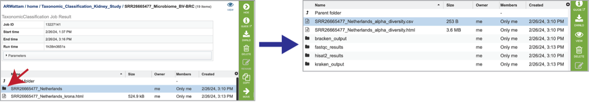

7.	Selecting the row that contains the **alpha_diversity.csv** file and then clicking on the **View** icon in the green action bar will rewrite the window to show the alpha diversity report for that sample.
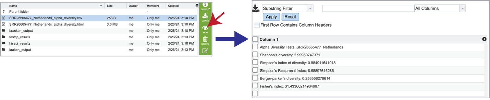

8.	Selecting the row for the **alpha_diversity.html** and then the **View** icon will open this file.
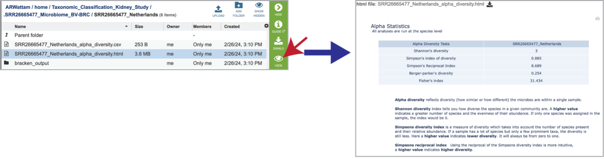

9.	The individual job folder also contains a **bracken_output** folder.  Clicking on that will open the folder.  Selecting the **bracken_output.txt** file will open the bracken output.
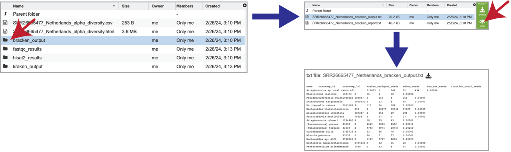

10.	It also includes a **bracken_report.txt** file.  This file contains a number of columns, the headings of which are as described:
* Percentage of fragments covered by the clade rooted at this taxon.
* Number of fragments covered by the clade rooted at this taxon.
* Number of fragments assigned directly to this taxon.
* A rank code, indicating (U)nclassified, (R)oot, (D)omain, (K)ingdom, (P)hylum, (C)lass, (O)rder, (F)amily, (G)enus, or (S)pecies. Taxa that are not at any of these 10 ranks have a rank code that is formed by using the rank code of the closest ancestor rank with a number indicating the distance from that rank. E.g., "G2" is a rank code indicating a taxon is between genus and species and the grandparent taxon is at the genus rank.
* NCBI taxonomic ID number.
* Indented scientific name.
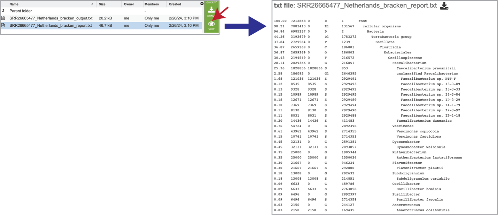

11.	The pipeline produces FastQC reports for each of the reads submitted for each sample. These reports are available in the **fastqc_results** folder. There are two folders within that directory.  Clicking on the  host_removed_reads folder reveals two files per read submitted.   The **fastqc.html** file has the FastQC report, which can be seen by selecting that row and clicking on the **View** icon.  The **fastqc.zip** file should be downloaded and contains all the files produced by FastQC for these reads.
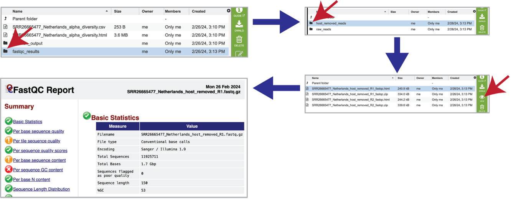

12.	Each of the submitted samples contains a **raw_reads** folder. Clicking on that folder will reveal two files for each read submitted in that sample. The **fastqc.html** file has the FastQC report, and the **fastqc.zip** file should be downloaded, and contains all the files produced by FastQC for these reads. 
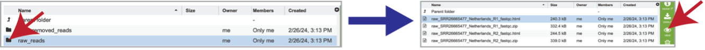

13.	As mentioned above, reads are aligned to the host genome using Hisat2 if selected during submission.  The reads that mapped to the host genome are available in the **hisat2_results** folder. Clicking on that folder reveals the files associated with those reads, including the **aligned_reads.sam** file, which is the Sequence Alignment/Map format (SAM).  This file has the alignment of the reads on the host genome and should be downloaded if of interest.
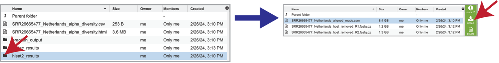

14.	 The individual files for each of the reads in this sample are also produced as the **host_removed_R1.fastq.gz** files.  These are available for download.
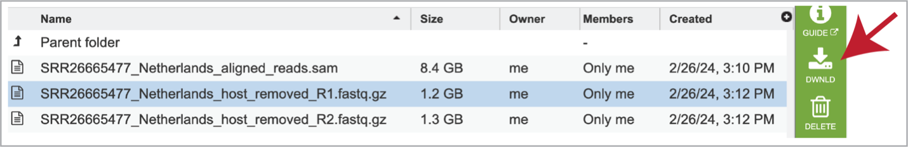

15.	The classification results produced by Kraken 2 are available in the **kraken_output** folder.  Clicking on this folder reveals two different files.  The **k2_output.txt** file should be downloaded, but the k2_report.txt can be visualized by clicking on the **View** icon.  This file contains a number of columns, the headings of which are as described:
* Percentage of fragments covered by the clade rooted at this taxon.
* Number of fragments covered by the clade rooted at this taxon.
* Number of fragments assigned directly to this taxon.
* A rank code, indicating (U)nclassified, (R)oot, (D)omain, (K)ingdom, (P)hylum, (C)lass, (O)rder, (F)amily, (G)enus, or (S)pecies. Taxa that are not at any of these 10 ranks have a rank code that is formed by using the rank code of the closest ancestor rank with a number indicating the distance from that rank. E.g., “G2” is a rank code indicating a taxon is between genus and species and the grandparent taxon is at the genus rank.
* NCBI taxonomic ID number
* Indented scientific name.
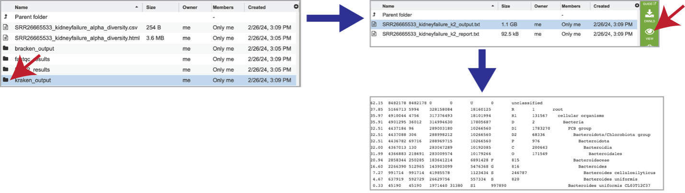

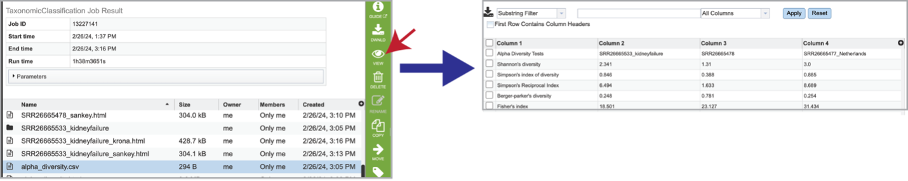

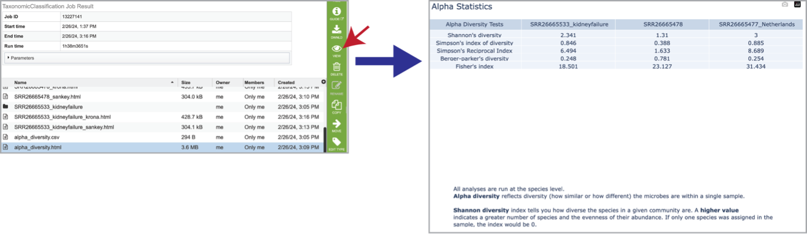

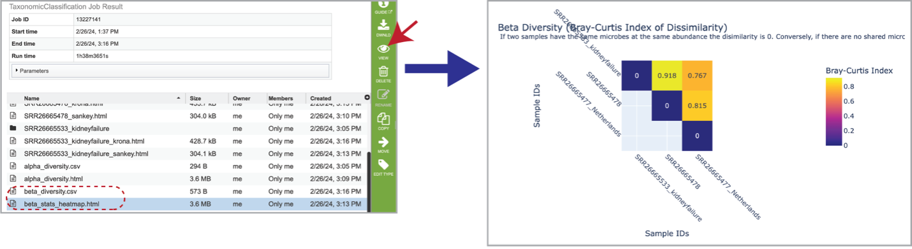

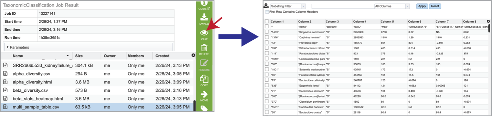

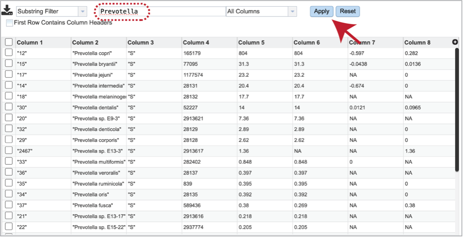

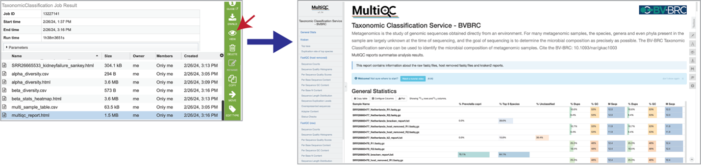

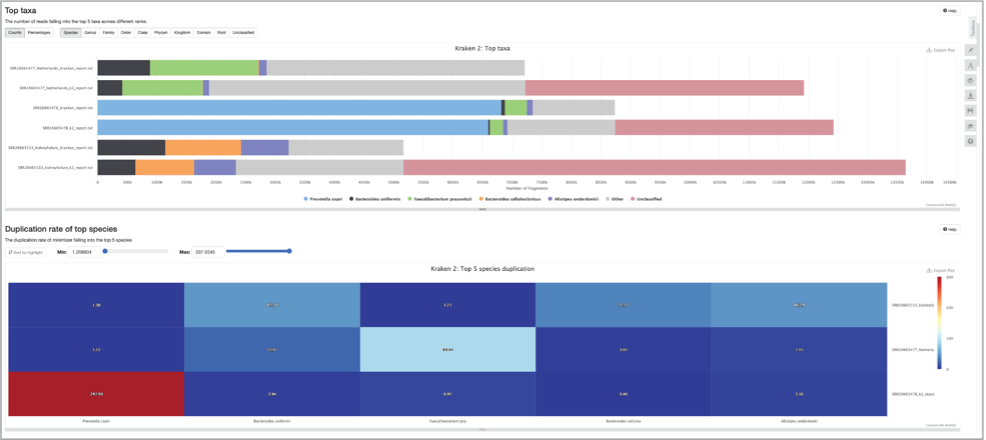

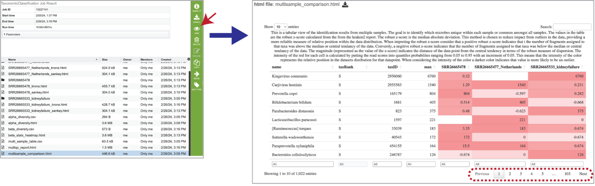

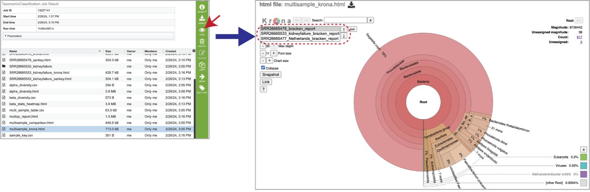

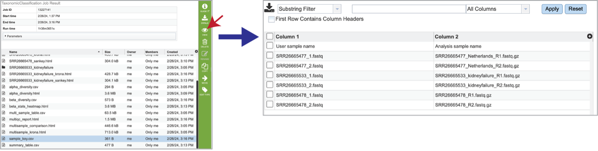

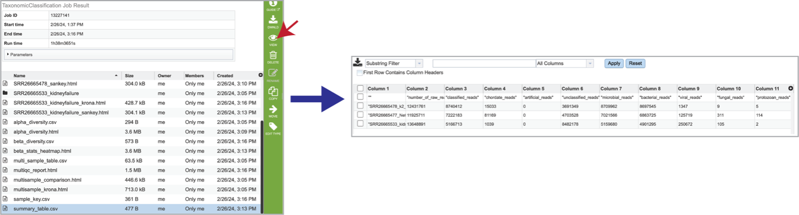

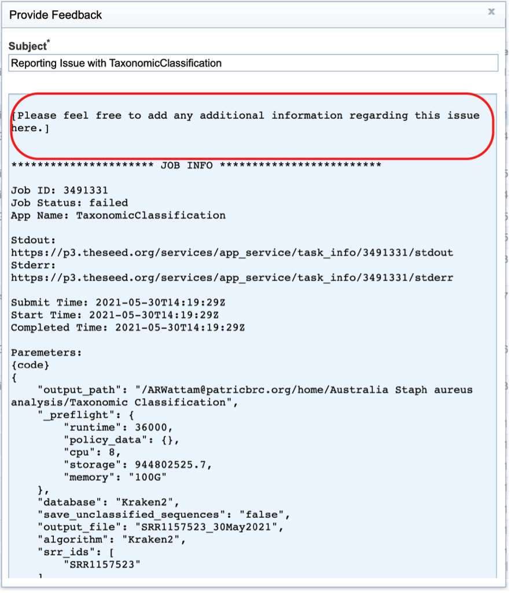

