# Variation - SNP Analysis Service

SNP genotyping is the measurement of genetic variations of single nucleotide polymorphisms (SNPs) between members of a species. It is a form of genotyping, which is the measurement of more general genetic variation. SNPs are one of the most common types of genetic variation. A SNP is a single base pair mutation at a specific locus, usually consisting of two alleles. SNP calling require the reads of target isolates and a reference genome as input and execute an external mapping tool and variant caller, followed by some filtering steps to remove low-quality SNPs. The BV-BRC Variation Analysis Service can be used to identify and annotate sequence variations, including SNPs, SNVs, and indels.

## Creating a folder to hold the variation job and related data

Please refer to the Assembly service tutorial for instructions on creating a folder in the BV-BRC or PATRIC (https://alpha.bv-brc.org/docs/tutorial/genome_assembly/assembly.html).

## Locating the Variation Analysis Service

1.	Click on the Services tab at the top of the page, and then click on Variation. 
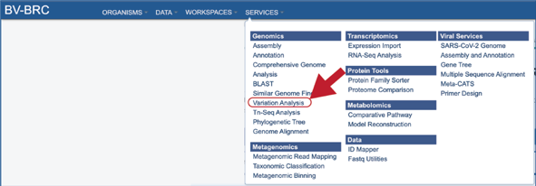

2.	This will open the landing page for the service. 
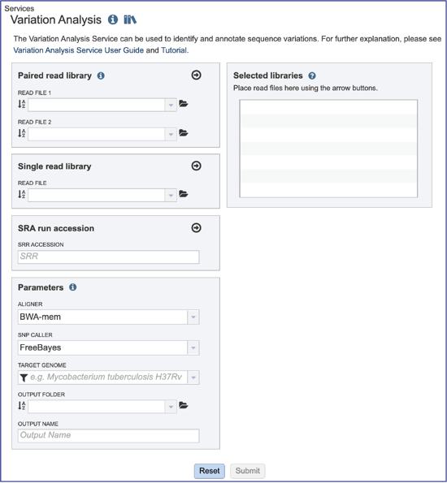

## Read files for target isolates

### Uploading paired end reads

Please refer to the Assembly service tutorial for instructions on uploading paired-end reads in the BV-BRC or PATRIC (../genome_assembly/assembly.html).

### Uploading single reads

Please refer to the Assembly service tutorial for instructions on uploading single-end reads in the BV-BRC or PATRIC (../genome_assembly/assembly.html).

### Submitting reads that are present at the Sequence Read Archive (SRA)

Please refer to the Assembly service tutorial for instructions on submitting reads from the SRA (../genome_assembly/assembly.html).

S## etting Parameters 

1. BV-BRC offers several types of **aligners** that can be used in the service. BWA-mem is set as the default aligner, but there are several options. 
    * **BWA-mem**[1] is a new alignment algorithm for aligning sequence reads or long query sequences against a large reference genome such as human. It automatically chooses between local and end-to-end alignments, supports paired end reads and performs chimeric alignment. The algorithm is robust to sequencing errors and applicable to a wide range of sequence lengths from 70bp to a few megabases. BWA-MEM is implemented as a component of BWA, which is available at https://github.com/lh3/bwa.
    * **BWA-mem-strict** is BWA-mem with the default parameters plus “-B9 -O16” to increase the gap extension and clipping penalty. These strict mapping parameters are recommended for cases where contigs and references are known to be very close to each other.
    * **Bowtie2**[2] improves on the previous Bowtie method in terms of speed and fraction of reads aligned and is substantially faster than non–full-text minute index–based approaches while aligning a comparable fraction of reads. Bowtie 2 performs sensitive gapped alignment without incurring serious computational penalties. The code for Bowtie2 is available at https://github.com/BenLangmead/bowtie.
    * **LAST**[3] is a long read sequence aligner. It can align billions of DNA reads to a genome and will indicate reliability of each aligned column. In addition, it can compare DNA to proteins, with frameshifts, compare PSSMs to sequences, calculates the likelihood of chance similarities between random sequences, does split and spliced alignment, and can be trained for unusual kinds of sequences (like nanopore).  The code for Last is available at https://gitlab.com/mcfrith/last.

2. To see the other choices of aligners that can be used, click on the down arrow at the end of the Aligner text box. This will open a drop-down box that shows all the available programs. Clicking on the desired aligner will autofill the text box with that selection. 
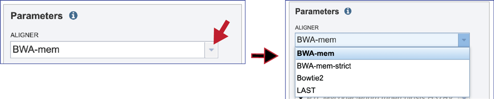

3. BV-BRC also offers a choice of **SNP callers**. The default selection is for FreeBayes, but SAMtools is another option.
   * **FreeBayes**[4] is an accurate method for sequence organization that includes fragment clustering, paralogue identification and multiple alignment. It calculates the probability that a given site is polymorphic and has an automated evaluation of the full length of all sequences, without limitations on alignment depth. The code for FreeBayes is available at https://github.com/freebayes/freebayes.
   * **The Sequence Alignment/Map (SAM)** format is a generic alignment format for storing read alignments against reference sequences. SAMtools[5] implements various utilities for post-processing alignments in the SAM format, such as indexing, variant caller and alignment viewer, and thus provides universal tools for processing read alignments. The SAMtools option invokes the BCFtools’ SNP calling algorithm on top of SAMtools’ mpileup result. The code for SAMtools is available at http://www.htslib.org/.

4. To see the other available choices, click on the down arrow that follows the SNP Caller text box. This will open a drop-down box that shows all the available programs. Either SNP caller is run with the default parameters. The raw SNPs are then filtered by SNP quality (QUAL>10) and read depth (DP>5) to keep only the high-quality SNPs. Clicking on the desired aligner will autofill the text box with that selection. 
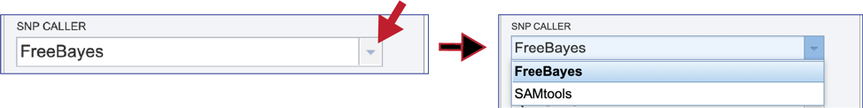

5. Researchers must select a Target Genome to align the reads against. Clicking the arrow at the end of the text box will show genomes, but this will be a long list for dedicated BV-BRC users. 
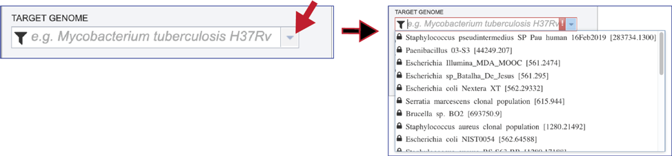

6. The search can be narrowed by clicking on the filter icon at the beginning of the text box.  This will show checkboxes that can narrow the search to reference, representative, all public, or private genomes (My Genomes). 
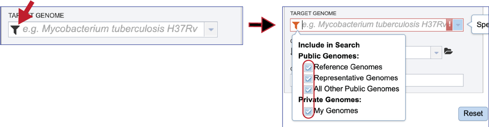

7. If the name or genome ID is known, typing that in the text box will filter results in the drop-down box to show the possible genomes that match the input. 
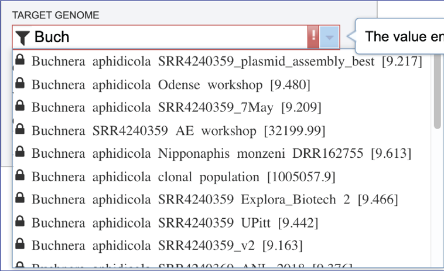

8. The variation job must be placed in an **Output Folder**.  Links to instructions on creating a new folder are available at the top of this tutorial, but if a folder has already been created, entering the name in the text box will filter the drop-down box to show the possible folders that match that input. 

9. When no text is entered, a clicking on the arrow at the end of the text box will show all the possible folders.  Dedicated BV-BRC users may have a lot of folders. 

10.	Clicking on the **Folder** icon at the end of the text box will open a pop-up window that shows all the files in the workspace, which can be selected. 
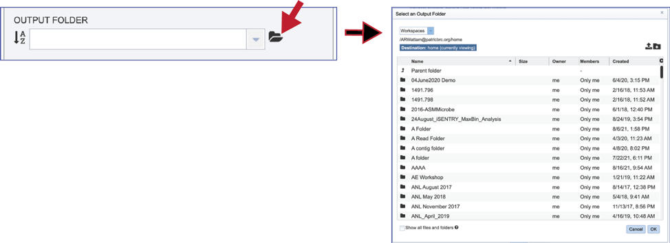

11.	Prior to submission, the variation job needs a name, which can be entered in the text box under **Output Name**. 
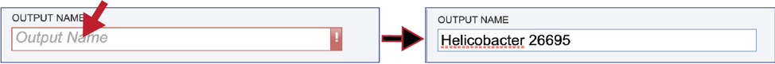

12.	Once the reads are placed into the selected libraries box, and the parameters are selected, the Submit button at the bottom of the page will turn blue.  This means that the job can be submitted. 
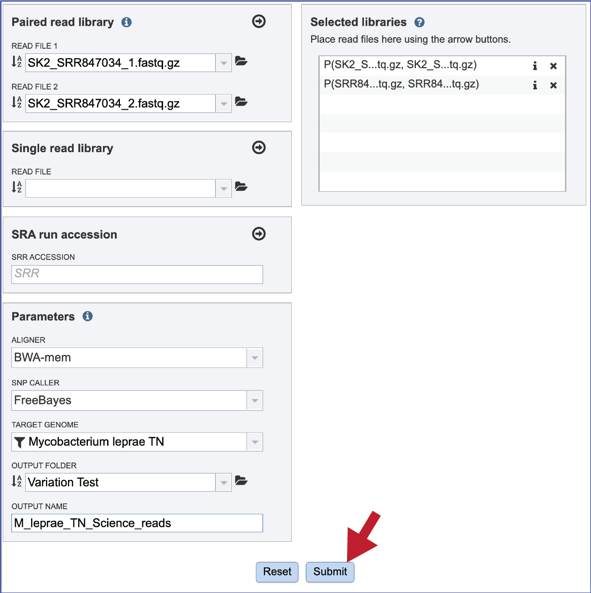

13.	If the job was submitted successfully, a message will appear that indicates that the job has entered the queue. To check the status of the variation job, click on the Jobs indicator at the bottom of the BV-BRC page. 

## Monitoring progress on the Jobs page

1. Click on the Jobs box at the bottom right of any BV-BRC page. 

2. This will open the Jobs Landing page where the status of submitted jobs is displayed. 

## Viewing the Variation job results

1. To view a particular job, click on a row to select it. Once selected, the downstream processes available for the selection appear in the vertical green bar.  Clicking on the View icon will open the variant analysis job summary. 
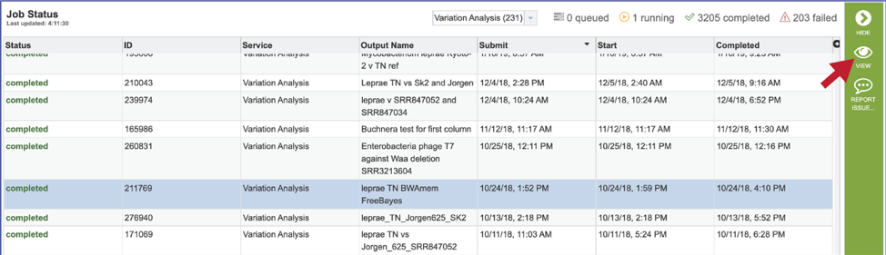

2. This will rewrite the page to show the information about the variation job, and all of the files that are produced when the pipeline runs.  
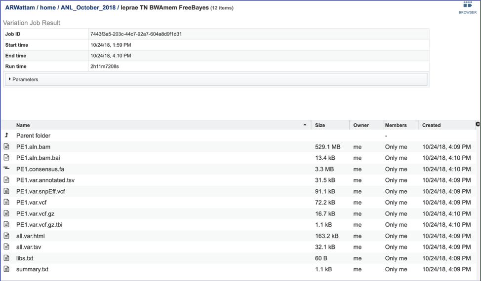

3. The information about the job submission can be seen in the table at the top of the results page.  To see all the parameters that were selected when the job was submitted, click on the **Parameters** row. 
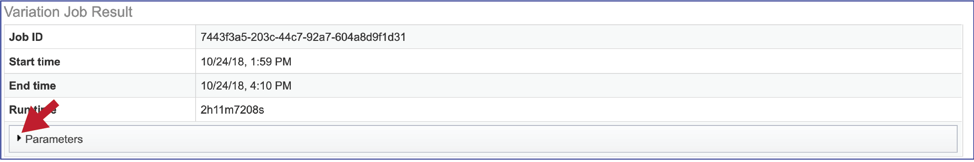

4. This will show the information on what was selected when the job was originally submitted. 
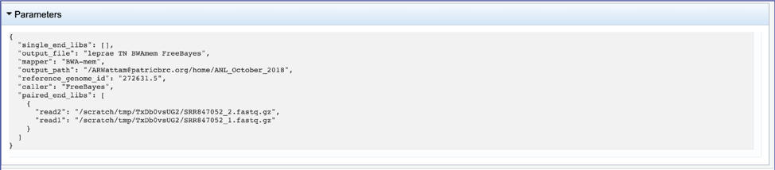

5. **Bam files**. The Binary Alignment/Map (BAM) is the companion format of the Sequence Alignment/Map (SAM) format[5]. A SAM file (.sam) is a tab-delimited text file that contains sequence alignment data. The bam format is compact in size and supports fast retrieval of alignments in specified regions. It is optimal for viewing in a genome browser. The BV-BRC variant analysis service provides a .bam file for each of the read libraries that were loaded.  These can be downloaded by selecting the row that contains for file and then clicking on the **Download** icon in the vertical green bar.  BV-BRC also provides a direct view of the bam file by clicking on **Browser** icon at the top right of the job page.  Viewing the data on the browser will be discussed below. 
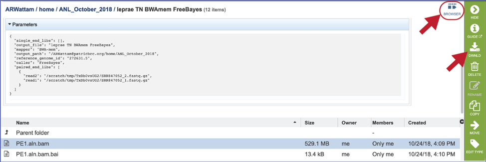

6. **Bam.bai files**. A bai file isn't an indexed form of a bam - it's a companion to the bam that contains the index. It is a file type that is used by a genome viewer.  These can be downloaded by selecting the row that contains for file and then clicking on the Download icon in the vertical green bar.  
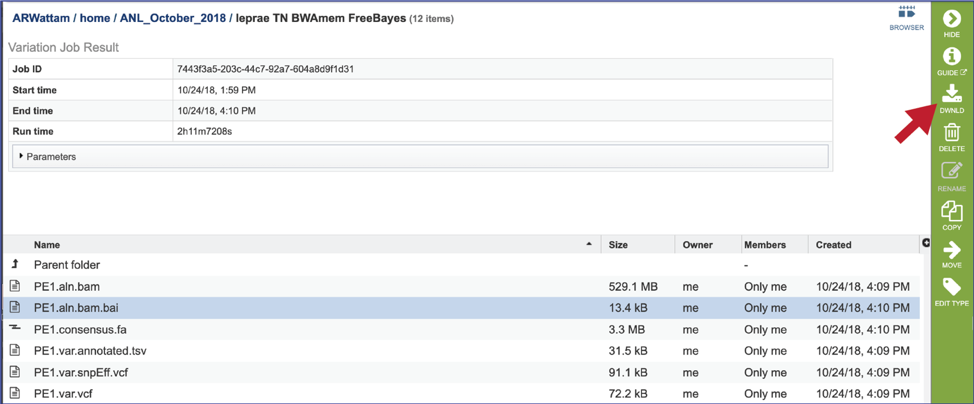

7. **Consensus fasta (consensus.fa)**. This is the sequence of the read files in the order of the reference, so it is basically a reference-based assembly.   It can be downloaded by selecting the row that contains for file and then clicking on the Download icon in the vertical green bar.  Or it could be used in the annotation service. 
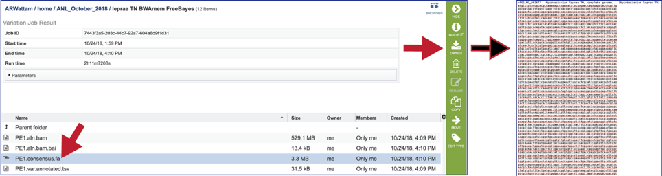

8. **Tab Separated Values (tsv)**. The BV-BRC variant analysis service provides a .tsv file for each of the read libraries that were loaded. This file summaries the locations of the variants, shows the nucleotide change, and identifies if it was a synonymous or nonsynonymous substitution, or an indel. It also identifies the gene, or intergenic region, where the variation occurred.  The list below shows the title and information about each column in the tsv file, from left to right. 
    * Samples - internal library read name. The corresponding user library read name can be found in libs.txt
    * Contig - contig name
    * Pos - position of the variation
    * Ref - reference nucleotide(s) at the variation position
    * Var - variant nucleotide(s) at the variation position
    * Score - quality score from the variant caller tool
    * Var_cov - variant coverage (the average read depth of the variant)
    * Var_frac - variant fraction (the fraction of the variant read depth among the all the reads that cover this region)
    * Type - variant type
    * Ref_nt - reference nucleotide(s)
    * Var_nt - variant nucleotide(s)
    * Ref_nt_pos_change - nucleotide change
    * Ref_aa_pos_change - amino acid change
    * Frameshift - frameshift variant
    * Gene_ID – BV-BRC feature (peg) id
    * Locus_tag - RefSeq locus tag
    * Gene_name - gene name
    * Function - function description
    * Upstream_feature - upstream feature
    * Downstream_feature - downstream feature
    * snpEff_type - snpEFF variant type
    * snpEff_impact - snpEFF variant impact

9. The tsv file can be viewed by selecting the row that contains for file and then clicking on the View icon in the vertical green bar.  
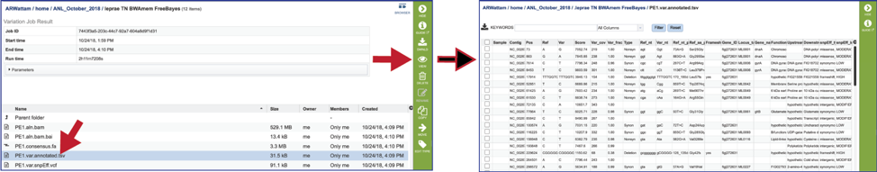

10.	The **var.snpEFF.vcf** files. The Variant Call Format (VCF) is a flexible and extendable line-oriented text format developed by the 1000 Genomes Project for releases of single nucleotide variants, indels, copy number variants and structural variants discovered by the project.  

SnpEff[6] rapidly categorizes the effects of variants in genome sequences. Once a genome is sequenced, SnpEff annotates variants based on their genomic locations and predicts coding effects. Annotated genomic locations include intronic, untranslated region, upstream, downstream, splice site, or intergenic regions. Coding effects such as synonymous or non-synonymous amino acid replacement, start codon gains or losses, stop codon gains or losses, or frame shifts can be predicted. The BV-BRC variant analysis service provides a var.snpEFF.vcf file for each of the read libraries that were loaded. It can be downloaded by selecting the row that contains for file and then clicking on the **Download** icon in the vertical green bar. 
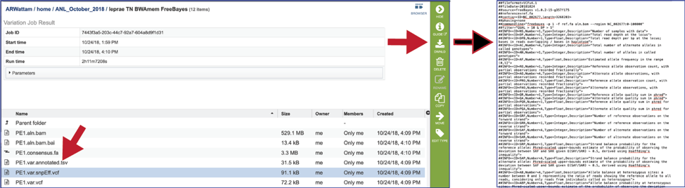

11.	The **var.vcf** files. These files show the location of the snp on the genome. The BV-BRC variant analysis service provides a var.vcf file for each of the read libraries that were loaded, an example of which is shown below. It can be downloaded by selecting the row that contains for file and then clicking on the Download icon in the vertical green bar. 
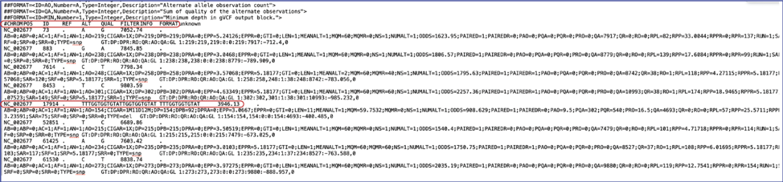

12.	The **var.vcf.gz** file is a zipped file of the vcf file.  It is available for download but is best viewed in the genome browser.  This functionality will be discussed below. 
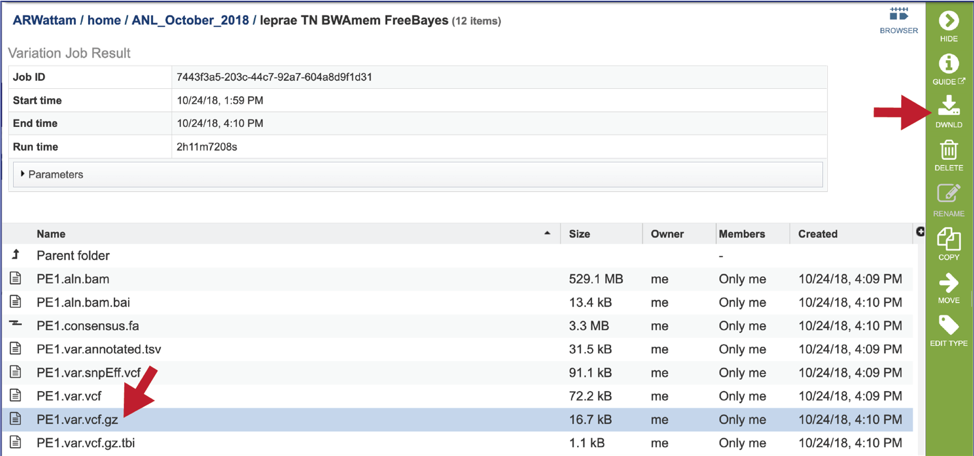

13.	The **var.vcf.gz.tbi** file is generated for each read set.  It is an indexed file used by a genome browser to load the vcf.gz file.  It is available for download. 
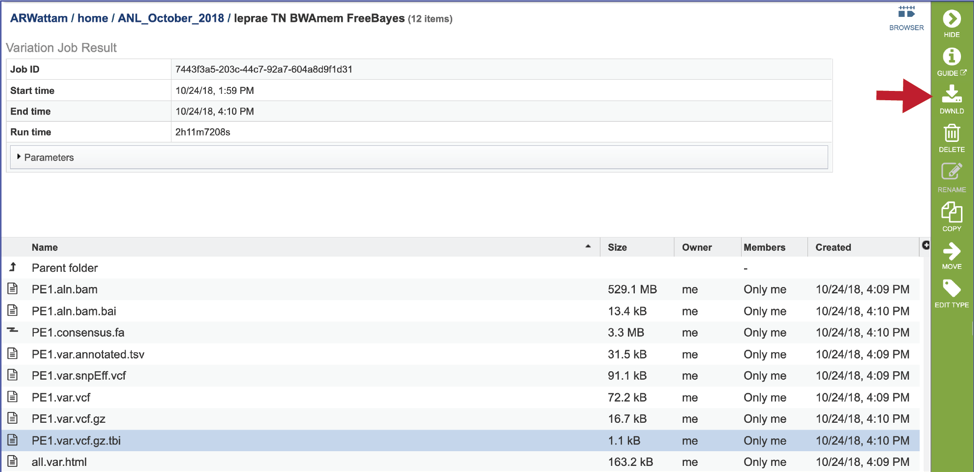

14.	The **.html** file. The HyperText Markup Language (HTML) file will open a webpage that shows the same data available in the .tsv file.  This file can be viewed in this window by clicking on the View icon or downloaded and viewed in your browser. 
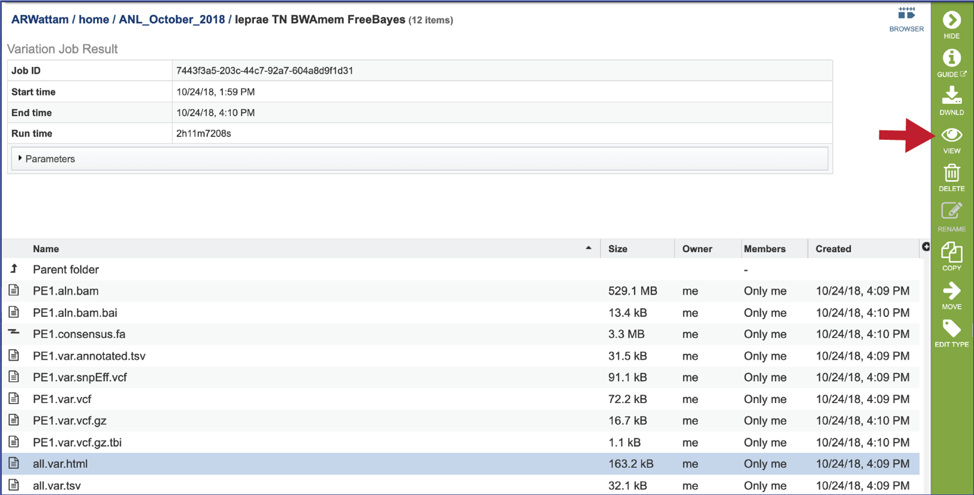

15.	After clicking on the View icon, the page will reload to how the tsv table that is described above.  A description of each of the columns is provided above in the **Tab Separated Value (tsv)** section. 

16. **Tab Separated Values (tsv)**. The BV-BRC variant analysis service provides a .tsv file for each of the read libraries that were loaded. It summaries the locations of the variants, shows the nucleotide change, and identifies if it was a synonymous or nonsynonymous substitution, or an indel. It also identifies the gene, or intergenic region, where the variation occurred. It can be viewed by selecting the row that contains for file and then clicking on the **View** icon in the vertical green bar.  
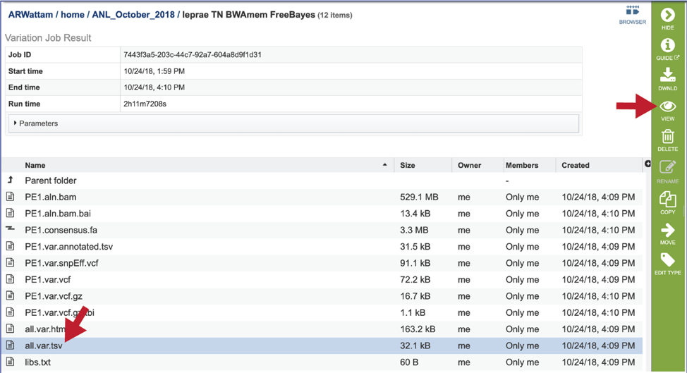

17.	Clicking on the View icon will reload the page to show the **tsv** file.  A description of each of the columns is provided above in the **Tab Separated Value (tsv)** section.
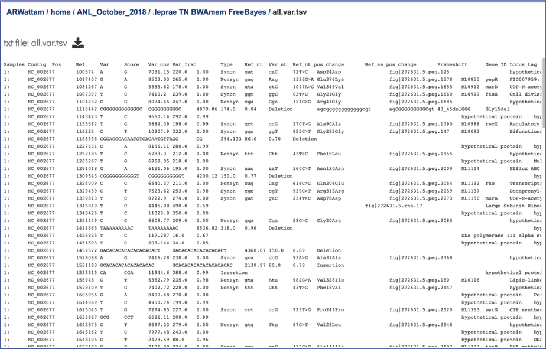
 
18.	The **libs.txt** file. This is a text file that describes the libraries used in the comparison.  It can be viewed by selecting the row that contains for file and then clicking on the **View** icon in the vertical green bar. 
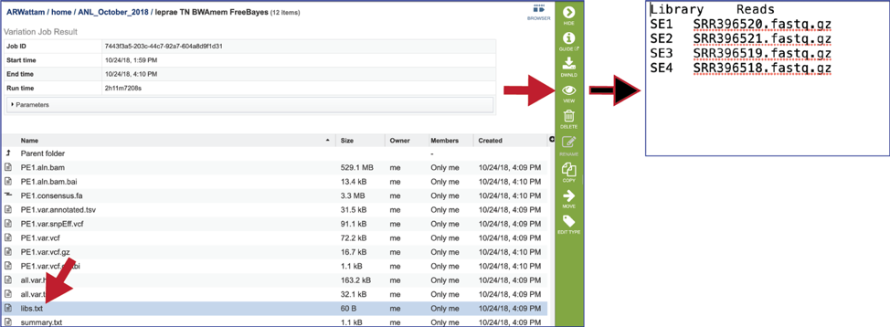

19.	The **summary.txt** files. This file provides a summary of the analysis. For each library it shows the number of reads, those that mapped to the reference, the number of bases in the reference, the median base coverage, bases with zero coverage, bases with less than (or equal to) 10 reads coverage, the raw variants that are detected by the variation calling tool, and those variants that have a high quality score. It can be viewed by selecting the row that contains for file and then clicking on the **View** icon in the vertical green bar. 
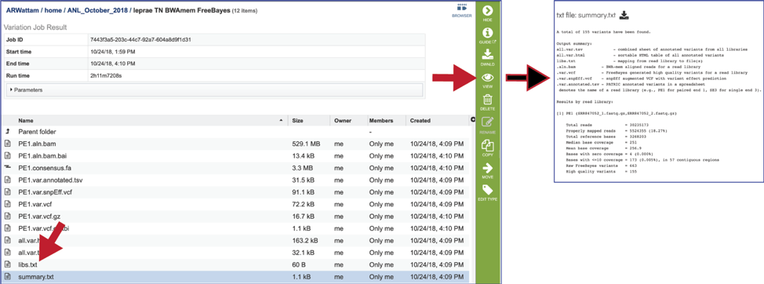

## Viewing SNPs on the genome browser

1. To see the genome browser, where the results of the variation job can be summarized, click on the Browser icon that is visible in the upper right corner of the page. 
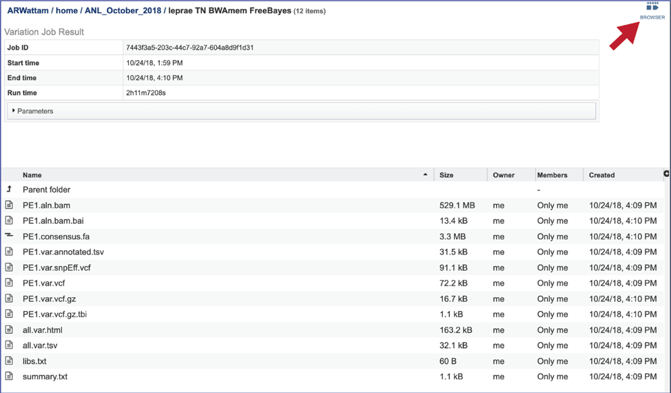

2. This will open the genome browser for the genome that was selected as the reference. There is a box on the left of the browser that shows the available tracks. 
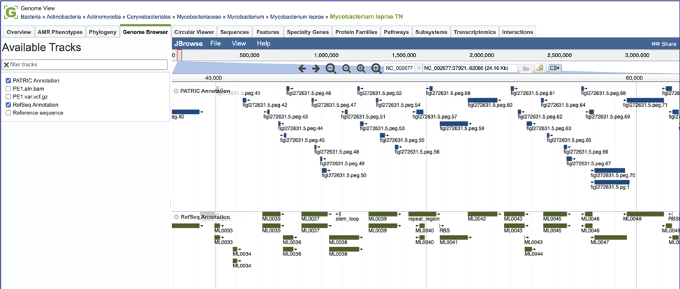

3. You will need to zoom in and see the bam file, which contains a lot of data.  Find the magnifying glass icons immediately above the browser. Click on the one that has a plus side in it.  This will need to be clicked several times before a bam file can load. Incidentally, after several clicks of the magnifying icon, the six-frame translation and nucleotides will be visible. 
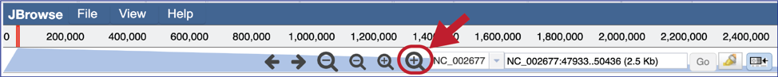

4. To see the how predictive the individual calls are, click on the track that ends in **aln.bam**. 
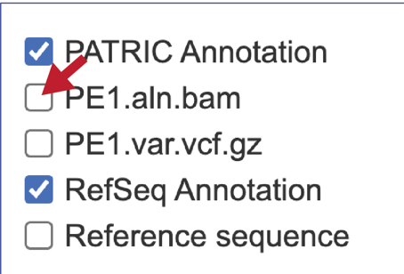

5. This will show the individual reads. Blue indicates reads on the forward strand, and red show the reads on the reverse strand. 
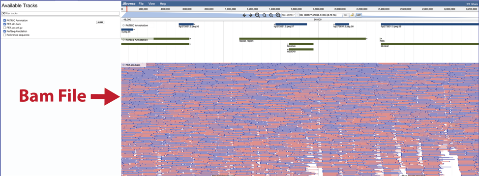

6. To see the value of individual reads, click on a single one.  This will open a pop-up window that shows the data associated with that selected read. 
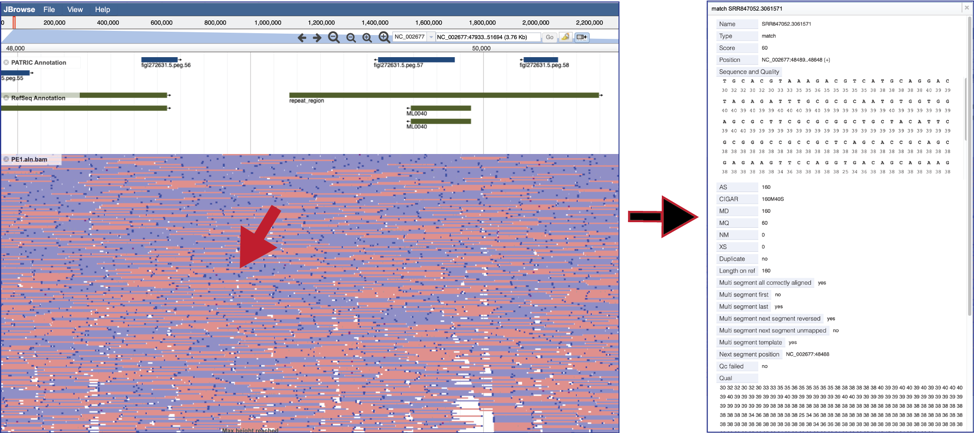

7. To see the location of the particular SNPs, MNPs or indels, click on the check boxes before in front of the names that end in **var.vcf.gz**.  This will add tracks below the annotation tracks that show the snps that were called, although scrolling down the length of the genome may be required to see them. 
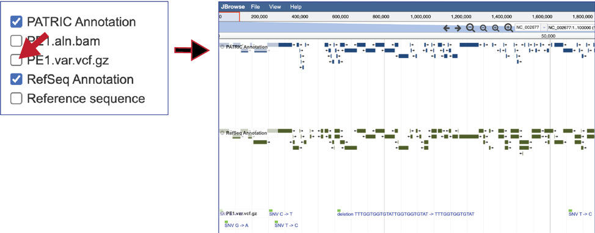

8. To see the value of individual vcf calls, click on a single one. This will open a pop-up window that shows the data associated with that selected read.
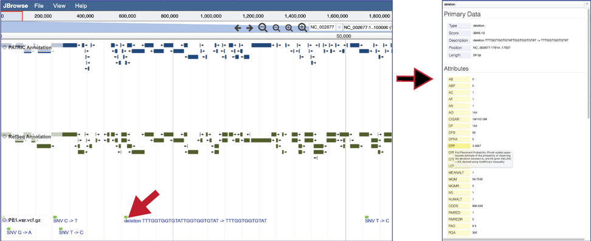

## References

1. Li, H., Aligning sequence reads, clone sequences and assembly contigs with BWA-MEM. arXiv preprint arXiv:1303.3997, 2013.
2. Langmead, B. and S.L. Salzberg, Fast gapped-read alignment with Bowtie 2. Nature methods, 2012. 9(4): p. 357.
3. Frith, M.C., M. Hamada, and P. Horton, Parameters for accurate genome alignment. BMC bioinformatics, 2010. 11(1): p. 1-14.
4. Marth, G.T., et al., A general approach to single-nucleotide polymorphism discovery. Nature genetics, 1999. 23(4): p. 452-456.
5. Li, H., et al., The sequence alignment/map format and SAMtools. Bioinformatics, 2009. 25(16): p. 2078-2079.
6. Cingolani, P., et al., A program for annotating and predicting the effects of single nucleotide polymorphisms, SnpEff: SNPs in the genome of Drosophila melanogaster strain w1118; iso-2; iso-3. Fly, 2012. 6(2): p. 80-92.

