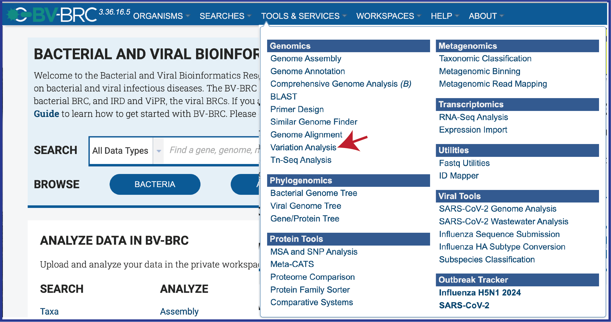
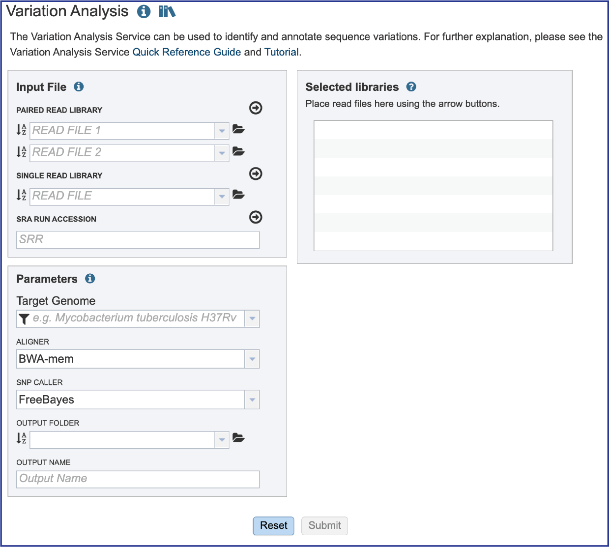
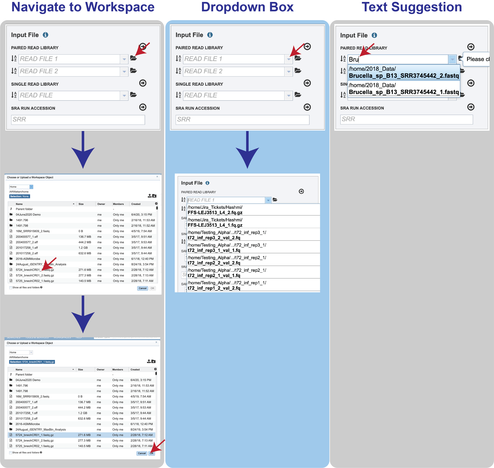
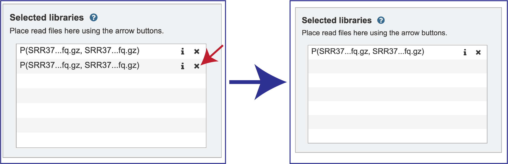
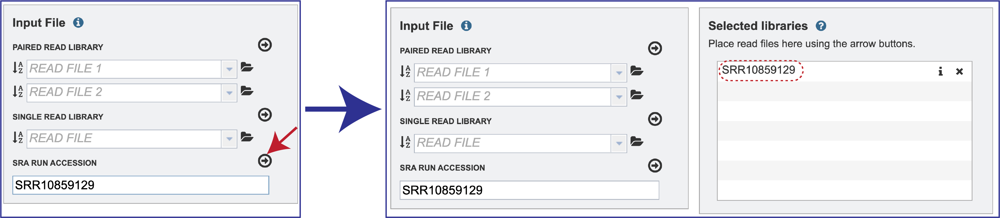
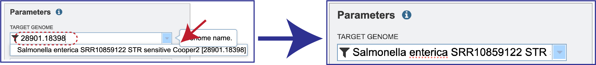
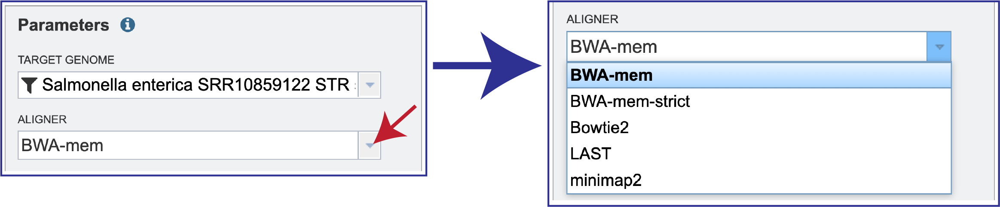
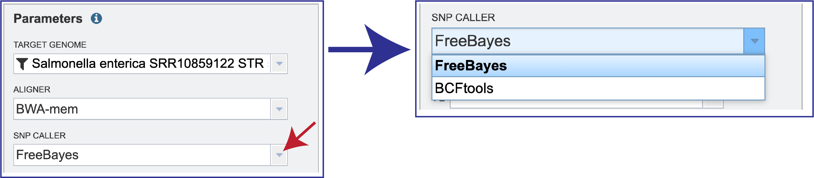
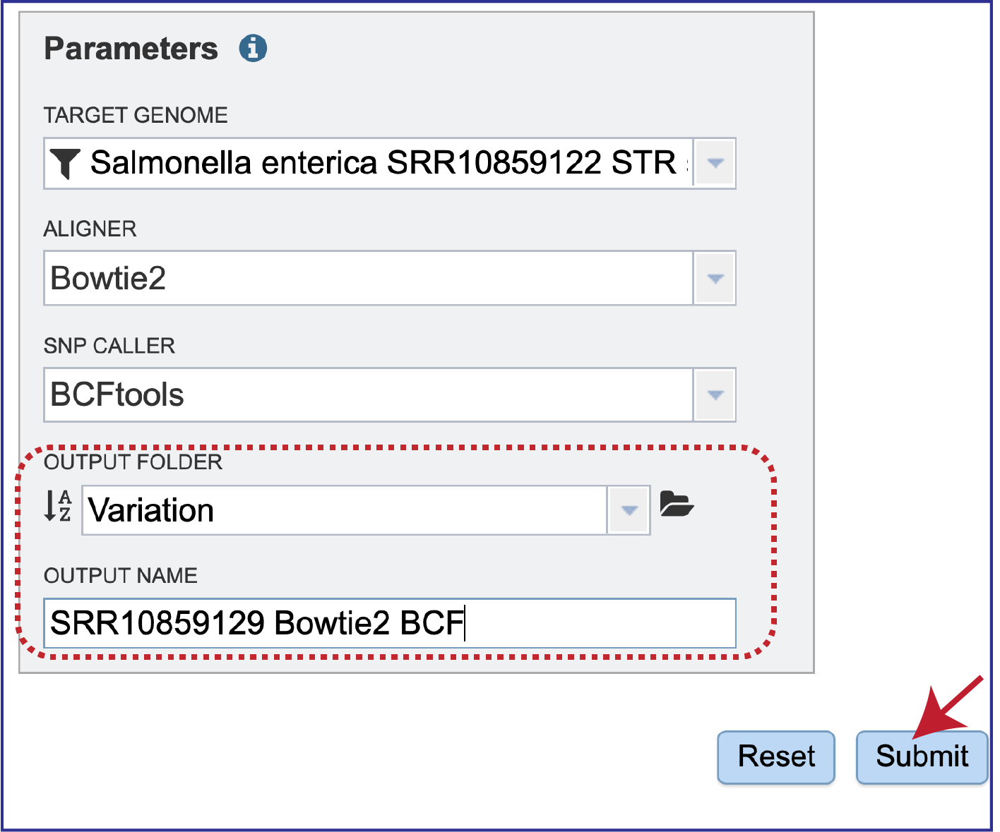
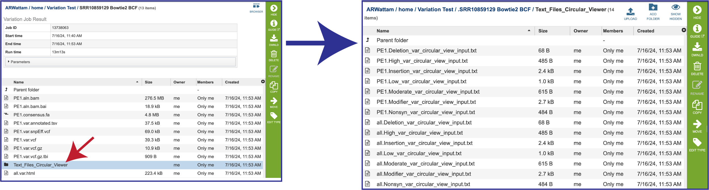

# Variation - SNP Analysis Service

*Revised: 02 August 2024*

SNP genotyping is the measurement of genetic variations of single nucleotide polymorphisms (SNPs) between members of a species. It is a form of genotyping, which is the measurement of more general genetic variation. SNPs are one of the most common types of genetic variation. A SNP is a single base pair mutation at a specific locus, usually consisting of two alleles. SNP calling requires the reads of target isolates and a reference genome as input and execute an external mapping tool and variant caller, followed by some filtering steps to remove low-quality SNPs. The BV-BRC Variation Analysis Service can be used to identify and annotate sequence variations, including SNPs, SNVs (a variation of a single nucleotide in a population’s genome), and indels (insertion or deletion of bases).

Nucleotide substitutions during DNA replication of bacteria, with mutation rates of approximately 10(−9) changes per nucleotide per generation, are important biologically informative markers in bacteria.  They may fall within coding sequences of genes, non-coding regions of genes, or in the intergenic regions (regions between genes).  SNPs in coding regions can be synonymous or nonsynonymous.  Synonymous substitutions by definition do not result in a change of amino acid in the protein, whereas nonsynonymous substitutions do change the sequence.  

### See also
* [Variation Analysis Service](https://bv-brc.org/app/Variation)
* [Variation Analysis Service Quick Reference Guide](/quick_references/services/variation_analysis_service)

## Locating the Variation Analysis Service

1.	Click on the Services tab at the top of the page and then click on Variation. 

2.	This will open the landing page for the service. 

## Read files for target isolates

### Submitting sequencing reads (single or paired)
The service accepts both single and paired reads.  Paired read libraries are usually given as file pairs, with each file containing the forward or reverse half of each read pair. Paired read files are expected to be sorted in such a way that each read in a pair occurs in the same Nth position as its mate in their respective files. These files are specified as READ FILE 1 and READ FILE 2. For a given file pair, the selection of which file is READ 1 or READ 2 does not matter.

Reads must first be uploaded to the BV-BRC workspace, and once there, they can be selected in several ways.
1.	Navigate to the workspace by clicking on the Folder icon at the end of the text box.  This will open a pop-up window.  Located the row that has the correct reads, and then click on that.  This will highlight the row.  Click on OK at the bottom of the pop-up box to select the reads.

2.	Clicking on the down arrow at the end of the text box will open a drop-down box that shows the reads that have been selected most recently (top of list) to less frequently (down).  Clicking on the row that has the correct read will select those reads.
3.	Beginning to type the name of the read in the text box will open a drop-down box that shows reads matching that text.  Clicking on the row that has the correct read will select those reads.
4.	Multiple read pairs or single reads can be analyzed, but they must first be moved to the **Selected Libraries** box. Click on the **arrow** to the right of the selected reads.  This will move the file into the **Selected Libraries** box.

5.	Clicking on the information icon (**i**) will open a pop-up window that shows the reads selected, as well as where they are located in the workspace.

6.	6.	Note that there is an **S** or **P** preceding the reads designates if they are single or paired.  Reads can be removed by clicking on the **X** at the end of the row where they are listed.

### Submitting reads from the Sequence Read Archive (SRA)
BV-BRC also supports analysis of existing datasets from SRA. If users submit SRA values, the BV-BRC will input the corresponding FASTQ files to the service. 
1.	To submit this type of data, locate the Run Accession number and copy it.

2.	Paste the copied accession number in the text box underneath SRA Run Accession, then click on the icon of an **arrow within a circle**. This will generate a dialog box above the text box that indicates that the service is validating the run number with SRA.  Once the verification is complete, the number will appear in the **Selected Libraries** box.

## Setting Parameters 
1.	A reference genome needs to be selected.  This genome must be in BV-BRC.  Enter the unique genome ID into the text box underneath **Target Genome**. This opens a drop-down box underneath the text box.  Click on the name.  This will autofill the text box with the name of the genome.

3. BV-BRC offers several types of **aligners** that can be used in the service. BWA-mem is set as the default aligner, but there are several options. 
    * **BWA-mem**[1,2] is an alignment algorithm for aligning sequence reads or long query sequences against a large reference genome such as human. It automatically chooses between local and end-to-end alignments, supports paired end reads and performs chimeric alignment. The algorithm is robust to sequencing errors and applicable to a wide range of sequence lengths from 70bp to a few megabases. BWA-MEM is implemented as a component of BWA, which is available at https://github.com/lh3/bwa.
    * **BWA-mem-strict** is BWA-mem with the default parameters plus “-B9 -O16” to increase the gap extension and clipping penalty. These strict mapping parameters are recommended for cases where contigs and references are known to be very close to each other.
    * **Bowtie2**[3] improves on the previous Bowtie method in terms of speed and fraction of reads aligned and is substantially faster than non–full-text minute index–based approaches while aligning a comparable fraction of reads. Bowtie 2 performs sensitive gapped alignment without incurring serious computational penalties. The code for Bowtie2 is available at https://github.com/BenLangmead/bowtie.
    * **Minimap2**[4] is widely used for mapping long sequence reads and assembly contigs.  The new version can more accurately map long reads to highly repetitive regions and align through insertions or deletions up to 100 kb by default.  Minimap2 is available at https://github.com/lh3/minimap2?tab=readme-ov-file.
    * **LAST**[5] is a long read sequence aligner. It can align billions of DNA reads to a genome and will indicate reliability of each aligned column. In addition, it can compare DNA to proteins, with frameshifts, compare PSSMs to sequences, calculates the likelihood of chance similarities between random sequences, does split and spliced alignment, and can be trained for unusual kinds of sequences (like nanopore).  The code for Last is available at https://gitlab.com/mcfrith/last.

4. To see the other choices of aligners that can be used, click on the down arrow at the end of the **Aligner** text box. This will open a drop-down box that shows all the available programs. Clicking on the desired aligner will autofill the text box with that selection. 

5. BV-BRC also offers a choice of **SNP callers**. The default selection is for FreeBayes, but SAMtools is another option.
   * **FreeBayes**[6] is an accurate method for sequence organization that includes fragment clustering, paralogue identification and multiple alignment. It calculates the probability that a given site is polymorphic and has an automated evaluation of the full length of all sequences, without limitations on alignment depth. The code for FreeBayes is available at https://github.com/freebayes/freebayes.
   * **The Sequence Alignment/Map (SAM)** format is a generic alignment format for storing read alignments against reference sequences. SAMtools[7] implements various utilities for post-processing alignments in the SAM format, such as indexing, variant caller and alignment viewer, and thus provides universal tools for processing read alignments. The SAMtools option invokes the BCFtools’ SNP calling algorithm on top of SAMtools’ mpileup result. . It has been restructured into the BCFtools subpackage[8].  The SAMtools option invokes the BCFtools’ SNP calling algorithm on top of SAMtools’ mpileup result. The code for SAMtools is available at http://www.htslib.org/.

6. To see the available choices, click on the down arrow that follows the **SNP Caller** text box. This will open a drop-down box that shows all the available programs. Either SNP caller is run with the default parameters. The raw SNPs are then filtered by SNP quality (QUAL>10) and read depth (DP>5) to keep only the high-quality SNPs. Clicking on the desired aligner will autofill the text box with that selection. 

7. The variation job must be placed in an **Output Folder**, and it needs an **Output Name**. After selecting a folder and assigning a name, the **Submit** button will turn blue.  Click on it to submit the job.

8.	If the job was submitted successfully, a message will appear that indicates that the job has entered the queue. To check the status of the variation job, click on the Jobs indicator at the bottom of the BV-BRC page. 

## Monitoring progress on the Jobs page

1. Click on the Jobs box at the bottom right of any BV-BRC page. 

2. This will open the Jobs Landing page where the status of submitted jobs is displayed. 

## Viewing the Variation job results

1. To view a particular job, click on a row to select it. Once selected, the downstream processes available for the selection appear in the vertical green bar.  Clicking on the View icon will open the variant analysis job summary. 

2. This will rewrite the page to show the information about the variation job, and all of the files that are produced when the pipeline runs.  

3. The information about the job submission can be seen in the table at the top of the results page.  To see all the parameters that were selected when the job was submitted, click on the **Parameters** row. 

4. This will show the information on what was selected when the job was originally submitted. 

5. **Bam files**. The Binary Alignment/Map (BAM) is the companion format of the Sequence Alignment/Map (SAM) format[7]. A SAM file (.sam) is a tab-delimited text file that contains sequence alignment data. The bam format is compact in size and supports fast retrieval of alignments in specified regions. It is optimal for viewing in a genome browser. The BV-BRC variant analysis service provides a .bam file for each of the read libraries that were loaded.  These can be downloaded by selecting the row that contains that file and then clicking on the **Download** icon in the vertical green bar.  BV-BRC also provides a direct view of the bam file by clicking on **Browser** icon at the top right of the job page.  Viewing the data on the browser will be discussed below. 

6. **Bam.bai files**. A bai file is a companion to the bam file which contains the index. These are files that are used by a genome browser.  They can be downloaded by selecting the row that contains for file and then clicking on the **Download** icon in the vertical green bar.  

7. **Consensus fasta (consensus.fa)**. This is the sequence of the read files in the order of the reference, so it is basically a reference-based assembly.   It can be downloaded by selecting the row that contains for file and then clicking on the **Download** icon in the vertical green bar.  Or it could be used in the annotation service. 

8. **Tab Separated Values (tsv)**. The BV-BRC variant analysis service provides a .tsv file for *each of the read libraries* that were loaded. This file summaries the locations of the variants, shows the nucleotide change, and identifies if it was a synonymous or nonsynonymous substitution, or an indel. It also identifies the gene, or intergenic region, where the variation occurred.  The list below shows the title and information about each column in the tsv file, from left to right. 
    * **Samples** - internal library read name. The corresponding user library read name can be found in libs.txt
    * **Contig** - contig name
    * **Pos** - position of the variation
    * **Ref** - reference nucleotide(s) at the variation position
    * **Var** - variant nucleotide(s) at the variation position
    * **Score** - quality score from the variant caller tool
    * **Var_cov** - variant coverage (the average read depth of the variant)
    * **Var_frac** - variant fraction (the fraction of the variant read depth among the all the reads that cover this region)
    * **Type** - variant type
    * **Ref_nt** - reference nucleotide(s)
    * **Var_nt** - variant nucleotide(s)
    * **Ref_nt_pos_change** - nucleotide change
    * **Ref_aa_pos_change** - amino acid change
    * **Frameshift** - frameshift variant
    * **Gene_ID** – BV-BRC feature (peg) id
    * **Locus_tag** - RefSeq locus tag
    * **Gene_name** - gene name
    * **Function** - function description
    * **Upstream_feature** - upstream feature
    * **Downstream_feature** - downstream feature
    * **snpEff_type** - snpEFF variant type
    * **snpEff_impact** - snpEFF variant impact

9. The **tsv** file can be viewed by selecting the row that contains for file and then clicking on the **View** icon in the vertical green bar.  

10.	The **var.snpEFF.vcf** files. The Variant Call Format (VCF) is a flexible and extendable line-oriented text format developed by the 1000 Genomes Project for releases of single nucleotide variants, indels, copy number variants and structural variants discovered by the project. SnpEff[9] rapidly categorizes the effects of variants in genome sequences. Once a genome is sequenced, SnpEff annotates variants based on their genomic locations and predicts coding effects. Annotated genomic locations include intronic, untranslated region, upstream, downstream, splice site, or intergenic regions. Coding effects such as synonymous or non-synonymous amino acid replacement, start codon gains or losses, stop codon gains or losses, or frame shifts can be predicted. The BV-BRC variant analysis service provides a var.snpEFF.vcf file for each of the read libraries that were loaded. It can be downloaded by selecting the row that contains for file and then clicking on the **Download** icon in the vertical green bar. 

11.	The impact of individual snps are defined in the snpEff_impact assignment, and are as defined by Cingolani[10].

12.	The **var.vcf** files. These files show the location of the snp on the genome. The BV-BRC variant analysis service provides a var.vcf file for each of the read libraries that were loaded, an example of which is shown below. It can be downloaded by selecting the row that contains for file and then clicking on the Download icon in the vertical green bar. 

13.	The **var.vcf.gz** file is a zipped file of the vcf file.  It is available for download but is best viewed in the genome browser.  This functionality will be discussed below. 

14.	The **var.vcf.gz.tbi** file is generated for each read set.  It is an indexed file used by a genome browser to load the vcf.gz file.  It is available for download. 

15.	The service also generates a number of text files that show the different snp calls, which can be viewed in the circular viewer for the reference genome.  These can be viewed by clicking on the **Text_Files_Circular_Viewer** folder.  This will open a page that shows all the individual text files.  These should be downloaded and then submitted to the circular view.

17.	The **.html** file. The HyperText Markup Language (HTML) file will open a webpage that shows the same data available in the .tsv file.  This file can be viewed in this window by clicking on the View icon or downloaded and viewed in your browser. 

18.	After clicking on the View icon, the page will reload to how the tsv table that is described above.  A description of each of the columns is provided above in the **Tab Separated Value (tsv)** section above. 

19. **Tab Separated Values (tsv)**. The BV-BRC variant analysis service provides a .tsv file for each of the read libraries that were loaded. It summaries the locations of the variants, shows the nucleotide change, and identifies if it was a synonymous or nonsynonymous substitution, or an indel. It also identifies the gene, or intergenic region, where the variation occurred. It can be viewed by selecting the row that contains for file and then clicking on the **View** icon in the vertical green bar.  

20.	Clicking on the View icon will reload the page to show the **tsv** file.  A description of each of the columns is provided above in the **Tab Separated Value (tsv)** section above.

 

21.	The **libs.txt** file. This is a text file that describes the libraries used in the comparison.  It can be viewed by selecting the row that contains for file and then clicking on the **View** icon in the vertical green bar. 

22.	The **summary.txt** files. This file provides a summary of the analysis. For each library it shows the number of reads, those that mapped to the reference, the number of bases in the reference, the median base coverage, bases with zero coverage, bases with less than (or equal to) 10 reads coverage, the raw variants that are detected by the variation calling tool, and those variants that have a high quality score. It can be viewed by selecting the row that contains for file and then clicking on the **View** icon in the vertical green bar. 

## Viewing SNPs on the genome browser

1. To see the genome browser, where the results of the variation job can be summarized, click on the Browser icon that is visible in the upper right corner of the page. 

2. This will open the genome browser for the genome that was selected as the reference. There is a box on the left of the browser that shows the available tracks. 

3. You will need to zoom in and see the bam file, which contains a lot of data.  Find the magnifying glass icons immediately above the browser. Click on the one that has a plus side in it.  This will need to be clicked several times before a bam file can load. Incidentally, after several clicks of the magnifying icon, the six-frame translation and nucleotides will be visible. 

4. To see the how predictive the individual calls are, click on the track that ends in **aln.bam**. 

5. This will show the individual reads. Blue indicates reads on the forward strand, and red show the reads on the reverse strand. 

6. To see the value of individual reads, click on a single one.  This will open a pop-up window that shows the data associated with that selected read. 

7. To see the location of the particular SNPs, MNPs or indels, click on the check boxes before in front of the names that end in **var.vcf.gz**.  This will add tracks below the annotation tracks that show the snps that were called, although scrolling down the length of the genome may be required to see them. 

8. To see the value of individual vcf calls, click on a single one. This will open a pop-up window that shows the data associated with that selected read.

## References

1. Li, H., Aligning sequence reads, clone sequences and assembly contigs with BWA-MEM. arXiv preprint arXiv:1303.3997, 2013.
2. Li, H., Toward better understanding of artifacts in variant calling from high-coverage samples. Bioinformatics, 2014. 30(20): p. 2843-2851.
3. Langmead, B. and S.L. Salzberg, Fast gapped-read alignment with Bowtie 2. Nature methods, 2012. 9(4): p. 357.
4. Li, H., New strategies to improve minimap2 alignment accuracy. Bioinformatics, 2021. 37(23): p. 4572-4574.
5. Frith, M.C., M. Hamada, and P. Horton, Parameters for accurate genome alignment. BMC bioinformatics, 2010. 11(1): p. 1-14.
6. Marth, G.T., et al., A general approach to single-nucleotide polymorphism discovery. Nature genetics, 1999. 23(4): p. 452-456.
7. Li, H., et al., The sequence alignment/map format and SAMtools. Bioinformatics, 2009. 25(16): p. 2078-2079.
8. Danecek, P., et al., Twelve years of SAMtools and BCFtools. Gigascience, 2021. 10(2): p. giab008.
9. Cingolani, P., et al., A program for annotating and predicting the effects of single nucleotide polymorphisms, SnpEff: SNPs in the genome of Drosophila melanogaster strain w1118; iso-2; iso-3. Fly, 2012. 6(2): p. 80-92.
10.	Cingolani, P., Variant annotation and functional prediction: SnpEff, in Variant calling: methods and protocols. 2012, Springer. p. 289-314.
