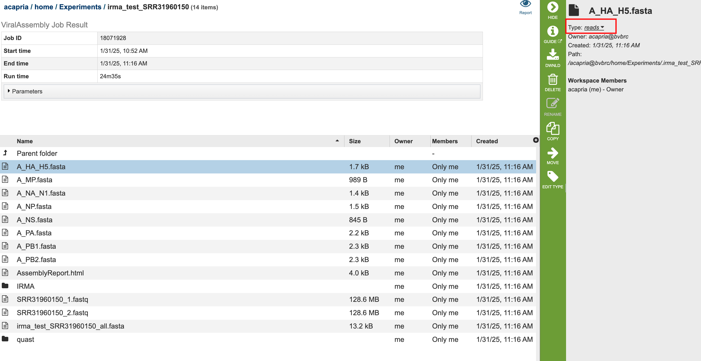
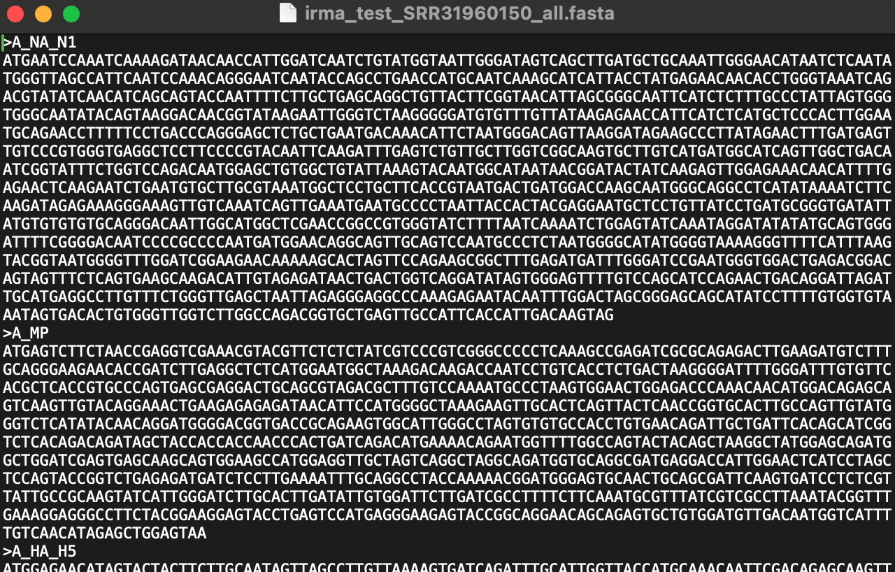

# Viral Genome Assembly Service
*Beta Version: 31 January 2025*

## Overview
The viral Genome Assembly Service allows users to assemble viral genomes utilzing IRMA(1)(currently the BV-BRC tool supports Influenza). Once the assembly process has started by clicking the Assemble button, the genome is queued as a "job" for the Assembly Service to process, and will increment the count in the Jobs information box on the bottom right of the page. Once the assembly job has successfully completed, the output file will appear in the workspace.
This service and tutorial are currently in beta- and will be updated to reflect the tools development. 
A genome assembly is the sequence produced after chromosomes from the organism have been fragmented, those fragments have been sequenced, and the resulting sequences have been put back together. This is currently needed as DNA sequencing technology cannot read whole genomes in one go, but rather can read small pieces of between 20 and 30,000 bases, depending on the technology used. Typically, the short fragments, called reads, result from shotgun (random) sequencing of genomic DNA.

De novo sequence assemblers are a type of program that assembles short nucleotide sequences into longer ones without the use of a reference genome. These are commonly used in bioinformatic studies to assemble genomes or transcriptomes.

What follows is a tutorial showing how to submit reads of various types for assembly and selecting parameters for the assembly algorithm.   

The BV-BRC Viral Genome Assembly service uses an open source, third-part bioinformatics program- IRMA developed by the CDC.

## See also
* [Viral Genome Assembly Service](https://bv-brc.org/app/ViralAssembly)

## Using the Viral Genome Assembly Service
The **Viral Assembly** submenu option under the **Services** main menu (Viral Tools category) opens the Viral Genome Assembly input form, shown below. *Note: You must be logged into BV-BRC to use this service.*

## Options
 

## Read Input File

### Paired read library
**Read File 1 & 2:**  Many paired read libraries are given as file pairs, with each file containing half of each read pair. Paired read files are expected to be sorted such that each read in a pair occurs in the same Nth position as its mate in their respective files. These files are specified as READ FILE 1 and READ FILE 2. For a given file pair, the selection of which file is READ 1 and which is READ 2 does not matter.

### Single read library
**Read File:** The fastq file containing the reads.

### SRA run accession
Allows direct upload of read files from the [NCBI Sequence Read Archive](https://www.ncbi.nlm.nih.gov/sra) to the BV-BRC Assembly Service. Entering the SRR accession number and clicking the arrow will add the file to the selected libraries box for use in the assembly.

## Files accepted by BV-BRC Assembly Service

The assembly service accepts read files in either fastq, fasta, fastq.gz, or fasta.gz format. 

**FASTQ** is a text-based format for storing both a nucleotide sequence and its corresponding quality scores. Both the sequence letter and quality score are each encoded with a single ASCII character.  A FASTQ file normally uses four lines per sequence:
* Line 1 begins with a ‘@’ character and is followed by a sequence identifier and an optional description (like a FASTA title line).
* Line 2 is the raw sequence letters.
* Line 3 begins with a ‘+’ character and is optionally followed by the same sequence identifier (and any description) again.
* Line 4 encodes the quality values for the sequence in Line 2 and must contain the same number of symbols as letters in the sequence.

**FASTA** is a text-based format for representing either nucleotide sequences or amino acid (protein) sequences using single-letter codes. The format allows for sequence names and comments to precede the sequences. A **FASTA read file** has two parts: 
* Line 1 begins with a ‘>’.  Everything from the beginning ‘>’ to the first whitespace is considered the sequence identifier. Everything after that is considered the sequence description (this can be metadata, machine serial number, read orientation, etc.), all in a single line.
* Line 2 has the sequence, which can span multiple lines depending on the length.

What follows below is a tutorial showing how to submit reads of various types for assembly and selecting parameters for the assembly algorithm.  Note that reads from different sequencing platforms of the same organism can be submitted in one job.  If long and short reads are available for the same isolate, both could be combined to generate the best assembly using Unicycler, Canu or Flye.

## Creating a folder to hold the assembly job and related data

1.	It is always good practice to create a folder to keep the results from a particular experiment or project in order.  To create a new folder, go to the **Workspaces** tab and click on **home**.

2.	This will open the home directory on your workspace.  To create a new folder, click on the **Add Folder** icon at the top right of the table.

3.	This will open a pop-up window.  Note that the **Create Folder** button is greyed out.  Type the desired name in the text box.

4.	Once the name is entered, the **Create Folder** icon will turn blue.  To create the folder, click on that button.

5.	The pop-up window will disappear.  At the button left of the page you will see a temporal message indicating that the folder was successfully created.

## Locating the Assembly Service App

1.	At the top of any BV-BRC page, find the **Tools & Services** tab and click on it.

2.	In the drop-down box, underneath **Viral Tools**, click on **Viral Assembly**.

3.	This will open up the Assembly landing page where researchers can submit single or paired read files, a combination of the two, and/or an SRA run accession number to the service.

### Uploading paired end reads

1.	To upload a fastq file that contains paired reads, locate the box called **Paired read library**. 

2.	The reads must be located in the workspace. To initiate the upload, first click on the **Folder** icon. 

3.	This opens up a window where the files for upload can be selected. Click on the icon with the **Arrow** pointing up. 

4.	This opens a new window where the file you want to upload can be selected. Click on the **Select File** in the blue bar. 

5.	This will open a window that allows you to choose files that are stored on your computer. Select the file where you stored the fastq file on your computer and click **Open**.  

6.	Once selected, it will autofill the name of the file. Click on the **Start Upload** button. 

7.	This will auto-fill the name of the document into the text box.  

8.	Pay attention to the **Upload Monitor** in the lower right corner of the BV-BRC page. It will show the progress of the upload. Do not submit the job until the upload is 100% complete.
   

9.	Repeat to upload the second pair of reads.

10.	To finish the upload, click on the icon of an **Arrow within a circle**. This will move your file into the **Selected libraries** box. You can submit more than one set of paired reads if appropriate.

### Uploading single reads

1.	To upload a fastq file that contains single reads, locate the text box called **Single read library**. If the reads have previously been uploaded, click the down arrow next to the text box below **Read File**. 

2.	This opens up a drop-down box that shows the all the reads that have been previously uploaded into the workspace. Click on the name of the reads of interest.

3.	This will auto-fill the name of the file into the text box.

4.	To finish the upload, click on the icon of an **Arrow within a circle**. This will move the file into the **Selected libraries** box. You can submit more than one set of long reads if appropriate.  You can submit both short and long reads to generate a hybrid assembly.

### Submitting reads that are present at the Sequence Read Archive (SRA)

1.	BV-BRC also supports analysis of existing datasets from SRA. To submit this type of data, locate the **Run Accession number** that you will find at SRA and copy it.

2.	Paste the copied accession number in the text box underneath **SRA Run Accession**, then click on the icon of an **Arrow within a circle**.  This will move the file into the **Selected libraries** box. You can submit more than one SRA run number if appropriate.

## Parameters

**Assembly Strategy:**
  * IRMA - IRMA is currently the only viral assembly tool. Any other tool can be recommended or requested. 

## Setting Parameters

1.	The assembly strategy for the reads must be selected.  Clicking on the down arrow that follows the text box under **Assembly Strategy** will open a drop-down box that shows all the strategies that BV-BRC offers.  A description of each strategy is listed below. Clicking on one of the strategies will autofill the text box with that selection: 

2.	An output folder must be selected for the assembly job.  Typing the name of the folder in the text box underneath the words **Output Folder** will show a drop-down box that shows close hits to the name, and clicking on the arrow at the end of the box will open a drop-down box that shows the most recently created folders.  To find a previously created folder, or to create a new one, click on the **Folder** icon at the end of the text box.  This will open a pop-up window that shows all the previously created folders.

3.	Click on the desired folder, and then click the **OK** button in the lower right corner of the window.

4.	A name for the job must be included prior to submitting the job.  Enter the name in the text box underneath the words **Output Name**.

## Submitting the Assembly Job

1.	Once reads are in the Selected libraries and all the parameters have been selected, the **Assemble** button at the bottom of the page will turn blue.  The assembly will be submitted once this button is clicked.

2.	A message will appear at the bottom of the page, indicating that the submitted job has entered the BV-BRC queue.

### Monitoring progress on the Jobs page
1.	Clicking on the **Jobs** box at the bottom right of any BV-BRC page/

2.	This will open the Jobs Landing page where the status of submitted jobs is displayed.

## Viewing and Interpreting the Assembly Job Results
1.	On the jobs page, click on the row that has the assembly of interest. This will populate the vertical green bar on the right with possible downstream steps, which include viewing the results of the job, or reporting an issue that was experienced (like a job failure).  Click on the **View** icon.

2.	This will rewrite the page to show the information about the assembly job, and all of the files that are produced when the pipeline runs.  

3.	The information about the job submission can be seen in the table at the top of the results page.  To see all the parameters that were selected when the job was submitted, click on the **Parameters** row.

4.	This will show the information on what was selected when the job was originally submitted.

### Genome Assembly Report

1.	The Genome Assembly report contains valuable information about the assembly, including the number of contigs. Clicking on the row that contains the number of contigs, depth and coverage.  **AssemblyReport.html** will highlight it in blue and populate the action bar with possible downstream steps.  Click on the **View** icon.

2.	Scrolling down will reveal a **Quast report** [14], which is also included in the Genome Assembly report. Quast is a quality assessment tool for evaluating and comparing genome assemblies, and shows statistics of the contigs generated in the assembly.  

### Contig file

1.	The whole point of the assembly service is the generation of a contig file from the submitted reads.  The contig file can be used in downstream services.  Note that the file, which can be clicked on from the Jobs page, has the type matched as “contigs” in the information panel beyond the green bar.  The contig file can be used as is in BV-BRC or downloaded for use in other resources or pipelines.

2.	Once the contig file is downloaded, it can be opened for viewing in a text file on the computer.

3.	Opening the contigs file will show the contigs, each of which begin with a “>” and includes the length, coverage and normalized coverage statistics on the first row. Coverage means the average number of original reads that align to each position of the contig. The normalized coverage has a mean of 1.0 and helps identify contigs of unusually high or low coverage.  When both long and short reads are combined in a “hybrid assembly”, separate coverage statistics are provided for the two read categories. The sequence for the contig starts on the second row. 

### Other Assembly job report files

1.	While the Quast report is included in the Genome Assembly report, a separate, downloadable format is provided as an html.  When the **quast_report.html** is downloaded and opened, details on the assembly including the **Cumulative length** per contig is provided. The cumulative length plot shows the number of bases in the first x contigs, as x varies from zero to the number of contigs.

2.	Clicking on **Nx** shows the percentage of bases on each of the contigs.

3.	Clicking on **GC content** shows the total number of G and C nucleotides in the assembly, divided by the total length of the assembly.

4.	The Quast Folder has lots of good data to be further analyzed.
5.	The IRMA Folder includes the logs and files generated via IRMA.

 
**Virus Genome** For the first round of Beta testing only FLU is available. Other IRMA modules will be added in subsequent releases. 

**Output Folder:** The workspace folder where results will be placed.

**Output Name:** User-provided name used to uniquely identify results.

## Buttons

**Reset:** Clicking this button resets the input form to default values

**Assemble:** Clicking this button launches the assembly job.

## Output Results

The Genome Assembly Service generates several files that are deposited in the Private Workspace in the designated Output Folder. These include

* **assembly_graph.gfa.** - File used to generate the assembly graph plot.
* **assembly_graph.plot.svg** - Image file containing assembly graph shown as a Bandage plot.
* **assembly_report.html** - Web-viewable report of the assembly including information about the submitted reads and assembly process used.
* **contigs.fasta** - File containig contigs for best assembly.
* **p3_assembly.log** - Log file providing steps used in the assembly.
* **quast_report.html** - Web-viewable Quast-generated report providing evaluation information, summary tables, and plots regarding the assembly.
* **quast_report.txt** - Text version of the Quast report.
* **run_details.json** - Json-formatted file containing information about the assembly process.
* **unicycler.log** - Log file generated by the Unicycler assembly .
* **p3x-assembly.stderr** - Standard error file generated by the assembly job process.
* **p3x-assembly.stdout** - Standard output file generated by the assembly job process.

### Action buttons
After selecting one of the output files by clicking it, a set of options becomes available in the vertical green Action Bar on the right side of the table.  These include

* **Hide/Show:** Toggles (hides) the right-hand side Details Pane.
* **Guide:** Link to the corresponding Quick Reference Guide.
* **Download:**  Downloads the selected item.
* **View:** Displays the content of the file, typically as plain text or rendered html, depending on filetype.
* **Delete:** Deletes the file.
* **Rename:** Allows renaming of the file.
* **Copy:** Copies the selected items to the clipboard.
* **Move:** Allows moving of the file to another folder.
* **Edit Type:** Allows changing of the type of the file in terms of how BV-BRC interprets the content and uses it in other services or parts of the website.  Allowable types include unspecified, contigs, nwk, reads, differential expression input data, and differential expression input metadata.

More details will be available in the upcoming Quick Reference Guide.

References
Gurevich, A., et al., QUAST: quality assessment tool for genome assemblies. Bioinformatics, 2013. 29(8): p. 1072-1075.
Shepard, S.S., Meno, S., Bahl, J. et al. Viral deep sequencing needs an adaptive approach: IRMA, the iterative refinement meta-assembler. BMC Genomics 17, 708 (2016). https://doi.org/10.1186/s12864-016-3030-6

-----------
