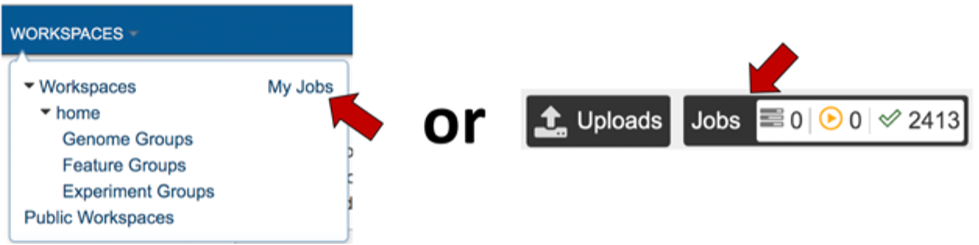
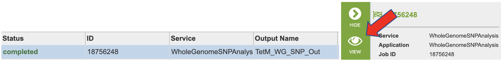
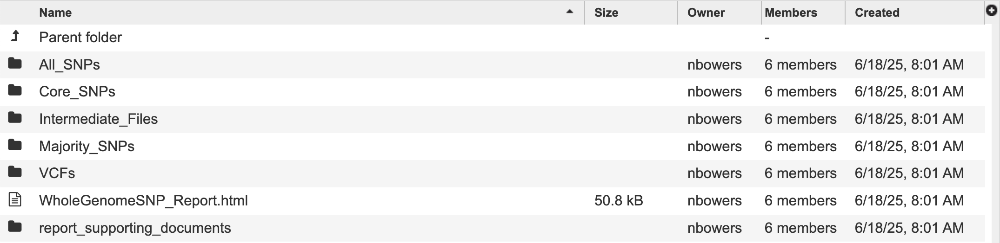

# Whole Genome SNP Analysis Service

*Revised: 16 June 2025*

 Whole Genome Sequencing (WGS) is used in bacterial and viral  genomics to determine the order of all, or most, of the nucleotides in a genome. This approach provides valuable insights for applicants such as epidemiological typing, drugresistance profiling and phylogeneticf analysis. 

 A key type of genetic variation identified through WGS is Single Nucleotide Polymorphism (SNP) a difference in a single nucleotide position in the genome. SNPs are critical for distinguishing bacterial strains, assessing genetic diversity, conducting outbreak surveillance, and correlating genotypic variation with phenotypic traits.
 
 Unlike many eukaryotic genomes, bacterial and viral genomes often contain large insertions and deleitions (indels), inversions and transpositions of genomic segments.  These features make whole-genome multiple sequence alignment particularly challenging. To address this, the SNP analysis service uses kSNP4.1, a tool that identifies SNPs without the need for full genome alignment.

 This service takes a genome group as input and:
 - Identifies SNPs across all genomes using k-mer-based analysis.
 - Constructs phylogenetic trees based on SNP differences.
 - Generates output files including a multiple alignment of SNP positions and per-genome SNP details.

The SNP results are categorized into three subset: 
All SNPs: includes every SNP detected in any genome, regardless of how many genomes contain it.
Core SNPs: only includes SNPs that are present in all genomes of the input genome group.
Majority SNPs: are present in within a define percentage of genomes (default: 50%). This threshold is defined by the user at runtime.

The kSNP4.1 pipeline processes genomes through four 
1.	K-mer identification: the tool identifies all k-mers (short nucleotide sequences of length k)  across all input genomes. The value of k is estimated using a kSNP4 internal function called “optimum k”. This step ensures optimal resolution for SNP detection. For more details, please refere to the [kSNP4 documentation](https://sourceforge.net/projects/ksnp/).

2.	SNP detection: kSNP4 detects SNPs by comparing the central base of homologous k-mers across your input genomes. If the flanking sequences are identical and only the central position difers, a SNP is called at that site. Aligned k-mer sequences and detected SNPs can be found in the output files corresponding to each genome subset.

3.	Matrix generation: The tool generates a SNP matrix indicating the presence or absence of each SNP across all genomes. This matrix forms the basis for further phylogenetic analysis. SNPs are categorized into three subgroups: All SNPs, Core SNPs, and Majority SNOs, based on their distribution across the input genomes.

4.	Tree construction: kSNP4 builds phylogenetic trees using three methods: Parsimony, Neighbor-Joining (NJ) and Maximum Likelihood (ML). These trees visualize the evolutionary relationships among the analyzed genomes based on SNP differences.

### See also
* [Whole Genome SNP](https://bv-brc.org/app/WholeGenomeSNPAnalysis)
* [Whole Genome SNP Quick Reference Guide](/quick_references/services/whole_genome_snp_analysis_service.html)

## Locating the Whole Genome SNP Service
1.	At the top of any BV-BRC page, find the Services tab.
2.	Click on Whole Genome SNP Analysis, which is under the Phylogenomics heading.
3.	This will open the Whole Genome SNP Analysis landing page where researchers can submit a genome group containing assembled genomes for SNP analysis.

## Select a Genome Group 
For more information about creating a genome group please visit our [documentation](https://www.bv-brc.org/docs/quick_references/workspaces/groups.html) or our [video tutorial](https://www.youtube.com/watch?v=BDCUyhX9brA&t=36s).

## Parameters

1.	The **Majority SNP Threshold** defines the portion of genomes that must contain the SNP in order to be included in the Majority SNP category. (see All SNPs, Core SNPs and Majority SNPs above).

2.	An **Output Folder** must be designated to hold the job results.

3.	Once an **Output Name** is selected, the job can be submitted. At this point, if a genome group is also selected, the Submit button turns blue and the job will be submitted once clicked.

4.	After clicking the submit button, your job will be launched. A successful submission will generate a message indicating that the job has been queued.

5.	The bottom of each BV-BRC page has an indicator that shows the number of jobs that are queued, running or completed. Clicking on the word Jobs will rewrite the page to show the Job status. Researchers can monitor the Jobs Status page to see the status of their job, which is indicated in the first column (Queued, Running, Complete, Failed). 

## Locating the Whole Genome SNP Analysis Job Results

1.	The Whole Genome SNP Analysis job can be located from three places on any BV-BRC page. Clicking on the Workspace tab will reveal two of the places where the workspace or jobs folder can be located, and from the Jobs monitor located at the lower right of any BV-BRC page. Either way, this will open your Jobs page.

.

2. Navigate to your job results.

3.	Clicking on the row that contains the job of interest will open two icons in the vertical green bar. To view the job, click on the View icon.

.

4.	This will open a page for the selected job. The results are divided into several sections, All SNPs, Core SNPs, Majority SNPs, Intermediate Files, and VCFs. There is also a comprehensive report.

.

5.	Information about the job, including the job ID, the running time, and the information of the data submitted can be viewed in the uppermost box. Clicking on Parameters will open a drop-down box that contains information about the samples submitted.

6.	Each job submitted to the Whole Genome SNP Analysis service will return a report that summarizes the results. To view this report, click on the row that contains the words “WholeGenomeSNP_Report.html”

7.	This report begins with a detailed description of the service and analysis workflow.

8.	Getting to Know the Input Data provides an overview of the input genomes and their associated metadata. A table provides summary statistics about the genomes. A bar plot displays each input genome’s length. There is an interactive metadata table that you can search, filter by column and sort. View more entries by selecting a greater value from the “Show entries” drop down above the table or by clicking on the page numbers below.

9.	The next section, Reviewing Identified SNPs provides the results in three subcategories, Total SNPs, Core SNPs, and Majority SNPs.

10.	A bar plot shows the number of SNPs in each subcategory. 

11.	Phylogenetic trees are a great way to view the relationship of the genomes. This service uses estimate phylogenetic trees based on 3 methods: parsimony, neighbor joining (NJ), and maximum likelihood (ML).
    * Parsimony the parsimony tree method is a good fit for small datasets with close relatives and low divergency. It estimated by creating a consensus of up to 100 equally parsimonious trees. It seeks a tree topology that explains the observed sequence data with the smallest possible number of evolutionary changes.
   	* Maximum Likelihood  (ML) the maximum likelihood tree is a good fit for datasets with substantial divergency and complex substitution patterns. It is constructed by finding the tree topology that has the highest likelihood of producing the observed sequence data.
   	* Neighbor Joining (NJ) this tree method is a good fit for exploratory analysis, especially with very large datasets. This is a distance-based method that constructs a tree by iteratively finding pairs of taxa (neighbors) that minimuze the total branch length at each step.  It uses distance matrix (pairwise genetic distances between sequences).
    Homoplastic SNPs are SNPs that occur in unrelated places on the same tree. They may differ according to the tree method.

    Please visit the kSNP4 documentation for more information about the many trees created by this service.
12.	The aim of the SNP Distance Heatmap and Metadata view is to show relationships between the genomes and hopefully identify patterns or clusters. The plot shows the number of SNPs that differ between the genomes. This is calculated by kSNP4’s companion program, kSNPdist. The x and y axsis are populated with the BV-BRC genome ID. This id is searchable across the website – however, replace the “_” with a “.”.
13.	There are a few ways to interact with this plot:
 *	Hovering over the plot all metadata is displayed (this is the same data as within the interactive table). The final item is the SNP distance value. In other words, the number of SNPs that differ between two genomes.
 * The legend on the right side of the plot color the plot according to linkage thresholds. This allows the user to define the number of SNPs defining  strong linkages, mid linkage and weak linkages. In other words, how closely related  two genomes are based on how many SNPs differ between them. 
 *	Dynamically set linkage thresholds by changing the values in Weak Linkage. The plot title will update to include this information.
 *	Choose SNP matrix allows user to toggle between the three subtypes.
 *	Reorder by Metadata Field allows the user to reorder the plot according to the metadata. The aim of this feature is revealing potential patterns associated to the metadata. The plot title will update.
 *	**Note**: Depending on the number of genomes in your genome group there may not be enough space to render every item on the x and y axis. Ensure you are looking the correct genome ID by viewing the hover data.
   
15.	The Phylogenetic Trees section of the report includes nine static images of the phylogenetic trees generated by kSNP4. Choosing the subset and tree method will flip through the tree images.
16.	For an interactive view of the tree, navigate to the job results. Then select the directory named with the SNP subtype you are interested in. For example, All_SNPs. All_SNPs, Core_SPS, and Majority_SNPs have the same file types and organizational structure.
17.	 Click the directory “Trees” to view the trees ending with the extension “.phyloxml”.
18.	 Each filename starts with Tree, then any special annotation, the SNP subtype and the tree method used to generate the tree. Click a tree to view, for example tree.SNPs_all.ML.tree.phyloxml.
19.	Then click the ‘view’ button to open our tree viewer.
20.	This tool outputs many trees where nodes are annotated with data from the analysis. Tree files ending in "phyloxml" can map metadat to the tree. The newick files are the same trees in their on directory. These files can also be uploaded to extrenal tree viewers. For a detailed tutorial about the website's internal tree viewer visit this [tutorial](https://www.bv-brc.org/docs/quick_references/services/archaeopteryx.html).

It is possible to be missing a tree. This happens when a given tree method is unable to make a sensible tree 
19.	The directory Cluster Information lists each locus with a list for which a tree node or homoplastic group of sequences the locus is present in. Note: the Group numbers in these files correspond to the groups listed in the Homoplasy_groups files.
20.	The directory Homoplasy files give the number of SNPs in each homoplastic group of genomes. These files are similar to. The Node_SNP_counts files, except for the groups of genomes that share SNPs but that do not correspond nodes of the tree. They give a group identifier (e.g. “Group.25” which corresponds to the info reported in the ClusterInfo files), and the number of target sequences that make up this group and the number of SNP alleles that are shared by this group of genomes, followed by the genome identities that make up the group.
21.	SNPs_all.tsv this file can be very large and may take a moment to load. It is tab separated will populate our TSV view and can also be opened with Excell.  This file shows the each alternative SNP, the SNP allele with the central base indicated by a dot. 
22.	SNPs_all_matrix.fasta this fasta file is formatted with the relaxed PHYLIP format of SNP alleles. The genome name followed by the SNP allele string. The SNP alleles for each genome are concatenated into a string whose length is the number of SNPs. Loci are concatenated in the same order as listed in the SNPs_all file. Missing SNPs are indicated by a dash.
23.	SNPs_all_matrix.txt this fasta file contains the same information as the SNPs_all_matrix.fasta. N indicates that the SNP is absent in that strain.

## References
1. Olson RD, Assaf R, Brettin T, Conrad N, Cucinell C, Davis JJ, Dempsey DM, Dickerman A, Dietrich EM, Kenyon RW, Kuscuoglu M, Lefkowitz EJ, Lu J, Machi D, Macken C, Mao C, Niewiadomska A, Nguyen M, Olsen GJ, Overbeek JC, Parrello B, Parrello V, Porter JS, Pusch GD, Shukla M, Singh I, Stewart L, Tan G, Thomas C, VanOeffelen M, Vonstein V, Wallace ZS, Warren AS, Wattam AR, Xia F, Yoo H, Zhang Y, Zmasek CM, Scheuermann RH, Stevens RL.

2. Hall, B. G., & Nisbet, J. (2023). Building phylogenetic trees from genome sequences with KSNP4. Molecular Biology and Evolution, 40(11). https://doi.org/10.1093/molbev/msad235
