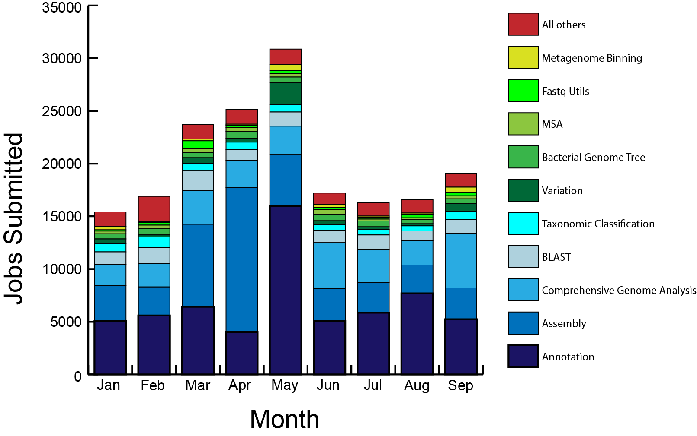

# Usage Metrics
For October 2025, unless otherwise noted

| Metric                                          | Value     |
| :---------------------------------------------  | :-------: |
| Total registered users                          |    72,621 |
| Analysis jobs submitted by users                |	   22,250 |
| Registered users that run a service             |     2,086 |
| Total storage used for user data (TB)           |     752.2 |
| Total site visits                               |    91,805 |
| Total unique visitors (avg/month)               |    52,230 |
| Total pageviews                                 | 1,772,083 |                      
| Avg. pages / visit                              |      19.3 |
| Avg. visits / visitor                           |      1.75 |
| Avg. visit duration (seconds)                   |       449 | 
| Citations to BV-BRC publications (cumulative)   |    28,483 |

 
 

**Analysis jobs submitted by users, by type**

