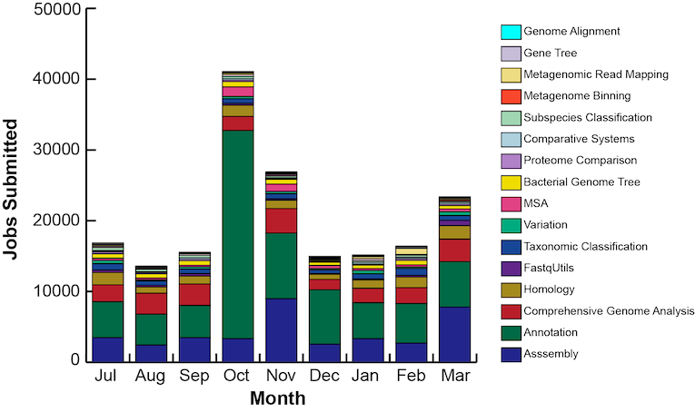

# Usage Metrics
For September 2025, unless otherwise noted

| Metric                                          | Value     |
| :---------------------------------------------  | :-------: |
| Total registered users                          |   70,731  |
| Analysis jobs submitted by users                |	  19,064  |
| Registered users that run a service             |    1,386  |
| Total storage used for user data (TB)           |      721  |
| Total site visits                               |  130,654  |
| Total unique visitors (avg/month)               |   89,262  |
| Total pageviews                                 | 1,698,384 |                      
| Avg. pages / visit                              |     12.99 |
| Avg. visits / visitor                           |      1.46 |
| Avg. visit duration (seconds)                   |       311 | 
| Citations to BV-BRC publications (cumulative)   |    27,120 |

 
 

**Analysis jobs submitted by users, by type**

